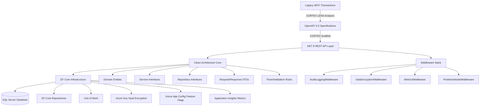

# STS Sample Applications — WCF→REST Modernization

**Generated by:** CORTEX DocumentationOrchestrator | **Updated:** 2026-02-22  
**Domain:** Software Transformation Studio (STS) | **CORTEX Tool:** LENS v3.0

---

## Overview

This directory contains **production-grade modernized .NET 8 microservices** produced by CORTEX's
Software Transformation Studio (STS). Each sample demonstrates the WCF → REST migration pattern
applied to real legacy financial services code.

CORTEX LENS analyzed the original WCF transaction classes, extracted business logic, generated
OpenAPI specifications, and scaffolded clean-architecture .NET 8 projects — with full test suites.

---

## Sample Applications

| Application | Domain | WCF Sources Migrated | API Routes |
|---|---|---|---|
| [`account-modernized/`](account-modernized/README.md) | Reimbursement Account (RA) Funding | `Updater_CreateAccountFundingInvoices`, `XGenerateFundingInvoice`, `XAddFundingInvoice` | `/api/v1/funding-invoices`, `/api/v1/funding-batches` |
| [`payment-processor-modernized/`](payment-processor-modernized/README.md) | Payment Transaction Processing | `Updater_CreatePaymentTransactionInvoices`, `XGenerateTransactionInvoice`, `XUpdateTransactionBatch` | `/api/v1/transaction-invoices`, `/api/v1/transaction-batches` |

## API Specifications

| Specification | Operations | Diagrams |
|---|---|---|
| [`account-api-specs/`](account-api-specs/) | `updater-createrafundinginvoices`, `xgeneratefundinginvoice`, `xupdatefundingbatch` | Flowchart, Sequence, Dependency (Mermaid) |
| [`payment-api-specs/`](payment-api-specs/) | `updater-createpaymenttransactioninvoices`, `xgeneratetransactioninvoice`, `xupdatetransactionbatch` | Flowchart, Sequence, Dependency (Mermaid) |

## Domain Models

| JSON File | Contents |
|---|---|
| `Account-Domain/domain-models/batch-3-*.json` | Entity models (FundingInvoice, FundingBatch, Subaccount, CashInOut) |
| `Account-Domain/domain-models/batch-4-*.json` | DTOs (request/response contracts) |
| `Account-Domain/domain-models/batch-5-*.json` | Service interface definitions |
| `Account-Domain/domain-models/batch-6-interfaces.json` | Repository interface contracts |

---

## Architecture Pattern

---

## Technology Stack

| Layer | Technology |
|---|---|
| Runtime | .NET 8 |
| API Framework | ASP.NET Core Web API |
| ORM | Entity Framework Core 8 |
| Database | SQL Server (Azure SQL) |
| Validation | FluentValidation |
| Feature Flags | Azure App Configuration |
| Encryption | Azure Key Vault |
| Monitoring | Application Insights |
| Observability | OpenTelemetry |
| CI/CD | Azure DevOps Pipelines |
| Container | Azure Container Apps |

---

## Modernization Highlights

### HIPAA Compliance
All entities include `CreatedBy`, `CreatedDate`, `ModifiedBy`, `ModifiedDate` audit fields.
`DataEncryptionMiddleware` encrypts PHI fields using Azure Key Vault before persistence.

### Clean Architecture
- **Core** — domain entities, interfaces, DTOs, validators (no infrastructure dependencies)
- **Infrastructure** — EF Core repos, Azure services (implements Core interfaces)
- **API** — controllers, middleware, DI registration (depends only on Core interfaces)

### Canary Deployment
`DataLayerRouter` enables progressive rollout: traffic gradually shifts from Mock → EF Core
repositories using Azure App Configuration feature flags, with automated rollback on metric breach.

### Contract Validation
`SchemaContractValidator` verifies the modernized API schema matches the legacy WCF contract,
ensuring zero regression during cutover.
