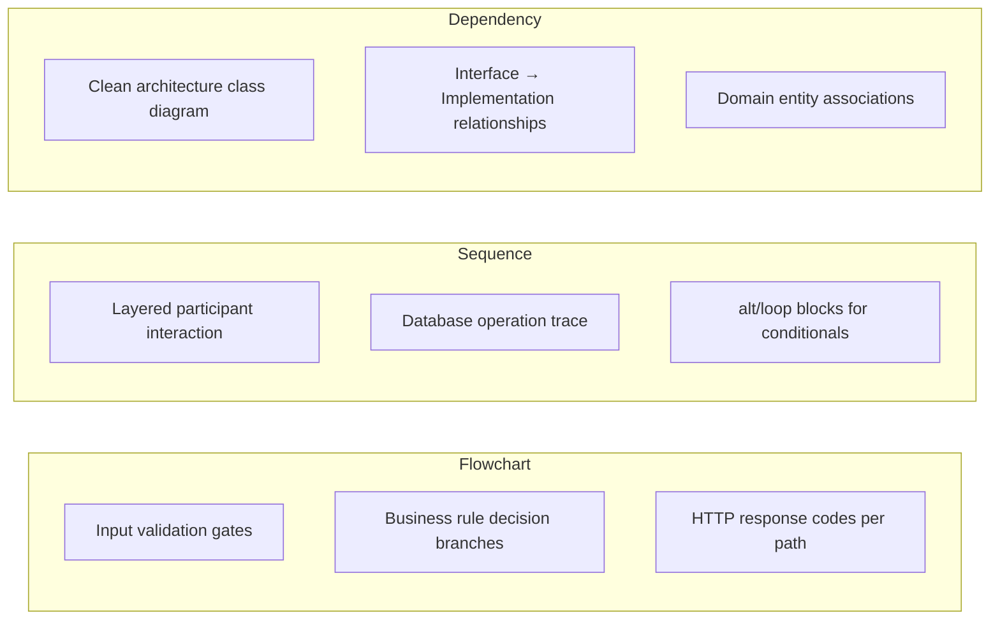

# Account API Specifications

**Generated by:** CORTEX LENS v3.0 | **Date:** 2025-12-15  
**Source:** Legacy `GCInteraction` WCF Services — Reimbursement Account Domain

---

## Overview

Reverse-engineered OpenAPI 3.0 specifications for the three WCF transactions that manage
**reimbursement account (RA) funding invoices**. Each specification includes full Mermaid
diagrams for flow visualization and sequence-level interaction tracing.

---

## Specifications

### `updater-createrafundinginvoices/`
Batch creation of funding invoices for multiple subaccounts.

| Artifact | Description |
|---|---|
| `openapi.yaml` | OpenAPI 3.0 spec: `POST /api/ra/create-rafunding-invoices` |
| `openapi.json` | JSON format of the same spec |
| `diagrams/flowchart.mmd` | Input validation + batch processing decision tree |
| `diagrams/sequence.mmd` | Controller → Service → Repository → DB interaction trace |
| `diagrams/dependency.mmd` | Class dependency diagram (clean architecture) |

---

### `xgeneratefundinginvoice/`
On-demand funding invoice generation using peg amount business logic.

| Artifact | Description |
|---|---|
| `openapi.yaml` | OpenAPI 3.0 spec: `POST /api/ra/generate-funding-invoice` |
| `openapi.json` | JSON format |
| `diagrams/flowchart.mmd` | Peg check decision tree (balance vs invoice amount) |
| `diagrams/sequence.mmd` | Service → SubaccountRepository → peg logic → DB flow |
| `diagrams/dependency.mmd` | Class dependency diagram (clean architecture) |

---

### `xupdatefundingbatch/`
Funding batch status update with CashInOut record linkage.

| Artifact | Description |
|---|---|
| `openapi.yaml` | OpenAPI 3.0 spec: `PUT /api/ra/update-funding-batch` |
| `openapi.json` | JSON format |
| `diagrams/flowchart.mmd` | Validation + batch status update flow |
| `diagrams/sequence.mmd` | Batch repository interaction trace |
| `diagrams/dependency.mmd` | Class dependency diagram |

---

## Diagram Types



---

## Rendering Diagrams

All `.mmd` files are valid Mermaid syntax. Render with:

```bash
# VS Code: Install "Mermaid Preview" extension
# GitHub: .mmd files render inline in README/PR views
# CLI: npx @mermaid-js/mermaid-cli -i file.mmd -o file.png
mmdc -i diagrams/sequence.mmd -o diagrams/sequence.png
```
