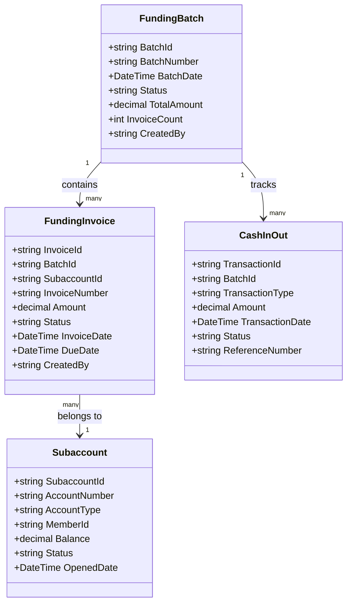
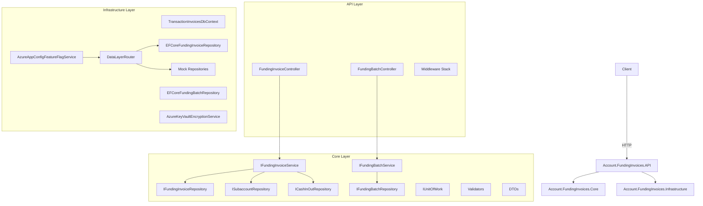
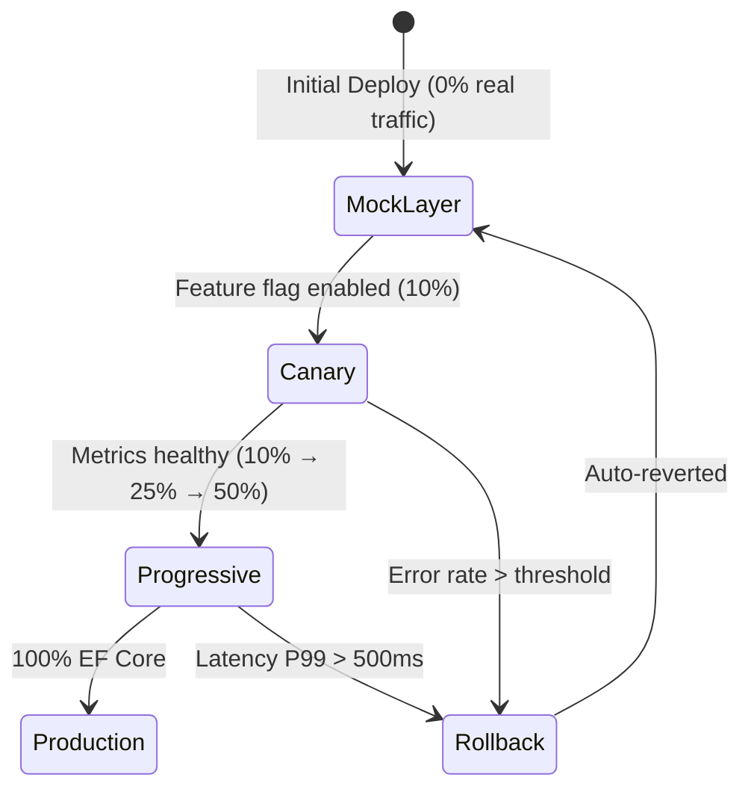

# Account Funding Invoices — Modernized REST API

**Updated:** 2026-02-22 | **Source:** WCF Legacy `GCInteraction` Services  
**Runtime:** .NET 8 | **Pattern:** Clean Architecture + EF Core + Azure Services

---

## What This Application Does

Manages **reimbursement account (RA) funding invoices** — the financial records that track employer
and employee contributions to HSA/FSA/HRA accounts. Migrated from three legacy WCF transactions:

| Legacy WCF Class | REST Endpoint | Operation |
|---|---|---|
| `XAddFundingInvoice.cs` | `POST /api/v1/funding-invoices` | Create payroll-based funding invoice |
| `XGenerateFundingInvoice.cs` | `POST /api/v1/funding-invoices/generate` | Generate on-demand invoice (peg logic) |
| `Updater_CreateAccountFundingInvoices.cs` | `POST /api/v1/funding-invoices/batch` | Batch create invoices for multiple subaccounts |
| `XUpdateFundingBatch.cs` | `PUT /api/v1/funding-batches/{batchId}` | Update batch status |

---

## Domain Model



---

## API Reference

### POST `/api/v1/funding-invoices`
Creates a payroll-based funding invoice for a single subaccount.

**Request:**
```json
{
  "employerId": "EMP-001",
  "subaccountId": "SA-001",
  "reimbursementPlanId": "RP-001",
  "employerFundingDefault": 500.00,
  "employeeFundingDefault": 250.00,
  "effectiveDate": "2026-01-15T00:00:00Z",
  "invoiceDescription": "Payroll funding Q1",
  "isLSA": false,
  "createdBy": "payroll-system"
}
```

**Response `201 Created`:**
```json
{
  "invoiceId": "INV-2026-001",
  "batchId": "BATCH-001",
  "subaccountId": "SA-001",
  "invoiceNumber": "FI-20260115-001",
  "amount": 750.00,
  "status": "Pending"
}
```

---

### POST `/api/v1/funding-invoices/generate`
Generates an on-demand invoice only if subaccount balance is below the peg amount.

**Business Rule:** If `balance < invoiceAmount`, create invoice. Otherwise return `"not needed"`.

**Request:**
```json
{
  "subaccountId": "SA-001",
  "invoiceAmount": 500.00,
  "invoiceDate": "2026-01-15T00:00:00Z",
  "createdBy": "system"
}
```

**Response `200 OK`:**
```json
{
  "result": "invoice created",
  "invoiceId": "INV-2026-002",
  "cashInOutId": "CIO-001"
}
```

---

### POST `/api/v1/funding-invoices/batch`
Creates funding invoices for multiple subaccounts in a single batch operation.
Handles partial success — failed subaccounts are reported without rolling back successes.

**Request:**
```json
{
  "cashInOutId": "CIO-BATCH-001",
  "subaccountIds": ["SA-001", "SA-002", "SA-003"],
  "employerFundingAmount": 500.00,
  "createdBy": "payroll-system"
}
```

**Response `201 Created`:**
```json
{
  "successCount": 2,
  "failureCount": 1,
  "failedSubaccounts": ["SA-002"]
}
```

---

## Architecture



---

## Middleware Stack

| Middleware | Purpose |
|---|---|
| `AuditLoggingMiddleware` | Records all API calls for HIPAA audit trail |
| `DataEncryptionMiddleware` | Encrypts/decrypts PHI fields via Azure Key Vault |
| `MetricsMiddleware` | Emits latency and throughput metrics to Application Insights |
| `ProblemDetailsMiddleware` | Normalises all errors to RFC 7807 `ProblemDetails` format |

---

## Canary Deployment

The `DataLayerRouter` implements progressive rollout from Mock → EF Core repositories:



---

## Running Locally

```bash
# Restore dependencies
dotnet restore

# Build
dotnet build

# Run unit tests
dotnet test tests/Account.FundingInvoices.UnitTests/

# Run integration tests
dotnet test tests/Account.FundingInvoices.IntegrationTests/

# Start API (development mode — uses Mock repositories)
dotnet run --project src/Account.FundingInvoices.API/

# API available at: http://localhost:5000/api/v1/
# Swagger UI: http://localhost:5000/swagger
```

---

## Test Coverage

| Layer | Test Project | Key Areas |
|---|---|---|
| Unit | `Account.FundingInvoices.UnitTests` | Services, validators, mock repos, encryption, metrics, feature flags |
| Integration | `Account.FundingInvoices.IntegrationTests` | EF Core repos, schema validation, feature flag integration, rollback monitoring |

---

## Related Specifications

- [OpenAPI Spec — Batch Create](../account-api-specs/specifications/updater-createrafundinginvoices/openapi.yaml)
- [OpenAPI Spec — Generate Invoice](../account-api-specs/specifications/xgeneratefundinginvoice/openapi.yaml)
- [Sequence Diagram — Batch Create](../account-api-specs/specifications/updater-createrafundinginvoices/diagrams/sequence.mmd)
- [Sequence Diagram — Generate Invoice](../account-api-specs/specifications/xgeneratefundinginvoice/diagrams/sequence.mmd)
