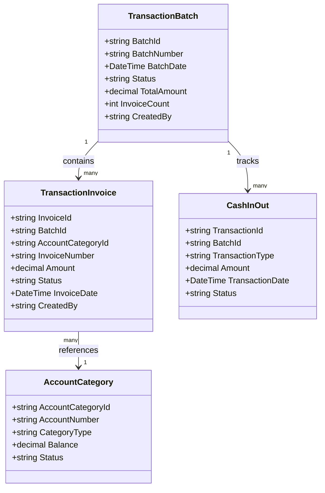
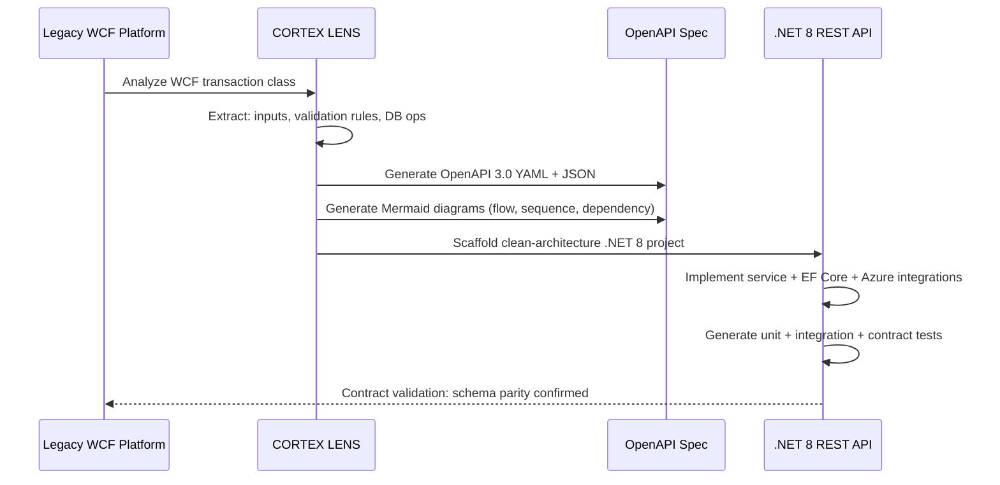
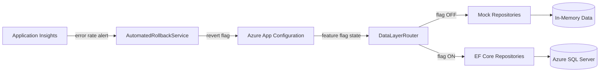

# Payment Processor — Transaction Invoices REST API

**Updated:** 2026-02-22 | **Source:** WCF Legacy Payment Processing Services  
**Runtime:** .NET 8 | **Pattern:** Clean Architecture + EF Core + Azure Services

---

## What This Application Does

Manages **payment transaction invoices** — records of payment plan transactions processed through
the platform. Migrated from three legacy WCF transactions:

| Legacy WCF Class | REST Endpoint | Operation |
|---|---|---|
| `XGenerateTransactionInvoice.cs` | `POST /api/v1/transaction-invoices/generate` | Generate on-demand invoice (peg logic) |
| `Updater_CreatePaymentTransactionInvoices.cs` | `POST /api/v1/transaction-invoices/batch` | Batch create invoices for multiple account categories |
| `XUpdateTransactionBatch.cs` | `PUT /api/v1/transaction-batches/{batchId}` | Update batch status and link cash record |

---

## Domain Model



---

## API Reference

### POST `/api/v1/transaction-invoices/generate`
Generates a transaction invoice only if the account category balance is below the peg amount.

**Business Rule:** `balance < invoiceAmount` → create invoice; otherwise return `"not needed"`.

**Request:**
```json
{
  "account_categoryId": "AC-001",
  "invoiceAmount": 500.00,
  "invoiceDate": "2026-01-15T00:00:00Z",
  "createdBy": "system"
}
```

**Response `200 OK`:**
```json
{
  "result": "invoice created",
  "cashInOutId": "CIO-001",
  "invoice": {
    "invoiceId": "TI-2026-001",
    "amount": 500.00,
    "status": "Pending"
  }
}
```

---

### POST `/api/v1/transaction-invoices/batch`
Creates transaction invoices for multiple account categories in one operation.
Partial success is supported — failures are reported per account category.

**Request:**
```json
{
  "cashInOutId": "CIO-BATCH-001",
  "accountCategoryIds": ["AC-001", "AC-002", "AC-003"],
  "transactionAmount": 500.00,
  "createdBy": "payment-processor"
}
```

**Response `201 Created`:**
```json
{
  "successCount": 3,
  "failureCount": 0,
  "failedAccountCategories": []
}
```

---

### PUT `/api/v1/transaction-batches/{batchId}`
Updates a transaction batch's status and links it to a cash-in/out record.

**Request:**
```json
{
  "cashInOutId": "CIO-001",
  "status": "Closed",
  "updatedBy": "system"
}
```

**Response `200 OK`:**
```json
{
  "batchId": "BATCH-001",
  "status": "Closed",
  "updatedDate": "2026-01-15T10:30:00Z"
}
```

---

## Architecture

```mermaid
graph TD
    Client -->|HTTP| API[PaymentProcessor.TransactionInvoices.API]

    subgraph API Layer
        Ctrl1[TransactionInvoiceController]
        Ctrl2[TransactionBatchController]
        MW1[AuditLoggingMiddleware]
        MW2[DataEncryptionMiddleware]
        MW3[MetricsMiddleware]
        MW4[ProblemDetailsMiddleware]
    end

    subgraph Core Layer
        ISvc1[ITransactionInvoiceService]
        ISvc2[ITransactionBatchService]
        IRepo1[ITransactionInvoiceRepository]
        IRepo2[ITransactionBatchRepository]
        IRepo3[IAccountCategoryRepository]
        IRepo4[ICashInOutRepository]
        IUoW[IUnitOfWork]
        IFeature[IFeatureFlagService]
        IEncrypt[IEncryptionService]
        IMetrics[IMetricsCollector]
        IRollback[IRollbackTrigger]
    end

    subgraph Infrastructure Layer
        EFCtx[TransactionInvoicesDbContext]
        Router[DataLayerRouter]
        AzureKV[AzureKeyVaultEncryptionService]
        AzureAC[AzureAppConfigFeatureFlagService]
        AppInsights[ApplicationInsightsMetricsCollector]
        AutoRollback[AutomatedRollbackService]
        MockRepos[Mock Repositories]
        EFRepos[EF Core Repositories]
    end

    Ctrl1 --> ISvc1
    Ctrl2 --> ISvc2
    ISvc1 --> IRepo1
    ISvc1 --> IRepo3
    ISvc1 --> IRepo4
    ISvc2 --> IRepo2
    Router --> EFRepos
    Router --> MockRepos
    AzureAC --> Router
    IEncrypt --> AzureKV
    IMetrics --> AppInsights
    IRollback --> AutoRollback
```



---

## WCF → REST Migration Map



---

## Feature Flag–Driven Canary Rollout



---

## Test Suite

| Project | Type | Coverage Area |
|---|---|---|
| `PaymentProcessor.TransactionInvoices.UnitTests` | Unit | Services, validators, mock repos, encryption, metrics, rollback |
| `PaymentProcessor.TransactionInvoices.IntegrationTests` | Integration | Feature flags, encryption middleware, monitoring, schema validation |
| `PaymentProcessor.TransactionInvoices.API.Tests` | API | Controllers, problem details middleware |
| `PaymentProcessor.TransactionInvoices.Core.Tests` | Core | Legacy business logic parity tests |
| `PaymentProcessor.TransactionInvoices.ContractTests` | Contract | WCF→REST schema contract verification engine |

---

## Running Locally

```bash
# Restore and build
dotnet restore && dotnet build

# Run all tests
dotnet test

# Start API (Mock repositories active by default)
dotnet run --project src/PaymentProcessor.TransactionInvoices.API/

# Swagger UI: http://localhost:5001/swagger
```

---

## Related Specifications

- [OpenAPI — Generate Transaction Invoice](../payment-api-specs/specifications/xgeneratetransactioninvoice/openapi.yaml)
- [OpenAPI — Batch Create Invoices](../payment-api-specs/specifications/updater-createpaymenttransactioninvoices/openapi.yaml)
- [OpenAPI — Update Transaction Batch](../payment-api-specs/specifications/xupdatetransactionbatch/openapi.yaml)
- [Sequence — Generate Invoice](../payment-api-specs/specifications/xgeneratetransactioninvoice/diagrams/sequence.mmd)
- [Sequence — Batch Create](../payment-api-specs/specifications/updater-createpaymenttransactioninvoices/diagrams/sequence.mmd)
- [Dependency — Batch Create](../payment-api-specs/specifications/updater-createpaymenttransactioninvoices/diagrams/dependency.mmd)
