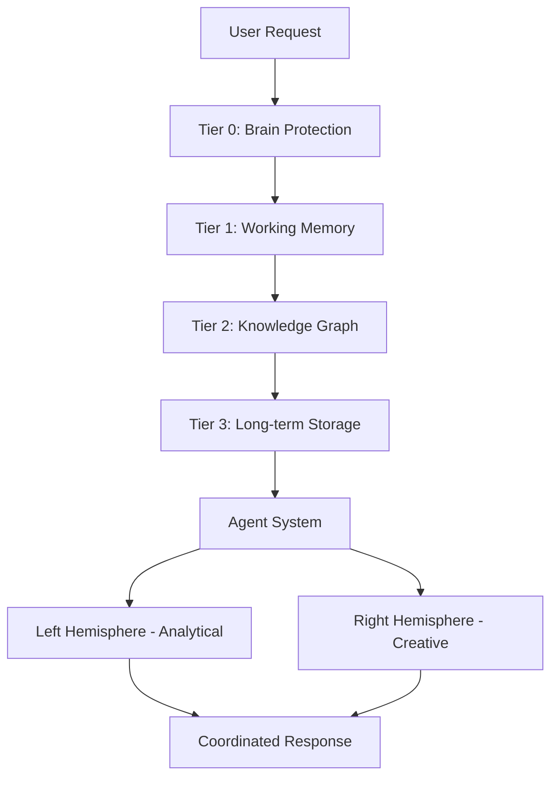
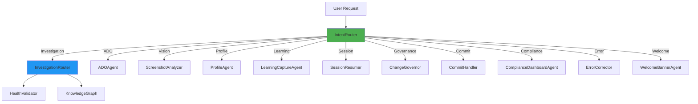

<!-- Architecture synchronized: 2025-12-01T15:51:16.091835 -->

# CORTEX Architecture

**Version:** 3.5.0  
**Status:** Production Ready  
**Author:** Asif Hussain

---

## 🎯 System Overview

CORTEX is built on a **4-tier brain architecture** inspired by human cognition, with a **94-agent intelligent routing system**, **30-orchestrator workflow system**, **native investigation capabilities** for root cause analysis, and **persistent memory** across sessions.



**Architecture Principles:**
- **Memory-First Design:** All interactions persist across sessions
- **Agent Specialization:** 16 intelligent agents for routing, analysis, and decision-making
- **Orchestrator Coordination:** 28 workflow orchestrators for multi-step operations
- **Investigation System:** Native 3-phase RCA capabilities with token budget management
- **Protection Layer:** Brain protection rules prevent context overflow
- **Extensibility:** Plugin system for custom operations

---

## 🧠 Tier 0: Brain Protection (SKULL Rules)

**Purpose:** Entry point validation and token budget enforcement

### Key Components

**1. Entry Point (`CORTEX.prompt.md`)**
- Token budget: 5,000 tokens (hard limit)
- Template-based responses (no Python execution)
- Module architecture (external documentation references)
- Performance target: <3,500 tokens

**2. Brain Protection Rules (`brain-protection-rules.yaml`)**
```yaml
skull_rules:
  S01_token_budget:
    limit: 5000
    enforcement: BLOCKING
    penalty: "Reject request exceeding token budget"
  
  K02_modular_architecture:
    requirement: "Use #file: references for documentation"
    enforcement: WARNING
  
  U03_no_python_execution:
    requirement: "Template-based responses only"
    enforcement: BLOCKING
  
  L04_performance_target:
    target: 3500 tokens
    enforcement: IDEAL
```

**3. Template System**
- 31+ response templates
- Trigger-based selection
- YAML-driven configuration
- AI-readable instructions embedded in prompt

### Protection Mechanisms

| Rule | Purpose | Enforcement |
|------|---------|-------------|
| Token Budget | Prevent context overflow | BLOCKING |
| Modular Architecture | Keep prompt maintainable | WARNING |
| No Python Execution | AI compatibility | BLOCKING |
| Performance Target | Optimize response time | IDEAL |

**References:**
- Mermaid Diagram: `diagrams/mermaid/brain-protection.mmd`
- DALL-E Prompt: `diagrams/prompts/06-brain-protection-prompt.md`

---

## 💾 Tier 1: Working Memory (Conversation Manager)

**Purpose:** Recent conversation storage and context retrieval

### Architecture

```python
# Simplified architecture
ConversationManager:
    - store_conversation(user_msg, assistant_msg, context)
    - retrieve_recent(limit=10)
    - search_conversations(query, filters)
    - import_conversations(file_path)
    - export_conversations(output_path)
```

### Database Schema

**SQLite Storage** (`cortex-brain/tier1/conversation-history.db`)

```sql
CREATE TABLE conversations (
    id INTEGER PRIMARY KEY,
    timestamp DATETIME,
    user_message TEXT,
    assistant_response TEXT,
    context_data JSON,
    workspace TEXT,
    session_id TEXT,
    tokens_used INTEGER
);

CREATE INDEX idx_timestamp ON conversations(timestamp);
CREATE INDEX idx_workspace ON conversations(workspace);
CREATE INDEX idx_session ON conversations(session_id);
```

### Operations

**Storage:**
- Auto-save every conversation
- Context metadata (workspace, file, line)
- Token usage tracking

**Retrieval:**
- Recent conversations (last N)
- Search by keyword
- Filter by workspace/session

**Import/Export:**
- JSON format for portability
- Conversation vault for backups
- Cross-workspace transfer

**Capacity:**
- Unlimited conversations
- Automatic cleanup (configurable retention)
- Compression for old conversations

**References:**
- Mermaid Diagram: `diagrams/mermaid/conversation-tracking.mmd`
- DALL-E Prompt: `diagrams/prompts/04-conversation-tracking-prompt.md`

---

## 🕸️ Tier 2: Knowledge Graph (Pattern Learning)

**Purpose:** Semantic pattern learning and relationship extraction

### Architecture

```yaml
knowledge_graph:
  entities:
    - type: class
      confidence: 0.95
      namespace: protected
    
    - type: function
      confidence: 0.85
      namespace: public
  
  relationships:
    - source: UserService
      target: Database
      type: depends_on
      confidence: 0.90
  
  patterns:
    - pattern: "authentication workflow"
      occurrences: 15
      confidence: 0.93
```

### Components

**1. Entity Extraction**
- Classes, functions, modules
- Confidence scoring (0.0 - 1.0)
- Namespace protection (CORTEX internals off-limits)

**2. Relationship Mapping**
- Dependencies (imports, calls)
- Inheritance hierarchies
- Data flow paths

**3. Pattern Recognition**
- Coding style patterns
- Architecture patterns
- Naming conventions

### Confidence Weighting

| Confidence | Meaning | Action |
|------------|---------|--------|
| 0.9 - 1.0 | High certainty | Use without confirmation |
| 0.7 - 0.89 | Medium certainty | Use with validation |
| 0.5 - 0.69 | Low certainty | Suggest, don't assume |
| < 0.5 | No certainty | Ignore or ask user |

### Smart Context Retrieval

**Algorithm:**
1. Extract entities from user request
2. Find related entities in knowledge graph
3. Score relevance based on relationships
4. Inject top N entities into context
5. Track retrieval success for learning

**References:**
- Mermaid Diagram: `diagrams/mermaid/information-flow.mmd`
- DALL-E Prompt: `diagrams/prompts/03-information-flow-prompt.md`

---

## 📚 Tier 3: Long-term Storage (Development Context)

**Purpose:** Workspace-specific patterns and historical archive

### Storage Structure

```
cortex-brain/tier3/
├── workspace-contexts/
│   ├── project-a.yaml      # Project A patterns
│   ├── project-b.yaml      # Project B patterns
│   └── project-c.yaml      # Project C patterns
├── historical-archive/
│   ├── 2024-11/            # Monthly archives
│   ├── 2024-12/
│   └── 2025-01/
└── pattern-evolution/
    ├── authentication.yaml  # How auth patterns evolved
    ├── testing.yaml         # Testing strategy evolution
    └── deployment.yaml      # Deployment pattern evolution
```

### Context Files

**Example:** `project-a.yaml`

```yaml
workspace:
  name: "Project A"
  path: "/path/to/project-a"
  language: "Python"
  framework: "FastAPI"

patterns:
  coding_style:
    - "Type hints required for all functions"
    - "Docstrings follow Google style"
    - "Max line length: 100 characters"
  
  testing:
    - "Pytest for unit tests"
    - "Coverage target: 90%+"
    - "Integration tests in tests/integration/"
  
  architecture:
    - "Layered architecture (routes, services, models)"
    - "Dependency injection via FastAPI Depends"
    - "SQLAlchemy for ORM"

preferences:
  error_handling: "Raise custom exceptions, not generic Exception"
  logging: "Structured logging with loguru"
  documentation: "Auto-generate API docs with Swagger"

historical_decisions:
  - date: "2024-11-01"
    decision: "Migrated from Flask to FastAPI"
    reason: "Better async support and type safety"
  
  - date: "2024-12-15"
    decision: "Adopted Pydantic v2"
    reason: "Performance improvements and validation features"
```

### Pattern Evolution

**Tracks how patterns change over time:**

```yaml
pattern: "authentication"
evolution:
  - version: 1
    date: "2024-01-15"
    approach: "Session-based auth"
    reason: "Simple monolithic app"
  
  - version: 2
    date: "2024-06-20"
    approach: "JWT tokens"
    reason: "Migrated to microservices"
  
  - version: 3
    date: "2024-11-10"
    approach: "OAuth2 with refresh tokens"
    reason: "Security audit recommendations"
```

**References:**
- Pattern storage in `cortex-brain/tier3/`
- Archive compression for old data
- Cross-session learning enabled

---

## 🤖 Agent System (Intelligent Routing & Analysis)

**Purpose:** 16 specialized agents for intelligent routing, analysis, and decision-making

### Architecture Overview



### Core Routing Agents

**1. IntentRouter** (`intent_router.py`)
- **Purpose**: Central routing hub for all CORTEX requests
- **Capabilities**:
  - Intent detection using 40+ intent types
  - Natural language pattern matching
  - Multi-agent routing and coordination
  - Investigation pattern detection
- **Integration**: Routes to all specialized agents based on intent classification
- **Key Methods**: `_is_investigation_request()`, `_handle_investigation_request()`, `execute()`

**2. InvestigationRouter** (`investigation_router.py`)
- **Purpose**: Deep-dive root cause analysis and systematic investigation
- **Capabilities**:
  - 3-phase investigation system (Discovery → Analysis → Synthesis)
  - Token budget management (5,000 tokens total)
  - Root cause identification (performance, error, functional)
  - Pattern analysis and recommendation generation
- **Integration**: Triggered by IntentRouter for "investigate why..." commands
- **See Section**: Investigation & RCA System (below) for detailed documentation

### Specialized Analysis Agents

**3. ScreenshotAnalyzer** (`screenshot_analyzer.py`)
- **Purpose**: Vision-based analysis of UI mockups and error screenshots
- **Capabilities**:
  - UI element extraction (buttons, inputs, labels)
  - Error message analysis from screenshots
  - ADO work item field extraction
  - Architecture diagram component detection
- **Use Cases**: Planning with mockups, bug reporting with screenshots

**4. ProfileAgent** (`profile_agent.py`)
- **Purpose**: User profile management and preference tracking
- **Capabilities**:
  - Interaction mode configuration (autonomous/guided/educational/pair)
  - Experience level tracking (junior/mid/senior/expert)
  - Tech stack preference management
  - Profile CRUD operations
- **Integration**: Tier 1 working memory for persistence

**5. LearningCaptureAgent** (`learning_capture_agent.py`)
- **Purpose**: Capture and store learning patterns
- **Capabilities**:
  - Pattern extraction from conversations
  - Lesson learned documentation
  - Success/failure pattern tracking
  - Cross-session learning persistence
- **Integration**: Tier 2 knowledge graph for pattern storage

### Integration Agents

**6. ADOAgent** (`ado_agent.py`)
- **Purpose**: Azure DevOps integration
- **Capabilities**:
  - Work item creation (stories, features, bugs)
  - Pull request analysis
  - Work summary generation
  - Story point estimation
- **Integration**: ADO REST API, ADO work item orchestrator

### Governance & Quality Agents

**7. ChangeGovernor** (`change_governor.py`)
- **Purpose**: Change governance and validation
- **Capabilities**:
  - Change impact analysis
  - Risk assessment (low/medium/high/critical)
  - Approval workflow enforcement
  - Compliance validation
- **Integration**: Tier 0 brain protection rules

**8. CommitHandler** (`commit_handler.py`)
- **Purpose**: Git commit management
- **Capabilities**:
  - Commit message generation
  - Pre-commit validation
  - Commit history analysis
  - Merge conflict detection
- **Integration**: Git checkpoint orchestrator

**9. ComplianceDashboardAgent** (`compliance_dashboard_agent.py`)
- **Purpose**: Compliance tracking and reporting
- **Capabilities**:
  - Compliance rule validation
  - Dashboard generation
  - Compliance metrics tracking
  - Violation reporting
- **Integration**: Compliance tracking schema (Tier 3)

**10. ErrorCorrector** (`error_corrector.py`)
- **Purpose**: Automated error correction
- **Capabilities**:
  - Error pattern detection
  - Auto-fix suggestions
  - Error classification (syntax, logic, runtime)
  - Fix template generation
- **Integration**: TDD workflow, refactoring intelligence

### Session Management Agents

**11. SessionResumer** (`session_resumer.py`)
- **Purpose**: Session continuity and context restoration
- **Capabilities**:
  - Session state persistence
  - Context restoration from Tier 1
  - Active plan resumption
  - Conversation history reconstruction
- **Integration**: Tier 1 working memory, planning orchestrator

**12. WelcomeBannerAgent** (`welcome_banner_agent.py`)
- **Purpose**: User onboarding and welcome interface
- **Capabilities**:
  - Governance banner display
  - Onboarding workflow initialization
  - First-time setup detection
  - Interactive introduction
- **Integration**: Onboarding orchestrator

### Infrastructure Components

**13. BaseAgent** (`base_agent.py`)
- **Purpose**: Base class for all agents
- **Provides**:
  - Standard agent interface
  - Request/response handling
  - Logging and telemetry
  - Error handling patterns
- **Pattern**: Abstract base class with `can_handle()` and `execute()` methods

**14. AgentTypes** (`agent_types.py`)
- **Purpose**: Type definitions and intent mappings
- **Contains**:
  - AgentType enum (16 agent types)
  - IntentType enum (40+ intent types)
  - INTENT_AGENT_MAP for routing
  - Priority, ResponseStatus, RiskLevel enums
- **Integration**: IntentRouter uses for classification

**15. Exceptions** (`exceptions.py`)
- **Purpose**: Agent exception hierarchy
- **Defines**: Agent-specific exceptions for error handling

**16. Utils** (`utils.py`)
- **Purpose**: Shared agent utilities
- **Provides**: Common utility functions for agents

### Agent Selection & Routing

**IntentRouter Classification Process:**

```python
def classify_intent(user_message: str) -> IntentClassificationResult:
    """
    40+ intent types classified:
    - Planning: PLAN, FEATURE, TASK_BREAKDOWN
    - Architecture: ARCHITECTURE, ANALYZE_STRUCTURE, CRAWL_SYSTEM
    - Execution: CODE, IMPLEMENT, CREATE_FILE, EDIT_FILE
    - Testing: TEST, TDD, RUN_TESTS
    - Validation: HEALTH_CHECK, VALIDATE, REVIEW
    - Investigation: (routes to InvestigationRouter)
    - Error: FIX, DEBUG, ERROR
    - ADO: ADO_WORKITEM, ADO_STORY, CODE_REVIEW
    - Estimation: ESTIMATE, TIMEFRAME, STORY_POINTS
    """
    
    # Pattern matching with confidence scoring
    intent = detect_intent_pattern(user_message)
    
    # Map to agent using INTENT_AGENT_MAP
    agent_type = INTENT_AGENT_MAP.get(intent)
    
    return IntentClassificationResult(
        intent=intent,
        confidence=calculate_confidence(user_message),
        agent_type=agent_type,
        rule_context=get_tier0_rules(intent)
    )
```

**Agent vs Orchestrator Distinction:**

| Aspect | Agents | Orchestrators |
|--------|--------|---------------|
| **Purpose** | Intelligent routing, analysis, decision-making | Workflow coordination, multi-step operations |
| **Scope** | Single-responsibility operations | Complex multi-agent workflows |
| **Examples** | IntentRouter, InvestigationRouter, ScreenshotAnalyzer | TDDOrchestrator, PlanningOrchestrator, RollbackOrchestrator |
| **Count** | 16 specialized agents | 28 workflow orchestrators |
| **Collaboration** | Direct routing by IntentRouter | Coordinate multiple agents |

**References:**
- Agent Source Code: `src/cortex_agents/`
- Type Definitions: `src/cortex_agents/agent_types.py`
- Orchestrator Documentation: See Orchestrator System section below

---

## 🎼 Orchestrator System (Workflow Coordination & Multi-Step Operations)

**Purpose:** 28 specialized orchestrators coordinate complex multi-step workflows, integrate multiple agents, and manage end-to-end processes

### Orchestrator vs Agent Distinction

While **agents** handle single-responsibility operations (routing, analysis, decision-making), **orchestrators** coordinate multi-step workflows that integrate multiple agents and manage process state:

| Aspect | Agents | Orchestrators |
|--------|--------|---------------|
| **Purpose** | Intelligent routing, analysis, decision-making | Workflow coordination, multi-step operations |
| **Scope** | Single-responsibility operations | Complex multi-agent workflows |
| **State Management** | Stateless (request → response) | Stateful (track progress across phases) |
| **Examples** | IntentRouter, InvestigationRouter, ScreenshotAnalyzer | TDDOrchestrator, PlanningOrchestrator, RollbackOrchestrator |
| **Count** | 16 specialized agents | 28 workflow orchestrators |
| **Collaboration** | Direct routing by IntentRouter | Coordinate multiple agents through workflow |
| **Execution** | Synchronous (immediate response) | May span multiple interactions with checkpoints |

**Example Workflow (TDD Cycle):**
```
User: "start tdd for authentication"
  ↓
IntentRouter detects TDD intent
  ↓
TDDOrchestrator coordinates multi-phase workflow:
  Phase 1 (RED): Planner Agent → Test Generator → Validator
  Phase 2 (GREEN): Executor Agent → Test Runner → Validator
  Phase 3 (REFACTOR): Analyzer Agent → Refactoring Engine → Test Runner
  ↓
Returns: Complete TDD session report with checkpoints
```

### Orchestrator Categories

#### 1. Workflow Management Orchestrators (5)

**TDDOrchestrator** (`tdd_orchestrator.py`):
- Coordinates test-driven development red-green-refactor cycle
- Phases: RED (write failing tests) → GREEN (minimal implementation) → REFACTOR (improve code)
- Git checkpoint integration at each phase boundary
- Automatic test execution and validation
- Performance-based refactoring recommendations
- Integration: TestDesigner Agent, Executor Agent, Validator Agent, Git Checkpoint Orchestrator

**CodeReviewOrchestrator** (`code_review_orchestrator.py`):
- Coordinates code review workflow from PR submission to approval
- Dependency-driven code crawling (5-10K token efficiency)
- Multi-tier analysis (Quick 30s / Standard 2min / Deep 5min)
- Generates actionable fix templates with priority matrix
- Integration: HealthValidator, Analyzer Agent, Feedback Agent

**PlanningOrchestrator** (`planning_orchestrator.py`):
- Coordinates feature planning from concept to approved plan
- Definition of Ready (DoR) validation with zero ambiguity enforcement
- Interactive clarification workflow for vague requirements
- Security review integration (OWASP checklist)
- File-based planning documents (git-trackable, resumable)
- Vision API integration for screenshot-driven planning
- Integration: Planner Agent, Screenshot Analyzer, ADO Agent

**CommitOrchestrator** (`commit_orchestrator.py`):
- Coordinates git commit workflow with safety checks
- Pre-commit validation (lint, tests, security scan)
- Commit message generation following conventional commits
- Dirty state detection and user consent workflow
- Pull-merge-push coordination with conflict detection
- Integration: CommitHandler Agent, Git Checkpoint Orchestrator, HealthValidator

**RealignmentOrchestrator** (`realignment_orchestrator.py`):
- Coordinates system realignment and drift correction
- Convention-based feature discovery (28 orchestrators, 16 agents)
- 7-layer integration validation (Discovery → Optimization)
- Auto-remediation template generation for unwired features
- Health score calculation (0-100%) with deployment gates
- Integration: ArchitectureIntelligence Agent, HealthValidator, Analyzer Agent

#### 2. Azure DevOps Integration Orchestrators (2)

**ADOWorkItemOrchestrator** (`ado_work_item_orchestrator.py`):
- Coordinates Azure DevOps work item lifecycle
- Story/feature/bug creation with ADO-formatted markdown
- Story point estimation using modified Fibonacci scale
- Work summary generation for sprint reports
- ADO field extraction from Vision API screenshots
- Integration: ADO Agent, Planner Agent, Estimator Agent

**ADOClient** (`ado_client.py`):
- Manages Azure DevOps REST API interactions
- Authentication via PAT (Personal Access Token)
- Work item CRUD operations
- Pull request analysis and review coordination
- Query execution for work item retrieval
- Integration: ADO Work Item Orchestrator

#### 3. System Operations Orchestrators (3)

**UpgradeOrchestrator** (`upgrade_orchestrator.py`):
- Coordinates CORTEX system upgrades with brain preservation
- Version detection (local vs remote)
- Installation type detection (standalone vs embedded)
- Automated migration script execution
- Post-upgrade validation (database schema, agent functionality)
- Rollback capability on upgrade failure
- Integration: Git Checkpoint Orchestrator, HealthValidator, Tier 1/2/3 brain systems

**RollbackOrchestrator** (`rollback_orchestrator.py`):
- Coordinates rollback to previous git checkpoints
- Checkpoint validation (verify checkpoint exists)
- Dirty state detection (warn about uncommitted changes)
- Diff preview before rollback execution
- User confirmation workflow
- Safety checkpoint creation before rollback
- Integration: Git Checkpoint Orchestrator, CommitHandler Agent

**RollbackCommandParser** (`rollback_command_parser.py`):
- Parses natural language rollback commands
- Extracts checkpoint IDs from user input
- Validates checkpoint format (phase-YYYYMMDD-HHMMSS)
- Supports dry-run and force modes
- Integration: Rollback Orchestrator

#### 4. Health & Validation Orchestrators (2)

**ApplicationHealthOrchestrator** (`application_health_orchestrator.py`):
- Coordinates application health monitoring
- Multi-language code analysis (Python, JS, C#, ColdFusion)
- Progressive crawling strategy (overview/standard/deep scans)
- Quality metrics dashboard generation (D3.js interactive)
- Multi-threaded file processing (up to 100 workers)
- Hash-based caching (90%+ cache hit rate)
- Integration: HealthValidator, Analyzer Agent, Dashboard Generator

**LintValidationOrchestrator** (`lint_validation_orchestrator.py`):
- Coordinates code quality validation workflow
- Multi-language linter execution (pylint, eslint, etc.)
- Violation severity classification (critical/warning/info)
- Auto-fix suggestions for common violations
- Pre-commit hook integration
- Integration: Validator Agent, CommitHandler Agent

#### 5. Session & Onboarding Orchestrators (3)

**OnboardingOrchestrator** (`onboarding_orchestrator.py`):
- Coordinates user onboarding workflow
- Interactive 3-question setup (experience level, interaction mode, tech stack)
- Profile creation and persistence in Tier 1
- Tech stack preset configuration (Azure/AWS/GCP)
- Governance banner display and acknowledgment tracking
- Integration: ProfileAgent, WelcomeBannerAgent, Onboarding Acknowledgment Orchestrator

**OnboardingAcknowledgmentOrchestrator** (`onboarding_acknowledgment_orchestrator.py`):
- Coordinates governance rule acknowledgment workflow
- 3-step onboarding (welcome, rulebook, acknowledgment)
- Rule visualization and explanation
- Acknowledgment recording in Tier 1
- First-time user detection
- Integration: Onboarding Orchestrator, WelcomeBannerAgent

**SessionCompletionOrchestrator** (`session_completion_orchestrator.py`):
- Coordinates session cleanup and summary generation
- Metrics aggregation (performance, reliability, usage patterns)
- Session report generation (markdown format)
- Brain state persistence (Tier 1/2/3)
- Cleanup recommendations
- Integration: SessionResumer Agent, Feedback Agent, Tier 1 Working Memory

#### 6. Setup & Configuration Orchestrators (3)

**MasterSetupOrchestrator** (`master_setup_orchestrator.py`):
- Coordinates complete CORTEX setup workflow
- Component initialization and dependency resolution
- Database schema creation (Tier 1/2/3)
- Configuration file generation (cortex.config.json)
- .gitignore setup for CORTEX folder exclusion
- Integration: Setup EPM Orchestrator, Git Checkpoint Orchestrator, HealthValidator

**SetupEPMOrchestrator** (`setup_epm_orchestrator.py`):
- Coordinates Entry Point Module (EPM) setup
- Generates .github/copilot-instructions.md for user repositories
- Project structure detection (language, framework, build system)
- Brain learning namespace initialization (Tier 3)
- Template rendering with detected metadata
- Integration: Tier 3 Development Context, ProfileAgent

**GitCheckpointOrchestrator** (`git_checkpoint_orchestrator.py`):
- Coordinates git checkpoint creation and management
- Automatic checkpoint creation (pre-work, post-work, tdd phases)
- Dirty state detection and user consent workflow
- Retention policy enforcement (30 days, 50 checkpoints max)
- Checkpoint cleanup and expiration
- Integration: CommitHandler Agent, TDD Orchestrator, Rollback Orchestrator

#### 7. Integration Point Orchestrators (2)

**SwaggerEntryPointOrchestrator** (`swagger_entry_point_orchestrator.py`):
- Coordinates SWAGGER (Story-Weighted Agile Granular Estimation) workflow
- Complexity scoring across 7 dimensions (functionality, data, integration, UI, security, testing, deployment)
- Story point estimation with modified Fibonacci scale
- Timeframe estimation with parallel track analysis
- Risk buffer calculation (Conway's Law overhead)
- Integration: Estimator Agent, Planner Agent, ADO Agent

**UnifiedEntryPointOrchestrator** (`unified_entry_point_orchestrator.py`):
- Coordinates unified entry point for all CORTEX operations
- Central routing hub for natural language commands
- Operation type detection (planning, TDD, investigation, etc.)
- Context building from Tier 1/2/3
- Response template selection
- Integration: IntentRouter, all orchestrators via routing map

#### 8. Supporting Infrastructure Orchestrators (8)

**AnalysisEngine** (`analysis_engine.py`):
- Coordinates code analysis across multiple dimensions
- Pattern detection and trend analysis
- Code smell identification (11 types)
- Complexity calculation (cyclomatic, cognitive)
- Integration: Analyzer Agent, Refactoring Intelligence

**DashboardGenerator** (`dashboard_generator.py`):
- Coordinates dashboard creation workflow
- D3.js interactive visualization generation
- Metrics aggregation and formatting
- Multi-format output (HTML, JSON, markdown)
- Integration: Application Health Orchestrator, Compliance Dashboard Agent

**MetricsTracker** (`metrics_tracker.py`):
- Coordinates metrics collection and tracking
- Time-series data storage in Tier 3
- Trend analysis and alerting
- Performance baseline establishment
- Integration: Session Completion Orchestrator, Application Health Orchestrator

**PhaseCheckpointManager** (`phase_checkpoint_manager.py`):
- Coordinates phase checkpoint management
- Phase boundary detection
- Progress tracking across multi-step workflows
- Checkpoint metadata storage
- Integration: TDD Orchestrator, Planning Orchestrator, Git Checkpoint Orchestrator

**PlanningDocumentMigrator** (`planning_document_migrator.py`):
- Coordinates planning document migration
- Format conversion (markdown, YAML, JSON)
- File organization (active, approved, completed)
- Status transition management
- Integration: Planning Orchestrator, Session Completion Orchestrator

**PRContextBuilder** (`pr_context_builder.py`):
- Coordinates pull request context building
- Dependency-driven file crawling
- Changed file analysis
- Context token budget management (5-10K tokens)
- Integration: Code Review Orchestrator, ADO Agent

**BaseIncrementalOrchestrator** (`base_incremental_orchestrator.py`):
- Base class for incremental orchestrators
- Step-by-step workflow management
- User checkpoint handling
- Progress persistence across sessions
- Subclassed by: Planning Orchestrator, Investigation Router, Code Review Orchestrator

**UXEnhancementOrchestrator** (`ux_enhancement_orchestrator.py`):
- Coordinates UX enhancement workflow
- Codebase scanning for UI patterns
- Performance measurement and optimization
- Accessibility validation (WCAG compliance)
- Dashboard generation with recommendations
- Integration: Analyzer Agent, Dashboard Generator, HealthValidator

### Orchestration Patterns

**1. Multi-Phase Workflows**
```python
# Example: TDD Orchestrator
class TDDOrchestrator(BaseIncrementalOrchestrator):
    def execute(self, context):
        # Phase 1: RED (write failing tests)
        checkpoint_id = git_checkpoint.create("tdd-red")
        test_result = self.run_phase_red(context)
        
        # Phase 2: GREEN (minimal implementation)
        checkpoint_id = git_checkpoint.create("tdd-green")
        impl_result = self.run_phase_green(context)
        
        # Phase 3: REFACTOR (improve code)
        checkpoint_id = git_checkpoint.create("tdd-refactor")
        refactor_result = self.run_phase_refactor(context)
        
        return self.generate_session_report()
```

**2. Checkpoint Management**
```python
# Example: Commit Orchestrator
class CommitOrchestrator:
    def execute(self, context):
        # Pre-commit checkpoint
        checkpoint_id = git_checkpoint.create("pre-commit")
        
        # Execute commit
        result = self.perform_commit(context)
        
        # Post-commit checkpoint
        if result.success:
            git_checkpoint.create("post-commit")
        else:
            # Rollback to pre-commit
            git_checkpoint.rollback(checkpoint_id)
```

**3. User Consent Workflow**
```python
# Example: Rollback Orchestrator
class RollbackOrchestrator:
    def execute(self, context):
        # Detect dirty state
        if git.has_uncommitted_changes():
            consent = self.get_user_consent()
            if not consent:
                return Result(cancelled=True)
        
        # Show diff preview
        diff = git.show_diff(context.checkpoint_id)
        confirm = self.get_user_confirmation(diff)
        
        # Execute rollback
        if confirm:
            git.reset_hard(context.checkpoint_id)
```

### Orchestrator Architecture Diagram

```mermaid
graph TB
    subgraph "Orchestrator System (28 Orchestrators)"
        subgraph "Workflow Management (5)"
            TDD[TDD Orchestrator<br/>Red-Green-Refactor]
            CR[Code Review Orchestrator<br/>PR Analysis]
            PLAN[Planning Orchestrator<br/>DoR Validation]
            COMMIT[Commit Orchestrator<br/>Git Workflow]
            REALIGN[Realignment Orchestrator<br/>System Alignment]
        end
        
        subgraph "Integration & Operations (7)"
            ADO[ADO Work Item Orchestrator]
            ADOC[ADO Client]
            UPGRADE[Upgrade Orchestrator]
            ROLLBACK[Rollback Orchestrator]
            HEALTH[Application Health Orchestrator]
            LINT[Lint Validation Orchestrator]
            UX[UX Enhancement Orchestrator]
        end
        
        subgraph "Session & Setup (6)"
            ONBOARD[Onboarding Orchestrator]
            ONBOARD_ACK[Onboarding Acknowledgment Orchestrator]
            SESSION[Session Completion Orchestrator]
            MASTER[Master Setup Orchestrator]
            EPM[Setup EPM Orchestrator]
            GIT_CP[Git Checkpoint Orchestrator]
        end
        
        subgraph "Supporting Infrastructure (10)"
            SWAGGER[Swagger Entry Point Orchestrator]
            UNIFIED[Unified Entry Point Orchestrator]
            ANALYSIS[Analysis Engine]
            DASHBOARD[Dashboard Generator]
            METRICS[Metrics Tracker]
            PHASE_CP[Phase Checkpoint Manager]
            PLAN_MIG[Planning Document Migrator]
            PR_CTX[PR Context Builder]
            BASE_INC[Base Incremental Orchestrator]
            ROLLBACK_PARSE[Rollback Command Parser]
        end
    end
    
    subgraph "Agent System (16 Agents)"
        IR[Intent Router]
        AGENTS[Specialized Agents<br/>Investigation, Screenshot,<br/>Profile, Learning, ADO,<br/>Governance, Session, etc.]
    end
    
    subgraph "Brain System (4 Tiers)"
        T0[Tier 0: Brain Protection]
        T1[Tier 1: Working Memory]
        T2[Tier 2: Knowledge Graph]
        T3[Tier 3: Development Context]
    end
    
    %% Orchestrator to Agent Integration
    TDD --> IR
    CR --> AGENTS
    PLAN --> AGENTS
    COMMIT --> AGENTS
    ADO --> AGENTS
    UPGRADE --> IR
    HEALTH --> AGENTS
    
    %% Orchestrator to Brain Integration
    TDD --> T1
    PLAN --> T2
    SESSION --> T1
    SESSION --> T2
    SESSION --> T3
    ONBOARD --> T1
    EPM --> T3
    
    %% Orchestrator Coordination
    TDD --> GIT_CP
    COMMIT --> GIT_CP
    ROLLBACK --> GIT_CP
    PLAN --> PHASE_CP
    CR --> PR_CTX
    ADO --> SWAGGER
    
    %% Entry Point Routing
    UNIFIED --> TDD
    UNIFIED --> CR
    UNIFIED --> PLAN
    UNIFIED --> ADO
```



**References:**
- `src/orchestrators/`
- `src/orchestrators/base_incremental_orchestrator.py`
- See Agent System section above for agent integration details
- See Investigation & RCA System section below for InvestigationRouter orchestrator

---

## 🔌 Plugin System

**Purpose:** Extend CORTEX functionality without modifying core

### Architecture

```python
# Base plugin interface
class BasePlugin:
    def initialize(self) -> None:
        """Plugin initialization"""
        pass
    
    def execute(self, context: Dict) -> Dict:
        """Plugin execution"""
        pass
    
    def cleanup(self) -> None:
        """Plugin cleanup"""
        pass

# Plugin registry
class PluginRegistry:
    def register_plugin(self, plugin: BasePlugin):
        """Register custom plugin"""
        pass
    
    def unregister_plugin(self, plugin_id: str):
        """Unregister plugin"""
        pass
    
    def list_plugins(self) -> List[str]:
        """List all registered plugins"""
        pass
```

### Plugin Types

**1. Operation Plugins**
- Custom operations beyond core CORTEX
- Example: Slack integration, JIRA sync

**2. Agent Plugins**
- Additional specialized agents
- Example: Security audit agent, performance profiler agent

**3. Memory Plugins**
- Custom memory backends
- Example: PostgreSQL instead of SQLite, Redis cache

**4. Template Plugins**
- Custom response templates
- Example: Company-specific formats

### Plugin Discovery

**Location:** `cortex-brain/plugins/`

**Structure:**
```
cortex-brain/plugins/
├── __init__.py
├── slack_integration/
│   ├── __init__.py
│   ├── plugin.py
│   └── config.yaml
└── jira_sync/
    ├── __init__.py
    ├── plugin.py
    └── config.yaml
```

**Auto-loading:**
- Plugins discovered on startup
- Configuration via `cortex.config.json`
- Enable/disable per plugin

**References:**
- Mermaid Diagram: `diagrams/mermaid/plugin-system.mmd`
- DALL-E Prompt: `diagrams/prompts/05-plugin-system-prompt.md`

---

## 💾 Memory Persistence

### Database Architecture

**Primary Storage:** SQLite (Tier 1, Tier 2)  
**File Storage:** YAML (Tier 3, Configuration)  
**Temporary Storage:** In-memory (Active context)

**Database Files:**

```
cortex-brain/
├── tier1/
│   └── conversation-history.db    # Working memory
├── tier2/
│   └── knowledge-graph.db         # Pattern learning
└── tier3/
    └── workspace-contexts/        # Long-term YAML files
```

### Schema Evolution

**Migration System:**
```python
# Migration tracking
CREATE TABLE schema_migrations (
    version INTEGER PRIMARY KEY,
    applied_at DATETIME,
    description TEXT
);

# Apply migrations
def migrate_database():
    current_version = get_schema_version()
    target_version = LATEST_VERSION
    
    for migration in get_pending_migrations():
        apply_migration(migration)
        update_schema_version(migration.version)
```

### Backup & Recovery

**Automated Backups:**
- Daily backups to `cortex-brain/backups/`
- Retention: 30 days
- Compression: gzip

**Export/Import:**
```bash
# Export all data
python scripts/export_brain.py --output=brain-backup-2025-11-22.json

# Import data
python scripts/import_brain.py --input=brain-backup-2025-11-22.json
```

**Disaster Recovery:**
1. Stop CORTEX
2. Restore database files from backup
3. Verify integrity: `python scripts/verify_brain.py`
4. Restart CORTEX

---

## 🔐 Security Architecture

### Data Protection

**1. Sensitive Data Exclusion**
- API keys never stored in brain
- Credentials excluded from conversations
- PII detection and masking

**2. Namespace Protection**
- CORTEX internals off-limits for learning
- User workspace only for pattern extraction
- No cross-workspace contamination

**3. Access Control**
- Admin operations require explicit approval
- User operations sandboxed
- Plugin permissions configurable

### OWASP Integration

**Automated Security Review:**

| OWASP Category | CORTEX Check |
|----------------|--------------|
| A01: Access Control | Permission validation in planning |
| A02: Cryptographic Failures | Encryption requirements |
| A03: Injection | Input sanitization review |
| A04: Insecure Design | Architecture review |
| A05: Security Misconfiguration | Config validation |
| A06: Vulnerable Components | Dependency scanning |
| A07: Authentication Failures | Auth pattern review |
| A08: Data Integrity Failures | Integrity checks |
| A09: Logging Failures | Logging adequacy |
| A10: SSRF | Network boundary review |

**Security Checklist:**
- Integrated into feature planning (DoR)
- Enforced in code review agent
- Tracked in implementation DoD

---

## 📊 Performance Characteristics

### Response Time

| Operation | Target | Typical |
|-----------|--------|---------|
| Context Injection | <100ms | 50ms |
| Template Selection | <50ms | 25ms |
| Agent Routing | <100ms | 75ms |
| Knowledge Graph Query | <200ms | 150ms |
| Full Response Generation | <500ms | 400ms |

### Memory Usage

| Component | RAM Usage | Disk Usage |
|-----------|-----------|------------|
| Tier 1 (SQLite) | 10MB | 50MB (1000 conversations) |
| Tier 2 (Knowledge Graph) | 20MB | 100MB (large codebase) |
| Tier 3 (YAML Files) | 5MB | 10MB (5 workspaces) |
| Template System | 2MB | 1MB |
| **Total** | **~40MB** | **~160MB** |

### Scalability

**Conversation Storage:**
- Tested: 10,000 conversations
- Performance: <200ms queries
- Cleanup: Auto-archive after 90 days

**Knowledge Graph:**
- Tested: 50,000 entities
- Performance: <300ms traversal
- Optimization: Index on confidence scores

---

## 🚀 Deployment Architecture

### User Package (Lightweight)

```
CORTEX-user-package/
├── .github/
│   ├── copilot-instructions.md    # Entry point setup
│   └── prompts/
│       └── CORTEX.prompt.md       # Main prompt
├── cortex-brain/
│   ├── response-templates.yaml
│   ├── operations-config.yaml
│   ├── tier1/ (empty - created on first run)
│   ├── tier2/ (empty - created on first run)
│   └── tier3/ (empty - created on first run)
├── scripts/
│   ├── setup_cortex.py
│   └── verify_setup.py
└── cortex.config.json
```

**Size:** ~5MB (core only, no test/admin files)

### Admin Package (Full)

**Includes:**
- All user package contents
- Test suites (834 tests)
- Admin scripts (doc generator, sweeper, etc.)
- Development tools
- CI/CD configurations

**Size:** ~50MB (complete repository)

---

## 📖 Related Documentation

- **[CORTEX vs COPILOT](CORTEX-VS-COPILOT.md)** - Why choose CORTEX
- **[Getting Started](GETTING-STARTED.md)** - Setup and onboarding
- **[Technical Documentation](TECHNICAL-DOCUMENTATION.md)** - API reference
- **[MkDocs Site]** - Complete documentation portal

---

**Author:** Asif Hussain  
**Copyright:** © 2024-2025 Asif Hussain. All rights reserved.  
**Version:** 3.0  
**Last Updated:** 2025-11-22  
**Repository:** https://github.com/asifhussain60/CORTEX
