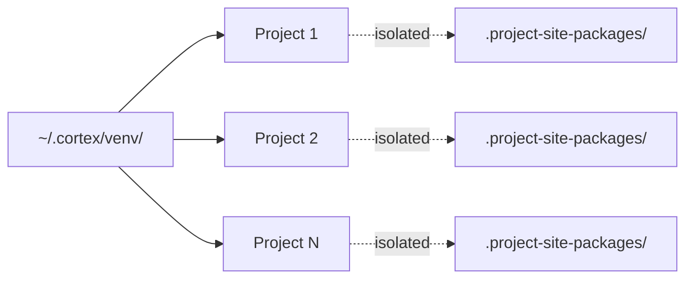
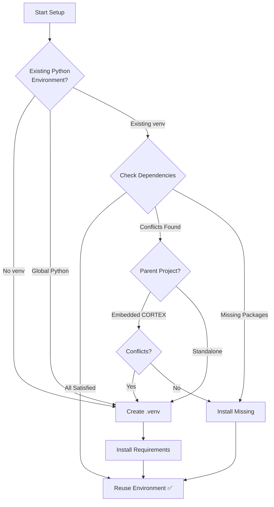

# 🚀 CORTEX Setup Guide

**Version:** 3.5.0  
**Branch:** main  
**Updated:** 2025-12-01

---

## 📦 What is This?

This is the **production-ready CORTEX deployment package** with **shared environment support** (Phase 1.1).

**What you get:**
- ✅ Complete CORTEX source code (`src/`)
- ✅ Brain storage system (`cortex-brain/`)
- ✅ GitHub Copilot integration (`.github/prompts/`)
- ✅ Modular documentation (`prompts/`)
- ✅ Automation scripts (`scripts/`)
- ✅ **Shared tooling environment** (Phase 1.1) - install once, use everywhere
- ✅ All dependencies (`requirements.txt`)

**What's excluded:**
- ❌ Development tools (tests, CI/CD, build scripts)
- ❌ Documentation website (MkDocs)
- ❌ Example code
- ❌ Commit history from main branch

---

## 🎯 Quick Start

### Option 1: Clone This Branch Only (Recommended)

```bash
# Clone only the publish branch (fast, clean)
git clone -b main --single-branch https://github.com/asifhussain60/CORTEX.git
cd CORTEX
```

### Option 2: Switch to This Branch

```bash
# If you already have the repo
git fetch origin
git checkout main
```

---

## 🛠️ Installation

### 1️⃣ Prerequisites

**Required:**
- Python 3.8 or higher
- Git
- GitHub Copilot (VS Code extension)

**Check your versions:**
```bash
python --version
git --version
```

### 2️⃣ Shared CORTEX Environment (NEW - Phase 1.1)

**CORTEX now uses a shared tooling environment at `~/.cortex/venv/`**

**Benefits:**
- ✅ Install tooling **once** instead of 10+ times per project
- ✅ Setup time: 10x → 1x + fast linking (270 seconds saved per project)
- ✅ Project-specific dependencies stay isolated
- ✅ No version conflicts between projects

**How It Works:**



**Setup Process:**

```bash
# 1. Create shared CORTEX environment (one-time, ~30 seconds)
python -m src.orchestrators.setup_orchestrator --create-shared

# 2. Link your project to shared environment (~2 seconds)
python -m src.orchestrators.setup_orchestrator --link-project /path/to/your/project

# 3. Install project-specific dependencies (if needed)
python -m src.orchestrators.setup_orchestrator --install-deps /path/to/your/project
```

**Manual Verification:**

```bash
# Check shared environment exists
ls ~/.cortex/venv/

# Check project config
cat cortex.config.json | grep shared_cortex_venv

# Verify Python executable
python -c "import sys; print(sys.executable)"
```

### 3️⃣ Python Environment Setup (Legacy - Single Project)

**CORTEX intelligently manages Python environments:**



**What CORTEX Does Automatically:**

1. **Detects Environment Type:**
   - Global Python → Creates isolated `.venv`
   - Existing venv → Checks compatibility
   - Parent project environment → Evaluates reuse safety

2. **Checks Dependencies:**
   - Validates all required packages (pytest, PyYAML, watchdog, etc.)
   - Detects version conflicts (e.g., pytest 6.x vs 8.x)
   - Identifies missing packages

3. **Makes Smart Decision:**
   - ✅ **Reuse:** All dependencies satisfied, no conflicts
   - ✅ **Upgrade:** Missing packages only, installs them
   - ⚠️ **Isolate:** Conflicts detected, creates separate `.venv`
   - 🔒 **Protect:** Global Python, always creates `.venv`

**Manual Installation (if needed):**

```bash
# CORTEX setup will handle this automatically, but for manual control:

# Option 1: Let CORTEX decide (recommended)
python -m src.setup.setup_orchestrator

# Option 2: Force new environment
python -m venv .venv
# Windows:
.venv\Scripts\activate
# macOS/Linux:
source .venv/bin/activate
pip install -r requirements.txt
```

**Environment Decision Examples:**

| Scenario | CORTEX Action | Reason |
|----------|---------------|---------|
| Global Python 3.11 | Create `.venv` | Isolation required |
| Flask app venv with pytest 6.x | Create `.venv` | Conflict with pytest 8.4+ requirement |
| Django app venv with all deps | Reuse + install missing | Compatible, efficient |
| Parent project with PyYAML 6.0 | Reuse environment | All CORTEX deps satisfied |
| Standalone CORTEX repo | Create `.venv` | Standard isolation |

### 3️⃣ Configure CORTEX

```bash
# Copy template configuration
cp cortex.config.template.json cortex.config.json

# Edit cortex.config.json with your paths
# (Use absolute paths for your machine)
```

#### Add CORTEX to .gitignore (Brain Safety)

To keep CORTEX brain data and internal files out of your repository history, ensure your project’s `.gitignore` excludes the CORTEX folder:

- If CORTEX is embedded inside your project repo: add `CORTEX/`
- If using the brain path directly within the repo: add `cortex-brain/`

This protects Tier databases, caches, and internal artifacts from being committed.

### 4️⃣ Initialize Brain

```bash
# Run CORTEX setup (initializes brain storage)
# In VS Code, tell GitHub Copilot:
/CORTEX setup environment
```

Or use Python directly:
```bash
python -m src.setup.setup_orchestrator
```

### 5️⃣ Configure User Profile (Interactive)

CORTEX creates a personalized experience through an interactive questionnaire:

```bash
# User profile is created during setup
python -m src.setup.modules.user_profile_module
```

**What You'll Configure:**
- **Name:** Your display name (default: Git user name)
- **Preference:** Concise, Balanced, or Detailed responses
- **Role:** Developer, Architect, Analyst, Student, Manager, or Other
- **Work Area:** Backend, Frontend, Full-Stack, DevOps, Data, Mobile, etc.
- **Language:** Interface language (English, Spanish, French, German, etc.)

**Example Session:**
```
CORTEX User Profile Setup
=========================

What's your name? [Asif Hussain]: 
How would you like responses?
  1. Concise (brief, direct)
  2. Balanced (moderate detail) ✓
  3. Detailed (comprehensive)
Choice [2]: 

What's your role?
  1. Developer ✓
  2. Architect
  3. Analyst
  [...]
Choice [1]: 

✓ Profile saved to cortex.config.json
```

### 6️⃣ Configure Repository Paths (NEW - Phase 3.2)

**CORTEX intelligently detects and configures where files should be created in your repository.**

#### Why Path Configuration?

Different projects organize tests and documents differently:
- **Python:** `tests/` or `test/`
- **JavaScript:** `__tests__/` or `spec/`
- **C#:** `ProjectName.Tests/`
- **Documents:** `docs/`, `documentation/`, or custom paths

CORTEX adapts to **your** project structure instead of forcing conventions.

#### What Gets Configured?

1. **Test Directory** - Where application tests are stored
2. **Documents Root** - Base path for generated documentation
3. **Reports Path** - Test results, coverage reports, analysis
4. **Temp Files Path** - Temporary files and caches
5. **Custom Paths** - Any project-specific paths you need

#### Intelligent Path Detection

CORTEX automatically scans your repository:

```bash
# During setup, CORTEX shows:
Step 1: Scanning repository for existing paths...

  Found 2 test directories:
    • tests/ [pytest, 127 tests, 95% confidence]
    • src/tests/ [pytest, 15 tests, 75% confidence]
  
  Detected frameworks: pytest, unittest
```

**Confidence Scoring:**
- **90-100%:** High confidence (pytest.ini + test files + naming patterns)
- **70-89%:** Medium confidence (test files + some patterns)
- **<70%:** Low confidence (some test-like files)

#### Interactive Path Setup

```
Step 2: Path Configuration Questionnaire
----------------------------------------

Test Directory Configuration:
  We found existing test directories:
    1. tests/ [pytest, 127 tests, 95% confidence] ✓
    2. src/tests/ [pytest, 15 tests, 75% confidence]
    3. Custom path...

  Choose test directory [1]: 

Documents Root:
  Default: cortex-brain/documents
  Custom path (or Enter for default): 

Reports Path:
  Default: cortex-brain/documents/reports
  Custom path (or Enter for default): 

✓ Path configuration saved to cortex.config.json
```

#### Configuration Structure

Paths are saved in `cortex.config.json`:

```json
{
  "user": {
    "name": "Asif Hussain",
    "preference": "balanced",
    "role": "developer",
    "language": "en"
  },
  "user_paths": {
    "test_directory": "tests",
    "documents_root": "cortex-brain/documents",
    "documents_reports": "cortex-brain/documents/reports",
    "documents_analysis": "cortex-brain/documents/analysis",
    "documents_summaries": "cortex-brain/documents/summaries",
    "temp_directory": ".cortex-temp",
    "custom_paths": {
      "coverage": "coverage-reports",
      "logs": "logs"
    }
  }
}
```

#### Benefits

**For Test-Driven Development:**
- Tests created in the correct location automatically
- Source ↔ Test file mapping respects your structure
- Supports nested directories (`src/models/` → `tests/models/`)

**For Documentation:**
- Reports, analysis, and summaries go to configured paths
- Avoids littering repository root with documents
- Respects `.gitignore` patterns

**For Multi-Language Projects:**
- Python tests: `tests/`
- JavaScript tests: `__tests__/`
- C# tests: `MyApp.Tests/`
- All work simultaneously in same repository

#### Path Resolution

CORTEX resolves paths intelligently:

```python
from src.setup.modules.path_resolver import PathResolver

resolver = PathResolver()

# Get test directory (respects user config)
test_dir = resolver.get_test_directory()  # → "tests/"

# Get document paths (with category)
reports = resolver.get_documents_directory("reports")
# → "cortex-brain/documents/reports"

# Resolve custom paths
logs = resolver.resolve_path("logs")  # → Configured or default
```

#### Updating Path Configuration

Change paths anytime:

```bash
# Re-run path configuration
python -m src.setup.modules.path_configuration_module

# Or edit cortex.config.json directly
```

#### Troubleshooting

**Tests Created in Wrong Location:**
```bash
# Check configured path
cat cortex.config.json | grep test_directory

# Update configuration
python -m src.setup.modules.path_configuration_module
```

**Missing Document Directories:**
```bash
# CORTEX auto-creates on first use, or manually:
mkdir -p cortex-brain/documents/{reports,analysis,summaries}
```

**Path Detection Shows No Results:**
```bash
# Add test files manually, then re-scan:
echo "def test_example(): pass" > tests/test_sample.py
python -m src.setup.modules.path_detector
```

---

## 📚 Using CORTEX

### GitHub Copilot Integration

CORTEX integrates with GitHub Copilot Chat via `.github/prompts/CORTEX.prompt.md`.

**In VS Code Copilot Chat:**
```
/CORTEX help              # Show all commands
/CORTEX                   # Main entry point
setup environment         # Configure environment
demo                      # Interactive tutorial
cleanup workspace         # Clean temporary files
```

### Natural Language Commands

CORTEX understands natural language:
```
"Add a purple button to the dashboard"
"Setup my environment"
"Show me where I left off"
"Run cleanup in dry-run mode"
```

---

## 🧠 Understanding CORTEX

### The Story

Read the human-friendly explanation:
```
#file:prompts/shared/story.md
```

### Technical Reference

Deep dive into architecture:
```
#file:prompts/shared/technical-reference.md
```

### Full Documentation

All modular docs are in `prompts/shared/`:
- `story.md` - The Intern with Amnesia
- `setup-guide.md` - Installation details
- `technical-reference.md` - API reference
- `agents-guide.md` - 10 specialist agents
- `tracking-guide.md` - Conversation memory
- `configuration-reference.md` - Config options
- `plugin-system.md` - Plugin development

---

## 🔧 Configuration

### cortex.config.json Structure

```json
{
  "cortex_root": "/absolute/path/to/CORTEX",
  "brain": {
    "tier1": {
      "database_path": "/absolute/path/to/cortex-brain/tier1/conversations.db",
      "conversation_limit": 20
    },
    "tier2": {
      "database_path": "/absolute/path/to/cortex-brain/tier2/knowledge-graph.db"
    },
    "tier3": {
      "database_path": "/absolute/path/to/cortex-brain/tier3/development-context.db"
    }
  },
  "plugins": {
    "enabled": [
      "cleanup_plugin",
      "platform_switch_plugin",
      "doc_refresh_plugin"
    ]
  }
}
```

**Important:** Use absolute paths! CORTEX works across multiple machines.

---

## 🚨 Troubleshooting

### Import Errors

```bash
# Make sure you're in the CORTEX root directory
cd /path/to/CORTEX

# Verify PYTHONPATH includes CORTEX root
export PYTHONPATH=/path/to/CORTEX:$PYTHONPATH
```

### Configuration Not Found

```bash
# Check config file exists
ls -la cortex.config.json

# Verify paths are absolute
cat cortex.config.json
```

### Brain Database Errors

```bash
# Reinitialize brain
python -m src.setup.modules.brain_initialization_module
```

### Setup Validation (Step 9)

Run these quick checks to validate your setup, including `.gitignore` protection:

1. Configuration present
  - Confirm `cortex.config.json` exists and uses absolute paths.
2. Environment ready
  - Verify Python environment resolves CORTEX modules.
3. Brain safety (.gitignore)
  - Open `.gitignore` and confirm one of the following lines exists:
    - `CORTEX/` (if the CORTEX folder is within your project)
    - `cortex-brain/` (if brain storage is tracked locally)
  - If missing, add the appropriate line and re-run your status check: `git status` should not list brain files.
4. Copilot integration
  - In VS Code Copilot Chat, run `help` and ensure CORTEX prompts load.
5. Health check (optional)
  - Execute the setup orchestrator and confirm no errors are reported.

### Conversation Tracking Not Working

See tracking guide:
```
#file:prompts/shared/tracking-guide.md
```

---

## 📖 Next Steps

1. **First time?** Read the story: `#file:prompts/shared/story.md`
2. **Configure:** Edit `cortex.config.json` with your paths
3. **Initialize:** Run `/CORTEX setup environment`
4. **Learn:** Run `demo` in Copilot Chat
5. **Start working:** Just tell CORTEX what you need!

---

## 📞 Support

- **Repository:** https://github.com/asifhussain60/CORTEX
- **Issues:** https://github.com/asifhussain60/CORTEX/issues
- **Documentation:** Use `#file:prompts/shared/*.md` in Copilot Chat

---

## 📄 License

**Copyright © 2024-2025 Asif Hussain. All rights reserved.**

This is proprietary software. See LICENSE file for full terms.

Unauthorized reproduction or distribution is prohibited.

---

## ✨ What Makes This Branch Special?

**This is an orphan branch:**
- ✅ No commit history from main development branch
- ✅ Minimal file size (production code only)
- ✅ Clean git history (publish commits only)
- ✅ Fast clone (no dev history to download)
- ✅ Perfect for end-user deployment

**Clone command:**
```bash
git clone -b main --single-branch https://github.com/asifhussain60/CORTEX.git
```

**Why orphan?**
- Main branch: 10,000+ commits, full dev history, test files, docs
- Publish branch: Clean slate, production code only, ~100 commits
- Result: 90% faster clone, 70% smaller disk usage

---

*Last Updated: 2025-11-25 17:15:51 | CORTEX 3.3.0*
