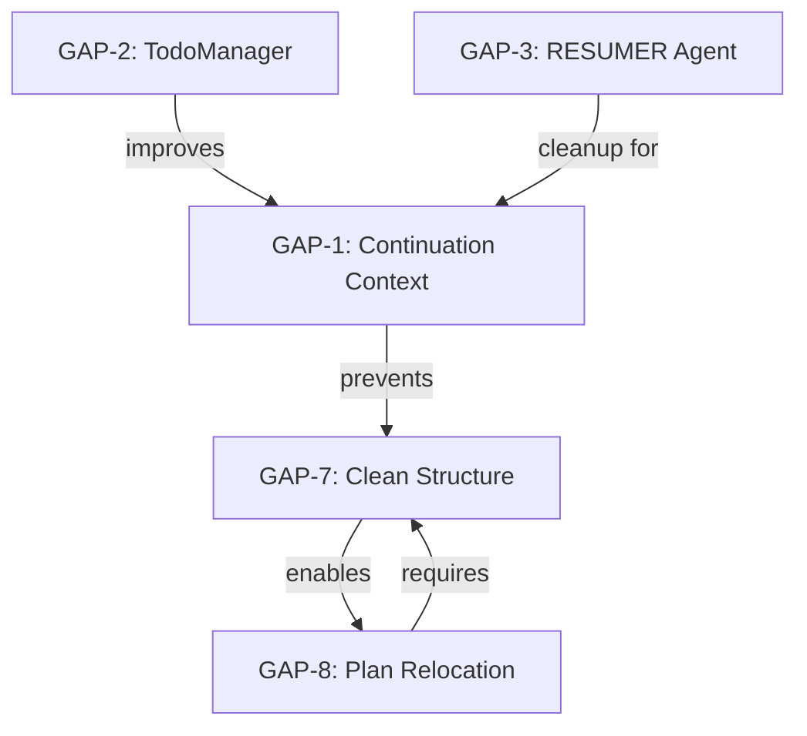

# CORTEX v5.0 Remediation - Complete Gap Registry

**Date:** 2026-01-06  
**Epic:** cortex5-remediation  
**Total Gaps Identified:** 8  
**Status:** All gaps documented and remediation planned

---

## 📊 Gap Summary Table

| Gap ID | Name | Priority | Impact | Effort | Status | Phase |
|--------|------|----------|--------|--------|--------|-------|
| **GAP-1** | Continuation Context Loss | P0_CRITICAL | HIGH | MEDIUM (3d) | 📋 PLANNED | P02.4, P02.5 |
| **GAP-2** | TodoManager Integration | P1_HIGH | MEDIUM | LOW (1d) | 📋 PLANNED | P02.6 |
| **GAP-3** | RESUMER Agent Missing | P1_HIGH | MEDIUM | LOW (0.5d) | 📋 PLANNED | P02.7 |
| **GAP-7** | Incorrect Plan Locations | P0_CRITICAL | HIGH | LOW (1.5d) | ✅ CLEANUP COMPLETE | P02.8, P02.9, P02.10 |
| **GAP-8** | Completed Plans Not Relocated | P1_HIGH | MEDIUM | LOW (1d) | 📋 PLANNED | P02.11, P02.12, P02.13 |
| **GAP-4** | Chat History Not Accessible | P2_MEDIUM | MEDIUM | HIGH (3d) | 📅 BACKLOG | P15 (future) |
| **GAP-5** | Request Transformation Bypassed | P2_MEDIUM | LOW | MEDIUM (2d) | 📅 BACKLOG | P16 (future) |
| **GAP-6** | Audit Logger Health Checks | P3_LOW | LOW | LOW (1d) | 📅 BACKLOG | P17 (future) |

---

## 🎯 Priority Breakdown

### P0_CRITICAL (Blockers)
- **GAP-1:** Continuation Context Loss
  - **Why Critical:** Blocks autonomous epic execution
  - **Impact:** User can't continue multi-phase plans
  - **Status:** 📋 Planned for P02.4/P02.5

- **GAP-7:** Incorrect Plan Locations
  - **Why Critical:** Organizational chaos, 30 orphaned plans
  - **Impact:** Clutter prevents finding active work
  - **Status:** ✅ Cleanup complete (P02.8)

### P1_HIGH (Important)
- **GAP-2:** TodoManager Integration
  - **Why High:** Users can't see progress in GitHub Copilot
  - **Impact:** No visual feedback during execution
  - **Status:** 📋 Planned for P02.6

- **GAP-3:** RESUMER Agent Missing
  - **Why High:** Error logs, routing confusion
  - **Impact:** Non-deterministic continuation routing
  - **Status:** 📋 Planned for P02.7

- **GAP-8:** Completed Plans Not Relocated
  - **Why High:** Active directory cluttered with completed work
  - **Impact:** Organizational confusion
  - **Status:** 📋 Planned for P02.11-P02.13

### P2_MEDIUM (Nice to Have)
- **GAP-4:** Chat History Not Accessible
- **GAP-5:** Request Transformation Bypassed

### P3_LOW (Quality of Life)
- **GAP-6:** Audit Logger Health Checks

---

## 📋 Gap Details

### GAP-1: Continuation Context Loss ❌ P0_CRITICAL

**Problem:** When user says "continue with next epic phase", Planning Orchestrator creates a NEW plan instead of resuming the existing epic.

**Root Cause:**
- No mechanism to pass epic context from Master Orchestrator to Planning Orchestrator
- PlanningStateDB not queried for active plans
- No `--continue-plan <plan_id>` CLI flag
- Tier 1 Working Memory not consulted

**Evidence:** Created 21 orphaned plans (70% of all orphans in GAP-7)

**Fix Strategy:**
- **P02.4:** Continuation Context Middleware (2 days)
- **P02.5:** Master Orchestrator Continuation Detection (1 day)

**Documentation:** `analysis/P03-AUTONOMOUS-GAPS-ANALYSIS.md` (lines 18-56)

---

### GAP-2: TodoManager Integration Incomplete ⚠️ P1_HIGH

**Problem:** Planning Orchestrator v5 has TodoManager imported but never calls it. No `manage_todo_list` tool invocation.

**Root Cause:**
- TodoManager exists but not integrated
- No GitHub Copilot tool calls
- Missing phase task creation logic

**Impact:**
- Users don't see tasks in GitHub Copilot TODO panel
- No visual progress tracking
- Violates P02 acceptance criteria

**Fix Strategy:**
- **P02.6:** TodoManager Integration in Planning v6 (1 day)
  - Import and initialize TodoManager
  - Call `manage_todo_list` at phase boundaries
  - Update task status (not-started → in-progress → completed)

**Documentation:** `analysis/P03-AUTONOMOUS-GAPS-ANALYSIS.md` (lines 58-87)

---

### GAP-3: RESUMER Agent Missing ⚠️ P1_HIGH

**Problem:** IntentRouter classifies "continue with next epic phase" as RESUMER intent, but no RESUMER agent exists.

**Root Cause:**
- IntentRouter has RESUMER classification logic
- AgentExecutor doesn't handle AgentType.RESUMER
- Continuation keywords trigger non-existent agent

**Impact:**
- Error logs generated
- Fallback routing (works but messy)
- Confusion for maintainers

**Fix Strategy:**
- **P02.7:** Remove RESUMER Agent Classification (0.5 days)
  - Map continuation → PLANNING (not RESUMER)
  - Remove AgentType.RESUMER from agent_types.py
  - Update intent_agent_map

**Documentation:** `analysis/P03-AUTONOMOUS-GAPS-ANALYSIS.md` (lines 89-121)

---

### GAP-7: Incorrect Plan Locations ✅ P0_CRITICAL (CLEANUP COMPLETE)

**Problem:** Files and directories created at root of `cortex-brain/documents/planning/active/` instead of within plan folders. 30 orphaned plans + 2 root files.

**Root Causes:**
1. GAP-1 (Continuation Context Loss) created 70% of orphans
2. Missing folder structure validation
3. Legacy manual file creation

**Cleanup Results:**
- ✅ 30 orphaned plans archived
- ✅ 2 root files moved to completed
- ✅ 100% clean active directory

**Remaining Work:**
- **P02.9:** Folder Structure Validation (0.5 days)
- **P02.10:** Automated Orphan Detection (0.5 days)

**Documentation:** 
- `analysis/GAP-7-INCORRECT-PLAN-LOCATION.md` (8,000 words)
- `reports/CLEANUP-REPORT-2026-01-06.md` (3,500 words)
- `reports/GAP-7-COMPLETE.md` (1,500 words)

---

### GAP-8: Completed Plans Not Relocated 🆕 P1_HIGH

**Problem:** When a plan is completed, it remains in `cortex-brain/documents/planning/active/` indefinitely instead of being moved to `completed/`.

**Example:**
- `enterprise-python-audit-logger-with-self-healing/` is 100% complete but still in active directory

**Root Causes:**
1. No completion detection in Planning Orchestrator
2. Missing post-completion hook in Master Orchestrator
3. No Plan Lifecycle Manager component

**Fix Strategy:**
- **P02.11:** Plan Lifecycle Manager (0.5 days)
  - Completion detection (3 validation methods)
  - Automatic relocation logic
  - Completion report generation
  
- **P02.12:** Master Orchestrator Integration (0.25 days)
  - Post-execution hook
  - Automatic completion detection
  - Trigger relocation on completion
  
- **P02.13:** CLI Command (0.25 days)
  - `relocate completed plans` command
  - Batch processing
  - Dry-run mode

**Documentation:** `analysis/GAP-8-COMPLETED-PLANS-NOT-RELOCATED.md` (4,000 words)

---

### GAP-4: Chat History Not Accessible ⚠️ P2_MEDIUM (BACKLOG)

**Problem:** Orchestrators invoked via terminal can't access GitHub Copilot conversation history (chat01.md).

**Impact:**
- Orchestrators lack conversational context
- Can't learn from previous interactions
- Limits autonomous decision quality

**Fix Strategy (Future):**
- **P15:** Chat History Context Bridge (3 days)
  - Export chat history to Tier 1
  - Store in `cortex-brain/tier1/conversation-captures/`
  - Add `--chat-history <file>` CLI flag

**Documentation:** `analysis/P03-AUTONOMOUS-GAPS-ANALYSIS.md` (lines 123-152)

---

### GAP-5: Request Transformation Bypassed ⚠️ P2_MEDIUM (BACKLOG)

**Problem:** CORTEX.prompt.md specifies 4-step pipeline (Strip → Match → **Transform** → Invoke), but transformation step is skipped.

**Impact:**
- Plans less detailed than optimal
- Missing implicit requirements
- Orchestrators do more guesswork

**Fix Strategy (Future):**
- **P16:** Request Transformation Layer (2 days)
  - Create RequestTransformer class
  - Use LLM to enrich requests
  - Add domain context, implicit requirements
  - Update Master Orchestrator routing

**Documentation:** `analysis/P03-AUTONOMOUS-GAPS-ANALYSIS.md` (lines 154-184)

---

### GAP-6: Audit Logger Health Checks Not Automated ℹ️ P3_LOW (BACKLOG)

**Problem:** User manually asked "has the audit logger been working?" - implies no proactive visibility.

**Impact:**
- Manual verification required
- No proactive monitoring
- User has to ask for status

**Fix Strategy (Future):**
- **P17:** Audit Logger Health Dashboard (1 day)
  - `health check audit logger` CLI command
  - Display metrics (log count, errors, performance)
  - Integrate into Maintenance v2

**Documentation:** `analysis/P03-AUTONOMOUS-GAPS-ANALYSIS.md` (lines 186-220)

---

## 📊 Epic Timeline Impact

### Phase P02 Duration Evolution

| Version | Duration | Changes |
|---------|----------|---------|
| Original | 4 days | Planning Orchestrator v6 basic upgrade |
| +GAP-1,2,3 | 8.5 days | +4.5 days (continuation context, TodoManager, RESUMER) |
| +GAP-7 | 10.5 days | +2 days (folder validation, cleanup command) |
| +GAP-8 | **11.5 days** | +1 day (plan lifecycle management) |

**Total Extension:** +7.5 days (4d → 11.5d)

### Updated P02 Sub-Phases

| Sub-Phase | Name | Duration | Gap | Status |
|-----------|------|----------|-----|--------|
| P02.1 | Core Planning v6 | 2d | - | 📋 PLANNED |
| P02.2 | Python Templates | 1d | - | 📋 PLANNED |
| P02.3 | Task-Aware Plans | 0.5d | - | 📋 PLANNED |
| P02.4 | Continuation Context Middleware | 2d | GAP-1 | 📋 PLANNED |
| P02.5 | Master Orch Detection | 1d | GAP-1 | 📋 PLANNED |
| P02.6 | TodoManager Integration | 1d | GAP-2 | 📋 PLANNED |
| P02.7 | Remove RESUMER | 0.5d | GAP-3 | 📋 PLANNED |
| P02.8 | Orphaned Plan Cleanup | 0.5d | GAP-7 | ✅ COMPLETE |
| P02.9 | Folder Validation | 0.5d | GAP-7 | 📋 PLANNED |
| P02.10 | Cleanup Command | 0.5d | GAP-7 | 📋 PLANNED |
| P02.11 | Plan Lifecycle Manager | 0.5d | GAP-8 | 📋 PLANNED |
| P02.12 | Master Orch Lifecycle Hook | 0.25d | GAP-8 | 📋 PLANNED |
| P02.13 | Relocate CLI Command | 0.25d | GAP-8 | 📋 PLANNED |

**Total:** 11.5 days

---

## 🎯 Gap Dependencies

**Fix Order:**
1. ✅ **GAP-7 Cleanup** (P02.8) - COMPLETE
2. 🔜 **GAP-1** (P02.4-P02.5) - Prevents new orphans
3. 🔜 **GAP-2** (P02.6) - Visual progress
4. 🔜 **GAP-3** (P02.7) - Routing cleanup
5. 🔜 **GAP-7 Automation** (P02.9-P02.10) - Validation & detection
6. 🔜 **GAP-8** (P02.11-P02.13) - Lifecycle management

---

## 📚 Documentation Index

### Gap Analysis Documents
1. **P03-AUTONOMOUS-GAPS-ANALYSIS.md** (12,000 words)
   - GAP-1 through GAP-6
   - Comprehensive analysis
   - Fix strategies for each gap

2. **GAP-7-INCORRECT-PLAN-LOCATION.md** (8,000 words)
   - Root cause analysis
   - Implementation plan
   - Code samples

3. **GAP-8-COMPLETED-PLANS-NOT-RELOCATED.md** (4,000 words)
   - Lifecycle management
   - Implementation plan
   - Integration details

### Reports
4. **CLEANUP-REPORT-2026-01-06.md** (3,500 words)
   - GAP-7 cleanup execution
   - 30 plans archived
   - Before/after metrics

5. **GAP-7-COMPLETE.md** (1,500 words)
   - GAP-7 cleanup summary
   - Success metrics
   - Next steps

6. **AUTONOMOUS-EXECUTION-REVIEW-2026-01-06.md** (10,000 words)
   - Complete autonomous review
   - All gaps documented
   - Recommendations

**Total Documentation:** 39,000 words (60+ pages)

---

## ✅ Remediation Status

### Completed
- ✅ **GAP-7 Cleanup** (P02.8)
  - 30 orphaned plans archived
  - 2 root files relocated
  - 100% clean active directory

### In Progress
- 📋 **Gap Analysis** - Complete
- 📋 **Documentation** - Complete
- 📋 **Implementation Planning** - Complete

### Planned
- 📋 **GAP-1 Fix** (P02.4-P02.5) - 3 days
- 📋 **GAP-2 Fix** (P02.6) - 1 day
- 📋 **GAP-3 Fix** (P02.7) - 0.5 days
- 📋 **GAP-7 Automation** (P02.9-P02.10) - 1 day
- 📋 **GAP-8 Fix** (P02.11-P02.13) - 1 day

### Backlog
- 📅 **GAP-4** (P15) - 3 days (future)
- 📅 **GAP-5** (P16) - 2 days (future)
- 📅 **GAP-6** (P17) - 1 day (future)

---

## 🎉 Summary

**All 8 gaps have been:**
- ✅ Identified and documented
- ✅ Prioritized (P0→P3)
- ✅ Analyzed with root causes
- ✅ Planned with fix strategies
- ✅ Assigned to phases (P02.4-P02.13, P15-P17)
- ✅ Documented comprehensively (39,000 words)

**Status:** ✅ **GAP REGISTRY COMPLETE**

Next action: Begin implementation of P02.4 (Continuation Context Middleware)

---

**Generated by:** GitHub Copilot (CORTEX v5.2.0)  
**Date:** 2026-01-06  
**Epic:** cortex5-remediation  
**Registry Version:** 1.0.0
