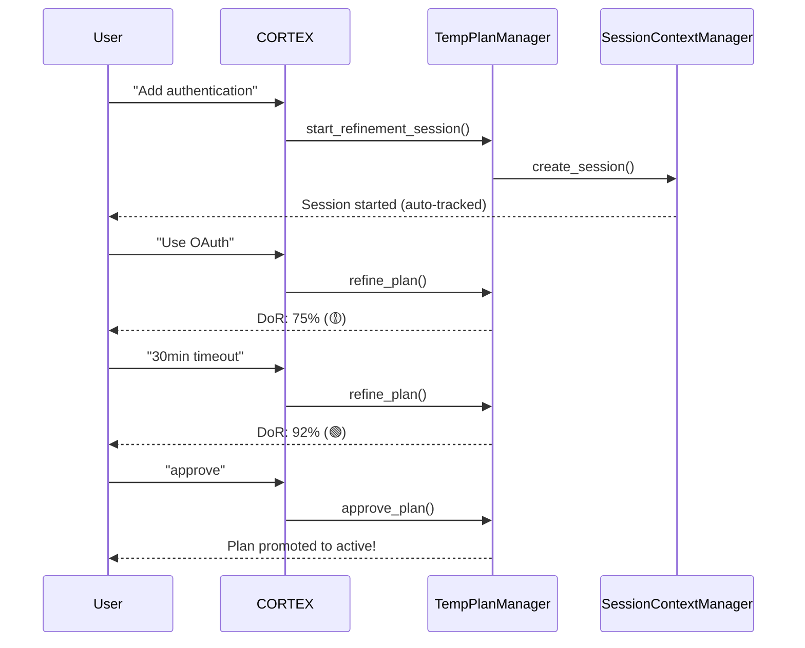
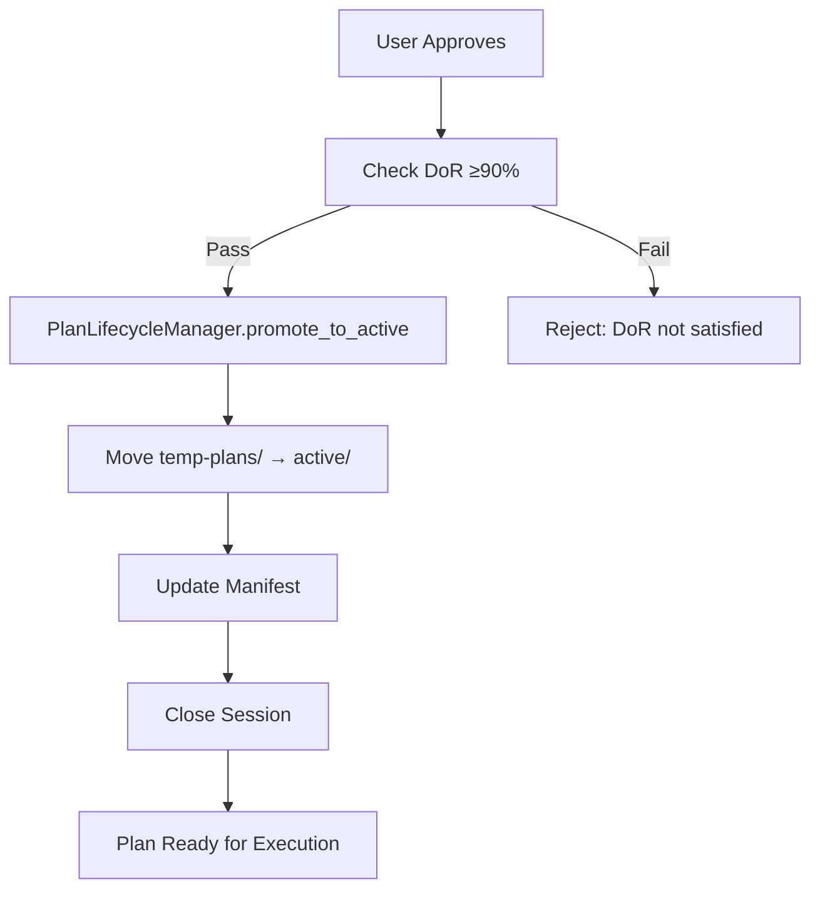

# 🎯 CORTEX Planning System 4.0 - Complete Guide

**Author:** Asif Hussain | **GitHub:** github.com/asifhussain60/CORTEX  
**Version:** 4.0.0  
**Date:** December 17, 2025  
**Status:** ✅ PRODUCTION READY

---

## 📋 Table of Contents

1. [Overview](#overview)
2. [User Guide](#user-guide)
3. [Developer Guide](#developer-guide)
4. [Architecture](#architecture)
5. [Workflows](#workflows)
6. [API Reference](#api-reference)
7. [Troubleshooting](#troubleshooting)

---

## 🎯 Overview

CORTEX Planning System 4.0 is a comprehensive planning orchestration system that enforces:

- **Iterative Refinement:** Back-and-forth dialogue until Definition of Ready (DoR) satisfied
- **Mutual Agreement:** Both CORTEX and user must agree before execution begins
- **Automatic Context Continuity:** Session-based tracking (no manual file references)
- **Plan-Based Workflow:** ALL code changes require approved plan (SKULL-enforced)
- **Token Optimization:** Distilled context for efficient LLM consumption
- **Standard Task Injection:** Git checkpoints, TDD, documentation auto-added
- **Audit Trail:** Complete visibility into planning operations

### Key Features

✅ **Temp Plan Refinement** - Interactive planning with DoR validation  
✅ **Complexity Analysis** - Smart format selection (single vs. multi-phase)  
✅ **AST/Lens Integration** - Code structure analysis for context  
✅ **Lifecycle Management** - State machine: TEMP → AWAITING_APPROVAL → ACTIVE → COMPLETED  
✅ **Manifest Tracking** - Central registry of all active plans  
✅ **Worker Plans** - Phase-specific execution with standard tasks  
✅ **Audit Logging** - JSONL-based event trail for compliance  

---

## 👤 User Guide

### Quick Start

**Step 1: Start Planning**
```
User: "Add authentication to my application"
CORTEX: [Creates temp-plans/user-auth/ + starts session]
```

**Step 2: Iterative Refinement**
```
User: "Use OAuth for Google and GitHub"
CORTEX: [Updates plan, runs AST/Lens analysis]
       DoR Score: 75% (🟡 NEEDS REFINEMENT)
```

**Step 3: Achieve DoR**
```
User: "Session timeout should be 30 minutes"
CORTEX: [Updates plan]
       DoR Score: 92% (🟢 READY FOR APPROVAL)
```

**Step 4: Approve Plan**
```
User: "approve"
CORTEX: [Promotes temp-plans/user-auth/ → active/user-auth/]
       [Registers in manifest]
       Plan ready for execution!
```

### Definition of Ready (DoR)

DoR is a **mutual contract** between CORTEX and user. Both parties must agree:

**CORTEX Requirements:**
- ✅ Application context understood (AST graphs complete)
- ✅ All affected files identified
- ✅ TDD workflow clear (RED→GREEN→REFACTOR)
- ✅ Integration points mapped
- ✅ Edge cases covered
- ✅ Confidence score ≥90%

**User Requirements:**
- ✅ CORTEX interpretation matches intent
- ✅ Affected files list is complete
- ✅ Proposed approach aligns with architecture
- ✅ Acceptance criteria are measurable
- ✅ Timeline/effort estimate is reasonable

**DoR Status Indicators:**
- 🔴 **NOT READY** - Confidence <80%, refinement required
- 🟡 **NEEDS REFINEMENT** - Confidence 80-89%, clarification needed
- 🟢 **READY** - Confidence ≥90%, proceed to approval

### Commands

| Command | Description |
|---------|-------------|
| `plan [feature]` | Start interactive planning session |
| `refine [feedback]` | Provide refinement feedback |
| `approve` | Approve plan and promote to active |
| `reject` | Reject plan and close session |
| `cortex audit --plan-id ID` | View plan history |

### User Checklist

Before approving a plan, verify:

- [ ] CORTEX understood my request correctly
- [ ] All affected files are listed
- [ ] The approach makes sense for my architecture
- [ ] TDD workflow is appropriate
- [ ] Acceptance criteria are clear
- [ ] Effort estimate seems reasonable
- [ ] No critical context missing

---

## 🔧 Developer Guide

### Architecture Components

```
Planning System 4.0
├── PlanningGate (request triage)
├── TemporaryPlanManager (refinement loop)
├── SessionContextManager (automatic context)
├── PlanLifecycleManager (state machine)
├── ComplexityAnalyzer (format selection)
├── UnifiedPlanGenerator (plan rendering)
├── TaskInjector (standard tasks)
├── PlanManifestTracker (registry)
└── AuditLogger (event trail)
```

### Implementation Steps

**1. Start Refinement Session**

```python
from src.operations.modules.orchestration.temporary_plan_manager import TemporaryPlanManager

manager = TemporaryPlanManager(project_root)

session = manager.start_refinement_session(
    user_request="Add authentication system",
    complexity_tier=3
)

# Returns: InteractiveRefinementSession with session_id
```

**2. Refine Plan (Iterative)**

```python
result = manager.refine_plan(
    session_id=session.session_id,
    user_feedback="Use OAuth for Google and GitHub"
)

# Returns:
# {
#     "iteration": 2,
#     "dor_score": 87.5,
#     "ambiguity_score": 12.5,
#     "dor_ready": False,
#     "status": "🟡 NEEDS REFINEMENT"
# }
```

**3. Request Approval (DoR Gate)**

```python
approval_result = manager.request_approval(
    session_id=session.session_id
)

# Blocks if DoR score <90%
# Returns: ApprovalResult
```

**4. Approve Plan (Promote to Active)**

```python
result = manager.approve_plan(
    session_id=session.session_id,
    approved_by="user@example.com"
)

# - Moves temp-plans/ → active/
# - Registers in manifest
# - Closes session
```

### Blocking DoR Validation

```python
from src.planning.plan_lifecycle_manager import PlanLifecycleManager

lifecycle_mgr = PlanLifecycleManager(project_root)

can_proceed, reason = lifecycle_mgr.can_proceed_to_execution(plan_id)

if not can_proceed:
    raise LifecycleTransitionError(f"Cannot execute: {reason}")

# Enforces:
# - DoR score ≥90%
# - User approval exists
# - Plan in ACTIVE or IN_PROGRESS state
```

### Standard Task Injection

```python
from src.operations.modules.planning.task_injector import TaskInjector

injector = TaskInjector()

# Inject standard tasks into phase
enhanced_tasks = injector.inject_standard_tasks(
    phase_tasks=[...],
    phase_number=2,
    phase_name="Core Implementation"
)

# Auto-injects:
# - Git checkpoint (start)
# - AST/Lens analysis
# - Documentation updates
# - TDD validation
# - DoD validation
# - Git checkpoint (end)
```

### Worker Plan Generation

```python
from src.operations.modules.planning.unified_plan_generator import UnifiedPlanGenerator

generator = UnifiedPlanGenerator()

worker_plan_md = generator.generate_worker_plan(
    plan_id="feature-auth-v1",
    phase_number=2,
    phase_name="Core Authentication",
    phase_data={
        "tasks": [...],
        "deliverables": [...],
        "dod": [...]
    },
    inject_standard_tasks=True  # Default
)

# Generates: WP02-Core-Authentication.md
```

### Audit Trail Integration

```python
from src.operations.modules.orchestration.audit_logger import get_audit_logger

audit_logger = get_audit_logger()

# Log planning events
audit_logger.log_event(
    event_type="temp_plan_created",
    session_id=session_id,
    plan_id=plan_id,
    orchestrator="TemporaryPlanManager",
    user_request=user_request,
    phase="initialization",
    metadata={
        "complexity_tier": 3,
        "dor_score": 0.0
    }
)

# Query events
events = audit_logger.query_events(plan_id=plan_id)
```

---

## 🏗️ Architecture

### State Machine

```
TEMP (temp-plans/)
  ↓ (request approval)
AWAITING_APPROVAL (temp-plans/)
  ↓ (user approves)
ACTIVE (active/)
  ↓ (start execution)
IN_PROGRESS (active/)
  ↓ (all phases complete)
COMPLETED (completed/)
  ↓ (after 30 days)
ARCHIVED (archived/)
```

### Folder Structure

**Temp Plans (During Refinement):**
```
temp-plans/
└── user-auth/
    ├── plan.md                  # Temp plan
    ├── context/
    │   ├── ast-analysis.json
    │   └── lens-dependencies.json
    └── iterations/
        ├── iteration-001.md
        └── iteration-002.md
```

**Active Plans (After Approval):**
```
active/
└── user-authentication/
    ├── master-plan.md
    ├── WP01-Foundation.md
    ├── WP02-Core-Implementation.md
    ├── execution/
    │   ├── master-execution.yaml
    │   ├── WP01-execution.yaml
    │   └── WP02-execution.yaml
    └── context/
        ├── ast-analysis.json
        └── lens-dependencies.json
```

### Manifest Structure

**Location:** `cortex-brain/documents/planning/active-plans-manifest.yaml`

```yaml
version: "1.0"
last_updated: "2025-12-17T14:30:00"
plans:
  - plan_id: "user-authentication-v1"
    title: "User Authentication System"
    status: "in_progress"
    complexity_tier: 3
    created_date: "2025-12-15"
    approved_date: "2025-12-16"
    folder: "active/user-authentication"
    phases: 6
    estimated_days: 7
    current_phase: 2
    dor_score: 0.95
    approved_by: "user@example.com"
```

---

## 🔄 Workflows

### 1. Interactive Refinement Workflow



### 2. Plan Promotion Workflow



### 3. Standard Task Injection Workflow

```
Phase Data (original tasks)
  ↓
TaskInjector.inject_standard_tasks()
  ↓
Git Checkpoint (start)
AST/Lens Analysis
[Original Phase Tasks]
Documentation Updates
TDD Validation
Git Checkpoint (end)
DoD Validation
```

---

## 📚 API Reference

### TemporaryPlanManager

**Methods:**
- `start_refinement_session(user_request, complexity_tier)` → InteractiveRefinementSession
- `refine_plan(session_id, user_feedback)` → Dict (DoR score, status)
- `request_approval(session_id)` → ApprovalResult
- `approve_plan(session_id, approved_by)` → Dict (promotion result)

### PlanLifecycleManager

**Methods:**
- `initialize_plan(plan_id, initial_state, complexity_tier)`
- `get_current_state(plan_id)` → PlanState
- `transition_to(plan_id, to_state)` → bool
- `can_proceed_to_execution(plan_id)` → tuple[bool, str]
- `approve_plan(plan_id, approved_by)`
- `promote_to_active(plan_id)` → Path

### UnifiedPlanGenerator

**Methods:**
- `generate_master_plan(plan_id, phases, metadata, ...)` → str
- `generate_worker_plan(plan_id, phase_number, phase_name, phase_data, ...)` → str
- `inject_standard_tasks` parameter (default: True)

### TaskInjector

**Methods:**
- `inject_standard_tasks(phase_tasks, phase_number, phase_name)` → List[Dict]
- `validate_standard_tasks_present(phase_tasks)` → tuple[bool, List[str]]

---

## 🔍 Troubleshooting

### Issue: DoR Score Not Improving

**Symptoms:** DoR score stays low despite refinements

**Solutions:**
1. Provide more specific details (file names, exact requirements)
2. Answer CORTEX's clarifying questions directly
3. Review AST/Lens analysis section (is CORTEX analyzing correct files?)
4. Use `cortex audit --session-id ID` to see iteration history

### Issue: Plan Approval Blocked

**Symptoms:** Cannot approve plan, DoR validation fails

**Solutions:**
1. Check DoR score: Must be ≥90%
2. Review ambiguity score: Must be <10%
3. Provide missing context (edge cases, integration points)
4. Confirm all affected files identified

### Issue: Standard Tasks Missing from Worker Plan

**Symptoms:** Git checkpoints or TDD validation not in generated plan

**Solutions:**
1. Verify `inject_standard_tasks=True` in generator call
2. Check TaskInjector initialization in UnifiedPlanGenerator
3. Validate with `injector.validate_standard_tasks_present()`

### Issue: Context Not Automatically Loaded

**Symptoms:** Asked to reference temp plan files manually

**Solutions:**
1. Verify SessionContextManager initialized
2. Check active session exists: `manager.get_active_session_for_plan(plan_id)`
3. Report SKULL violation: `CONTEXT_CONTINUITY_ENFORCEMENT`

### Audit Trail Queries

```bash
# View all events for a plan
cortex audit --plan-id user-auth-v1

# View session timeline
cortex audit --session-id session-123 --timeline

# View last 20 events
cortex audit --tail 20

# View by event type
cortex audit --type plan_refined

# Export to CSV
cortex audit --export csv --output report.csv
```

---

## 🛡️ SKULL Enforcement

The following governance rules protect Planning System 4.0:

### TEMP_PLAN_APPROVAL_ENFORCEMENT
- **Severity:** BLOCKED
- **Purpose:** Prevents execution without approval
- **Validation:** Plan in active/, status approved, DoR ≥90%

### PLAN_PROMOTION_INTEGRITY
- **Severity:** BLOCKED
- **Purpose:** Atomic transitions (temp → active)
- **Validation:** All files moved, context preserved, manifest updated

### SUB_PLAN_TASK_INJECTION_ENFORCEMENT
- **Severity:** WARNING
- **Purpose:** Standard tasks in all worker plans
- **Validation:** Git checkpoints, TDD, DoD validation present

### CONTEXT_CONTINUITY_ENFORCEMENT
- **Severity:** INFO
- **Purpose:** Automatic session tracking (no manual refs)
- **Validation:** SessionContextManager active, no file paths in responses

### PLAN_BASED_WORKFLOW_ENFORCEMENT
- **Severity:** BLOCKED
- **Purpose:** No code changes without approved plan
- **Validation:** plan_id parameter present, plan in active/

### NO_IMPLEMENTATION_SHORTCUTS_ENFORCEMENT
- **Severity:** WARNING
- **Purpose:** Next Steps shows planning workflow only
- **Validation:** No direct implementation suggestions

### AST_CONTEXT_INTEGRATION_ENFORCEMENT
- **Severity:** WARNING
- **Purpose:** Plans include narrative AST context
- **Validation:** Analysis section, affected files, user validation checklist

---

## 📊 Metrics & Performance

### Performance Targets

- **Temp Plan Creation:** <5 seconds
- **Plan Promotion:** <10 seconds
- **Audit Logging Overhead:** <5ms per event
- **DoR Validation:** <2 seconds

### Token Budget Targets

- **Temp Plan:** ≤3,000 tokens (distilled context)
- **Master Plan:** ≤4,000 tokens (coordination)
- **Worker Plan:** ≤2,500 tokens (phase-specific)
- **Continuation Prompt:** ≤150 tokens (resume context)

---

## 📝 Change Log

### v4.0.0 (December 17, 2025)
- ✅ Iterative refinement loop implemented
- ✅ Blocking DoR validation added
- ✅ Standard task auto-injection
- ✅ SKULL governance rules
- ✅ Audit trail system complete
- ✅ User/developer guides published

---

## 🤝 Support

**Documentation:** `cortex-brain/documents/planning/`  
**Manifest:** `planning-system-4.0-manifest.yaml`  
**GitHub:** github.com/asifhussain60/CORTEX  
**Author:** Asif Hussain

For issues or questions:
1. Check this guide first
2. Review audit trail: `cortex audit --plan-id ID`
3. Check SKULL violations in logs
4. Review gap analysis document for known limitations
