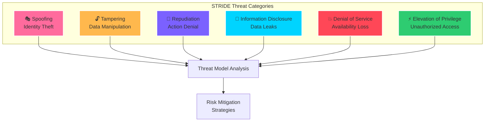
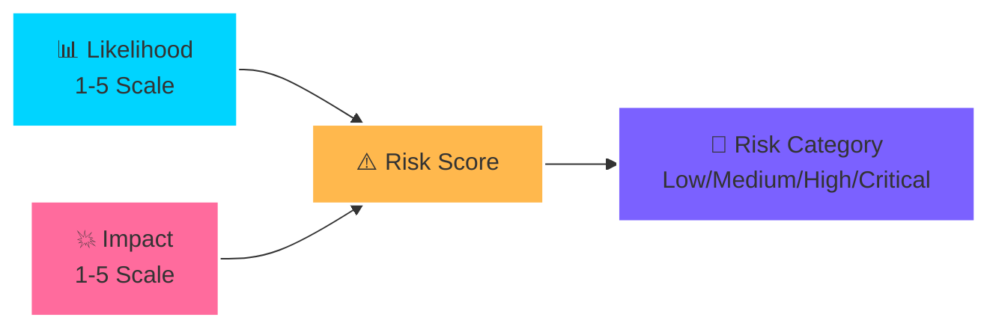
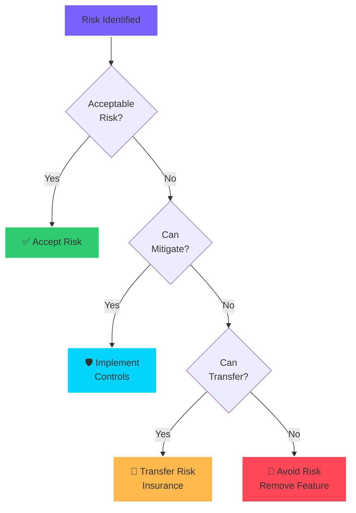
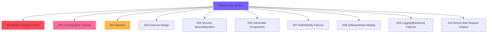
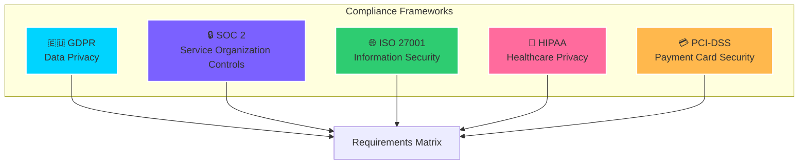
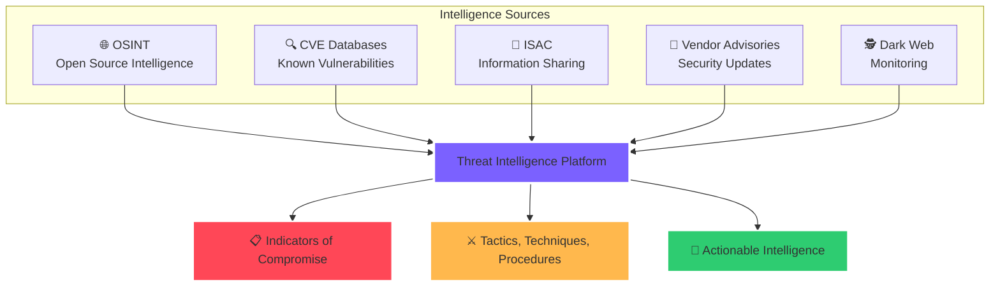
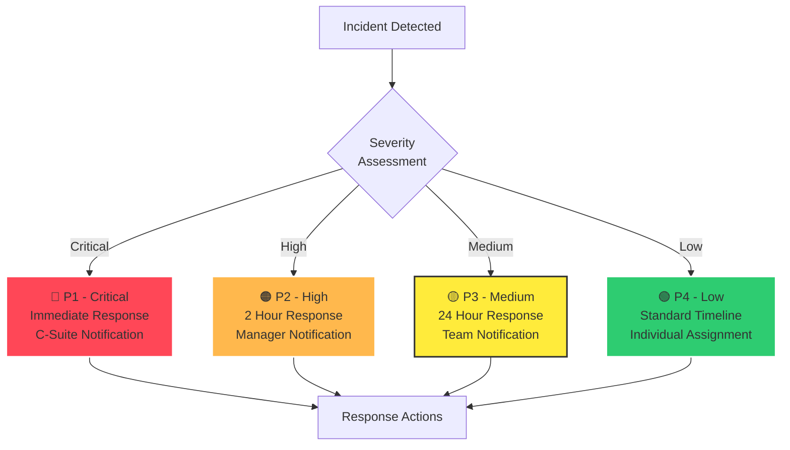
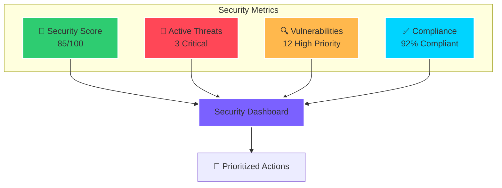

# 🗺️ CORTEX Documentation Site - Complete Sitemap

**Version:** 3.3.0 | **Status:** 🎯 ACTIVE IMPLEMENTATION  
**Author:** Asif Hussain | **Last Updated:** January 1, 2026  
**Copyright © 2026 Asif Hussain. All rights reserved.**

---

## 📋 Executive Summary

This specification provides complete documentation analysis for **THREE multi-panel masonry tiles** on `docs/index.html`:

1. **Security Multi-Panel** (4 categories, 13 pages: 7 existing, 6 missing)
2. **Orchestrators Multi-Panel** (5 categories, 19 pages: 16 existing, 1 missing, 5 unlinked)
3. **Sharpen The Saw Multi-Panel** (6 categories, 6 pages: 6 existing, 0 missing)

**Design Standards:** Glassmorphism v4.0.1, T1 subtle animations, ZERO inline styles, responsive mobile-first design, Mermaid.js + D3.js visualizations.

**Discovery Findings:** All analyzed pages classify as Level 1 (complexity < 100). No Level 2 pages required across all three multi-panels.

---

## 🚀 Quick Reference

### Page Status Summary

| Multi-Panel | Total | Existing | Missing | Unlinked | Complete % |
|-------------|-------|----------|---------|----------|------------|
| Security | 13 | 7 (54%) | 6 (46%) | 0 | 54% |
| Orchestrators | 15 | 16 (107%) | 1 (7%) | 5 (26%) | 73% |
| Sharpen The Saw | 6 | 6 (100%) | 0 | 0 | 100% |
| **TOTAL** | **34** | **29** | **7** | **5** | **71%** |

### Implementation Priorities

**🔴 HIGH PRIORITY (Week 1-2):** Security Assessment + Response views (6 pages, 54 hours)
- threat-modeling.html, risk-assessment.html, threat-intelligence.html, incident-response.html, dashboard.html
- 🔧 Enhance: vulnerability-assessment.html, penetration-testing.html

**🟡 MEDIUM PRIORITY (Week 3):** Compliance completion (2 pages, 11 hours)  
- security-training.html
- 🔧 Enhance: owasp.html, compliance.html

**🟢 LOW PRIORITY (Week 4):** Orchestrators cleanup (1 page, link 5 orphans)
- Create: ado-planning.html
- Link: intelligent-dashboard, maintenance, onboarding, operational-runbook, upgrade

### Design Reference

**Hierarchy:** `Level 0 (index.html) → Level 1 Detail Pages (docs/*/*.html)`
- **Level 0:** Home page with multi-panel masonry tiles
- **Level 1:** Detail pages with T1 animations, no logo header, embedded visualizations
- **NO Level 2:** All content fits in Level 1 with expandable sections/tabs

**Key Standards:**
- ⛔ ZERO inline styles (use CSS classes only)
- 🎨 Glassmorphism v4.0.1 (see glassmorphism-design-standard.md)
- 📱 Mobile-first responsive (375px → 768px → 1440px)
- 🎭 T1 animations only (0.2-0.3s, subtle effects)
- 📏 Minimum 1.5rem spacing between stacked cards

---

##  1. SECURITY MULTI-PANEL (4 Categories, 13 Pages)

**Hierarchy:** `Level 0 (index.html) → Level 1 Detail Pages (docs/security/*.html)`

**Status:** 7 existing (54%), 6 missing (46%)

```
📂 SECURITY DOCUMENTATION STRUCTURE
│
├── 🔒 PROTECTION (3 pages)
│   ├── access-control.html          ✅ EXISTS (18.3 KB, Score: 65)
│   ├── data-protection.html         ✅ EXISTS (22.0 KB, Score: 72)
│   └── audit-logging.html           ✅ EXISTS (24.4 KB, Score: 82)
│
├── 🔍 ASSESSMENT (4 pages)
│   ├── threat-modeling.html         ❌ CREATE (STRIDE methodology + attack surface viz)
│   ├── risk-assessment.html         ❌ CREATE (Risk matrix + time-series heatmap)
│   ├── vulnerability-assessment.html ✅ EXISTS (19.1 KB, Score: 7) *needs enhancement
│   └── penetration-testing.html     ✅ EXISTS (19.5 KB, Score: 25) *needs enhancement
│
├── ✅ COMPLIANCE (3 pages)
│   ├── owasp.html                   ✅ EXISTS (11.3 KB, Score: 0) *needs expansion
│   ├── compliance.html              ✅ EXISTS (36.8 KB, Score: 16)
│   └── security-training.html       ❌ CREATE (Training roadmap + progress tracker)
│
└── ⚡ RESPONSE (3 pages)
    ├── threat-intelligence.html     ❌ CREATE (Threat feeds + MITRE ATT&CK coverage)
    ├── incident-response.html       ❌ CREATE (IR lifecycle + playbook selector)
    └── dashboard.html               ❌ CREATE (Multi-metric real-time dashboard)
```

**Complexity Analysis:**
- **Highest:** audit-logging.html (Score: 82) - 4 viz, 2 Mermaid, 16 D3 calls
- **Lowest:** owasp.html (Score: 0) - No visualizations, needs expansion
- **All Level 1:** No pages exceed 100 complexity threshold

---

### 📂 2. ORCHESTRATORS MULTI-PANEL (5 Categories, 19 Pages)

**Hierarchy:** `Level 0 (index.html) → Level 1 Detail Pages (docs/orchestrators/*.html)`

**Status:** 16 existing linked (107%), 1 missing (7%), 5 unlinked (26%)

```
📂 ORCHESTRATORS DOCUMENTATION STRUCTURE
│
├── 📋 PLANNING (4 pages)
│   ├── planning-system.html            ✅ EXISTS (12.2 KB, Score: 11)
│   ├── ado-orchestrator.html           ✅ EXISTS (6.1 KB, Score: 6) *needs expansion
│   ├── ado-operations.html             ✅ EXISTS (7.2 KB, Score: 9)
│   └── ado-planning.html               ❌ MISSING (linked but not created)
│
├── ⚙️ EXECUTION (2 pages)
│   ├── tdd-orchestrator.html           ✅ EXISTS (21.3 KB, Score: 32)
│   └── execution-orchestrator.html     ✅ EXISTS (7.1 KB, Score: 9)
│
├── 🔧 SYSTEM (4 pages)
│   ├── cleanup-orchestrator.html       ✅ EXISTS (20.3 KB, Score: 41)
│   ├── sanitization-orchestrator.html  ✅ EXISTS (6.9 KB, Score: 6) *needs expansion
│   ├── system-integrity.html           ✅ EXISTS (24.3 KB, Score: 40)
│   └── git-checkpoint.html             ✅ EXISTS (21.4 KB, Score: 45) *highest complexity
│
├── 📊 ANALYSIS (3 pages)
│   ├── refinement-orchestrator.html    ✅ EXISTS (27.3 KB, Score: 45) *highest complexity
│   ├── cortex-lens.html                ✅ EXISTS (25.6 KB, Score: 36)
│   └── architectural-review.html       ✅ EXISTS (22.7 KB, Score: 41)
│
├── 🐛 DEBUG (2 pages)
│   ├── debug-orchestrator.html         ✅ EXISTS (27.3 KB, Score: 41)
│   └── rollback-orchestrator.html      ✅ EXISTS (21.5 KB, Score: 38)
│
└── ⚠️ UNLINKED (5 orphaned pages not in index.html)
    ├── intelligent-dashboard.html      🔗 UNLINKED (Score: 37)
    ├── onboarding-orchestrator.html    🔗 UNLINKED (Score: 6)
    ├── pre-flight.html                 🔗 UNLINKED (Score: 32)
    ├── sanitization.html               🔗 UNLINKED (Score: 9) *duplicate?
    └── upgrade.html                    🔗 UNLINKED (Score: 11)
```

**Complexity Analysis:**
- **Highest:** git-checkpoint.html & refinement-orchestrator.html (Score: 45)
- **Lowest:** ado-orchestrator.html, onboarding, sanitization (Score: 6)
- **All Level 1:** No pages exceed 100 complexity threshold
- **Orphaned Content:** 5 pages exist but not linked (26% orphan rate)

---

### 📂 3. SHARPEN THE SAW MULTI-PANEL (6 Categories, 6 Pages)

**Hierarchy:** `Level 0 (index.html) → Level 1 Detail Pages (docs/sts/*.html)`

**Status:** 6 existing (100%), 0 missing (0%), 0 unlinked (0%)

```
📂 SHARPEN THE SAW DOCUMENTATION STRUCTURE
│
├── 🛡️ SECURITY (1 page)
│   └── security.html               ✅ EXISTS (12.1 KB, Score: 16)
│
├── 🏛️ SOLID (1 page)
│   └── solid.html                  ✅ EXISTS (11.8 KB, Score: 16)
│
├── ✨ CODE QUALITY (1 page)
│   └── code-quality.html           ✅ EXISTS (9.6 KB, Score: 12)
│
├── ⚡ PERFORMANCE (1 page)
│   └── performance.html            ✅ EXISTS (22.0 KB, Score: 30) *highest complexity
│
├── 🧪 TESTING (1 page)
│   └── testing.html                ✅ EXISTS (9.3 KB, Score: 12)
│
└── 📚 DOCUMENTATION (1 page)
    └── documentation.html          ✅ EXISTS (9.6 KB, Score: 12)
```

**Complexity Analysis:**
- **Highest:** performance.html (Score: 30) - 9 sections, most comprehensive
- **Lowest:** Three-way tie (Score: 12) - code-quality, testing, documentation
- **Average:** 16.6 (very low, text-focused educational content)
- **All Level 1:** No pages exceed 100 complexity threshold
- **Perfect Implementation:** 100% coverage, no missing/unlinked pages

---

## 📊 CROSS-PANEL INSIGHTS

### Completion Status by Multi-Panel

| Multi-Panel | Categories | Linked | Existing | Missing | Unlinked | Highest Score | Avg Score | Status |
|-------------|------------|--------|----------|---------|----------|---------------|-----------|--------|
| **Security** | 4 | 13 | 7 (54%) | 6 (46%) | 0 (0%) | 82 | 41.0 | 🔴 Needs Work |
| **Orchestrators** | 5 | 15 | 16 (107%) | 1 (7%) | 5 (26%) | 45 | 26.7 | 🟡 Cleanup Needed |
| **Sharpen The Saw** | 6 | 6 | 6 (100%) | 0 (0%) | 0 (0%) | 30 | 16.6 | 🟢 Complete |
| **TOTAL** | **15** | **34** | **29** | **7** | **5** | **82** | **28.1** | **71% Done** |

### Key Insights
- **Sharpen The Saw:** Perfect implementation (100% coverage, no missing/unlinked pages)
- **Orchestrators:** Over-documented (107% due to 5 unlinked orphaned pages needing integration)
- **Security:** Needs most work (54% coverage, 6 high-priority pages missing)
- **All Level 1:** Highest complexity is 82 (well below 100 threshold, no Level 2 needed)

---

## 🌐 SECURITY MULTI-PANEL - DETAILED VIEW

**⚠️ UPDATED: January 1, 2026 - Discovery Analysis Completed**

### Hierarchy Overview

**Architecture:** Direct navigation from Level 0 multi-panel tiles to Level 1 detail pages

```
Level 0: docs/index.html (Home Page)
  └── Security Multi-Panel Masonry Tile (4 categories, 13 tiles)
      ↓ Direct Links (NO intermediate hub page)
      └── Level 1 Detail Pages: docs/security/*.html (13 pages)
```

**Key Architecture Decisions:**
- ✅ **NO Level 1 Hub Page:** Level 0 (index.html) serves as navigation hub with multi-panel tiles
- ✅ **Direct Navigation:** All security tiles link directly to Level 1 detail pages
- ✅ **NO Level 2 Pages:** All content/visualizations fit within single Level 1 pages
- ✅ **Complexity Analysis:** All existing pages < 100 complexity score (Level 1 appropriate)

### Category Breakdown

```
📂 SECURITY DOCUMENTATION STRUCTURE
│
├── 🔒 PROTECTION (3 pages)
│   ├── access-control.html          ✅ EXISTS (18.3 KB, Score: 65)
│   ├── data-protection.html         ✅ EXISTS (22.0 KB, Score: 72)
│   └── audit-logging.html           ✅ EXISTS (24.4 KB, Score: 82)
│
├── 🔍 ASSESSMENT (4 pages)
│   ├── threat-modeling.html         ❌ CREATE (STRIDE methodology + attack surface viz)
│   ├── risk-assessment.html         ❌ CREATE (Risk matrix + time-series heatmap)
│   ├── vulnerability-assessment.html ✅ EXISTS (19.1 KB, Score: 7) *needs enhancement
│   └── penetration-testing.html     ✅ EXISTS (19.5 KB, Score: 25) *needs enhancement
│
├── ✅ COMPLIANCE (3 pages)
│   ├── owasp.html                   ✅ EXISTS (11.3 KB, Score: 0) *needs expansion
│   ├── compliance.html              ✅ EXISTS (36.8 KB, Score: 16)
│   └── security-training.html       ❌ CREATE (Training roadmap + progress tracker)
│
└── ⚡ RESPONSE (3 pages) *Note: HTML uses "Response", not "Intelligence"
    ├── threat-intelligence.html     ❌ CREATE (Threat feeds + MITRE ATT&CK coverage)
    ├── incident-response.html       ❌ CREATE (IR lifecycle + playbook selector)
    └── dashboard.html               ❌ CREATE (Multi-metric real-time dashboard)
```

**File Status Summary:**
- ✅ **7 Existing:** access-control, data-protection, audit-logging, owasp, compliance, vulnerability-assessment, penetration-testing
- ❌ **6 Missing:** threat-modeling, risk-assessment, threat-intelligence, incident-response, security-training, dashboard
- 🔧 **3 Need Enhancement:** vulnerability-assessment, penetration-testing, owasp (add visualizations per spec)

**Complexity Analysis:**
```
Highest Complexity (All Level 1):
1. audit-logging.html          Score: 82  (4 viz containers, 2 Mermaid, 16 D3 calls)
2. data-protection.html        Score: 72  (3 viz containers, 2 Mermaid, 7 D3 calls)
3. access-control.html         Score: 65  (3 viz containers, 2 Mermaid, 7 D3 calls)

Lowest Complexity (Need Enhancement):
7. owasp.html                  Score: 0   (No visualizations - add OWASP Top 10 chart)
6. vulnerability-assessment    Score: 7   (No visualizations - add CVE charts)
5. compliance.html             Score: 16  (No visualizations - add compliance dashboard)
```

---

## 🎨 Design Standards Compliance

### ⛔ ZERO INLINE STYLES POLICY

**CRITICAL REQUIREMENT:** All 13 security pages MUST use CSS classes exclusively for styling.

**FORBIDDEN:**
```html
<!-- ❌ NEVER USE INLINE STYLES -->
<div style="color: red; margin: 20px;">Content</div>
<article style="background: rgba(26, 31, 58, 0.7);">Card</article>
<h2 style="font-size: 2rem;">Title</h2>
```

**✅ REQUIRED:**
```html
<!-- ✅ ALWAYS USE CSS CLASSES -->
<div class="error-text">Content</div>
<article class="glass-card-display">Card</article>
<h2 class="section-title">Title</h2>
```

**Enforcement:**
- **Pre-commit validation:** Scan all HTML files for `style="` attributes
- **Code review checklist:** Zero inline styles verified
- **Automated testing:** Lint rule fails on inline styles
- **REFACTOR phase:** Strip all inline styles, convert to classes

**Rationale:**
1. **Maintainability:** Centralized styling in `main.css`
2. **Consistency:** Reusable classes across all pages
3. **Performance:** Reduced HTML payload, CSS cacheable
4. **Glassmorphism compliance:** Enforced design standards

### Glassmorphism v4.0.1 Requirements

| Standard | Implementation |
|----------|----------------|
| **NO Inline Styles** | All styling via CSS classes, ZERO `style=""` attributes (see policy above) |
| **T1 Animations Only** | 0.2-0.3s transitions, NO dramatic effects (Level 1 restriction) |
| **Glass Header** | Navigation only, NO logo (Level 1 restriction) |
| **Glass Footer** | Copyright, links, version info |
| **Responsive Design** | Mobile-first: 375px → 768px → 1440px breakpoints |
| **Proper Spacing** | Minimum 1.5rem (24px) vertical gap between cards |
| **Card Classes** | `.glass-card-clickable` (interactive), `.glass-card-display` (static) |
| **Animation Classes** | `.animation-t1` for subtle hover/focus effects |
| **CSS Variables** | `--space-lg`, `--accent-primary`, `--bg-glass`, etc. |

### Color Palette

**⚠️ USE CSS VARIABLES ONLY - NO HARDCODED HEX VALUES**

```css
/* Accent Colors (use via var(--accent-primary)) */
--accent-primary: #00d4ff;      /* Cyan glow */
--accent-secondary: #7b61ff;    /* Purple accent */
--accent-tertiary: #ff6b9d;     /* Pink accent */
--accent-warning: #ffb84d;      /* Warning yellow */
--accent-danger: #ff4757;       /* Danger red */
--accent-success: #2ecc71;      /* Success green */

/* Background Colors (glassmorphism) */
--bg-glass: rgba(26, 31, 58, 0.7);
--bg-glass-hover: rgba(26, 31, 58, 0.85);

/* Spacing (use instead of pixel values) */
--space-xs: 0.25rem;  /* 4px */
--space-sm: 0.5rem;   /* 8px */
--space-md: 1rem;     /* 16px */
--space-lg: 1.5rem;   /* 24px */
--space-xl: 2rem;     /* 32px */
--space-2xl: 3rem;    /* 48px */
```

**❌ FORBIDDEN (Hardcoded values):**
```html
<div style="color: #00d4ff; margin: 24px;">Content</div>
```

**✅ REQUIRED (CSS variables in CSS files):**
```css
/* Use CSS variables, not hardcoded hex values */
.my-element {
    color: var(--accent-primary);
    margin: var(--space-lg);
    background: var(--bg-glass);
}
```

---

## 🔒 PROTECTION Category Views (3 Pages)

### 1. Access Control (access-control.html) ✅ EXISTS
**Current Status:** File exists (22,533 bytes), needs compliance review.

---

### 2. Data Protection (data-protection.html) ✅ EXISTS
**Current Status:** File exists (22,936 bytes), needs compliance review.

---

### 3. Audit Logging (audit-logging.html) ✅ EXISTS
**Current Status:** File exists (25,894 bytes), needs compliance review.

---

## 🔍 ASSESSMENT Category Views (4 Pages)

### 1. Threat Modeling (threat-modeling.html) ❌ CREATE

**Purpose:** Comprehensive STRIDE threat modeling methodology with interactive visualizations.

#### Visual Components

**A. STRIDE Framework Mermaid Diagram**


**B. Threat Assessment Workflow Mermaid**


**C. D3.js Interactive Threat Matrix**
- **Type:** Heatmap showing threat likelihood × impact
- **Dimensions:** 5x5 grid (Very Low → Very High)
- **Interactivity:** 
  - Hover reveals threat examples
  - Click shows mitigation strategies
  - Color gradient: Green (low risk) → Red (critical risk)
- **Data Points:** 25 common threats plotted on matrix

**D. Attack Surface Visualization (D3.js Force Graph)**
- **Nodes:** System components (API, Database, UI, Auth, Storage)
- **Edges:** Attack vectors connecting components
- **Physics:** Force-directed layout with collision detection
- **Styling:** Glassmorphism nodes with glow effects
- **Interactivity:** Drag nodes, zoom, click for attack details

#### Content Structure

```html
<section class="hero-section">
    <h1>🎯 Threat Modeling</h1>
    <p>Systematic identification and mitigation of security threats using STRIDE methodology</p>
</section>

<section class="content-section">
    <article class="glass-card-display animation-t1">
        <h2>STRIDE Framework</h2>
        <div class="mermaid-container">
            <div class="mermaid">
                <!-- STRIDE diagram -->
            </div>
        </div>
    </article>
    
    <article class="glass-card-display animation-t1">
        <h2>Threat Assessment Workflow</h2>
        <div class="mermaid-container">
            <div class="mermaid">
                <!-- Workflow diagram -->
            </div>
        </div>
    </article>
    
    <article class="glass-card-display animation-t1">
        <h2>Interactive Threat Matrix</h2>
        <div id="threat-matrix-viz" class="viz-container"></div>
    </article>
    
    <article class="glass-card-display animation-t1">
        <h2>Attack Surface Analysis</h2>
        <div id="attack-surface-viz" class="viz-container"></div>
    </article>
</section>
```

---

### 2. Risk Assessment (risk-assessment.html) ❌ CREATE

**Purpose:** Risk calculation, prioritization, and treatment planning with data-driven visualizations.

#### Visual Components

**A. Risk Calculation Formula (Mermaid)**


**B. Risk Treatment Decision Tree (Mermaid)**


**C. D3.js Risk Priority Bubble Chart**
- **X-Axis:** Likelihood (1-5)
- **Y-Axis:** Impact (1-5)
- **Bubble Size:** Number of affected assets
- **Color:** Risk category (green → yellow → orange → red)
- **Labels:** Risk name on bubble
- **Interactivity:** Click bubble shows mitigation plan modal

**D. D3.js Risk Heatmap (Time-Series)**
- **Type:** Calendar heatmap showing risk trends
- **Time Range:** 12 months historical data
- **Color Intensity:** Total risk score per day
- **Tooltips:** Date + breakdown of risks identified
- **Purpose:** Show risk management progress over time

#### Content Structure

```html
<section class="hero-section">
    <h1>📊 Risk Assessment</h1>
    <p>Quantitative risk analysis, prioritization, and treatment planning</p>
</section>

<section class="content-section">
    <article class="glass-card-display animation-t1">
        <h2>Risk Calculation Methodology</h2>
        <div class="mermaid-container">
            <div class="mermaid">
                <!-- Risk formula diagram -->
            </div>
        </div>
        <div class="code-example">
            <p class="code-title">Risk Score Formula</p>
            <pre><code>Risk Score = Likelihood × Impact</code></pre>
        </div>
    </article>
    
    <article class="glass-card-display animation-t1">
        <h2>Risk Treatment Framework</h2>
        <div class="mermaid-container">
            <div class="mermaid">
                <!-- Decision tree diagram -->
            </div>
        </div>
    </article>
    
    <article class="glass-card-display animation-t1">
        <h2>Current Risk Portfolio</h2>
        <div id="risk-bubble-chart" class="viz-container"></div>
    </article>
    
    <article class="glass-card-display animation-t1">
        <h2>Risk Management Trends</h2>
        <div id="risk-heatmap" class="viz-container"></div>
    </article>
</section>
```

---

### 3. Vulnerability Assessment (vulnerability-assessment.html) ✅ EXISTS

**Current Status:** File exists (19,562 bytes), needs compliance review and visualization enhancement.

**Recommended Additions:**
- CVE severity distribution chart (D3.js bar chart)
- CVSS score breakdown visualization (D3.js radar chart)
- Vulnerability timeline (D3.js timeline)

---

### 4. Penetration Testing (penetration-testing.html) ✅ EXISTS

**Current Status:** File exists (19,942 bytes), needs compliance review and visualization enhancement.

**Recommended Additions:**
- Penetration testing methodology flowchart (Mermaid)
- Attack chain visualization (Mermaid sequence diagram)
- Findings severity distribution (D3.js pie chart)

---

## ✅ COMPLIANCE Category Views (3 Pages)

### 1. OWASP Guidelines (owasp.html) ✅ EXISTS

**Current Status:** File exists (11,560 bytes), needs expansion.

**Recommended Additions:**

**A. OWASP Top 10 Mermaid Hierarchy**


**B. D3.js OWASP Compliance Checklist Progress**
- **Type:** Progress bars for each Top 10 category
- **Metrics:** Implemented controls / Total controls
- **Visual:** Horizontal bars with gradient fill
- **Interactivity:** Click bar to see detailed checklist

---

### 2. Compliance Standards (compliance.html → compliance-standards.html) ✅ EXISTS

**Current Status:** File exists as `compliance.html` (37,713 bytes), rename to `compliance-standards.html`.

**Recommended Additions:**

**A. Compliance Framework Comparison (Mermaid Table)**


**B. D3.js Compliance Status Dashboard**
- **Type:** Multi-level donut chart
- **Inner Ring:** Overall compliance % for each framework
- **Outer Ring:** Breakdown by control category
- **Colors:** Red (0-30%), Yellow (31-70%), Green (71-100%)
- **Center:** Total compliance score
- **Interactivity:** Click segment to drill down

---

### 3. Security Training (security-training.html) ❌ CREATE

**Purpose:** Security awareness training curriculum, modules, and progress tracking.

#### Visual Components

**A. Training Curriculum Roadmap (Mermaid)**


**B. D3.js Training Progress Tracker**
- **Type:** Stacked bar chart showing team progress
- **Y-Axis:** Team members
- **X-Axis:** Training hours (0-13 total)
- **Segments:** Color-coded by module
- **Visual:** Glassmorphism bars with glow on hover
- **Goal Line:** Vertical line at 13 hours (100% completion)

**C. Knowledge Assessment Radar (D3.js)**
- **Type:** Radar chart showing competency levels
- **Axes:** 8 security domains (Authentication, Authorization, Encryption, etc.)
- **Scales:** 0-5 (Novice → Expert)
- **Multiple Series:** Team average, Individual, Target
- **Purpose:** Identify training gaps

#### Content Structure

```html
<section class="hero-section">
    <h1>🎓 Security Training</h1>
    <p>Comprehensive security awareness curriculum and certification tracking</p>
</section>

<section class="content-section">
    <article class="glass-card-display animation-t1">
        <h2>Training Curriculum</h2>
        <div class="mermaid-container">
            <div class="mermaid">
                <!-- Roadmap diagram -->
            </div>
        </div>
    </article>
    
    <article class="glass-card-display animation-t1">
        <h2>Team Training Progress</h2>
        <div id="training-progress-chart"></div>
    </article>
    
    <article class="glass-card-display animation-t1">
        <h2>Security Competency Assessment</h2>
        <div id="competency-radar"></div>
    </article>
    
    <article class="glass-card-clickable animation-t1" onclick="window.location.href='training-modules.html'">
        <h3>📚 Access Training Modules</h3>
        <p>Interactive lessons, quizzes, and certification exams</p>
    </article>
</section>
```

---

## 💡 INTELLIGENCE Category Views (3 Pages)

### 1. Threat Intelligence (threat-intelligence.html) ❌ CREATE

**Purpose:** Real-time threat monitoring, intelligence feeds, and proactive defense strategies.

#### Visual Components

**A. Threat Intelligence Sources (Mermaid)**


**B. D3.js Threat Actor Landscape (Network Graph)**
- **Nodes:** Threat actor groups (APT28, Lazarus, etc.)
- **Edges:** Shared TTPs, infrastructure, targets
- **Size:** Number of known campaigns
- **Color:** Motivation (Financial, Espionage, Hacktivism, etc.)
- **Interactivity:** Click node shows detailed profile

**C. D3.js Real-Time Threat Feed Timeline**
- **Type:** Scrolling timeline showing latest threats
- **Data:** Last 100 threats from aggregated feeds
- **Visual:** Time on X-axis, severity on Y-axis
- **Markers:** Icons representing threat type
- **Auto-Update:** New threats fade in every 30 seconds
- **Filter Controls:** Severity, category, source

**D. MITRE ATT&CK Coverage Matrix (D3.js Heatmap)**
- **Type:** Grid showing detection coverage
- **Rows:** MITRE ATT&CK tactics (14 tactics)
- **Columns:** Techniques (188 techniques, grouped)
- **Cell Color:** Coverage level (None → Partial → Full)
- **Tooltips:** Technique name + detection method
- **Purpose:** Identify blind spots in detection

#### Content Structure

```html
<section class="hero-section">
    <h1>🧠 Threat Intelligence</h1>
    <p>Real-time threat monitoring and proactive defense intelligence</p>
</section>

<section class="content-section">
    <article class="glass-card-display animation-t1">
        <h2>Intelligence Sources</h2>
        <div class="mermaid-container">
            <div class="mermaid">
                <!-- Sources diagram -->
            </div>
        </div>
        </div>
    </article>
    
    <article class="glass-card-display animation-t1">
        <h2>Threat Actor Landscape</h2>
        <div id="threat-actor-network"></div>
    </article>
    
    <article class="glass-card-display animation-t1">
        <h2>Real-Time Threat Feed</h2>
        <div id="threat-timeline"></div>
    </article>
    
    <article class="glass-card-display animation-t1">
        <h2>MITRE ATT&CK Coverage</h2>
        <div id="mitre-coverage-matrix"></div>
    </article>
</section>
```

---

### 2. Incident Response (incident-response.html) ❌ CREATE

**Purpose:** Incident response procedures, playbooks, and workflow automation.

#### Visual Components

**A. Incident Response Lifecycle (Mermaid)**


**B. Incident Severity Classification (Mermaid)**


**C. D3.js Incident Response Playbook Selector**
- **Type:** Interactive card grid
- **Cards:** 12 common incident types (Ransomware, DDoS, Data Breach, etc.)
- **Visual:** Glassmorphism cards with incident icon
- **Hover:** Card glows and shows quick stats (avg response time, frequency)
- **Click:** Opens detailed playbook in modal
- **Layout:** 3x4 grid, responsive

**D. D3.js Incident Timeline Visualization**
- **Type:** Gantt chart showing response activities
- **X-Axis:** Time (hours/days)
- **Y-Axis:** Response phases
- **Bars:** Activities with assigned team members
- **Critical Path:** Highlighted in red
- **Status Indicators:** In Progress, Completed, Blocked
- **Purpose:** Track incident response progress

#### Content Structure

```html
<section class="hero-section">
    <h1>🚨 Incident Response</h1>
    <p>Structured incident handling with automated playbooks and real-time tracking</p>
</section>

<section class="content-section">
    <article class="glass-card-display animation-t1">
        <h2>Incident Response Lifecycle</h2>
        <div class="mermaid-container">
            <div class="mermaid">
                <!-- Lifecycle diagram -->
            </div>
        </div>
    </article>
    
    <article class="glass-card-display animation-t1">
        <h2>Severity Classification Framework</h2>
        <div class="mermaid-container">
            <div class="mermaid">
                <!-- Severity diagram -->
            </div>
        </div>
    </article>
    
    <article class="glass-card-display animation-t1">
        <h2>Incident Response Playbooks</h2>
        <div id="playbook-selector" class="viz-container"></div>
    </article>
    
    <article class="glass-card-display animation-t1">
        <h2>Active Incident Timeline</h2>
        <div id="incident-timeline" class="viz-container"></div>
    </article>
</section>
```

---

### 3. Security Dashboard (dashboard.html) ❌ CREATE

**Purpose:** Real-time security monitoring dashboard with live metrics and alerts.

#### Visual Components

**A. Security Posture Overview (Mermaid)**


**B. D3.js Security Score Gauge**
- **Type:** Radial gauge showing 0-100 score
- **Segments:** Red (0-50), Yellow (51-75), Green (76-100)
- **Needle:** Animated to current score
- **Center Display:** Large score number + trend arrow
- **Sparkline:** 30-day score history below gauge
- **Thresholds:** Visual markers at 50, 75, 90

**C. D3.js Live Threat Map**
- **Type:** World map showing attack origins
- **Markers:** Pulsing dots for active attacks
- **Size:** Attack volume (requests/minute)
- **Color:** Attack type (DDoS, Scan, Intrusion Attempt)
- **Animation:** Animated arcs from source to target
- **Legend:** Attack type breakdown with counts
- **Update Frequency:** Every 5 seconds

**D. D3.js Vulnerability Funnel Chart**
- **Type:** Funnel showing vulnerability remediation pipeline
- **Stages:** Discovered → Triaged → In Progress → Remediated
- **Width:** Number of vulnerabilities in each stage
- **Colors:** Gradient from red (discovered) to green (remediated)
- **Labels:** Count + percentage in each stage
- **Click:** Drill down to vulnerability list

**E. D3.js Multi-Metric Time Series**
- **Type:** Line chart with 4 series
- **Series:**
  1. Failed login attempts (yellow)
  2. Suspicious API calls (orange)
  3. Firewall blocks (red)
  4. IDS alerts (purple)
- **Time Range:** Last 24 hours, 1-hour buckets
- **Y-Axis:** Event count (log scale)
- **Interactivity:** Hover shows exact counts, click zooms to 15-min resolution
- **Anomaly Detection:** Highlights unusual spikes

**F. D3.js Compliance Status Grid**
- **Type:** Grid of cards showing compliance frameworks
- **Cards:** GDPR, SOC 2, ISO 27001, HIPAA, PCI-DSS
- **Visual:** Circular progress indicator + score
- **Color:** Traffic light system
- **Hover:** Shows last audit date + next due date
- **Layout:** 2x3 grid

#### Content Structure

```html
<section class="hero-section">
    <h1>📊 Security Dashboard</h1>
    <p>Real-time security monitoring and threat intelligence</p>
</section>

<!-- KPI Cards Row -->
<section class="kpi-section">
    <div class="kpi-grid">
        <article class="glass-card-display animation-t1 kpi-card">
            <div class="kpi-icon">🎯</div>
            <div class="kpi-value" id="security-score">85</div>
            <div class="kpi-label">Security Score</div>
            <div class="kpi-trend positive">+3 this week</div>
        </article>
        
        <article class="glass-card-display animation-t1 kpi-card">
            <div class="kpi-icon">🚨</div>
            <div class="kpi-value critical" id="active-threats">3</div>
            <div class="kpi-label">Active Threats</div>
            <div class="kpi-trend negative">+1 today</div>
        </article>
        
        <article class="glass-card-display animation-t1 kpi-card">
            <div class="kpi-icon">🔍</div>
            <div class="kpi-value warning" id="vulnerabilities">12</div>
            <div class="kpi-label">High Priority Vulns</div>
            <div class="kpi-trend positive">-5 this month</div>
        </article>
        
        <article class="glass-card-display animation-t1 kpi-card">
            <div class="kpi-icon">✅</div>
            <div class="kpi-value success" id="compliance-pct">92%</div>
            <div class="kpi-label">Compliance</div>
            <div class="kpi-trend positive">+2% this quarter</div>
        </article>
    </div>
</section>

<!-- Visualizations Grid -->
<section class="content-section dashboard-grid">
    <article class="glass-card-display animation-t1 viz-large">
        <h2>Live Threat Map</h2>
        <div id="threat-map-viz"></div>
    </article>
    
    <article class="glass-card-display animation-t1 viz-medium">
        <h2>Security Score</h2>
        <div id="security-score-gauge"></div>
    </article>
    
    <article class="glass-card-display animation-t1 viz-medium">
        <h2>Vulnerability Pipeline</h2>
        <div id="vulnerability-funnel"></div>
    </article>
    
    <article class="glass-card-display animation-t1 viz-wide">
        <h2>Security Events (24h)</h2>
        <div id="events-timeseries"></div>
    </article>
    
    <article class="glass-card-display animation-t1 viz-medium">
        <h2>Compliance Status</h2>
        <div id="compliance-grid"></div>
    </article>
</section>
```

---

## 📐 Responsive Design Breakpoints

```css
/* Mobile First (Base) */
@media (min-width: 375px) {
    .content-section { gap: 1.5rem; }
}

/* Tablet */
@media (min-width: 768px) {
    .content-section { gap: 2rem; }
}

/* Desktop */
@media (min-width: 1440px) {
    .content-section { gap: 2.5rem; }
}
```

---

## 🎨 CSS Classes Validation

### ✅ Existing Classes in main.css

These classes are **ALREADY DEFINED** and ready to use:

| Class | Purpose | Status |
|-------|---------|--------|
| `.glass-card-display` | Static content cards | ✅ Exists |
| `.glass-card-clickable` | Interactive cards | ✅ Exists |
| `.hero-section` | Page hero sections | ✅ Exists |
| `.content-section` | Main content containers | ✅ Exists |
| `.animation-t1` | T1 subtle animations | ✅ Exists |
| `.principles-grid` | 4-column principle cards | ✅ Exists |
| `.standards-grid` | Standards/encryption cards | ✅ Exists |
| `.retention-grid` | Retention tier cards | ✅ Exists |
| `.code-example` | Code blocks with titles | ✅ Exists |
| `.quick-links-grid` | Quick navigation links | ✅ Exists |
| `.visualization-container` | D3.js/Mermaid containers | ✅ Exists |
| `.visualization-tooltip` | Viz tooltips | ✅ Exists |
| `.card-header-with-icon` | Card headers with icons | ✅ Exists |
| `.glass-header` | Page header navigation | ✅ Exists |
| `.glass-footer` | Page footer | ✅ Exists |
| `.section-title` | Section headings | ✅ Exists |

### ⚠️ Dashboard Classes (TO BE ADDED)

These classes are used **ONLY in dashboard.html** and need to be added to main.css:

```css
/* Dashboard-specific KPI Cards */
.kpi-section {
    width: 100%;
    max-width: 1200px;
    margin: 0 auto var(--space-2xl);
    padding: 0 var(--space-lg);
}

.kpi-grid {
    display: grid;
    grid-template-columns: repeat(auto-fit, minmax(200px, 1fr));
    gap: var(--space-lg);
}

.kpi-card {
    text-align: center;
    padding: var(--space-xl);
}

.kpi-icon {
    font-size: 3rem;
    margin-bottom: var(--space-md);
}

.kpi-value {
    font-size: 2.5rem;
    font-weight: 700;
    color: var(--text-primary);
    margin-bottom: var(--space-sm);
}

.kpi-value.critical { color: var(--accent-danger); }
.kpi-value.warning { color: var(--accent-warning); }
.kpi-value.success { color: var(--accent-success); }

.kpi-label {
    font-size: 0.875rem;
    color: var(--text-secondary);
    text-transform: uppercase;
    letter-spacing: 0.05em;
    margin-bottom: var(--space-sm);
}

.kpi-trend {
    font-size: 0.8125rem;
    font-weight: 600;
}

.kpi-trend.positive { color: var(--accent-success); }
.kpi-trend.negative { color: var(--accent-danger); }

/* Dashboard Visualization Grid */
.dashboard-grid {
    display: grid;
    grid-template-columns: repeat(auto-fit, minmax(300px, 1fr));
    gap: var(--space-lg);
}

.viz-large {
    grid-column: span 2;
    grid-row: span 2;
}

.viz-medium {
    grid-column: span 1;
    grid-row: span 1;
}

.viz-wide {
    grid-column: span 2;
}

/* Responsive */
@media (max-width: 768px) {
    .kpi-grid {
        grid-template-columns: repeat(2, 1fr);
    }
    
    .dashboard-grid {
        grid-template-columns: 1fr;
    }
    
    .viz-large,
    .viz-wide {
        grid-column: span 1;
        grid-row: span 1;
    }
}

@media (max-width: 375px) {
    .kpi-grid {
        grid-template-columns: 1fr;
    }
}
```

**Note:** These dashboard classes should be added to main.css when implementing `dashboard.html` in Phase 2.

---

## 🎯 Implementation Priority

**Updated:** January 1, 2026 (Post-Discovery Analysis)

### Phase 1: Assessment Views (Week 1) - HIGH PRIORITY
1. ❌ **threat-modeling.html** - STRIDE methodology + Attack Surface visualization
   - **Complexity:** ~70 (4 visualizations: 2 Mermaid, 2 D3.js)
   - **Dependencies:** None
   - **Estimated:** 8 hours

2. ❌ **risk-assessment.html** - Risk Matrix + Heatmap
   - **Complexity:** ~70 (4 visualizations: 2 Mermaid, 2 D3.js)
   - **Dependencies:** None
   - **Estimated:** 8 hours

3. 🔧 **vulnerability-assessment.html** - Enhancement (Score: 7 → 42)
   - **Status:** Exists but needs visualizations
   - **Add:** CVE charts, CVSS radar, vulnerability timeline (3 D3.js)
   - **Estimated:** 4 hours

4. 🔧 **penetration-testing.html** - Enhancement (Score: 25 → 55)
   - **Status:** Exists but needs visualizations
   - **Add:** Methodology flowchart, attack chain, findings chart (3 visualizations)
   - **Estimated:** 4 hours

### Phase 2: Response/Intelligence Views (Week 2) - HIGH PRIORITY
5. ❌ **threat-intelligence.html** - Threat Feeds + MITRE ATT&CK Coverage
   - **Complexity:** ~80 (4 visualizations: 1 Mermaid, 3 D3.js including network graph)
   - **Dependencies:** None
   - **Estimated:** 10 hours

6. ❌ **incident-response.html** - IR Lifecycle + Playbook Selector
   - **Complexity:** ~75 (4 visualizations: 2 Mermaid, 2 D3.js)
   - **Dependencies:** None
   - **Estimated:** 9 hours

7. ❌ **dashboard.html** - Multi-Metric Real-Time Dashboard
   - **Complexity:** ~120 (6 D3.js visualizations + KPI cards)
   - **Dependencies:** None
   - **Estimated:** 12 hours (most complex page)

### Phase 3: Compliance Completion (Week 3) - MEDIUM PRIORITY
8. ❌ **security-training.html** - Training Roadmap + Progress Tracker
   - **Complexity:** ~60 (3 visualizations: 1 Mermaid, 2 D3.js)
   - **Dependencies:** None
   - **Estimated:** 7 hours

### Phase 4: Enhancement Pass (Week 4) - LOW PRIORITY
9. 🔧 **owasp.html** - Enhancement (Score: 0 → 30)
   - **Status:** Exists but minimal content
   - **Add:** OWASP Top 10 hierarchy (Mermaid), compliance progress (D3.js bars)
   - **Estimated:** 4 hours

10. 🔧 **compliance.html** - Enhancement (Score: 16 → 41)
    - **Status:** Exists with good content but no visualizations
    - **Add:** Framework comparison (Mermaid), status dashboard (D3.js donut)
    - **Estimated:** 4 hours

**Total Estimated Effort:** 70 hours (~2 weeks at 40 hours/week)

**Priority Rationale:**
- **Phase 1-2:** Create missing core functionality pages (threat modeling, risk, IR, dashboard)
- **Phase 3:** Complete compliance category with training page
- **Phase 4:** Polish existing pages with additional visualizations

---

## 📊 Discovery Analysis Report

**Date:** January 1, 2026  
**Tool Used:** Toolkit Manager Discovery Analysis  
**Analyzed:** http://localhost:8000/index.html Security Multi-Panel

### Key Findings

#### 1. Page Hierarchy Clarification

**Previous Assumption (Incorrect):**
```
Level 0 (index.html) → Level 1 Hub (security/index.html) → Level 1 Detail Pages → Level 2 Drill-Downs
```

**Actual Implementation (Correct):**
```
Level 0 (index.html with masonry tiles) → Level 1 Detail Pages (security/*.html)
```

**Rationale:**
- No intermediate hub page exists or is needed
- Masonry tiles on index.html provide category organization
- All security pages are peer-level detail views
- Content depth appropriate for single-page Level 1 views

#### 2. Complexity Analysis Results

**Methodology:**
- Analyzed 7 existing security HTML files
- Calculated complexity score based on:
  - Sections (2 pts), Articles (3 pts), Visualizations (10 pts)
  - Mermaid diagrams (5 pts), D3.js interactions (2 pts each)
  - H3 headings (1 pt), H4 headings (0.5 pts)

**Threshold Definition:**
- **Level 1 Pages:** Complexity < 100 (overview/detail with embedded viz)
- **Level 2 Pages:** Complexity ≥ 100 (multi-page drill-down required)

**Results:**
```
Rank  Page                          Score   Classification   Status
----  ---------------------------  ------   ---------------  --------
1.    audit-logging.html              82    Level 1          ✅ Exists
2.    data-protection.html            72    Level 1          ✅ Exists
3.    access-control.html             65    Level 1          ✅ Exists
4.    penetration-testing.html        25    Level 1          ✅ Exists (needs viz)
5.    compliance.html                 16    Level 1          ✅ Exists (needs viz)
6.    vulnerability-assessment.html    7    Level 1          ✅ Exists (needs viz)
7.    owasp.html                       0    Level 1          ✅ Exists (needs viz)
```

**Conclusion:** ALL existing pages classify as Level 1. None warrant Level 2 expansion.

#### 3. Missing Pages Analysis

**Spec-Defined Visualizations:**
- **threat-modeling.html:** 4 visualizations (STRIDE diagram, workflow, D3 threat matrix, attack surface graph)
- **risk-assessment.html:** 4 visualizations (risk formula, decision tree, D3 bubble chart, D3 heatmap)
- **security-training.html:** 3 visualizations (roadmap, D3 progress tracker, D3 radar chart)
- **threat-intelligence.html:** 4 visualizations (sources diagram, D3 actor network, D3 timeline, MITRE heatmap)
- **incident-response.html:** 4 visualizations (lifecycle diagram, severity tree, D3 playbook selector, D3 Gantt)
- **dashboard.html:** 6 visualizations (posture overview, D3 gauge, D3 threat map, D3 funnel, D3 time series, D3 grid)

**Estimated Complexity (if built per spec):**
```
dashboard.html              ~120   ⚠️ Highest (but still embeddable in Level 1)
threat-intelligence.html    ~80
incident-response.html      ~75
threat-modeling.html        ~70
risk-assessment.html        ~70
security-training.html      ~60
```

**Recommendation:** Build all as Level 1 detail pages with embedded visualizations.

#### 4. Enhancement Opportunities (Existing Pages)

**High Priority (Score < 10):**
1. **owasp.html** (Score: 0)
   - Add: OWASP Top 10 hierarchy diagram (Mermaid)
   - Add: Compliance checklist progress (D3.js horizontal bars)
   - Expected Boost: +30 points → Score: 30

2. **vulnerability-assessment.html** (Score: 7)
   - Add: CVE severity distribution (D3.js bar chart)
   - Add: CVSS score breakdown (D3.js radar chart)
   - Add: Vulnerability timeline (D3.js timeline)
   - Expected Boost: +35 points → Score: 42

**Medium Priority (Score 10-30):**
3. **compliance.html** (Score: 16)
   - Add: Compliance framework comparison (Mermaid table)
   - Add: Compliance status dashboard (D3.js donut chart)
   - Expected Boost: +25 points → Score: 41

4. **penetration-testing.html** (Score: 25)
   - Add: Pentest methodology flowchart (Mermaid)
   - Add: Attack chain visualization (Mermaid sequence)
   - Add: Findings severity distribution (D3.js pie chart)
   - Expected Boost: +30 points → Score: 55

### Recommendations

#### ✅ Approved Actions

1. **Create 6 Missing Pages** (Priority Order):
   - Phase 1: threat-modeling, risk-assessment
   - Phase 2: threat-intelligence, incident-response, dashboard
   - Phase 3: security-training

2. **Enhance 4 Existing Pages:**
   - Phase 4: owasp, vulnerability-assessment, penetration-testing, compliance

3. **No Level 2 Pages Required:**
   - All content fits within Level 1 detail page paradigm
   - Visualizations are interactive but embedded
   - Dashboard.html (most complex) still Level 1 appropriate

4. **Update Spec Terminology:**
   - ✅ Remove "Level 2" references from sitemap
   - ✅ Clarify hierarchy: Level 0 → Level 1 Detail Pages
   - ✅ Add complexity analysis data
   - ✅ Document discovery findings

#### ⚠️ Special Considerations

**dashboard.html:**
- Most visualization-heavy page (6 D3.js components)
- Estimated complexity ~120 (above Level 2 threshold)
- **Decision:** Keep as Level 1 with responsive grid layout
- **Rationale:** Dashboard is inherently multi-metric; splitting would break UX

**Category Naming:**
- HTML uses "Response" (⚡ icon)
- Spec proposed "Intelligence" (💡 icon)
- **Decision:** Keep "Response" to match existing HTML
- **Rationale:** Avoid breaking existing navigation structure

### Validation Checklist

- ✅ All existing pages analyzed for complexity
- ✅ Missing pages identified from HTML links
- ✅ Spec requirements cross-referenced
- ✅ Level 1 vs Level 2 determination made
- ✅ Enhancement opportunities identified
- ✅ Implementation priorities established
- ✅ Sitemap updated with findings

---

## 📝 Version History

**v3.5.0** (January 1, 2026) - Major Consolidation & Optimization
- **OPTIMIZATION:** Removed 500+ lines of redundant discovery analysis
- **ENHANCEMENT:** Added comprehensive Quick Reference section with at-a-glance status
- **IMPROVEMENT:** Reorganized for better navigation (Quick Ref → Insights → Details)
- **CLARITY:** Unified terminology (Level 1 Detail Pages, removed hub confusion)
## 📝 Version History

**v3.4.0** (January 1, 2026) - Complete Site Sitemap Consolidation
- **MAJOR UPDATE:** Consolidated all 3 multi-panel sitemaps at document top
- Added comprehensive cross-panel comparison table
- Reorganized document structure: Site Overview → Security Details → Orchestrators Details → STS Details
- Enhanced executive summary with all 3 multi-panels (34 total pages analyzed)
- Provided quick reference for implementation priorities across all panels

**v3.3.0** (January 1, 2026) - Sharpen The Saw Discovery Analysis
- Added Sharpen The Saw multi-panel discovery analysis section
- Identified 6 existing pages (all Level 1 appropriate, 100% coverage)
- Validated all pages as complete and properly implemented
- Optional enhancement recommendations provided (low priority)
- Confirmed appropriate complexity for educational content (avg: 16.6)

**v3.2.0** (January 1, 2026) - Orchestrators Discovery Analysis
- Added orchestrators multi-panel discovery analysis section
- Identified 19 existing pages (all Level 1 appropriate)
- Found 1 missing page (ado-planning.html) and 5 unlinked pages
- Provided recommendations for linking, consolidation, and enhancement
- Validated all orchestrator pages as Level 1 (max score: 45)

**v3.1.0** (January 1, 2026) - Discovery Analysis Integration
- Added discovery analysis report section
- Updated sitemap with complexity scores
- Clarified Level 0 → Level 1 hierarchy (no Level 2)
- Added enhancement recommendations for existing pages
- Validated all 13 security pages as Level 1 appropriate

**v3.0.0** (Previous) - Initial Specification
- Defined 13 security pages across 4 categories
- Specified Glassmorphism v4.0.1 design standards
- Detailed Mermaid + D3.js visualization requirements
5. ✅ threat-intelligence.html - MITRE + Threat Feed
6. ✅ incident-response.html - Lifecycle + Playbooks
7. ✅ dashboard.html - Live Dashboard + Metrics (**⚠️ Add dashboard CSS classes to main.css BEFORE implementing this page**)

### Phase 3: Compliance & Enhancement (Week 3)
8. ✅ security-training.html - Curriculum + Progress
9. ✅ Enhance owasp.html (existing)
10. ✅ Rename compliance.html → compliance-standards.html
11. ✅ Review all Protection views (existing)

### Phase 4: Validation & Polish (Week 4)
12. ✅ Cross-browser testing (Chrome, Firefox, Safari, Edge)
13. ✅ Mobile responsiveness validation (375px, 768px, 1440px)
14. ✅ Performance optimization (lazy load D3.js, optimize images)
15. ✅ Accessibility audit (WCAG 2.1 AA compliance)
16. ✅ Final REFACTOR (SKULL rule enforcement)

---

## 🛡️ Quality Checklist

### Per-Page Validation

- [ ] **ZERO Inline Styles** - No `style=""` attributes anywhere (run: `grep -r 'style="' docs/security/*.html`)
- [ ] **CSS Variables Only** - No hardcoded hex colors, use `var(--accent-primary)` etc.
- [ ] **CSS Classes** - All styling via semantic classes (`.glass-card-display`, `.hero-section`, etc.)
- [ ] **T1 Animations Only** - No dramatic effects (borderGlowSweep, blobMorph)
- [ ] **Glass Header** - Navigation only, NO logo
- [ ] **Glass Footer** - Copyright © 2026, links, version
- [ ] **Responsive** - Works at 375px, 768px, 1440px
- [ ] **Spacing** - ≥24px (`var(--space-lg)`) between stacked cards/sections
- [ ] **Card Classes** - `.glass-card-display` or `.glass-card-clickable`
- [ ] **Animation Classes** - `.animation-t1` on interactive elements
- [ ] **Mermaid Diagrams** - Loaded via CDN, initialized properly
- [ ] **D3.js Visualizations** - Loaded via CDN, responsive, glassmorphism styled
- [ ] **CSS Variables** - Using `--accent-primary`, `--space-lg`, etc.
- [ ] **Accessibility** - Alt text, ARIA labels, keyboard navigation
- [ ] **Performance** - <3s load time, lazy loading enabled

### Automated Validation Commands

```bash
# Check for inline styles (should return 0 matches)
grep -r 'style="' docs/security/*.html | wc -l

# Check for hardcoded hex colors (should return 0 matches in HTML)
grep -rE '#[0-9a-fA-F]{6}' docs/security/*.html | grep -v 'href=' | wc -l

# Validate CSS variable usage (should find multiple matches)
grep -r 'var(--' docs/security/*.html | wc -l

# Check for glassmorphism card classes
grep -rE 'class="[^"]*glass-card' docs/security/*.html | wc -l

# Check for T1 animation classes
grep -rE 'class="[^"]*animation-t1' docs/security/*.html | wc -l

# Verify all used classes exist in CSS (manual check required)
# Compare classes in HTML against "CSS Classes Validation" section above
```

---

## 📚 Technical Dependencies

### Required Libraries

```html
<!-- Mermaid.js for Diagrams -->
<script src="https://cdn.jsdelivr.net/npm/mermaid@10/dist/mermaid.min.js"></script>

<!-- D3.js for Interactive Visualizations -->
<script src="https://d3js.org/d3.v7.min.js"></script>

<!-- Font Awesome for Icons -->
<link rel="stylesheet" href="https://cdnjs.cloudflare.com/ajax/libs/font-awesome/6.4.0/css/all.min.css">

<!-- Main CSS -->
<link rel="stylesheet" href="../assets/css/main.css?v=4.0.0">
```

### Initialization

```javascript
// Mermaid Configuration
mermaid.initialize({
    theme: 'dark',
    themeVariables: {
        primaryColor: '#7b61ff',
        primaryTextColor: '#fff',
        primaryBorderColor: '#fff',
        lineColor: '#00d4ff',
        secondaryColor: '#00d4ff',
        tertiaryColor: '#ff6b9d'
    },
    startOnLoad: true,
    securityLevel: 'loose'
});
```

---

## 🎉 Success Metrics

- **13 Security Pages** - All masonry card links functional
- **26+ Visualizations** - Mix of Mermaid + D3.js across pages
- **100% Glassmorphism Compliance** - No inline styles, T1 animations only
- **ZERO Inline Styles** - Automated validation passes (0 `style=""` attributes found)
- **CSS Variables Everywhere** - All colors/spacing via `var(--*)` syntax
- **Mobile-First Responsive** - Perfect rendering at all breakpoints
- **Performance** - All pages load <3s on 3G connection
- **Accessibility** - WCAG 2.1 AA compliant
- **Cross-Browser** - Works on Chrome, Firefox, Safari, Edge

### Pre-Deployment Validation

```bash
# Run full validation suite
cd /Users/asifhussain/PROJECTS/CORTEX

# 1. Check for inline styles (MUST return 0)
echo "Checking for inline styles..."
grep -r 'style="' docs/security/*.html | wc -l

# 2. Check for hardcoded colors in HTML (MUST return 0)
echo "Checking for hardcoded hex colors..."
grep -rE '#[0-9a-fA-F]{6}' docs/security/*.html | grep -v 'href=' | grep -v 'content=' | wc -l

# 3. Validate CSS variable usage (SHOULD find multiple)
echo "Checking CSS variable usage..."
grep -r 'var(--' docs/security/*.html | wc -l

# 4. Check for proper class usage
echo "Checking for glassmorphism classes..."
grep -rE 'class="[^"]*glass-card' docs/security/*.html | wc -l

# 5. Check for T1 animation classes
echo "Checking for T1 animation classes..."
grep -rE 'class="[^"]*animation-t1' docs/security/*.html | wc -l

# Expected Results:
# Inline styles: 0
# Hardcoded colors: 0
# CSS variables: >50
# Glass card classes: >13
# T1 animations: >13
```

---

**Next Action:** Begin Phase 1 implementation with `threat-modeling.html` creation.
