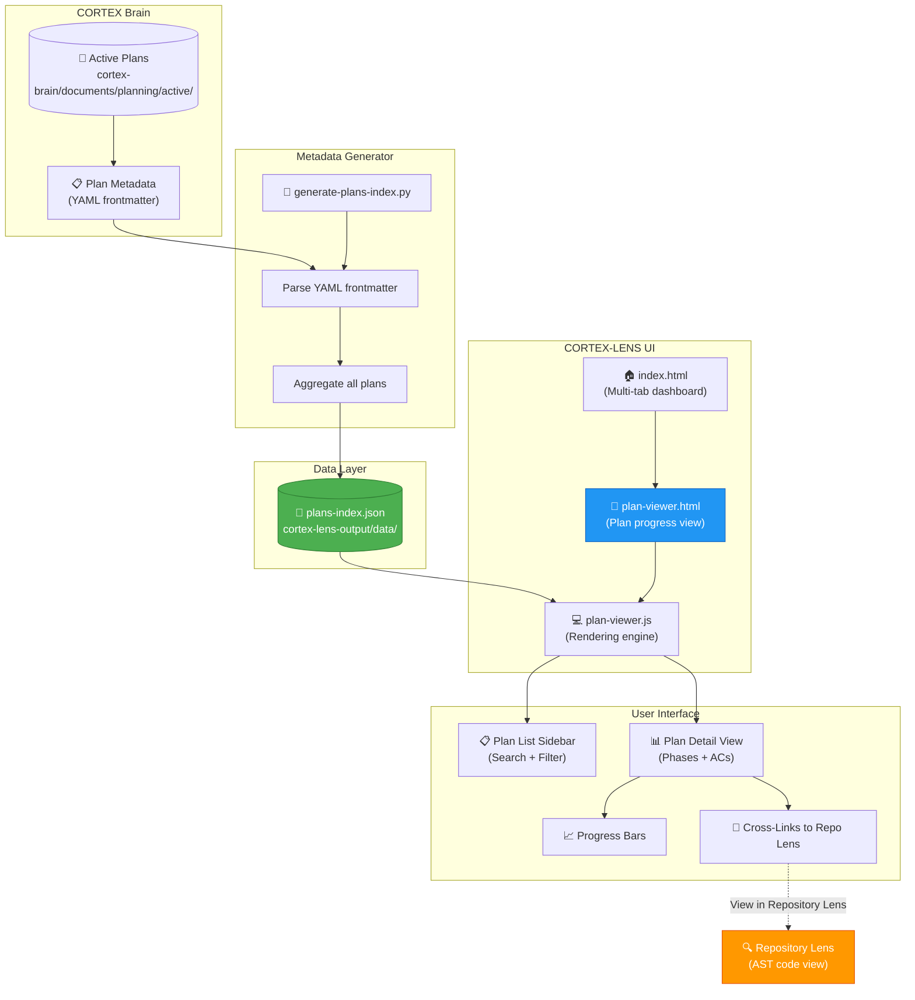
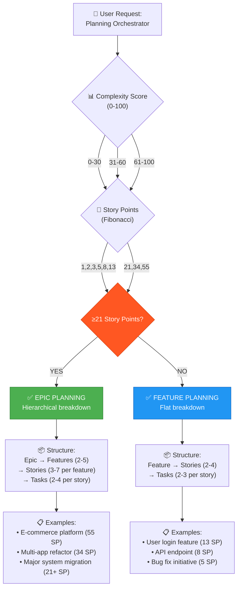
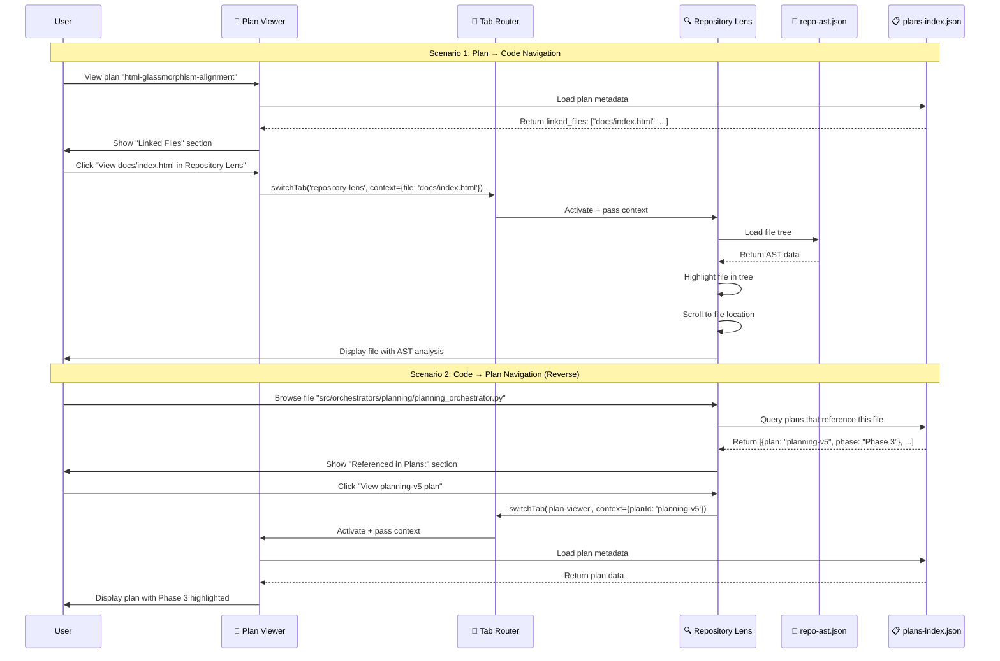
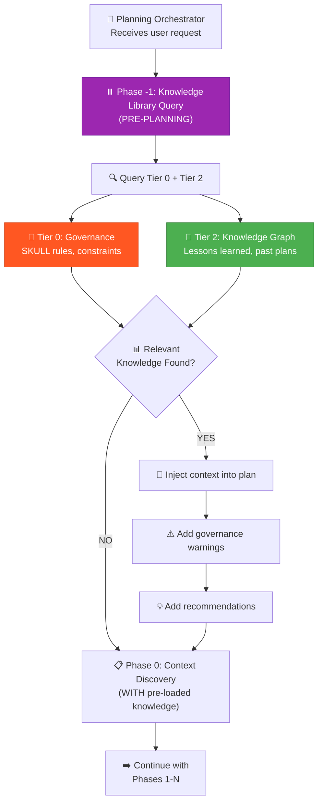
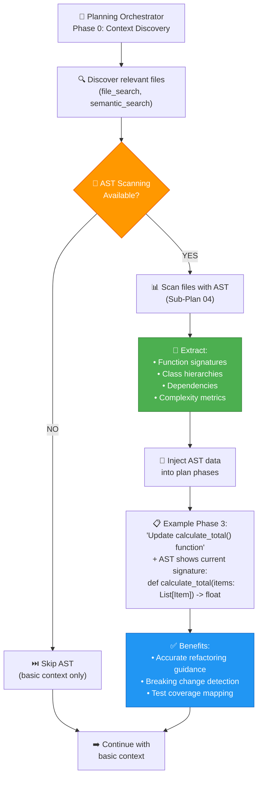
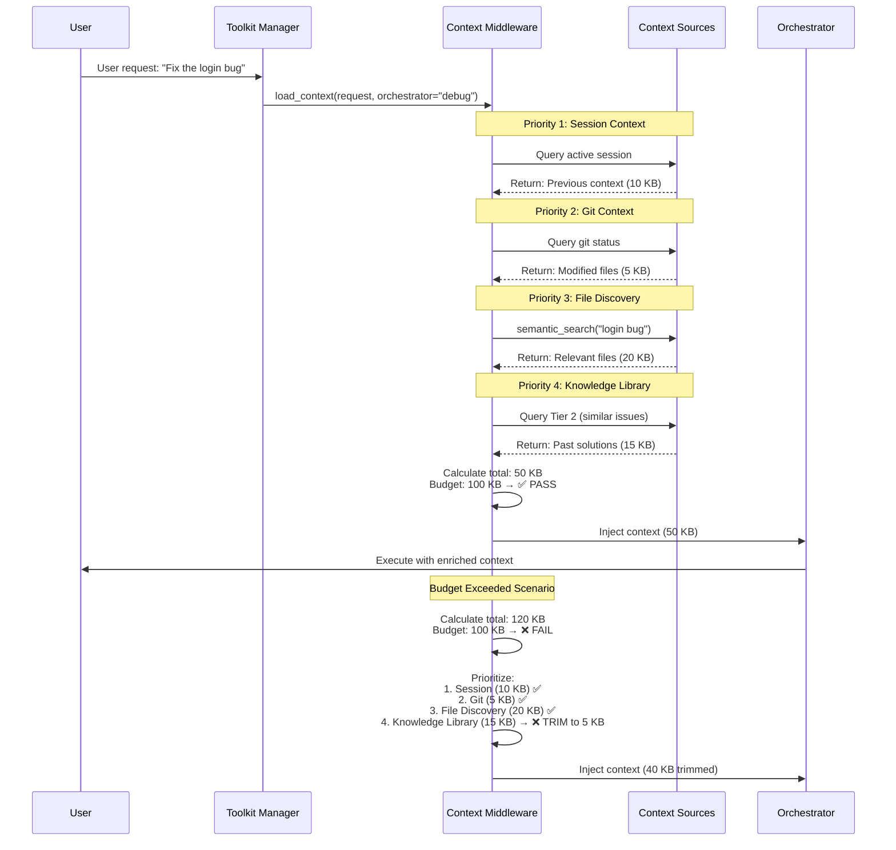
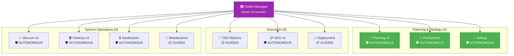

# 🔷 Mermaid Diagram Specifications for Phase 7d

**Plan:** html-glassmorphism-alignment  
**Phase:** 7d - Diagram & Illustration Updates  
**Created:** 2026-01-04

---

## 📊 Diagram 1: Plan Viewer Architecture & Data Flow

**File:** `plan-viewer-architecture.mmd`  
**Purpose:** Show Plan Viewer component architecture + data flow from plans-index.json



**Usage:** `docs/orchestrators/cortex-lens-architecture.html`

---

## 🌳 Diagram 2: Epic vs. Feature Decision Tree

**File:** `epic-vs-feature-decision-tree.mmd`  
**Purpose:** Help users decide when to use Epic planning vs. Feature planning



**Usage:** `docs/orchestrators/planning-v5-epic-vs-feature.html`

---

## 🔄 Diagram 3: Plan Viewer ↔ Repository Lens Cross-Linking

**File:** `plan-repo-lens-cross-linking.mmd`  
**Purpose:** Show bidirectional cross-linking between Plan Viewer and Repository Lens



**Usage:** `docs/orchestrators/cortex-lens-architecture.html`

---

## 🧠 Diagram 4: Phase -1 Knowledge Library Flow

**File:** `phase-minus-1-knowledge-library-flow.mmd`  
**Purpose:** Show how Phase -1 queries Knowledge Library before plan creation



**Usage:** `docs/orchestrators/planning-v5.html` (Phase -1 section)

---

## 🔍 Diagram 5: AST Scanning Integration in Planning v5

**File:** `ast-scanning-planning-v5.mmd`  
**Purpose:** Show how AST scanning integrates into Planning v5 workflow



**Usage:** `docs/orchestrators/planning-v5.html` (AST Scanning section)

---

## 🔧 Diagram 6: Context Middleware Priority Logic

**File:** `context-middleware-priority-logic.mmd`  
**Purpose:** Show how Context Middleware prioritizes context sources



**Usage:** `docs/features/context-middleware.html`

---

## 📊 Diagram 7: 10 Orchestrator Ecosystem Update

**File:** `10-orchestrator-ecosystem.mmd`  
**Purpose:** Update existing 8-orchestrator diagram to show all 10



**Usage:** Replace existing diagram in `docs/architecture/orchestrator-ecosystem.html`

---

## 📝 Implementation Notes

### Rendering Requirements

All Mermaid diagrams must:
1. Use **consistent color scheme** (glassmorphism palette)
2. Include **Font Awesome icons** (fa-* classes)
3. **Responsive sizing** (work on mobile + desktop)
4. **High contrast** for accessibility (WCAG 2.1 AA)

### Glassmorphism Color Palette

```css
/* Use these colors in Mermaid diagrams */
--primary: #2196F3 (Blue)
--success: #4CAF50 (Green)
--warning: #FF9800 (Orange)
--error: #F44336 (Red)
--purple: #9C27B0 (Epic/Master Orchestrator)
```

### Integration Points

| Diagram | Target Page | Section |
|---------|-------------|---------|
| Plan Viewer Architecture | `docs/orchestrators/cortex-lens-architecture.html` | Architecture Overview |
| Epic vs. Feature Decision Tree | `docs/orchestrators/planning-v5-epic-vs-feature.html` | Decision Guide |
| Cross-Linking | `docs/orchestrators/cortex-lens-architecture.html` | Integration |
| Phase -1 Flow | `docs/orchestrators/planning-v5.html` | Phase -1 Section |
| AST Scanning | `docs/orchestrators/planning-v5.html` | AST Integration |
| Context Middleware | `docs/features/context-middleware.html` | Priority Logic |
| 10 Orchestrators | `docs/architecture/orchestrator-ecosystem.html` | Ecosystem |

---

**Status:** ✅ READY FOR PHASE 7D IMPLEMENTATION
