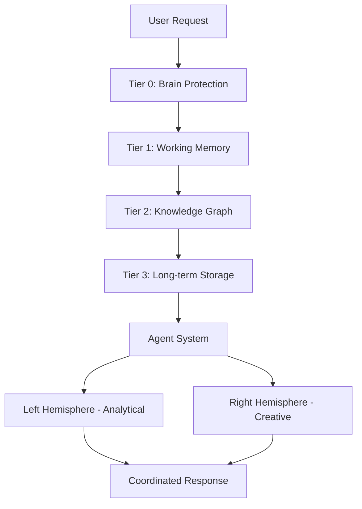
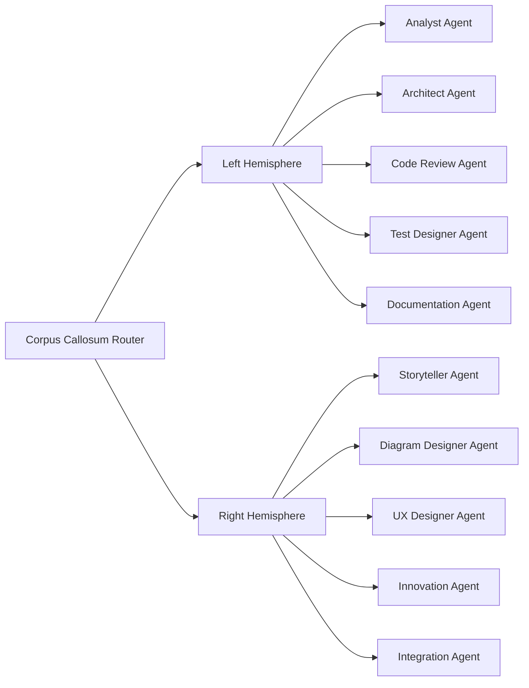

# CORTEX Architecture

**Version:** 3.0  
**Status:** Production Ready  
**Author:** Asif Hussain

---

## 🎯 System Overview

CORTEX is built on a **4-tier brain architecture** inspired by human cognition, with a **split-brain agent system** (10 specialized agents) and **persistent memory** across sessions.



**Architecture Principles:**
- **Memory-First Design:** All interactions persist across sessions
- **Agent Specialization:** 10 agents with specific roles (no overlap)
- **Protection Layer:** Brain protection rules prevent context overflow
- **Extensibility:** Plugin system for custom operations

---

## 🧠 Tier 0: Brain Protection (SKULL Rules)

**Purpose:** Entry point validation and token budget enforcement

### Key Components

**1. Entry Point (`CORTEX.prompt.md`)**
- Token budget: 5,000 tokens (hard limit)
- Template-based responses (no Python execution)
- Module architecture (external documentation references)
- Performance target: <3,500 tokens

**2. Brain Protection Rules (`brain-protection-rules.yaml`)**
```yaml
skull_rules:
  S01_token_budget:
    limit: 5000
    enforcement: BLOCKING
    penalty: "Reject request exceeding token budget"
  
  K02_modular_architecture:
    requirement: "Use #file: references for documentation"
    enforcement: WARNING
  
  U03_no_python_execution:
    requirement: "Template-based responses only"
    enforcement: BLOCKING
  
  L04_performance_target:
    target: 3500 tokens
    enforcement: IDEAL
```

**3. Template System**
- 31+ response templates
- Trigger-based selection
- YAML-driven configuration
- AI-readable instructions embedded in prompt

### Protection Mechanisms

| Rule | Purpose | Enforcement |
|------|---------|-------------|
| Token Budget | Prevent context overflow | BLOCKING |
| Modular Architecture | Keep prompt maintainable | WARNING |
| No Python Execution | AI compatibility | BLOCKING |
| Performance Target | Optimize response time | IDEAL |

**References:**
- Mermaid Diagram: `diagrams/mermaid/brain-protection.mmd`
- DALL-E Prompt: `diagrams/prompts/06-brain-protection-prompt.md`

---

## 💾 Tier 1: Working Memory (Conversation Manager)

**Purpose:** Recent conversation storage and context retrieval

### Architecture

```python
# Simplified architecture
ConversationManager:
    - store_conversation(user_msg, assistant_msg, context)
    - retrieve_recent(limit=10)
    - search_conversations(query, filters)
    - import_conversations(file_path)
    - export_conversations(output_path)
```

### Database Schema

**SQLite Storage** (`cortex-brain/tier1/conversation-history.db`)

```sql
CREATE TABLE conversations (
    id INTEGER PRIMARY KEY,
    timestamp DATETIME,
    user_message TEXT,
    assistant_response TEXT,
    context_data JSON,
    workspace TEXT,
    session_id TEXT,
    tokens_used INTEGER
);

CREATE INDEX idx_timestamp ON conversations(timestamp);
CREATE INDEX idx_workspace ON conversations(workspace);
CREATE INDEX idx_session ON conversations(session_id);
```

### Operations

**Storage:**
- Auto-save every conversation
- Context metadata (workspace, file, line)
- Token usage tracking

**Retrieval:**
- Recent conversations (last N)
- Search by keyword
- Filter by workspace/session

**Import/Export:**
- JSON format for portability
- Conversation vault for backups
- Cross-workspace transfer

**Capacity:**
- Unlimited conversations
- Automatic cleanup (configurable retention)
- Compression for old conversations

**References:**
- Mermaid Diagram: `diagrams/mermaid/conversation-tracking.mmd`
- DALL-E Prompt: `diagrams/prompts/04-conversation-tracking-prompt.md`

---

## 🕸️ Tier 2: Knowledge Graph (Pattern Learning)

**Purpose:** Semantic pattern learning and relationship extraction

### Architecture

```yaml
knowledge_graph:
  entities:
    - type: class
      confidence: 0.95
      namespace: protected
    
    - type: function
      confidence: 0.85
      namespace: public
  
  relationships:
    - source: UserService
      target: Database
      type: depends_on
      confidence: 0.90
  
  patterns:
    - pattern: "authentication workflow"
      occurrences: 15
      confidence: 0.93
```

### Components

**1. Entity Extraction**
- Classes, functions, modules
- Confidence scoring (0.0 - 1.0)
- Namespace protection (CORTEX internals off-limits)

**2. Relationship Mapping**
- Dependencies (imports, calls)
- Inheritance hierarchies
- Data flow paths

**3. Pattern Recognition**
- Coding style patterns
- Architecture patterns
- Naming conventions

### Confidence Weighting

| Confidence | Meaning | Action |
|------------|---------|--------|
| 0.9 - 1.0 | High certainty | Use without confirmation |
| 0.7 - 0.89 | Medium certainty | Use with validation |
| 0.5 - 0.69 | Low certainty | Suggest, don't assume |
| < 0.5 | No certainty | Ignore or ask user |

### Smart Context Retrieval

**Algorithm:**
1. Extract entities from user request
2. Find related entities in knowledge graph
3. Score relevance based on relationships
4. Inject top N entities into context
5. Track retrieval success for learning

**References:**
- Mermaid Diagram: `diagrams/mermaid/information-flow.mmd`
- DALL-E Prompt: `diagrams/prompts/03-information-flow-prompt.md`

---

## 📚 Tier 3: Long-term Storage (Development Context)

**Purpose:** Workspace-specific patterns and historical archive

### Storage Structure

```
cortex-brain/tier3/
├── workspace-contexts/
│   ├── project-a.yaml      # Project A patterns
│   ├── project-b.yaml      # Project B patterns
│   └── project-c.yaml      # Project C patterns
├── historical-archive/
│   ├── 2024-11/            # Monthly archives
│   ├── 2024-12/
│   └── 2025-01/
└── pattern-evolution/
    ├── authentication.yaml  # How auth patterns evolved
    ├── testing.yaml         # Testing strategy evolution
    └── deployment.yaml      # Deployment pattern evolution
```

### Context Files

**Example:** `project-a.yaml`

```yaml
workspace:
  name: "Project A"
  path: "/path/to/project-a"
  language: "Python"
  framework: "FastAPI"

patterns:
  coding_style:
    - "Type hints required for all functions"
    - "Docstrings follow Google style"
    - "Max line length: 100 characters"
  
  testing:
    - "Pytest for unit tests"
    - "Coverage target: 90%+"
    - "Integration tests in tests/integration/"
  
  architecture:
    - "Layered architecture (routes, services, models)"
    - "Dependency injection via FastAPI Depends"
    - "SQLAlchemy for ORM"

preferences:
  error_handling: "Raise custom exceptions, not generic Exception"
  logging: "Structured logging with loguru"
  documentation: "Auto-generate API docs with Swagger"

historical_decisions:
  - date: "2024-11-01"
    decision: "Migrated from Flask to FastAPI"
    reason: "Better async support and type safety"
  
  - date: "2024-12-15"
    decision: "Adopted Pydantic v2"
    reason: "Performance improvements and validation features"
```

### Pattern Evolution

**Tracks how patterns change over time:**

```yaml
pattern: "authentication"
evolution:
  - version: 1
    date: "2024-01-15"
    approach: "Session-based auth"
    reason: "Simple monolithic app"
  
  - version: 2
    date: "2024-06-20"
    approach: "JWT tokens"
    reason: "Migrated to microservices"
  
  - version: 3
    date: "2024-11-10"
    approach: "OAuth2 with refresh tokens"
    reason: "Security audit recommendations"
```

**References:**
- Pattern storage in `cortex-brain/tier3/`
- Archive compression for old data
- Cross-session learning enabled

---

## 🤖 Agent System (Split-Brain Architecture)

**Purpose:** Specialized agents collaborate like a development team

### Architecture Overview



### Left Hemisphere (Analytical Tasks)

**1. Analyst Agent**
- Requirement analysis
- User story decomposition
- Acceptance criteria definition
- DoR validation

**2. Architect Agent**
- System design
- Architecture decisions
- Component specifications
- Integration patterns

**3. Code Review Agent**
- Quality assurance
- SOLID principles enforcement
- Security review (OWASP)
- Performance optimization

**4. Test Designer Agent**
- Test strategy
- TDD workflow
- Coverage analysis
- Integration test planning

**5. Documentation Agent**
- Technical writing
- API documentation
- Code comments
- README maintenance

### Right Hemisphere (Creative Tasks)

**6. Storyteller Agent**
- Narrative documentation
- "The Awakening of CORTEX" story
- Executive summaries
- User-friendly guides

**7. Diagram Designer Agent**
- Mermaid diagram generation
- DALL-E prompt creation
- Visual documentation
- Architecture diagrams

**8. UX Designer Agent**
- User experience optimization
- Interface design recommendations
- Accessibility considerations
- User journey mapping

**9. Innovation Agent**
- Novel solution proposals
- Alternative approaches
- Creative problem-solving
- Future possibilities

**10. Integration Agent**
- Agent coordination
- Context sharing
- Conflict resolution
- Workflow orchestration

### Corpus Callosum (Router)

**Routing Algorithm:**

```python
def route_request(user_request):
    # Analyze request intent
    intent = detect_intent(user_request)
    
    # Determine hemisphere
    if intent in ['analyze', 'design', 'review', 'test']:
        hemisphere = 'left'  # Analytical
    elif intent in ['create', 'visualize', 'innovate']:
        hemisphere = 'right'  # Creative
    else:
        hemisphere = 'both'  # Requires collaboration
    
    # Select specialized agents
    agents = select_agents(intent, hemisphere)
    
    # Coordinate execution
    return coordinate_agents(agents, user_request)
```

**References:**
- Mermaid Diagram: `diagrams/mermaid/agent-coordination.mmd`
- DALL-E Prompt: `diagrams/prompts/02-agent-coordination-prompt.md`

---

## 🔌 Plugin System

**Purpose:** Extend CORTEX functionality without modifying core

### Architecture

```python
# Base plugin interface
class BasePlugin:
    def initialize(self) -> None:
        """Plugin initialization"""
        pass
    
    def execute(self, context: Dict) -> Dict:
        """Plugin execution"""
        pass
    
    def cleanup(self) -> None:
        """Plugin cleanup"""
        pass

# Plugin registry
class PluginRegistry:
    def register_plugin(self, plugin: BasePlugin):
        """Register custom plugin"""
        pass
    
    def unregister_plugin(self, plugin_id: str):
        """Unregister plugin"""
        pass
    
    def list_plugins(self) -> List[str]:
        """List all registered plugins"""
        pass
```

### Plugin Types

**1. Operation Plugins**
- Custom operations beyond core CORTEX
- Example: Slack integration, JIRA sync

**2. Agent Plugins**
- Additional specialized agents
- Example: Security audit agent, performance profiler agent

**3. Memory Plugins**
- Custom memory backends
- Example: PostgreSQL instead of SQLite, Redis cache

**4. Template Plugins**
- Custom response templates
- Example: Company-specific formats

### Plugin Discovery

**Location:** `cortex-brain/plugins/`

**Structure:**
```
cortex-brain/plugins/
├── __init__.py
├── slack_integration/
│   ├── __init__.py
│   ├── plugin.py
│   └── config.yaml
└── jira_sync/
    ├── __init__.py
    ├── plugin.py
    └── config.yaml
```

**Auto-loading:**
- Plugins discovered on startup
- Configuration via `cortex.config.json`
- Enable/disable per plugin

**References:**
- Mermaid Diagram: `diagrams/mermaid/plugin-system.mmd`
- DALL-E Prompt: `diagrams/prompts/05-plugin-system-prompt.md`

---

## 💾 Memory Persistence

### Database Architecture

**Primary Storage:** SQLite (Tier 1, Tier 2)  
**File Storage:** YAML (Tier 3, Configuration)  
**Temporary Storage:** In-memory (Active context)

**Database Files:**

```
cortex-brain/
├── tier1/
│   └── conversation-history.db    # Working memory
├── tier2/
│   └── knowledge-graph.db         # Pattern learning
└── tier3/
    └── workspace-contexts/        # Long-term YAML files
```

### Schema Evolution

**Migration System:**
```python
# Migration tracking
CREATE TABLE schema_migrations (
    version INTEGER PRIMARY KEY,
    applied_at DATETIME,
    description TEXT
);

# Apply migrations
def migrate_database():
    current_version = get_schema_version()
    target_version = LATEST_VERSION
    
    for migration in get_pending_migrations():
        apply_migration(migration)
        update_schema_version(migration.version)
```

### Backup & Recovery

**Automated Backups:**
- Daily backups to `cortex-brain/backups/`
- Retention: 30 days
- Compression: gzip

**Export/Import:**
```bash
# Export all data
python scripts/export_brain.py --output=brain-backup-2025-11-22.json

# Import data
python scripts/import_brain.py --input=brain-backup-2025-11-22.json
```

**Disaster Recovery:**
1. Stop CORTEX
2. Restore database files from backup
3. Verify integrity: `python scripts/verify_brain.py`
4. Restart CORTEX

---

## 🔐 Security Architecture

### Data Protection

**1. Sensitive Data Exclusion**
- API keys never stored in brain
- Credentials excluded from conversations
- PII detection and masking

**2. Namespace Protection**
- CORTEX internals off-limits for learning
- User workspace only for pattern extraction
- No cross-workspace contamination

**3. Access Control**
- Admin operations require explicit approval
- User operations sandboxed
- Plugin permissions configurable

### OWASP Integration

**Automated Security Review:**

| OWASP Category | CORTEX Check |
|----------------|--------------|
| A01: Access Control | Permission validation in planning |
| A02: Cryptographic Failures | Encryption requirements |
| A03: Injection | Input sanitization review |
| A04: Insecure Design | Architecture review |
| A05: Security Misconfiguration | Config validation |
| A06: Vulnerable Components | Dependency scanning |
| A07: Authentication Failures | Auth pattern review |
| A08: Data Integrity Failures | Integrity checks |
| A09: Logging Failures | Logging adequacy |
| A10: SSRF | Network boundary review |

**Security Checklist:**
- Integrated into feature planning (DoR)
- Enforced in code review agent
- Tracked in implementation DoD

---

## 📊 Performance Characteristics

### Response Time

| Operation | Target | Typical |
|-----------|--------|---------|
| Context Injection | <100ms | 50ms |
| Template Selection | <50ms | 25ms |
| Agent Routing | <100ms | 75ms |
| Knowledge Graph Query | <200ms | 150ms |
| Full Response Generation | <500ms | 400ms |

### Memory Usage

| Component | RAM Usage | Disk Usage |
|-----------|-----------|------------|
| Tier 1 (SQLite) | 10MB | 50MB (1000 conversations) |
| Tier 2 (Knowledge Graph) | 20MB | 100MB (large codebase) |
| Tier 3 (YAML Files) | 5MB | 10MB (5 workspaces) |
| Template System | 2MB | 1MB |
| **Total** | **~40MB** | **~160MB** |

### Scalability

**Conversation Storage:**
- Tested: 10,000 conversations
- Performance: <200ms queries
- Cleanup: Auto-archive after 90 days

**Knowledge Graph:**
- Tested: 50,000 entities
- Performance: <300ms traversal
- Optimization: Index on confidence scores

---

## 🚀 Deployment Architecture

### User Package (Lightweight)

```
CORTEX-user-package/
├── .github/
│   ├── copilot-instructions.md    # Entry point setup
│   └── prompts/
│       └── CORTEX.prompt.md       # Main prompt
├── cortex-brain/
│   ├── response-templates.yaml
│   ├── operations-config.yaml
│   ├── tier1/ (empty - created on first run)
│   ├── tier2/ (empty - created on first run)
│   └── tier3/ (empty - created on first run)
├── scripts/
│   ├── setup_cortex.py
│   └── verify_setup.py
└── cortex.config.json
```

**Size:** ~5MB (core only, no test/admin files)

### Admin Package (Full)

**Includes:**
- All user package contents
- Test suites (834 tests)
- Admin scripts (doc generator, sweeper, etc.)
- Development tools
- CI/CD configurations

**Size:** ~50MB (complete repository)

---

## 📖 Related Documentation

- **[CORTEX vs COPILOT](CORTEX-VS-COPILOT.md)** - Why choose CORTEX
- **[Getting Started](GETTING-STARTED.md)** - Setup and onboarding
- **[Technical Documentation](TECHNICAL-DOCUMENTATION.md)** - API reference
- **[MkDocs Site]** - Complete documentation portal

---

**Author:** Asif Hussain  
**Copyright:** © 2024-2025 Asif Hussain. All rights reserved.  
**Version:** 3.0  
**Last Updated:** 2025-11-22  
**Repository:** https://github.com/asifhussain60/CORTEX
