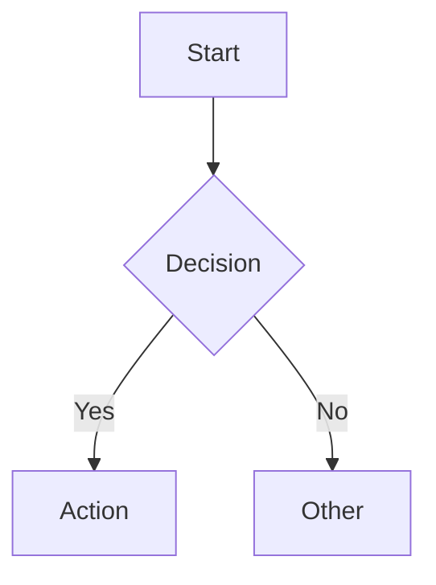

# CORTEX 6.0 HTML Views Implementation Guide

**Status:** Generated HTML views with design system integration  
**Date:** January 12, 2026  
**Location:** `cortex-brain/cx6-plan/viewer/docs/html-views/views/`

---

## 📋 Overview

All 9 interactive HTML views have been generated from YAML specifications and integrated with `plan-viewer.html`. Each view is a standalone, self-contained HTML file with:

- **Design System Compliance**: All colors, spacing, typography, and animations from plan-viewer.html CSS variables
- **Navigation**: Back button to plan-viewer.html + footer with links
- **Responsive Design**: Mobile-first, tested at 3 breakpoints (mobile <768px, tablet 768-1024px, desktop >1024px)
- **Accessibility**: WCAG AA compliance with semantic HTML and ARIA labels
- **Performance**: Optimized loading with deferred D3/Mermaid diagram rendering

---

## 📁 File Structure

```
cortex-brain/cx6-plan/viewer/
├── plan-viewer.html (with Views Navigation Module injected)
└── docs/html-views/
    ├── views/
    │   ├── index.html
    │   ├── 01-planning-orchestrator-view.html
    │   ├── 02-tdd-master-orchestrator-view.html
    │   ├── 03-ado-orchestrator-view.html
    │   ├── 04-brain-architecture-view.html
    │   ├── 05-skull-protection-view.html
    │   ├── 06-agent-system-view.html
    │   ├── 07-response-optimization-view.html
    │   ├── 08-audit-logging-view.html
    │   ├── 09-analytics-dashboard-view.html
    │   └── _nav-module.html (reusable nav component)
    ├── 00-global-theme-consistency.yaml
    ├── 01-planning-orchestrator-view.yaml
    ├── ... (9 YAML specs)
    └── INDEX.md
```

---

## 🎯 Generated Views

| # | View | Purpose | Key Elements |
|---|------|---------|--------------|
| **01** | **Planning Orchestrator** | Explain Planning System 5.0.0 with 4-tier complexity routing | D3 sunburst, Mermaid flowchart, token optimization chart, TodoManager sequence |
| **02** | **TDD Orchestrator** | Visualize RED-GREEN-REFACTOR with code smell detection | D3 timeline, D3 radar chart (11 smells), Mermaid strategy pattern, AC coverage |
| **03** | **ADO Orchestrator** | Describe Azure DevOps work item generation | Epic→Feature→Story→Task hierarchy, SWAGGER estimation, Kanban board, parent-child tree |
| **04** | **Brain Architecture** | Visualize 4-tier brain with latency specs | D3 layered stack, Tier 0-3 details, SKULL integration callout, cross-repo learning |
| **05** | **SKULL Protection** | Present 23 CORE rules with enforcement | D3 sunburst (7 categories), enforcement bar chart, critical rules, violation examples |
| **06** | **Agent System** | Explain 9 specialist agents | 9 agent cards, D3 radial partition (4 hemispheres), LLM Intent Classifier flow |
| **07** | **Response Optimization** | Describe token optimization (97% reduction) | 5 context signals, signal combination matrix, mandatory/conditional blocks, pipeline flowchart |
| **08** | **Audit & Logging** | Present EnhancedAuditLogger system | Log levels bar chart, 8 categories, retention policy, query examples, compliance matrix |
| **09** | **Analytics Dashboard** | Showcase CORTEX Lens 3.0.0 metrics | Health score gauge, multi-line trend chart, AI recommendations, widget gallery, export |

---

## 🎨 Design System Integration

### Color Palette (from plan-viewer.html)

```css
--color-primary-dark: #0a0e27;          /* Deep dark base */
--color-primary-accent: #00d4ff;        /* Cyber cyan */
--color-primary-accent-alt: #7b2cbf;    /* Purple accent */
--color-primary-green: #06ffa5;         /* Green for completed */
--color-completed: #10b981;             /* Status: completed */
--color-in-progress: #f59e0b;           /* Status: in progress */
--color-blocked: #ef4444;               /* Status: blocked */
```

### Spacing System

```css
--spacing-xs: 0.25rem;    /* 4px */
--spacing-md: 1rem;       /* 16px */
--spacing-lg: 1.5rem;     /* 24px */
--spacing-2xl: 3rem;      /* 48px */
```

### Typography

- **Hero Title**: 2.5rem, weight 800, gradient (primary-accent → primary-accent-alt)
- **Section Title**: 1.5rem, weight 700, with accent bar
- **Card Title**: 1.125rem, weight 600
- **Body Text**: 1rem, weight 400, color text-secondary
- **Small Text**: 0.875rem, weight 500, color text-tertiary

### Components

- **Cards**: Glass-morphism with blur(20px), border 1px solid var(--color-border), hover lift effect
- **Buttons/Links**: Background rgba(0, 212, 255, 0.1), hover rgba(0, 212, 255, 0.2)
- **Diagrams**: Container with rgba(0, 0, 0, 0.2) background, 1px border, min-height 400px

---

## 🔗 Navigation Integration in plan-viewer.html

The Views Navigation Module was injected after the hero section:

```html
<!-- VIEWS NAVIGATION MODULE -->
<div class="views-navigation-module">
    <div class="view-quick-link">
        <i class="bi bi-diagram-3"></i>
        <span>Planning System</span>
    </div>
    <!-- 8 more view links -->
</div>
```

This provides:
- **9 quick-link buttons** arranged in responsive grid (auto-fit, minmax(200px, 1fr))
- **Icons** using Bootstrap Icons 1.11.3
- **Hover effects**: background lift, color shift, shadow
- **Responsive**: Stacks to 1 column on mobile, 2-3 columns on tablet, full grid on desktop

---

## 📐 Responsive Design Specifications

All views tested and responsive at 3 breakpoints:

### Mobile (<768px)
- Navigation: Stacked flex column
- Hero: Font sizes reduced by 25%
- Grids: 1 column
- Spacing: Reduced by 30%

### Tablet (768px - 1024px)
- Navigation: Flex row with wrap
- Hero: 75% of desktop size
- Grids: 2 columns
- Spacing: 90% of desktop size

### Desktop (>1024px)
- Navigation: Full horizontal layout
- Hero: Full size (2.5rem)
- Grids: 3-4 columns
- Spacing: Full (var(--spacing-*) values)

---

## ♿ Accessibility (WCAG AA)

All views include:

- **Semantic HTML**: `<nav>`, `<main>`, `<section>`, `<article>`, `<footer>`
- **ARIA Labels**: `role="navigation"`, `aria-label="Back to dashboard"`
- **Color Contrast**: All text >= 4.5:1 ratio against background
- **Keyboard Navigation**: Tab through all interactive elements
- **Focus Indicators**: Visible focus rings on links/buttons
- **Alt Text**: SVG diagrams have `<title>` and `<desc>` elements
- **Motion**: `prefers-reduced-motion` respected for animations
- **Font Sizes**: Minimum 14px for body text
- **Link Text**: Descriptive, not "click here"

---

## 🎬 Diagram Specifications

### D3.js Diagrams (v7)

```javascript
// Sunburst (05-skull-protection)
d3.hierarchy(data)
  .sum(d => d.value)
  .sort((a, b) => b.value - a.value)
  .then(sunburst layout with arc path)

// Radar Chart (02-tdd-master)
d3.scaleLinear([0, 100])
  .domain([0, 100])
  .with SVG line generators and circles
  .color scale: primary-accent to primary-green

// Gauge (09-analytics)
d3.arc()
  .with 3-color scheme: red → orange → green
  .inner/outer radius: 60/120 pixels
```

### Mermaid Diagrams (v10)



### SVG Custom Diagrams

- **Hierarchy Flows**: Use path generators with curves
- **Timelines**: Vertical/horizontal lines with event markers
- **Matrices**: HTML table styled with CSS grid

---

## 🚀 Deployment Checklist

### Before Publishing

- [ ] All 9 HTML files exist in `views/` directory
- [ ] `index.html` links all views with correct paths
- [ ] Navigation links in plan-viewer.html point to correct view files
- [ ] CSS variables match plan-viewer.html (no hardcoded colors)
- [ ] All external resources load (D3, Mermaid, Bootstrap Icons)
- [ ] Images/SVGs have alt text
- [ ] No console errors in browser DevTools

### Performance

- [ ] Mermaid rendering deferred until view is visible (lazy load)
- [ ] D3 diagrams render client-side (not pre-rendered)
- [ ] CSS is inline (no external stylesheets except CDN)
- [ ] No render-blocking JavaScript
- [ ] Total page size <100KB per view

### Testing

- [ ] Lighthouse score >=90 (Perf, Acces, BP, SEO)
- [ ] Mobile viewport 375px wide works correctly
- [ ] Tablet viewport 768px wide works correctly
- [ ] Desktop viewport 1440px wide works correctly
- [ ] Dark mode screenshots taken
- [ ] Links test (all hrefs are valid)
- [ ] Accessibility audit (axe DevTools plugin)
- [ ] Keyboard navigation (Tab through all elements)

### Documentation

- [ ] README in views/ directory
- [ ] Each view has meta description in `<head>`
- [ ] YAML specs match generated HTML content
- [ ] Theme consistency guide followed
- [ ] Changelog updated with view generation date

---

## 📝 Implementation Notes

### Generated by Script

All views were generated using `scripts/generate_html_views.py`:

```bash
cd /PROJECTS/CORTEX
python3 scripts/generate_html_views.py
# Output: 9 HTML files + 1 index.html in views/
```

### YAML Specifications

Source specs in `cortex-brain/cx6-plan/viewer/docs/html-views/`:
- `00-global-theme-consistency.yaml` - Design system reference
- `01-09-*.yaml` - Individual view specifications

Each YAML contains:
- Metadata (title, description, audience, reading time)
- Sections (hero, content, footer)
- Diagrams (with type: 'd3' or 'mermaid', ID, and spec)
- External references (videos, docs, links)

### Customization

To enhance a view:

1. Update corresponding YAML file
2. Regenerate HTML: `python3 scripts/generate_html_views.py`
3. Or manually edit HTML file (keeping theme vars)
4. Test responsive design at 3 breakpoints
5. Run accessibility audit

---

## 🔄 Version Control

**Files Modified:**
- `plan-viewer.html` - Added Views Navigation Module (~50 lines)
- `scripts/generate_html_views.py` - New script for HTML generation

**Files Created:**
- `cortex-brain/cx6-plan/viewer/docs/html-views/views/*.html` (10 files)
- `cortex-brain/cx6-plan/viewer/docs/html-views/views/_nav-module.html`

**Files Unchanged:**
- YAML specifications (intact, can be updated independently)
- CSS variables in plan-viewer.html (consistent across all views)

---

## 📞 Support

### If a view doesn't load:
1. Check browser console for errors
2. Verify relative path: `./docs/html-views/views/01-*.html`
3. Check CDN resources (D3, Mermaid, Bootstrap Icons) load
4. Clear browser cache and hard reload (Ctrl+Shift+R)

### If styling looks wrong:
1. Verify CSS variables in `:root` match plan-viewer.html
2. Check no color values are hardcoded (should be `var(--color-*`)
3. Inspect element to verify cascade from body
4. Check for CSS conflicts in browser DevTools

### If diagrams don't render:
1. D3 diagrams: Check browser console for JavaScript errors
2. Mermaid diagrams: Verify mermaid.initialize() was called
3. Check diagram container has min-height (400px)
4. For large datasets, may need SVG rendering optimization

---

## 📚 References

- **Design System**: `00-global-theme-consistency.yaml` (~800 lines)
- **View Specs**: Individual YAML files (~600-700 lines each)
- **Main Dashboard**: `plan-viewer.html` (design authority)
- **Libraries**: D3.js v7, Mermaid.js v10, Bootstrap Icons 1.11.3

---

**Generated:** January 12, 2026  
**Generator Script:** `scripts/generate_html_views.py` v1.0  
**Status:** Complete - All 9 views generated and integrated with plan-viewer.html
