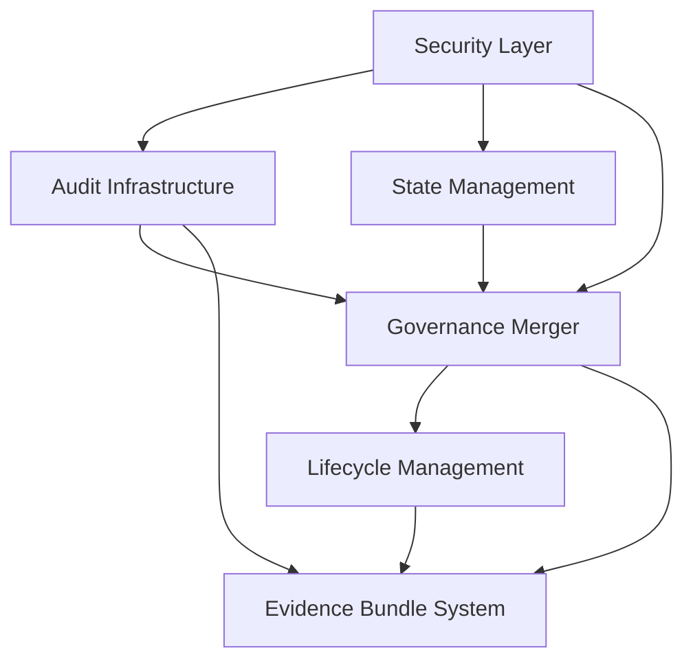

# Phase 1: Foundation Enhancement

**Duration:** 2 weeks (January 13 - January 24, 2026)  
**Status:** Ready to Implement  
**Priority:** CRITICAL  
**Dependencies:** None - This builds the base infrastructure

---

## 🎯 Overview

Phase 1 establishes the **core infrastructure** that every other CORTEX 6.0 component depends on. Without this foundation, no orchestrator can reliably operate in production.

### Why Foundation First?

Every orchestrator needs:
- **Audit Infrastructure** → Log all operations with <5ms latency
- **Governance Merger** → Enforce 4-tier rules (Tier 0 SKULL + Business)
- **State Manager** → Persist progress across failures
- **Lifecycle Tracking** → Monitor execution states
- **Evidence System** → Prove completion with test results
- **Security Layer** → Protect against path injection, secret leaks

**Philosophy:** Build the foundation solid. Everything compounds on this.

---

## 📊 Phase 1 Metrics

| Metric | Target | Current | Status |
|--------|--------|---------|--------|
| **AC-IDs** | 28 | 0 | ⏳ Not Started |
| **Components** | 6 | 0 | ⏳ Not Started |
| **Test Coverage** | ≥90% | 0% | ⏳ Not Started |
| **Performance** | <5ms audit latency | N/A | ⏳ Not Started |
| **Duration** | 2 weeks | Week 0 | ⏳ Not Started |

---

## 🏗️ Component Breakdown

### 1. Audit Infrastructure with Hash Chain

**AC-IDs:** AC-AUDIT-001 to AC-AUDIT-007  
**Priority:** CRITICAL  
**Duration:** 5 days  
**Owner:** Infrastructure Team

#### Capabilities

##### AC-AUDIT-001: EnhancedAuditLogger
- **Performance:** <5ms write latency (p99)
- **Storage:** SQLite with WAL mode
- **Retention:** Tiered (7d DEBUG, 30d INFO, 90d ERROR)
- **Categories:** GOVERNANCE, ORCHESTRATOR, VALIDATION, INFRASTRUCTURE, BRAIN, INTEGRATION, MCP

**Implementation:**
```python
# File: src/infrastructure/enhanced_audit_logger.py
class EnhancedAuditLogger:
    def log(self, level, category, message, correlation_id, ac_id=None):
        """
        Log with <5ms latency guarantee
        """
        entry = {
            "timestamp": datetime.utcnow().isoformat(),
            "level": level,
            "category": category,
            "message": message,
            "correlation_id": correlation_id,
            "ac_id": ac_id,
            "hash": self._compute_hash(previous_hash, current_data)
        }
        self.db.write_wal(entry)  # Write-Ahead Logging
```

##### AC-AUDIT-002: Hash Chain Integrity
- **Purpose:** Detect tampering via cryptographic chaining
- **Algorithm:** SHA-256(previous_hash + current_entry)
- **Verification:** On startup, verify chain integrity
- **Alert:** Broken chain triggers security incident

##### AC-AUDIT-003: Correlation ID Tracking
- **Format:** UUID4 per request
- **Propagation:** Across all orchestrator calls
- **Queries:** Trace entire execution path
- **Use Case:** Debug multi-orchestrator workflows

##### AC-AUDIT-004: Query Interface
```python
# Query examples
audit.query(ac_id="AC-AUDIT-001", level="ERROR")
audit.query(correlation_id=uuid, last="1h")
audit.query(category="GOVERNANCE", level="WARNING")
```

##### AC-AUDIT-005: Log Rotation & Compression
- **Rotation:** Daily at midnight UTC
- **Compression:** gzip after 7 days
- **Archive:** S3 for long-term retention
- **Cleanup:** Automatic based on retention policy

##### AC-AUDIT-006: Performance Monitoring
- **Metrics:** Write latency, query time, storage size
- **Alerts:** Latency >10ms triggers investigation
- **Dashboard:** Grafana integration (future)

##### AC-AUDIT-007: Audit Export & Compliance
- **Formats:** JSON, CSV, JSONL
- **Filtering:** By date range, AC-ID, category
- **Compliance:** SOC2, GDPR-ready logs

---

### 2. Governance Merger (4-Tier Hierarchy)

**AC-IDs:** AC-GOV-001 to AC-GOV-005  
**Priority:** CRITICAL  
**Duration:** 4 days  
**Owner:** Governance Team

#### Architecture

The Governance Merger resolves conflicts between 4 tiers:

| Tier | Category | Precedence | Content |
|------|----------|------------|---------|
| **0** | CORTEX_CORE | HIGHEST | 19 SKULL rules (immutable) |
| **1** | BUSINESS_TIER_0 | HIGH | Active epic, requirements |
| **2** | COMPANY_PRACTICES | MEDIUM | Engineering standards |
| **3** | KNOWLEDGE_PRACTICES | LOW | Learned patterns |

#### Capabilities

##### AC-GOV-001: Rule Loading & Validation
```python
# File: src/orchestrators/core/governance_merger.py
class GovernanceMerger:
    def load_rules(self):
        """
        Load from 4 tiers with schema validation
        """
        tier0 = self._load_yaml("cortex-brain/tier0/governance/core-rules.yaml")
        tier1 = self._load_yaml("cortex-brain/tier1/active-epic-requirements.yaml")
        tier2 = self._load_yaml("cortex-brain/tier2/company-practices.yaml")
        tier3 = self._load_yaml("cortex-brain/tier3/learned-patterns.yaml")
        
        self._validate_schema(tier0, CORE_SCHEMA)
        return self._merge(tier0, tier1, tier2, tier3)
```

##### AC-GOV-002: Conflict Resolution
- **Rule:** Tier 0 ALWAYS wins conflicts
- **Example:** If Tier 0 says "No root files" and Tier 2 says "Allow README.md", Tier 0 blocks
- **Logging:** All conflicts logged to audit with resolution

##### AC-GOV-003: Dynamic Rule Injection
- **Use Case:** Epic-specific rules injected at runtime
- **Scope:** Current epic only
- **Expiry:** Removed when epic completes
- **Example:** "Require Python 3.11 for ML epic"

##### AC-GOV-004: Rule Enforcement Hooks
```python
@governance_enforced(rule_id="CORE-019")
def implement_feature(request):
    """
    Automatically blocked if TDD-Master not invoked
    """
    pass
```

##### AC-GOV-005: Governance Health Check
- **Frequency:** On startup, hourly in production
- **Checks:** File integrity, schema validity, rule conflicts
- **Alert:** Slack notification on governance corruption

---

### 3. State Management System

**AC-IDs:** AC-STATE-001 to AC-STATE-003  
**Priority:** CRITICAL  
**Duration:** 3 days  
**Owner:** Infrastructure Team

#### Capabilities

##### AC-STATE-001: Progress Tracker
```yaml
# File: cortex-brain/tier1/tracking/progress-tracker.json
{
  "active_epic": "CORTEX-6.0-Foundation",
  "current_phase": "Phase 1",
  "current_todo": "AC-AUDIT-001",
  "ac_completed": ["AC-PLAN-001", "AC-PLAN-002"],
  "blockers": [],
  "last_updated": "2026-01-10T14:30:00Z",
  "completion_percentage": 12.5
}
```

##### AC-STATE-002: Atomic State Updates
- **Pattern:** Read → Modify → Write with file locking
- **Lock:** fcntl (Unix) / msvcrt (Windows)
- **Timeout:** 5 seconds max
- **Retry:** 3 attempts with exponential backoff

##### AC-STATE-003: State Recovery
- **Backup:** Hourly snapshots to `state/backups/`
- **Validation:** JSON schema on every write
- **Recovery:** Automatic rollback on corruption
- **Alert:** Slack notification on state recovery

---

### 4. Lifecycle Management

**AC-IDs:** AC-LIFECYCLE-001 to AC-LIFECYCLE-003  
**Priority:** HIGH  
**Duration:** 3 days  
**Owner:** Orchestration Team

#### State Machine

```
NOT_STARTED → IN_PROGRESS → COMPLETED
     ↓             ↓             ↓
  BLOCKED ←→  FAILED  →→  SKIPPED
```

#### Capabilities

##### AC-LIFECYCLE-001: State Transitions
- **Valid Transitions:** Defined in FSM
- **Invalid Transition:** Logged as governance violation
- **Rollback:** Can revert to previous state
- **Audit:** Every transition logged

##### AC-LIFECYCLE-002: Dependency Resolution
```python
# Automatically blocks if dependencies incomplete
dependencies = {
    "AC-ORCH-001": ["AC-AUDIT-001", "AC-GOV-001", "AC-STATE-001"]
}
```

##### AC-LIFECYCLE-003: Execution Monitoring
- **Heartbeat:** Every 30 seconds
- **Timeout:** 10 minutes for standard ops, 30 for long
- **Stale Detection:** No heartbeat = mark as FAILED
- **Auto-Recovery:** Restart from last checkpoint

---

### 5. Evidence Bundle System

**AC-IDs:** AC-EVIDENCE-001 to AC-EVIDENCE-003  
**Priority:** HIGH  
**Duration:** 4 days  
**Owner:** Quality Team

#### Structure

```
cortex-brain/tier1/evidence-bundles/AC-AUDIT-001/
├── manifest.yaml           # Metadata, completion proof
├── test_results.json      # All tests passing
├── audit_trace.jsonl      # Governance log
├── performance_metrics.json # Latency measurements
└── security_scan.json     # Vulnerability scan
```

#### Capabilities

##### AC-EVIDENCE-001: Bundle Template Generation
```yaml
# manifest.yaml
ac_id: "AC-AUDIT-001"
status: "completed"
completion_date: "2026-01-15T14:30:00Z"
validation_status: "passed"
evidence_complete: true
test_coverage: 92.5
performance_target_met: true
security_validated: true
dependencies_satisfied: ["AC-GOV-001"]
rollback_tested: true
```

##### AC-EVIDENCE-002: Automated Validation
- **Test Check:** All tests must pass (RED→GREEN→REFACTOR)
- **Coverage Check:** ≥90% for critical components
- **Performance Check:** <100ms for critical, <500ms standard
- **Security Check:** No hardcoded paths, no secrets

##### AC-EVIDENCE-003: Evidence Queries
```python
# Check if AC-ID has valid evidence
evidence.validate("AC-AUDIT-001")
# Returns: {valid: true, missing: [], warnings: []}

# Get completion proof
evidence.get_proof("AC-AUDIT-001")
# Returns: manifest.yaml with signed completion
```

---

### 6. Security & Privacy Layer

**AC-IDs:** AC-SECURITY-001 to AC-SECURITY-008  
**Priority:** CRITICAL  
**Duration:** 5 days  
**Owner:** Security Team

#### Capabilities

##### AC-SECURITY-001: Path Portability Validation (CORE-005)
```python
# Detect hardcoded paths
def validate_path(path_string):
    violations = [
        r"C:\\Users\\",           # Windows absolute
        r"/home/[^/]+/",          # Unix home
        r"D:\\PROJECTS\\",        # Drive letter
    ]
    for pattern in violations:
        if re.match(pattern, path_string):
            raise GovernanceViolation("CORE-005", path_string)
```

##### AC-SECURITY-002: Secret Detection
- **Patterns:** API keys, passwords, tokens, connection strings
- **Scan:** Pre-commit hook, CI/CD pipeline
- **Action:** Block commit if secrets detected
- **Alert:** Security team notified

##### AC-SECURITY-003: Input Sanitization
- **SQL Injection:** Parameterized queries only
- **Path Traversal:** Block `../` sequences
- **Command Injection:** Whitelist allowed commands
- **XSS:** Escape HTML in web views

##### AC-SECURITY-004: Authentication & Authorization
- **API Keys:** Stored in environment variables
- **Role-Based Access:** Admin, Developer, ReadOnly
- **Token Expiry:** 1 hour, refresh at 45 minutes
- **Audit:** All auth events logged

##### AC-SECURITY-005: Data Encryption
- **At Rest:** SQLite database encrypted (SQLCipher)
- **In Transit:** TLS 1.3 for all API calls
- **Keys:** Rotated monthly
- **Backup:** Encrypted before upload to S3

##### AC-SECURITY-006: Rate Limiting
- **LLM Calls:** 100 requests/hour per user
- **API Endpoints:** 1000 requests/hour
- **Audit Writes:** 10,000 writes/minute
- **Action:** HTTP 429 when exceeded

##### AC-SECURITY-007: Vulnerability Scanning
- **Tools:** Bandit (Python), Trivy (containers)
- **Frequency:** On every commit, daily full scan
- **Critical Issues:** Block deployment
- **Medium/Low:** Warning, track in backlog

##### AC-SECURITY-008: Incident Response
- **Detection:** Automated alerts on anomalies
- **Containment:** Auto-disable compromised accounts
- **Investigation:** Audit trail analysis
- **Recovery:** Rollback to last known good state
- **Post-Mortem:** Document in `docs/security/incidents/`

---

## 🔗 Component Dependencies



**Critical Path:** Security → Audit → Governance → Lifecycle → Evidence

---

## ✅ Phase 1 Completion Criteria

### Must Complete Before Phase 2:

- [ ] All 28 AC-IDs have passing tests (≥90% coverage)
- [ ] Evidence bundles exist for each AC-ID
- [ ] Audit system operational with <5ms latency
- [ ] Governance merger enforcing 4-tier rules
- [ ] State manager handling atomic updates
- [ ] Security scans passing (no critical issues)
- [ ] Performance benchmarks met (<100ms critical paths)
- [ ] Integration tests passing (multi-component flows)
- [ ] Documentation complete (architecture, API, runbooks)
- [ ] Rollback tested and verified

**Phase Gate:** Manual review + automated validation

---

## 📈 Success Metrics

| Category | Metric | Target | Validation |
|----------|--------|--------|------------|
| **Quality** | Test Coverage | ≥90% | pytest-cov |
| **Performance** | Audit Latency | <5ms p99 | Load test |
| **Reliability** | State Recovery | <10s | Chaos test |
| **Security** | Vuln Scan | 0 critical | Bandit/Trivy |
| **Completeness** | Evidence Bundles | 28/28 | Audit query |

---

## 🚀 Rollout Strategy

### Week 1: Core Infrastructure
- Days 1-2: Audit Infrastructure (AC-AUDIT-001 to 007)
- Days 3-4: Governance Merger (AC-GOV-001 to 005)
- Day 5: State Management (AC-STATE-001 to 003)

### Week 2: Supporting Systems
- Days 6-7: Lifecycle Management (AC-LIFECYCLE-001 to 003)
- Days 8-9: Evidence Bundle System (AC-EVIDENCE-001 to 003)
- Days 10-12: Security Layer (AC-SECURITY-001 to 008)
- Days 13-14: Integration testing, documentation, phase gate review

---

## 🔥 Risk Mitigation

| Risk | Impact | Probability | Mitigation |
|------|--------|-------------|------------|
| **SQLite WAL performance** | High | Medium | Benchmark early, fallback to PostgreSQL |
| **File lock contention** | Medium | High | Retry with backoff, queue writes |
| **Governance rule conflicts** | High | Low | Tier 0 precedence, automated conflict detection |
| **Evidence bundle bloat** | Low | Medium | Compress old bundles, archive to S3 |
| **Security vulnerability** | Critical | Low | Daily scans, immediate patching SLA |

---

## 📚 References

- [CORE-001 to CORE-023 Rules](../../../cortex-brain/tier0/governance/core-rules.yaml)
- [Holistic Snowball Plan](./holistic-snowball-plan.yaml)
- [AC-INDEX Registry](../../../cortex-brain/tier1/acceptance-criteria/AC-INDEX.yaml)
- [Phase 1 Architecture Diagram](./phase-1-architecture.mmd)

---

**Last Updated:** 2026-01-10  
**Status:** Ready for Implementation  
**Next Phase:** Phase 2 - Orchestration Core (Blocked until Phase 1 complete)
