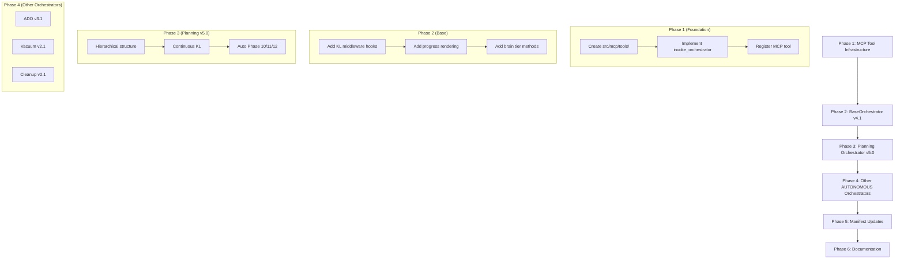

# Planning System v5.0 Architecture Integration Analysis

**Author:** CORTEX Development Team  
**Date:** 2026-01-02  
**Related Document:** `planning-system-v5-summary-2026-01-02.md`

---

## Executive Summary

The Planning System v5.0 redesign introduces **foundational changes** that affect multiple components across the CORTEX architecture. This document analyzes how the proposed changes integrate with the current architecture and identifies all components requiring updates.

**Key Finding:** The proposed MCP tool invocation bridge is a **cross-cutting concern** affecting ALL 🛡️ AUTONOMOUS orchestrators, not just Planning.

---

## 1. Architecture Overview

### Current CORTEX Architecture

```
┌─────────────────────────────────────────────────────────────────────────┐
│                         USER INTERACTION                                 │
└───────────────────────────────┬─────────────────────────────────────────┘
                                │
                                ▼
┌─────────────────────────────────────────────────────────────────────────┐
│                    INTENT CLASSIFICATION LAYER                           │
│   .github/prompts/CORTEX.prompt.md + LLMIntentClassifier                │
│   ┌─────────────────────────────────────────────────────────────────┐   │
│   │  Intent Router: Pattern Matching → LLM Classification → Route   │   │
│   └─────────────────────────────────────────────────────────────────┘   │
└───────────────────────────────┬─────────────────────────────────────────┘
                                │
                ┌───────────────┴───────────────┐
                │                               │
                ▼                               ▼
┌───────────────────────────┐   ┌───────────────────────────────────────┐
│  📋 GUIDED ORCHESTRATORS  │   │    🛡️ AUTONOMOUS ORCHESTRATORS         │
│  (CORTEX executes steps)  │   │    (Python code self-executes)        │
├───────────────────────────┤   ├───────────────────────────────────────┤
│ • TDD Mastery             │   │ • Planning System ← v5.0 UPDATE       │
│ • Debug Orchestrator      │   │ • ADO Operations ← NEEDS SAME UPDATE  │
│ • Onboarding              │   │ • Vacuum ← NEEDS SAME UPDATE          │
│ • Sanitization            │   │ • Cleanup ← NEEDS SAME UPDATE         │
│ • Refinement              │   │                                       │
│ • CORTEX Lens             │   │ ⚠️ BROKEN: Hand-off says "STOP" but   │
│                           │   │    no mechanism to invoke Python code │
└───────────────────────────┘   └────────────────┬──────────────────────┘
                                                 │
                                                 │ ❌ BROKEN LINK
                                                 ▼
                                ┌───────────────────────────────────────┐
                                │     ORCHESTRATOR IMPLEMENTATIONS      │
                                │     src/orchestrators/                │
                                ├───────────────────────────────────────┤
                                │ • planning/planning_orchestrator.py   │
                                │ • ado/ado_orchestrator.py             │
                                │ • system/ (vacuum, cleanup)           │
                                │ • tdd/tdd_orchestrator.py             │
                                │ • base/base_orchestrator.py           │
                                └────────────────┬──────────────────────┘
                                                 │
                                                 ▼
                                ┌───────────────────────────────────────┐
                                │          BRAIN TIERS                  │
                                │     cortex-brain/                     │
                                ├───────────────────────────────────────┤
                                │ Tier 0: Governance (rules, manifests) │
                                │ Tier 1: Working Memory (state)        │
                                │ Tier 2: Knowledge Graph               │
                                │ Tier 3: Dev Context                   │
                                └───────────────────────────────────────┘
```

### Proposed v5.0 Architecture (New Components in GREEN)

```
┌─────────────────────────────────────────────────────────────────────────┐
│                         USER INTERACTION                                 │
└───────────────────────────────┬─────────────────────────────────────────┘
                                │
                                ▼
┌─────────────────────────────────────────────────────────────────────────┐
│                    INTENT CLASSIFICATION LAYER                           │
│   .github/prompts/CORTEX.prompt.md + LLMIntentClassifier                │
│   ┌─────────────────────────────────────────────────────────────────┐   │
│   │  Intent Router: Pattern Matching → LLM Classification → Route   │   │
│   └────────────────────────────────┬────────────────────────────────┘   │
│                                    │                                     │
│   🟢 NEW: MCP Tool invoke_orchestrator() ← INVOCATION BRIDGE            │
│   src/mcp/tools/orchestrator_invocation.py                              │
└───────────────────────────────┬─────────────────────────────────────────┘
                                │
                ┌───────────────┴───────────────┐
                │                               │
                ▼                               ▼
┌───────────────────────────────┐   ┌───────────────────────────────────┐
│  📋 GUIDED ORCHESTRATORS      │   │    🛡️ AUTONOMOUS ORCHESTRATORS     │
│  (No change needed)           │   │    (Connected via MCP tool)        │
├───────────────────────────────┤   ├───────────────────────────────────┤
│ • TDD Mastery                 │   │ • Planning System (v5.0)          │
│ • Debug Orchestrator          │   │ • ADO Operations (v3.1)           │
│ • Onboarding                  │   │ • Vacuum (v2.1)                   │
│ • Sanitization                │   │ • Cleanup (v2.1)                  │
│ • Refinement                  │   │                                   │
│ • CORTEX Lens                 │   │ ✅ FIXED: MCP tool guarantees     │
│                               │   │    Python orchestrator execution   │
└───────────────────────────────┘   └────────────────┬──────────────────┘
                                                     │
                                    ┌────────────────┴───────────────────┐
                                    │                                    │
                                    ▼                                    │
                    ┌───────────────────────────────────────┐           │
                    │  🟢 NEW: Knowledge Library Middleware  │           │
                    │  src/operations/modules/kl_middleware │◄──────────┘
                    │                                       │ Every Phase
                    │  • Continuous KL queries              │ Query
                    │  • Pattern extraction                 │
                    │  • Knowledge injection                │
                    └───────────────────────────────────────┘
                                    │
                                    ▼
                    ┌───────────────────────────────────────┐
                    │     ORCHESTRATOR IMPLEMENTATIONS      │
                    │     src/orchestrators/                │
                    ├───────────────────────────────────────┤
                    │ 🟢 BaseOrchestrator v4.1              │
                    │    • + KL middleware integration      │
                    │    • + Progress rendering hooks       │
                    │    • + Brain tier update methods      │
                    │                                       │
                    │ 🟢 PlanningOrchestrator v5.0          │
                    │    • + Hierarchical plan structure    │
                    │    • + Auto Phase 10/11/12            │
                    │    • + Continuous KL integration      │
                    │                                       │
                    │ 🟢 ADOOrchestrator v3.1               │
                    │    • + Inherit KL middleware          │
                    │    • + Inherit progress rendering     │
                    └───────────────────────────────────────┘
                                    │
                                    ▼
                    ┌───────────────────────────────────────┐
                    │          BRAIN TIERS                  │
                    │     cortex-brain/                     │
                    ├───────────────────────────────────────┤
                    │ Tier 0: Governance (rules, manifests) │
                    │ Tier 1: Working Memory (state)        │
                    │ Tier 2: Knowledge Graph ← 🟢 UPDATED  │
                    │ Tier 3: Dev Context ← 🟢 UPDATED      │
                    └───────────────────────────────────────┘
```

---

## 2. Components Requiring Updates

### 2.1 Core Infrastructure (Highest Priority)

| Component | Current State | Required Update | Priority | LOE |
|-----------|---------------|-----------------|----------|-----|
| **src/mcp/__init__.py** | Stub only | Full MCP tool implementation | 🔴 CRITICAL | 3 days |
| **src/mcp/tools/orchestrator_invocation.py** | Does not exist | Create `invoke_orchestrator()` tool | 🔴 CRITICAL | 2 days |
| **.github/prompts/CORTEX.prompt.md** | Hand-off says "STOP" | Add MCP tool invocation instructions | 🔴 CRITICAL | 1 day |

### 2.2 🛡️ AUTONOMOUS Orchestrators (All Share Same Issue)

| Orchestrator | Current File | Manifest | Status | Required Update |
|--------------|--------------|----------|--------|-----------------|
| **Planning System** | `src/orchestrators/planning/planning_orchestrator.py` | `planning-system-4.0-manifest.yaml` | 🛡️ AUTONOMOUS | Full v5.0 rewrite (13 phases, 152 tasks) |
| **ADO Operations** | `src/orchestrators/ado/ado_orchestrator.py` | `ado-planning-manifest.yaml` | 🛡️ AUTONOMOUS | v3.1 update (inherit KL, progress) |
| **Vacuum** | `src/orchestrators/system/` (likely) | `cortex-vacuum.prompt.md` | 🛡️ AUTONOMOUS | v2.1 update (inherit base changes) |
| **Cleanup** | `src/orchestrators/system/` (likely) | Via maintenance | 🛡️ AUTONOMOUS | v2.1 update (inherit base changes) |

**Key Insight:** All 4 AUTONOMOUS orchestrators have the **same broken hand-off protocol**. The MCP tool `invoke_orchestrator()` fixes ALL of them with a single implementation.

### 2.3 Base Classes (Foundational)

| Component | Current Version | Required Update | Impact |
|-----------|-----------------|-----------------|--------|
| **BaseOrchestrator** | 4.0.0 | 4.1.0 - Add KL middleware hooks, progress rendering, brain tier update methods | All orchestrators inherit changes |
| **PhaseManager** | 4.0.0 | 4.1.0 - Add continuous KL query per phase | Phase execution pipeline |
| **OrchestratorErrorHandler** | 4.0.0 | No change needed | Error handling unchanged |

### 2.4 Manifests and Configuration

| File | Current Location | Required Update |
|------|------------------|-----------------|
| `planning-system-4.0-manifest.yaml` | `cortex-brain/manifests/orchestrators/` | Update to v5.0 (add continuous KL, hierarchical structure) |
| `ado-planning-manifest.yaml` | `cortex-brain/manifests/orchestrators/` | Update to v3.1 (inherit KL integration) |
| `brain-protection-rules.yaml` | `cortex-brain/` | Add KNOWLEDGE_LIBRARY_CONTINUOUS_ENFORCEMENT rule |
| `response-templates-v4.yaml` | `cortex-brain/` | Add hierarchical_plan_progress template |

### 2.5 Knowledge Library (New Component)

| Component | Status | Purpose |
|-----------|--------|---------|
| `src/operations/modules/kl_middleware.py` | 🆕 CREATE | Central KL query middleware |
| `cortex-brain/knowledge-library/` | Exists (sparse) | Populate with patterns, anti-patterns |
| `src/brain/knowledge_library_client.py` | 🆕 CREATE | Client for KL queries |

### 2.6 Documentation Updates

| Document | Location | Update Needed |
|----------|----------|---------------|
| `CORTEX.prompt.md` | `.github/prompts/` | Add MCP tool invocation section |
| `copilot-instructions.md` | `.github/` | Update hand-off protocol section |
| Orchestrator READMEs | Various | Update architecture diagrams |

---

## 3. Impact Analysis by Layer

### Layer 1: Intent Classification Layer

**Current State:**
- CORTEX.prompt.md detects intent via pattern matching + LLM classification
- For 🛡️ AUTONOMOUS, says "STOP" but no invocation mechanism

**Required Changes:**
```yaml
changes:
  - file: ".github/prompts/CORTEX.prompt.md"
    section: "Orchestrator Hand-Off Protocol"
    add: |
      6. ✅ Invoke MCP tool: invoke_orchestrator(name, params)
      
      Example for Planning:
      When planning intent detected:
      1. Load planning-system-5.0-manifest.yaml reference
      2. Display 🛡️ header
      3. Call invoke_orchestrator("planning", {feature: "...", tier: 3})
      4. STOP (orchestrator now executing)
```

### Layer 2: Invocation Bridge (NEW)

**Current State:** Does not exist (MCPGatewayStub is placeholder)

**Required Implementation:**
```python
# src/mcp/tools/orchestrator_invocation.py

from typing import Dict, Any, Optional
from enum import Enum

class OrchestratorName(Enum):
    PLANNING = "planning"
    ADO = "ado"
    VACUUM = "vacuum"
    CLEANUP = "cleanup"

@mcp_tool
def invoke_orchestrator(
    name: OrchestratorName,
    params: Dict[str, Any],
    workspace_id: Optional[str] = None
) -> Dict[str, Any]:
    """
    Invoke a CORTEX 🛡️ AUTONOMOUS orchestrator.
    
    This tool bridges the gap between LLM intent detection and 
    Python orchestrator execution.
    
    Args:
        name: Orchestrator to invoke (planning, ado, vacuum, cleanup)
        params: Orchestrator-specific parameters
        workspace_id: Target workspace (auto-detected if not provided)
    
    Returns:
        Orchestrator execution result with status, outputs, and errors
    """
    orchestrators = {
        OrchestratorName.PLANNING: PlanningOrchestrator,
        OrchestratorName.ADO: ADOOrchestrator,
        OrchestratorName.VACUUM: VacuumOrchestrator,
        OrchestratorName.CLEANUP: CleanupOrchestrator,
    }
    
    orchestrator_class = orchestrators[name]
    orchestrator = orchestrator_class(config={
        "workspace_id": workspace_id,
        **params
    })
    
    return orchestrator.execute()
```

### Layer 3: Orchestrator Implementations

**Planning Orchestrator (v4.0 → v5.0):**
- Add hierarchical plan structure generation
- Add continuous KL query per phase
- Add automatic Phase 10/11/12
- Add brain tier update methods

**ADO Orchestrator (v3.0 → v3.1):**
- Inherit KL middleware from base
- Inherit progress rendering from base
- No structural changes to ADO logic

**BaseOrchestrator (v4.0 → v4.1):**
```python
# Changes to src/orchestrators/base/base_orchestrator.py

class BaseOrchestrator(ABC):
    # NEW: Knowledge Library middleware
    def query_knowledge_library(
        self, 
        phase_id: str, 
        keywords: List[str]
    ) -> KnowledgeContext:
        """Query KL for patterns/anti-patterns relevant to current phase."""
        
    # NEW: Progress rendering hook
    def render_progress(
        self, 
        phase: PhaseResult, 
        format: str = "autonomous_execution_progress"
    ) -> str:
        """Render progress for display."""
        
    # NEW: Brain tier update
    def update_brain_tier(
        self, 
        tier: int, 
        updates: Dict[str, Any]
    ) -> None:
        """Update brain tier with new knowledge."""
```

### Layer 4: Brain Tiers

**Tier 2 (Knowledge Graph) Updates:**
- Add new patterns from Planning v5.0 implementation
- Add orchestrator invocation relationship: `CORTEX.prompt.md → invoke_orchestrator → planning_orchestrator.py`
- Add continuous KL integration pattern

**Tier 3 (Dev Context) Updates:**
- Track planning session state
- Track KL query history
- Track brain tier update audit trail

---

## 4. Cross-Cutting Concerns

### 4.1 MCP Tool Registration

The `invoke_orchestrator()` MCP tool needs to be registered so GitHub Copilot (or other LLM consumers) can call it:

```yaml
# MCP Tool Registration (conceptual)
tools:
  - name: invoke_orchestrator
    description: "Invoke a CORTEX 🛡️ AUTONOMOUS orchestrator"
    parameters:
      - name: name
        type: string
        enum: [planning, ado, vacuum, cleanup]
        required: true
      - name: params
        type: object
        required: true
      - name: workspace_id
        type: string
        required: false
```

### 4.2 Knowledge Library Middleware

All orchestrators (not just planning) should be able to query the Knowledge Library:

```python
# src/operations/modules/orchestration/kl_middleware.py

class KnowledgeLibraryMiddleware:
    """Middleware for continuous Knowledge Library integration."""
    
    def pre_phase(self, phase_id: str, context: PhaseContext) -> KnowledgeContext:
        """Query KL before phase execution."""
        keywords = self._extract_keywords(phase_id, context)
        return self._query_kl(keywords)
    
    def post_phase(self, phase_id: str, result: PhaseResult) -> None:
        """Extract learnings and update KL after phase."""
        if result.has_learnings:
            self._update_kl(phase_id, result.learnings)
```

### 4.3 Progress Rendering Integration

The `autonomous_execution_progress` template needs to be programmatically accessible:

```python
# src/response_templates/progress_renderer.py

class ProgressRenderer:
    """Render progress using response-templates-v4.yaml templates."""
    
    def render_autonomous_progress(
        self, 
        phases: List[PhaseProgress],
        current_phase: int,
        overall_progress: float
    ) -> str:
        """Render progress using autonomous_execution_progress template."""
```

---

## 5. Update Sequence (Recommended Order)



### Detailed Update Sequence

| Phase | Component | Tasks | Dependencies | LOE |
|-------|-----------|-------|--------------|-----|
| 1.1 | `src/mcp/tools/__init__.py` | Create tools directory structure | None | 2h |
| 1.2 | `src/mcp/tools/orchestrator_invocation.py` | Implement `invoke_orchestrator()` | 1.1 | 2 days |
| 1.3 | `.github/prompts/CORTEX.prompt.md` | Update hand-off protocol with MCP tool | 1.2 | 4h |
| 2.1 | `src/orchestrators/base/base_orchestrator.py` | Add `query_knowledge_library()` | 1.3 | 1 day |
| 2.2 | `src/orchestrators/base/base_orchestrator.py` | Add `render_progress()` | 2.1 | 4h |
| 2.3 | `src/orchestrators/base/base_orchestrator.py` | Add `update_brain_tier()` | 2.2 | 4h |
| 3.1 | `src/orchestrators/planning/planning_orchestrator.py` | Hierarchical plan generation | 2.3 | 2 days |
| 3.2 | `src/orchestrators/planning/planning_orchestrator.py` | Continuous KL integration | 3.1 | 1 day |
| 3.3 | `src/orchestrators/planning/planning_orchestrator.py` | Auto Phase 10/11/12 | 3.2 | 1 day |
| 4.1 | `src/orchestrators/ado/ado_orchestrator.py` | Inherit base changes | 3.3 | 4h |
| 4.2 | Vacuum orchestrator | Inherit base changes | 3.3 | 4h |
| 4.3 | Cleanup orchestrator | Inherit base changes | 3.3 | 4h |
| 5.1 | `planning-system-4.0-manifest.yaml` | Update to v5.0 | 3.3 | 4h |
| 5.2 | `ado-planning-manifest.yaml` | Update to v3.1 | 4.1 | 2h |
| 5.3 | `brain-protection-rules.yaml` | Add new SKULL rules | 5.2 | 2h |
| 6.1 | Documentation | Update all READMEs | 5.3 | 1 day |

**Total Estimated LOE:** ~12-15 days

---

## 6. Risk Assessment

| Risk | Probability | Impact | Mitigation |
|------|-------------|--------|------------|
| MCP tool not invoked by LLM | HIGH | CRITICAL | Add fallback terminal wrapper |
| BaseOrchestrator changes break existing orchestrators | MEDIUM | HIGH | Comprehensive test suite |
| Knowledge Library queries slow down execution | LOW | MEDIUM | Async queries + caching |
| Brain tier updates corrupt existing knowledge | LOW | HIGH | Audit trail + rollback |

---

## 7. Backward Compatibility

### Breaking Changes
- None for 📋 GUIDED orchestrators (unchanged)
- 🛡️ AUTONOMOUS orchestrators require manifest updates

### Migration Path
1. Deploy MCP tool infrastructure first
2. Update BaseOrchestrator (all orchestrators benefit)
3. Update Planning v5.0 (primary target)
4. Update other AUTONOMOUS orchestrators incrementally

### Rollback Strategy
- Git checkpoint before each phase
- Feature flags for new functionality
- Fallback to terminal wrapper if MCP tool fails

---

## 8. Conclusion

The Planning System v5.0 redesign introduces **shared infrastructure** that benefits all CORTEX orchestrators:

| Change | Scope | Benefit |
|--------|-------|---------|
| MCP Tool Invocation Bridge | All 🛡️ AUTONOMOUS | Guaranteed execution (fixes broken hand-off) |
| Knowledge Library Middleware | All orchestrators | Continuous learning and pattern reuse |
| Progress Rendering | All orchestrators | Consistent user experience |
| Brain Tier Updates | All orchestrators | Knowledge accumulation |

**Key Recommendation:** Implement Phase 1 (MCP Tool) and Phase 2 (BaseOrchestrator v4.1) first, as they provide foundational improvements that all subsequent work builds upon.

---

**Next Step:** Review and approve this architecture integration analysis, then proceed with Phase 1 implementation.

---

*Generated by CORTEX Planning System Analysis*
