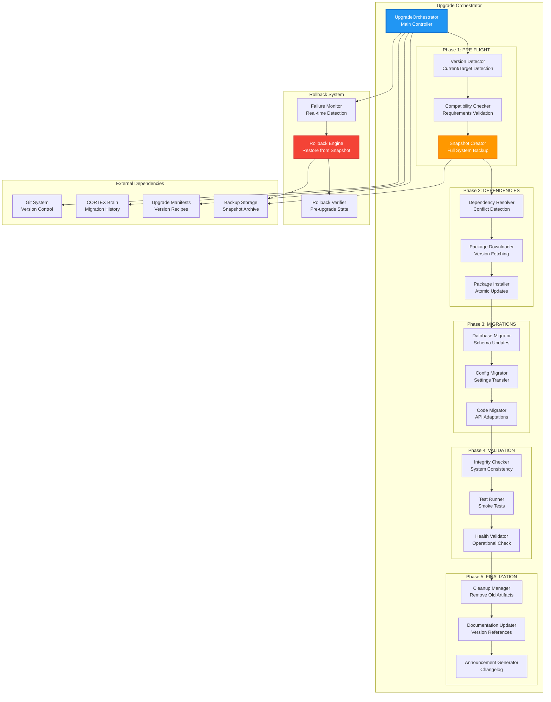
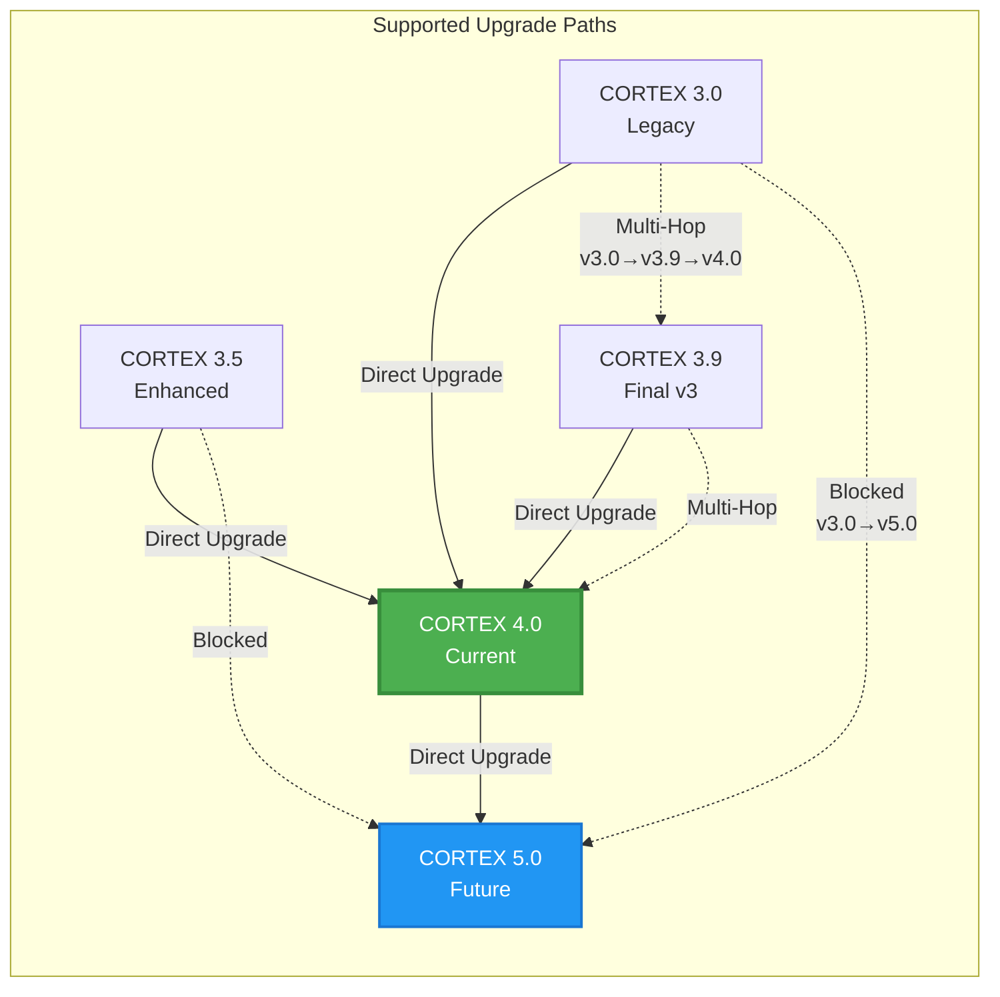
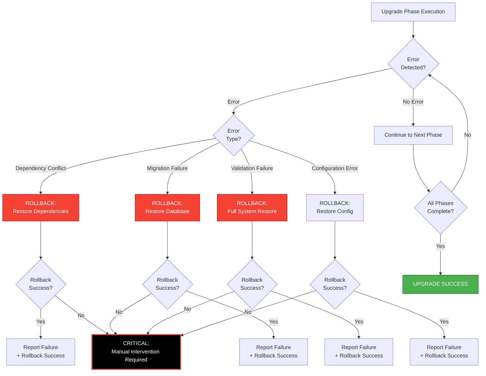

# Upgrade Orchestrator - Architecture Documentation

**Version:** 4.0.0  
**Author:** Asif Hussain  
**Created:** December 23, 2025  
**Status:** Planned (Phase 14 Task 14.3)  
**Related Systems:** Version Management, Migration Engine, Dependency Manager  
**Complexity:** HIGH (System-wide impact, rollback critical)

---

## 🎯 Overview

The **Upgrade Orchestrator** is CORTEX's intelligent system migration engine that manages version transitions, dependency updates, and configuration migrations with automatic rollback on failure. It ensures safe, atomic upgrades across the entire CORTEX ecosystem.

**Key Capabilities:**
- 🔄 **Version Transition Management** - Orchestrates migrations from v3.x → v4.0 → v5.0
- 📦 **Dependency Resolution** - Smart dependency updates with conflict detection
- 🗄️ **Database Migration** - Schema updates with data preservation
- ⚙️ **Configuration Migration** - Settings transfer across versions
- 🔙 **Atomic Rollback** - Complete system restoration on any failure
- ✅ **Validation Gates** - Pre/post-upgrade verification
- 📊 **Migration Analytics** - Success tracking, performance metrics

---

## 📐 System Architecture

### High-Level Component Overview



### Version Compatibility Matrix



---

## 🔄 Execution Flow

### 5-Phase Upgrade Workflow

```mermaid
sequenceDiagram
    participant User
    participant UO as UpgradeOrchestrator
    participant VERSION as VersionDetector
    participant SNAPSHOT as SnapshotCreator
    participant DEPS as DependencyResolver
    participant MIGRATOR as MigrationEngine
    participant VALIDATOR as ValidationEngine
    participant ROLLBACK as RollbackEngine
    
    User->>UO: upgrade_to_version(target_version)
    activate UO
    
    Note over UO: Phase 1: PRE-FLIGHT CHECKS
    UO->>VERSION: detect_versions()
    VERSION-->>UO: current=3.9, target=4.0
    
    UO->>VERSION: check_compatibility(3.9, 4.0)
    VERSION-->>UO: compatible=True, path=direct
    
    UO->>SNAPSHOT: create_full_snapshot()
    activate SNAPSHOT
    SNAPSHOT->>SNAPSHOT: backup_databases()
    SNAPSHOT->>SNAPSHOT: backup_configuration()
    SNAPSHOT->>SNAPSHOT: backup_code()
    SNAPSHOT-->>UO: snapshot_id=snap_20251223_120000
    deactivate SNAPSHOT
    
    Note over UO: Phase 2: DEPENDENCY RESOLUTION
    UO->>DEPS: resolve_dependencies(4.0)
    activate DEPS
    DEPS->>DEPS: fetch_requirements()
    DEPS->>DEPS: detect_conflicts()
    DEPS->>DEPS: calculate_install_order()
    DEPS-->>UO: install_plan=[pkg1, pkg2, ...]
    deactivate DEPS
    
    UO->>DEPS: install_dependencies(install_plan)
    DEPS-->>UO: installed_successfully=True
    
    Note over UO: Phase 3: MIGRATIONS
    UO->>MIGRATOR: execute_migrations(3.9→4.0)
    activate MIGRATOR
    
    MIGRATOR->>MIGRATOR: migrate_databases()
    MIGRATOR->>MIGRATOR: migrate_configurations()
    MIGRATOR->>MIGRATOR: migrate_code_references()
    
    alt Migration Success
        MIGRATOR-->>UO: migrations_applied=15
    else Migration Failure
        MIGRATOR-->>UO: migration_failed
        UO->>ROLLBACK: initiate_rollback(snapshot_id)
        activate ROLLBACK
        ROLLBACK->>ROLLBACK: restore_from_snapshot()
        ROLLBACK->>ROLLBACK: verify_restoration()
        ROLLBACK-->>User: UPGRADE FAILED (rolled back)
        deactivate ROLLBACK
        deactivate UO
    end
    deactivate MIGRATOR
    
    Note over UO: Phase 4: VALIDATION
    UO->>VALIDATOR: run_post_upgrade_validation()
    activate VALIDATOR
    VALIDATOR->>VALIDATOR: check_system_integrity()
    VALIDATOR->>VALIDATOR: run_smoke_tests()
    VALIDATOR->>VALIDATOR: verify_health_score()
    
    alt Validation Pass
        VALIDATOR-->>UO: all_checks_passed=True
    else Validation Failure
        VALIDATOR-->>UO: validation_failed
        UO->>ROLLBACK: initiate_rollback(snapshot_id)
        ROLLBACK-->>User: VALIDATION FAILED (rolled back)
        deactivate UO
    end
    deactivate VALIDATOR
    
    Note over UO: Phase 5: FINALIZATION
    UO->>UO: cleanup_old_artifacts()
    UO->>UO: update_documentation()
    UO->>UO: generate_changelog()
    
    UO-->>User: UPGRADE SUCCESSFUL (v3.9→v4.0)
    deactivate UO
```

### Rollback Decision Tree



---

## 🧩 Component Breakdown

### 1. Version Detector

**Purpose:** Identify current system version and validate upgrade path

**Key Responsibilities:**
- Parse version from `cortex.config.json`, `__version__.py`, manifests
- Detect installed packages and their versions
- Validate compatibility between source and target versions
- Calculate optimal upgrade path (direct vs multi-hop)

**Version Detection Logic:**
```python
def detect_system_version(self) -> Version:
    """Detect current CORTEX version from multiple sources."""
    sources = [
        self._read_config_version(),      # cortex.config.json
        self._read_package_version(),     # __version__.py
        self._read_manifest_version(),    # manifest headers
    ]
    
    # Use majority voting for consistency
    version_counts = Counter(sources)
    detected_version = version_counts.most_common(1)[0][0]
    
    # Warn if inconsistent
    if len(set(sources)) > 1:
        self.logger.warning(f"Version inconsistency detected: {sources}")
    
    return Version.parse(detected_version)
```

---

### 2. Compatibility Checker

**Purpose:** Validate upgrade requirements and prerequisites

**Validation Checks:**
- **Python Version:** Ensure target version supports current Python
- **Dependencies:** Check for breaking dependency changes
- **Data Schema:** Validate database schema compatibility
- **Configuration:** Check for deprecated/removed settings
- **Breaking Changes:** Alert user to API changes requiring manual updates

**Compatibility Matrix:**
```python
COMPATIBILITY_MATRIX = {
    ("3.0", "4.0"): {
        "direct_upgrade": True,
        "python_min": "3.8",
        "breaking_changes": ["orchestration_3_0 → orchestration_4_0"],
        "manual_steps": ["Rename v2/v3 files to v4.0"],
    },
    ("3.9", "4.0"): {
        "direct_upgrade": True,
        "python_min": "3.8",
        "breaking_changes": [],
        "manual_steps": [],
    },
    ("4.0", "5.0"): {
        "direct_upgrade": True,
        "python_min": "3.10",
        "breaking_changes": ["SQLite → PostgreSQL migration"],
        "manual_steps": ["Export brain data before upgrade"],
    },
}
```

---

### 3. Snapshot Creator

**Purpose:** Create complete system backup for atomic rollback

**Snapshot Contents:**
- **Databases:** Full SQLite dumps (cortex-brain.db, metrics, status)
- **Configuration:** All YAML/JSON config files
- **Code:** Git commit SHA + working tree changes
- **Brain State:** Tier 0-3 content snapshots
- **Metadata:** Timestamp, version, installed packages

**Snapshot Structure:**
```
backups/upgrade_snapshots/snap_20251223_120000/
├── databases/
│   ├── cortex-brain.db.backup
│   ├── cortex_metrics.db.backup
│   ├── cortex_status.db.backup
│   └── conversation-history.db.backup
├── configuration/
│   ├── cortex.config.json
│   ├── cortex-operations.yaml
│   └── manifests/
├── code/
│   ├── git_commit_sha.txt
│   └── working_tree_diff.patch
├── brain/
│   ├── tier0_snapshot.json
│   ├── tier1_snapshot.json
│   ├── tier2_snapshot.json
│   └── tier3_snapshot.json
└── metadata.json
```

---

### 4. Dependency Resolver

**Purpose:** Calculate safe dependency update order with conflict resolution

**Resolution Strategy:**
1. **Fetch Requirements:** Parse `requirements.txt` for target version
2. **Detect Conflicts:** Identify version incompatibilities
3. **Calculate Order:** Topological sort based on dependency graph
4. **Generate Plan:** Install/uninstall/upgrade commands

**Conflict Resolution:**
```python
def resolve_conflicts(self, requirements: List[Requirement]) -> InstallPlan:
    """Resolve dependency conflicts using constraint solver."""
    # Build dependency graph
    graph = self._build_dependency_graph(requirements)
    
    # Detect circular dependencies
    cycles = self._detect_cycles(graph)
    if cycles:
        raise DependencyConflictError(f"Circular dependencies: {cycles}")
    
    # Detect version conflicts
    conflicts = self._detect_version_conflicts(graph)
    if conflicts:
        # Attempt automatic resolution
        resolved = self._resolve_version_conflicts(conflicts)
        if not resolved:
            raise DependencyConflictError(f"Unresolvable conflicts: {conflicts}")
    
    # Calculate install order (topological sort)
    install_order = self._topological_sort(graph)
    
    return InstallPlan(
        install=install_order,
        uninstall=self._calculate_uninstalls(),
        upgrade=self._calculate_upgrades()
    )
```

---

### 5. Migration Engine

**Purpose:** Execute database, configuration, and code migrations

**Migration Types:**

| Type | Purpose | Reversible | Safety Level |
|------|---------|------------|--------------|
| **Database Schema** | ALTER TABLE, add columns | Yes (down migrations) | HIGH (tested) |
| **Configuration** | Settings transfer, format changes | Yes (backup kept) | MEDIUM |
| **Code References** | Import path updates, API changes | No (manual review) | LOW (user verification) |
| **Data Transformation** | Value format changes, normalization | Yes (down migrations) | HIGH |

**Migration Execution:**
```python
def execute_migrations(self, source_version: str, target_version: str) -> MigrationResult:
    """Execute all migrations from source to target version."""
    # Load migration scripts
    migrations = self._load_migrations(source_version, target_version)
    
    applied = []
    for migration in migrations:
        try:
            # Create migration checkpoint
            checkpoint_id = self._create_migration_checkpoint()
            
            # Execute migration
            self.logger.info(f"Applying migration: {migration.name}")
            migration.up()
            
            # Validate migration success
            if not migration.validate():
                raise MigrationError(f"Migration validation failed: {migration.name}")
            
            applied.append(migration.name)
            
        except Exception as e:
            # Rollback this migration
            self.logger.error(f"Migration failed: {migration.name} - {e}")
            migration.down()
            
            # Restore to checkpoint
            self._restore_checkpoint(checkpoint_id)
            
            return MigrationResult(
                success=False,
                applied_migrations=applied,
                failed_migration=migration.name,
                error=str(e)
            )
    
    return MigrationResult(
        success=True,
        applied_migrations=applied,
        failed_migration=None,
        error=None
    )
```

---

## 📊 Performance Metrics

### Upgrade Performance (v3.9 → v4.0)

| Phase | Duration | Critical Path | Parallelizable |
|-------|----------|---------------|----------------|
| **Pre-flight Checks** | 10-30 seconds | No | Partially |
| **Dependency Installation** | 1-3 minutes | Yes | No (pip sequential) |
| **Database Migrations** | 30-60 seconds | Yes | Per-database |
| **Configuration Migration** | 5-10 seconds | No | Yes |
| **Validation** | 1-2 minutes | Yes | Partially |
| **Cleanup** | 10-20 seconds | No | Yes |
| **Total** | **3-6 minutes** | - | - |

### Rollback Performance

| Scenario | Rollback Duration | Data Loss Risk |
|----------|-------------------|----------------|
| **Dependency Failure** | 30-60 seconds | None (packages restored) |
| **Database Migration Failure** | 1-2 minutes | None (snapshot restored) |
| **Validation Failure** | 2-4 minutes | None (full restore) |
| **Critical System Failure** | 5-10 minutes | None (verified restoration) |

---

## 🧪 Test Strategy

**Test Coverage:** 90%+ (35+ tests planned)

**Test Categories:**
- **Version Detection:** 8 tests (current version, target version, compatibility)
- **Snapshot Creation:** 6 tests (backup integrity, restoration verification)
- **Dependency Resolution:** 10 tests (conflict detection, install order)
- **Migration Execution:** 7 tests (schema updates, data preservation)
- **Rollback Scenarios:** 4 tests (partial failure, full failure, verification)

**Integration Tests:**
```python
def test_full_upgrade_v39_to_v40():
    """Test complete upgrade workflow from v3.9 to v4.0"""
    orchestrator = UpgradeOrchestrator()
    
    # Setup v3.9 environment
    setup_v39_environment()
    
    # Execute upgrade
    result = orchestrator.upgrade_to_version("4.0.0")
    
    assert result.success
    assert result.source_version == "3.9.0"
    assert result.target_version == "4.0.0"
    assert result.migrations_applied == 15
    assert result.validation_passed
    
    # Verify v4.0 functionality
    verify_v40_features()
```

---

## 🚀 Future Enhancements

### Planned Improvements

1. **Zero-Downtime Upgrades**
   - Blue-green deployment pattern
   - Live traffic switching
   - Progressive rollout (canary deployments)

2. **Automated Conflict Resolution**
   - ML-powered dependency resolution
   - Learn from past successful upgrades
   - Suggest optimal upgrade paths

3. **Migration Preview Mode**
   - Dry-run with full validation
   - Preview migration scripts before execution
   - Estimate upgrade duration

4. **Rollback Testing**
   - Automated rollback verification in test environment
   - Chaos engineering for failure scenarios
   - Pre-upgrade rollback simulation

5. **Multi-Instance Coordination**
   - Coordinate upgrades across multiple CORTEX instances
   - Cluster-wide version consistency
   - Rolling upgrades for distributed systems

---

## 📚 References

**Related Documents:**
- `cortex-brain/documents/planning/active/CORTEX-3.0-4.0/CORTEX4-STATUS.md` - Migration status
- `cortex-brain/documents/planning/active/CORTEX-3.0-4.0/phases/phase-14-version-consolidation.md` - Version cleanup

**Related Orchestrators:**
- System Maintenance Orchestrator (pre/post-upgrade health validation)
- Documentation Orchestrator (version reference updates)
- Refinement Orchestrator (code adaptations post-upgrade)

**Version History:**
- **v3.0:** Initial orchestrator concept
- **v3.9:** Enhanced migration engine
- **v4.0:** Atomic rollback, validation gates (Current)
- **v5.0:** Zero-downtime upgrades (Planned)

---

## 🏆 Summary

The Upgrade Orchestrator delivers **safe, atomic, and intelligent system migrations** through:

✅ **5-phase workflow** (pre-flight, dependencies, migrations, validation, finalization)  
✅ **Atomic rollback** on any failure (full system restoration)  
✅ **Smart dependency resolution** with conflict detection  
✅ **Database schema migrations** with data preservation  
✅ **Comprehensive validation** (integrity, tests, health checks)  
✅ **Upgrade analytics** (success tracking, performance metrics)  

**Impact:** Enables confident version transitions without data loss or system downtime, critical for CORTEX evolution to v5.0 and beyond.
