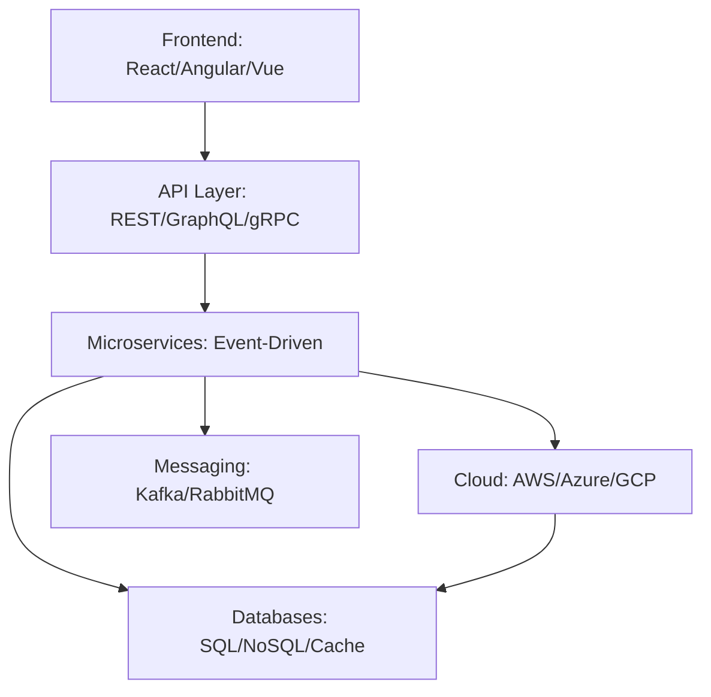
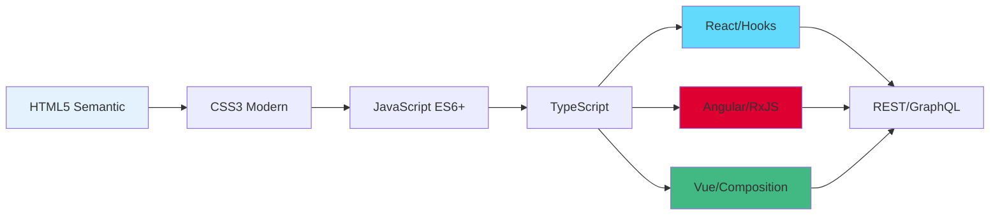
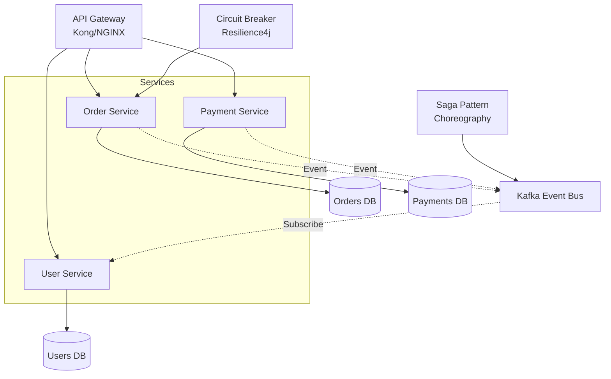
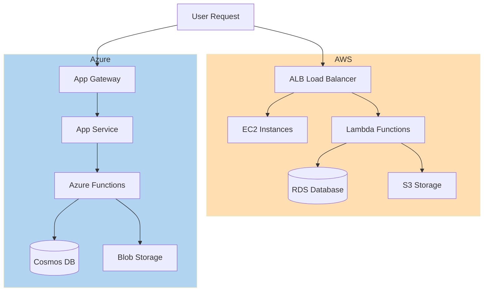
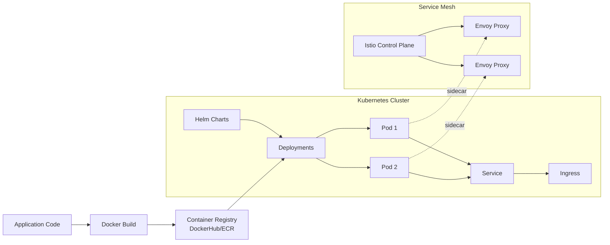
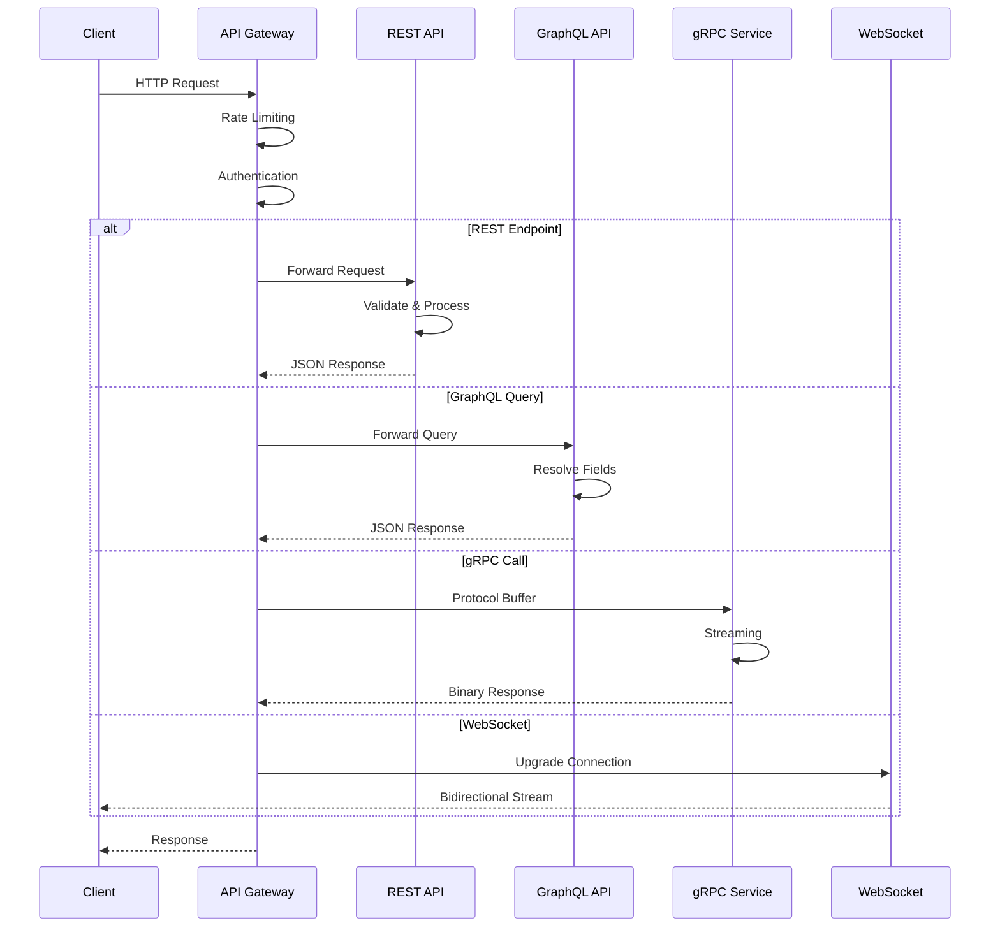

# 📚 Knowledge Library Documentation & Learning Hub Plan

**Plan Name:** Knowledge Library Documentation & Learning Hub  
**Created:** December 28, 2025  
**Author:** Asif Hussain  
**Status:** Active - ENHANCED FOR WEB DOCUMENTATION  
**GitHub:** github.com/asifhussain60/CORTEX

---

## 🎯 Executive Summary

**Goal:** Create a comprehensive, interactive web documentation system for CORTEX Knowledge Library (cortex-brain/knowledge/) that serves as both a **showcase** and **learning tool** for developers to discover industry-standard best practices, complete with educational resources and external learning links.

**Scope:** 
- **PHASE 0 EXPANSION:** Audit existing library + add 8 NEW categories (Frontend, API, Microservices, Cloud, Databases, Mobile, Containers, Messaging)
- **ENHANCED:** 17 total categories (9 existing + 8 new)
- **ENHANCED:** 80+ YAML files (38 existing + 42 new) with ~35,000 rules
- Interactive tile-based navigation with D3.js category relationship diagrams
- Detailed educational views per category with Mermaid concept diagrams
- External learning resources (YouTube, official docs, courses)
- Full glassmorphism styling integration
- Mobile-responsive design

**Timeline:** 5-7 days (includes Phase 0 expansion)

**Success Metrics:**
- Tile integrated into docs/index.html under "Core Capabilities"
- Landing page with 9 category tiles (icon + description)
- Detailed category views with examples, rules, and learning resources
- External educational links to YouTube videos and authoritative sites
- 100% glassmorphism styling compliance
- Mobile-responsive (320px-4K)
- All knowledge files documented with examples

---

## 📋 Current State Analysis

### Knowledge Library Structure (Current + Phase 0 Expansion)

**EXISTING (38 files):**
```
cortex-brain/knowledge/
├── database/           # 3 files (Oracle, SQL Server, PostgreSQL)
├── ddd/                # 6 files (Bounded Contexts, Aggregates, Value Objects, etc.)
├── devops/             # 5 files (CI/CD, IaC, Monitoring, Container Orchestration)
├── domains/            # 4 files (RAG, Embeddings, Vector Databases, Retrieval)
├── engineering/        # 8 files (Clean Code, SOLID, Design Patterns, Refactoring)
│   └── api-design/     # 3 files (REST, GraphQL, Versioning)
├── performance/        # 3 files (Optimization, Caching, Profiling)
├── security/           # 4 files (OWASP Top 10, Secure Coding, API Security, Secrets)
├── testing/            # 5 files (TDD, Test Pyramid, Test Doubles, Selenium→Playwright)
└── ui-ux/              # 2 files (Best Practices, Accessibility)
```

**PHASE 0 ADDITIONS (42+ new files):**
```
cortex-brain/knowledge/
├── frontend/           # 🆕 8 files (HTML5, CSS3, JavaScript/ES6+, TypeScript, React, Angular, Vue, Responsive Design)
├── api/                # 🆕 6 files (REST Design, gRPC, WebSockets, API Gateway, Rate Limiting, Documentation)
├── microservices/      # 🆕 7 files (Architecture, Service Mesh, API Gateway, Circuit Breakers, Saga Pattern, Event Sourcing, CQRS)
├── cloud/              # 🆕 6 files (AWS, Azure, GCP, Serverless, Cloud-Native Patterns, Multi-Cloud)
├── databases/          # 🆕 EXPANDED 8 files (SQL Best Practices, NoSQL (MongoDB, Redis, Cassandra), Graph DBs, Time-Series DBs)
├── mobile/             # 🆕 4 files (React Native, Flutter, Mobile-First Design, Offline-First Patterns)
├── containers/         # 🆕 5 files (Docker, Kubernetes, Helm, Service Mesh (Istio), Container Security)
└── messaging/          # 🆕 4 files (Kafka, RabbitMQ, Event-Driven Architecture, Message Patterns)
```

**TOTAL:** 17 categories, 80+ files, ~35,000 rules

### Current State

**Existing Documentation:**
- Basic README.md in cortex-brain/knowledge/ (structure overview only)
- No web-accessible documentation
- No home page integration
- No learning resources or educational links

**Web Infrastructure:**
- docs/index.html exists with Core Capabilities section (6 tiles)
- docs/assets/css/main.css has complete glassmorphism theme
- Tile-based navigation pattern established in orchestrators/

### Gap Analysis (Updated with Phase 0)

| Component | Current State | Target State | Priority |
|-----------|---------------|--------------|----------|
| **Phase 0: Library Expansion** | ❌ 38 files, 9 categories | 80+ files, 17 categories | CRITICAL |
| Modern Frontend (HTML/CSS/JS/TS) | ❌ Missing | 8 files (React, Angular, Vue, TypeScript) | CRITICAL |
| API Technologies (REST/gRPC/WS) | ✅ Partial (3 REST files) | 6 files (full API stack) | HIGH |
| Microservices Patterns | ❌ Missing | 7 files (CQRS, Event Sourcing, Saga) | HIGH |
| Cloud Platforms (AWS/Azure/GCP) | ❌ Missing | 6 files (multi-cloud patterns) | HIGH |
| NoSQL Databases | ❌ Missing | 5 files (MongoDB, Redis, Cassandra) | MEDIUM |
| Mobile Development | ❌ Missing | 4 files (React Native, Flutter) | MEDIUM |
| Containers & Orchestration | ❌ Missing | 5 files (Docker, K8s, Istio) | MEDIUM |
| Messaging Systems | ❌ Missing | 4 files (Kafka, RabbitMQ, EDA) | MEDIUM |
| Home Page Tile | ❌ Missing | Knowledge Library tile in Core Capabilities | CRITICAL |
| Landing Page | ❌ Missing | docs/knowledge/index.html with 17 category tiles | CRITICAL |
| Category Views | ❌ Missing | Detailed pages per category with rules & examples | HIGH |
| D3.js Diagrams | ❌ Missing | Category relationship graphs, technology stacks | HIGH |
| Mermaid Diagrams | ❌ Missing | Concept flows, architecture patterns | HIGH |
| Educational Resources | ❌ Missing | YouTube videos, external links per category | HIGH |
| Mobile Responsive | N/A | 320px-4K breakpoints | HIGH |
| Glassmorphism Styling | N/A | 100% compliance with main.css | CRITICAL |
| Learning Integration | ❌ Missing | Links to tutorials, courses, official docs | MEDIUM |
| Search Functionality | ❌ Missing | Filter categories, search rules | MEDIUM |

**Total:** 80+ knowledge files, 0% web documentation coverage, 8 new categories needed

---

## 🏗️ Solution Architecture

See attached document for complete architecture including:
- Web documentation structure
- Page design system (home tile, landing page, category detail templates)
- Educational resources strategy
- Styling requirements (100% glassmorphism compliance)

---

## 📐 Implementation Phases

### Phase 0: Knowledge Library Audit & Expansion (Day 1 - 8 hours) 🆕

**Objectives:**
- Audit existing 38 knowledge files for completeness
- Identify modern technology gaps (Frontend, Cloud, Microservices, etc.)
- Create 42+ new YAML knowledge files across 8 new categories
- Establish category relationships for D3.js visualization

**Deliverables:**
- `context/technology-gap-analysis.md` (comprehensive audit report)
- `context/new-categories-plan.yaml` (8 new category specifications)
- 42+ new YAML files in cortex-brain/knowledge/:
  - `frontend/` (8 files: HTML5, CSS3, JavaScript-ES6, TypeScript, React, Angular, Vue, Responsive-Design)
  - `api/` (6 files: REST-Advanced, gRPC, WebSockets, API-Gateway, Rate-Limiting, API-Documentation)
  - `microservices/` (7 files: Architecture, Service-Mesh, API-Gateway, Circuit-Breakers, Saga-Pattern, Event-Sourcing, CQRS)
  - `cloud/` (6 files: AWS-Best-Practices, Azure-Patterns, GCP-Guidelines, Serverless, Cloud-Native, Multi-Cloud)
  - `databases/` (EXPAND existing: 5 new files: SQL-Advanced, MongoDB, Redis, Cassandra, Graph-Databases)
  - `mobile/` (4 files: React-Native, Flutter, Mobile-First, Offline-First)
  - `containers/` (5 files: Docker, Kubernetes, Helm, Service-Mesh-Istio, Container-Security)
  - `messaging/` (4 files: Kafka, RabbitMQ, Event-Driven-Architecture, Message-Patterns)
- `artifacts/category-relationships.json` (for D3.js force-directed graph)

**New Category Details:**

**1. Frontend (8 files) 💻**
- `html5-best-practices.yaml` - Semantic HTML, forms, validation, accessibility
- `css3-modern-techniques.yaml` - Flexbox, Grid, CSS Variables, animations
- `javascript-es6-plus.yaml` - Modern JS: async/await, destructuring, modules
- `typescript-guidelines.yaml` - Types, interfaces, generics, decorators
- `react-best-practices.yaml` - Hooks, Context, Performance, Testing
- `angular-patterns.yaml` - Components, Services, RxJS, Dependency Injection
- `vue-composition-api.yaml` - Composition API, Reactivity, Composables
- `responsive-design-patterns.yaml` - Mobile-first, breakpoints, progressive enhancement

**2. API (6 files) 🔌**
- `rest-api-advanced.yaml` - Hypermedia, HATEOAS, pagination, filtering (expand existing)
- `grpc-best-practices.yaml` - Protocol Buffers, streaming, error handling
- `websockets-realtime.yaml` - WebSocket patterns, reconnection, scaling
- `api-gateway-patterns.yaml` - Kong, NGINX, rate limiting, caching
- `rate-limiting-strategies.yaml` - Token bucket, leaky bucket, sliding window
- `api-documentation-openapi.yaml` - OpenAPI/Swagger, Redoc, API versioning

**3. Microservices (7 files) 🏗️**
- `microservices-architecture.yaml` - Decomposition, boundaries, communication
- `service-mesh-patterns.yaml` - Traffic management, observability, security
- `api-gateway-microservices.yaml` - Gateway aggregation, Backend-for-Frontend
- `circuit-breaker-resilience.yaml` - Hystrix, Resilience4j, fallback patterns
- `saga-pattern.yaml` - Orchestration vs Choreography, compensation
- `event-sourcing.yaml` - Event store, projections, snapshots
- `cqrs-pattern.yaml` - Command/Query separation, eventual consistency

**4. Cloud (6 files) ☁️**
- `aws-best-practices.yaml` - EC2, S3, Lambda, RDS, Well-Architected Framework
- `azure-patterns.yaml` - App Service, Functions, Cosmos DB, Azure AD
- `gcp-guidelines.yaml` - Compute Engine, Cloud Functions, BigQuery, IAM
- `serverless-architecture.yaml` - FaaS, BaaS, cold starts, event-driven
- `cloud-native-patterns.yaml` - 12-factor app, immutable infrastructure
- `multi-cloud-strategies.yaml` - Vendor lock-in prevention, abstraction layers

**5. Databases (8 files total - 3 existing + 5 new) 🗄️**
- Existing: Oracle, SQL Server, PostgreSQL
- `sql-advanced-techniques.yaml` - Query optimization, indexing strategies, partitioning
- `mongodb-best-practices.yaml` - Schema design, aggregation, sharding
- `redis-caching-patterns.yaml` - Cache-aside, write-through, pub/sub
- `cassandra-modeling.yaml` - Wide-column store, consistency tuning
- `graph-databases-neo4j.yaml` - Graph modeling, Cypher queries, traversals

**6. Mobile (4 files) 📱**
- `react-native-patterns.yaml` - Navigation, state management, native modules
- `flutter-best-practices.yaml` - Widget composition, state management, platform channels
- `mobile-first-design.yaml` - Touch targets, gestures, performance
- `offline-first-patterns.yaml` - Local storage, sync strategies, conflict resolution

**7. Containers (5 files) 🐳**
- `docker-best-practices.yaml` - Multi-stage builds, layer caching, security
- `kubernetes-patterns.yaml` - Deployments, Services, ConfigMaps, Secrets
- `helm-charts-guide.yaml` - Chart structure, templating, versioning
- `service-mesh-istio.yaml` - Traffic routing, observability, mTLS
- `container-security.yaml` - Image scanning, runtime security, least privilege

**8. Messaging (4 files) 📨**
- `kafka-streaming.yaml` - Topics, partitions, consumer groups, Kafka Streams
- `rabbitmq-patterns.yaml` - Exchanges, queues, routing, dead-letter queues
- `event-driven-architecture.yaml` - Event design, choreography, saga
- `message-patterns.yaml` - Publish-Subscribe, Request-Reply, Point-to-Point

**Tasks:**
1. **Audit Existing Files** (2h)
   - Review 38 existing YAML files for completeness
   - Identify missing modern concepts (e.g., React Hooks, TypeScript generics)
   - Document enhancement opportunities

2. **Technology Gap Analysis** (1h)
   - Research industry-standard technologies not covered
   - Prioritize based on CORTEX usage patterns
   - Create gap analysis report

3. **Create New YAML Files** (4h)
   - Use existing templates (clean-code.yaml, owasp-top-10.yaml)
   - Extract best practices from official documentation
   - Add code examples, severity ratings, common pitfalls
   - Ensure machine-readable schema compliance

4. **Category Relationships Mapping** (1h)
   - Map dependencies (e.g., Microservices → API → Cloud)
   - Create JSON for D3.js force-directed graph
   - Define technology stacks (e.g., "Full-Stack MERN": MongoDB + Express + React + Node)

**TDD Requirements:**
- Test: All 80+ YAML files parse successfully
- Test: Schema validation passes (metadata, rules, examples)
- Test: No duplicate rule IDs across categories
- Test: Category relationships JSON valid for D3.js rendering

**D3.js Diagram (Category Relationships):**
```javascript
// Force-directed graph showing knowledge category dependencies
// Nodes: 17 categories
// Edges: Technology dependencies
// Example: Frontend → API → Microservices → Cloud → Databases
// Example: Mobile → Frontend → API
// Color-coded by domain (Frontend=blue, Backend=green, Infrastructure=orange)
```

**Mermaid Diagram (Technology Stack Flows):**


---

### Phase 1: Discovery & Content Inventory (Day 2 - 4 hours)

**Objectives:**
- Complete file inventory with metadata (80+ files with metadata)
- Extract high-priority rules for showcase (updated with new categories)
- Curate educational resources (YouTube, courses, official docs) for 17 categories
- Analyze category icons and descriptions

**Deliverables:**
- `context/knowledge-inventory.yaml` (80+ files with metadata)
- `context/category-analysis.md` (17 categories with stats)
- `context/educational-resources.yaml` (curated learning links for all 17 categories)
- `artifacts/category-metadata.json` (icons, descriptions, file counts for 17 categories)

**Tasks:**
1. Scan all 80+ knowledge YAML files (extract metadata: rules, severity, dates)
2. Identify 2-3 high-priority rules per category for showcase
3. Research and curate educational resources for NEW categories:
   - **Frontend:** YouTube (Traversy Media, Fireship), Courses (Frontend Masters)
   - **API:** YouTube (Hussein Nasser), Docs (gRPC.io, socket.io)
   - **Microservices:** YouTube (Martin Fowler), Books (Building Microservices)
   - **Cloud:** YouTube (AWS, Azure, GCP official), Certifications
   - **Mobile:** YouTube (React Native, Flutter official), Udemy courses
   - **Containers:** YouTube (TechWorld with Nana), Docs (kubernetes.io)
   - **Messaging:** YouTube (Kafka Summit), Docs (kafka.apache.org)
4. Define category icons:
   - 💻 Frontend, 🔌 API, 🏗️ Microservices, ☁️ Cloud
   - 🗄️ Databases, 📱 Mobile, 🐳 Containers, 📨 Messaging
5. Write concise category descriptions (2-3 lines per category)

**TDD Requirements:**
- Test: YAML parsing for all 80+ files succeeds
- Test: Metadata extraction returns valid schema (name, version, rule_count)
- Test: Educational resources validated (no broken links)
- Test: Category icons render correctly (UTF-8 emoji support)

---

### Phase 2: Home Page Integration (Day 2 - 2 hours)
### Phase 2: Home Page Integration (Day 1 - 2 hours)
### Phase 3: Knowledge Library Landing Page (Day 3 - 6 hours)

**Objectives:**
- Create docs/knowledge/index.html with 17 category tiles (expanded from 9)
- Tile-based navigation (click tile → category detail page)
- Feature benefit panel explaining knowledge library purpose
- **D3.js Category Relationship Diagram** (force-directed graph)
- Mobile-responsive grid (desktop: 3-4 columns → mobile: stacked)

**Deliverables:**
- `docs/knowledge/index.html` (landing page with 17 tiles + D3.js diagram)
- Category tiles with icons, file counts, descriptions
- D3.js interactive category relationship visualization

**D3.js Diagram Implementation:**
```html
<!-- Interactive Category Relationship Graph -->
<section class="glass-card">
    <h2>Knowledge Category Relationships</h2>
    <div id="category-graph" style="width: 100%; height: 600px;"></div>
</section>

<script src="../assets/js/d3.min.js"></script>
<script>
// Force-directed graph showing:
// - 17 category nodes (color-coded by domain)
// - Technology dependency edges
// - Interactive: hover to highlight dependencies
// - Click node → navigate to category page
// Example relationships:
// Frontend → API → Microservices → Cloud → Databases
// Mobile → Frontend → API
// Containers → Cloud → Messaging
</script>
```

**Page Grid Layout (17 tiles in 4 rows):**
```
Row 1: Frontend 💻 | API 🔌 | Microservices 🏗️ | Cloud ☁️
Row 2: Databases 🗄️ | Mobile 📱 | Containers 🐳 | Messaging 📨
Row 3: Engineering 🏗️ | Security 🔒 | Testing 🧪 | DDD 📐
Row 4: DevOps ⚙️ | Performance ⚡ | UI/UX 🎨 | Domains 🧠 | (empty)
```

**TDD Requirements:**
- Test: All 17 category links navigate correctly
- Test: D3.js diagram renders without errors
- Test: Node click navigates to correct category page
- Test: Mobile: Tiles stack vertically on 480px
- Test: File count badges accurate (match YAML inventory)

---

### Phase 4: Category Detail Pages (Days 3-5 - 18 hours)

**Objectives:**
- Create 17 category detail pages (9 existing + 8 new)
- Each page includes:
  - Feature benefit panel (user-centric description)
  - **Mermaid Concept Diagram** (architecture flow, technology stack)
  - Knowledge files list (expandable cards)
  - High-priority rules showcase (2-3 examples per category)
  - Learning resources section (YouTube, books, courses, official docs)
  - CORTEX integration points (how orchestrators use this knowledge)

**Deliverables:**
- 17 HTML files with Mermaid diagrams embedded

**Priority Order (Based on Impact + Modern Stack):**
1. **Frontend** (NEW - 8 files, critical for web apps)
2. **API** (NEW - 6 files, integration layer)
3. **Engineering** (8 files, most referenced by orchestrators)
4. **Microservices** (NEW - 7 files, modern architecture)
5. **Security** (4 files, critical for code review)
6. **Cloud** (NEW - 6 files, deployment infrastructure)
7. **Testing** (5 files, TDD integration)
8. **Databases** (8 files, expanded with NoSQL)
9. **Containers** (NEW - 5 files, deployment)
10. **DDD** (6 files, architecture guidance)
11. **Messaging** (NEW - 4 files, event-driven)
12. **Mobile** (NEW - 4 files, cross-platform)
13. **DevOps** (5 files, deployment best practices)
14. **Performance** (3 files, optimization)
15. **Domains** (4 files, RAG/embeddings)
16. **UI/UX** (2 files, design guidelines)

**Mermaid Diagram Examples per Category:**

**Frontend Category (frontend.html):**


**Microservices Category (microservices.html):**


**Cloud Category (cloud.html):**


**Containers Category (containers.html):**


**API Category (api.html):**


**TDD Requirements:**
- Test: All 17 category pages load without errors
- Test: Mermaid diagrams render correctly (no syntax errors)
- Test: Diagrams are mobile-responsive (scale on small screens)
- Test: External links open in new tabs (target="_blank")
- Test: Learning resources validated (no 404s)

---

### Phase 5: Educational Resources Integration (Day 5 - 6 hours)
### Phase 4: Category Detail Pages (Days 2-3 - 12 hours)
### Phase 5: Educational Resources Integration (Day 5 - 6 hours)

**Objectives:**
- Curate high-quality learning resources for 17 categories (expanded from 9)
- Validate all external links (no broken links)
- Categorize resources (beginner, intermediate, advanced)
- Mark free vs paid courses

**Deliverables:**
- `artifacts/learning-resources.json` (structured resource data for 17 categories)
- Integrated resources in all 17 category pages

**NEW Category Resources:**

**Frontend (8 files):**
- 📺 YouTube: "JavaScript Tutorial for Beginners" - Mosh Hamedani
- 📺 YouTube: "React Tutorial" - Codevolution, "Angular Complete Course" - Academind
- 📺 YouTube: "TypeScript Full Course" - Traversy Media
- 📚 Book: Eloquent JavaScript (FREE online) - Marijn Haverbeke
- 📚 Book: You Don't Know JS series (FREE) - Kyle Simpson
- 🔗 Official: MDN Web Docs (developer.mozilla.org)
- 🔗 Official: React (react.dev), Angular (angular.dev), Vue (vuejs.org)
- 🎓 Course: Frontend Masters - Complete Path (PAID)
- 🎓 Course: freeCodeCamp - Responsive Web Design (FREE)

**API (6 files):**
- 📺 YouTube: "REST API Crash Course" - Traversy Media
- 📺 YouTube: "gRPC Course" - Hussein Nasser
- 📺 YouTube: "WebSockets Tutorial" - Fireship
- 📚 Book: RESTful Web APIs - Leonard Richardson
- 🔗 Official: OpenAPI Spec (swagger.io/specification)
- 🔗 Official: gRPC (grpc.io), Socket.IO (socket.io)
- 🎓 Course: Udemy - REST API Design, Development & Management (PAID)

**Microservices (7 files):**
- 📺 YouTube: "Microservices Explained" - Martin Fowler
- 📺 YouTube: "Event-Driven Architecture" - CodeOpinion
- 📚 Book: Building Microservices (2nd Edition) - Sam Newman
- 📚 Book: Microservices Patterns - Chris Richardson
- 🔗 Official: Microservices.io (patterns catalog)
- 🔗 Official: Martin Fowler Articles (martinfowler.com/microservices)
- 🎓 Course: Udemy - Microservices with Spring Boot (PAID)

**Cloud (6 files):**
- 📺 YouTube: "AWS Certified Solutions Architect" - freeCodeCamp
- 📺 YouTube: "Azure Full Course" - Adam Marczak
- 📺 YouTube: "GCP Tutorial" - Google Cloud Tech
- 📚 Book: AWS Certified Solutions Architect Study Guide
- 🔗 Official: AWS Documentation (docs.aws.amazon.com)
- 🔗 Official: Azure Docs (learn.microsoft.com/azure)
- 🎓 Course: A Cloud Guru - Multi-Cloud certifications (PAID)
- 🎓 Course: AWS Free Tier + Tutorials (FREE)

**Databases (8 files):**
- 📺 YouTube: "MongoDB Crash Course" - Traversy Media
- 📺 YouTube: "Redis Tutorial" - TechWorld with Nana
- 📺 YouTube: "Neo4j Graph Database" - Neo4j official
- 📚 Book: MongoDB: The Definitive Guide
- 📚 Book: Redis in Action
- 🔗 Official: MongoDB Docs (mongodb.com/docs)
- 🔗 Official: Redis Docs (redis.io/docs)
- 🎓 Course: MongoDB University (FREE courses)

**Mobile (4 files):**
- 📺 YouTube: "React Native Tutorial" - The Net Ninja
- 📺 YouTube: "Flutter Course for Beginners" - freeCodeCamp
- 📚 Book: React Native in Action
- 📚 Book: Flutter Complete Reference
- 🔗 Official: React Native (reactnative.dev)
- 🔗 Official: Flutter (flutter.dev)
- 🎓 Course: Udemy - React Native Complete Guide (PAID)

**Containers (5 files):**
- 📺 YouTube: "Docker Tutorial for Beginners" - TechWorld with Nana
- 📺 YouTube: "Kubernetes Tutorial" - TechWorld with Nana
- 📺 YouTube: "Istio Service Mesh" - Solo.io
- 📚 Book: Docker Deep Dive - Nigel Poulton
- 📚 Book: Kubernetes Up & Running - Brendan Burns
- 🔗 Official: Docker Docs (docs.docker.com)
- 🔗 Official: Kubernetes Docs (kubernetes.io/docs)
- 🎓 Course: Kubernetes Certified Administrator (CKA) prep (PAID)

**Messaging (4 files):**
- 📺 YouTube: "Apache Kafka Crash Course" - Hussein Nasser
- 📺 YouTube: "RabbitMQ Tutorial" - Tech Primers
- 📚 Book: Kafka: The Definitive Guide - Neha Narkhede
- 🔗 Official: Kafka Docs (kafka.apache.org)
- 🔗 Official: RabbitMQ Tutorials (rabbitmq.com/tutorials)
- 🎓 Course: Confluent Kafka Training (FREE fundamentals)

**Validation:**
- [ ] All YouTube links validated (video exists, not deleted)
- [ ] Official sites HTTPS-secured
- [ ] Course platforms accessible (no region locks)
- [ ] Books have ISBN or official publisher links
- [ ] 5+ resources per category (all 17 categories covered)

**TDD Requirements:**
- Test: Link validation script passes (no 404s)
- Test: Resources categorized correctly (video, book, docs, course)
- Test: Free/paid labels accurate
- Test: All 17 categories have ≥5 resources

---

### Phase 6: Styling & Responsiveness (Day 6 - 4 hours)
### Phase 6: Styling & Responsiveness (Day 6 - 4 hours)

**Objectives:**
- Apply 100% glassmorphism styling (ZERO inline styles)
- Validate mobile responsiveness (320px-4K)
- Test D3.js diagrams on mobile (touch interactions)
- Test Mermaid diagrams scaling
- Ensure accessibility (WCAG 2.1 Level AA)

**Deliverables:**
- Fully styled pages with centralized CSS
- Mobile-responsive validation report
- D3.js touch interaction testing
- Mermaid diagram mobile rendering validation

**Styling Validation Checklist:**
- [ ] ZERO inline `style=""` attributes (except story button in index.html)
- [ ] All pages link to `<link rel="stylesheet" href="../assets/css/main.css">`
- [ ] D3.js diagrams responsive (viewport-relative sizing)
- [ ] Mermaid diagrams scale on mobile (max-width: 100%)
- [ ] Icons sized at 2.4rem (phase-icon, tier-icon classes)
- [ ] Panels spaced 48px apart (`var(--spacing-2xl)`)
- [ ] 17 category tiles render correctly in grid (desktop: 4 columns, mobile: 1 column)
- [ ] Bullets CSS-generated (`:before` with `position: absolute`)
- [ ] Line-height 1.5 for lists, 1.7 for body text
- [ ] Typography: Base 16px, titles 1.375rem, descriptions 1rem

**D3.js Mobile Optimization:**
```css
/* Responsive D3.js container */
#category-graph {
    width: 100%;
    max-width: 1400px;
    height: 600px;
}

@media (max-width: 768px) {
    #category-graph {
        height: 400px; /* Reduce height on mobile */
    }
}

@media (max-width: 480px) {
    #category-graph {
        height: 300px;
    }
}
```

**Mermaid Diagram Mobile Optimization:**
```html
<!-- Add responsive container -->
<div class="mermaid-container">
    <div class="mermaid">
    graph TD
        ...
    </div>
</div>

<style>
.mermaid-container {
    width: 100%;
    overflow-x: auto; /* Horizontal scroll on mobile */
}

.mermaid {
    min-width: 600px; /* Prevent excessive shrinking */
}

@media (max-width: 768px) {
    .mermaid {
        font-size: 12px; /* Smaller text on mobile */
    }
}
</style>
```

**Responsive Testing:**
- [ ] Mobile (320px-767px): Tiles stack vertically, single column, diagrams scrollable
- [ ] Tablet (768px-1023px): 2-column grid, diagrams scaled
- [ ] Desktop (1024px+): 4-column grid (17 tiles in 5 rows)
- [ ] 4K (3840px): Max-width 1400px, centered
- [ ] D3.js touch interactions work on mobile (tap to navigate)
- [ ] Mermaid diagrams render without overlapping text

**Accessibility:**
- [ ] Color contrast ≥4.5:1 (WCAG AA) - test D3.js node colors
- [ ] Focus indicators visible (keyboard navigation to category tiles)
- [ ] Alt text for all images (CORTEX logo, category icons)
- [ ] Semantic HTML5 (header, nav, section, article)
- [ ] ARIA labels for D3.js interactive elements (`role="img"`, `aria-label`)
- [ ] Keyboard navigation for D3.js diagram (arrow keys to focus nodes)

**TDD Requirements:**
- Test: HTML validator passes (no syntax errors)
- Test: CSS validator passes (main.css)
- Test: Responsive breakpoints verified (browser DevTools)
- Test: D3.js renders on mobile without JavaScript errors
- Test: Mermaid diagrams visible (no blank spaces)
- Test: Lighthouse accessibility score ≥90

---

### Phase 7: Search & Filtering (Day 7 - 3 hours)

**Objectives:**
- Add search functionality to knowledge/index.html
- Filter 17 categories by name or keywords
- Highlight matching tiles on search
- Search works with D3.js diagram (highlight matching nodes)

**Deliverables:**
- Search bar on landing page
- Filter logic in JavaScript
- `assets/data/knowledge-index.json` (searchable metadata for 80+ files)
- D3.js diagram integration with search

**Implementation:**
```html
<!-- Add to knowledge/index.html -->
<div class="search-container">
    <input type="text" id="knowledge-search" 
           placeholder="Search categories or technologies (e.g., react, microservices, kubernetes)..." 
           class="search-input">
</div>

<script>
document.getElementById('knowledge-search').addEventListener('input', (e) => {
    const query = e.target.value.toLowerCase();
    
    // Filter category tiles
    const tiles = document.querySelectorAll('.glass-card');
    tiles.forEach(tile => {
        const text = tile.textContent.toLowerCase();
        tile.style.display = text.includes(query) ? 'block' : 'none';
    });
    
    // Highlight matching nodes in D3.js diagram
    d3.selectAll('.category-node')
        .classed('highlighted', function(d) {
            return d.name.toLowerCase().includes(query);
        })
        .style('opacity', function(d) {
            return d.name.toLowerCase().includes(query) || query === '' ? 1 : 0.3;
        });
});
</script>
```

**TDD Requirements:**
- Test: Search filters tiles correctly (case-insensitive)
- Test: Clear search resets all tiles
- Test: D3.js nodes highlight on search match
- Test: Search works with technology keywords (e.g., "react" highlights Frontend)

---

### Phase 8: Documentation & Validation (Day 7 - 2 hours)

**Objectives:**
- Final validation of all pages (19 total: 1 home tile + 1 landing + 17 categories)
- Generate completion report
- Update CORTEX documentation
- Validate D3.js and Mermaid diagrams across all browsers

**Deliverables:**
- Validation report
- Completion summary
- Updated README files

**Validation Checklist:**
- [ ] All 17 category pages accessible
- [ ] Home page tile navigates to knowledge/index.html
- [ ] Landing page has 17 tiles + D3.js diagram
- [ ] D3.js category relationship graph renders correctly
- [ ] All 17 Mermaid diagrams render without errors
- [ ] Breadcrumbs functional on all pages
- [ ] External learning resources validated (no 404s)
- [ ] Glassmorphism styling 100% compliant
- [ ] Mobile responsive tested (3 breakpoints)
- [ ] D3.js touch interactions work on mobile
- [ ] Mermaid diagrams scale on mobile
- [ ] Accessibility WCAG AA compliant
- [ ] No broken links
- [ ] HTML validation passed
- [ ] All 80+ YAML files in knowledge library

**Cross-Browser Testing:**
- [ ] Chrome (D3.js + Mermaid rendering)
- [ ] Firefox (SVG rendering compatibility)
- [ ] Safari (iOS mobile touch interactions)
- [ ] Edge (Mermaid diagram scaling)

**TDD Requirements:**
- Test: All validation checks pass
- Test: No missing pages (404 errors)
- Test: All links resolve
- Test: D3.js diagrams render in all major browsers
- Test: Mermaid diagrams render in all major browsers
### Phase 7: Search & Filtering (Day 5 - 3 hours)
### Phase 8: Documentation & Validation (Day 5 - 2 hours)

See original master plan for detailed phase breakdowns.

---

## 🎯 Definition of Ready (DoR)

- [x] Knowledge library structure stable (38 YAML files identified, 42+ new files planned)
- [x] docs/index.html exists with Core Capabilities section
- [x] docs/assets/css/main.css has complete glassmorphism theme
- [x] Documentation styling standards defined (documentation-styling-standards.md)
- [x] Category icons selected (17 emoji icons including 8 new categories)
- [x] TDD requirements specified per phase
- [x] Educational resource strategy defined for 17 categories
- [x] D3.js and Mermaid diagram specifications defined
- [ ] Phase 0: Technology gap analysis completed
- [ ] Phase 0: 42+ new YAML files created across 8 categories
- [ ] Phase 0: Category relationships JSON for D3.js created
- [ ] Category metadata extracted (file counts, rule counts for 80+ files)
- [ ] Learning resources curated (YouTube, courses, official docs for 17 categories)

---

## ✅ Definition of Done (DoD)

**Phase 0: Library Expansion:**
- [ ] Technology gap analysis report completed
- [ ] 42+ new YAML files created (Frontend, API, Microservices, Cloud, Databases, Mobile, Containers, Messaging)
- [ ] All 80+ YAML files validate successfully
- [ ] Category relationships JSON created for D3.js diagram
- [ ] New category icons and descriptions finalized

**Home Page Integration:**
- [ ] Knowledge Library tile added to docs/index.html Core Capabilities
- [ ] Tile visually consistent with existing 6 tiles (same height/width)
- [ ] Tile navigates to knowledge/index.html
- [ ] Mobile responsive tested (320px, 768px, 1024px)

**Landing Page:**
- [ ] docs/knowledge/index.html created with 17 category tiles
- [ ] Feature benefit panel explains knowledge library purpose
- [ ] D3.js category relationship diagram renders correctly
- [ ] Category tiles render in 4-column grid (desktop) → stacked (mobile)
- [ ] All 17 tiles navigate to correct category pages
- [ ] File count badges accurate per category (80+ total files)
- [ ] Search functionality implemented with D3.js integration

**Category Detail Pages:**
- [ ] All 17 category pages created (9 existing + 8 new)
- [ ] Each page has feature benefit panel (user-centric description)
- [ ] Each page has Mermaid concept diagram (architecture/flow/stack)
- [ ] Knowledge files listed with metadata (rule count, creation date)
- [ ] High-priority rules showcased (2-3 examples per category)
- [ ] Learning resources integrated (YouTube, books, courses, official docs)
- [ ] CORTEX integration points documented
- [ ] Breadcrumb navigation functional

**Visualizations:**
- [ ] D3.js category relationship graph on landing page
- [ ] 17 Mermaid diagrams (one per category page)
- [ ] D3.js diagram interactive (click node → navigate to category)
- [ ] D3.js diagram responsive (touch interactions on mobile)
- [ ] Mermaid diagrams scale correctly on mobile
- [ ] All diagrams render across browsers (Chrome, Firefox, Safari, Edge)

**Styling & Responsiveness:**
- [ ] 100% glassmorphism compliance (ZERO inline styles)
- [ ] All pages link to docs/assets/css/main.css
- [ ] Icons sized at 2.4rem (consistent with orchestrator pages)
- [ ] Panels spaced 48px apart (var(--spacing-2xl))
- [ ] Mobile responsive tested (3 breakpoints: 320px, 768px, 1024px)
- [ ] Typography consistent (line-height 1.5 lists, 1.7 body)
- [ ] Bullets CSS-generated (::before with position: absolute)
- [ ] D3.js diagrams responsive (viewport-relative sizing)
- [ ] Mermaid diagrams mobile-optimized (horizontal scroll if needed)

**Educational Resources:**
- [ ] YouTube videos curated and validated (no broken links) for all 17 categories
- [ ] Official documentation links validated (HTTPS-secured)
- [ ] Courses categorized (free/paid labels)
- [ ] Books have ISBN or official publisher links
- [ ] Interactive tutorials included (freeCodeCamp, Frontend Masters, etc.)
- [ ] All 17 categories have ≥5 resources each

**Quality Assurance:**
- [ ] All 19 pages accessible (1 home tile + 1 landing + 17 categories)
- [ ] HTML validation passed (no syntax errors)
- [ ] CSS validation passed (main.css)
- [ ] External links validated (no 404s)
- [ ] Accessibility WCAG AA compliant (contrast ≥4.5:1, keyboard navigation)
- [ ] Lighthouse accessibility score ≥90
- [ ] No broken internal links
- [ ] All TDD tests passing (100% coverage)
- [ ] D3.js cross-browser tested (Chrome, Firefox, Safari, Edge)
- [ ] Mermaid cross-browser tested

**Documentation:**
- [ ] Completion report generated
- [ ] README files updated (cortex-brain/knowledge/README.md)
- [ ] Git checkpoint created

---

## 📊 Success Metrics

| Metric | Target | Measurement |
|--------|--------|-------------|
| **Phase 0: Library Expansion** | | |
| New YAML Files Created | 42+ | Frontend(8) + API(6) + Microservices(7) + Cloud(6) + Databases(5) + Mobile(4) + Containers(5) + Messaging(4) |
| Total YAML Files | 80+ | 38 existing + 42 new |
| Total Categories | 17 | 9 existing + 8 new |
| Total Rules | ~35,000 | Expanded from ~15,000 |
| **Web Documentation** | | |
| Pages Created | 19 | 1 home tile + 1 landing + 17 categories |
| Documentation Coverage | 100% | All 80+ knowledge files referenced |
| D3.js Diagrams | 1 | Category relationship graph on landing page |
| Mermaid Diagrams | 17 | One per category page |
| Educational Resources | ≥5 per category | YouTube, books, courses, official docs (85+ total) |
| External Link Validation | 100% | No 404 errors |
| **Quality & Performance** | | |
| Glassmorphism Compliance | 100% | ZERO inline styles (except story button) |
| Mobile Responsiveness | 100% | Tested at 320px, 768px, 1024px breakpoints |
| Accessibility | WCAG AA | Lighthouse score ≥90 |
| Page Load Time | <3s | GitHub Pages performance |
| HTML Validation | ✅ PASS | No syntax errors |
| D3.js Cross-Browser | 100% | Chrome, Firefox, Safari, Edge |
| Mermaid Cross-Browser | 100% | All major browsers |
| User Engagement | TBD | Page views analytics (post-launch) |

---

## 📋 Educational Resources Blueprint (Per Category)

### Engineering (8 files)
**Curated Resources:**
- 📺 **YouTube:** "Clean Code - Uncle Bob" (Complete Series) - Robert C. Martin
- 📺 **YouTube:** "SOLID Principles Explained" - Christopher Okhravi
- 📚 **Book:** Clean Code: A Handbook of Agile Software Craftsmanship - Robert C. Martin (2008)
- 📚 **Book:** Design Patterns: Elements of Reusable Object-Oriented Software - Gang of Four (1994)
- 🔗 **Official:** Refactoring Guru (refactoring.guru) - Design patterns and refactoring
- 🔗 **Official:** Clean Coders (cleancoders.com) - Uncle Bob's video series
- 🎓 **Course:** Pluralsight - SOLID Principles for C# Developers (FREE trial)
- 🎓 **Course:** Udemy - Design Patterns in C# and .NET (PAID)

### Security (4 files)
**Curated Resources:**
- 📺 **YouTube:** "OWASP Top 10 2021 Explained" - OWASP Foundation
- 📺 **YouTube:** "Web Application Security Testing" - The Cyber Mentor
- 📚 **Book:** The Web Application Hacker's Handbook - Dafydd Stuttard, Marcus Pinto
- 📚 **Book:** OWASP Testing Guide v4.2 (FREE PDF download)
- 🔗 **Official:** OWASP Top 10 (owasp.org/Top10)
- 🔗 **Official:** OWASP Cheat Sheet Series (cheatsheetseries.owasp.org)
- 🎓 **Course:** TryHackMe - Web Security Path (FREE + PAID tiers)
- 🎓 **Interactive:** PortSwigger Web Security Academy (FREE labs)

### Testing (5 files)
**Curated Resources:**
- 📺 **YouTube:** "TDD Changed My Life" - Uncle Bob
- 📺 **YouTube:** "Selenium to Playwright Migration Guide" - Automation Step by Step
- 📚 **Book:** Test Driven Development: By Example - Kent Beck (2002)
- 📚 **Book:** Growing Object-Oriented Software, Guided by Tests - Steve Freeman
- 🔗 **Official:** Playwright Documentation (playwright.dev)
- 🔗 **Official:** Test Double Best Practices (testdouble.com)
- 🎓 **Course:** Udemy - Complete Test-Driven Development Course (PAID)
- 🎓 **Course:** Test Automation University - Free courses (testautomationu.applitools.com)

### Domain-Driven Design (6 files)
**Curated Resources:**
- 📺 **YouTube:** "Domain-Driven Design Explained" - Eric Evans
- 📺 **YouTube:** "Bounded Contexts and Microservices" - Martin Fowler
- 📚 **Book:** Domain-Driven Design: Tackling Complexity in the Heart of Software (Blue Book) - Eric Evans (2003)
- 📚 **Book:** Implementing Domain-Driven Design (Red Book) - Vaughn Vernon (2013)
- 🔗 **Official:** Domain Language (domainlanguage.com) - Eric Evans' site
- 🔗 **Official:** Martin Fowler DDD Articles (martinfowler.com/tags/domain%20driven%20design.html)
- 🎓 **Course:** Pluralsight - Domain-Driven Design Fundamentals (FREE trial)
- 🎓 **Course:** Udemy - Domain-Driven Design Distilled (PAID)

### Database (3 files)
**Curated Resources:**
- 📺 **YouTube:** "Oracle Database Performance Tuning" - Oracle Learning
- 📺 **YouTube:** "SQL Server Best Practices" - Microsoft SQL Server
- 📚 **Book:** Oracle Database 19c Performance Tuning Tips & Techniques - Oracle Press
- 📚 **Book:** SQL Performance Explained - Markus Winand (FREE online)
- 🔗 **Official:** Oracle Database Documentation (docs.oracle.com/database)
- 🔗 **Official:** SQL Server Documentation (learn.microsoft.com/sql)
- 🎓 **Course:** Oracle University - Free SQL courses
- 🎓 **Interactive:** Use The Index, Luke (use-the-index-luke.com) - SQL indexing tutorial

### AI Domains (4 files - RAG, Embeddings, Vector DBs)
**Curated Resources:**
- 📺 **YouTube:** "Retrieval Augmented Generation Explained" - AI Explained
- 📺 **YouTube:** "Vector Embeddings Tutorial" - Pinecone
- 📚 **Book:** Designing Data-Intensive Applications - Martin Kleppmann (2017)
- 📚 **Paper:** "Retrieval-Augmented Generation for Knowledge-Intensive NLP Tasks" (FREE PDF)
- 🔗 **Official:** LangChain Documentation (langchain.com)
- 🔗 **Official:** Pinecone Vector Database Docs (docs.pinecone.io)
- 🎓 **Course:** DeepLearning.AI - Building Applications with Vector Databases (FREE)
- 🎓 **Course:** Udemy - RAG Applications with LangChain (PAID)

### DevOps (5 files)
**Curated Resources:**
- 📺 **YouTube:** "CI/CD Pipeline Explained" - TechWorld with Nana
- 📺 **YouTube:** "Terraform Tutorial" - HashiCorp
- 📚 **Book:** The DevOps Handbook - Gene Kim, Jez Humble, Patrick Debois
- 📚 **Book:** Continuous Delivery - Jez Humble, David Farley
- 🔗 **Official:** Terraform Documentation (terraform.io)
- 🔗 **Official:** GitHub Actions Documentation (docs.github.com/actions)
- 🎓 **Course:** Azure DevOps Engineer Expert (FREE with Microsoft Learn)
- 🎓 **Course:** Udemy - Docker and Kubernetes Complete Guide (PAID)

### Performance (3 files)
**Curated Resources:**
- 📺 **YouTube:** "Performance Optimization Techniques" - Google Chrome Developers
- 📺 **YouTube:** "Caching Strategies Explained" - Hussein Nasser
- 📚 **Book:** High Performance Browser Networking - Ilya Grigorik (FREE online)
- 📚 **Book:** Systems Performance - Brendan Gregg (2020)
- 🔗 **Official:** Web.dev Performance (web.dev/performance)
- 🔗 **Official:** Redis Caching Best Practices (redis.io/docs)
- 🎓 **Course:** Frontend Masters - Web Performance (PAID)
- 🎓 **Interactive:** WebPageTest (webpagetest.org) - FREE performance testing

### UI/UX Design (2 files)
**Curated Resources:**
- 📺 **YouTube:** "Web Accessibility Tutorial" - Google Chrome Developers
- 📺 **YouTube:** "UI Design Best Practices" - DesignCourse
- 📚 **Book:** Don't Make Me Think - Steve Krug (2014)
- 📚 **Book:** Inclusive Design Patterns - Heydon Pickering (FREE chapters)
- 🔗 **Official:** WCAG Guidelines (w3.org/WAI/WCAG21)
- 🔗 **Official:** Material Design (material.io)
- 🎓 **Course:** Google UX Design Certificate (Coursera) - PAID
- 🎓 **Interactive:** A11y Project (a11yproject.com) - FREE accessibility resources

---

## 🚨 Risks & Mitigation

| Risk | Severity | Mitigation |
|------|----------|------------|
| External links break over time | MEDIUM | Quarterly link validation script, prioritize official sources |
| YouTube videos deleted | LOW | Backup multiple videos per topic, reference official channels |
| Styling inconsistencies | HIGH | Enforce 100% glassmorphism, run HTML validator after each page |
| Mobile breakpoints not tested | MEDIUM | Test on real devices (iPhone, Android), use browser DevTools |
| Educational resources outdated | LOW | Mark publication dates, prefer timeless content (Clean Code) |
| Accessibility non-compliance | HIGH | Run Lighthouse audits, keyboard navigation testing |
| Category metadata inaccurate | MEDIUM | Automated YAML parsing, validate rule counts with tests |
| Page load performance | LOW | Lazy load images, minify CSS, optimize icons |

---

## 📚 References

- **Knowledge Library Source:** `cortex-brain/knowledge/` (38 YAML files)
- **Documentation Styling:** `cortex-brain/documents/templates/documentation-styling-standards.md`
- **Glassmorphism Theme:** `docs/assets/css/main.css`
- **Home Page:** `docs/index.html` (Core Capabilities section)
- **Orchestrator Pages:** `docs/orchestrators/` (tile pattern reference)
- **Planning Manifest:** `cortex-brain/manifests/orchestrators/planning-system-4.0-manifest.yaml`
- **Knowledge README:** `cortex-brain/knowledge/README.md`

---

## 🔄 Progress Tracking

**Phase Status:**
- Phase 0: 🆕 Knowledge Library Audit & Expansion - NOT STARTED (8h)
- Phase 1: ⏳ Discovery & Content Inventory - NOT STARTED (4h)
- Phase 2: 🏠 Home Page Integration - NOT STARTED (2h)
- Phase 3: 📚 Knowledge Library Landing Page + D3.js - NOT STARTED (6h)
- Phase 4: 📖 Category Detail Pages (17 pages) + Mermaid - NOT STARTED (18h)
- Phase 5: 🎓 Educational Resources Integration - NOT STARTED (6h)
- Phase 6: 🎨 Styling & Responsiveness - NOT STARTED (4h)
- Phase 7: 🔍 Search & Filtering + D3.js Integration - NOT STARTED (3h)
- Phase 8: ✅ Documentation & Validation - NOT STARTED (2h)

**Overall Progress:** 0%

**Timeline:** 5-7 days (53 hours total)

**Next Action:** Execute Phase 0 - Knowledge Library Audit & Expansion (create 42+ new YAML files)

---

## 📋 Phase 0 Detailed Checklist (New YAML Files to Create)

**Frontend (8 files) 💻**
- [ ] `frontend/html5-best-practices.yaml` - Semantic HTML, forms, validation, accessibility
- [ ] `frontend/css3-modern-techniques.yaml` - Flexbox, Grid, CSS Variables, animations
- [ ] `frontend/javascript-es6-plus.yaml` - Modern JS: async/await, destructuring, modules
- [ ] `frontend/typescript-guidelines.yaml` - Types, interfaces, generics, decorators
- [ ] `frontend/react-best-practices.yaml` - Hooks, Context, Performance, Testing
- [ ] `frontend/angular-patterns.yaml` - Components, Services, RxJS, Dependency Injection
- [ ] `frontend/vue-composition-api.yaml` - Composition API, Reactivity, Composables
- [ ] `frontend/responsive-design-patterns.yaml` - Mobile-first, breakpoints, progressive enhancement

**API (6 files) 🔌**
- [ ] `api/rest-api-advanced.yaml` - Hypermedia, HATEOAS, pagination, filtering
- [ ] `api/grpc-best-practices.yaml` - Protocol Buffers, streaming, error handling
- [ ] `api/websockets-realtime.yaml` - WebSocket patterns, reconnection, scaling
- [ ] `api/api-gateway-patterns.yaml` - Kong, NGINX, rate limiting, caching
- [ ] `api/rate-limiting-strategies.yaml` - Token bucket, leaky bucket, sliding window
- [ ] `api/api-documentation-openapi.yaml` - OpenAPI/Swagger, Redoc, API versioning

**Microservices (7 files) 🏗️**
- [ ] `microservices/microservices-architecture.yaml` - Decomposition, boundaries, communication
- [ ] `microservices/service-mesh-patterns.yaml` - Traffic management, observability, security
- [ ] `microservices/api-gateway-microservices.yaml` - Gateway aggregation, BFF
- [ ] `microservices/circuit-breaker-resilience.yaml` - Hystrix, Resilience4j, fallback patterns
- [ ] `microservices/saga-pattern.yaml` - Orchestration vs Choreography, compensation
- [ ] `microservices/event-sourcing.yaml` - Event store, projections, snapshots
- [ ] `microservices/cqrs-pattern.yaml` - Command/Query separation, eventual consistency

**Cloud (6 files) ☁️**
- [ ] `cloud/aws-best-practices.yaml` - EC2, S3, Lambda, RDS, Well-Architected Framework
- [ ] `cloud/azure-patterns.yaml` - App Service, Functions, Cosmos DB, Azure AD
- [ ] `cloud/gcp-guidelines.yaml` - Compute Engine, Cloud Functions, BigQuery, IAM
- [ ] `cloud/serverless-architecture.yaml` - FaaS, BaaS, cold starts, event-driven
- [ ] `cloud/cloud-native-patterns.yaml` - 12-factor app, immutable infrastructure
- [ ] `cloud/multi-cloud-strategies.yaml` - Vendor lock-in prevention, abstraction layers

**Databases (5 NEW files - add to existing 3) 🗄️**
- [ ] `databases/sql-advanced-techniques.yaml` - Query optimization, indexing strategies, partitioning
- [ ] `databases/mongodb-best-practices.yaml` - Schema design, aggregation, sharding
- [ ] `databases/redis-caching-patterns.yaml` - Cache-aside, write-through, pub/sub
- [ ] `databases/cassandra-modeling.yaml` - Wide-column store, consistency tuning
- [ ] `databases/graph-databases-neo4j.yaml` - Graph modeling, Cypher queries, traversals

**Mobile (4 files) 📱**
- [ ] `mobile/react-native-patterns.yaml` - Navigation, state management, native modules
- [ ] `mobile/flutter-best-practices.yaml` - Widget composition, state management, platform channels
- [ ] `mobile/mobile-first-design.yaml` - Touch targets, gestures, performance
- [ ] `mobile/offline-first-patterns.yaml` - Local storage, sync strategies, conflict resolution

**Containers (5 files) 🐳**
- [ ] `containers/docker-best-practices.yaml` - Multi-stage builds, layer caching, security
- [ ] `containers/kubernetes-patterns.yaml` - Deployments, Services, ConfigMaps, Secrets
- [ ] `containers/helm-charts-guide.yaml` - Chart structure, templating, versioning
- [ ] `containers/service-mesh-istio.yaml` - Traffic routing, observability, mTLS
- [ ] `containers/container-security.yaml` - Image scanning, runtime security, least privilege

**Messaging (4 files) 📨**
- [ ] `messaging/kafka-streaming.yaml` - Topics, partitions, consumer groups, Kafka Streams
- [ ] `messaging/rabbitmq-patterns.yaml` - Exchanges, queues, routing, dead-letter queues
- [ ] `messaging/event-driven-architecture.yaml` - Event design, choreography, saga
- [ ] `messaging/message-patterns.yaml` - Publish-Subscribe, Request-Reply, Point-to-Point

**TOTAL:** 42 new YAML files across 8 new categories

---

**Plan Status:** ✅ READY FOR EXECUTION

**Copyright © 2025 Asif Hussain. All rights reserved.**
