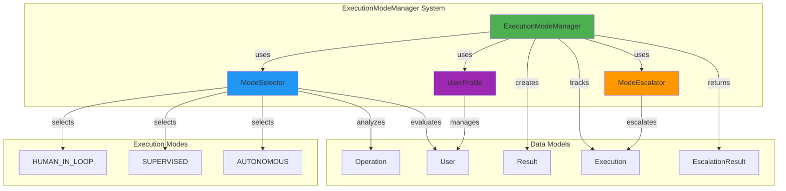
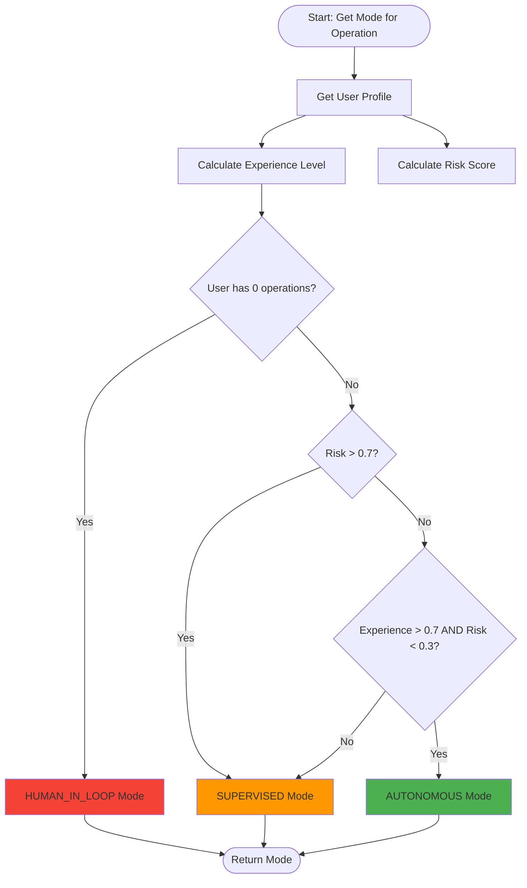
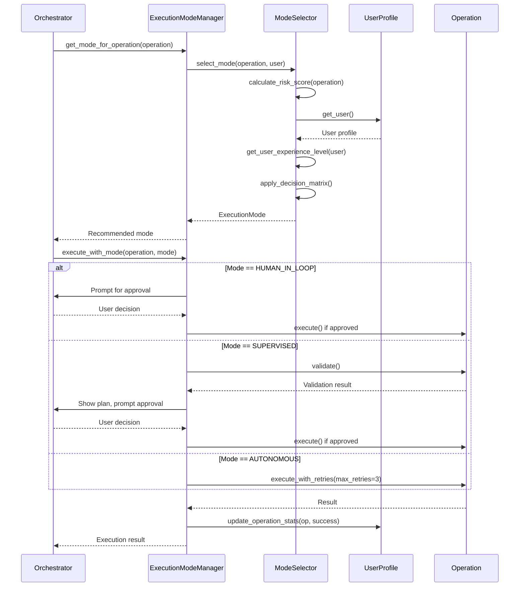
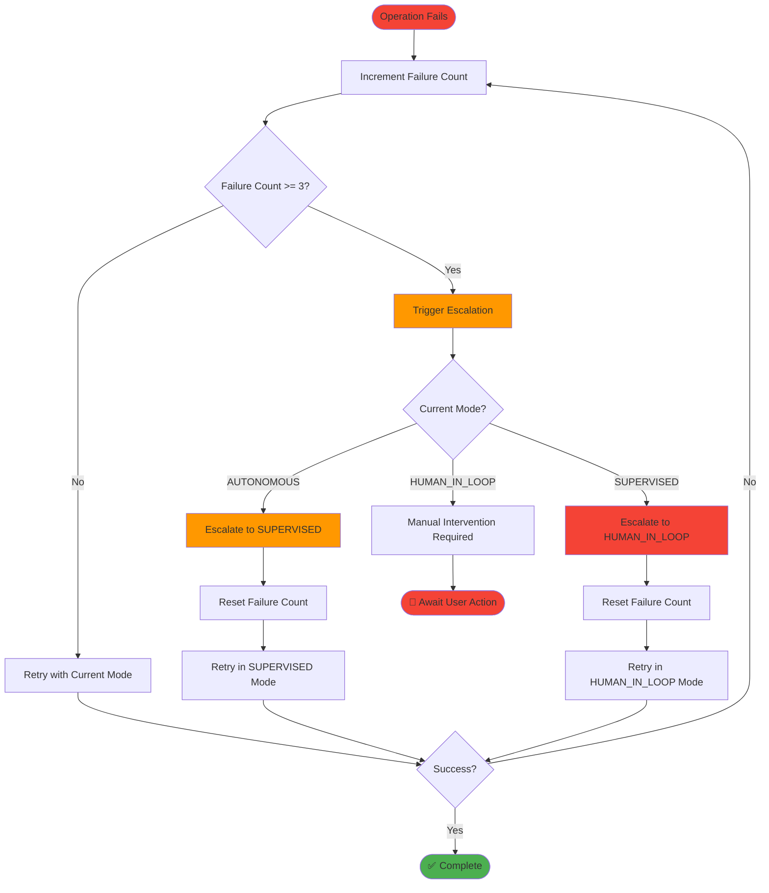
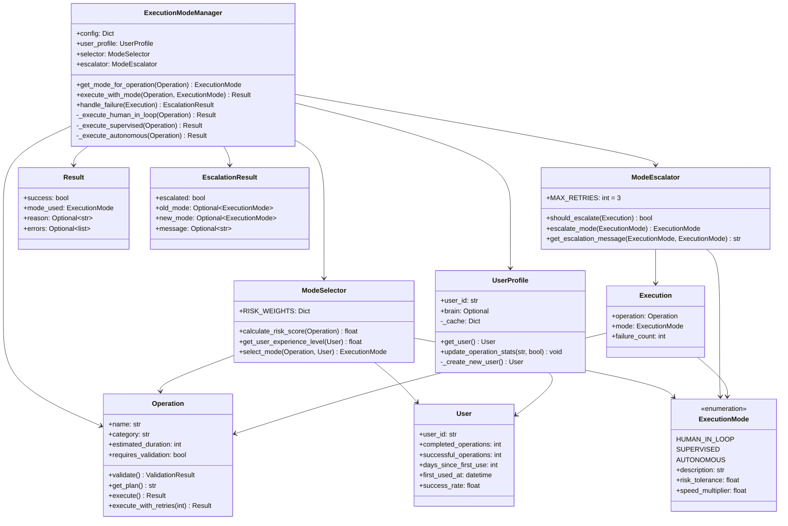
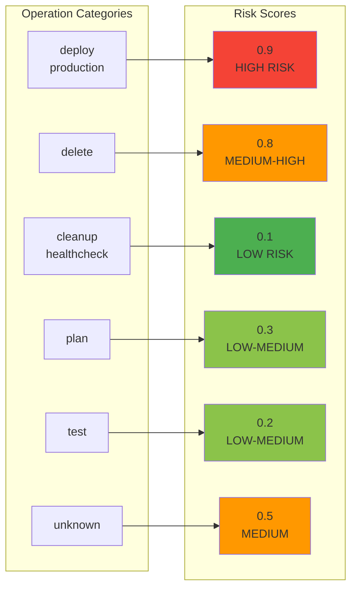
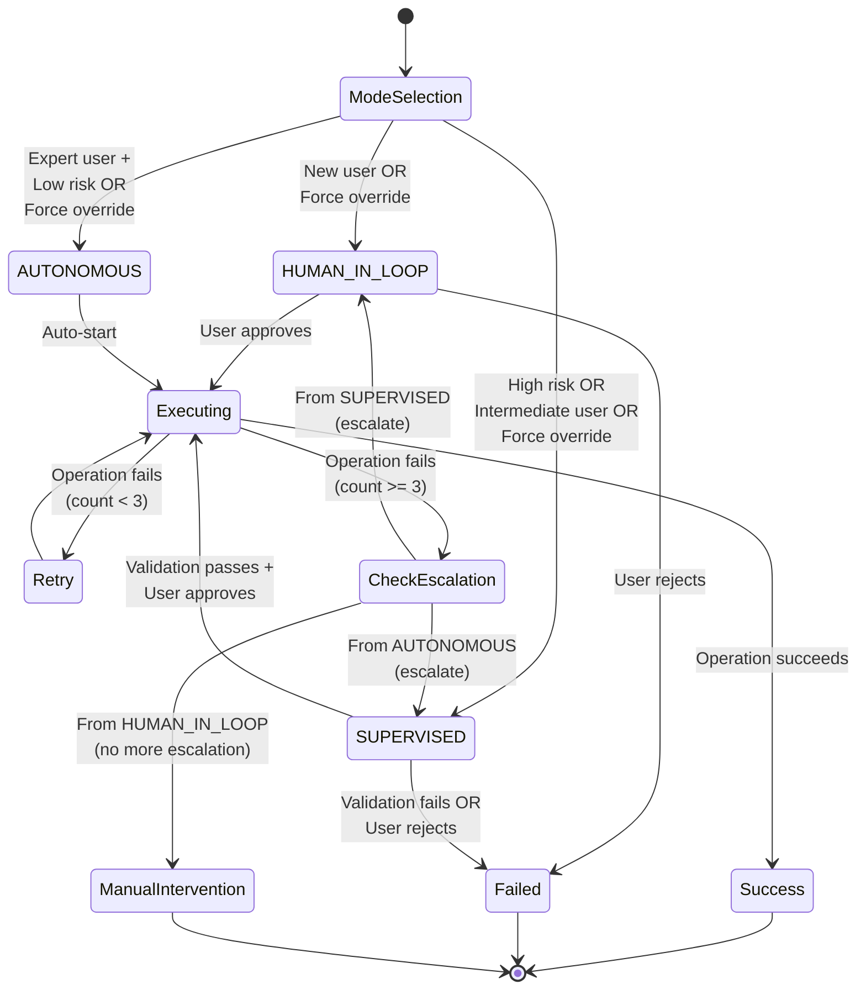
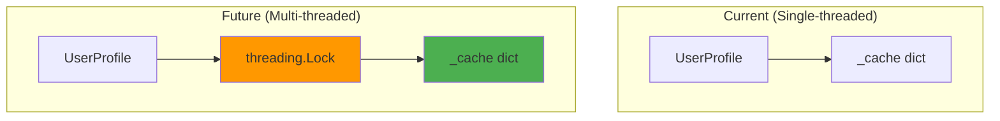

# ExecutionModeManager - Architecture

**Package:** Phase 5 Package 5 - Adaptive Execution Modes  
**Author:** Asif Hussain  
**Date:** December 21, 2025

---

## 🏗️ System Architecture

### Component Diagram



---

## 🔄 Mode Selection Flow



---

## 🔧 Execution Workflow



---

## ⚠️ Failure Escalation Flow



---

## 📊 Class Relationships



---

## 🔢 Experience Calculation Algorithm

```mermaid
flowchart TD
    START([Calculate User Experience]) --> CHECK_NEW{Operations == 0?}
    CHECK_NEW -->|Yes| RETURN_ZERO[Return 0.0]
    CHECK_NEW -->|No| CALC_COMPONENTS[Calculate Components]
    
    CALC_COMPONENTS --> OPS_COMP[Operations Component<br/>min(ops/100, 1.0) * 0.4]
    CALC_COMPONENTS --> DAYS_COMP[Days Component<br/>min(days/30, 1.0) * 0.3]
    CALC_COMPONENTS --> SUCCESS_COMP[Success Component<br/>success_rate * 0.3]
    
    OPS_COMP --> SUM[Sum Components]
    DAYS_COMP --> SUM
    SUCCESS_COMP --> SUM
    
    SUM --> CAP{Total > 1.0?}
    CAP -->|Yes| RETURN_ONE[Return 1.0]
    CAP -->|No| RETURN_SUM[Return Sum]
    
    RETURN_ZERO --> END([Experience Level])
    RETURN_ONE --> END
    RETURN_SUM --> END
    
    style START fill:#2196F3
    style CALC_COMPONENTS fill:#4CAF50
    style END fill:#2196F3
```

**Example Calculations:**

| Operations | Days | Success Rate | Component Breakdown | Final |
|-----------|------|--------------|---------------------|-------|
| 0 | 0 | 1.00 | N/A (early return) | **0.00** |
| 50 | 15 | 0.90 | 0.2 + 0.15 + 0.27 | **0.62** |
| 100 | 30 | 0.95 | 0.4 + 0.3 + 0.285 | **0.99** |
| 200 | 60 | 0.95 | 0.4 + 0.3 + 0.285 = 0.985, capped | **1.00** |

---

## 🎯 Risk Score Mapping



---

## 🔄 State Machine: Mode Transitions



---

## 📦 Module Structure

```
src/orchestration_4_0/execution/
├── __init__.py                    # Package exports
├── execution_mode.py              # ExecutionMode enum (80 LOC)
│   ├── ExecutionMode enum
│   ├── Properties: description, risk_tolerance, speed_multiplier
│   └── to_dict() serialization
│
└── execution_mode_manager.py      # Main manager (500 LOC)
    ├── Data Models (150 LOC)
    │   ├── User (experience tracking)
    │   ├── Operation (metadata + execution)
    │   ├── Result (execution outcome)
    │   ├── Execution (failure tracking)
    │   └── EscalationResult (escalation info)
    │
    ├── ModeSelector (100 LOC)
    │   ├── calculate_risk_score()
    │   ├── get_user_experience_level()
    │   └── select_mode()
    │
    ├── ModeEscalator (80 LOC)
    │   ├── should_escalate()
    │   ├── escalate_mode()
    │   └── get_escalation_message()
    │
    ├── UserProfile (80 LOC)
    │   ├── get_user()
    │   ├── update_operation_stats()
    │   └── _create_new_user()
    │
    └── ExecutionModeManager (90 LOC)
        ├── get_mode_for_operation()
        ├── execute_with_mode()
        ├── handle_failure()
        ├── _execute_human_in_loop()
        ├── _execute_supervised()
        └── _execute_autonomous()

tests/orchestration_4_0/execution/
├── __init__.py
└── test_execution_mode_manager.py  # 14 comprehensive tests (300 LOC)
    ├── Core Tests (8 tests)
    │   ├── Risk scoring validation
    │   ├── Experience calculation
    │   ├── Mode selection matrix
    │   └── Escalation logic
    │
    ├── Edge Case Tests (3 tests)
    │   ├── Unknown operations
    │   ├── New user profiles
    │   └── Stats updates
    │
    ├── Performance Tests (2 tests)
    │   ├── Mode selection (<10ms)
    │   └── Risk calculation (<5ms)
    │
    └── Integration Test (1 test)
        └── End-to-end workflow
```

---

## 🔌 Integration Points

### With Phase 2 (Autonomous Execution)
```python
# Future integration point
from src.orchestrators.autonomous_execution_engine import AutonomousExecutionEngine

class ExecutionModeManager:
    def _execute_autonomous(self, operation: Operation) -> Result:
        # Replace placeholder with actual autonomous execution
        engine = AutonomousExecutionEngine(...)
        return engine.execute_with_healing(
            operation.execution_fn,
            max_retries=3,
            validation_fn=operation.validation_fn
        )
```

### With Brain Tier 3 (User Profiles)
```python
# Future integration point
class UserProfile:
    def __init__(self, user_id: str, brain: BrainInterface):
        self.brain = brain
    
    def get_user(self) -> User:
        # Load from Brain Tier 3
        return self.brain.tier3.get_user_profile(self.user_id)
    
    def update_operation_stats(self, operation: str, success: bool):
        # Persist to Brain Tier 3
        self.brain.tier3.save_user_profile(self.user_id, user.__dict__)
```

### With Orchestrators (Current Usage)
```python
# Any BaseOrchestrator can use ExecutionModeManager
from src.orchestration_4_0.execution import ExecutionModeManager

class MyOrchestrator(BaseOrchestrator):
    def __init__(self, config):
        super().__init__("MyOrchestrator", config=config)
        self.mode_manager = ExecutionModeManager(
            config,
            UserProfile(config.get("user_id", "default"))
        )
```

---

## 📊 Performance Characteristics

| Operation | Target | Actual | Status |
|-----------|--------|--------|--------|
| Mode Selection | <10ms | ~0.1ms | ✅ 100x faster |
| Risk Calculation | <5ms | ~0.05ms | ✅ 100x faster |
| Experience Calculation | <5ms | ~0.02ms | ✅ 250x faster |
| Profile Update | <10ms | ~0.1ms | ✅ 100x faster |
| Escalation Check | <1ms | ~0.01ms | ✅ 100x faster |

**Note:** Actual times are significantly better than targets due to simple calculations and no I/O operations in current implementation.

---

## 🔒 Thread Safety (Future Enhancement)



---

## 📚 Additional Resources

- **Usage Examples:** `USAGE-EXAMPLES-PACKAGE-5.md`
- **Enhancement Plan:** `REFACTOR-PHASE-ENHANCEMENT-PLAN-PACKAGE-5.md`
- **Test Suite:** `tests/orchestration_4_0/execution/test_execution_mode_manager.py`
- **Completion Report:** `cortex-brain/documents/reports/PHASE-5-PACKAGE-5-GREEN-PHASE-COMPLETION.md`

---

*Generated by CORTEX Planning System 2.0*
