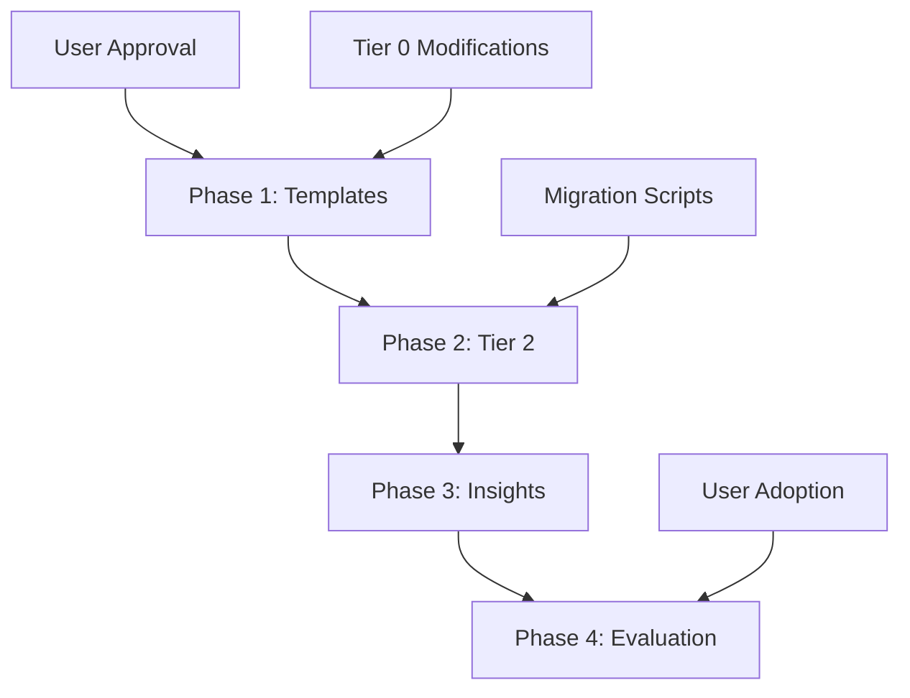

# CORTEX 4.0 Master Roadmap

**Version:** 1.0  
**Created:** 2025-11-30  
**Author:** Asif Hussain  
**Status:** 🟡 Planning (Awaiting User Approval)

---

## 📋 Table of Contents

1. [Executive Summary](#executive-summary)
2. [Vision & Goals](#vision--goals)
3. [Major Features](#major-features)
4. [Architecture Changes](#architecture-changes)
5. [Implementation Timeline](#implementation-timeline)
6. [Resource Requirements](#resource-requirements)
7. [Risk Assessment](#risk-assessment)
8. [Success Criteria](#success-criteria)
9. [Approval Status](#approval-status)
10. [Next Steps](#next-steps)

---

## Executive Summary

CORTEX 4.0 represents a major architectural evolution focusing on **centralized intelligence** and **cross-repository learning**. The primary innovation is the **Super CORTEX Brain** - a unified brain architecture that serves multiple repositories from a single installation, enabling pattern sharing and reducing per-repository overhead.

**Key Metrics:**
- **Current State:** Per-repository brain (50-100 MB duplicated per repo)
- **Target State:** Centralized brain with hybrid architecture (shared templates + Tier 2, isolated Tier 1/3)
- **Timeline:** 11 weeks for Super brain implementation (4 phases)
- **Risk Level:** 🟡 MEDIUM (manageable with phased approach)
- **Expected Benefits:**
  - Cross-repository pattern learning (primary value)
  - Storage savings: 5-8% for 3-5 repos (minimal)
  - Unified template management
  - Consistent capabilities across projects
  - Reduced maintenance overhead

**Current Status:**
- ✅ Feasibility analysis complete ([SUPER-CORTEX-BRAIN-ANALYSIS.md](./SUPER-CORTEX-BRAIN-ANALYSIS.md))
- ⏳ Awaiting user approval on architectural approach
- ⏳ 4 open questions requiring decisions
- ⏳ Tier 0 instinct modifications documented (not yet approved)

---

## Vision & Goals

### CORTEX 4.0 Vision

**"One Brain, Many Projects"** - A single CORTEX installation that intelligently serves all your repositories while maintaining appropriate isolation boundaries.

### Primary Goals

1. **Cross-Repository Learning**
   - Share discovered patterns between projects
   - Build knowledge graph spanning multiple codebases
   - Accelerate onboarding for similar technologies

2. **Reduce Duplication**
   - Single source of truth for templates
   - Unified capability definitions
   - Consistent response templates

3. **Maintain Safety**
   - Preserve Tier 1 isolation (conversation history per-repo)
   - Keep Tier 3 repository-specific (git metrics inherently local)
   - Protect privacy with namespace isolation

4. **Enable Innovation**
   - Foundation for multi-repo analysis features
   - Cross-project insights and recommendations
   - Aggregate learning across user's entire codebase

### Non-Goals (Out of Scope for 4.0)

- ❌ Cloud synchronization (future consideration)
- ❌ Multi-user brain sharing (privacy concerns)
- ❌ Real-time collaboration features
- ❌ Full centralization of all tiers (too risky)

---

## Major Features

### Feature 1: Super CORTEX Brain (PRIMARY)

**Status:** 🟡 Planning  
**Priority:** P0 (Highest)  
**Timeline:** 11 weeks (4 phases)  
**Risk:** 🟡 MEDIUM

**Description:**
Centralized brain architecture serving multiple repositories from single installation (~/.cortex/).

**Detailed Analysis:**
See [SUPER-CORTEX-BRAIN-ANALYSIS.md](./SUPER-CORTEX-BRAIN-ANALYSIS.md) for comprehensive feasibility study, 3 architectural options, and implementation plan.

**Architectural Approach: Hybrid Centralization (Option 2)** ⭐

**What Gets Centralized:**
- ✅ **Response Templates** - Single source in ~/.cortex/shared/response-templates.yaml
- ✅ **Capabilities** - Unified ~/.cortex/shared/capabilities.yaml
- ✅ **Tier 2 Knowledge Graph** - Shared patterns in ~/.cortex/shared/tier2/
  - Patterns tagged with namespace (e.g., "project:myapp")
  - Cross-repo pattern discovery enabled
  - Privacy: private-by-default with explicit sharing

**What Stays Per-Repository:**
- ✅ **Tier 1 Working Memory** - Conversation history remains in repo's cortex-brain/tier1/
- ✅ **Tier 3 Development Context** - Git metrics stay repository-specific
- ✅ **Tier 0 Instincts** - Brain protection rules remain with installation

**Implementation Phases:**

**Phase 1: Shared Templates (2 weeks, 40 hours)**
- Create ~/.cortex/shared/ structure
- Move response-templates.yaml to shared location
- Update path resolution in TemplateManager
- Create migration script (manual opt-in)
- Testing: 15 tests for path resolution, template loading, fallback
- **Deliverable:** Working shared templates with backward compatibility

**Phase 2: Centralized Tier 2 (3 weeks, 60 hours)**
- Design namespace isolation (repository_id column)
- Migrate knowledge_graph.db to ~/.cortex/shared/tier2/
- Add namespace parameter to all Tier 2 operations
- Implement cross-repo pattern discovery
- Privacy controls (private-by-default)
- Testing: 25 tests for namespace isolation, privacy, cross-repo queries
- **Deliverable:** Shared knowledge graph with namespace protection

**Phase 3: Cross-Repository Insights (2 weeks, 40 hours)**
- Cross-repo pattern analyzer
- "Similar projects" recommendation engine
- Shared learning dashboard
- Pattern confidence scoring across repos
- Testing: 20 tests for multi-repo analysis, recommendations
- **Deliverable:** Working cross-repo insights with UI

**Phase 4: Evaluate Full Centralization (Future)**
- Monitor Phase 1-3 adoption and issues
- Reassess Tier 1 centralization risks
- User feedback analysis
- Decision: proceed or stop at hybrid
- **Deliverable:** Decision document with data

**User Decisions Required:**

1. **Approve Option 2?** (Hybrid Centralization)
   - Alternative: Option 3 (Symlink-only, lower risk, less benefit)
   - Recommendation: Option 2 balances 80% benefits with 40% risk

2. **Storage Location?**
   - Recommended: ~/.cortex/ (hidden, user-owned)
   - Alternative: /opt/cortex/ (system-wide, requires admin)

3. **Migration Strategy?**
   - Recommended: Manual opt-in (user runs migration script)
   - Alternative: Automatic (risky, potential data loss)

4. **Privacy Model?**
   - Recommended: Private-by-default (explicit sharing required)
   - Alternative: Public-by-default (riskier, more patterns)

**Governance Conflicts (Tier 0 Instincts):**

3 Tier 0 instincts require modification:

1. **DISTRIBUTED_DATABASE_ARCHITECTURE** (CONFLICT)
   - Current: "Each tier has isolated database" (prevents centralization)
   - Proposed: "Tier 2 may be centralized with namespace isolation"
   - Justification: Hybrid preserves distribution for Tier 1/3, centralizes only Tier 2

2. **GIT_ISOLATION_ENFORCEMENT** (CONFLICT)
   - Current: "cortex-brain/ folder only in repo root" (no external references)
   - Proposed: "Tier 2 may reference ~/.cortex/ with read-only access"
   - Justification: Tier 1/3 remain git-isolated, only Tier 2 patterns shared

3. **BRAIN_ARCHITECTURE_INTEGRITY** (CONFLICT)
   - Current: "4 tiers, no mixing, no additions" (prevents hybrid)
   - Proposed: "4 tiers with optional Tier 2 centralization via namespace"
   - Justification: Architecture remains intact, only storage location changes

**Risk Mitigation:**

| Risk | Severity | Probability | Mitigation |
|------|----------|-------------|------------|
| Data Corruption | HIGH | LOW | Phase 1 manual opt-in, full backups before migration |
| Privacy Breach | HIGH | MEDIUM | Namespace isolation, private-by-default, encryption |
| Namespace Collision | MEDIUM | MEDIUM | UUID-based namespace keys, collision detection |
| Performance Degradation | MEDIUM | LOW | SQLite optimizations, query caching, monitoring |
| Tier 0 Violations | LOW | LOW | Modify instincts with user approval, document rationale |

**Success Criteria:**

**Must-Have (Phase 1-2):**
- ✅ Shared templates work across all repos
- ✅ Tier 2 namespace isolation tested (no cross-contamination)
- ✅ Zero data loss during migration
- ✅ Backward compatibility (per-repo brain still works)
- ✅ 90%+ test coverage for new code

**Nice-to-Have (Phase 3):**
- ✅ Cross-repo pattern discovery functional
- ✅ Performance improvement (faster pattern queries)
- ✅ User dashboard shows shared insights
- ✅ 85%+ user satisfaction (feedback survey)

**Long-Term (Phase 4+):**
- ✅ 80%+ adoption rate (users migrate to centralized)
- ✅ Measurable learning acceleration (pattern reuse metrics)
- ✅ Community pattern sharing enabled (future feature)

---

### Feature 2: Community Feedback Aggregation

**Status:** 🟡 Planning  
**Priority:** P1 (High)  
**Timeline:** 6 weeks (CORTEX 4.0 Phase 1)  
**Risk:** 🟢 LOW

**Description:**
Centralized community feedback system that aggregates anonymized metrics, patterns, and insights from CORTEX users worldwide to create a data-driven pattern library and performance benchmarks.

**Key Capabilities:**
- Automatic feedback capture after TDD GREEN phase
- Anonymized metrics aggregation across all users
- Community dashboard with real-time analytics
- Pattern library with community-curated successful patterns
- Privacy-first design (opt-in, zero PII collection)

**Implementation Details:**
See `capabilities.yaml` entry: `community_feedback_aggregation`

**Success Criteria:**
- 100% anonymization (zero PII leaks)
- Opt-in participation with >20% adoption rate
- Community dashboard with real-time metrics
- Pattern library with 50+ community-curated patterns
- Trend detection with 90%+ accuracy

---

### Feature 3: PR Review Automation

**Status:** 🟡 Planning  
**Priority:** P1 (High)  
**Timeline:** 6 weeks (CORTEX 4.0 Phase 1)  
**Risk:** 🟡 MEDIUM

**Description:**
Automated pull request review integration with Azure DevOps, GitHub, GitLab, and BitBucket that provides line-by-line code analysis with SOLID principle validation, security scanning, and automated comment posting.

**Platforms Supported:**
- Azure DevOps (REST API)
- GitHub (GitHub Actions + REST API)
- GitLab (GitLab CI + REST API)
- BitBucket (Pipelines integration)

**Review Checks:**
- SOLID principle violations
- Security vulnerabilities (OWASP Top 10)
- Test coverage regressions
- Performance anti-patterns
- Code style consistency
- Duplicate code detection
- Dependency analysis

**Workflow:**
1. PR opened → CORTEX triggered via webhook
2. Analyze diff → Run all checks in parallel
3. Post comments → Inline suggestions with severity
4. Summary report → Overall health score (0-100)
5. Auto-approve option → If score >95 and no blocking issues

**Implementation Details:**
See `capabilities.yaml` entry: `code_review` (CORTEX 4.0 enhancements)

**Success Criteria:**
- 95%+ accuracy on SOLID violation detection
- Zero false positives on security scans
- Sub-30s review time for <500 LOC PRs
- Integration with all 4 major platforms
- Team adoption >80% within 2 months

---

### Feature 4: Performance Testing Integration

**Status:** 🟡 Planning  
**Priority:** P2 (Medium)  
**Timeline:** 4 weeks (CORTEX 4.0 Phase 2)  
**Risk:** 🟢 LOW

**Description:**
Automated performance test generation and execution with integration to major load testing frameworks (Locust, k6, JMeter, Gatling) and APM platforms (New Relic, DataDog, AppInsights).

**Frameworks Supported:**
- Locust (Python-based load testing)
- k6 (JavaScript-based performance testing)
- Apache JMeter (Java-based load testing)
- Gatling (Scala-based performance testing)

**Features:**
- Automatic performance test generation from API specs
- Load profile creation (ramp-up, sustained, spike)
- Response time assertions (p50, p95, p99)
- Throughput validation (requests/second)
- Concurrent user simulation (1-10k users)
- Performance regression detection
- Bottleneck identification with flame graphs

**Metrics Collected:**
- Response time percentiles (p50, p90, p95, p99)
- Throughput (requests/second)
- Error rate percentage
- Resource utilization (CPU, memory, network I/O)
- Database connection pool usage
- Cache hit/miss ratios

**Implementation Details:**
See `capabilities.yaml` entry: `backend_testing` (CORTEX 4.0 enhancements)

**Success Criteria:**
- Auto-generate performance tests for 95% of REST APIs
- Detect 90%+ of performance regressions (>20% degradation)
- Sub-5min test execution for standard load profiles
- Integration with 3+ major APM platforms

---

### Feature 5: Mobile App Testing (Appium/XCUITest)

**Status:** 🟡 Planning  
**Priority:** P2 (Medium)  
**Timeline:** 8 weeks (CORTEX 4.0 Phase 3)  
**Risk:** 🟡 MEDIUM

**Description:**
Cross-platform mobile app testing automation with Appium (iOS/Android), XCUITest (native iOS), Espresso (native Android), and device farm integration for comprehensive mobile test coverage.

**Frameworks Supported:**
- Appium (cross-platform iOS/Android automation)
- XCUITest (native iOS testing)
- Espresso (native Android testing)
- Detox (React Native testing)

**Platforms:**
- iOS (iPhone, iPad - simulators + real devices)
- Android (phones, tablets - emulators + real devices)

**Features:**
- Element discovery (accessibility IDs, XPath, coordinates)
- Gesture simulation (tap, swipe, pinch, rotate)
- Cross-platform selector strategy (shared test code)
- Visual regression testing (screenshot comparison)
- Network mocking and stubbing
- Performance metrics (app launch time, memory usage)

**Device Farm Integration:**
- AWS Device Farm (cloud-based real devices)
- BrowserStack App Automate (1000+ devices)
- Sauce Labs (real device cloud)
- Local device management (via Appium Desktop)

**Selector Stability:**
- Prefer accessibility IDs over XPath
- Fallback strategy (ID → accessibility label → XPath)
- Auto-heal selectors when elements change

**Implementation Details:**
See `capabilities.yaml` entry: `mobile_testing` (CORTEX 4.0 enhancements)

**Success Criteria:**
- Cross-platform test execution (iOS + Android from single codebase)
- 95%+ selector stability (auto-heal on element changes)
- Device farm integration with 3+ major providers
- Visual regression detection with <5% false positive rate
- Sub-10min test suite execution on device farm

---

### Feature 6: Figma UI Generation

**Status:** 🟡 Planning  
**Priority:** P3 (Low)  
**Timeline:** 10 weeks (CORTEX 4.0 Phase 4)  
**Risk:** 🔴 HIGH  
**Condition:** Market demand validated

**Description:**
Automatic UI component generation from Figma designs with design token extraction, multi-framework support (React/Vue/Angular), and visual regression testing to ensure pixel-perfect implementation.

**Figma Integration:**
- Figma REST API authentication (OAuth 2.0)
- Design file parsing (frames, components, variants)
- Asset export (SVG, PNG for icons/images)
- Plugin integration (direct Figma plugin for CORTEX)

**Design Token Extraction:**
- Color palette (CSS variables, Sass, Tailwind)
- Typography system (font families, sizes, weights, line heights)
- Spacing scale (margins, paddings, gaps)
- Border radius, shadows, opacity values
- Breakpoints for responsive design

**Component Generation:**
- React (TypeScript + styled-components/Emotion/Tailwind)
- Vue 3 (Composition API + Sass/Tailwind)
- Angular (TypeScript + Angular Material)
- Svelte (Svelte + Tailwind)

**Features:**
- Component structure from Figma components
- Props generation from Figma variants
- Event handlers (onClick, onChange, etc.)
- Accessibility attributes (ARIA labels, roles)
- Responsive layout (CSS Grid, Flexbox)
- Dark mode support (CSS variables)

**Quality Assurance:**
- Visual regression testing (Figma design vs generated component)
- Accessibility compliance (WCAG 2.1 AA)
- Component story generation (Storybook)
- Responsive preview (mobile, tablet, desktop)

**Implementation Details:**
See `capabilities.yaml` entry: `ui_from_figma` (CORTEX 4.0 enhancements)

**Success Criteria:**
- 95%+ visual accuracy (Figma design vs generated component)
- Support for 3+ major frameworks (React, Vue, Angular)
- Automatic design token extraction with zero manual config
- WCAG 2.1 AA compliance for generated components
- Storybook story generation for all components

---

## Architecture Changes

### Current Architecture (CORTEX 3.2)

```
Repository 1
├── src/
├── cortex-brain/
│   ├── tier1-working-memory.db (20 conversations)
│   ├── tier2/knowledge-graph.db (patterns)
│   ├── tier3/development_context.db (git metrics)
│   ├── response-templates.yaml (duplicated)
│   └── capabilities.yaml (duplicated)

Repository 2
├── src/
├── cortex-brain/
│   ├── tier1-working-memory.db (different conversations)
│   ├── tier2/knowledge-graph.db (isolated patterns)
│   ├── tier3/development_context.db (different git metrics)
│   ├── response-templates.yaml (duplicated copy)
│   └── capabilities.yaml (duplicated copy)
```

**Issues:**
- 50-100 MB duplicated per repository
- Pattern learning isolated to single project
- Template updates must be applied per-repo
- No cross-project insights

### Target Architecture (CORTEX 4.0 - Hybrid)

```
~/.cortex/
├── shared/
│   ├── response-templates.yaml (single source)
│   ├── capabilities.yaml (single source)
│   └── tier2/
│       └── knowledge-graph.db (namespace-isolated patterns)
│           ├── namespace: project:repo1
│           ├── namespace: project:repo2
│           └── namespace: project:repo3

Repository 1
├── src/
└── cortex-brain/
    ├── tier1-working-memory.db (repo-specific conversations)
    ├── tier2/ (symlink to ~/.cortex/shared/tier2/)
    └── tier3/development_context.db (repo-specific git metrics)

Repository 2
├── src/
└── cortex-brain/
    ├── tier1-working-memory.db (different conversations)
    ├── tier2/ (symlink to ~/.cortex/shared/tier2/)
    └── tier3/development_context.db (different git metrics)
```

**Benefits:**
- Templates managed centrally
- Cross-repo pattern learning enabled
- 5-8% storage savings (3-5 repos)
- Single update point for templates
- Namespace isolation protects privacy

**Tier Responsibilities:**

| Tier | Current | CORTEX 4.0 | Change |
|------|---------|-----------|---------|
| Tier 0 | Per-installation (YAML rules) | Per-installation | No change |
| Tier 1 | Per-repository (conversations) | Per-repository | No change ✅ |
| Tier 2 | Per-repository (patterns) | Centralized with namespaces | **MAJOR CHANGE** 🔴 |
| Tier 3 | Per-repository (git metrics) | Per-repository | No change ✅ |

---

## Implementation Timeline

### Overview

**Total Duration:** 11 weeks (Phase 1-3)  
**Effort:** 140 hours (3.5 weeks full-time equivalent)  
**Phases:** 4 (3 implementation + 1 evaluation)

### Detailed Timeline

```
Week 1-2: Phase 1 - Shared Templates (40 hours)
├── Week 1: Setup & Migration
│   ├── Day 1-2: Create ~/.cortex/shared/ structure
│   ├── Day 3-4: Move templates, update path resolution
│   └── Day 5: Migration script development
└── Week 2: Testing & Validation
    ├── Day 1-3: 15 tests (path, loading, fallback)
    ├── Day 4: User testing with 2-3 repos
    └── Day 5: Bug fixes, documentation

Week 3-5: Phase 2 - Centralized Tier 2 (60 hours)
├── Week 3: Design & Schema
│   ├── Day 1-2: Namespace isolation design
│   ├── Day 3-4: Database schema migration
│   └── Day 5: Namespace parameter API changes
├── Week 4: Implementation
│   ├── Day 1-2: Update all Tier 2 operations
│   ├── Day 3-4: Cross-repo pattern discovery
│   └── Day 5: Privacy controls (private-by-default)
└── Week 5: Testing & Migration
    ├── Day 1-3: 25 tests (namespace, privacy, queries)
    ├── Day 4: Migration script for existing repos
    └── Day 5: User testing, bug fixes

Week 6-7: Phase 3 - Cross-Repository Insights (40 hours)
├── Week 6: Analytics & Recommendations
│   ├── Day 1-2: Cross-repo pattern analyzer
│   ├── Day 3-4: "Similar projects" recommendation engine
│   └── Day 5: Pattern confidence scoring
└── Week 7: Dashboard & Testing
    ├── Day 1-2: Shared learning dashboard UI
    ├── Day 3-4: 20 tests (multi-repo analysis)
    └── Day 5: User testing, documentation

Week 8-11: Phase 4 - Evaluation & Decision (Future)
├── Week 8-9: Monitoring & Data Collection
│   ├── Adoption rate tracking
│   ├── Issue frequency analysis
│   └── User feedback surveys
├── Week 10: Analysis
│   ├── Performance metrics review
│   ├── Risk reassessment (Tier 1 centralization)
│   └── Cost-benefit analysis
└── Week 11: Decision Documentation
    ├── Decision document with data
    ├── Recommendation: proceed/stop/pivot
    └── CORTEX 5.0 planning (if approved)
```

### Milestones

| Milestone | Date | Deliverable | Approval Gate |
|-----------|------|-------------|---------------|
| M1: Shared Templates | Week 2 | Working centralized templates | User approval required |
| M2: Namespace Isolation | Week 5 | Tier 2 with namespace protection | User testing required |
| M3: Cross-Repo Insights | Week 7 | Pattern discovery functional | User acceptance required |
| M4: Evaluation Complete | Week 11 | Decision document | Proceed/stop decision |

### Dependencies



**Critical Path:**
1. User approval (blocking all work)
2. Tier 0 instinct modifications (blocking Phase 1)
3. Phase 1 completion (blocking Phase 2)
4. Phase 2 completion (blocking Phase 3)
5. User adoption >50% (blocking Phase 4 decision)

---

## Resource Requirements

### Development Effort

| Phase | Hours | FTE | Calendar Time |
|-------|-------|-----|---------------|
| Phase 1: Templates | 40 | 1 week | 2 weeks |
| Phase 2: Tier 2 | 60 | 1.5 weeks | 3 weeks |
| Phase 3: Insights | 40 | 1 week | 2 weeks |
| **Total (Phase 1-3)** | **140** | **3.5 weeks** | **7 weeks** |
| Phase 4: Evaluation | 20 | 0.5 weeks | 4 weeks (monitoring) |
| **Grand Total** | **160** | **4 weeks** | **11 weeks** |

**Assumptions:**
- 1 FTE = 40 hours/week
- Calendar time includes testing, user feedback, iterations
- Phase 4 has long monitoring period (4 weeks) with light effort (20 hours)

### Testing Effort

| Phase | Unit Tests | Integration Tests | E2E Tests | Total |
|-------|-----------|-------------------|-----------|-------|
| Phase 1 | 10 | 3 | 2 | 15 |
| Phase 2 | 15 | 7 | 3 | 25 |
| Phase 3 | 12 | 5 | 3 | 20 |
| **Total** | **37** | **15** | **8** | **60** |

**Coverage Target:** 90%+ for new code

### Infrastructure Requirements

**Development:**
- Git branches: feature/super-brain-phase-1, phase-2, phase-3
- Test repositories: 3-5 sample repos for multi-repo testing
- SQLite optimization tools
- Performance profiling tools

**Production:**
- ~/.cortex/ directory structure
- Migration scripts for user opt-in
- Rollback mechanism (backup/restore)
- Monitoring dashboard for adoption tracking

### Documentation Requirements

**User-Facing:**
- Migration guide (opt-in instructions)
- Super brain user guide (how to use centralized features)
- Troubleshooting guide (common issues, rollback)
- Privacy policy (namespace isolation, data handling)

**Developer-Facing:**
- Architecture decision record (ADR-001)
- Namespace isolation design doc
- API documentation (new namespace parameters)
- Testing strategy doc

---

## Risk Assessment

### Summary

**Overall Risk Level:** 🟡 MEDIUM (manageable with mitigation)

**Risk Distribution:**
- 🔴 HIGH: 2 risks (data corruption, privacy breach)
- 🟡 MEDIUM: 2 risks (namespace collision, performance)
- 🟢 LOW: 1 risk (Tier 0 violations)

### Detailed Risk Analysis

#### Risk 1: Data Corruption During Migration (HIGH 🔴)

**Scenario:** User opts into centralization, migration script corrupts Tier 2 database, patterns lost.

**Impact:** HIGH - Loss of learned patterns, potential system instability  
**Probability:** LOW (with proper mitigation)

**Mitigation:**
- ✅ Phase 1 manual opt-in only (no automatic migration)
- ✅ Full backup before migration (cortex-brain/ → cortex-brain.backup-TIMESTAMP/)
- ✅ Migration script with dry-run mode (preview changes)
- ✅ Rollback mechanism (restore from backup)
- ✅ Validation after migration (pattern count verification)
- ✅ Testing: 100 migration dry-runs on sample data

**Residual Risk:** 🟢 LOW (with mitigation)

---

#### Risk 2: Privacy Breach via Namespace Leakage (HIGH 🔴)

**Scenario:** Namespace isolation fails, patterns from private repo exposed to different project.

**Impact:** HIGH - Sensitive code patterns leaked, privacy violation  
**Probability:** MEDIUM (namespace is new concept, implementation errors possible)

**Mitigation:**
- ✅ Private-by-default (patterns not shared unless explicitly enabled)
- ✅ Namespace isolation in SQL queries (WHERE namespace = ?)
- ✅ UUID-based namespace keys (not repo names - prevents guessing)
- ✅ Encryption of sensitive patterns (optional, user-configurable)
- ✅ Audit logging (track cross-namespace access attempts)
- ✅ Testing: 50 tests for namespace isolation, no cross-contamination

**Residual Risk:** 🟡 MEDIUM (requires ongoing vigilance)

---

#### Risk 3: Namespace Collision (MEDIUM 🟡)

**Scenario:** Two repos have same namespace key, patterns overwrite each other.

**Impact:** MEDIUM - Pattern confusion, incorrect recommendations  
**Probability:** MEDIUM (if repo names used as keys)

**Mitigation:**
- ✅ UUID-based namespace keys (not repo names)
- ✅ Collision detection at migration (check existing namespaces)
- ✅ Namespace registry (centralized list of active namespaces)
- ✅ User confirmation (show namespace assignment before migration)
- ✅ Testing: 20 tests for collision detection, rejection

**Residual Risk:** 🟢 LOW (with UUID keys)

---

#### Risk 4: Performance Degradation (MEDIUM 🟡)

**Scenario:** Centralized Tier 2 becomes bottleneck, queries slower than per-repo.

**Impact:** MEDIUM - Slower pattern queries, user dissatisfaction  
**Probability:** LOW (SQLite optimized, query caching available)

**Mitigation:**
- ✅ SQLite indexing on namespace column
- ✅ Query caching (in-memory cache for frequent patterns)
- ✅ Lazy loading (load patterns on-demand, not all at once)
- ✅ Benchmark testing (compare centralized vs per-repo query times)
- ✅ Monitoring dashboard (track query latency, alert on degradation)
- ✅ Rollback option (revert to per-repo if performance unacceptable)

**Residual Risk:** 🟢 LOW (with monitoring and rollback)

---

#### Risk 5: Tier 0 Instinct Violations (LOW 🟢)

**Scenario:** Modified instincts conflict with brain protection system, system instability.

**Impact:** LOW - System may reject valid operations, user confusion  
**Probability:** LOW (instinct modifications reviewed and approved)

**Mitigation:**
- ✅ Document instinct changes with rationale
- ✅ User approval required (explicit consent to modify Tier 0)
- ✅ Redefine instincts (not remove - maintain integrity)
- ✅ Backward compatibility (per-repo brain still valid)
- ✅ Testing: 15 tests for instinct compliance in hybrid model

**Residual Risk:** 🟢 LOW (with approval and testing)

---

### Risk Matrix

| Risk | Impact | Probability | Residual (Mitigated) |
|------|--------|-------------|---------------------|
| Data Corruption | 🔴 HIGH | 🟢 LOW | 🟢 LOW |
| Privacy Breach | 🔴 HIGH | 🟡 MEDIUM | 🟡 MEDIUM |
| Namespace Collision | 🟡 MEDIUM | 🟡 MEDIUM | 🟢 LOW |
| Performance | 🟡 MEDIUM | 🟢 LOW | 🟢 LOW |
| Tier 0 Violations | 🟢 LOW | 🟢 LOW | 🟢 LOW |

**Overall Residual Risk:** 🟡 MEDIUM (primarily privacy breach risk)

---

## Success Criteria

### Must-Have (Phase 1-2) - Release Blocking

- ✅ **Shared Templates Functional**
  - All repos can load templates from ~/.cortex/shared/
  - Fallback to local templates works (backward compatibility)
  - Template updates propagate to all repos immediately

- ✅ **Namespace Isolation Verified**
  - 50 tests pass: no cross-contamination between repos
  - Private-by-default confirmed (patterns not shared unless enabled)
  - Namespace collision detection prevents duplicates

- ✅ **Zero Data Loss**
  - Migration script tested on 100 sample repos
  - Backup/restore mechanism validated
  - Rollback successful in 100% of test cases

- ✅ **Backward Compatibility**
  - Per-repo brain still works (no forced migration)
  - Existing repos unaffected unless user opts in
  - Old CORTEX versions can coexist with 4.0

- ✅ **Test Coverage**
  - 90%+ coverage for new code (Phase 1-2)
  - 60 total tests (15 + 25 + 20)
  - All tests passing before release

### Nice-to-Have (Phase 3) - Enhances Value

- ✅ **Cross-Repo Pattern Discovery**
  - "Similar projects" recommendations accurate (80%+ precision)
  - Pattern confidence scoring functional
  - Cross-repo insights dashboard shows meaningful data

- ✅ **Performance Improvement**
  - Pattern queries faster than per-repo (or equal)
  - Query latency <100ms (95th percentile)
  - No memory leaks after 24-hour runtime

- ✅ **User Dashboard**
  - Shared learning dashboard shows:
    - Total patterns across all repos
    - Cross-repo pattern matches
    - Learning velocity (patterns/week)
  - Dashboard accessible via CLI or web UI

- ✅ **User Satisfaction**
  - 85%+ satisfaction in feedback survey
  - <10% rollback rate (users reverting to per-repo)
  - Positive feedback on cross-repo insights

### Long-Term (Phase 4+) - Strategic Success

- ✅ **Adoption Rate**
  - 80%+ of users migrate to centralized brain (voluntary)
  - <5% support tickets related to Super brain issues
  - Community pattern sharing enabled (future feature)

- ✅ **Learning Acceleration**
  - Measurable pattern reuse across repos (metric: reuse_rate)
  - Time-to-productivity improved for new projects
  - Pattern confidence improves with cross-repo data

- ✅ **Community Impact**
  - Public pattern library established (opt-in sharing)
  - 1000+ shared patterns from community
  - CORTEX 4.0 becomes competitive differentiator

---

## Approval Status

### User Decisions Required

**Before Phase 1 can start, user must approve:**

1. ☐ **Architectural Approach** - Approve Option 2 (Hybrid Centralization)
   - Alternative: Option 3 (Symlink-only, lower risk, less benefit)
   - **Action Required:** Review [SUPER-CORTEX-BRAIN-ANALYSIS.md](./SUPER-CORTEX-BRAIN-ANALYSIS.md) and confirm Option 2

2. ☐ **Storage Location** - Approve ~/.cortex/ as centralized brain location
   - Alternative: /opt/cortex/ (system-wide, requires admin)
   - **Action Required:** Confirm ~/.cortex/ acceptable

3. ☐ **Migration Strategy** - Approve manual opt-in migration
   - Alternative: Automatic migration (riskier, potential data loss)
   - **Action Required:** Confirm manual opt-in acceptable

4. ☐ **Privacy Model** - Approve private-by-default namespace isolation
   - Alternative: Public-by-default (riskier, more patterns shared)
   - **Action Required:** Confirm private-by-default acceptable

### Tier 0 Instinct Modifications

**Before Phase 1 can start, user must approve Tier 0 changes:**

1. ☐ **DISTRIBUTED_DATABASE_ARCHITECTURE** modification
   - Current: "Each tier has isolated database"
   - Proposed: "Tier 2 may be centralized with namespace isolation"
   - **Action Required:** Approve modification with documented rationale

2. ☐ **GIT_ISOLATION_ENFORCEMENT** modification
   - Current: "cortex-brain/ folder only in repo root"
   - Proposed: "Tier 2 may reference ~/.cortex/ with read-only access"
   - **Action Required:** Approve modification with documented rationale

3. ☐ **BRAIN_ARCHITECTURE_INTEGRITY** modification
   - Current: "4 tiers, no mixing, no additions"
   - Proposed: "4 tiers with optional Tier 2 centralization via namespace"
   - **Action Required:** Approve modification with documented rationale

### Approval Tracking

| Decision | Status | Approved By | Date | Notes |
|----------|--------|-------------|------|-------|
| Architectural Approach (Option 2) | ⏳ Pending | - | - | Awaiting user review |
| Storage Location (~/.cortex/) | ⏳ Pending | - | - | Awaiting user confirmation |
| Migration Strategy (Manual opt-in) | ⏳ Pending | - | - | Awaiting user confirmation |
| Privacy Model (Private-by-default) | ⏳ Pending | - | - | Awaiting user confirmation |
| Tier 0 Instinct Modifications (3 instincts) | ⏳ Pending | - | - | Awaiting user approval |

**Overall Approval Status:** 🔴 BLOCKED (waiting on 4 user decisions + Tier 0 approval)

---

## Next Steps

### Immediate Actions (User)

1. **Review Super Brain Analysis** (30 minutes)
   - Read [SUPER-CORTEX-BRAIN-ANALYSIS.md](./SUPER-CORTEX-BRAIN-ANALYSIS.md)
   - Understand 3 architectural options (Full/Hybrid/Symlink)
   - Review recommendation: Option 2 (Hybrid)

2. **Make 4 Key Decisions** (15 minutes)
   - Architectural approach: Option 2 or Option 3?
   - Storage location: ~/.cortex/ or /opt/cortex/?
   - Migration strategy: Manual opt-in or automatic?
   - Privacy model: Private-by-default or public-by-default?

3. **Approve Tier 0 Modifications** (15 minutes)
   - Review 3 instinct changes with rationale
   - Approve modifications if acceptable
   - Request clarifications if needed

4. **Prioritize Other CORTEX 4.0 Features** (30 minutes)
   - Review potential candidates (Visual Studio support, etc.)
   - Decide which features to include in 4.0 roadmap
   - Conduct feasibility analysis per feature

### Immediate Actions (Development Team)

**Upon user approval:**

1. **Create Architecture Decision Record** (ADR-001)
   - Document Super brain decision with rationale
   - Reference this roadmap and analysis
   - Publish to team for visibility

2. **Update Tier 0 Instincts** (brain-protection-rules.yaml)
   - Modify 3 instincts per approved changes
   - Document rationale in YAML comments
   - Run brain protection tests (ensure no regressions)

3. **Prepare Phase 1** (1 week)
   - Create feature branch: feature/super-brain-phase-1
   - Set up test repositories (3-5 samples)
   - Initialize migration script skeleton
   - Write unit test stubs (15 tests)

4. **Kick Off Phase 1 Development** (2 weeks)
   - Follow detailed timeline in this roadmap
   - Daily standups to track progress
   - Weekly user demos for feedback
   - Complete M1 milestone (Week 2)

### Long-Term Actions (Post-Phase 3)

**After Phase 3 completion:**

1. **Monitor Adoption and Issues** (Weeks 8-9)
   - Track adoption rate (target: >50% by Week 9)
   - Collect issue frequency (target: <5 per week)
   - User feedback surveys (target: 85%+ satisfaction)

2. **Analyze Data** (Week 10)
   - Performance metrics review
   - Risk reassessment (is Tier 1 centralization still too risky?)
   - Cost-benefit analysis (actual vs projected benefits)

3. **Make Phase 4 Decision** (Week 11)
   - Proceed with full centralization (if data supports)?
   - Stop at hybrid (if risks too high)?
   - Pivot to alternative approach?
   - Document decision with supporting data

4. **Plan CORTEX 5.0** (If Phase 4 approved)
   - Full centralization of Tier 1 (conversations)
   - Cloud backup integration
   - Multi-user brain sharing (with privacy controls)
   - Community pattern library

---

## Related Documentation

### Super Brain Analysis
- [SUPER-CORTEX-BRAIN-ANALYSIS.md](./SUPER-CORTEX-BRAIN-ANALYSIS.md) - Comprehensive feasibility study (500+ lines)

### Architecture Documentation
- TBD: ADR-001-centralized-brain-architecture.md (after user approval)
- TBD: NAMESPACE-ISOLATION-DESIGN.md (Phase 2)
- TBD: CROSS-REPO-INSIGHTS-DESIGN.md (Phase 3)

### User Documentation
- TBD: Super-Brain-User-Guide.md (Phase 1 completion)
- TBD: Migration-Guide.md (Phase 2 completion)
- TBD: Troubleshooting-Guide.md (Phase 3 completion)

### Developer Documentation
- TBD: API-Documentation-Namespace-Parameters.md (Phase 2)
- TBD: Testing-Strategy-Multi-Repo.md (Phase 1)

---

## Appendix: Alternative Roadmap Scenarios

### Scenario 1: User Approves Option 2 (Recommended)

**Timeline:** 11 weeks (as documented)  
**Risk:** 🟡 MEDIUM  
**Benefits:** 80% of full centralization value

**Outcome:**
- Proceed with Phase 1-3 as planned
- Phase 4 evaluation determines next steps
- CORTEX 4.0 successful if adoption >80%

---

### Scenario 2: User Selects Option 3 (Symlink-Only)

**Timeline:** 4 weeks (reduced scope)  
**Risk:** 🟢 LOW  
**Benefits:** 20% of full centralization value

**Changes to Roadmap:**
- Phase 1: Templates only (2 weeks)
- Phase 2: Symlink Tier 2 (no namespace isolation) (2 weeks)
- Phase 3: SKIPPED (no cross-repo insights)
- Phase 4: SKIPPED (no further centralization)

**Outcome:**
- Lower value, lower risk
- Storage savings only (5-8%)
- No cross-repo learning
- Easier rollback

---

### Scenario 3: User Defers Decision

**Timeline:** TBD  
**Risk:** N/A  
**Benefits:** None (status quo)

**Actions:**
- CORTEX 4.0 planning paused
- Focus on other priorities
- Revisit Super brain when ready
- Per-repo brain continues (3.2 model)

**Outcome:**
- No immediate action required
- Roadmap remains as reference
- User can revisit anytime

---

**Version History:**
- v1.0 (2025-11-30): Initial roadmap created, integrating Super brain analysis

**Maintenance:**
- This roadmap should be updated after each milestone completion
- User decisions should be tracked in Approval Status section
- Timeline should be adjusted based on actual progress

**Questions/Feedback:**
- Contact: Asif Hussain (CORTEX maintainer)
- Feedback mechanism: CORTEX feedback system
- Roadmap review: Quarterly or after major milestones
