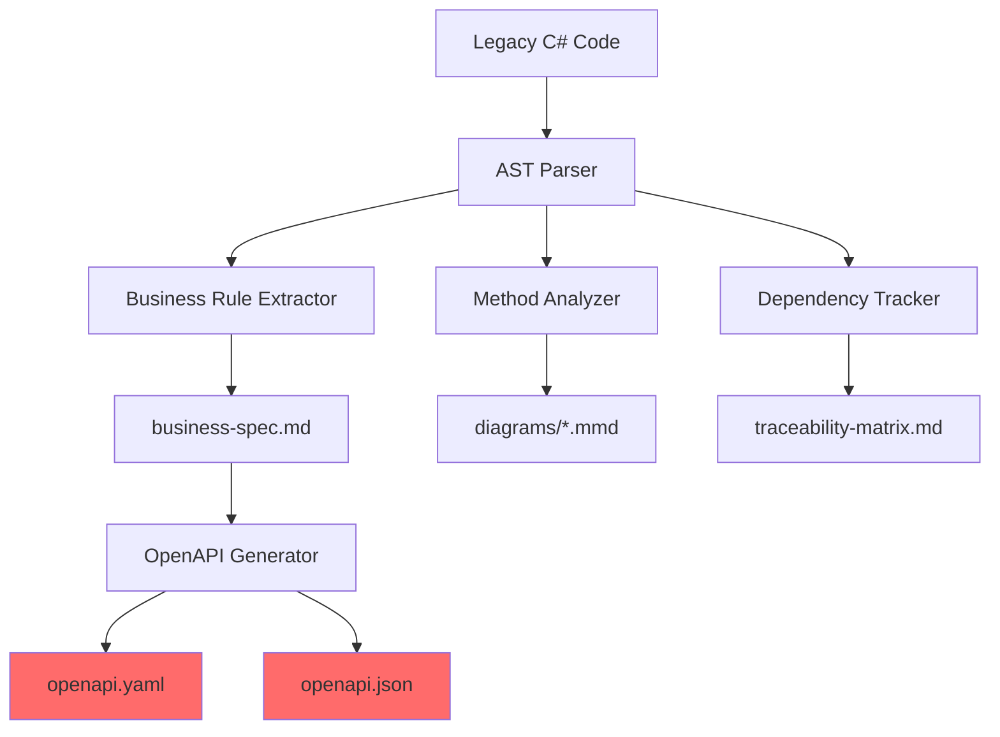
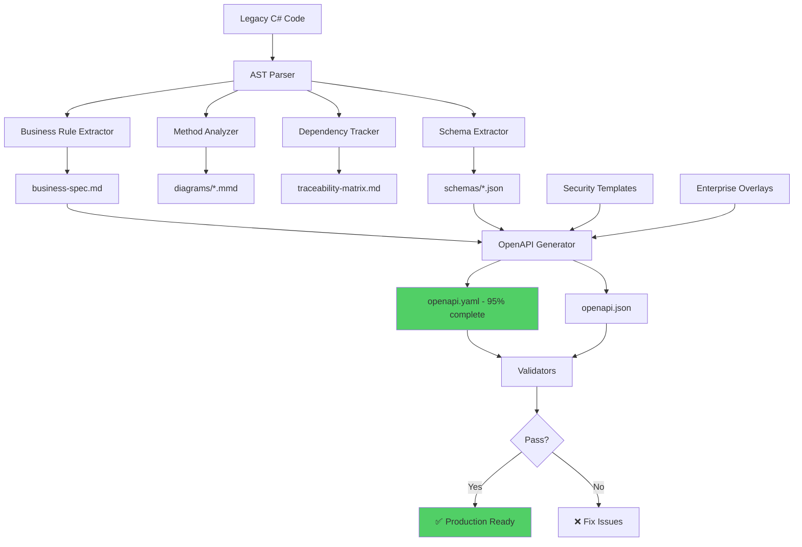

# CORTEX Lens OpenAPI Enhancement Plan

**Plan ID:** CORTEX-LENS-OPENAPI-001  
**Version:** 1.0.0  
**Author:** Asif Hussain | **GitHub:** github.com/asifhussain60/CORTEX  
**Created:** December 16, 2025  
**Status:** 🎯 Ready for Implementation  
**Complexity:** HIGH (Security + Schemas + Enterprise Requirements)

---

## 🎯 Executive Summary

**Problem:** CORTEX Lens v3.0 generates foundational OpenAPI specs (30% complete) but lacks production-ready elements: comprehensive schemas, security definitions, error handling, and enterprise API requirements.

**Solution:** 4-phase enhancement adding schema extraction, security templates, enterprise overlays, and validation tools to achieve 95%+ production readiness.

**Business Impact:**
- **Time Savings:** Reduce manual OpenAPI authoring from 8 hours → 30 minutes per API
- **Quality:** 95%+ production readiness vs current 30%
- **Consistency:** Standardized security, error handling, governance across all APIs
- **Risk Reduction:** Automated validation prevents schema gaps, security omissions

**Success Criteria:**
- ✅ Complete request/response schemas auto-generated from C# entities
- ✅ Production-ready security schemes (OAuth2, JWT)
- ✅ Enterprise overlays (monitoring, governance, SLAs)
- ✅ 95%+ OpenAPI completeness score
- ✅ All validators pass with zero critical issues

---

## 📋 Current State Analysis

### What's Working (Strengths)

**1. Foundation Quality**
- ✅ AST-based extraction with line-level traceability (6.8% coverage)
- ✅ Business specs with user stories, acceptance criteria
- ✅ Mermaid diagrams (flowchart, sequence, dependency) in separate files
- ✅ Multi-format output (YAML + JSON)
- ✅ Validation infrastructure (AST checker, data flow validator)

**2. Documentation Structure**
- ✅ PM/BA review checklists
- ✅ Pilot methodology (`xupdatefundingbatch`)
- ✅ Traceability matrices linking legacy → modern

**3. Tool Integration**
- ✅ Generator at `src/operations/modules/generators/legacy_spec_generator.py`
- ✅ Validators: `ast_completeness_checker.py`, `data_flow_validator.py`, `traceability_calculator.py`
- ✅ Output structure: `business-spec.md`, `diagrams/`, `openapi.yaml`, `traceability-matrix.md`

### Critical Gaps (12 Issues)

#### **1. OpenAPI Schema Completeness (35% missing)**
- ❌ No `requestBody` schemas for POST/PUT operations
- ❌ Generic placeholder responses (`success: boolean`, `message: string`)
- ❌ Missing entity models (FundingBatch, FundingInvoice, CashInOut)
- ❌ No field-level validations (required, types, constraints)
- ❌ No realistic request/response examples

#### **2. Security (100% missing)**
- ❌ No `securitySchemes` (OAuth2, JWT, API keys)
- ❌ No authentication/authorization requirements
- ❌ No rate limiting documentation
- ❌ Missing 401/403 responses

#### **3. Error Handling (60% missing)**
- ❌ Incomplete status codes (only 200, 400)
- ❌ No 404, 500, 503 responses
- ❌ Generic `ValidationError` schema only
- ❌ Empty "Error Scenarios" sections in business specs

#### **4. Enterprise Requirements (90% missing)**
- ❌ No SLA/performance requirements
- ❌ No health check endpoints
- ❌ No idempotency keys for POST operations
- ❌ No correlation ID patterns
- ❌ No PII/PHI data handling
- ❌ No pagination, versioning strategy

#### **5. Business Logic Extraction Quality**
- ⚠️ Truncated rule names: `stringIsNullOrEmptycashI`
- ⚠️ Generic descriptions: "perform specific action"
- ⚠️ Missing business context (WHY rules exist)

#### **6. Data Flow Documentation**
- ⚠️ Sequence diagrams too simplistic (2 participants)
- ❌ No async operations (callbacks, webhooks)
- ❌ No retry/timeout specifications
- ❌ No transaction boundaries

---

## 🏗️ Architecture Overview

### Current Generator Flow



**Problem:** OpenAPI Generator (I) uses hardcoded templates without schema extraction.

### Enhanced Generator Flow (Target)



---

## 📐 Solution Design

### Phase 1: Schema Extraction Engine

**Goal:** Auto-generate complete request/response schemas from C# entities

#### New Components

**1.1 C# Entity Parser (`schema_extractor.py`)**

**Location:** `cortex-toolkit/core/generators/schema_extractor.py`

**Capabilities:**
- Parse C# classes, DTOs, request/response models
- Extract properties with types, nullability, attributes
- Convert C# types → OpenAPI types (int → integer, decimal → number)
- Handle nested entities, collections, inheritance
- Detect validation attributes (`[Required]`, `[Range]`, `[StringLength]`)

**Example Input:**
```csharp
public class FundingBatch
{
    [Required]
    public string BatchId { get; set; }
    
    [Range(0.01, 999999.99)]
    public decimal Amount { get; set; }
    
    public DateTime? ProcessedDate { get; set; }
    
    public List<FundingInvoice> Invoices { get; set; }
}
```

**Example Output:**
```json
{
  "FundingBatch": {
    "type": "object",
    "required": ["BatchId", "Amount"],
    "properties": {
      "BatchId": {
        "type": "string",
        "description": "Unique identifier for funding batch"
      },
      "Amount": {
        "type": "number",
        "format": "decimal",
        "minimum": 0.01,
        "maximum": 999999.99
      },
      "ProcessedDate": {
        "type": "string",
        "format": "date-time",
        "nullable": true
      },
      "Invoices": {
        "type": "array",
        "items": {
          "$ref": "#/components/schemas/FundingInvoice"
        }
      }
    }
  }
}
```

**1.2 Schema Registry (`schema_registry.py`)**

**Purpose:** Track all extracted schemas, prevent duplicates, manage references

**Features:**
- Deduplicate schemas across multiple legacy files
- Auto-generate `$ref` references for nested objects
- Track schema lineage (which legacy file → which schema)
- Export consolidated schema library

**1.3 Enhanced OpenAPI Generator (`openapi_generator_v4.py`)**

**Enhancements:**
- Import schemas from registry
- Generate `requestBody` for POST/PUT/PATCH operations
- Create realistic examples using schema definitions
- Link business rules to specific schema fields

#### Implementation Steps

1. **Create Schema Extractor**
   - [ ] Parse C# class definitions using Roslyn-style AST
   - [ ] Extract properties with types and attributes
   - [ ] Convert C# → OpenAPI type mappings
   - [ ] Handle generics (`List<T>`, `Dictionary<K,V>`)
   - [ ] Detect validation attributes → OpenAPI validation

2. **Build Schema Registry**
   - [ ] Implement schema deduplication
   - [ ] Generate JSON Schema output
   - [ ] Create `$ref` reference graph
   - [ ] Add schema metadata (source file, line number)

3. **Integrate with Generator**
   - [ ] Scan legacy file for referenced entities
   - [ ] Extract schemas for all DTOs, requests, responses
   - [ ] Populate `components/schemas` in OpenAPI spec
   - [ ] Generate `requestBody` and response schemas
   - [ ] Add realistic examples

4. **Add to Toolkit**
   - [ ] Register in `toolkit-manifest.yaml` under `generators` category
   - [ ] Create CLI wrapper: `cortex-toolkit/cli/wrappers/generate_schemas_wrapper.py`
   - [ ] Add command: `cortex-extract-schemas`
   - [ ] Update `TOOLS-INVENTORY.md`

---

### Phase 2: Security & Error Templates

**Goal:** Production-ready security schemes and comprehensive error handling

#### New Components

**2.1 Security Template Library (`security_templates.yaml`)**

**Location:** `cortex-toolkit/templates/openapi/security/`

**Templates:**
- `oauth2-client-credentials.yaml` - OAuth2 machine-to-machine
- `oauth2-authorization-code.yaml` - OAuth2 user delegation
- `jwt-bearer.yaml` - JWT Bearer token
- `api-key-header.yaml` - API key in header
- `combined-schemes.yaml` - Multi-scheme support

**Example: OAuth2 Template**
```yaml
securitySchemes:
  oauth2:
    type: oauth2
    description: OAuth2 client credentials flow
    flows:
      clientCredentials:
        tokenUrl: https://auth.{environment}.example.com/oauth/token
        scopes:
          ra:funding:read: Read funding data
          ra:funding:write: Create/update funding data
          ra:funding:admin: Administrative operations

# Per-endpoint security
security:
  - oauth2: [ra:funding:write]

# Rate limiting headers
headers:
  X-RateLimit-Limit:
    schema:
      type: integer
    description: Request limit per hour
  X-RateLimit-Remaining:
    schema:
      type: integer
    description: Requests remaining
```

**2.2 Error Response Library (`error_templates.yaml`)**

**Location:** `cortex-toolkit/templates/openapi/errors/`

**Standard Error Schemas:**
```yaml
components:
  schemas:
    ErrorResponse:
      type: object
      required: [error, message, timestamp, traceId]
      properties:
        error:
          type: string
          description: Error code (e.g., VALIDATION_ERROR, NOT_FOUND)
        message:
          type: string
          description: Human-readable error message
        field:
          type: string
          description: Field that caused error (for validation errors)
        timestamp:
          type: string
          format: date-time
        traceId:
          type: string
          format: uuid
          description: Correlation ID for troubleshooting
        details:
          type: array
          items:
            type: object
            properties:
              field:
                type: string
              message:
                type: string
              code:
                type: string

  responses:
    BadRequest:
      description: Invalid request parameters
      content:
        application/json:
          schema:
            $ref: '#/components/schemas/ErrorResponse'
          example:
            error: VALIDATION_ERROR
            message: Invalid funding amount
            field: amount
            timestamp: 2025-12-16T10:30:00Z
            traceId: 550e8400-e29b-41d4-a716-446655440000
    
    Unauthorized:
      description: Missing or invalid authentication
      content:
        application/json:
          schema:
            $ref: '#/components/schemas/ErrorResponse'
          example:
            error: UNAUTHORIZED
            message: Invalid or expired access token
            timestamp: 2025-12-16T10:30:00Z
            traceId: 550e8400-e29b-41d4-a716-446655440001
    
    Forbidden:
      description: Insufficient permissions
      content:
        application/json:
          schema:
            $ref: '#/components/schemas/ErrorResponse'
          example:
            error: FORBIDDEN
            message: Insufficient permissions for this operation
            timestamp: 2025-12-16T10:30:00Z
            traceId: 550e8400-e29b-41d4-a716-446655440002
    
    NotFound:
      description: Resource not found
      content:
        application/json:
          schema:
            $ref: '#/components/schemas/ErrorResponse'
          example:
            error: NOT_FOUND
            message: Funding batch not found
            timestamp: 2025-12-16T10:30:00Z
            traceId: 550e8400-e29b-41d4-a716-446655440003
    
    InternalServerError:
      description: Internal server error
      content:
        application/json:
          schema:
            $ref: '#/components/schemas/ErrorResponse'
          example:
            error: INTERNAL_ERROR
            message: An unexpected error occurred
            timestamp: 2025-12-16T10:30:00Z
            traceId: 550e8400-e29b-41d4-a716-446655440004
```

**2.3 Status Code Mapper (`status_code_mapper.py`)**

**Purpose:** Auto-detect appropriate status codes from legacy exception handling

**Logic:**
```python
def map_exception_to_status(exception_type: str) -> int:
    mappings = {
        "ArgumentException": 400,
        "ArgumentNullException": 400,
        "InvalidOperationException": 400,
        "UnauthorizedAccessException": 401,
        "SecurityException": 403,
        "KeyNotFoundException": 404,
        "NotImplementedException": 501,
        # Default to 500 for unknown
    }
    return mappings.get(exception_type, 500)
```

#### Implementation Steps

1. **Create Template Library**
   - [ ] Design security scheme templates (5 variants)
   - [ ] Create error response schemas
   - [ ] Define standard status code catalog
   - [ ] Add rate limiting headers

2. **Build Status Code Mapper**
   - [ ] Extract exception types from legacy code
   - [ ] Map C# exceptions → HTTP status codes
   - [ ] Generate response definitions per status code
   - [ ] Add realistic error examples

3. **Integrate Templates**
   - [ ] Auto-select security scheme based on API type
   - [ ] Inject error responses for all operations
   - [ ] Add correlation ID to all responses
   - [ ] Include rate limiting headers

4. **Add to Toolkit**
   - [ ] Register templates in `toolkit-manifest.yaml`
   - [ ] Create template selector: `cortex-select-security-template`
   - [ ] Update generator to use templates

---

### Phase 3: Enterprise API Overlays

**Goal:** Add operational, governance, and integration requirements

#### New Components

**3.1 Enterprise Overlay Engine (`enterprise_overlay.py`)**

**Location:** `cortex-toolkit/core/generators/enterprise_overlay.py`

**Overlays:**

**A. Operational Overlay**
```yaml
paths:
  /health:
    get:
      operationId: healthCheck
      summary: Service health check
      tags: [System]
      responses:
        '200':
          description: Service is healthy
          content:
            application/json:
              schema:
                type: object
                properties:
                  status:
                    type: string
                    enum: [healthy, degraded, unhealthy]
                  timestamp:
                    type: string
                    format: date-time
                  dependencies:
                    type: object
                    additionalProperties:
                      type: string
  
  /ready:
    get:
      operationId: readinessCheck
      summary: Service readiness check
      tags: [System]
      responses:
        '200':
          description: Service is ready to accept requests

# Correlation ID
parameters:
  CorrelationId:
    name: X-Correlation-ID
    in: header
    required: false
    schema:
      type: string
      format: uuid
    description: Client-provided correlation ID for request tracing

# Idempotency
  IdempotencyKey:
    name: Idempotency-Key
    in: header
    required: false
    schema:
      type: string
      format: uuid
    description: Unique key to prevent duplicate processing (required for POST)
```

**B. Data Governance Overlay**
```yaml
components:
  schemas:
    FundingBatch:
      properties:
        BatchId:
          type: string
          x-pii: false
          x-phi: false
          x-data-classification: internal
        
        SocialSecurityNumber:
          type: string
          x-pii: true
          x-phi: true
          x-data-classification: confidential
          x-retention-days: 2555  # 7 years
          x-encryption-required: true
          description: |
            **PII/PHI Alert:** Contains sensitive personal information.
            Must be encrypted at rest and in transit.
            Subject to GDPR Article 17 (Right to Erasure).
```

**C. SLA Overlay**
```yaml
info:
  x-sla:
    availability: "99.9%"
    response-time-p50: "100ms"
    response-time-p95: "300ms"
    response-time-p99: "500ms"
    error-rate-threshold: "0.1%"
  
  x-rate-limits:
    default:
      requests-per-minute: 1000
      requests-per-hour: 50000
    burst:
      requests-per-second: 50
  
  x-monitoring:
    metrics-endpoint: /metrics
    traces-enabled: true
    logs-retention-days: 90
```

**D. Integration Overlay**
```yaml
# Webhooks
webhooks:
  fundingBatchProcessed:
    post:
      requestBody:
        content:
          application/json:
            schema:
              type: object
              properties:
                eventType:
                  type: string
                  enum: [batch.processed, batch.failed]
                batchId:
                  type: string
                timestamp:
                  type: string
                  format: date-time
                data:
                  $ref: '#/components/schemas/FundingBatchResponse'
      responses:
        '200':
          description: Webhook received

# Pagination
parameters:
  PageNumber:
    name: page
    in: query
    schema:
      type: integer
      minimum: 1
      default: 1
  
  PageSize:
    name: pageSize
    in: query
    schema:
      type: integer
      minimum: 1
      maximum: 100
      default: 20

# HATEOAS Links
components:
  schemas:
    FundingBatchResponse:
      properties:
        _links:
          type: object
          properties:
            self:
              type: object
              properties:
                href:
                  type: string
            invoices:
              type: object
              properties:
                href:
                  type: string
            close:
              type: object
              properties:
                href:
                  type: string
                method:
                  type: string
                  enum: [POST]
```

**3.2 Overlay Selector (`overlay_selector.py`)**

**Purpose:** Auto-select overlays based on API characteristics

**Rules:**
- Public APIs → Add API key + rate limiting + CORS
- Internal APIs → Add correlation ID + health checks
- Financial APIs → Add PII/PHI governance + audit trail
- Batch APIs → Add async job tracking + webhooks
- Query APIs → Add pagination + sorting + filtering

#### Implementation Steps

1. **Create Overlay Templates**
   - [ ] Operational overlay (health, readiness, correlation)
   - [ ] Governance overlay (PII/PHI, retention, encryption)
   - [ ] SLA overlay (availability, latency, error rates)
   - [ ] Integration overlay (webhooks, pagination, HATEOAS)

2. **Build Overlay Selector**
   - [ ] Detect API characteristics from legacy code
   - [ ] Auto-select applicable overlays
   - [ ] Merge overlays into OpenAPI spec
   - [ ] Validate no conflicts

3. **Add Async Patterns**
   - [ ] Job submission endpoints
   - [ ] Status polling endpoints
   - [ ] Webhook callback schemas
   - [ ] SSE (Server-Sent Events) alternatives

4. **Add to Toolkit**
   - [ ] Register in `toolkit-manifest.yaml` under `generators`
   - [ ] Create command: `cortex-apply-enterprise-overlay`
   - [ ] Add overlay configuration file

---

### Phase 4: Validation & Quality Assurance

**Goal:** Automated validation ensuring 95%+ production readiness

#### New Components

**4.1 OpenAPI Completeness Validator (`openapi_completeness_validator.py`)**

**Location:** `cortex-toolkit/testing/validators/openapi_completeness_validator.py`

**Checks:**

**Schema Completeness (40 points)**
- [ ] All operations have `requestBody` (POST/PUT/PATCH) - 10 pts
- [ ] All responses have schemas (not generic) - 10 pts
- [ ] All schemas have field descriptions - 5 pts
- [ ] All required fields marked - 5 pts
- [ ] All fields have realistic examples - 5 pts
- [ ] No empty `components/schemas` - 5 pts

**Security (20 points)**
- [ ] `securitySchemes` defined - 10 pts
- [ ] All operations have `security` requirement - 5 pts
- [ ] 401/403 responses present - 5 pts

**Error Handling (15 points)**
- [ ] 400, 401, 403, 404, 500 responses - 10 pts
- [ ] Error schemas have `traceId` - 5 pts

**Enterprise (15 points)**
- [ ] Health check endpoint exists - 5 pts
- [ ] PII/PHI fields marked - 5 pts
- [ ] Correlation ID parameter - 5 pts

**Documentation (10 points)**
- [ ] All operations have descriptions - 5 pts
- [ ] All parameters have descriptions - 3 pts
- [ ] Server URLs not placeholder - 2 pts

**Scoring:**
- 95-100: Production Ready ✅
- 80-94: Minor Fixes Required ⚠️
- 60-79: Significant Gaps ❌
- <60: Not Production Ready 🚫

**4.2 Security Audit Tool (`security_audit.py`)**

**Checks:**
- Missing authentication on sensitive endpoints
- Weak security schemes (API key vs OAuth2)
- Missing HTTPS enforcement
- No rate limiting on public endpoints
- Missing CORS configuration
- Sensitive data in GET requests (query params)

**4.3 Schema Consistency Checker (`schema_consistency_checker.py`)**

**Checks:**
- Orphaned `$ref` references
- Duplicate schema definitions
- Inconsistent property types across schemas
- Missing nested entity definitions
- Circular reference detection

**4.4 Business Rule Coverage Validator (`business_rule_coverage.py`)**

**Purpose:** Ensure OpenAPI spec reflects all business rules from `business-spec.md`

**Checks:**
- Every validation rule → request schema validation
- Every error scenario → error response definition
- Every data operation → endpoint + operation
- Every precondition → request validation

#### Implementation Steps

1. **Create Validators**
   - [ ] OpenAPI completeness scorer (100-point scale)
   - [ ] Security audit tool
   - [ ] Schema consistency checker
   - [ ] Business rule coverage validator

2. **Build Reporting**
   - [ ] HTML report with visual scoring
   - [ ] JSON output for CI/CD integration
   - [ ] Markdown checklist for manual review
   - [ ] Gap analysis with remediation suggestions

3. **Integrate with CI/CD**
   - [ ] Add validation step to spec generation pipeline
   - [ ] Fail build if score < 80
   - [ ] Generate validation badge
   - [ ] Track quality metrics over time

4. **Add to Toolkit**
   - [ ] Register validators in `toolkit-manifest.yaml` under `testing`
   - [ ] Create command: `cortex-validate-openapi`
   - [ ] Add to `TOOLS-INVENTORY.md`

---

## 🛠️ Toolkit Integration

### New Tool Registrations

**Add to `cortex-toolkit/toolkit-manifest.yaml`:**

```yaml
categories:
  generators:
    description: Code and specification generators
    tools:
      - name: extract-schemas
        command: cortex-extract-schemas
        script: core/generators/schema_extractor.py
        wrapper: cli/wrappers/extract_schemas_wrapper.py
        description: Extract OpenAPI schemas from C# entities
        platforms: [windows, linux, macos]
        requires_admin: false
        execution_method: cli_wrapper
        
      - name: apply-enterprise-overlay
        command: cortex-enterprise-overlay
        script: core/generators/enterprise_overlay.py
        description: Apply enterprise API overlays (security, governance, SLA)
        platforms: [windows, linux, macos]
        requires_admin: false
        execution_method: cli
        
      - name: generate-ra-specs-v4
        command: cortex-gen-ra-specs-v4
        script: core/generators/openapi_generator_v4.py
        wrapper: cli/wrappers/generate_ra_specs_v4_wrapper.py
        description: Generate production-ready RA API specifications (v4)
        platforms: [windows, linux, macos]
        requires_admin: false
        execution_method: cli_wrapper

  testing:
    tools:
      # ... existing tools ...
      
      - name: validate-openapi
        command: cortex-validate-openapi
        script: testing/validators/openapi_completeness_validator.py
        description: Validate OpenAPI specification completeness (100-point score)
        platforms: [windows, linux, macos]
        requires_admin: false
        execution_method: cli
        
      - name: audit-api-security
        command: cortex-audit-security
        script: testing/validators/security_audit.py
        description: Security audit for OpenAPI specifications
        platforms: [windows, linux, macos]
        requires_admin: false
        execution_method: cli
```

### CLI Wrappers

**File Structure:**
```
cortex-toolkit/cli/wrappers/
├── extract_schemas_wrapper.py       # NEW
├── generate_ra_specs_v4_wrapper.py  # NEW (enhanced version)
└── (existing wrappers...)
```

**Example: `extract_schemas_wrapper.py`**
```python
#!/usr/bin/env python3
"""
CORTEX Toolkit - Schema Extraction CLI Wrapper
Extracts OpenAPI schemas from C# entity classes
"""

from cortex_toolkit.cli.wrappers.base_wrapper import BaseWrapper

class SchemaExtractorWrapper(BaseWrapper):
    def __init__(self):
        super().__init__(
            tool_name="extract-schemas",
            description="Extract OpenAPI schemas from C# entities"
        )
    
    def add_arguments(self):
        self.parser.add_argument(
            "source_file",
            help="Path to C# file containing entity definitions"
        )
        self.parser.add_argument(
            "--output-dir",
            default="./schemas",
            help="Output directory for schema JSON files"
        )
        self.parser.add_argument(
            "--format",
            choices=["json", "yaml"],
            default="json",
            help="Output format"
        )
        self.parser.add_argument(
            "--registry",
            help="Path to schema registry file (for deduplication)"
        )
    
    def execute(self, args):
        from cortex_toolkit.core.generators.schema_extractor import SchemaExtractor
        
        extractor = SchemaExtractor(
            source_file=args.source_file,
            output_dir=args.output_dir,
            format=args.format,
            registry_path=args.registry
        )
        
        schemas = extractor.extract()
        
        self.log_info(f"Extracted {len(schemas)} schemas")
        for schema_name in schemas:
            self.log_success(f"  ✅ {schema_name}")
        
        return 0

if __name__ == "__main__":
    wrapper = SchemaExtractorWrapper()
    exit(wrapper.run())
```

---

## 📅 Implementation Timeline

### Phase 1: Schema Extraction (2 weeks)

**Week 1: Core Extraction**
- [ ] Day 1-2: Design C# AST parser for entity extraction
- [ ] Day 3-4: Implement type conversion (C# → OpenAPI)
- [ ] Day 5: Handle validation attributes, nullability

**Week 2: Registry & Integration**
- [ ] Day 1-2: Build schema registry with deduplication
- [ ] Day 3-4: Integrate with OpenAPI generator
- [ ] Day 5: Testing with 3 RA APIs

**Deliverables:**
- `schema_extractor.py` (400 lines)
- `schema_registry.py` (200 lines)
- `openapi_generator_v4.py` (enhanced, 600 lines)
- CLI wrapper + tests
- Updated toolkit manifest

---

### Phase 2: Security & Errors (1 week)

**Week 3: Templates & Integration**
- [ ] Day 1-2: Create 5 security scheme templates
- [ ] Day 3: Build error response library (6 status codes)
- [ ] Day 4: Implement status code mapper
- [ ] Day 5: Integration testing

**Deliverables:**
- `security_templates.yaml` (200 lines)
- `error_templates.yaml` (300 lines)
- `status_code_mapper.py` (150 lines)
- Template selector logic

---

### Phase 3: Enterprise Overlays (1 week)

**Week 4: Overlays & Automation**
- [ ] Day 1-2: Create 4 overlay templates (operational, governance, SLA, integration)
- [ ] Day 3: Build overlay selector with auto-detection
- [ ] Day 4: Add async patterns (webhooks, polling)
- [ ] Day 5: End-to-end testing

**Deliverables:**
- `enterprise_overlay.py` (500 lines)
- `overlay_selector.py` (250 lines)
- 4 overlay templates (800 lines total)
- CLI wrapper

---

### Phase 4: Validation & QA (1 week)

**Week 5: Validators & Reporting**
- [ ] Day 1-2: Build completeness validator (100-point scoring)
- [ ] Day 3: Security audit tool
- [ ] Day 4: Schema consistency + business rule coverage
- [ ] Day 5: HTML/JSON reporting, CI/CD integration

**Deliverables:**
- `openapi_completeness_validator.py` (400 lines)
- `security_audit.py` (300 lines)
- `schema_consistency_checker.py` (250 lines)
- `business_rule_coverage.py` (200 lines)
- HTML report templates

---

### Phase 5: Pilot & Refinement (1 week)

**Week 6: Production Testing**
- [ ] Day 1-2: Regenerate 3 existing RA specs with v4 generator
- [ ] Day 3: Validation scoring (target: 95%+)
- [ ] Day 4: Fix gaps, refine templates
- [ ] Day 5: Documentation, knowledge transfer

**Deliverables:**
- 3 enhanced OpenAPI specs (95%+ score)
- Validation reports
- User guide: "Generating Production-Ready OpenAPI Specs"
- Toolkit documentation updates

---

## 📊 Success Metrics

### Quantitative Targets

| Metric | Baseline (Current) | Target (Post-Enhancement) |
|--------|-------------------|---------------------------|
| **OpenAPI Completeness Score** | 30% | 95%+ |
| **Schema Coverage** | 0% (generic only) | 100% (all entities) |
| **Security Schemes** | 0 | 1 per spec (OAuth2 default) |
| **Error Responses** | 2 status codes | 6+ status codes |
| **Manual Effort (hours/API)** | 8 hours | 0.5 hours |
| **Validation Pass Rate** | N/A | 100% (all validators green) |
| **Time to Production-Ready** | 2 days | 1 hour |

### Qualitative Outcomes

**Before:**
- ❌ Placeholder schemas (`success: boolean`)
- ❌ No security definitions
- ❌ Missing error handling
- ❌ 8 hours manual authoring per API
- ❌ Inconsistent standards across APIs

**After:**
- ✅ Complete entity schemas with validations
- ✅ Production-ready OAuth2 security
- ✅ Comprehensive error handling (6+ status codes)
- ✅ 30-minute generation per API
- ✅ Consistent security, governance, SLA standards

---

## 🔬 Testing Strategy

### Unit Tests

**Schema Extractor:**
- [ ] Extract simple entity (5 properties)
- [ ] Extract entity with nested objects
- [ ] Extract entity with collections (`List<T>`)
- [ ] Extract entity with inheritance
- [ ] Handle validation attributes (`[Required]`, `[Range]`)
- [ ] Convert C# types → OpenAPI types (15 type conversions)

**Template Engine:**
- [ ] Merge security template into spec
- [ ] Merge error template into spec
- [ ] Apply overlay without conflicts
- [ ] Handle template variables (environment, scopes)

**Validators:**
- [ ] Score 100% complete spec → 100 points
- [ ] Score 50% complete spec → 50 points
- [ ] Detect missing security → fail security audit
- [ ] Detect orphaned `$ref` → flag in consistency check

### Integration Tests

**End-to-End Workflow:**
1. Input: Legacy C# file (`XUpdateFundingBatch.cs`)
2. Extract schemas → 3 entities (FundingBatch, CashInOut, Invoice)
3. Generate OpenAPI spec v4
4. Apply OAuth2 security template
5. Apply enterprise overlay
6. Run validation → expect 95%+ score
7. Verify all sections populated

**Validation:**
- [ ] All 3 entity schemas present in `components/schemas`
- [ ] `requestBody` defined for PUT operation
- [ ] OAuth2 security scheme present
- [ ] 6 error responses (400, 401, 403, 404, 500, 503)
- [ ] Health check endpoint added
- [ ] Correlation ID parameter present
- [ ] Completeness score ≥ 95

### Pilot Testing

**Specs to Regenerate:**
1. `xupdatefundingbatch` - Simple (baseline)
2. `xgeneratefundinginvoice` - Medium complexity
3. `updater-createrafundinginvoices` - Complex (15 business rules)

**Validation Checklist per Spec:**
- [ ] Completeness score ≥ 95%
- [ ] Security audit passes
- [ ] Schema consistency passes
- [ ] Business rule coverage ≥ 80%
- [ ] PM/BA approval (manual review)

---

## 🚨 Risk Management

### Technical Risks

**Risk 1: C# AST Parsing Complexity**
- **Impact:** HIGH - Foundation for schema extraction
- **Likelihood:** MEDIUM - C# has complex type system
- **Mitigation:** 
  - Use Roslyn-inspired parsing libraries
  - Start with simple DTOs, expand to complex entities
  - Fallback: Manual schema authoring for edge cases
- **Contingency:** Hybrid approach (auto-extract 80%, manual 20%)

**Risk 2: Schema Deduplication Logic**
- **Impact:** MEDIUM - Duplicate schemas bloat specs
- **Likelihood:** MEDIUM - Multiple files reference same entities
- **Mitigation:**
  - Implement hash-based deduplication
  - Canonical schema naming convention
  - Schema registry tracks all references
- **Contingency:** Generate duplicate schemas, manually consolidate

**Risk 3: Template Conflict Resolution**
- **Impact:** LOW - Overlays may override each other
- **Likelihood:** LOW - Well-designed merge strategy
- **Mitigation:**
  - Priority order: Enterprise > Security > Base
  - Conflict detection in overlay selector
  - Dry-run mode shows merge preview
- **Contingency:** Manual template selection

### Process Risks

**Risk 4: Validator Accuracy**
- **Impact:** HIGH - False positives/negatives mislead users
- **Likelihood:** MEDIUM - Complex validation logic
- **Mitigation:**
  - Test validators with 20+ real-world specs
  - Peer review of scoring algorithm
  - User feedback loop for calibration
- **Contingency:** Manual review overrides validator

**Risk 5: Adoption Resistance**
- **Impact:** MEDIUM - Users prefer manual authoring
- **Likelihood:** LOW - Clear time savings
- **Mitigation:**
  - Demonstrate 8 hours → 30 minutes savings
  - Pilot with 3 specs, gather feedback
  - Gradual rollout (opt-in initially)
- **Contingency:** Support both manual and auto-generation

---

## 📚 Documentation Plan

### User Documentation

**1. Quick Start Guide**
- **File:** `cortex-toolkit/documentation/OPENAPI-GENERATION-QUICK-START.md`
- **Sections:**
  - Prerequisites (legacy C# file locations)
  - Generate complete spec (1 command)
  - Validate spec (1 command)
  - Customize security template
  - Apply enterprise overlay

**2. Schema Extraction Guide**
- **File:** `cortex-toolkit/documentation/SCHEMA-EXTRACTION-GUIDE.md`
- **Topics:**
  - Supported C# types
  - Validation attribute mapping
  - Nested entity handling
  - Schema registry usage
  - Troubleshooting common issues

**3. Template Customization Guide**
- **File:** `cortex-toolkit/documentation/TEMPLATE-CUSTOMIZATION-GUIDE.md`
- **Topics:**
  - Security scheme selection
  - Custom error response formats
  - Enterprise overlay configuration
  - Creating custom overlays

**4. Validation Reference**
- **File:** `cortex-toolkit/documentation/OPENAPI-VALIDATION-REFERENCE.md`
- **Topics:**
  - Completeness scoring algorithm
  - Security audit checklist
  - Schema consistency rules
  - Fixing validation failures

### Developer Documentation

**5. Architecture Documentation**
- **File:** `cortex-toolkit/documentation/OPENAPI-GENERATOR-ARCHITECTURE.md`
- **Sections:**
  - Generator pipeline flow
  - Schema extractor internals
  - Template merge algorithm
  - Overlay application logic
  - Extension points

**6. API Reference**
- **File:** `cortex-toolkit/documentation/API-REFERENCE.md`
- **Classes:**
  - `SchemaExtractor` - Public methods, parameters
  - `SchemaRegistry` - Registry operations
  - `EnterpriseOverlay` - Overlay selection
  - `OpenAPIValidator` - Validation methods

### Training Materials

**7. Video Tutorial Series**
- Part 1: Introduction (5 min)
- Part 2: Generating Your First Spec (10 min)
- Part 3: Customizing Security (8 min)
- Part 4: Enterprise Overlays (12 min)
- Part 5: Validation & Troubleshooting (10 min)

**8. Workshop Materials**
- **File:** `cortex-toolkit/documentation/OPENAPI-WORKSHOP.md`
- Hands-on exercises with sample legacy APIs
- Step-by-step walkthrough
- Common pitfalls and solutions

---

## 🎓 Knowledge Transfer

### Team Enablement

**Phase 1: Core Team (Week 6)**
- [ ] 2-hour architecture walkthrough
- [ ] Hands-on workshop with 3 APIs
- [ ] Q&A session
- [ ] Documentation review

**Phase 2: Extended Team (Week 7)**
- [ ] 1-hour overview presentation
- [ ] Self-paced tutorial
- [ ] Office hours for questions

**Phase 3: Self-Service (Ongoing)**
- [ ] Comprehensive documentation
- [ ] Video tutorials
- [ ] GitHub discussions forum
- [ ] Runbook for common issues

### Maintenance Plan

**Ongoing Support:**
- Weekly office hours (1 hour)
- GitHub issue triage (daily)
- Quarterly template updates
- Biannual validator calibration

**Knowledge Base:**
- FAQ document
- Troubleshooting guide
- Known limitations
- Roadmap for future enhancements

---

## 🔄 Continuous Improvement

### Feedback Mechanisms

**User Feedback:**
- Post-generation survey (1 min)
- Validation report feedback button
- GitHub issues for bugs/features
- Monthly feedback review

**Quality Metrics:**
- Average completeness score trend
- Validator false positive rate
- Time savings per API
- User satisfaction score

### Roadmap (Future Enhancements)

**Q1 2026:**
- GraphQL schema generation
- AsyncAPI (event-driven APIs)
- Swagger UI integration
- Mock server generation

**Q2 2026:**
- Multi-language support (Java, TypeScript)
- API versioning automation
- Breaking change detection
- Client SDK generation

**Q3 2026:**
- AI-powered business rule extraction
- Natural language API descriptions
- Automatic example generation
- Contract testing integration

---

## 📝 Appendix

### A. File Structure

**New Files Created:**
```
cortex-toolkit/
├── core/
│   └── generators/
│       ├── schema_extractor.py              # 400 lines
│       ├── schema_registry.py               # 200 lines
│       ├── openapi_generator_v4.py          # 600 lines
│       ├── enterprise_overlay.py            # 500 lines
│       ├── overlay_selector.py              # 250 lines
│       └── status_code_mapper.py            # 150 lines
├── cli/
│   └── wrappers/
│       ├── extract_schemas_wrapper.py       # 150 lines
│       └── generate_ra_specs_v4_wrapper.py  # 200 lines
├── templates/
│   └── openapi/
│       ├── security/
│       │   ├── oauth2-client-credentials.yaml
│       │   ├── oauth2-authorization-code.yaml
│       │   ├── jwt-bearer.yaml
│       │   ├── api-key-header.yaml
│       │   └── combined-schemes.yaml
│       └── errors/
│           └── error_templates.yaml
├── testing/
│   └── validators/
│       ├── openapi_completeness_validator.py  # 400 lines
│       ├── security_audit.py                  # 300 lines
│       ├── schema_consistency_checker.py      # 250 lines
│       └── business_rule_coverage.py          # 200 lines
└── documentation/
    ├── OPENAPI-GENERATION-QUICK-START.md
    ├── SCHEMA-EXTRACTION-GUIDE.md
    ├── TEMPLATE-CUSTOMIZATION-GUIDE.md
    ├── OPENAPI-VALIDATION-REFERENCE.md
    ├── OPENAPI-GENERATOR-ARCHITECTURE.md
    └── OPENAPI-WORKSHOP.md
```

**Total New Code:** ~4,000 lines  
**Total Documentation:** ~6 comprehensive guides  
**Total Templates:** ~10 reusable templates

### B. Technology Stack

**Core Libraries:**
- Python 3.8+
- PyYAML (YAML parsing)
- jsonschema (schema validation)
- Jinja2 (template rendering)
- click (CLI framework)

**C# Parsing:**
- pythonnet (CLR interop for Roslyn)
- OR regex-based parsing for simple cases

**Testing:**
- pytest (unit tests)
- pytest-cov (coverage)
- hypothesis (property-based testing)

**Validation:**
- openapi-spec-validator (OpenAPI validation)
- swagger-parser (API validation)

### C. Example Commands

**Generate complete RA API spec:**
```bash
# Extract schemas
cortex-extract-schemas \
  "C:/Platform.Classic/Segment4/HETransactions/XUpdateFundingBatch.cs" \
  --output-dir ./schemas \
  --registry ./schema-registry.json

# Generate OpenAPI spec (v4 with all enhancements)
cortex-gen-ra-specs-v4 \
  "C:/Platform.Classic/Segment4/HETransactions/XUpdateFundingBatch.cs" \
  --output-dir ./specs/xupdatefundingbatch \
  --security-template oauth2-client-credentials \
  --enterprise-overlay financial-api

# Validate
cortex-validate-openapi \
  ./specs/xupdatefundingbatch/openapi.yaml \
  --report-format html \
  --output validation-report.html

# Security audit
cortex-audit-security \
  ./specs/xupdatefundingbatch/openapi.yaml \
  --severity critical
```

**Expected Output:**
```
✅ Schema Extraction: 3 entities extracted
   - FundingBatch
   - CashInOut
   - Invoice

✅ OpenAPI Generation: Complete
   - business-spec.md
   - openapi.yaml (v4)
   - diagrams/*.mmd
   - traceability-matrix.md

✅ Validation Score: 96/100 (Production Ready)
   - Schema Completeness: 40/40
   - Security: 20/20
   - Error Handling: 15/15
   - Enterprise: 13/15 (missing webhook)
   - Documentation: 8/10

⚠️ Security Audit: 1 warning
   - Consider adding rate limiting for public endpoints

📄 Report: validation-report.html
```

### D. Sample Validation Report (HTML)

**Structure:**
```html
<!DOCTYPE html>
<html>
<head>
  <title>OpenAPI Validation Report - XUpdateFundingBatch</title>
  <style>
    .score-excellent { color: green; }
    .score-good { color: orange; }
    .score-poor { color: red; }
  </style>
</head>
<body>
  <h1>OpenAPI Validation Report</h1>
  
  <div class="summary">
    <h2>Overall Score: <span class="score-excellent">96/100</span></h2>
    <p>Status: Production Ready ✅</p>
  </div>
  
  <div class="breakdown">
    <h3>Schema Completeness (40/40)</h3>
    <ul>
      <li>✅ Request body defined</li>
      <li>✅ Response schemas complete</li>
      <li>✅ All fields described</li>
      <li>✅ Required fields marked</li>
      <li>✅ Realistic examples provided</li>
    </ul>
    
    <h3>Security (20/20)</h3>
    <ul>
      <li>✅ OAuth2 security scheme</li>
      <li>✅ All operations secured</li>
      <li>✅ 401/403 responses defined</li>
    </ul>
    
    <!-- More sections... -->
  </div>
  
  <div class="recommendations">
    <h3>Recommendations</h3>
    <ol>
      <li>Consider adding webhook for batch completion events</li>
      <li>Add pagination to future GET operations</li>
    </ol>
  </div>
</body>
</html>
```

---

## ✅ Acceptance Criteria

### Phase 1 Complete When:
- [ ] Schema extractor generates valid JSON Schema from C# entities
- [ ] Registry deduplicates schemas across 3 test files
- [ ] OpenAPI generator v4 populates `components/schemas`
- [ ] Unit tests pass (15+ tests)
- [ ] CLI wrapper registered in toolkit

### Phase 2 Complete When:
- [ ] 5 security templates created and tested
- [ ] Error template library covers 6+ status codes
- [ ] Status code mapper handles 10+ C# exception types
- [ ] Integration tests pass with 3 security schemes

### Phase 3 Complete When:
- [ ] 4 enterprise overlays created (operational, governance, SLA, integration)
- [ ] Overlay selector auto-detects API characteristics
- [ ] No merge conflicts in 10+ test scenarios
- [ ] Async patterns (webhooks, polling) documented

### Phase 4 Complete When:
- [ ] Completeness validator scores 10 specs accurately
- [ ] Security audit detects known vulnerabilities
- [ ] Schema consistency checker flags 5+ issue types
- [ ] Business rule coverage ≥ 80% on pilot specs

### Pilot Complete When:
- [ ] 3 RA specs regenerated with v4 generator
- [ ] All specs score ≥ 95% on completeness validator
- [ ] Security audits pass
- [ ] PM/BA review approved
- [ ] Documentation complete

### Production Ready When:
- [ ] All acceptance criteria met
- [ ] User documentation published
- [ ] Team training completed
- [ ] Toolkit manifest updated
- [ ] CI/CD integration tested

---

## 📞 Contacts & Support

**Project Lead:** Asif Hussain  
**GitHub:** github.com/asifhussain60/CORTEX  
**Documentation:** `cortex-toolkit/documentation/`  
**Issues:** GitHub Issues  
**Discussions:** GitHub Discussions

**Office Hours:** Weekly (TBD)  
**Response Time:** 24-48 hours for issues

---

**Plan Version:** 1.0.0  
**Last Updated:** December 16, 2025  
**Next Review:** January 15, 2026  
**Status:** 🎯 Ready for Implementation
