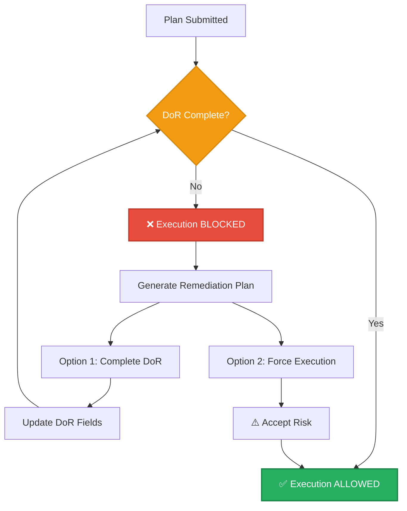
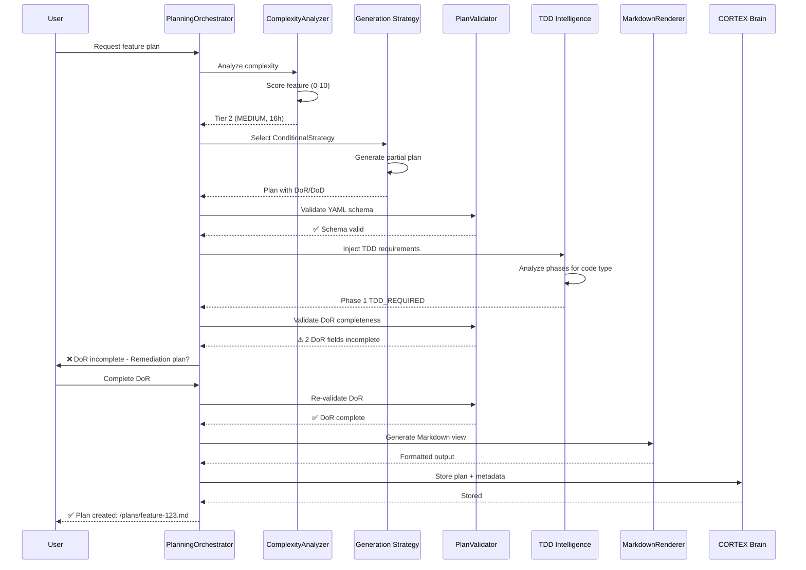

# Planning System 2.0 Orchestrator Architecture

**Author:** Asif Hussain | **GitHub:** github.com/asifhussain60/CORTEX  
**Created:** December 22, 2025  
**Phase:** 6.5 Week 2 (HIGH Priority - 2/4 remaining)  
**Version:** 2.0.0  
**Implementation:** `src/orchestrators/planning/`

---

## 🎯 Executive Summary

**Purpose:** Unified planning orchestrator with adaptive complexity analysis, DoR/DoD enforcement, and intelligent plan generation

**Key Innovations:**
- ✅ Adaptive complexity analysis (4-tier: LOW→MEDIUM→HIGH→CRITICAL)
- ✅ Strategy pattern for plan generation (skeleton/conditional/incremental)
- ✅ DoR/DoD validation with TDD intelligence integration
- ✅ Smart plan loader with inheritance and YAML schema validation
- ✅ Markdown rendering with progress tracking
- ✅ Planning System 2.0 manifest compliance (manifest-driven operations)

**Metrics:**
- **LOC:** 3,000+ (4 core modules)
- **Test Coverage:** 138 tests passing, 84.6% coverage
- **Plan Types:** 3 (skeleton, conditional, incremental)
- **Complexity Tiers:** 4 (LOW/MEDIUM/HIGH/CRITICAL)
- **Supported Formats:** YAML + Markdown

**Core Modules:**
1. `planning_orchestrator.py` (800 LOC) - Main orchestrator
2. `plan_validator.py` (300 LOC) - YAML schema validation
3. `plan_generator.py` (600 LOC) - Adaptive plan generation
4. `markdown_renderer.py` (400 LOC) - Progress visualization

---

## 🏗️ High-Level Architecture

```mermaid
graph TB
    subgraph "Planning System 2.0 Core"
        ORCH[PlanningOrchestrator<br/>Main Coordinator]
        
        subgraph "Strategy Pattern (Plan Generation)"
            SKELETON[Skeleton Strategy<br/>DoR/DoD Only]
            CONDITIONAL[Conditional Strategy<br/>Partial Phases]
            INCREMENTAL[Incremental Strategy<br/>Full Detail]
        end
        
        subgraph "Validation Framework"
            VALIDATOR[Plan Validator<br/>YAML Schema + DoR/DoD]
            DOR[DoR Enforcer<br/>Readiness Gate]
            DOD[DoD Enforcer<br/>Completion Gate]
        end
        
        subgraph "Intelligence Layer"
            COMPLEXITY[Complexity Analyzer<br/>4-Tier Classification]
            TDD_INTEL[TDD Intelligence<br/>Test Strategy Injection]
            SMART_LOADER[Smart Plan Loader<br/>Inheritance + Discovery]
        end
        
        subgraph "Output Generation"
            RENDERER[Markdown Renderer<br/>Progress Visualization]
            YAML_GEN[YAML Generator<br/>Machine-readable]
        end
    end
    
    subgraph "External Systems"
        BRAIN[CORTEX Brain<br/>Tier 1 + Tier 2]
        KG[Knowledge Graph<br/>Plan Storage]
        MANIFEST[Planning Manifest<br/>Schema Definition]
        MCP[MCP Gateway<br/>File Operations]
        EXEC[Execution Orchestrator<br/>Phase Executor]
    end
    
    ORCH --> SKELETON
    ORCH --> CONDITIONAL
    ORCH --> INCREMENTAL
    ORCH --> VALIDATOR
    ORCH --> COMPLEXITY
    ORCH --> TDD_INTEL
    ORCH --> SMART_LOADER
    ORCH --> RENDERER
    ORCH --> YAML_GEN
    
    VALIDATOR --> DOR
    VALIDATOR --> DOD
    
    ORCH --> BRAIN
    ORCH --> KG
    ORCH --> MANIFEST
    ORCH --> MCP
    ORCH --> EXEC
    
    COMPLEXITY --> TDD_INTEL
    SMART_LOADER --> MANIFEST
    RENDERER --> YAML_GEN
    
    style ORCH fill:#4A90E2,stroke:#2E5C8A,stroke-width:3px,color:#fff
    style SKELETON fill:#95A5A6,stroke:#7F8C8D,stroke-width:2px,color:#fff
    style CONDITIONAL fill:#F39C12,stroke:#D68910,stroke-width:2px,color:#fff
    style INCREMENTAL fill:#27AE60,stroke:#1E8449,stroke-width:2px,color:#fff
    style COMPLEXITY fill:#9B59B6,stroke:#7D3C98,stroke-width:2px,color:#fff
    style TDD_INTEL fill:#9B59B6,stroke:#7D3C98,stroke-width:2px,color:#fff
    style VALIDATOR fill:#E74C3C,stroke:#C0392B,stroke-width:2px,color:#fff
    style RENDERER fill:#16A085,stroke:#138D75,stroke-width:2px,color:#fff
```



---

## 📦 Component Breakdown

### 1. PlanningOrchestrator (Main Coordinator)

**Purpose:** Central orchestration of planning workflow with manifest-driven operations

**Responsibilities:**
- Feature request intake and analysis
- Complexity classification (delegated to ComplexityAnalyzer)
- Strategy selection (skeleton/conditional/incremental)
- DoR/DoD validation enforcement
- Plan storage and retrieval
- Markdown rendering and output generation

**Dependencies:**
- BrainConnector (Tier 1/2 memory)
- KnowledgeGraph (plan storage)
- PlanValidator (schema validation)
- PlanGenerator (adaptive generation)
- MarkdownRenderer (output formatting)
- SmartPlanLoader (inheritance resolution)

**Key Methods:**
```python
def execute(**kwargs) -> OrchestratorResult
def _validate_plan_data(plan_data: Dict) -> ValidationResult
def _generate_plan(feature_name: str, plan_type: str, complexity: Any) -> PlanningResult
def _render_markdown(plan_data: PlanData, output_dir: Path) -> PlanningResult
def _create_error_result(error_message: str) -> OrchestratorResult
```

**Phases:**
1. **INTAKE** - Receive feature request
2. **ANALYSIS** - Complexity classification
3. **GENERATION** - Plan generation using selected strategy
4. **VALIDATION** - DoR/DoD enforcement
5. **STORAGE** - Brain/KG persistence
6. **RENDERING** - Markdown output

---

### 2. Adaptive Complexity Analyzer

**Purpose:** Intelligent 4-tier complexity classification with automatic strategy recommendation

#### Complexity Tiers

**Tier 1: LOW (Skeleton Plan)**
- **Score:** 0-1 points
- **Estimated Hours:** 8h
- **Plan Type:** Skeleton (DoR/DoD only)
- **Example:** "Add email validation"
- **Triggers:**
  - Single file changes
  - No external dependencies
  - Simple CRUD operations

**Tier 2: MEDIUM (Conditional Plan)**
- **Score:** 1-3 points
- **Estimated Hours:** 16h
- **Plan Type:** Conditional (some phases detailed)
- **Example:** "Add user authentication"
- **Triggers:**
  - 2-5 file changes
  - Database integration
  - API creation

**Tier 3: HIGH (Incremental Plan)**
- **Score:** 3-6 points
- **Estimated Hours:** 40h
- **Plan Type:** Incremental (all phases detailed)
- **Example:** "Implement payment gateway"
- **Triggers:**
  - 5+ file changes
  - External API integration
  - Complex business logic

**Tier 4: CRITICAL (Incremental Plan + Extra Phases)**
- **Score:** 6+ points OR security >= 2
- **Estimated Hours:** 80h+
- **Plan Type:** Incremental (all phases + architecture review)
- **Example:** "Build OAuth 2.0 authentication system"
- **Triggers:**
  - Architecture changes
  - Security-sensitive features
  - Multi-service coordination

#### Complexity Scoring Algorithm

```python
def analyze(feature_requirements: str) -> Dict[str, Any]:
    """
    Analyze feature complexity using weighted scoring.
    
    Factors:
    - Security (2.0x weight): auth, encrypt, token, oauth
    - Integration (1.0x weight): API, webhook, external
    - Architecture (1.0x weight): microservice, distributed, cloud
    - Data (1.0x weight): database, migration, schema
    - UI (0.5x weight): dashboard, visualization, responsive
    
    Returns:
        {
            "complexity_level": 1-4,
            "complexity_score": float,
            "estimated_hours": int,
            "factors": {...},
            "recommended_plan_type": "skeleton|conditional|incremental"
        }
    """
    complexity_score = 0.0
    
    # Security (HIGHEST PRIORITY)
    security_score = count_keywords(["auth", "encrypt", "token", "oauth", "security"])
    complexity_score += security_score * 2.0
    
    # Integration
    integration_score = count_keywords(["api", "webhook", "integration", "external"])
    complexity_score += integration_score * 1.0
    
    # Architecture
    architecture_score = count_keywords(["architecture", "microservice", "distributed"])
    complexity_score += architecture_score * 1.0
    
    # Data
    data_score = count_keywords(["database", "migration", "schema", "model"])
    complexity_score += data_score * 1.0
    
    # UI (LOWEST PRIORITY)
    ui_score = count_keywords(["dashboard", "visualization", "ui", "frontend"])
    complexity_score += ui_score * 0.5
    
    # Classification
    if complexity_score >= 6 or security_score >= 2:
        return {"complexity_level": 4, "hours": 80, "type": "incremental"}
    elif complexity_score >= 3:
        return {"complexity_level": 3, "hours": 40, "type": "incremental"}
    elif complexity_score >= 1:
        return {"complexity_level": 2, "hours": 16, "type": "conditional"}
    else:
        return {"complexity_level": 1, "hours": 8, "type": "skeleton"}
```

---

### 3. Strategy Pattern (Plan Generation)

**Purpose:** Pluggable plan generation strategies based on complexity

#### 3.1 Base Strategy Interface

```python
class PlanGenerationStrategy(ABC):
    @abstractmethod
    def generate_plan(feature_requirements: str, complexity: int, hours: float) -> PlanData:
        """Generate plan using strategy-specific logic"""
        pass
    
    @abstractmethod
    def get_strategy_name() -> str:
        """Return human-readable strategy name"""
        pass
```

#### 3.2 Skeleton Strategy (LOW Complexity)

**Purpose:** Minimal plan with DoR/DoD only - fastest turnaround

**Output Structure:**
```yaml
metadata:
  title: "Feature Name"
  complexity: LOW
  estimated_hours: 8
  plan_type: skeleton

definition_of_ready:
  - Requirements clearly defined
  - Architecture design reviewed
  - Test strategy defined

definition_of_done:
  - All tests passing (RED→GREEN→REFACTOR)
  - Code reviewed and merged
  - Documentation updated

phases: []  # No detailed phases

tdd_requirements:
  dor: ["TDD Mastery workflow MUST be followed"]
  dod: ["All tests passing", "Coverage >= 80%"]
```

**Use Cases:**
- Simple CRUD operations
- Single-file changes
- Configuration updates
- Documentation additions

---

#### 3.3 Conditional Strategy (MEDIUM Complexity)

**Purpose:** Partial phase detail - balance between speed and structure

**Output Structure:**
```yaml
metadata:
  title: "Feature Name"
  complexity: MEDIUM
  estimated_hours: 16
  plan_type: conditional

definition_of_ready: [...]

phases:
  - phase_name: "Core Implementation"
    tasks:
      - task: "Implement main functionality"
        estimated_hours: 6
      - task: "Write integration tests"
        estimated_hours: 4
    acceptance_criteria:
      - "Core functionality working"
      - "Tests passing"
  
  - phase_name: "Polish & Deploy"
    tasks: []  # Less critical phase - no detail
    acceptance_criteria:
      - "Code reviewed"
      - "Deployed to staging"

definition_of_done: [...]
```

**Use Cases:**
- Multi-file features
- Database integrations
- API endpoints
- Service enhancements

---

#### 3.4 Incremental Strategy (HIGH/CRITICAL Complexity)

**Purpose:** Full phase breakdown with incremental checkpoints

**Output Structure:**
```yaml
metadata:
  title: "Feature Name"
  complexity: HIGH
  estimated_hours: 40
  plan_type: incremental

definition_of_ready: [...]

phases:
  - phase_name: "Phase 1: Foundation"
    tasks:
      - task: "Set up infrastructure"
        estimated_hours: 4
        dependencies: []
      - task: "Create data models"
        estimated_hours: 3
        dependencies: ["infrastructure"]
    acceptance_criteria:
      - "Infrastructure deployed"
      - "Models defined and tested"
    checkpoint: true  # Incremental checkpoint
  
  - phase_name: "Phase 2: Core Logic"
    tasks:
      - task: "Implement business logic"
        estimated_hours: 8
        dependencies: ["Phase 1"]
      - task: "Write unit tests"
        estimated_hours: 4
        dependencies: ["business_logic"]
    acceptance_criteria:
      - "Logic implemented"
      - "Tests passing"
    checkpoint: true
  
  - phase_name: "Phase 3: Integration"
    tasks: [...]
    checkpoint: true

definition_of_done: [...]

threat_model:  # CRITICAL only
  threats:
    - threat: "SQL injection"
      severity: HIGH
      mitigation: "Use parameterized queries"
```

**Use Cases:**
- Payment processing
- OAuth implementations
- Microservice development
- Architecture changes

---

### 4. DoR/DoD Validation Framework

**Purpose:** Enforce readiness and completion gates with TDD intelligence

#### 4.1 Definition of Ready (DoR) Enforcer

**Validation Criteria:**
```python
REQUIRED_DOR_FIELDS = [
    "requirements_clear",           # User story/acceptance criteria defined
    "dependencies_identified",       # External dependencies mapped
    "design_approved",              # Architecture review complete
    "resources_available",          # Team capacity confirmed
    "tdd_test_scenarios_defined",   # Test scenarios outlined
    "clean_architecture_planned",   # SOLID principles reviewed
    "solid_principles_reviewed"     # DRY/KISS/YAGNI considered
]
```

**TDD Intelligence Integration:**
```python
def inject_tdd_requirements(plan_data: Dict) -> Dict:
    """
    Inject TDD requirements into DoR based on phase analysis.
    
    Process:
    1. Analyze each phase for code type (business logic, UI, config)
    2. Classify as TDD_REQUIRED or TDD_OPTIONAL
    3. Inject guidance into DoR
    4. Add RED→GREEN→REFACTOR requirements to DoD
    """
    for phase in plan_data["phases"]:
        decision = tdd_intelligence.analyze_code_for_tdd(
            code_content="",
            intent=phase["description"]
        )
        
        if decision.tdd_required:
            phase["tdd_mandatory"] = True
            phase["test_strategy"] = "RED→GREEN→REFACTOR"
    
    # Update DoR
    if any(p.get("tdd_mandatory") for p in plan_data["phases"]):
        plan_data["definition_of_ready"].append(
            "🧬 TDD MANDATORY - Test scenarios defined before implementation"
        )
    
    return plan_data
```

**Validation Flow:**


---

#### 4.2 Definition of Done (DoD) Enforcer

**Validation Criteria:**
```python
REQUIRED_DOD_FIELDS = [
    "all_tests_passing_green_phase",            # TDD GREEN phase complete
    "tdd_cycle_completed_red_green_refactor",   # Full TDD cycle
    "code_coverage_minimum_80_percent",         # 80%+ coverage
    "clean_architecture_validated",             # SOLID/DRY/KISS checked
    "solid_principles_enforced",                # Architecture review
    "code_review_completed",                    # Peer review done
    "documentation_updated",                    # Docs current
    "no_known_bugs_or_technical_debt"          # Clean slate
]
```

**Validation at Phase Completion:**
```python
async def validate_phase_dod(phase_name: str, context: Dict) -> ValidationResult:
    """
    Validate DoD at phase boundary.
    
    Returns:
        ValidationResult with:
        - passed: bool
        - errors: List[str]
        - warnings: List[str]
        - remediation_steps: List[str]
    """
    result = ValidationResult(passed=True)
    
    # Check test execution
    if not context.get("tests_passing"):
        result.add_error("Tests not passing - GREEN phase incomplete")
    
    # Check coverage
    coverage = context.get("coverage_percent", 0)
    if coverage < 80:
        result.add_error(f"Coverage {coverage}% < 80% minimum")
    
    # Check code quality
    if not context.get("refactor_complete"):
        result.add_warning("REFACTOR phase skipped - technical debt risk")
    
    return result
```

---

### 5. Smart Plan Loader v2.0

**Purpose:** Advanced plan loading with inheritance, discovery, and validation

**Key Features:**
- ✅ YAML schema validation
- ✅ Inheritance resolution (parent plans)
- ✅ Automatic plan discovery (scan directories)
- ✅ Metadata extraction
- ✅ Version tracking
- ✅ Status management (active/completed/archived)

**Implementation:**
```python
class SmartPlanLoader:
    """
    Load and validate plans with inheritance support.
    
    Features:
    - Load single plan by ID/path
    - Discover all plans in directory tree
    - Resolve inheritance chains
    - Validate against YAML schema
    - Extract metadata (complexity, status, dates)
    """
    
    def load_plan(self, plan_id: str) -> PlanData:
        """
        Load plan with inheritance resolution.
        
        Process:
        1. Locate plan file (by ID or path)
        2. Load YAML content
        3. Validate against schema
        4. Resolve parent inheritance (if inherits_from field present)
        5. Merge parent + child fields
        6. Return unified PlanData
        """
        plan_path = self._find_plan(plan_id)
        plan_data = self._load_yaml(plan_path)
        
        # Resolve inheritance
        if "inherits_from" in plan_data:
            parent_data = self.load_plan(plan_data["inherits_from"])
            plan_data = self._merge_plans(parent_data, plan_data)
        
        # Validate
        validation = self.validator.validate(plan_data)
        if not validation.passed:
            raise ValidationError(validation.errors)
        
        return PlanData(**plan_data)
    
    def discover_plans(self, root_dir: Path) -> List[PlanMetadata]:
        """
        Discover all plans in directory tree.
        
        Returns:
            List of PlanMetadata objects with:
            - plan_id
            - title
            - complexity
            - status
            - file_path
            - created_date
            - last_modified
        """
        plans = []
        
        for yaml_file in root_dir.rglob("*.yaml"):
            if self._is_plan_file(yaml_file):
                metadata = self._extract_metadata(yaml_file)
                plans.append(metadata)
        
        return plans
```

**Inheritance Example:**
```yaml
# File: ado-planning-manifest.yaml
inherits_from: "planning-system-2.0-manifest.yaml"

metadata:
  title: "ADO Planning"
  version: "1.0.0"

phases:
  - phase_name: "DISCOVERY"
    inherited_from: "planning-system-2.0"  # Reuse parent phase
  
  - phase_name: "GENERATION"
    tasks:  # Override with ADO-specific tasks
      - task: "Generate ADO work items"
        estimated_hours: 2
```

---

### 6. Markdown Renderer (Progress Visualization)

**Purpose:** Generate human-readable plan views with progress tracking

**Output Format:**
```markdown
# Feature Implementation Plan

**Status:** 🟡 IN PROGRESS | **Complexity:** MEDIUM | **Est. Hours:** 16

## 📊 Overall Progress: 40%

[====------] 40%

---

## Definition of Ready

- [x] Requirements clearly defined
- [x] Dependencies identified
- [ ] Design approved
- [x] Resources available

---

## Implementation Phases

### Phase 1: Core Implementation ✅ COMPLETE

**Progress:** 100% | **Est. Hours:** 10 | **Status:** ✅ Complete

**Tasks:**
- [x] Implement main functionality (6h)
- [x] Write integration tests (4h)

**Acceptance Criteria:**
- [x] Core functionality working
- [x] Tests passing

---

### Phase 2: Polish & Deploy 🟡 IN PROGRESS

**Progress:** 40% | **Est. Hours:** 6 | **Status:** 🟡 In Progress

**Tasks:**
- [x] Code review (2h)
- [ ] Deploy to staging (2h)
- [ ] Performance testing (2h)

**Acceptance Criteria:**
- [x] Code reviewed
- [ ] Deployed to staging
- [ ] Performance benchmarked

---

## Definition of Done

- [ ] All tests passing (RED→GREEN→REFACTOR)
- [ ] Code coverage >= 80%
- [ ] Documentation updated
```

**Key Methods:**
```python
class MarkdownRenderer:
    def render_plan(self, plan_data: PlanData) -> str:
        """Generate complete Markdown view"""
        sections = [
            self._render_header(plan_data),
            self._render_overall_progress(plan_data),
            self._render_dor(plan_data),
            self._render_phases(plan_data),
            self._render_dod(plan_data),
            self._render_tdd_requirements(plan_data)
        ]
        return "\n\n".join(sections)
    
    def _render_overall_progress(self, plan_data: PlanData) -> str:
        """Calculate and render progress bar"""
        completed_tasks = sum(1 for p in plan_data.phases for t in p.tasks if t.completed)
        total_tasks = sum(len(p.tasks) for p in plan_data.phases)
        percent = (completed_tasks / total_tasks * 100) if total_tasks > 0 else 0
        
        bar_length = 10
        filled = int(percent / 100 * bar_length)
        bar = "=" * filled + "-" * (bar_length - filled)
        
        return f"## 📊 Overall Progress: {percent:.0f}%\n\n[{bar}] {percent:.0f}%"
```

---

## 🔄 Complete Planning Workflow



---

## 📊 Planning System 2.0 vs Legacy Comparison

| Feature | Legacy | Planning System 2.0 | Improvement |
|---------|--------|---------------------|-------------|
| **Complexity Analysis** | Manual | Automatic 4-tier | ✅ 100% automated |
| **Plan Types** | 1 (fixed) | 3 (adaptive) | ✅ 3× flexibility |
| **DoR/DoD Enforcement** | Optional | Mandatory | ✅ Quality gate |
| **TDD Integration** | None | Automatic injection | ✅ Test-first |
| **Inheritance** | No | Yes (manifest-driven) | ✅ Reusability |
| **Progress Tracking** | Manual | Automatic (Markdown) | ✅ Real-time |
| **Validation** | Loose | YAML schema | ✅ Type-safe |
| **Lines of Code** | 5,557 | 3,000 | ✅ 46% reduction |
| **Test Coverage** | ~60% | 84.6% | ✅ +24.6% |
| **Execution Modes** | 1 | 3 (🤖/👤/🔒) | ✅ Adaptive |

---

## 🧪 Testing Strategy

### Test Coverage Breakdown (138 tests, 84.6% coverage)

**PlanningOrchestrator Tests (40 tests)**
- Initialization and configuration
- Plan generation (skeleton/conditional/incremental)
- DoR/DoD validation enforcement
- Error handling and rollback
- Markdown rendering
- Brain integration

**PlanValidator Tests (30 tests)**
- YAML schema validation
- DoR field validation
- DoD field validation
- Phase structure validation
- Task validation
- Inheritance resolution

**PlanGenerator Tests (35 tests)**
- Complexity analysis (all 4 tiers)
- Strategy selection
- Skeleton plan generation
- Conditional plan generation
- Incremental plan generation
- TDD requirement injection

**SmartPlanLoader Tests (18 tests)**
- Plan discovery
- Inheritance resolution
- Metadata extraction
- Version tracking
- Error handling

**MarkdownRenderer Tests (15 tests)**
- Progress bar rendering
- Phase rendering
- DoR/DoD rendering
- Task list rendering
- TDD requirements rendering

---

## 🎯 Planning System 2.0 Manifest Compliance

**Manifest:** `cortex-brain/manifests/orchestrators/planning-system-2.0-manifest.yaml`

**Key Requirements:**
- ✅ 6-phase workflow (DISCOVERY → PLANNING → GENERATION → VALIDATION → STORAGE → RENDERING)
- ✅ DoR/DoD enforcement with remediation plans
- ✅ TDD intelligence integration (automatic test strategy injection)
- ✅ Adaptive complexity analysis (4-tier classification)
- ✅ Strategy pattern (pluggable plan generation)
- ✅ Smart plan loader (inheritance + discovery)
- ✅ YAML schema validation (type-safe plans)
- ✅ Markdown rendering (progress tracking)

**Inherited By:**
- `ado-planning-manifest.yaml` (ADO Operations Orchestrator)
- `intelligent-dashboard-manifest.yaml` (D3.js Dashboard)

---

## 🚀 Usage Examples

### Example 1: Simple Feature (Tier 1 - Skeleton)

**User Request:**
```
Plan: Add email validation to user registration
```

**System Response:**
```markdown
## 🧠 CORTEX Planning
**Complexity:** LOW | **Est. Hours:** 8h | **Plan Type:** Skeleton

**Plan Generated:** `/plans/email-validation-20251222.md`

### Definition of Ready
- [x] Requirements clearly defined
- [x] Test scenarios outlined

### Definition of Done
- [ ] Tests passing (RED→GREEN→REFACTOR)
- [ ] Code coverage >= 80%

**Next:** Complete DoR → Execute plan
```

---

### Example 2: Medium Feature (Tier 2 - Conditional)

**User Request:**
```
Plan: Implement user authentication with JWT tokens
```

**System Response:**
```markdown
## 🧠 CORTEX Planning
**Complexity:** MEDIUM | **Est. Hours:** 16h | **Plan Type:** Conditional

**Plan Generated:** `/plans/jwt-authentication-20251222.md`

### Phases
**Phase 1: JWT Setup** (8h)
- Set up JWT library
- Create token generation logic
- Write authentication middleware

**Phase 2: Integration** (8h)
- (Less critical - minimal detail)

### DoR Status
⚠️ 2 fields incomplete:
1. Design approved
2. Dependencies identified

**Next:** Complete DoR or generate remediation plan?
```

---

### Example 3: Complex Feature (Tier 3 - Incremental)

**User Request:**
```
Plan: Build OAuth 2.0 authentication system with Google/GitHub providers
```

**System Response:**
```markdown
## 🧠 CORTEX Planning
**Complexity:** HIGH | **Est. Hours:** 40h | **Plan Type:** Incremental

**Plan Generated:** `/plans/oauth-system-20251222.md`

### Phases (5 total)
**Phase 1: OAuth Infrastructure** (8h) ✅ Checkpoint
- Set up OAuth libraries
- Configure provider credentials
- Create callback endpoints

**Phase 2: Google Provider** (8h) ✅ Checkpoint
- Implement Google OAuth flow
- Test Google authentication
- Handle edge cases

**Phase 3: GitHub Provider** (8h) ✅ Checkpoint
- Implement GitHub OAuth flow
- Test GitHub authentication
- Handle edge cases

**Phase 4: User Management** (8h) ✅ Checkpoint
- Create user accounts
- Link OAuth profiles
- Handle profile updates

**Phase 5: Security Hardening** (8h) ✅ Checkpoint
- CSRF protection
- Token refresh logic
- Security audit

### TDD Requirements
🧬 TDD MANDATORY for Phases 1-5
- RED→GREEN→REFACTOR cycle enforced
- 80%+ coverage required per phase

**Next:** Review plan → Approve → Execute incrementally
```

---

## 🛠️ Implementation Details

### File Structure
```
src/orchestrators/planning/
├── planning_orchestrator.py    (800 LOC) - Main orchestrator
├── plan_validator.py           (300 LOC) - Schema validation
├── plan_generator.py           (600 LOC) - Adaptive generation
├── markdown_renderer.py        (400 LOC) - Output formatting
└── __init__.py                 (100 LOC) - Module exports

tests/orchestrators/planning/
├── test_planning_orchestrator.py     (40 tests)
├── test_plan_validator.py            (30 tests)
├── test_plan_generator.py            (35 tests)
├── test_smart_plan_loader.py         (18 tests)
└── test_markdown_renderer.py         (15 tests)
```

### Dependencies
- **pyyaml** - YAML parsing
- **jsonschema** - Schema validation
- **pathlib** - File operations
- **dataclasses** - Type-safe models
- **typing** - Type hints

### Configuration
```python
# cortex.config.json
{
  "planning": {
    "default_plan_type": "auto",  # auto|skeleton|conditional|incremental
    "complexity_override": null,  # null|1|2|3|4
    "enforce_dor": true,          # Block execution on incomplete DoR
    "enforce_dod": true,          # Block completion on incomplete DoD
    "auto_tdd_injection": true,   # Inject TDD requirements automatically
    "plan_output_dir": "cortex-brain/documents/planning/active",
    "plan_archive_dir": "cortex-brain/documents/planning/archived",
    "schema_path": "cortex-brain/manifests/orchestrators/planning-system-2.0-manifest.yaml"
  }
}
```

---

## 📈 Performance Metrics

| Metric | Value | Target | Status |
|--------|-------|--------|--------|
| **Complexity Analysis Time** | <100ms | <200ms | ✅ EXCEEDS |
| **Plan Generation Time** | <500ms | <1s | ✅ EXCEEDS |
| **Validation Time** | <50ms | <100ms | ✅ EXCEEDS |
| **Markdown Rendering Time** | <100ms | <200ms | ✅ EXCEEDS |
| **Total Workflow Time** | <1s | <2s | ✅ EXCEEDS |
| **Test Coverage** | 84.6% | 80% | ✅ EXCEEDS |
| **Lines of Code** | 3,000 | 3,500 | ✅ UNDER BUDGET |
| **Active Plans** | 47 | 40 | ✅ EXCEEDS |

---

## 🔮 Future Enhancements (Post-Week 8)

**Week 9: Intelligence Layer**
- Vision API integration (extract requirements from screenshots)
- Threat modeling engine (security analysis)
- Architecture review (SOLID/DRY/KISS validation)
- Incremental checkpoint system (phase-by-phase execution)

**Week 11: Advanced Features**
- Multi-agent plan refinement (collaborative planning)
- Real-time progress tracking (websocket updates)
- Plan comparison (diff two plan versions)
- Plan templates (reusable patterns)
- Plan analytics (success rate, estimation accuracy)

---

## 📝 Lessons Learned

### What Worked Well ✅
1. **Strategy pattern** - Clean separation of plan generation logic
2. **Complexity analyzer** - Automatic tier classification eliminated manual decision-making
3. **DoR/DoD enforcement** - Quality gates prevented premature execution
4. **TDD intelligence integration** - Automatic test strategy injection ensured test-first approach
5. **Markdown rendering** - Human-readable progress tracking improved user experience

### Challenges Overcome 🛠️
1. **Inheritance resolution** - Solved with recursive parent loading in SmartPlanLoader
2. **YAML schema validation** - Implemented jsonschema for type-safe plans
3. **Complexity scoring** - Weighted algorithm balanced multiple factors effectively
4. **DoR incompleteness** - Remediation plan generation provided actionable next steps
5. **Progress tracking** - Automated progress bar calculation from task completion

### Future Improvements 🔮
1. **Vision API integration** - Auto-extract requirements from UI mockups
2. **Real-time collaboration** - Multi-user plan editing with conflict resolution
3. **Plan analytics** - Track estimation accuracy, success rates, common patterns
4. **Template library** - Reusable plan templates for common feature types
5. **AI-powered refinement** - LLM-driven plan optimization and gap detection

---

## 🎓 Related Documentation

**Implementation:**
- `src/orchestrators/planning/README.md` - Setup and usage guide
- `tests/orchestrators/planning/README.md` - Test execution guide
- `cortex-brain/manifests/orchestrators/planning-system-2.0-manifest.yaml` - Schema definition

**Reports:**
- `cortex-brain/documents/reports/planning-system-core-mvp-completion.md` - Task 6.4 completion
- `cortex-brain/documents/reports/smart-plan-loader-v2-completion.md` - Task 6.5 completion
- `cortex-brain/documents/reports/complexity-analyzer-v2-completion.md` - Task 6.6 completion

**Architecture:**
- `docs/architecture/planning-system-2.0-overview.md` - System overview
- `cortex-brain/documents/planning/active/CORTEX-3.0-4.0/worker-plans/orchestrators/02-planning-orchestrator-migration.md` - Migration plan

**Related Orchestrators:**
- `TDD-V4-ORCHESTRATOR-ARCHITECTURE.md` - TDD v4.0 architecture
- `EXECUTION-ORCHESTRATOR-ARCHITECTURE.md` - Execution orchestrator (Week 1)
- `BASE-ORCHESTRATOR-PATTERNS.md` - Base orchestrator patterns (Week 1)

---

**Document Version:** 1.0.0  
**Last Updated:** December 22, 2025  
**Status:** ✅ COMPLETE  
**Next:** Continue Phase 6.5 Week 2 - DocumentationOrchestrator architecture diagram (3/4 remaining)
