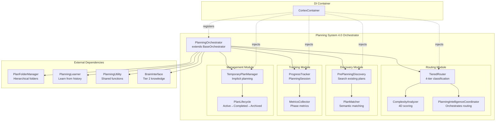
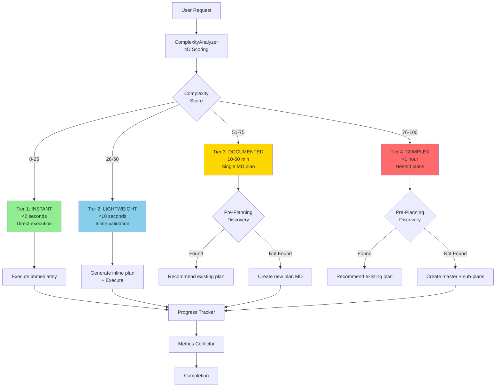
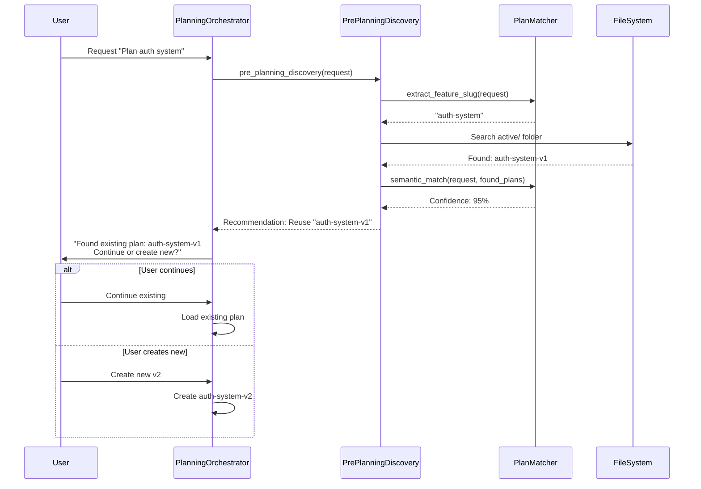
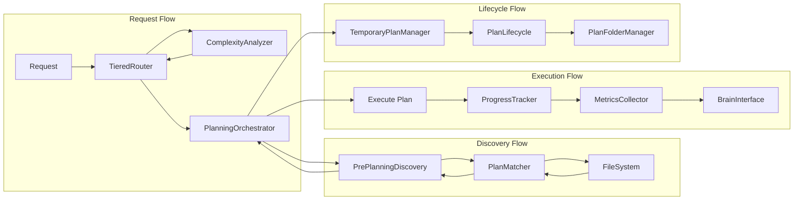
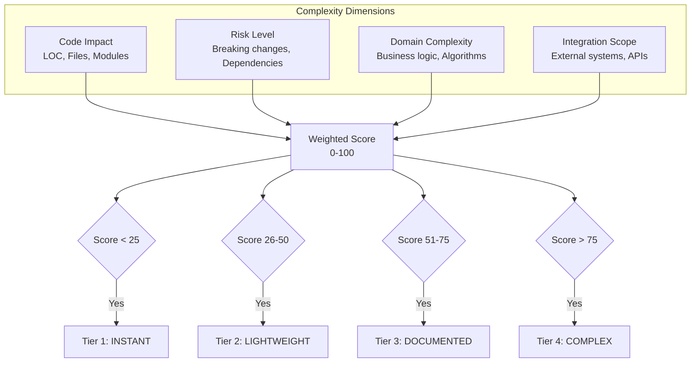
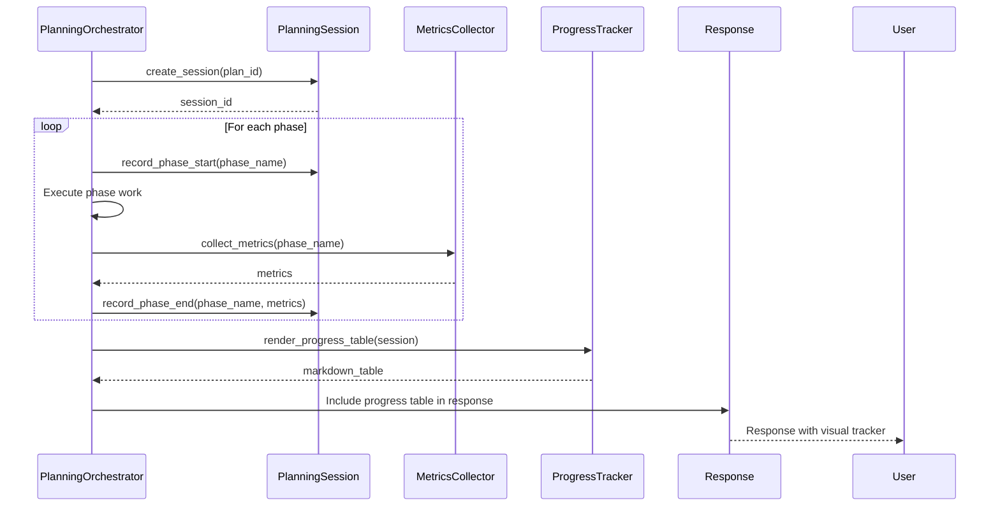

# Planning System 4.0 - Architecture Diagram

**Version:** 1.0  
**Created:** December 19, 2025  
**Author:** Asif Hussain  

---

## Component Architecture



---

## Tiered Routing Decision Flow



---

## Pre-Planning Discovery Workflow



---

## Module Interactions



---

## Complexity Scoring (4 Dimensions)



---

## Progress Tracking Integration



---

## Directory Structure

```
src/orchestrators/planning_system/
├── __init__.py
├── planning_orchestrator.py        # Main orchestrator
├── routing/
│   ├── __init__.py
│   ├── tiered_router.py           # 4-tier classification
│   └── complexity_analyzer.py     # 4D scoring
├── discovery/
│   ├── __init__.py
│   ├── pre_planning_discovery.py  # Search existing plans
│   └── plan_matcher.py            # Semantic matching
├── tracking/
│   ├── __init__.py
│   ├── progress_tracker.py        # PlanningSession
│   └── metrics_collector.py       # Phase metrics
├── management/
│   ├── __init__.py
│   ├── temporary_plan_manager.py  # Implicit planning
│   └── plan_lifecycle.py          # Lifecycle management
├── tests/
│   ├── __init__.py
│   ├── test_planning_orchestrator.py
│   ├── test_tiered_routing.py
│   ├── test_pre_planning_discovery.py
│   ├── test_progress_tracking.py
│   └── test_temporary_plans.py
└── README.md
```

---

## Key Design Decisions

**1. Reuse Over Rewrite**
- TieredRouter, ComplexityAnalyzer already exist → COPY to v4.0 structure
- TemporaryPlanManager, PlanFolderManager → USE as dependencies
- PlanningLearner → Tier 2 integration, no migration needed

**2. Extract Discovery Logic**
- Pre-planning discovery was embedded in archived PlanningOrchestrator
- Extract to standalone `pre_planning_discovery.py` module
- Add `plan_matcher.py` for semantic matching

**3. Co-Located Tests**
- All tests in `src/orchestrators/planning_system/tests/`
- No CORTEX tests in user repos
- Target: 85%+ coverage (50+ tests)

**4. Module Boundaries**
- **routing/** - Complexity analysis + tier classification
- **discovery/** - Find existing plans before creating new
- **tracking/** - Real-time progress + metrics
- **management/** - Temporary plans + lifecycle

**5. BaseOrchestrator Integration**
- Extends `BaseOrchestrator` from Phase 1
- Uses DI container for wiring
- Integrates response templates v4.0
- Standard logging + error handling

---

## Integration Points

**With Other Orchestrators:**
- **TDD Orchestrator** - Planning includes TDD phases automatically
- **Execution Orchestrator** - Executes Tier 3-4 plans
- **Documentation Orchestrator** - Documents planning workflows

**With Brain Tiers:**
- **Tier 1** - Conversation history for context
- **Tier 2** - PlanningLearner for historical insights
- **Tier 3** - Project metrics, codebase context

**With External Systems:**
- **FileSystem** - Plan folder structure (hierarchical)
- **Git** - Version control for plans
- **LLM** - Tiered routing classification (fallback)

---

**Version Control:**
- This diagram will be auto-updated by DocumentationOrchestrator
- Manual updates should preserve Mermaid syntax
- Regenerate diagrams after architecture changes
