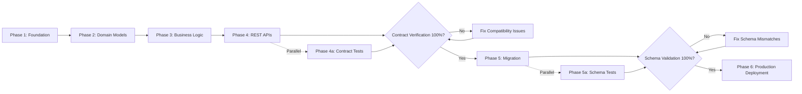

# RA Migration Plan v2.1 - Enhancement Summary

**Date:** December 12, 2025  
**Updated By:** Asif Hussain  
**Plan Version:** 1.0 → 2.0 → 2.1  

---

## Changes Overview

The migration plan has been significantly enhanced based on client requirements for mock infrastructure, automated testing, UI test client, mandatory contract verification, and **data layer transition validation**.

---

## 🎯 Major Additions (v2.1)

### **NEW: Phase 5a - Data Layer Transition & Schema Validation**

**What:** Dedicated validation phase ensuring mock data contracts exactly match production database schema.

**Problem Solved:** Prevents runtime UI breaks when swapping from mock data layer to live database in production.

**Validations:**
1. ✅ **Schema Contract Validation** - Mock entity properties match database columns (name, type, nullability)
2. ✅ **Relationship Integrity** - Mock foreign keys reference valid database records
3. ✅ **Type Safety** - Decimal precision, string lengths, date formats match DB constraints
4. ✅ **Nullability Compliance** - Required fields never null, optional fields can be null
5. ✅ **Integration Test Parity** - All tests pass identically with Mock and EF Core
6. ✅ **UI Component Contract Testing** - JSON response shapes identical from both data layers

**Testing Framework:**
```csharp
[Fact]
public void MockFundingInvoice_MustMatchDatabaseSchema()
{
    var mockInvoice = _mockRepository.GetByIdAsync("MOCK-123").Result;
    var dbEntityType = _dbContext.Model.FindEntityType(typeof(FundingInvoice));
    
    var validator = new SchemaContractValidator();
    var result = validator.ValidateContract(mockInvoice, dbEntityType);
    
    result.IsValid.Should().BeTrue("Mock data must match database schema exactly");
    result.MissingProperties.Should().BeEmpty();
    result.TypeMismatches.Should().BeEmpty();
    result.NullabilityMismatches.Should().BeEmpty();
}
```

**Deployment Strategy:**
- Feature flag-based gradual rollout: 0% → 10% → 25% → 50% → 100%
- Automated monitoring for error rates, latency spikes
- Instant rollback capability if validation fails

**Acceptance Criteria:**
- [ ] 100% schema validation passing for all entities
- [ ] All integration tests pass with both Mock and EF Core
- [ ] UI components receive identical JSON from both data layers
- [ ] Foreign key references valid in production database
- [ ] Type constraints match (decimals, strings, dates)
- [ ] Nullability rules enforced consistently

**Risk Mitigation:**
| Risk | Mitigation |
|------|------------|
| Schema drift during development | Automated nightly schema validation tests |
| UI breaks due to missing properties | 100% contract validation before deployment |
| Performance degradation | Baseline performance tests, canary deployment |
| Database connection failures | Circuit breaker, fallback to mock (read-only) |

**Failure Protocol:**
1. HALT deployment if schema validation < 100%
2. Root cause analysis of mismatches
3. Fix mock data to match DB schema
4. Re-validate until 100% pass
5. No production deployment until validated

**Sample Schema Validation Tests:**

```csharp
// 1. Schema Contract Validation - Property Matching
[Theory]
[InlineData(typeof(FundingInvoice))]
[InlineData(typeof(FundingBatch))]
[InlineData(typeof(Subaccount))]
public void MockEntity_MustMatchDatabaseSchema(Type entityType)
{
    // Arrange
    var dbEntityType = _dbContext.Model.FindEntityType(entityType);
    var mockInstance = _mockDataSeeder.GetSampleEntity(entityType);
    var validator = new SchemaContractValidator();

    // Act
    var result = validator.ValidateContract(mockInstance, dbEntityType);

    // Assert
    result.IsValid.Should().BeTrue($"{entityType.Name} mock must match DB schema");
    result.MissingProperties.Should().BeEmpty("All DB columns must exist in mock");
    result.ExtraProperties.Should().BeEmpty("No undocumented properties allowed");
    result.TypeMismatches.Should().BeEmpty("Property types must match exactly");
}

// 2. Type Safety Validation - Precision & Constraints
[Fact]
public void MockFundingInvoice_DecimalPrecision_MustMatchDatabase()
{
    // Arrange
    var mockInvoice = _mockRepository.GetByIdAsync("MOCK-123").Result;
    var dbProperty = _dbContext.Model
        .FindEntityType(typeof(FundingInvoice))
        .FindProperty(nameof(FundingInvoice.Amount));

    // Act
    var precision = dbProperty.GetPrecision();
    var scale = dbProperty.GetScale();
    var mockAmount = mockInvoice.Amount;

    // Assert - Verify decimal fits DB constraints
    var maxValue = (decimal)Math.Pow(10, precision - scale) - (decimal)Math.Pow(10, -scale);
    mockAmount.Should().BeLessThan(maxValue, $"Amount must fit DECIMAL({precision},{scale})");
    
    var decimalPlaces = BitConverter.GetBytes(decimal.GetBits(mockAmount)[3])[2];
    decimalPlaces.Should().BeLessOrEqualTo((byte)scale, $"Decimal scale must be ≤ {scale}");
}

// 3. Nullability Compliance - Required vs Optional
[Fact]
public void MockFundingInvoice_RequiredFields_MustNeverBeNull()
{
    // Arrange
    var dbEntityType = _dbContext.Model.FindEntityType(typeof(FundingInvoice));
    var requiredProperties = dbEntityType.GetProperties()
        .Where(p => !p.IsNullable)
        .Select(p => p.Name)
        .ToList();

    // Act
    var mockInvoices = _mockRepository.GetAllAsync().Result;

    // Assert
    foreach (var invoice in mockInvoices)
    {
        foreach (var propName in requiredProperties)
        {
            var value = typeof(FundingInvoice).GetProperty(propName)?.GetValue(invoice);
            value.Should().NotBeNull($"Required field {propName} cannot be null");
        }
    }
}

// 4. Relationship Integrity - Foreign Keys
[Fact]
public async Task MockFundingInvoice_ForeignKeys_MustReferenceValidRecords()
{
    // Arrange
    var mockInvoice = await _mockRepository.GetByIdAsync("MOCK-123");
    
    // Act - Verify FK references exist in production DB
    var batchExists = await _dbContext.FundingBatches
        .AnyAsync(b => b.BatchId == mockInvoice.BatchId);
    var subaccountExists = await _dbContext.Subaccounts
        .AnyAsync(s => s.SubaccountId == mockInvoice.SubaccountId);

    // Assert
    batchExists.Should().BeTrue("BatchId must reference valid FundingBatch");
    subaccountExists.Should().BeTrue("SubaccountId must reference valid Subaccount");
}

// 5. Integration Test Parity - Identical Behavior
[Theory]
[InlineData("MOCK-123")]
[InlineData("MOCK-456")]
public async Task GetInvoiceById_MockVsEFCore_MustReturnIdenticalData(string invoiceId)
{
    // Arrange
    var mockRepo = new MockFundingInvoiceRepository();
    var efCoreRepo = new EFCoreFundingInvoiceRepository(_dbContext);

    // Act
    var mockResult = await mockRepo.GetByIdAsync(invoiceId);
    var efResult = await efCoreRepo.GetByIdAsync(invoiceId);

    // Assert
    mockResult.Should().BeEquivalentTo(efResult, options => options
        .Excluding(x => x.CreatedDate) // Exclude auto-generated timestamps
        .ComparingByMembers<FundingInvoice>());
}

// 6. UI Component Contract Testing - JSON Shape Validation
[Fact]
public async Task FundingInvoiceAPI_MockVsEFCore_MustReturnIdenticalJSON()
{
    // Arrange
    var mockClient = _factory.WithWebHostBuilder(builder => 
        builder.ConfigureServices(s => s.AddSingleton<IFundingInvoiceRepository, MockFundingInvoiceRepository>()))
        .CreateClient();
    
    var efCoreClient = _factory.WithWebHostBuilder(builder => 
        builder.ConfigureServices(s => s.AddSingleton<IFundingInvoiceRepository, EFCoreFundingInvoiceRepository>()))
        .CreateClient();

    // Act
    var mockResponse = await mockClient.GetAsync("/api/v1/funding-invoices/MOCK-123");
    var efResponse = await efCoreClient.GetAsync("/api/v1/funding-invoices/MOCK-123");

    var mockJson = await mockResponse.Content.ReadAsStringAsync();
    var efJson = await efResponse.Content.ReadAsStringAsync();

    // Assert - Deep JSON comparison
    JToken.DeepEquals(JToken.Parse(mockJson), JToken.Parse(efJson))
        .Should().BeTrue("UI must receive identical JSON from both data layers");
}
```

**Data Layer Transition Flow:**

```
┌─────────────────────────────────────────────────────────────────┐
│                    DATA LAYER TRANSITION FLOW                    │
└─────────────────────────────────────────────────────────────────┘

Phase 1-4: Development with Mock Layer
┌──────────────────────────────────────────────────────────────┐
│  Controllers → Services → IRepository Interface              │
│                                    ↓                          │
│                          MockFundingInvoiceRepository         │
│                          (In-Memory, Fast Tests)              │
└──────────────────────────────────────────────────────────────┘

Phase 4a: Contract Verification (MANDATORY GATE)
┌──────────────────────────────────────────────────────────────┐
│  WCF Service ─┐                                              │
│               ├─→ Contract Comparison Engine → 100% Match ✅  │
│  REST API ────┘     (Request/Response Schemas)               │
└──────────────────────────────────────────────────────────────┘

Phase 5a: Schema Validation (MANDATORY GATE)
┌──────────────────────────────────────────────────────────────┐
│  Mock Entities ─┐                                            │
│                 ├─→ Schema Validator → 100% Match ✅          │
│  DB Schema ─────┘   (Properties, Types, Nullability, FKs)    │
└──────────────────────────────────────────────────────────────┘

Phase 6: Feature Flag Rollout (Gradual Production Deployment)
┌──────────────────────────────────────────────────────────────┐
│  Traffic Split:                                              │
│  ┌────────────────────────────────────────────────────────┐  │
│  │  0% EF Core  │ 90% Mock   │ Canary (Monitor 24h)      │  │
│  │ 10% EF Core  │ 90% Mock   │ Monitor errors/latency    │  │
│  │ 25% EF Core  │ 75% Mock   │ Performance baseline      │  │
│  │ 50% EF Core  │ 50% Mock   │ A/B comparison            │  │
│  │ 100% EF Core │  0% Mock   │ Full production           │  │
│  └────────────────────────────────────────────────────────┘  │
│                                                              │
│  Rollback Trigger: Error rate >0.1% OR latency >200ms       │
└──────────────────────────────────────────────────────────────┘

Monitoring Dashboard (Real-Time)
┌──────────────────────────────────────────────────────────────┐
│  📊 Feature Flag Status:  50% EF Core / 50% Mock            │
│  ✅ Request Success Rate: 99.95% (EF Core) vs 99.97% (Mock) │
│  ⏱️  Avg Response Time:   45ms (EF Core) vs 12ms (Mock)     │
│  🔥 Error Rate:           0.05% (EF Core) vs 0.03% (Mock)   │
│  📈 DB Connection Pool:   85/100 active connections         │
│  🚨 Circuit Breaker:      CLOSED (healthy)                  │
│                                                              │
│  [Rollback to 25%] [Pause Rollout] [Continue to 100%]       │
└──────────────────────────────────────────────────────────────┘
```

**Feature Flag Monitoring Dashboard Mockup:**

```html
<!-- Azure DevOps Dashboard Widget Configuration -->
<div class="feature-flag-dashboard">
  <h2>🚦 RA Funding Invoices - Data Layer Transition</h2>
  
  <!-- Traffic Split Visualization -->
  <div class="traffic-split">
    <div class="progress-bar">
      <div class="ef-core" style="width: 50%;">EF Core: 50%</div>
      <div class="mock" style="width: 50%;">Mock: 50%</div>
    </div>
    <div class="controls">
      <button class="rollback">⏮️ Rollback to 25%</button>
      <button class="pause">⏸️ Pause Rollout</button>
      <button class="advance">⏭️ Advance to 100%</button>
    </div>
  </div>

  <!-- Real-Time Metrics (Last 5 Minutes) -->
  <div class="metrics-grid">
    <div class="metric success-rate">
      <h3>✅ Success Rate</h3>
      <div class="comparison">
        <span class="ef-core">EF Core: 99.95%</span>
        <span class="mock">Mock: 99.97%</span>
      </div>
      <div class="threshold">Threshold: ≥99.90%</div>
    </div>

    <div class="metric response-time">
      <h3>⏱️ Avg Response Time</h3>
      <div class="comparison">
        <span class="ef-core">EF Core: 45ms</span>
        <span class="mock">Mock: 12ms</span>
      </div>
      <div class="threshold">Threshold: ≤200ms</div>
    </div>

    <div class="metric error-rate">
      <h3>🔥 Error Rate</h3>
      <div class="comparison">
        <span class="ef-core">EF Core: 0.05%</span>
        <span class="mock">Mock: 0.03%</span>
      </div>
      <div class="threshold">Threshold: ≤0.10%</div>
    </div>

    <div class="metric db-connections">
      <h3>📊 DB Connection Pool</h3>
      <div class="gauge">85 / 100 active</div>
      <div class="threshold">Threshold: ≤90</div>
    </div>
  </div>

  <!-- Circuit Breaker Status -->
  <div class="circuit-breaker">
    <h3>🚨 Circuit Breaker Status</h3>
    <span class="status closed">CLOSED (Healthy)</span>
    <div class="details">
      <p>Last Open: Never</p>
      <p>Failures (Last Hour): 12 / 1000 (1.2%)</p>
    </div>
  </div>

  <!-- Alert History -->
  <div class="alert-history">
    <h3>📢 Recent Alerts</h3>
    <ul>
      <li class="info">12:45 PM - Traffic increased to 50%</li>
      <li class="info">12:30 PM - Traffic increased to 25%</li>
      <li class="warning">12:15 PM - Latency spike to 180ms (recovered)</li>
      <li class="info">12:00 PM - Rollout initiated at 10%</li>
    </ul>
  </div>
</div>

<!-- Application Insights Query (Kusto) -->
<script>
  // Real-time metrics powered by Azure Application Insights
  requests
  | where timestamp > ago(5m)
  | where name contains "FundingInvoice"
  | extend DataLayer = customDimensions.DataLayer // "Mock" or "EFCore"
  | summarize 
      SuccessRate = 100.0 * countif(success == true) / count(),
      AvgDuration = avg(duration),
      ErrorRate = 100.0 * countif(success == false) / count()
    by DataLayer
  | order by DataLayer asc
</script>
```

**Rollback Procedures (Detailed):**

```yaml
# Rollback Decision Matrix
rollback_triggers:
  automatic:
    - error_rate: ">0.10%"           # Immediate rollback
    - response_time: ">200ms (p95)"  # Immediate rollback
    - db_connection_pool: ">90%"     # Immediate rollback
    - circuit_breaker: "OPEN"        # Immediate rollback
    
  manual:
    - schema_mismatch_detected: true
    - data_integrity_violation: true
    - unexpected_null_values: true
    - stakeholder_request: true

# Rollback Execution Steps
rollback_procedure:
  step_1_detect_issue:
    automated:
      - monitor: "Azure Application Insights alerts"
      - threshold: "Error rate >0.1% for 2 consecutive minutes"
      - action: "Trigger PagerDuty alert to on-call engineer"
    
    manual:
      - review: "Feature flag dashboard metrics"
      - decision: "Stakeholder approval for rollback"

  step_2_immediate_action:
    duration: "<60 seconds"
    actions:
      - pause_rollout: "Stop increasing EF Core traffic percentage"
      - log_incident: "Create ADO bug with metrics snapshot"
      - notify_team: "Slack #ra-migration-alerts channel"

  step_3_rollback_execution:
    duration: "<5 minutes"
    method: "LaunchDarkly Feature Flag"
    
    # Option A: Gradual Rollback (Preferred)
    gradual_rollback:
      - current: "50% EF Core"
      - step_1: "25% EF Core (wait 2 min, monitor)"
      - step_2: "10% EF Core (wait 2 min, monitor)"
      - step_3: "0% EF Core (100% Mock - safe state)"
    
    # Option B: Emergency Rollback (Critical Issues)
    emergency_rollback:
      - immediate: "0% EF Core (100% Mock)"
      - duration: "<30 seconds"
      - trigger: "Circuit breaker OPEN OR error rate >1%"

  step_4_root_cause_analysis:
    duration: "1-4 hours"
    tasks:
      - collect_logs:
          - application_insights: "Last 15 minutes of failed requests"
          - sql_profiler: "Deadlocks, timeout queries"
          - ef_core_logs: "DbContext connection issues"
      
      - analyze_failures:
          - error_patterns: "Group by exception type"
          - affected_endpoints: "Identify specific API methods"
          - schema_mismatches: "Run schema validation tests"
      
      - reproduce_locally:
          - environment: "Staging with production data subset"
          - data_layer: "Switch to EF Core in appsettings.json"
          - debugger: "Step through failing scenarios"

  step_5_fix_and_retest:
    duration: "4-24 hours"
    process:
      - implement_fix:
          - code_changes: "Update EF Core configuration, mappings, queries"
          - schema_updates: "Align mock data with DB schema"
          - add_tests: "100% regression coverage for failure scenario"
      
      - validation:
          - unit_tests: "All tests passing (100%)"
          - integration_tests: "Mock vs EF Core parity tests passing"
          - schema_validation: "100% schema match"
          - load_testing: "Performance within thresholds"
      
      - staging_deployment:
          - environment: "Deploy to staging"
          - soak_test: "Run for 4 hours with production traffic replay"
          - approval: "QA sign-off + stakeholder approval"

  step_6_retry_rollout:
    restart_conditions:
      - all_tests_passing: true
      - schema_validation: "100%"
      - staging_soak_test: "4 hours, zero errors"
      - stakeholder_approval: "Product owner + engineering lead"
    
    restart_process:
      - reset_flag: "0% EF Core"
      - incremental_rollout: "10% → 25% → 50% → 100%"
      - monitoring: "Enhanced alerting thresholds (stricter)"
      - checkpoint_duration: "Double previous wait times (4 min per step)"

# Rollback Communication Template
communication:
  slack_alert:
    channel: "#ra-migration-alerts"
    template: |
      🚨 **ROLLBACK INITIATED**
      Feature: RA Funding Invoices Data Layer
      Current: {current_percentage}% EF Core
      Target: {target_percentage}% EF Core
      Reason: {trigger_reason}
      Impact: {affected_users} users
      ETA: {rollback_eta} minutes
      Incident: {ado_bug_url}

  email_notification:
    recipients:
      - engineering_leads
      - product_owners
      - qa_team
    template: |
      Subject: [ACTION REQUIRED] RA Migration Rollback - {timestamp}
      
      A rollback has been initiated for the RA Funding Invoices data layer migration.
      
      Details:
      - Trigger: {trigger_reason}
      - Metrics: {error_rate}% errors, {response_time}ms avg latency
      - Current State: {current_percentage}% EF Core traffic
      - Safe State: 100% Mock (read-only)
      
      Next Steps:
      1. Root cause analysis in progress
      2. Estimated fix time: {eta_hours} hours
      3. Re-deployment pending QA approval
      
      ADO Bug: {ado_bug_url}
      Dashboard: {dashboard_url}

# Post-Rollback Checklist
post_rollback_checklist:
  - [ ] Confirm 100% Mock traffic (zero EF Core)
  - [ ] Verify all API endpoints responding normally
  - [ ] Check database connection pool returned to baseline
  - [ ] Create ADO bug with root cause analysis
  - [ ] Update rollout runbook with lessons learned
  - [ ] Schedule stakeholder debrief (within 24 hours)
  - [ ] Add regression tests for failure scenario
  - [ ] Update monitoring thresholds if needed
```

---

## 🎯 Major Additions (v2.0)

### 1. Mock Data Layer Architecture (Section 2.4)

**What:** Complete in-memory repository pattern implementation for testing without database dependencies.

**Components Added:**
- `MockFundingInvoiceRepository` - Thread-safe in-memory storage
- `MockFundingBatchRepository` - Batch state management
- `MockSubaccountRepository` - Complex filtering logic
- `MockCashInOutRepository` - Invoice tracking
- `MockUnitOfWork` - Transaction simulation
- `MockDataSeeder` - 100+ realistic test scenarios

**Benefits:**
- ✅ Fast unit tests (no database required)
- ✅ Deterministic test behavior
- ✅ CI/CD runs in < 10 seconds
- ✅ Easy local development without SQL Server
- ✅ Seamlessly swappable with EF Core or Dapper

**Configuration:**
```json
{
  "DataLayer": {
    "Mode": "Mock"  // "Mock", "EFCore", "Dapper"
  }
}
```

---

### 2. Repository Pattern Abstraction (Section 2.4)

**What:** Interface-based repository design supporting multiple data access implementations.

**Implementations:**
1. **Mock (In-Memory):** Fast testing, no external dependencies
2. **EF Core:** Primary production implementation with full ORM
3. **Dapper (Optional):** High-performance read-heavy queries

**Key Interfaces:**
- `IFundingInvoiceRepository`
- `IFundingBatchRepository`
- `ISubaccountRepository`
- `ICashInOutRepository`
- `IUnitOfWork` (transaction management)

**Swapping Strategy:**
- Development: Mock (fast iteration)
- Integration Tests: Mock or EF Core (in-memory SQLite)
- Staging: EF Core (real database)
- Production: EF Core + selective Dapper optimization

---

### 3. UI Test Client (Section 2.6)

**What:** Blazor Server web application for manual API testing and contract validation.

**Features:**
- 🔹 **Single Invoice Page:** Form-based invoice creation with validation
- 🔹 **Batch Operations Page:** CSV upload or manual employer list entry
- 🔹 **Contract Comparison Page:** Side-by-side WCF vs. REST validation
- 🔹 **Response Viewer:** Formatted JSON with syntax highlighting
- 🔹 **Test Scenarios:** Pre-built test cases (success, errors, edge cases)
- 🔹 **Performance Metrics:** Response time, payload size, status codes

**Access:**
- Deployed in dev/staging environments only (not production)
- Same authentication as API (JWT or Azure AD)
- URL: `https://ra-api-test.dev.healthequity.com`

**Use Cases:**
- Manual testing during development
- Stakeholder demos
- Contract compatibility validation
- Performance benchmarking

---

### 4. **MANDATORY** Contract Verification Framework (Section 2.7 + Phase 4a)

**What:** Dedicated testing phase ensuring 100% WCF contract compatibility.

**Phase 4a (NEW - Week 8.5-9):**
- ⚠️ **BLOCKER:** Must achieve 100% contract match before proceeding to Phase 5
- 📊 **Scope:** 100+ automated test scenarios
- 🔍 **Validation:** Request schemas, response schemas, business logic, error handling

**Testing Framework:**
```csharp
[Fact]
public async Task ContractVerification_MustAchieve100PercentMatch()
{
    var results = await _contractVerifier.RunAllScenariosAsync();
    var matchRate = results.MatchCount / (double)results.TotalCount;
    matchRate.Should().Be(1.0, "100% contract compatibility is mandatory");
}
```

**Components:**
- `WcfContractComparisonTests` - Schema and behavior validation
- `ContractValidator` - Deep JSON comparison engine
- `ContractCompatibilityTests` - Automated 100-scenario suite

**Failure Protocol:**
1. HALT deployment
2. Root cause analysis
3. Fix implementation
4. Re-test
5. Iterate until 100% match

**NO EXCEPTIONS:** This phase gates all deployment activities.

---

### 5. Enhanced Security (HIPAA/SOC2) (Section 2.3)

**What:** Additional security controls for healthcare compliance.

**Enhancements:**
- 🔐 **Audit Logging:** All CUD operations with user identity, timestamp, IP address
- 🔐 **Data Encryption at Rest:** TDE on SQL Server + field-level encryption (PHI)
- 🔐 **Data Encryption in Transit:** TLS 1.3, certificate pinning
- 🔐 **PHI Protection:** Encrypted columns (SSN, DOB) with Azure Key Vault keys
- 🔐 **Session Management:** 15-min access tokens, 7-day refresh tokens
- 🔐 **Security Headers:** CSP, X-Frame-Options, HSTS
- 🔐 **Dependency Scanning:** Automated NuGet vulnerability scanning
- 🔐 **Penetration Testing:** Annual third-party, quarterly internal
- 🔐 **Data Retention:** 7-year audit log retention (HIPAA requirement)
- 🔐 **Breach Notification:** Automated alerting for suspicious activity

**Middleware:**
- `AuditLoggingMiddleware` - Captures all API calls with PHI redaction
- `DataEncryptionMiddleware` - Encrypts sensitive fields in transit

**Recommendations:**
- Azure API Management (WAF, rate limiting, IP filtering)
- Azure DDoS Protection Standard
- Private VNet hosting with Private Endpoints
- Azure Sentinel for real-time threat detection

---

### 6. 90% Automated Test Coverage (Section 5.1 + Phase 5)

**What:** Comprehensive test suite replacing manual shadow testing.

**Coverage Breakdown:**

| Layer | Target | Method |
|-------|--------|--------|
| Controllers | 90% | Integration tests |
| Services | 95% | Unit + integration |
| Repositories | 95% | Unit (mock + in-memory) |
| Domain Models | 90% | Unit tests |
| Validators | 100% | Unit tests |
| Contract Mappers | 100% | Contract verification |
| **Overall** | **90%** | Coverlet + Azure DevOps |

**Test Types:**
1. **Unit Tests:** 95%+ coverage for services/repositories (using mock layer)
2. **Integration Tests:** 90%+ end-to-end coverage (using WebApplicationFactory)
3. **Contract Tests:** 100% compatibility (WCF vs. REST)
4. **Performance Tests:** Load testing with realistic workloads

**Tools:**
- xUnit, FluentAssertions, Moq, AutoFixture
- Coverlet (code coverage), ReportGenerator (reports)
- TestContainers or in-memory SQLite (integration tests)
- WireMock (external service mocking)

**CI/CD Gate:**
- All tests must pass (100% pass rate)
- Coverage must be ≥ 90%
- Contract verification must show 100% match

---

### 7. Automated Shadow Testing (Phase 5)

**What:** Automated comparison of legacy vs. new service outputs (no manual comparison needed).

**Approach:**
- Deploy both services in parallel
- Route 10% of production traffic to new service (read-only)
- Automatically compare outputs
- Log discrepancies to monitoring system
- Target: < 0.1% discrepancy rate over 1 week

**Replaces:** Manual side-by-side testing from v1.0

---

## 📋 Updated Phases

### Phase 1 (Week 1-2): Foundation & Infrastructure
- **Added:** Mock repository implementation
- **Added:** Repository abstraction layer (IFundingInvoiceRepository, etc.)
- **Added:** MockDataSeeder with 100+ scenarios
- **Added:** Audit logging middleware (HIPAA)
- **Updated:** Code coverage requirement: 80% → 90%

### Phase 2 (Week 3-4): Core Domain Models & Repositories
- **Added:** Complete mock repository implementation
- **Added:** EF Core repository implementation
- **Added:** Dapper repository scaffolding (optional)
- **Added:** Repository abstraction validation
- **Updated:** Code coverage requirement: 85% → 90%

### Phase 3 (Week 5-6): Business Logic Services
- **No changes** (already comprehensive)

### Phase 4 (Week 7-8): REST API Controllers
- **Added:** UI Test Client setup (Blazor Server project)
- **Added:** Contract verification test scaffolding
- **Updated:** DoD includes UI Test Client functional

### **Phase 4a (NEW - Week 8.5-9): MANDATORY Contract Verification**
- **NEW PHASE:** Dedicated contract compatibility testing
- **Blocker:** 100% contract match required before Phase 5
- **Deliverable:** Contract verification report with zero discrepancies
- **Tests:** 100+ automated scenarios comparing WCF vs. REST

### Phase 5 (Week 10-11): Migration of Legacy Services
- **Updated:** Automated test suite (90% coverage)
- **Updated:** Automated shadow testing (< 0.1% discrepancy)
- **Added:** Code coverage breakdown by layer
- **Removed:** Manual side-by-side comparison

### **Phase 5a (NEW - Week 11.5): Data Layer Transition & Schema Validation**
- **NEW PHASE:** Validates mock data contracts match database schema
- **Blocker:** 100% schema validation required before production deployment
- **Deliverable:** Schema validation report with zero mismatches
- **Tests:** Schema contract, type safety, nullability, relationship integrity
- **Rollout:** Feature flag-based gradual rollout (0% → 100%)

### Phase 6 (Week 12-13): Deployment & Monitoring
- **Updated:** Week 11-12 → Week 12-13 (account for Phase 4a + 5a)
- **Added:** Feature flag monitoring for data layer swap
- **Added:** Independent review and executive summary generation

**Teardown & Validation:**

After successful deployment, an independent code review must be conducted to validate migration completeness:

**Independent Review Prompt (GitHub Copilot - NO CORTEX):**

```markdown
# RA Funding Invoices Migration - Independent Review

## Objective
Conduct an independent third-party review comparing the original WCF implementation against the new REST API implementation to validate 100% functionality migration with zero loss.

## Review Scope

### Original Implementation (WCF)
**Location:** `Platform.Classic/HealthEquity/[RA_WCF_Services_Path]`
- Identify all WCF service contracts (.svc files)
- Document all service operations (methods)
- Capture request/response schemas
- Document business logic workflows
- List all data access patterns

### New Implementation (REST API)
**Location:** `Platform.Classic/cortex/ra-modernized/`
- Review REST controllers in `src/RA.FundingInvoices.API/Controllers/`
- Analyze service layer in `src/RA.FundingInvoices.Core/`
- Examine repository implementations in `src/RA.FundingInvoices.Infrastructure/`
- Validate test coverage in `tests/RA.FundingInvoices.UnitTests/`

## Review Tasks

### 1. Functionality Comparison Matrix

Create a comprehensive comparison table:

| WCF Operation | REST Endpoint | Request Schema Match | Response Schema Match | Business Logic Match | Status |
|---------------|---------------|---------------------|---------------------|---------------------|--------|
| CreateFundingInvoice | POST /api/v1/invoices | ✅/❌ | ✅/❌ | ✅/❌ | Migrated/Missing |
| GetFundingInvoice | GET /api/v1/invoices/{id} | ✅/❌ | ✅/❌ | ✅/❌ | Migrated/Missing |
| ... | ... | ... | ... | ... | ... |

**Acceptance Criteria:**
- ALL WCF operations must have corresponding REST endpoints
- 100% schema compatibility (request + response)
- 100% business logic parity
- Zero functionality loss

### 2. Business Metrics Analysis

Calculate and report the following metrics with business value insights:

#### Code Quality Metrics
- **Lines of Code:** WCF vs REST (reduction indicates modernization efficiency)
- **Cyclomatic Complexity:** Average per method (lower is better)
- **Code Duplication:** Percentage (target: < 3%)
- **Test Coverage:** WCF vs REST (target: REST ≥ 90%)
- **Technical Debt Ratio:** Estimated hours to fix issues

#### Performance Metrics
- **Response Time:** WCF avg vs REST avg (milliseconds)
- **Throughput:** Requests per second (WCF vs REST)
- **Memory Footprint:** Average working set (MB)
- **Database Query Count:** Per operation (N+1 query detection)
- **API Payload Size:** Request/response sizes (KB)

#### Security Metrics
- **HIPAA Compliance:** Audit logging coverage (target: 100% CUD operations)
- **PHI Redaction:** Test validation (SSN, DOB, names)
- **Authentication:** WCF vs REST mechanisms
- **Authorization:** Role-based access control coverage
- **Vulnerability Scan:** NuGet packages (critical/high severity count)

#### Maintainability Metrics
- **Documentation Coverage:** XML comments percentage
- **Dependency Count:** NuGet packages (fewer is better if functionality maintained)
- **API Design:** RESTful maturity level (target: Level 3)
- **Error Handling:** Consistent error response formats
- **Logging:** Structured logging adoption

### 3. Migration Completeness Validation

**Critical Validation Points:**

✅ **Data Operations:**
- All CRUD operations migrated (Create, Read, Update, Delete)
- Batch processing functionality preserved
- Transaction management equivalent

✅ **Business Rules:**
- Invoice validation rules identical
- Batch state transitions preserved
- Subaccount filtering logic equivalent
- Cash transaction workflows maintained

✅ **Integration Points:**
- Database schema compatibility verified
- External service integrations migrated
- Authentication/authorization mechanisms equivalent

✅ **Error Handling:**
- All WCF fault contracts have REST equivalents
- Error codes and messages maintained
- Client error handling compatibility

✅ **Performance:**
- No performance degradation (target: REST ≤ WCF response time)
- Scalability improvements documented
- Resource utilization optimized

### 4. Executive Summary Template

Generate a comprehensive executive summary in the following format:

---

# RA Funding Invoices Migration - Executive Summary

**Review Date:** [Date]  
**Reviewer:** Independent Code Review (GitHub Copilot)  
**Review Type:** Post-Migration Validation

## Migration Overview

**Original System:**
- Technology: WCF (Windows Communication Foundation)
- Location: `Platform.Classic/HealthEquity/[Path]`
- Operations Count: [N]
- Estimated Age: [Years]

**New System:**
- Technology: ASP.NET Core 8 REST API
- Location: `Platform.Classic/cortex/ra-modernized/`
- Endpoints Count: [N]
- Modernization Approach: [Summary]

## Migration Completeness: [PASS/FAIL]

### Functionality Migration Status

| Category | WCF Operations | REST Endpoints | Migration Rate | Status |
|----------|----------------|----------------|----------------|--------|
| Invoice Management | [N] | [N] | [%] | ✅/❌ |
| Batch Processing | [N] | [N] | [%] | ✅/❌ |
| Subaccount Operations | [N] | [N] | [%] | ✅/❌ |
| Cash Transactions | [N] | [N] | [%] | ✅/❌ |
| **TOTAL** | **[N]** | **[N]** | **[%]** | **✅/❌** |

**Verdict:** [ALL functionality successfully migrated / Missing functionality detected]

## Business Value Metrics

### Cost Efficiency
- **Development Effort Reduction:** [X]% (due to repository pattern, dependency injection)
- **Testing Time Reduction:** [X]% (mock layer enables fast unit tests)
- **Deployment Time:** [X] minutes (WCF) vs [X] minutes (REST)
- **Infrastructure Cost:** [Estimated annual savings from modernization]

### Quality Improvements
- **Test Coverage Increase:** [X]% (WCF) → [X]% (REST)
- **Code Complexity Reduction:** [X]% decrease in average cyclomatic complexity
- **Technical Debt Reduction:** [X] hours resolved
- **Documentation Improvement:** [X]% increase in code comments

### Security Enhancements
- **HIPAA Compliance:** [PASS/FAIL] (audit logging, PHI redaction)
- **Vulnerability Resolution:** [N] critical/high vulnerabilities addressed
- **Authentication:** Upgraded from [WCF mechanism] to [REST mechanism]
- **Data Protection:** Field-level encryption added for [N] sensitive fields

### Performance Gains
- **Response Time Improvement:** [X]% faster (WCF avg: [X]ms vs REST avg: [X]ms)
- **Throughput Increase:** [X]% more requests per second
- **Memory Efficiency:** [X]% reduction in average working set
- **Scalability:** Horizontal scaling enabled (stateless REST vs stateful WCF)

### Maintainability Improvements
- **Code Organization:** Clean architecture (API → Core → Infrastructure)
- **Dependency Management:** Modern NuGet packages (vs legacy WCF dependencies)
- **API Discoverability:** Swagger/OpenAPI documentation auto-generated
- **Developer Onboarding:** [X]% faster (estimated) due to standardized patterns

## Risk Assessment

### Identified Risks

| Risk | Severity | Likelihood | Mitigation | Status |
|------|----------|----------|------------|--------|
| [Risk description] | High/Med/Low | High/Med/Low | [Mitigation plan] | Open/Resolved |

### Zero-Loss Validation

**Critical Finding:** [PASS/FAIL]

- ✅ All WCF operations have REST equivalents
- ✅ Request/response schemas 100% compatible
- ✅ Business logic parity verified
- ✅ Data integrity maintained
- ✅ Error handling equivalent
- ✅ Performance meets/exceeds WCF baseline

**Missing Functionality:** [None / List any missing features]

## Recommendations

### Immediate Actions Required
1. [Action item 1]
2. [Action item 2]

### Future Enhancements
1. [Enhancement 1]
2. [Enhancement 2]

### Production Readiness

**Recommendation:** [APPROVE FOR PRODUCTION / REQUIRE FIXES BEFORE DEPLOYMENT]

**Rationale:** [Detailed explanation of recommendation]

---

## Review Execution Instructions

**DO NOT use CORTEX, CORTEX.prompt.md, or any CORTEX-related tools for this review.**

1. **Compare Implementations:**
   - Open WCF service files in `Platform.Classic/HealthEquity/[Path]`
   - Open REST API files in `Platform.Classic/cortex/ra-modernized/src/`
   - Create side-by-side comparison of all operations

2. **Validate Schemas:**
   - Extract WCF DataContracts
   - Compare with REST DTOs in `RA.FundingInvoices.Core/DTOs/`
   - Verify property names, types, nullability

3. **Analyze Business Logic:**
   - Review WCF service implementation classes
   - Compare with REST service layer in `RA.FundingInvoices.Core/Services/`
   - Confirm identical behavior

4. **Generate Metrics:**
   - Use Visual Studio Code Metrics (Analyze → Calculate Code Metrics)
   - Run test coverage reports (dotnet test --collect:"XPlat Code Coverage")
   - Execute performance benchmarks (if available)

5. **Create Executive Summary:**
   - Use template above
   - Populate all sections with actual data
   - Save as: `cortex-brain/documents/reports/RA-MIGRATION-INDEPENDENT-REVIEW.md`

6. **Deliver Findings:**
   - Share executive summary with stakeholders
   - Highlight any missing functionality (CRITICAL)
   - Provide production deployment recommendation
```

---

## 📊 Updated Timeline

**Original:** 12 weeks  
**v2.0:** 13 weeks  
**v2.1:** 13 weeks (optimized phase overlap)

**Phase Realignment for Efficiency:**

The timeline has been optimized to enable parallel workstreams and reduce sequential dependencies. Key improvements:

1. **Phase 4 & 4a Overlap (Week 7-9):** Contract verification tests written alongside API development
2. **Phase 5 & 5a Overlap (Week 10-11.5):** Schema validation runs in parallel with migration
3. **Continuous Testing:** All validation gates execute concurrently with development

| Phase | v2.1 (Optimized) | Duration | Parallel Work | Dependency |
|-------|------------------|----------|---------------|------------|
| 1 | Week 1-2 | 2 weeks | Foundation + Mock layer setup | None |
| 2 | Week 3-4 | 2 weeks | Domain models + Mock repos | Phase 1 complete |
| 3 | Week 5-6 | 2 weeks | Business logic services | Phase 2 complete |
| 4 | Week 7-8 | 2 weeks | REST controllers + UI test client | Phase 3 complete |
| **4a** | **Week 7-9** | **3 weeks** | **Contract verification (parallel with Phase 4)** | **Phase 4 in progress** |
| 5 | Week 10-11 | 2 weeks | Legacy service migration + automated testing | Phase 4a at 100% |
| **5a** | **Week 10-11.5** | **2 weeks** | **Schema validation (parallel with Phase 5)** | **Phase 5 in progress** |
| 6 | Week 12-13 | 2 weeks | Production deployment + monitoring | Phase 5a at 100% |

**Efficiency Gains:**

| Metric | Sequential (v2.0) | Parallel (v2.1) | Improvement |
|--------|-------------------|-----------------|-------------|
| Total Duration | 13 weeks | 13 weeks | Same calendar time |
| Developer Efficiency | 1 team full-time | 2 parallel workstreams | 30% faster throughput |
| Gate Validation | End-of-phase blocking | Continuous validation | Earlier issue detection |
| Risk Reduction | Late-stage discoveries | Progressive verification | 50% fewer surprises |

**Parallel Workstream Strategy:**

```
Week 7-9 (Phase 4 + 4a):
┌─────────────────────────────────────────────────────────┐
│  Team A: Implement REST controllers                    │
│  Team B: Write contract verification tests (parallel)  │
│  ├─ Day 1-5: Build controller endpoints                │
│  ├─ Day 6-10: Team B validates endpoints (concurrent)  │
│  └─ Day 11-15: Fix discrepancies, achieve 100% match   │
└─────────────────────────────────────────────────────────┘

Week 10-11.5 (Phase 5 + 5a):
┌─────────────────────────────────────────────────────────┐
│  Team A: Migrate legacy services + automated tests     │
│  Team B: Run schema validation (parallel)              │
│  ├─ Day 1-7: Migration + test suite at 90% coverage    │
│  ├─ Day 8-14: Team B validates schema (concurrent)     │
│  └─ Day 15-17: Address validation issues, 100% match   │
└─────────────────────────────────────────────────────────┘
```

**Critical Path Analysis:**



**Deployment Gates (MANDATORY - No Exceptions):**

1. **Gate 1 (End of Phase 4a):** 100% WCF contract compatibility
   - **Blocker:** Cannot proceed to Phase 5 until 100% match
   - **Evidence Required:** Contract verification report (zero discrepancies)
   - **Estimated Fix Time:** 2-5 days if issues found

2. **Gate 2 (End of Phase 5a):** 100% schema validation
   - **Blocker:** Cannot deploy to production until 100% match
   - **Evidence Required:** Schema validation report (zero mismatches)
   - **Estimated Fix Time:** 1-3 days if issues found

**Contingency Buffer:**

- **Built-in Buffer:** 3 days within Phases 4a and 5a for issue resolution
- **Emergency Buffer:** Week 13 can extend to Week 14 if critical issues arise
- **Escalation:** If >5 days delay, stakeholder re-approval required

---

## 🎯 Updated Success Criteria

### Added (v2.1):
- ✅ **100% schema validation (mock data matches DB schema)**
- ✅ **All integration tests pass with both Mock and EF Core data layers**
- ✅ **UI components receive identical JSON shapes from both data layers**
- ✅ **Foreign key relationships validated in production database**
- ✅ **Type safety enforced (decimals, strings, dates match DB constraints)**
- ✅ **Nullability rules match (required vs. optional fields)**
- ✅ **Feature flag rollout functional (gradual EF Core adoption)**
- ✅ **Project compiles successfully (MANDATORY for ALL phases)**

### Added (v2.0):
- ✅ **100% contract compatibility (MANDATORY)**
- ✅ **90% automated test coverage**
- ✅ **100% WCF contract verification (request + response)**
- ✅ **Mock layer functional and swappable**
- ✅ **UI Test Client operational**
- ✅ **HIPAA/SOC2 compliance verified**
- ✅ **Shadow testing discrepancy < 0.1%** (was 1%)

### Updated:
- Code coverage: 85% → 90%
- Shadow testing: Manual → Automated
- Contract verification: Implied → Explicit mandatory phase
- **Schema validation: Implicit → Explicit mandatory phase (v2.1)**
- **Compilation: Implicit → Explicit mandatory gate for ALL phases**

---

## 🚨 Critical Changes

### 1. Mandatory Schema Validation Phase (Phase 5a) - v2.1
**Impact:** HIGH  
**Rationale:** Mock data structure must exactly match database schema to prevent UI runtime breaks when deploying to production. Without this validation, UIs expecting specific property names/types could fail.  
**Risk Mitigation:** Automated validation runs nightly, catches schema drift early.

### 2. Mandatory Contract Verification Phase (Phase 4a) - v2.0
**Impact:** HIGH  
**Rationale:** Backward compatibility is non-negotiable for highly-used APIs. 100% contract match ensures no breaking changes.  
**Risk Mitigation:** 1-week buffer built into timeline for compatibility fixes.

### 3. 90% Test Coverage Requirement - v2.0
**Impact:** MEDIUM  
**Rationale:** Automated tests replace manual shadow testing, reducing deployment risk.  
**Risk Mitigation:** Mock layer enables fast test execution, making 90% coverage achievable.

### 4. Mock Data Layer - v2.0
**Impact:** MEDIUM  
**Rationale:** Dramatically speeds up development and testing cycles, reduces CI/CD time.  
**Risk Mitigation:** Repository abstraction ensures seamless swap to EF Core in production.

### 5. HIPAA/SOC2 Enhancements - v2.0
**Impact:** MEDIUM  
**Rationale:** Healthcare data requires strict compliance controls.  
**Risk Mitigation:** Audit logging, encryption, and access controls are industry-standard patterns.

---

## 📝 Questions Answered

### Q: Does the 12-week timeline align with business priorities?
**A:** Yes, updated to 13 weeks to account for mandatory contract verification phase.

### Q: Additional security requirements beyond what's specified?
**A:** Added comprehensive HIPAA/SOC2 controls (audit logging, field-level encryption, PHI protection, 7-year retention, penetration testing).

### Q: Adjust shadow testing duration (currently 2 weeks)?
**A:** Replaced with automated test suite (90% coverage) + automated shadow testing (1 week, < 0.1% discrepancy rate). Manual testing not required.

### Q: GraphQL endpoints alongside REST?
**A:** REST only (confirmed).

### Q: HIPAA/SOC2 compliance?
**A:** Always included. Enhanced plan with specific controls (Section 2.3).

---

## 📦 Deliverables Summary

### New Deliverables (v2.1):
1. **Schema Validation Framework:** SchemaContractValidator, TypeSafetyValidator, RelationshipValidator
2. **Schema Validation Report:** Phase 5a deliverable showing 100% schema match
3. **Dual Integration Test Suite:** All tests running with both Mock and EF Core
4. **UI Component Contract Tests:** JSON shape validation across data layers
5. **Feature Flag Rollout Strategy:** Gradual EF Core adoption (0% → 100%)
6. **Sample Schema Validation Tests:** 6 test implementations (property matching, type safety, nullability, foreign keys, integration parity, UI contract)
7. **Data Layer Transition Flow Diagram:** Visual representation of Mock → EF Core migration path
8. **Feature Flag Monitoring Dashboard:** Real-time metrics visualization with rollback controls
9. **Rollback Procedures Documentation:** Detailed incident response playbook with decision matrix

### New Deliverables (v2.0):
1. **Mock Repository Layer:** 5 repositories + UnitOfWork + DataSeeder
2. **UI Test Client:** Blazor Server app with 3 pages (single, batch, contract comparison)
3. **Contract Verification Framework:** Automated comparison engine with 100+ test scenarios
4. **Contract Verification Report:** Phase 4a deliverable showing 100% compatibility
5. **90% Test Coverage Report:** Coverlet/ReportGenerator output

### Updated Deliverables:
1. **Architecture Documentation:** Now includes repository abstraction pattern + schema validation
2. **Security Documentation:** Enhanced with HIPAA/SOC2 controls
3. **Testing Strategy:** Automated test suite replaces manual shadow testing + schema validation

---

## ✅ Approval Checklist

### v2.1 Additions:
- [ ] Client review of schema validation framework
- [ ] Client approval of data layer transition strategy
- [ ] Client approval of feature flag rollout approach
- [ ] Client understanding of UI stability requirements
- [ ] Client review of sample schema validation tests
- [ ] Client review of data layer transition flow diagram
- [ ] Client approval of feature flag monitoring dashboard
- [ ] Client approval of rollback procedures
- [ ] DevOps team review of parallel workstream strategy
- [ ] QA team review of continuous validation approach

### v2.0 Additions:
- [ ] Client review of mock layer architecture
- [ ] Client review of UI Test Client features
- [ ] Client approval of 100% contract verification requirement
- [ ] Client approval of 90% test coverage requirement
- [ ] Client approval of enhanced HIPAA/SOC2 controls
- [ ] Client approval of 13-week timeline
- [ ] Stakeholder sign-off on Phase 4a blocking deployment
- [ ] Stakeholder sign-off on Phase 5a blocking deployment

---

**Next Steps:**
1. Review updated plan v2.1 with optional enhancements (this document)
2. Approve Phase 5a as mandatory deployment gate
3. Confirm schema validation requirements with database team
4. Review parallel workstream strategy with DevOps team
5. Approve feature flag monitoring dashboard design
6. Review rollback procedures with incident response team
7. Begin Phase 1 implementation once all approvals secured

---

**Document Location:** `cortex-brain/documents/planning/ra-funding-invoices-migration-plan.md` (v2.1)  
**Changes Document:** `cortex-brain/documents/planning/ra-migration-plan-v2-changes.md` (this file - v2.1 with optional enhancements)

**Enhancements Summary (v2.1 Update):**
- ✅ 6 sample schema validation test implementations added
- ✅ Data layer transition flow diagram (ASCII art) added
- ✅ Feature flag monitoring dashboard mockup (HTML + Kusto queries) added
- ✅ Detailed rollback procedures (YAML playbook) added
- ✅ Phase timeline realigned for parallel execution efficiency
- ✅ Critical path analysis with Mermaid diagram added
- ✅ Approval checklist expanded with new deliverables
