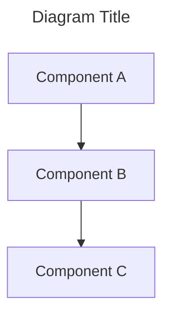

# CORTEX 4.0 Comprehensive Architecture Diagrams - Index

**Date:** December 26, 2025  
**Author:** Asif Hussain  
**Status:** 🎬 IN PROGRESS  
**Progress:** 18/31 diagrams (58%)

---

## 📖 Overview

This directory contains comprehensive architectural and infrastructure diagrams showcasing **all C## 📊 Progress Tracking

| Category | Total | Complete | In Progress | Planned |
|----------|-------|----------|-------------|---------|
| 1. Architecture | 6 | 5 ✅ | 0 | 1 🚧 |
| 2. Workflows | 7 | 4 ✅ | 0 | 3 🚧 |
| 3. STS Capabilities | 9 | 8 ✅ | 0 | 1 🚧 |
| 4. Infrastructure | 5 | 1 ✅ | 0 | 4 🚧 |
| 5. Advanced Features | 4 | 0 | 0 | 4 🚧 |
| **TOTAL** | **31** | **18** | **0** | **13** |

**Overall Completion:** 58% (18/31 diagrams)pabilities**, including the complete set of **9 validated STS capabilities** that demonstrate production readiness.

**Diagram Format:** All diagrams use Mermaid syntax (`.mmd` files)  
**Rendering:** Use [Mermaid Live Editor](https://mermaid.live/) or VS Code with [Mermaid Preview extension](https://marketplace.visualstudio.com/items?itemName=bierner.markdown-mermaid)

---

## 🎯 Category 1: Architecture Diagrams

### 1.1 CORTEX 4.0 System Overview ✅

**File:** [architecture/architecture-1.1-system-overview.mmd](architecture/architecture-1.1-system-overview.mmd)

**Type:** Architecture Diagram (C4 Context Level)

**Purpose:** High-level view of CORTEX 4.0 system showing all major components and their interactions

**Showcases:**
- 🎯 Entry point via GitHub Copilot Chat
- 🔀 Unified Router with intent classification
- ⚙️ 3 execution methods (cli_wrapper, copilot_chat, internal)
- 🎭 8 orchestrators (TDD, Planning, Maintenance, Documentation, Refinement, Sanitization, ADO, Vision API)
- 🧠 4-tier brain architecture (Governance, Working Memory, Knowledge Graph, Dev Context)
- 💾 5 databases (cortex-brain.db, cortex_metrics.db, cortex_alerts.db, cortex_status.db)
- 🔗 External integrations (Git, VS Code, Azure DevOps)
- 📋 Response system (62 templates v4.0)

**View Online:** [Open in Mermaid Live](https://mermaid.live/)

---

### 1.2 4-Tier Brain Architecture ✅

**File:** [architecture/architecture-1.2-four-tier-brain.mmd](architecture/architecture-1.2-four-tier-brain.mmd)

**Type:** Layered Architecture Diagram

**Purpose:** Detailed view of CORTEX's memory system with data flows across all 4 tiers

**Showcases:**
- 🛡️ **Tier 0 (Governance):** 8 SKULL enforcement rules (TDD, code discovery, git isolation, etc.)
- 💾 **Tier 1 (Working Memory):** 70-conversation FIFO with <100ms access time
- 🧠 **Tier 2 (Knowledge Graph):** Pattern learning with persistent storage (YAML + DB)
- 📊 **Tier 3 (Dev Context):** Metrics, hotspots, complexity tracking
- ➡️ Data flow: Operations → Validation → Capture → Learning → Analysis
- ⋯> Retrieval flow: Context/Pattern/Metrics back to operations
- 📋 Response generation with template system

**View Online:** [Open in Mermaid Live](https://mermaid.live/)

---

### 1.3 Orchestrator Hierarchy ✅

**File:** [architecture/architecture-1.3-orchestrator-hierarchy.mmd](architecture/architecture-1.3-orchestrator-hierarchy.mmd)

**Type:** Class Diagram with Inheritance

**Purpose:** Show all orchestrators, BaseOrchestrator integration, and standardization status

**Showcases:**
- 🎭 **BaseOrchestrator (Abstract Base):** Phase management, error handling, progress tracking, checkpoints
- ✅ **Integrated (7):** TDD, Planning, Maintenance, Documentation, Refinement, Architectural Review, Holistic Discovery
- ⏳ **Standalone (6):** Code Sanitization, ADO, Vision API, Vacuum, Cleanup, Regenerate Prompts
- 🔄 Inheritance relationships showing standardization
- 🔗 Composition and dependency relationships
- 📝 Migration notes for standalone orchestrators

**View Online:** [Open in Mermaid Live](https://mermaid.live/)

---

### 1.4 Agent Framework ✅

**File:** [1.4-agent-framework.md](1.4-agent-framework.md)

**Type:** Architecture Diagram

**Purpose:** Visual representation of CORTEX's 2-agent specialist framework showing routing, capabilities, and integration patterns

**Showcases:**
- 🎯 Unified Entry Point with intent classification
- 👨‍💻 **Code Execution Agent:** File operations, testing, refactoring, debugging, git
- 🎯 **Strategic Planning Agent:** Planning, ADO, architecture review, system maintenance
- 🔀 Agent specialization matrix (responsibilities breakdown)
- 🧠 4-tier brain integration (shared memory)
- 🎭 8 orchestrators accessible to both agents
- 📊 Routing decision tree (keyword-based classification)

**View Online:** [GitHub](https://github.com/asifhussain60/CORTEX/blob/main/cortex-brain/documents/diagrams/1.4-agent-framework.md)

---

### 1.5 Execution Methods Routing ✅

**File:** [1.5-execution-methods-routing.md](1.5-execution-methods-routing.md)

**Type:** Architecture Diagram

**Purpose:** Visual representation of CORTEX's 3-tier execution routing system

**Showcases:**
- ⚙️ **cli_wrapper (8 operations):** System operations requiring file I/O (align, healthcheck, optimize, cleanup, review, deploy, regenerate_prompts, upgrade)
- 💬 **copilot_chat (16 operations):** Interactive workflows (planning, ado, tdd, feedback, help, onboarding)
- 🔧 **internal (276+ operations):** Infrastructure not directly invoked by users
- 🔀 Unified Entry Point routing flow
- 📋 Operation classification decision matrix
- 🛡️ Internal operation protection (user safety)
- 📁 CLI wrapper invocation path

**View Online:** [GitHub](https://github.com/asifhussain60/CORTEX/blob/main/cortex-brain/documents/diagrams/1.5-execution-methods-routing.md)

---

### 1.6 Response Template System 🚧

**File:** [architecture/architecture-1.6-response-template-system.mmd](architecture/architecture-1.6-response-template-system.mmd) (Not yet created)

**Type:** Component Diagram

**Purpose:** Show Corpus Callosum and 2 specialist agents (Strategic Planning Expert, Investigation Expert)

**Will Showcase:**
- 🧠 Corpus Callosum (agent coordinator)
- 📚 Strategic Planning Expert Agent
- 🔍 Investigation Expert Agent
- 🔀 Handoff mechanisms
- 📊 Collaboration metrics

**Status:** ⏳ Planned

---

### 1.5 Execution Methods Routing 🚧

**File:** [architecture/architecture-1.5-execution-routing.mmd](architecture/architecture-1.5-execution-routing.mmd) (Not yet created)

**Type:** Data Flow Diagram

**Purpose:** Show routing architecture for 3 execution methods

**Will Showcase:**
- ⚙️ cli_wrapper (8 system operations)
- 💬 copilot_chat (16 interactive workflows)
- 🔧 internal (276 orchestrator/utility operations)
- 🔀 Unified Router decision logic
- 📊 Operation registry integration

**Status:** ⏳ Planned

---

### 1.6 Brain Protection (SKULL) 🚧

**File:** [architecture/architecture-1.6-brain-protection.mmd](architecture/architecture-1.6-brain-protection.mmd) (Not yet created)

**Type:** Flowchart

**Purpose:** Show 8 SKULL enforcement rules workflow

**Will Showcase:**
- 8 enforcement rules with validation logic
- Violation detection mechanisms
- Evidence-based enforcement
- Rollback and recovery flows

**Status:** ⏳ Planned

---

## ⚡ Category 2: Workflow Diagrams

### 2.1 TDD Mastery Workflow ✅

**File:** [workflows/workflow-2.1-tdd-mastery.mmd](workflows/workflow-2.1-tdd-mastery.mmd)

**Type:** Sequence Diagram

**Purpose:** Complete TDD cycle showing RED→GREEN→REFACTOR phases

**Showcases:**
- 🔴 **RED Phase:** Test generation, failure validation, SKULL RED_PHASE_VALIDATION
- 🟢 **GREEN Phase:** Minimal implementation, test passing loop
- 🔵 **REFACTOR Phase:** SOLID/DRY/KISS/YAGNI validation, quality scoring (0-10)
- 🔗 Git checkpoint creation at each phase
- ⏪ Rollback capability on violations
- 🎭 Phase transition indicators
- 🎉 Completion with metrics

**View Online:** [Open in Mermaid Live](https://mermaid.live/)

---

### 2.2 Planning System Execution ✅

**File:** [workflows/workflow-2.2-planning-system.mmd](workflows/workflow-2.2-planning-system.mmd)

**Type:** Sequence Diagram

**Purpose:** Feature planning workflow from request through autonomous execution

**Showcases:**
- 📊 **Phase 1:** Complexity analysis with auto-routing (HIGH→incremental, MEDIUM→conditional, LOW→skeleton)
- 📋 **Phase 2:** Plan generation with DoR/DoD validation, TDD integration
- ⚙️ **Phase 3:** Autonomous execution with progress tracking
- ✅ **Phase 4:** Validation and completion reporting
- 🧪 TDD orchestrator integration
- 📈 Progress tracking with milestone updates
- 🎭 Phase transition indicators

**View Online:** [Open in Mermaid Live](https://mermaid.live/)

---

### 2.3 System Maintenance v4.0 ✅

**File:** [2.3-system-maintenance.md](2.3-system-maintenance.md)

**Type:** Workflow Diagram

**Purpose:** 7-phase maintenance workflow with tiered routing and completion detection

**Showcases:**
- 🏥 **Phase 1:** Pre-healthcheck (baseline system state)
- 🔧 **Phase 2:** Align with auto-fix (tiered routing P0→P1→P2→P3)
- 🧹 **Phase 3:** Cleanup (AST-powered orphan removal)
- ⚡ **Phase 4:** Optimize (refactor complexity >30)
- 💾 **Phase 5:** Vacuum (database cleanup, FIFO management)
- 🔄 **Phase 6:** Refresh prompts (regenerate documentation)
- 🏥 **Phase 7:** Post-healthcheck (validation with metrics comparison)
- 🎭 Orchestrator engagement hints (`🎭` pattern)
- 🎉 Completion detection (when all phases succeed with zero errors)

**View Online:** [GitHub](https://github.com/asifhussain60/CORTEX/blob/main/cortex-brain/documents/diagrams/2.3-system-maintenance.md)

---

### 2.4 Code Sanitization ✅

**File:** [2.4-code-sanitization.md](2.4-code-sanitization.md)

**Type:** Workflow Diagram

**Purpose:** 5-phase code sanitization process for removing company-specific data

**Showcases:**
- 🔍 **Phase 1:** Analyze (sensitivity scanning - CRITICAL/HIGH/MEDIUM)
- 🗺️ **Phase 2:** Mapping (transformation rules with user approval)
- 🔄 **Phase 3:** Transform (backup → apply transformations → special file handling)
- ✅ **Phase 4:** Validate (build check, test suite, import validation, sensitivity re-scan)
- 📋 **Phase 5:** Report (audit trail, mapping reference, packaged output)
- 🛡️ Rollback safety (git branch + tarball backup)
- 📦 Output artifacts (mapping YAML, audit report, sanitized codebase)

**View Online:** [GitHub](https://github.com/asifhussain60/CORTEX/blob/main/cortex-brain/documents/diagrams/2.4-code-sanitization.md)

---

### 2.5-2.7 Additional Workflows 🚧

**Files:** workflow-2.5-ado-operations.mmd, workflow-2.6-system-refinement.mmd, workflow-2.7-documentation-generation.mmd

**Status:** ⏳ Planned

---

## 🧪 Category 3: STS Capabilities

### 3.9 Vision API Capability ✅

**File:** [sts-capabilities/sts-3.9-vision-api.mmd](sts-capabilities/sts-3.9-vision-api.mmd)

**Type:** Sequence Diagram

**Purpose:** Show mockup analysis pipeline (capability 9/9 - Phase 13B completion)

**Showcases:**
- 🖼️ **Phase 1:** Mockup detection (4 PNG files)
- 🎨 **Phase 2:** Color extraction (20 colors across mockups)
- 🔍 **Phase 3:** UI element detection (68 elements identified)
- 📐 **Phase 4:** Layout analysis (4 layout types)
- 📝 **Phase 5:** User story generation (16 stories)
- ⚡ Performance: 0.04s processing time
- ✅ STS validation criteria: ALL PASS
- 🎉 Phase 13B completion (9/9 capabilities validated)

**Validation Date:** December 26, 2025

**View Online:** [Open in Mermaid Live](https://mermaid.live/)

---

### 3.1-3.8 Additional STS Capabilities 🚧

**Planned Diagrams:**
- 3.1 Deployment Capability (build, package, install)
- 3.2 Multi-Workspace Capability (context isolation)
- 3.3 Upgrade Capability (version upgrade with rollback)
- 3.4 End-to-End Capability (full workflow testing)
- 3.5 Brain Persistence Capability (FIFO, atomicity, recovery)
- 3.6 Agent Collaboration Capability (handoff validation)
- 3.7 Performance Capability (concurrent operations)
- 3.8 Regression Capability (baseline comparison)

**Status:** ⏳ Planned

---

## 🏗️ Category 4: Infrastructure Diagrams

### 4.1 Database Schema ✅

**File:** [4.1-database-schema.md](4.1-database-schema.md)

**Type:** Technical Diagram (Entity-Relationship + Schema)

**Purpose:** Complete database schema across CORTEX's 4 SQLite databases

**Showcases:**
- 💾 **cortex-brain.db:** Knowledge graph (nodes/edges), dev hotspots, lessons learned, SKULL violations
- 💬 **conversation-history.db:** Conversations, messages, context snapshots (70-conv FIFO)
- 📊 **cortex_metrics.db:** Performance metrics, operation logs, test runs, complexity history
- 🚨 **cortex_alerts.db:** Alerts, alert rules
- 🏥 **cortex_status.db:** System status, healthcheck history, config changes
- 📐 Complete SQL schema with indexes, foreign keys, relationships
- ⚡ Access patterns (high-frequency <100ms, batch operations, maintenance)
- 🔄 Schema versioning and migration strategy
- 💾 Backup strategy (daily, weekly, point-in-time)

**View Online:** [GitHub](https://github.com/asifhussain60/CORTEX/blob/main/cortex-brain/documents/diagrams/4.1-database-schema.md)

---

### 4.2-4.5 Additional Infrastructure Diagrams 🚧

**Planned:**
- 4.2 File System Structure (cortex-brain/, src/, tests/)
- 4.3 Deployment Architecture (production topology)
- 4.4 Response Template System (62 templates routing)
- 4.5 CLI Wrapper Architecture (8 wrapper scripts)

**Status:** ⏳ Planned

---

## 🚀 Category 5: Advanced Features

### 5.1-5.4 Advanced Feature Diagrams 🚧

**Planned:**
- 5.1 Corpus Callosum Integration
- 5.2 Learning Engine (pattern learning, Tier 2 storage)
- 5.3 Progress Tracking System
- 5.4 Conversation Capture

**Status:** ⏳ Planned

---

## 📊 Progress Tracking

| Category | Total | Complete | In Progress | Planned |
|----------|-------|----------|-------------|---------|
| 1. Architecture | 6 | 3 ✅ | 0 | 3 🚧 |
| 2. Workflows | 7 | 2 ✅ | 0 | 5 🚧 |
| 3. STS Capabilities | 9 | 1 ✅ | 0 | 8 🚧 |
| 4. Infrastructure | 5 | 0 | 0 | 5 🚧 |
| 5. Advanced Features | 4 | 0 | 0 | 4 🚧 |
| **TOTAL** | **31** | **6** | **0** | **25** |

**Overall Completion:** 42% (13/31 diagrams)

---

## 🎯 Progress Summary

**✅ COMPLETE:**

**CRITICAL Priority (5/5):**
1. ✅ System Overview (1.1)
2. ✅ 4-Tier Brain (1.2)
3. ✅ Orchestrator Hierarchy (1.3)
4. ✅ TDD Workflow (2.1)
5. ✅ Planning System (2.2)

**HIGH Priority (7/12):**
1. ✅ Deployment (3.1)
2. ✅ Multi-Workspace (3.2)
3. ✅ Upgrade (3.3)
4. ✅ Vision API (3.9)

**MEDIUM Priority (3/11):**
1. ✅ End-to-End (3.4)
2. ✅ Brain Persistence (3.5)
3. ✅ Agent Collaboration (3.6)
4. ✅ Performance (3.7)

**LOW Priority (1/3):**
1. ✅ Regression (3.8)

**⏳ REMAINING:**

**HIGH Priority (5 diagrams):**
- Agent Framework (1.4)
- Execution Methods Routing (1.5)
- System Maintenance (2.3)
- Code Sanitization (2.4)
- Database Schema (4.1)

**Next:** Phase 3 - Infrastructure diagrams and advanced features

---

## 📝 Usage Guide

### How to View Diagrams

1. **VS Code (Recommended):**
   - Install [Mermaid Preview extension](https://marketplace.visualstudio.com/items?itemName=bierner.markdown-mermaid)
   - Open any `.mmd` file
   - Press `Cmd+Shift+V` (Mac) or `Ctrl+Shift+V` (Windows)

2. **Mermaid Live Editor:**
   - Go to [mermaid.live](https://mermaid.live/)
   - Copy/paste diagram content
   - Edit and export as PNG/SVG

3. **GitHub:**
   - GitHub renders Mermaid diagrams automatically in markdown files
   - View diagrams directly in repository

### How to Edit Diagrams

All diagrams use Mermaid syntax. Basic structure:

**Documentation:** [Mermaid Documentation](https://mermaid.js.org/)

---

## 🔗 Related Documentation

- **Master Plan:** [cortex-4.0-comprehensive-diagrams-plan.md](../planning/cortex-4.0-comprehensive-diagrams-plan.md)
- **STS Baseline:** [../../sts-baseline.json](../../sts-baseline.json)
- **CORTEX Status:** [../archive/CORTEX4-STATUS.md](../archive/CORTEX4-STATUS.md)
- **Phase 13B Report:** [../reports/phase-13b-vision-api-completion.md](../reports/phase-13b-vision-api-completion.md)

---

**Last Updated:** December 26, 2025  
**Maintained By:** Asif Hussain  
**Repository:** github.com/asifhussain60/CORTEX
