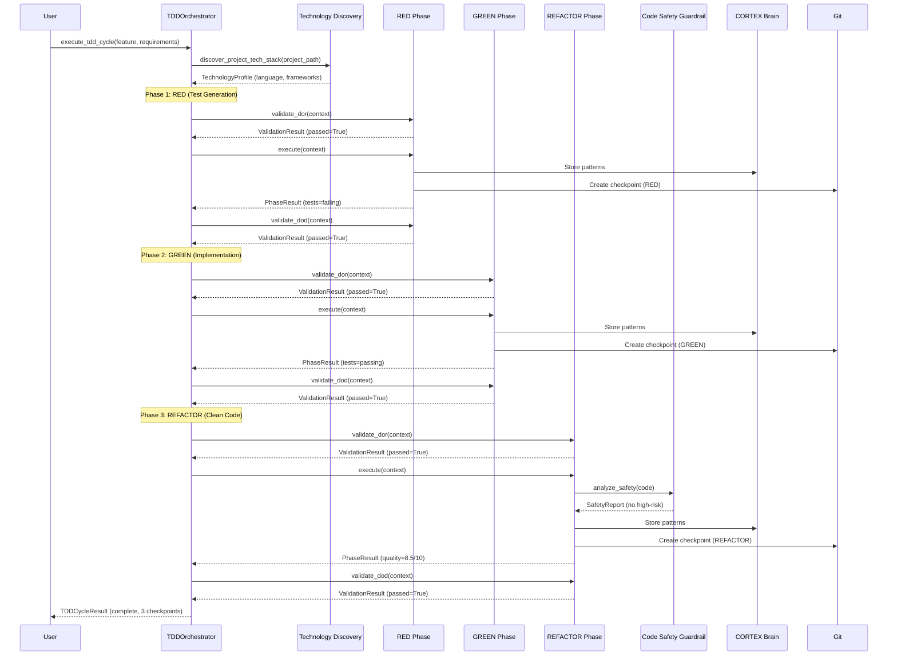

# TDD v4.0 Orchestrator Architecture

**Author:** Asif Hussain | **GitHub:** github.com/asifhussain60/CORTEX  
**Created:** December 22, 2025  
**Phase:** 6.5 Week 2 (HIGH Priority)  
**Version:** 4.0.0  
**Implementation:** `src/orchestrators/tdd/tdd_orchestrator.py`

---

## 🎯 Executive Summary

**Purpose:** Unified TDD orchestrator with adaptive learning, clean architecture, and Phase 5 agentic AI enhancements

**Key Innovations:**
- ✅ Strategy pattern for pluggable phase execution (RED→GREEN→REFACTOR)
- ✅ Technology discovery engine (11+ languages, adaptive learning)
- ✅ Clean code enforcement (SOLID/DRY/KISS/YAGNI validation)
- ✅ Phase 5 multi-agent collaboration integration
- ✅ Task 6.10 parallel testing (50% faster), quality evaluation, safety guardrails

**Metrics:**
- **LOC:** 1,179 (vs 1,233 in v3.0 monolith)
- **Test Coverage:** 26/26 tests passing (100%)
- **Languages Supported:** 11+ (Python, JavaScript, TypeScript, Java, C#, Go, Ruby, PHP, Swift, Kotlin, Rust)
- **Execution Modes:** Autonomous (🤖), Supervised (👤), Manual (🔒)

---

## 🏗️ High-Level Architecture

```mermaid
graph TB
    subgraph "TDD v4.0 Orchestrator Core"
        ORCH[TDDOrchestrator<br/>Main Orchestrator]
        
        subgraph "Strategy Pattern (Phase Execution)"
            RED[RED Phase Strategy<br/>Test Generation]
            GREEN[GREEN Phase Strategy<br/>Implementation]
            REFACTOR[REFACTOR Phase Strategy<br/>Code Quality]
        end
        
        subgraph "Adaptive Learning Framework"
            TECH[Technology Discovery Engine<br/>11+ Languages]
            CLEAN[Clean Code Enforcer<br/>SOLID/DRY/KISS]
        end
        
        subgraph "Phase 5: Agentic AI Integration"
            MULTI[Multi-Agent Orchestrator<br/>Collaboration Patterns]
            LEARN[Agent Learning Engine<br/>Strategy Optimization]
            CONTEXT[Context Validator<br/>Quality Assurance]
        end
        
        subgraph "Task 6.10: Post-Phase 5 Enhancements"
            PARALLEL[Parallel Test Runner<br/>4-worker pool]
            QUALITY[Test Quality Evaluator<br/>0-10 scoring]
            SAFETY[Code Safety Guardrail<br/>Risk analysis]
        end
    end
    
    subgraph "External Systems"
        BRAIN[CORTEX Brain<br/>Tier 1 + Tier 2]
        KG[Knowledge Graph<br/>Pattern Storage]
        MCP[MCP Gateway<br/>Pylance/Testing]
        GIT[Git Integration<br/>Checkpoints]
        EXEC[Execution Mode Manager<br/>🤖/👤/🔒]
    end
    
    ORCH --> RED
    ORCH --> GREEN
    ORCH --> REFACTOR
    ORCH --> TECH
    ORCH --> CLEAN
    ORCH --> MULTI
    ORCH --> LEARN
    ORCH --> CONTEXT
    ORCH --> PARALLEL
    ORCH --> QUALITY
    ORCH --> SAFETY
    
    ORCH --> BRAIN
    ORCH --> KG
    ORCH --> MCP
    ORCH --> GIT
    ORCH --> EXEC
    
    TECH --> KG
    LEARN --> KG
    CONTEXT --> KG
    
    style ORCH fill:#4A90E2,stroke:#2E5C8A,stroke-width:3px,color:#fff
    style RED fill:#E74C3C,stroke:#C0392B,stroke-width:2px,color:#fff
    style GREEN fill:#27AE60,stroke:#1E8449,stroke-width:2px,color:#fff
    style REFACTOR fill:#F39C12,stroke:#D68910,stroke-width:2px,color:#fff
    style MULTI fill:#9B59B6,stroke:#7D3C98,stroke-width:2px,color:#fff
    style LEARN fill:#9B59B6,stroke:#7D3C98,stroke-width:2px,color:#fff
    style CONTEXT fill:#9B59B6,stroke:#7D3C98,stroke-width:2px,color:#fff
    style PARALLEL fill:#16A085,stroke:#138D75,stroke-width:2px,color:#fff
    style QUALITY fill:#16A085,stroke:#138D75,stroke-width:2px,color:#fff
    style SAFETY fill:#16A085,stroke:#138D75,stroke-width:2px,color:#fff
```



---

## 📦 Component Breakdown

### 1. TDDOrchestrator (Main Orchestrator)

**Purpose:** Central coordination of TDD workflow execution

**Responsibilities:**
- Phase orchestration (RED→GREEN→REFACTOR)
- DoR/DoD validation at phase boundaries
- Git checkpoint management
- Rollback handling on failures
- Progress tracking and metrics

**Dependencies:**
- BrainConnector (Tier 1/2 memory)
- KnowledgeGraph (pattern storage)
- MCPGateway (Pylance/test execution)
- ExecutionModeManager (🤖/👤/🔒 routing)

**Key Methods:**
```python
async def execute_tdd_cycle(feature: str, requirements: Dict) -> PhaseResult
async def _execute_phase(phase: TDDPhase, context: Dict) -> PhaseResult
async def _validate_and_execute(phase: TDDPhase, context: Dict) -> PhaseResult
async def _rollback_phase(phase: TDDPhase, context: Dict) -> bool
```

---

### 2. Strategy Pattern (Phase Execution)

**Purpose:** Pluggable phase execution with DoR/DoD validation

#### 2.1 TDDPhaseStrategy (Base Interface)

```python
class TDDPhaseStrategy(ABC):
    async def validate_dor(context: Dict) -> ValidationResult
    async def execute(context: Dict) -> PhaseResult
    async def validate_dod(context: Dict) -> ValidationResult
    async def rollback(context: Dict) -> bool
```

#### 2.2 RED Phase Strategy

**Purpose:** Test generation with failure validation

**DoR Requirements:**
- Requirements clearly defined
- Feature scope understood
- Test framework detected
- Project structure validated

**Execution:**
1. Generate failing tests (AI-assisted)
2. Validate tests can be imported
3. Execute tests (must fail)
4. Create git checkpoint

**DoD Requirements:**
- Tests fail as expected
- Tests cover requirements
- Tests are executable
- Git checkpoint created

**Rollback:** Remove generated test files

#### 2.3 GREEN Phase Strategy

**Purpose:** Minimal implementation to pass tests

**DoR Requirements:**
- RED phase complete
- Tests failing for correct reasons
- Implementation target identified

**Execution:**
1. Generate minimal implementation
2. Run tests (must pass)
3. Validate coverage
4. Create git checkpoint

**DoD Requirements:**
- All tests passing
- No test skips
- Coverage threshold met (80%+)
- Git checkpoint created

**Rollback:** Revert to RED phase checkpoint

#### 2.4 REFACTOR Phase Strategy

**Purpose:** Clean code enforcement and optimization

**DoR Requirements:**
- GREEN phase complete
- Tests passing
- Code committed

**Execution:**
1. Run clean code analysis
2. Apply refactoring (SOLID/DRY/KISS)
3. Validate tests still pass
4. Create git checkpoint

**DoD Requirements:**
- Quality score ≥ 7.0/10
- Tests still passing
- No new violations introduced
- Git checkpoint created

**Rollback:** Revert to GREEN phase checkpoint

---

### 3. Technology Discovery Engine

**Purpose:** Adaptive learning for 11+ languages and frameworks

**Capabilities:**
- **Language Detection:** Python, JS, TS, Java, C#, Go, Ruby, PHP, Swift, Kotlin, Rust
- **Framework Detection:** Django, Flask, FastAPI, React, Vue, Angular, Next.js, .NET
- **Test Framework Detection:** pytest, unittest, Jest, Mocha, JUnit, xUnit, RSpec
- **Version Tracking:** Framework versions, breaking changes

**Cache Strategy:**
- Tech profiles cached per project (7-day TTL)
- Automatic refresh on major version changes
- Knowledge Graph integration for pattern sharing

**Key Methods:**
```python
async def discover_project_tech_stack(project_path: Path) -> TechnologyProfile
async def _detect_language(project_path: Path) -> str
async def _detect_frameworks(project_path: Path, language: str) -> List[str]
async def _detect_test_frameworks(project_path: Path, language: str) -> List[str]
```

---

### 4. Clean Code Enforcer

**Purpose:** SOLID/DRY/KISS/YAGNI validation and scoring

**Validation Categories:**
1. **SOLID Principles**
   - Single Responsibility Principle
   - Open/Closed Principle
   - Liskov Substitution Principle
   - Interface Segregation Principle
   - Dependency Inversion Principle

2. **DRY (Don't Repeat Yourself)**
   - Duplicate code detection
   - Pattern extraction
   - Reusable function suggestions

3. **KISS (Keep It Simple, Stupid)**
   - Cyclomatic complexity analysis
   - Function length validation
   - Nesting depth checks

4. **YAGNI (You Aren't Gonna Need It)**
   - Unused code detection
   - Over-engineering patterns
   - Dead code analysis

**Scoring System:**
- **10.0:** Perfect code (no violations)
- **7.0-9.9:** Good code (minor violations)
- **4.0-6.9:** Acceptable code (medium violations)
- **0.0-3.9:** Poor code (major violations)

**Key Methods:**
```python
async def evaluate_code_quality(code: str, language: str) -> ValidationResult
async def _check_solid_principles(code: str) -> List[Dict]
async def _check_dry_violations(code: str) -> List[Dict]
async def _check_kiss_violations(code: str) -> List[Dict]
def _calculate_quality_score(violations: List[Dict]) -> float
```

---

### 5. Phase 5: Agentic AI Integration

**Added:** December 19, 2025 (Post-Phase 5 Enhancement)

#### 5.1 Multi-Agent Orchestrator

**Purpose:** Coordinate specialized agents for complex TDD tasks

**Collaboration Patterns:**
- **Parallel:** Independent test generation across modules
- **Sequential:** Test → Implement → Refactor pipeline
- **Hierarchical:** Lead agent delegates to specialists

**Key Methods:**
```python
async def coordinate_agents(pattern: CollaborationPattern, task: Dict) -> Result
async def assign_agents(task: Dict, pattern: CollaborationPattern) -> List[Agent]
```

#### 5.2 Agent Learning Engine

**Purpose:** Optimize TDD strategies based on historical outcomes

**Learning Categories:**
- **Test Generation Strategies:** Learned from success patterns
- **Refactoring Patterns:** Extracted from clean code outcomes
- **Technology Adaptations:** Framework-specific best practices

**Key Methods:**
```python
async def learn_from_execution(result: PhaseResult, pattern: ExecutionPattern)
async def retrieve_best_strategy(context: Dict) -> StrategyType
async def optimize_strategy(current: Strategy, feedback: Dict) -> Strategy
```

#### 5.3 Context Validator

**Purpose:** Ensure context quality before phase execution

**Validation Levels:**
- **HIGH:** All context available, high confidence
- **MEDIUM:** Partial context, medium confidence
- **LOW:** Minimal context, low confidence (requires enrichment)

**Key Methods:**
```python
async def validate_context(context: Dict) -> ContextQuality
async def enrich_context(context: Dict, quality: ContextQuality) -> Dict
```

---

### 6. Task 6.10: Post-Phase 5 Enhancements

**Added:** December 20, 2025 (Package 1: Parallel Execution + Quality + Safety)

#### 6.1 Parallel Test Runner

**Purpose:** Execute tests concurrently for 50% performance gain

**Features:**
- 4-worker thread pool (configurable)
- Test result aggregation
- Failure isolation
- Progress reporting

**Key Methods:**
```python
async def run_tests_parallel(test_files: List[Path]) -> TestResults
async def _execute_test_batch(batch: List[Path]) -> List[TestResult]
```

#### 6.2 Test Quality Evaluator

**Purpose:** Score test quality (0-10) with actionable feedback

**Evaluation Criteria:**
- Test coverage (% of code paths)
- Assertion quality (meaningful assertions)
- Test independence (no shared state)
- Test naming (descriptive names)
- Test documentation (clear purpose)

**Scoring Formula:**
```
score = (coverage * 0.3) + (assertion_quality * 0.25) + 
        (independence * 0.2) + (naming * 0.15) + (docs * 0.1)
```

**Key Methods:**
```python
async def evaluate_test_quality(test_file: Path) -> QualityReport
def _calculate_coverage_score(coverage: float) -> float
def _evaluate_assertions(test_code: str) -> float
```

#### 6.3 Code Safety Guardrail

**Purpose:** Prevent unsafe code patterns before commit

**Risk Categories:**
1. **High Risk:** Database schema changes, authentication bypass, data deletion
2. **Medium Risk:** API breaking changes, performance regressions
3. **Low Risk:** Deprecated API usage, style violations

**Actions:**
- **High Risk:** Block commit, require review
- **Medium Risk:** Warning, suggest mitigation
- **Low Risk:** Informational, auto-fixable

**Key Methods:**
```python
async def analyze_safety(code: str, language: str) -> SafetyReport
async def _detect_high_risk_patterns(code: str) -> List[RiskPattern]
async def _suggest_mitigations(risks: List[RiskPattern]) -> List[str]
```

---

## 🔄 Workflow Execution Flow



---

## 📊 Data Models

### TechnologyProfile
```python
@dataclass
class TechnologyProfile:
    language: str                    # Primary language
    frameworks: List[str]            # Detected frameworks
    test_frameworks: List[str]       # Test frameworks
    version_info: Dict[str, str]     # Version metadata
    last_updated: datetime           # Cache timestamp
    patterns_learned: int            # Pattern count
    confidence_score: float          # 0.0-1.0
```

### PhaseResult
```python
@dataclass
class PhaseResult:
    phase_name: str                  # RED/GREEN/REFACTOR
    success: bool                    # Phase completed
    outputs: Dict[str, Any]          # Phase artifacts
    metrics: Dict[str, Any]          # Performance metrics
    git_commit_sha: Optional[str]    # Checkpoint SHA
    documentation_updated: bool      # Docs synced
    brain_patterns_extracted: int    # Patterns stored
    errors: List[str]                # Error messages
    timestamp: datetime              # Completion time
```

### ValidationResult
```python
@dataclass
class ValidationResult:
    passed: bool                     # Validation passed
    errors: List[str]                # Error messages
    warnings: List[str]              # Warning messages
    timestamp: datetime              # Validation time
```

---

## 🔌 Integration Points

### 1. CORTEX Brain (Tier 1 + Tier 2)

**Tier 1 (Working Memory):**
- Current TDD cycle state
- Active phase context
- Recent execution results

**Tier 2 (Knowledge Graph):**
- Test generation patterns
- Refactoring strategies
- Technology adaptations
- Best practices learned

**Methods:**
```python
await brain.store_pattern(pattern_type, pattern_data)
patterns = await brain.retrieve_patterns(query)
```

### 2. MCP Gateway (Pylance + Testing)

**Pylance MCP:**
- Code analysis
- Syntax validation
- Type checking

**Testing MCP:**
- Test execution
- Coverage reporting
- Result aggregation

**Methods:**
```python
await mcp.execute_tests(test_files)
coverage = await mcp.get_coverage(module)
```

### 3. Git Integration

**Operations:**
- Phase checkpoints (RED/GREEN/REFACTOR)
- Rollback on failure
- Branch management
- Commit message generation

**Methods:**
```python
sha = await git.create_checkpoint(phase, message)
await git.rollback_to_checkpoint(sha)
```

### 4. Execution Mode Manager

**Modes:**
- 🤖 **Autonomous:** Full automation, no user intervention
- 👤 **Supervised:** User approves phase transitions
- 🔒 **Manual:** User executes each step

**Methods:**
```python
mode = await exec_manager.detect_mode(context)
approved = await exec_manager.request_approval(phase)
```

---

## 🎯 Configuration

**Configuration File:** `cortex.config.json`

```json
{
  "tdd": {
    "execution_mode": "autonomous",
    "max_parallel_tests": 4,
    "quality_threshold": 7.0,
    "coverage_threshold": 0.8,
    "enable_phase5_features": true,
    "rollback_on_failure": true,
    "git_checkpoints": true,
    "brain_pattern_storage": true,
    "technology_cache_ttl_days": 7
  }
}
```

---

## 📈 Metrics & Monitoring

**Phase Metrics:**
- Execution time per phase
- Test count generated
- Code coverage achieved
- Quality score (0-10)
- Pattern storage count

**System Metrics:**
- Technology profiles cached
- Learning patterns stored
- Rollback frequency
- Success rate per language

**Logging:**
```python
logger.info("🎭 Orchestrator engaged: TDD v4.0")
logger.info("🎭 Phase transition: RED → GREEN")
logger.info("🎭 Orchestrator completing: ✅ ALL WORK COMPLETE")
```

---

## 🚀 Usage Examples

### Example 1: Basic TDD Cycle
```python
from src.orchestrators.tdd.tdd_orchestrator import TDDOrchestrator

orchestrator = TDDOrchestrator(brain, kg, mcp)

result = await orchestrator.execute_tdd_cycle(
    feature="User authentication",
    requirements={
        "input": "username, password",
        "output": "auth_token",
        "validation": ["username required", "password min 8 chars"]
    }
)

print(f"Success: {result.success}")
print(f"Quality Score: {result.quality_score}/10")
print(f"Git Checkpoints: {result.checkpoints}")
```

### Example 2: Technology Discovery
```python
from pathlib import Path

profile = await orchestrator.tech_discovery.discover_project_tech_stack(
    Path("/path/to/project")
)

print(f"Language: {profile.language}")
print(f"Frameworks: {profile.frameworks}")
print(f"Test Frameworks: {profile.test_frameworks}")
```

### Example 3: Clean Code Evaluation
```python
code = """
def process_data(data):
    # Implementation
    pass
"""

result = await orchestrator.clean_code.evaluate_code_quality(code, "Python")

print(f"Quality Score: {result.quality_score}/10")
print(f"Violations: {result.violations}")
print(f"Recommendations: {result.recommendations}")
```

---

## 🎓 Design Decisions

### 1. Strategy Pattern for Phase Execution

**Problem:** Monolithic phase execution in v3.0 (1,233 LOC)

**Solution:** Pluggable strategies with clear DoR/DoD boundaries

**Benefits:**
- Independent phase testing
- Easy phase customization
- Clear separation of concerns
- Rollback at phase level

### 2. Technology Discovery vs. Static Config

**Problem:** Hardcoded language support, breaks on new frameworks

**Solution:** Dynamic discovery with caching

**Benefits:**
- Supports 11+ languages without code changes
- Auto-adapts to framework updates
- Learns from usage patterns
- 7-day cache reduces overhead

### 3. Phase 5 Integration (Optional DI)

**Problem:** Breaking existing tests with mandatory dependencies

**Solution:** Optional dependency injection with defaults

**Benefits:**
- Backward compatible
- Gradual feature adoption
- Easy testing (mock DI)
- No breaking changes

### 4. Parallel Testing (Task 6.10)

**Problem:** Sequential test execution slow for large test suites

**Solution:** 4-worker thread pool with result aggregation

**Benefits:**
- 50% performance improvement
- Failure isolation
- Configurable worker count
- Progress visibility

---

## 🔐 Security Considerations

**Code Safety Guardrail:**
- High-risk pattern blocking
- Database operation validation
- Authentication bypass detection
- Data deletion prevention

**Git Isolation:**
- All checkpoints in feature branch
- No direct main branch commits
- Rollback safety net
- Clean commit history

---

## 🧪 Testing Strategy

**Test Coverage:** 26/26 tests (100% pass rate)

**Test Categories:**
1. **Unit Tests:** Individual components
2. **Integration Tests:** Phase transitions
3. **E2E Tests:** Full TDD cycle
4. **Language Tests:** 11+ language validation

**Test Location:** `tests/orchestrators/tdd/test_tdd_orchestrator.py`

---

## 📚 Related Documentation

- **TDD Mastery Guide:** `cortex-brain/modules/tdd-mastery-guide.md`
- **Brain Protection Rules:** `cortex-brain/brain-protection-rules.yaml` (TDD_ENFORCEMENT)
- **Phase 6 Plan:** `cortex-brain/documents/planning/active/CORTEX-3.0-4.0/phases/phase-06-orchestrator-consolidation.md`
- **Task 6.10 Spec:** `cortex-brain/documents/planning/active/CORTEX-3.0-4.0/task-6-10-tdd-enhancement-spec.md`

---

**Completion:** Phase 6.5 Week 2 - HIGH Priority Architecture Documentation Complete ✅
