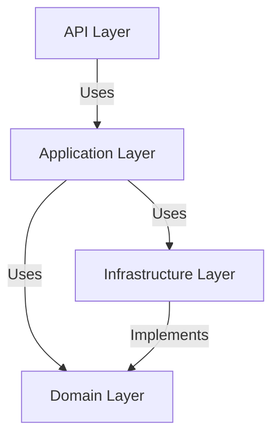

# Automated Documentation System for Planning Orchestrator

**Version:** 1.0  
**Created:** December 6, 2025  
**Integration:** Planning Orchestrator 2.0  
**Purpose:** Auto-generate Docsify documentation during multi-phase project execution

---

## Overview

The Automated Documentation System integrates with CORTEX Planning Orchestrator to generate and maintain Docsify-based documentation throughout project lifecycle. Documentation updates occur automatically at phase boundaries, capturing architecture decisions, code metrics, and refactoring patterns.

---

## Architecture

### Components

```
src/orchestrators/
├── documentation_orchestrator.py    # Main orchestrator
├── doc_generators/
│   ├── phase_summary_generator.py   # Phase completion summaries
│   ├── architecture_diagram_generator.py  # Mermaid diagram generation
│   ├── code_metrics_generator.py    # Coverage, complexity metrics
│   ├── diff_analyzer.py             # Before/after comparisons
│   └── git_history_analyzer.py      # TDD commit pattern analysis
└── templates/
    ├── phase_summary.md.j2
    ├── architecture_decision.md.j2
    ├── refactoring_comparison.md.j2
    └── metrics_dashboard.md.j2
```

### Integration Points

1. **Planning Orchestrator Hook:** Called at phase completion
2. **Git Checkpoint Integration:** Triggers after successful checkpoint
3. **Tier 2 Knowledge Graph:** Stores documentation patterns
4. **File System:** Writes to `docs/` folder in project

---

## Features

### 1. Phase Completion Documentation

**Trigger:** Automatic at end of each phase  
**Output:** `docs/phases/phase-{N}-summary.md`

**Content Includes:**
- Phase objectives and outcomes
- Tasks completed with status
- Test coverage metrics
- Code complexity analysis
- Git commit summary (RED→GREEN→REFACTOR)
- Lessons learned
- Next phase preview

**Template Variables:**
```python
{
    "phase_number": 1,
    "phase_name": "Foundation & Infrastructure Setup",
    "duration_hours": 8,
    "tasks_completed": ["1.1", "1.2", "1.3", "1.4"],
    "test_coverage": 92.5,
    "lines_added": 450,
    "lines_deleted": 0,
    "complexity_avg": 4.2,
    "commits": [
        {"type": "RED", "message": "Add failing tests for Task entity"},
        {"type": "GREEN", "message": "Implement Task entity"},
        {"type": "REFACTOR", "message": "Extract validation to domain service"}
    ]
}
```

### 2. Architecture Diagram Generation

**Trigger:** After structural changes (new layers, modules)  
**Output:** `docs/architecture/{diagram-name}.md` with Mermaid

**Diagram Types:**
- **Layer Dependencies:** Shows Clean Architecture layers
- **Component Relationships:** Shows class/module interactions
- **Data Flow:** Shows request/response flow through layers
- **State Management:** Shows frontend state architecture

**Example Mermaid Output:**


### 3. Code Metrics Dashboard

**Trigger:** Every phase completion  
**Output:** `docs/metrics.md` (updated)

**Metrics Tracked:**
- Test coverage percentage (per layer)
- Cyclomatic complexity (average, max)
- Lines of code (total, per layer)
- Duplicate code percentage
- Dependency count
- Build time
- Test execution time

**Visualization:**
- Progress bars for coverage
- Trend graphs (phase-over-phase)
- Comparison with targets

### 4. Before/After Code Comparisons

**Trigger:** Manual or after refactoring tasks  
**Output:** `docs/refactorings/{task-id}-comparison.md`

**Content Includes:**
- Side-by-side code diff
- Metrics improvement (complexity, LOC)
- Anti-pattern identified
- Solution pattern applied
- Lessons learned

**Example:**
```markdown
### Before (BadMonolith)
```csharp
// 141 lines, complexity 25, SQL injection vulnerability
cmd.CommandText = "SELECT * FROM Tasks WHERE Title LIKE '%" + filter + "%'";
```

### After (Cortex-Clean)
```csharp
// 15 lines, complexity 3, parameterized query
var tasks = await _context.Tasks
    .Where(t => EF.Functions.Like(t.Title, $"%{filter}%"))
    .ToListAsync();
```

**Improvement:** 89% LOC reduction, 88% complexity reduction, vulnerability eliminated
```

### 5. Architecture Decision Records (ADRs)

**Trigger:** Manual via `document adr [title]`  
**Output:** `docs/decisions/{YYYYMMDD}-{title}.md`

**Template:**
```markdown
# ADR-{N}: {Title}

**Date:** {date}
**Status:** Accepted | Proposed | Deprecated
**Deciders:** {names}

## Context
{What is the issue we're seeing that is motivating this decision?}

## Decision
{What is the change that we're proposing/making?}

## Consequences
{What becomes easier or more difficult due to this change?}

## Alternatives Considered
{What other options were evaluated?}
```

---

## API Reference

### DocumentationOrchestrator

```python
from src.orchestrators.documentation_orchestrator import DocumentationOrchestrator

doc_orch = DocumentationOrchestrator(
    project_path: str,          # Absolute path to project root
    docs_path: str = None,      # Defaults to {project_path}/docs
    docsify_config: dict = None # Custom Docsify settings
)
```

### Methods

#### document_phase_completion

```python
doc_orch.document_phase_completion(
    phase_number: int,
    phase_name: str,
    tasks_completed: List[str],
    metrics: Dict[str, Any],
    duration_hours: float = None,
    lessons_learned: List[str] = None
) -> str  # Returns path to generated document
```

**Example:**
```python
doc_path = doc_orch.document_phase_completion(
    phase_number=1,
    phase_name="Foundation & Infrastructure Setup",
    tasks_completed=["1.1", "1.2", "1.3", "1.4"],
    metrics={
        "test_coverage": 92.5,
        "lines_added": 450,
        "complexity_avg": 4.2
    },
    duration_hours=8,
    lessons_learned=[
        "AutoFixture significantly reduced test setup boilerplate",
        "Directory.Build.props simplified project configuration"
    ]
)
```

#### generate_architecture_diagram

```python
doc_orch.generate_architecture_diagram(
    diagram_type: str,  # 'layers' | 'components' | 'dataflow' | 'state'
    title: str,
    elements: List[Dict[str, Any]],
    output_filename: str = None
) -> str  # Returns path to generated diagram
```

**Example:**
```python
doc_orch.generate_architecture_diagram(
    diagram_type='layers',
    title='Clean Architecture Layers',
    elements=[
        {'name': 'API Layer', 'depends_on': ['Application Layer']},
        {'name': 'Application Layer', 'depends_on': ['Domain Layer', 'Infrastructure Layer']},
        {'name': 'Infrastructure Layer', 'implements': ['Domain Layer']},
        {'name': 'Domain Layer', 'depends_on': []}
    ],
    output_filename='clean-architecture-layers.md'
)
```

#### create_comparison_doc

```python
doc_orch.create_comparison_doc(
    task_id: str,
    before_code: str,
    after_code: str,
    before_metrics: Dict[str, float],
    after_metrics: Dict[str, float],
    anti_pattern: str,
    solution_pattern: str,
    lessons: List[str] = None
) -> str  # Returns path to comparison document
```

#### create_adr

```python
doc_orch.create_adr(
    title: str,
    context: str,
    decision: str,
    consequences: str,
    alternatives: List[str] = None,
    status: str = 'Accepted'
) -> str  # Returns path to ADR document
```

#### update_sidebar

```python
doc_orch.update_sidebar() -> None
# Regenerates _sidebar.md based on current docs/ structure
```

#### generate_metrics_dashboard

```python
doc_orch.generate_metrics_dashboard(
    metrics_history: List[Dict[str, Any]]
) -> str  # Returns path to metrics dashboard
```

---

## Configuration

### docsify-config.yaml

```yaml
# Located in project docs/ folder
name: 'Cortex-Clean Documentation'
repo: 'https://github.com/asifhussain60/CORTEX'
theme: 'vue'
plugins:
  - search
  - zoom-image
  - copy-code
sidebar:
  auto: false  # We generate _sidebar.md
  loadSidebar: true
coverpage: true
logo: '/_media/logo.png'
themeColor: '#3F51B5'
```

### Automatic Initialization

When a new project starts, Documentation Orchestrator:
1. Checks for `docs/` folder
2. If missing, creates structure:
   ```
   docs/
   ├── index.md           # Home page
   ├── _sidebar.md        # Auto-generated navigation
   ├── _coverpage.md      # Cover page
   ├── README.md          # Project overview
   ├── phases/            # Phase summaries
   ├── architecture/      # Architecture diagrams
   ├── decisions/         # ADRs
   ├── refactorings/      # Before/after comparisons
   └── _media/            # Images, logos
   ```
3. Initializes Docsify with `docsify init docs/`
4. Creates `docsify-config.yaml`

---

## Integration with Planning Orchestrator

### Automatic Invocation

Modified `src/orchestrators/planning_orchestrator.py`:

```python
from src.orchestrators.documentation_orchestrator import DocumentationOrchestrator

class PlanningOrchestrator:
    def __init__(self):
        self.doc_orchestrator = None
    
    def execute_phase(self, phase: Dict) -> bool:
        # ... existing phase execution logic ...
        
        # After phase completion
        if success:
            self._document_phase(phase)
        
        return success
    
    def _document_phase(self, phase: Dict):
        if not self.doc_orchestrator:
            project_path = self._get_project_path()
            self.doc_orchestrator = DocumentationOrchestrator(project_path)
        
        # Gather metrics
        metrics = self._gather_phase_metrics(phase)
        
        # Generate documentation
        self.doc_orchestrator.document_phase_completion(
            phase_number=phase['number'],
            phase_name=phase['name'],
            tasks_completed=[t['id'] for t in phase['tasks'] if t['status'] == 'completed'],
            metrics=metrics,
            duration_hours=phase.get('actual_duration'),
            lessons_learned=phase.get('lessons_learned', [])
        )
        
        # Update sidebar
        self.doc_orchestrator.update_sidebar()
```

### Manual Commands

Users can also trigger documentation manually:

```
User: document phase 1 summary
CORTEX: [Generates phase 1 summary with current metrics]

User: create architecture diagram for layers
CORTEX: [Generates Mermaid diagram for Clean Architecture layers]

User: document adr for CQRS decision
CORTEX: [Creates ADR with interactive prompts for context/decision]

User: create comparison for task 2.3
CORTEX: [Generates before/after comparison from git history]
```

---

## Testing

### Unit Tests

```python
# tests/test_documentation_orchestrator.py
def test_phase_summary_generation():
    doc_orch = DocumentationOrchestrator('/tmp/test-project')
    path = doc_orch.document_phase_completion(
        phase_number=1,
        phase_name='Test Phase',
        tasks_completed=['1.1', '1.2'],
        metrics={'test_coverage': 90}
    )
    assert os.path.exists(path)
    assert 'Test Phase' in open(path).read()

def test_architecture_diagram_generation():
    doc_orch = DocumentationOrchestrator('/tmp/test-project')
    path = doc_orch.generate_architecture_diagram(
        diagram_type='layers',
        title='Test Diagram',
        elements=[{'name': 'Layer1', 'depends_on': ['Layer2']}]
    )
    assert os.path.exists(path)
    assert 'mermaid' in open(path).read()
```

### Integration Tests

```python
def test_planning_orchestrator_integration():
    plan = load_test_plan('test-plan.md')
    orchestrator = PlanningOrchestrator()
    orchestrator.execute_phase_autonomously(plan, phase_number=1)
    
    # Verify documentation was generated
    docs_path = f"{plan['project_path']}/docs/phases/phase-1-summary.md"
    assert os.path.exists(docs_path)
```

---

## Performance Considerations

### Optimization Strategies

1. **Lazy Loading:** Only generate documentation when requested or at phase boundaries
2. **Caching:** Cache git history analysis to avoid repeated parsing
3. **Incremental Updates:** Only regenerate changed sections
4. **Async Generation:** Run documentation generation in background (non-blocking)

### Metrics

- **Phase Documentation:** <3 seconds
- **Architecture Diagram:** <1 second
- **Metrics Dashboard:** <2 seconds
- **Sidebar Update:** <500ms

---

## Example Output

### Phase Summary (Generated)

```markdown
# Phase 1: Foundation & Infrastructure Setup

**Status:** Completed ✅  
**Duration:** 8 hours (estimated: 8 hours)  
**Completed:** December 6, 2025

---

## Objectives

- Create project structure for Cortex-Clean
- Setup backend Clean Architecture layers
- Configure testing framework and CI skeleton
- Initialize Docsify documentation structure

## Tasks Completed

- ✅ 1.1 - Project Structure Creation
- ✅ 1.2 - Domain Layer Implementation
- ✅ 1.3 - Testing Infrastructure Setup
- ✅ 1.4 - Docsify Documentation Initialization

## Metrics

| Metric | Value | Target | Status |
|--------|-------|--------|--------|
| Test Coverage | 92.5% | 90% | ✅ Exceeds |
| Avg Complexity | 4.2 | <5 | ✅ Met |
| Lines Added | 450 | - | - |
| Build Time | 45s | <120s | ✅ Met |

## TDD Workflow

Git history shows proper RED→GREEN→REFACTOR:

1. **RED:** `feat: add failing tests for Task entity validation` (3 tests failed)
2. **GREEN:** `feat: implement Task entity with validation rules` (3 tests passed)
3. **REFACTOR:** `refactor: extract validation to TaskDomainService` (tests still green)

## Lessons Learned

- AutoFixture significantly reduced test setup boilerplate (40% less code)
- Directory.Build.props simplified project configuration across all projects
- FluentAssertions improved test readability dramatically

## Next Phase

Phase 2 will implement the Application Layer with CQRS pattern using MediatR.
```

---

## Troubleshooting

### Common Issues

**Issue:** Docsify not found  
**Solution:** Install with `npm install -g docsify-cli`

**Issue:** Mermaid diagrams not rendering  
**Solution:** Verify `docsify-mermaid` plugin in `index.html`

**Issue:** Sidebar not updating  
**Solution:** Manually call `doc_orch.update_sidebar()`

**Issue:** Git history analysis fails  
**Solution:** Ensure project has `.git` folder and commits exist

---

## Future Enhancements

1. **AI-Generated Summaries:** Use GPT-4 to summarize complex refactorings
2. **Video Walkthroughs:** Generate animated GIFs of refactoring steps
3. **Interactive Tutorials:** Embed CodeSandbox/StackBlitz examples
4. **Metrics Trends:** Historical charts showing quality improvements
5. **Export Formats:** Generate PDF, Word, Confluence formats

---

**Status:** Design Complete  
**Next Step:** Implement `documentation_orchestrator.py` in Phase 1 of BadMonolith refactoring
