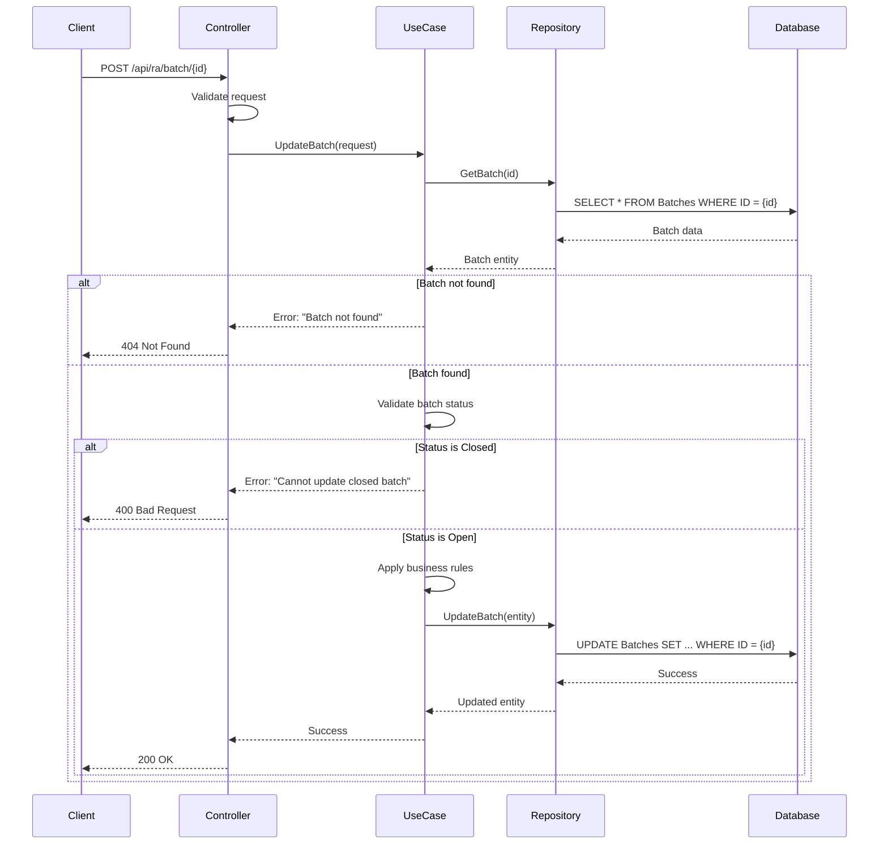

# RA API Specification - Business Logic Template

**API Name:** [API Name]  
**Operation:** [TransactionName]  
**Legacy Location:** `Segment4/HETransactions/[FileName].cs`  
**Version:** 1.0  
**Status:** Draft / Under Review / Approved

---

## 📋 Document Overview

**Purpose:** Define business logic and behavior for [API Name] in plain English for PM/BA validation

**Audience:** Product Managers, Business Analysts, QA, Developers

**Traceability:** All rules reference legacy code line numbers for verification

---

## 🎯 Business Purpose

**What This API Does:**
[1-2 sentence description of business purpose]

**Example Use Case:**
```
User Story: As a [role], I need to [action] so that [outcome]
Scenario: [Concrete example with real data]
```

---

## ✅ Preconditions

**Required State Before Operation:**

1. **[Condition 1]**
   - Example: User is authenticated with RA permissions
   - Validation: [How checked]

2. **[Condition 2]**
   - Example: Batch exists in database with Open status
   - Validation: [How checked]

3. **[Condition 3]**
   - Example: No concurrent updates in progress
   - Validation: [How checked]

**Legacy Reference:** Lines [X-Y]

---

## 📐 Business Rules

### Rule 1: [Rule Name]

**Description:** [Plain English description]

**Logic:**
- IF [condition]
- THEN [action]
- ELSE [alternative action]

**Example:**
```
Input: BatchID = 12345, Status = "Open", Amount = 1000.00
Expected: Batch updated successfully, Amount = 1000.00

Input: BatchID = 12345, Status = "Closed", Amount = 1000.00
Expected: Error "Cannot update closed batch"
```

**Layer Mapping:** [Domain / UseCase / Infrastructure]

**Legacy Reference:** Lines [X-Y]

---

### Rule 2: [Rule Name]

**Description:** [Plain English description]

**Logic:**
- IF [condition]
- THEN [action]
- ELSE [alternative action]

**Example:**
```
Input: [concrete values]
Expected: [expected outcome]
```

**Layer Mapping:** [Domain / UseCase / Infrastructure]

**Legacy Reference:** Lines [X-Y]

---

### Rule 3: [Rule Name]

[Repeat pattern for all business rules]

---

## 🔄 Data Flow



**Key Paths:**
1. Happy path: Valid update
2. Error path: Batch not found
3. Error path: Invalid status
4. Error path: Validation failure

**Legacy Reference:** Lines [X-Y] (main flow)

---

## 💾 Data Operations

### Database Operations

**Tables Accessed:**
- `Batches` (Read, Update)
- `AuditLog` (Insert)

**Queries:**

1. **Get Batch:**
   ```sql
   SELECT * FROM Batches WHERE BatchID = @BatchID
   ```
   - Purpose: Retrieve batch for validation
   - Legacy Reference: Line [X]

2. **Update Batch:**
   ```sql
   UPDATE Batches 
   SET Amount = @Amount, ModifiedDate = GETDATE()
   WHERE BatchID = @BatchID
   ```
   - Purpose: Apply changes
   - Legacy Reference: Line [Y]

---

### External Service Calls

**Service:** [ServiceName]
- **Purpose:** [What it does]
- **Request:** [Request format]
- **Response:** [Response format]
- **Error Handling:** [How errors handled]
- **Legacy Reference:** Line [Z]

---

## ⚠️ Error Scenarios

### Error 1: [Error Name]

**Trigger:** [What causes this error]

**Error Message:** "Exact error message text"

**HTTP Status:** [404 / 400 / 500 / etc.]

**User Action:** [What user should do]

**Example:**
```
Input: BatchID = 99999 (non-existent)
Result: 404 Not Found
Message: "Batch with ID 99999 not found"
```

**Legacy Reference:** Line [X]

---

### Error 2: [Error Name]

[Repeat pattern for all error scenarios]

---

## 🔒 Validation Rules

### Input Validation

1. **BatchID**
   - Required: Yes
   - Type: Integer
   - Range: > 0
   - Error: "BatchID is required and must be positive"

2. **Amount**
   - Required: Yes
   - Type: Decimal
   - Range: >= 0
   - Precision: 2 decimal places
   - Error: "Amount must be non-negative"

3. **[Field Name]**
   - Required: [Yes/No]
   - Type: [Type]
   - Constraints: [Constraints]
   - Error: "[Error message]"

**Legacy Reference:** Lines [X-Y]

---

### Business Validation

1. **Batch Status Check**
   - Rule: Status must be "Open"
   - Error: "Cannot update closed batch"
   - Legacy Reference: Line [X]

2. **[Validation Name]**
   - Rule: [Rule]
   - Error: "[Error message]"
   - Legacy Reference: Line [Y]

---

## 🔄 Side Effects

**What Changes After This Operation:**

1. **Batch Record Updated**
   - Fields: Amount, ModifiedDate, ModifiedBy
   - Triggers: Audit log entry created

2. **Audit Trail**
   - Record: Who, What, When
   - Table: AuditLog

3. **[Side Effect]**
   - Description: [What happens]
   - Impact: [Who/what affected]

**Legacy Reference:** Lines [X-Y]

---

## 📊 Layer Mapping

| Legacy Code Location | Business Rule | Modern Layer | Project | Rationale |
|---------------------|---------------|--------------|---------|-----------|
| Lines 45-50 | Batch status validation | Domain | HealthEquity.RA.DomainCore | Pure business logic, no dependencies |
| Lines 67-72 | Get batch from DB | Infrastructure | HealthEquity.RA.Data.Repositories | Database access |
| Lines 80-85 | Orchestrate update | UseCase | HealthEquity.RA.UseCase | Coordinates domain + infrastructure |
| Lines 92-95 | HTTP response | Presentation | HealthEquity.RA.Api.Host | API layer |

**Design Notes:**
- Domain layer contains NO database logic
- UseCase orchestrates but doesn't contain business rules
- Infrastructure isolated behind repository interfaces

---

## ✅ PM/BA Review Checklist

**Completeness Check:**
- [ ] All business rules documented with examples
- [ ] All error scenarios explained
- [ ] All validation rules specified
- [ ] Data flow diagram accurate
- [ ] No technical jargon without explanation

**Accuracy Check:**
- [ ] Examples use realistic data
- [ ] Error messages match user expectations
- [ ] Business rules match current behavior
- [ ] No missing scenarios

**Approval:**
- PM Name: _____________________
- BA Name: _____________________
- Date: _____________________
- Status: ☐ Approved ☐ Needs Revision ☐ Rejected

**Comments:**
```
[Feedback from PM/BA review]
```

---

## 📝 Appendix

### Glossary

- **Batch:** [Definition]
- **Funding:** [Definition]
- **[Term]:** [Definition]

### Related APIs

- **XAddFundingInvoice:** Creates invoices for batch
- **XCloseFundingBatch:** Closes batch after processing
- **[API Name]:** [Relationship]

### References

- Legacy Code: `Segment4/HETransactions/[FileName].cs`
- Database Schema: `dbo.Batches`
- Architecture Guidelines: `guidelines/architecture/clean-architecture-layers.md`

---

**Document Status:** [Draft / Under Review / Approved]  
**Last Updated:** [Date]  
**Next Review:** [Date]
