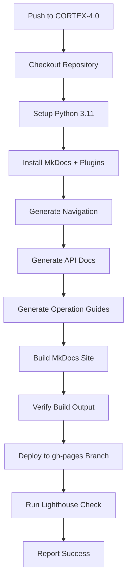

# 🚀 GitHub Pages Deployment Guide

**Date:** December 27, 2025  
**Author:** Asif Hussain  
**Status:** ✅ Ready for Deployment

---

## ✅ Changes Made

### 1. Updated `.github/workflows/deploy-docs.yml`

**Commit:** `143205b3f` - "feat(ci): Enable GitHub Pages deployment for CORTEX-4.0"

**Changes:**
- ✅ Added `CORTEX-4.0` branch to deployment triggers
- ✅ Added `main` branch to deployment triggers
- ✅ Fixed workflow linting errors (removed invalid `job.duration` reference)
- ✅ Updated Lighthouse performance check conditions
- ✅ Enabled `workflow_dispatch` for manual triggers

### 2. Git Status
- **Branch:** CORTEX-4.0
- **Status:** All changes committed and pushed to origin
- **Commit Hash:** 143205b3f

---

## 🔧 Required GitHub Repository Settings

### Step 1: Enable GitHub Pages

1. **Navigate to Settings:**
   ```
   https://github.com/asifhussain60/CORTEX/settings/pages
   ```

2. **Configure Source:**
   - **Source:** Deploy from a branch
   - **Branch:** `gh-pages`
   - **Folder:** `/ (root)`
   - Click **Save**

3. **Expected Result:**
   - GitHub will show: "Your site is ready to be published at https://asifhussain60.github.io/CORTEX/"

### Step 2: Verify Workflow Permissions

1. **Navigate to Actions Settings:**
   ```
   https://github.com/asifhussain60/CORTEX/settings/actions
   ```

2. **Under "Workflow permissions", ensure:**
   - ✅ "Read and write permissions" is selected
   - ✅ "Allow GitHub Actions to create and approve pull requests" is checked

3. **Click:** Save (if any changes were made)

---

## 🎯 Trigger Deployment

### Option 1: Automatic Trigger (Recommended for Future Updates)

Any push to `docs/` directory on `CORTEX-4.0` will automatically trigger deployment:

```bash
# Make documentation changes
git add docs/
git commit -m "docs: Update documentation"
git push origin CORTEX-4.0
```

### Option 2: Manual Trigger (For Initial Deployment)

1. **Navigate to Workflow:**
   ```
   https://github.com/asifhussain60/CORTEX/actions/workflows/deploy-docs.yml
   ```

2. **Trigger Workflow:**
   - Click the **"Run workflow"** dropdown button (top right)
   - Select branch: **CORTEX-4.0**
   - Click the green **"Run workflow"** button

3. **Monitor Progress:**
   - The workflow will appear in the Actions list
   - Click on it to see real-time logs
   - Deployment takes approximately 3-5 minutes

### Option 3: Using GitHub CLI (Advanced)

If you have GitHub CLI installed:

```bash
# Trigger deployment
gh workflow run deploy-docs.yml --ref CORTEX-4.0

# Check deployment status
gh run list --workflow=deploy-docs.yml --limit 5

# View workflow logs
gh run view --log
```

**Install GitHub CLI:**
```bash
brew install gh
gh auth login
```

---

## 📝 Deployment URL

Once deployed, your documentation will be available at:

**🌐 https://asifhussain60.github.io/CORTEX/**

### Direct Links:
- **Main Site:** https://asifhussain60.github.io/CORTEX/
- **Story Viewer:** https://asifhussain60.github.io/CORTEX/story/viewer.html
- **SKULL Rulebook:** https://asifhussain60.github.io/CORTEX/governance/skull-rulebook.html

---

## 🔍 Monitor Deployment

### GitHub Actions Dashboard

1. **View All Workflows:**
   ```
   https://github.com/asifhussain60/CORTEX/actions
   ```

2. **Look For:**
   - Workflow name: "Deploy Documentation to GitHub Pages"
   - Status: ✅ (green check) = Success
   - Status: 🔄 (yellow circle) = In progress
   - Status: ❌ (red X) = Failed

3. **View Logs:**
   - Click on the workflow run
   - Click on "build-and-deploy" job
   - Expand steps to see detailed logs

### Deployment Steps (What Happens)



---

## 🎨 What Gets Deployed

### Automated Build Process

1. **✅ Intelligent Navigation Generation**
   - Auto-discovers all markdown files in `docs/`
   - Creates hierarchical navigation structure
   - Updates `mkdocs.yml` navigation

2. **✅ API Reference Pages**
   - Scans Python modules in `src/`
   - Generates API documentation
   - Saves to `docs/api/`

3. **✅ Operation Guides**
   - Reads `cortex-operations.yaml`
   - Generates guide pages
   - Saves to `docs/operations/guides/`

4. **✅ MkDocs Site Build**
   - Compiles all markdown to HTML
   - Applies Material theme
   - Minifies assets
   - Optimizes for performance

5. **✅ GitHub Pages Deployment**
   - Pushes to `gh-pages` branch
   - Force orphan commit (clean history)
   - Updates live site

6. **✅ Performance Check**
   - Runs Lighthouse audit
   - Reports performance metrics
   - Uploads artifacts

---

## 📊 Features Included

### Theme & Design
- 📱 **Responsive Design** - Works on all devices
- 🎨 **Material Design** - Modern, clean interface
- 🌙 **Dark Mode** - Automatic theme switching
- 🎯 **Custom Branding** - CORTEX logo and colors

### Navigation & Search
- 🔍 **Full-Text Search** - Instant search across all docs
- 🧭 **Smart Navigation** - Auto-generated from structure
- 📑 **Table of Contents** - Right sidebar navigation
- 🔗 **Cross-References** - Linked documentation

### Content Features
- 📊 **Mermaid Diagrams** - Flowcharts and diagrams
- 💻 **Syntax Highlighting** - Code blocks with highlighting
- 📝 **Markdown Extensions** - Admonitions, tabs, tables
- 🏷️ **Tags & Categories** - Organized content

### Performance
- ⚡ **Minified Assets** - Compressed CSS/JS
- 🚀 **Fast Loading** - Optimized images and resources
- 📦 **CDN Ready** - GitHub Pages CDN distribution
- 🏆 **Lighthouse Score** - Performance monitoring

---

## 🐛 Troubleshooting

### Issue: Workflow Not Triggering

**Symptom:** No workflow run appears after pushing

**Solutions:**
1. Check if changes are in `docs/` directory (required for auto-trigger)
2. Verify workflow file is on CORTEX-4.0 branch
3. Check Actions tab for disabled workflows
4. Use manual trigger as alternative

### Issue: Build Fails - Site Directory Not Found

**Symptom:** Error: "Build failed - site directory not found"

**Solutions:**
1. Check MkDocs configuration in `mkdocs.yml`
2. Verify all required plugins are installed
3. Look for Python errors in build logs
4. Test build locally: `mkdocs build --verbose`

### Issue: Deploy Succeeds but Site Shows 404

**Symptom:** Deployment succeeds but site is not accessible

**Solutions:**
1. Verify GitHub Pages is enabled in repository settings
2. Check that `gh-pages` branch exists
3. Wait 2-3 minutes for CDN propagation
4. Verify base URL in `mkdocs.yml` matches repository name

### Issue: Permission Denied During Deploy

**Symptom:** Error: "Permission denied" or "Token not valid"

**Solutions:**
1. Check workflow permissions in repository settings
2. Verify "Read and write permissions" is enabled
3. Check if repository is private (may need PAT)
4. Regenerate GITHUB_TOKEN if needed

---

## 🔄 Maintenance & Updates

### Regular Updates

**Automatic:**
- Any push to `docs/` on CORTEX-4.0 triggers rebuild
- Navigation auto-updates based on file structure
- API docs regenerate from latest code

**Manual:**
- Use workflow dispatch for on-demand builds
- Update `mkdocs.yml` for theme customization
- Modify workflow for additional build steps

### Version Control

**gh-pages Branch:**
- Contains only built site files
- Uses force orphan commits (no history)
- Automatically managed by workflow

**Source Branches:**
- CORTEX-4.0: Primary development branch
- main: Production stable branch
- Both trigger deployments when docs change

---

## 📚 Additional Resources

### MkDocs Documentation
- **Official Docs:** https://www.mkdocs.org/
- **Material Theme:** https://squidfunk.github.io/mkdocs-material/

### GitHub Pages
- **Official Guide:** https://docs.github.com/en/pages
- **Custom Domains:** https://docs.github.com/en/pages/configuring-a-custom-domain-for-your-github-pages-site

### CORTEX Documentation
- **Local Development:** `./scripts/launch_docs.sh`
- **Build Locally:** `mkdocs build`
- **Serve Locally:** `mkdocs serve` (port 8000)

---

## ✅ Next Steps

1. **⚡ IMMEDIATE:** Enable GitHub Pages in repository settings
2. **⚡ IMMEDIATE:** Trigger manual workflow deployment
3. **🔍 MONITOR:** Watch deployment progress in Actions tab
4. **🌐 VERIFY:** Visit https://asifhussain60.github.io/CORTEX/ after 5 minutes
5. **📝 DOCUMENT:** Bookmark deployment URLs for easy access

---

**Status:** Ready for deployment  
**Action Required:** Enable GitHub Pages + Trigger workflow  
**Estimated Time:** 5-10 minutes total
