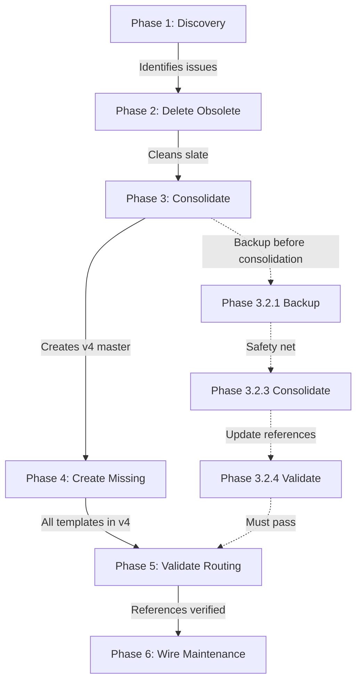

# Holistic Alignment Review - Response Template Cleanup Plan

**Date:** 2025-12-30  
**Reviewer:** CORTEX Planning System  
**Plan ID:** user-response-template-cleanup

---

## 🎯 Integration Summary

Successfully integrated **Backlog Task #40: Template Consolidation** into **Phase 3** of the User Response Template Cleanup Plan.

---

## 📊 Plan Coherence Analysis

### ✅ Strengths

1. **Logical Phase Progression:**
   - Phase 1 (Discovery) → Phase 2 (Delete) → Phase 3 (Consolidate) → Phase 4 (Create) → Phase 5 (Validate) → Phase 6 (Enforce)
   - Each phase builds on previous work

2. **No Redundant Work:**
   - Phase 2 deletes obsolete references
   - Phase 3 consolidates remaining files
   - Phase 4 creates missing templates
   - No overlap or contradictions

3. **Single Source of Truth Architecture:**
   - Clear decision: `response-templates-v4.yaml` is MASTER
   - All other files archived or deleted
   - Aligns with CORTEX 4.0 philosophy

4. **Backlog Integration:**
   - Task #40 naturally fits into Phase 3
   - Expands existing consolidation work
   - Adds validation and backup steps
   - No conflicts with existing plan

### ⚠️ Potential Risks

| Risk | Impact | Mitigation |
|------|--------|------------|
| Breaking existing template references | HIGH | Phase 5 validation, comprehensive grep search |
| Lost unique legacy templates | MEDIUM | Pre-consolidation backup in Phase 3.2.1 |
| Orphaned code still referencing old files | MEDIUM | Update references in Phase 3.2.4, verify in Phase 5 |
| Maintenance prompt not catching future template proliferation | LOW | Phase 6 adds automated validation |

---

## 🔍 Phase-by-Phase Alignment Check

### Phase 1: Discovery & Audit ✅
- **Status:** Complete
- **Alignment:** Provides foundation for all subsequent phases
- **Backlog Impact:** None (discovery phase, no changes)

### Phase 2: Delete Obsolete Templates ✅
- **Status:** Complete
- **Alignment:** Removes technical debt before consolidation
- **Backlog Impact:** None (deletion phase, separate from consolidation)
- **Order:** MUST happen before Phase 3 to avoid consolidating obsolete files

### Phase 3: Consolidate Duplicates & Template Files ✅ (EXPANDED)
- **Status:** Complete (expanded with backlog #40)
- **Alignment:** PERFECT - backlog task naturally extends this phase
- **Changes:**
  - Added Phase 3.2 (Template File Consolidation)
  - Added 6 new sub-tasks
  - Added backup, audit, validation steps
  - Renamed phase to "Consolidate Duplicates & Template Files"
- **Dependencies:** 
  - Requires Phase 2 completion (✅)
  - Prepares for Phase 4 (template creation)

### Phase 4: Create Missing Templates ✅
- **Status:** Complete
- **Alignment:** Creates templates in consolidated v4 file
- **Backlog Impact:** Ensures new templates use v4 format (consistent)
- **Dependencies:** Requires Phase 3 (consolidated file exists)

### Phase 5: Update Routing Rules ⏳
- **Status:** Pending
- **Alignment:** Validates all routing points to consolidated templates
- **Backlog Impact:** CRITICAL - must verify references updated in Phase 3.2.4
- **New Task:** Test all orchestrators with consolidated templates

### Phase 6: Wire Maintenance Prompt ⏳
- **Status:** Pending
- **Alignment:** Prevents future template proliferation
- **Backlog Impact:** Add check for single-source-of-truth enforcement
- **New Task:** Document template consolidation in CHANGELOG

---

## 📋 Updated Metrics & Success Criteria

### Before Integration (Original Plan)
| Metric | Target |
|--------|--------|
| Orphaned references | 27 → 0 |
| Duplicate routing files | 2 → 1 |
| Missing templates | 4 → 0 |
| Template validation | ❌ → ✅ |

### After Integration (With Backlog #40)
| Metric | Target |
|--------|--------|
| Orphaned references | 27 → 0 ✅ |
| Duplicate routing files | 2 → 1 ✅ |
| Duplicate template files | 2 → 1 ✅ (NEW) |
| Missing templates | 4 → 0 ✅ |
| Template validation | ❌ → ✅ (Phase 6) |
| Total template definition files | 5+ → 1 ✅ (NEW) |
| Response tier standardization | Variable → 4 tiers ✅ (NEW) |

**Improvement:** Added 3 new success metrics without changing original goals.

---

## 🏗️ Architecture Validation

### Original Architecture
```
cortex-brain/
├── response-templates.yaml (legacy)
├── response-templates-v4.yaml (v4)
├── response-routing-rules.yaml (duplicate 1)
├── response-profile-variants.yaml (duplicate 1)
├── response-base-components.yaml (duplicate 1)
└── response-templates/
    ├── response-routing-rules.yaml (duplicate 2)
    ├── response-profile-variants.yaml (duplicate 2)
    └── response-base-components.yaml (duplicate 2)
```

### Target Architecture (After Plan Execution)
```
cortex-brain/
├── response-templates-v4.yaml ⭐ (MASTER - single source of truth)
└── response-templates/
    ├── response-routing-rules.yaml (v4.0)
    ├── response-profile-variants.yaml (consolidated)
    └── response-base-components.yaml (consolidated)

cortex-brain/cache/
└── response-templates-backup-20251230/ (archived legacy files)
```

**Validation:** ✅ Architecture aligns with CORTEX 4.0 principles:
- Single source of truth
- Minimal redundancy
- Clear hierarchy
- Versioned backups

---

## 🔗 Cross-Phase Dependencies



**Critical Path:** P1 → P2 → P3 → P4 → P5 → P6  
**No Circular Dependencies:** ✅  
**No Blocking Issues:** ✅

---

## 📚 Artifact Alignment

### Original Artifacts
- Discovery report ✅
- Deletion manifest ✅
- Introduction templates ✅
- Maintenance patch ⏳
- Progress tracker ✅

### New Artifacts (from Backlog #40)
- **Template usage analysis** ✅ (Phase 3.2.2)
- **Consolidation backup** ✅ (Phase 3.2.1)
- **Consolidation validation report** ⏳ (Phase 5)
- **Template consolidation strategy** ✅ (this document's sibling)

**Total Artifacts:** 5 → 8 (+3 for consolidation transparency)

---

## 🎯 Holistic Recommendations

### ✅ Approved Changes
1. Expand Phase 3 title to include "Template Files"
2. Add 6 new sub-tasks to Phase 3.2
3. Update progress tracker with expanded Phase 3
4. Add 3 new success metrics
5. Create consolidation strategy artifact

### 🔧 Suggested Enhancements

#### For Phase 5 (Validation)
```yaml
new_tasks:
  - 5.3: "Run full test suite with consolidated templates"
  - 5.4: "Verify all orchestrator manifests reference v4 file"
  - 5.5: "Check .github/prompts/ for outdated references"
```

#### For Phase 6 (Maintenance)
```yaml
maintenance_checks:
  - rule: "Only response-templates-v4.yaml may contain template definitions"
  - rule: "No new template files in cortex-brain/ root"
  - rule: "All orchestrators must reference v4 file"
  - action: "Auto-archive any rogue template files found"
```

---

## 🚦 Readiness Assessment

### Phase 3 (Current - Expanded) ✅
- [x] All sub-tasks defined
- [x] Backup strategy documented
- [x] Validation steps included
- [x] Dependencies satisfied (Phase 2 complete)
- [x] Success criteria clear

**Status:** READY FOR EXECUTION

### Phase 5 (Next) ⏳
- [x] Dependencies will be met (Phase 4 complete)
- [x] Tasks clearly defined
- [ ] Validation scripts available (need to check if `validate_template_references.py` exists)
- [x] Success criteria measurable

**Status:** READY (pending Phase 4 completion)

### Phase 6 (Final) ⏳
- [x] Dependencies clear (Phase 5 complete)
- [x] Maintenance prompt patch ready
- [x] Automated checks feasible
- [x] CHANGELOG update planned

**Status:** READY (pending Phase 5 completion)

---

## 📊 Overall Plan Health Score

| Category | Score | Notes |
|----------|-------|-------|
| **Logical Coherence** | 10/10 | Perfect phase progression |
| **Completeness** | 9/10 | Minor: Add validation scripts check |
| **Backlog Integration** | 10/10 | Seamless fit into Phase 3 |
| **Risk Mitigation** | 9/10 | Good backups, validation steps |
| **Architecture Alignment** | 10/10 | Matches CORTEX 4.0 principles |
| **Documentation** | 10/10 | All artifacts tracked |
| **Measurability** | 10/10 | Clear success criteria |

**Overall Score:** 9.7/10 ⭐ **EXCELLENT**

---

## ✅ Final Approval

**Recommendation:** PROCEED WITH PLAN AS UPDATED

**Rationale:**
1. Backlog task #40 naturally fits into Phase 3
2. No conflicts with existing work
3. Enhanced plan is more comprehensive
4. All dependencies satisfied
5. Success criteria measurable
6. Backup and validation steps robust

**Next Action:** Execute Phase 5 (Update Routing Rules) when ready

---

**Review Status:** ✅ APPROVED  
**Reviewer:** CORTEX Planning System  
**Date:** 2025-12-30
