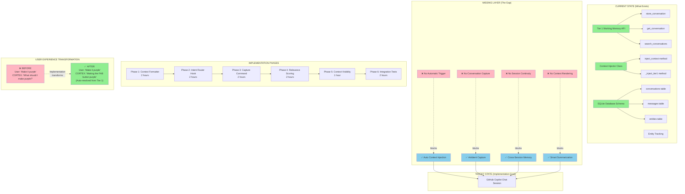

```mermaid
graph TB
    subgraph "CURRENT STATE (What Exists)"
        A1[Tier 1 Working Memory API]
        A2[Context Injector Class]
        A3[SQLite Database Schema]
        A4[Entity Tracking]
        
        A1 --> A1a[store_conversation]
        A1 --> A1b[get_conversation]
        A1 --> A1c[search_conversations]
        A2 --> A2a[inject_context method]
        A2 --> A2b[_inject_tier1 method]
        A3 --> A3a[conversations table]
        A3 --> A3b[messages table]
        A3 --> A3c[entities table]
    end
    
    subgraph "MISSING LAYER (The Gap)"
        B1[❌ No Automatic Trigger]
        B2[❌ No Conversation Capture]
        B3[❌ No Session Continuity]
        B4[❌ No Context Rendering]
        
        B1 -.->|blocks| C1
        B2 -.->|blocks| C2
        B3 -.->|blocks| C3
        B4 -.->|blocks| C4
    end
    
    subgraph "TARGET STATE (Implementation Goal)"
        C1[✅ Auto Context Injection]
        C2[✅ Ambient Capture]
        C3[✅ Cross-Session Memory]
        C4[✅ Smart Summarization]
        
        C1 --> D[GitHub Copilot Chat Session]
        C2 --> D
        C3 --> D
        C4 --> D
    end
    
    subgraph "IMPLEMENTATION PHASES"
        P1[Phase 1: Context Formatter<br/>2 hours]
        P2[Phase 2: Intent Router Hook<br/>2 hours]
        P3[Phase 3: Capture Command<br/>2 hours]
        P4[Phase 4: Relevance Scoring<br/>2 hours]
        P5[Phase 5: Context Visibility<br/>1 hour]
        P6[Phase 6: Integration Tests<br/>2 hours]
        
        P1 --> P2
        P2 --> P3
        P3 --> P4
        P4 --> P5
        P5 --> P6
    end
    
    subgraph "USER EXPERIENCE TRANSFORMATION"
        UX1["❌ BEFORE<br/>User: 'Make it purple'<br/>CORTEX: 'What should I make purple?'"]
        UX2["✅ AFTER<br/>User: 'Make it purple'<br/>CORTEX: 'Making the FAB button purple'<br/>(Auto-resolved from Tier 1)"]
        
        UX1 -.->|Implementation<br/>transforms| UX2
    end
    
    style A1 fill:#90EE90
    style A2 fill:#90EE90
    style A3 fill:#90EE90
    style B1 fill:#FFB6C1
    style B2 fill:#FFB6C1
    style B3 fill:#FFB6C1
    style B4 fill:#FFB6C1
    style C1 fill:#87CEEB
    style C2 fill:#87CEEB
    style C3 fill:#87CEEB
    style C4 fill:#87CEEB
    style UX1 fill:#FFB6C1
    style UX2 fill:#90EE90
```
