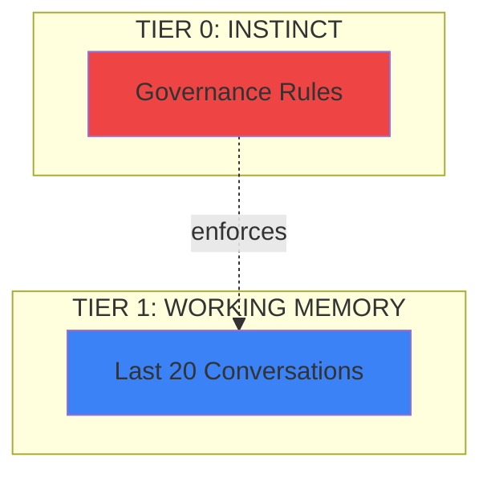

# CORTEX Diagram Regeneration System

**Generated:** November 17, 2025  
**Author:** Asif Hussain  
**Version:** 1.0

---

## Overview

The CORTEX Diagram Regeneration System is a comprehensive solution for maintaining up-to-date visual documentation. It automatically analyzes the current CORTEX implementation, identifies powerful features, and generates a complete suite of professional diagrams and illustration prompts.

## Key Features

### 1. Fresh Design Analysis
- **Scans entire CORTEX codebase** to identify implemented features
- **Discovers new capabilities** not yet documented visually
- **Prioritizes features** by visual impact (1-10 scale)
- **Extracts key components** and use cases automatically

### 2. Complete Regeneration (Not Updates)
- **Clears all existing files** in diagram folders before generating
- **Generates everything from scratch** ensuring consistency
- **No stale content** - only current, accurate visualizations
- **Three output categories**: Mermaid diagrams, illustration prompts, narratives

### 3. Professional Illustration Prompts
- **Crisp, technical style** optimized for DALL-E 3, Midjourney, Stable Diffusion
- **Developer-focused scenarios** showing CORTEX + Copilot workflows
- **Consistent visual language** across all illustrations
- **Actionable prompts** ready to use without modification

### 4. Comprehensive Coverage
Generates 15+ diagram types:
- Five-tier cognitive architecture
- Dual-hemisphere agent system
- Test-Driven Development workflow
- Intent routing and agent coordination
- Conversation memory and knowledge graph
- Brain protection layers
- Token optimization strategies
- Feature completion orchestration
- Before/after CORTEX comparisons

## Architecture

### Components

```
┌─────────────────────────────────────────────────────────────┐
│         CORTEX Diagram Regeneration Operation               │
└─────────────────────────────────────────────────────────────┘
                            │
                ┌───────────┴───────────┐
                │                       │
        ┌───────▼──────────┐   ┌───────▼──────────┐
        │  Design Analyzer  │   │ Diagram Generator │
        │                   │   │                   │
        │ • Scan codebase  │   │ • Create Mermaid  │
        │ • Find features  │   │ • Write prompts   │
        │ • Prioritize     │   │ • Add narratives  │
        └──────────────────┘   └───────────────────┘
                 │                       │
                 └──────────┬────────────┘
                            │
                ┌───────────▼───────────┐
                │   File Generator      │
                │                       │
                │ • Clear folders       │
                │ • Save .mmd files     │
                │ • Save .md prompts    │
                │ • Save narratives     │
                └───────────────────────┘
```

### Data Flow

1. **Analysis Phase**
   - Scan `src/agents/` for agent implementations
   - Scan `src/operations/` for operation modules
   - Check `cortex-brain/` for brain structure
   - Identify key features with metadata

2. **Generation Phase**
   - Create DiagramSpec for each identified feature
   - Generate Mermaid syntax for technical diagrams
   - Write illustration prompts for AI image generation
   - Compose narrative explanations

3. **Output Phase**
   - Clear `docs/diagrams/mermaid/` folder
   - Clear `docs/diagrams/prompts/` folder
   - Clear `docs/diagrams/narratives/` folder
   - Write all new files with timestamps

## Usage

### Command Line

```bash
# Using natural language
cortex regenerate diagrams

# Using operation ID
cortex execute regenerate_diagrams

# With Python
python test_diagram_regeneration.py
```

### Programmatic

```python
from src.operations import execute_operation
from pathlib import Path

report = execute_operation(
    'regenerate_diagrams',
    profile='standard',
    project_root=Path('/path/to/CORTEX')
)

if report.status == 'success':
    print(f"Generated {report.data['diagrams_generated']} diagrams")
    print(f"Created {report.data['files_created']['total_files']} files")
```

## Output Structure

### Mermaid Diagrams (`docs/diagrams/mermaid/`)

**File Format:** `{diagram-id}.mmd`

Example: `01-tier-architecture.mmd`



### Illustration Prompts (`docs/diagrams/prompts/`)

**File Format:** `{diagram-id}-prompt.md`

Example: `01-tier-architecture-prompt.md`

```markdown
# Five-Tier Cognitive Architecture

**Type:** architecture  
**Priority:** 10/10

## Illustration Prompt

Professional technical illustration: Five-tier cognitive architecture 
inspired by human brain structure...

[Detailed prompt with style specifications]

## Usage Notes

- Platform: DALL-E 3, Midjourney, or similar
- Recommended resolution: 1792x1024
- Style: Professional technical illustration
- Output format: PNG with transparent background
```

### Narratives (`docs/diagrams/narratives/`)

**File Format:** `{diagram-id}-narrative.md`

Example: `01-tier-architecture-narrative.md`

```markdown
# Five-Tier Cognitive Architecture

## Visual Narrative

CORTEX's five-tier architecture mimics human cognitive processing...

[Detailed explanation connecting diagram to user benefits]

## Key Concepts

Brain-inspired memory system with five specialized tiers

## Developer Impact

This visualization helps developers understand how CORTEX enhances 
their workflow with GitHub Copilot by providing:
- Clear mental models of complex systems
- Visual reference for feature capabilities
- Intuitive understanding of data flow
```

## Feature Discovery Process

The analyzer identifies CORTEX features through multiple strategies:

### 1. **File-Based Discovery**
- Scans `src/agents/*.py` for agent implementations
- Counts operation modules in `src/operations/`
- Checks for FCO components (Feature Completion Orchestrator)
- Detects brain protection rules in `cortex-brain/`

### 2. **Architecture Analysis**
- Identifies tier structure (Tier 0-4)
- Discovers dual-hemisphere design
- Maps corpus callosum coordination
- Tracks memory systems (working memory, knowledge graph)

### 3. **Capability Extraction**
- TDD enforcement mechanisms
- Token optimization strategies
- Natural language processing
- Intent detection and routing

### 4. **Priority Assignment**
Visual impact scoring (1-10):
- **10**: Core architectural innovations (five tiers, dual hemispheres)
- **9**: Major workflow features (FCO, conversation memory)
- **8**: Quality systems (TDD, brain protection)
- **7**: Optimization features (token reduction)
- **5**: Supporting features (plugins, utilities)

## Diagram Types Generated

### 1. **Architecture Diagrams**
- Five-tier cognitive architecture (priority 10)
- Dual-hemisphere agent system (priority 9)
- Brain protection layers (priority 8)
- Operations system (priority 8)

### 2. **Workflow Diagrams**
- TDD workflow (RED → GREEN → REFACTOR) (priority 8)
- Feature planning workflow (priority 7)
- Agent coordination sequence (priority 8)
- Complete data flow (priority 9)

### 3. **Memory System Diagrams**
- Conversation memory flow (priority 9)
- Knowledge graph structure (priority 8)
- Context intelligence (priority 8)

### 4. **Optimization Diagrams**
- Token optimization (priority 7)
- Performance benchmarks (priority 7)

### 5. **Comparison Diagrams**
- Before/after CORTEX (priority 8)
- Plugin system architecture (priority 6)

## Professional Illustration Style Guide

All illustration prompts follow these guidelines:

### Visual Style
- **Clean, modern technical aesthetic**
- **Isometric 3D perspective** for architectural views
- **Professional color palette** matching CORTEX branding
- **Glowing connections** for data flows
- **Subtle gradients** for depth

### Color Scheme
- **Tier 0 (Instinct):** Red (#EF4444) - immutable, critical
- **Tier 1 (Working Memory):** Blue (#3B82F6) - active, dynamic
- **Tier 2 (Knowledge Graph):** Green (#10B981) - growth, learning
- **Tier 3 (Context Intelligence):** Orange (#F59E0B) - awareness, insight
- **Tier 4 (Events):** Purple (#6B46C1) - real-time, streaming

### Agent Representation
- **Left Hemisphere:** Blue gradient, tactical, precise robots
- **Right Hemisphere:** Orange gradient, strategic, analytical figures
- **Corpus Callosum:** Green, glowing message highway

### Metaphors
- **Brain structure** for memory systems
- **Neural pathways** for connections
- **Traffic lights** for TDD workflow (RED → GREEN → BLUE)
- **Shields** for protection layers
- **Graphs/networks** for knowledge structure

## Developer Benefits

### Why This Matters

**Problem:** Outdated diagrams become misleading as code evolves

**Solution:** Fresh analysis ensures diagrams always reflect reality

**Impact:**
- **Onboarding:** New developers see accurate architecture
- **Decision-making:** Current diagrams inform design choices
- **Documentation:** Visual assets enhance understanding
- **Marketing:** Professional illustrations showcase capabilities

### Use Cases

1. **README Updates**
   - Replace old diagrams with fresh Mermaid visualizations
   - Add AI-generated illustrations for visual appeal
   - Include narratives for context

2. **Documentation Sites**
   - Embed Mermaid diagrams in MkDocs/Docusaurus
   - Use illustration prompts to generate hero images
   - Link narratives as explainer content

3. **Presentations**
   - Export diagrams for slides
   - Generate high-res illustrations for presentations
   - Use narratives as speaker notes

4. **Training Materials**
   - Include diagrams in onboarding guides
   - Use illustrations for concept explanations
   - Leverage narratives for learning paths

## Integration with CORTEX Operations

The diagram regeneration operation integrates seamlessly with CORTEX:

### Natural Language Support
```
"regenerate diagrams"
"refresh all diagrams"
"update visual assets"
"create new diagrams"
```

### Operation Metadata
```yaml
operation_id: regenerate_diagrams
name: Regenerate All Diagrams
category: documentation
deployment_tier: developer
modules:
  - diagram_regeneration
```

### Execution Phases
1. **INITIALIZATION** - Load analyzer and generator
2. **PROCESSING** - Analyze features and generate diagrams
3. **VALIDATION** - Verify file creation
4. **COMPLETION** - Generate report

## Extension Points

The system is designed for easy extension:

### Adding New Diagram Types

```python
def _generate_custom_diagram(self, features: List[CortexFeature]) -> DiagramSpec:
    """Generate custom diagram"""
    mermaid = """..."""
    
    illustration_prompt = """..."""
    
    narrative = """..."""
    
    return DiagramSpec(
        diagram_id="99-custom-diagram",
        title="Custom Feature Visualization",
        diagram_type="both",
        content_type="custom",
        description="...",
        mermaid_syntax=mermaid,
        illustration_prompt=illustration_prompt,
        narrative=narrative,
        priority=5
    )
```

### Adding Feature Detection

```python
# In CortexDesignAnalyzer.analyze_cortex_features()

# Add custom feature detection
if (self.src_path / "custom" / "feature.py").exists():
    features.append(CortexFeature(
        name="Custom Feature",
        category="custom",
        description="Description of custom feature",
        visual_impact=7,
        implementation_status="production",
        key_components=["component1", "component2"],
        use_cases=["use case 1", "use case 2"]
    ))
```

### Customizing Output Format

```python
# In _save_diagrams() method

# Add custom output format
if diagram.custom_format:
    custom_file = base_path / "custom" / f"{diagram.diagram_id}.custom"
    custom_file.write_text(diagram.custom_content)
```

## Performance Characteristics

### Execution Time
- **Analysis Phase:** 2-3 seconds (codebase scan)
- **Generation Phase:** 5-10 seconds (15+ diagrams)
- **Output Phase:** 1-2 seconds (file writing)
- **Total:** ~8-15 seconds for complete regeneration

### Resource Usage
- **Memory:** ~50-100MB during execution
- **Disk:** ~200-500KB for all output files
- **CPU:** Minimal (mostly I/O bound)

### Scalability
- Linear scaling with number of features
- Efficient file operations (batch writes)
- No external dependencies (pure Python)

## Troubleshooting

### Common Issues

**Issue:** No diagrams generated

**Solution:** Check that CORTEX features are detected:
```python
analyzer = CortexDesignAnalyzer(cortex_root)
features = analyzer.analyze_cortex_features()
print(f"Found {len(features)} features")
```

**Issue:** Files not written

**Solution:** Verify folder permissions:
```bash
ls -la docs/diagrams/mermaid/
ls -la docs/diagrams/prompts/
ls -la docs/diagrams/narratives/
```

**Issue:** Mermaid syntax errors

**Solution:** Validate Mermaid diagrams:
- Use https://mermaid.live to test syntax
- Check for proper indentation
- Verify arrow syntax (`-->` vs `-.->`)

## Future Enhancements

### Planned Features

1. **AI Image Generation Integration**
   - Direct API calls to DALL-E 3, Midjourney
   - Automatic image download and storage
   - Image versioning and comparison

2. **Interactive Diagrams**
   - D3.js conversions for web embedding
   - Clickable elements with tooltips
   - Zoom/pan capabilities

3. **Diagram Versioning**
   - Git-tracked diagram history
   - Diff visualization between versions
   - Rollback capability

4. **Multi-Format Export**
   - SVG, PNG, PDF export for Mermaid diagrams
   - PlantUML conversion support
   - Graphviz integration

5. **Custom Templates**
   - User-defined diagram templates
   - Pluggable generators
   - Theme support

## Conclusion

The CORTEX Diagram Regeneration System ensures that visual documentation stays synchronized with code evolution. By performing fresh analysis on every run, it eliminates the problem of stale diagrams while providing professional illustration prompts and comprehensive narratives.

**Key Takeaways:**
- ✅ Always up-to-date diagrams
- ✅ Professional illustration prompts ready for AI generation
- ✅ Comprehensive narratives for user understanding
- ✅ Easy integration with CORTEX operations
- ✅ Extensible architecture for custom diagrams

---

**Next Steps:**
1. Run `test_diagram_regeneration.py` to verify installation
2. Execute `cortex regenerate diagrams` to generate visuals
3. Review output in `docs/diagrams/` folders
4. Use illustration prompts with AI image generators
5. Integrate diagrams into documentation

**Questions?** See `src/operations/diagram_regeneration_operation.py` for implementation details.

---

*Generated by CORTEX Diagram Regeneration System v1.0*  
*Author: Asif Hussain | © 2024-2025 | github.com/asifhussain60/CORTEX*
