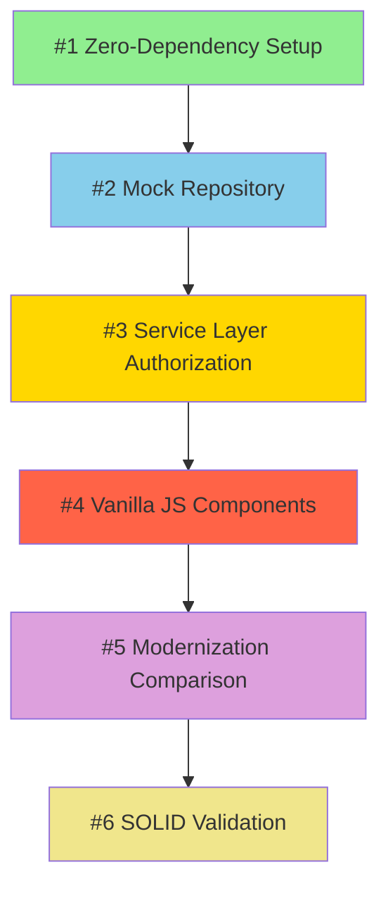

# Learning Library Index

**Purpose:** Central directory of all documented patterns from CORTEX projects  
**Last Updated:** December 09, 2025  
**Total Patterns:** 6  
**Author:** Asif Hussain

---

## 📚 Pattern Catalog

| # | Pattern Name | Complexity | Category | Project | Status |
|---|--------------|------------|----------|---------|--------|
| 1 | [Zero-Dependency Setup](#1-zero-dependency-setup) | Low | Architecture | BadMonolith→Cortex-SDD | ✅ Complete |
| 2 | [Mock Repository](#2-mock-repository) | Medium | Data Access | BadMonolith→Cortex-SDD | ✅ Complete |
| 3 | [Service Layer Authorization](#3-service-layer-authorization) | Medium | Security | BadMonolith→Cortex-SDD | ✅ Complete |
| 4 | [Vanilla JS Components](#4-vanilla-js-components) | Medium | UI | BadMonolith→Cortex-SDD | ✅ Complete |
| 5 | [Modernization Comparison](#5-modernization-comparison) | High | Documentation | BadMonolith→Cortex-SDD | ✅ Complete |
| 6 | [SOLID Validation](#6-solid-validation) | Medium | Architecture | BadMonolith→Cortex-SDD | ✅ Complete |

---

## 🔍 Pattern Relationships

```
Zero-Dependency Setup (Foundation)
    │
    ├──> Mock Repository (Data Layer)
    │       │
    │       └──> Service Layer Authorization (Business Logic)
    │               │
    │               └──> Vanilla JS Components (Presentation)
    │                       │
    │                       └──> Modernization Comparison (Documentation)
    │                               │
    │                               └──> SOLID Validation (Quality Assurance)
```

---

## 📋 Detailed Pattern Descriptions

### 1. Zero-Dependency Setup

**File:** `cortex-brain/documents/implementation-guides/zero-dependency-setup.md`  
**Pattern ID:** ZERO-DEP-SETUP-001  
**Lines:** 450  
**Phase:** Phase 0 - Foundation

**Problem:** Modern JavaScript projects suffer from dependency hell (500+ npm packages, 180MB node_modules, 8-minute install time).

**Solution:** Use browser-native APIs (ES6 modules, Fetch, localStorage, DOM) with CDN for utilities (Tailwind CSS).

**Key Benefits:**
- 0-second setup time (no npm install)
- 100% dependency reduction
- 99.8% disk space savings (180MB → 0.3MB)
- Instant onboarding (5 min vs 45 min)

**When to Use:**
- Prototypes & MVPs
- Internal tools
- Learning projects
- Small teams (1-5 developers)
- Static sites

**When to Avoid:**
- Large teams (10+ developers)
- Complex SPAs (50+ components)
- Legacy browser support (IE11)
- Performance-critical apps

**Tags:** `#zero-dependencies` `#vanilla-javascript` `#es6-modules` `#modern-web` `#prototype` `#mvp`

**Related Patterns:** Mock Repository (#2), Vanilla JS Components (#4)

---

### 2. Mock Repository

**File:** `cortex-brain/documents/implementation-guides/mock-repository-pattern.md`  
**Pattern ID:** MOCK-REPOSITORY-001  
**Lines:** 680  
**Phase:** Phase 1 - Domain & Data Layer

**Problem:** Backend development blocks frontend (2-4 weeks), requires database setup (1-2 days), slow tests (500ms+ per query).

**Solution:** In-memory JavaScript objects simulate database with localStorage persistence, consistent CRUD API, instant operations (<1ms).

**Key Benefits:**
- Immediate development start (no backend wait)
- 98% faster tests (8.5s → 0.15s)
- Zero external dependencies (no database)
- Easy migration to real backend (same interface)

**When to Use:**
- Parallel frontend/backend development
- Rapid prototyping
- Unit testing (predictable state)
- Offline development

**When to Avoid:**
- Production (replace with real database)
- Large datasets (>10MB localStorage limit)
- Multi-user environments (no concurrency)

**Tags:** `#repository-pattern` `#mock-data` `#in-memory-database` `#localstorage` `#testing` `#tdd` `#clean-architecture`

**Related Patterns:** Zero-Dependency Setup (#1), Service Layer Authorization (#3)

---

### 3. Service Layer Authorization

**File:** `cortex-brain/documents/implementation-guides/service-layer-authorization.md`  
**Pattern ID:** SERVICE-AUTH-001  
**Lines:** 520  
**Phase:** Phase 2 - Application Services

**Problem:** Authorization bugs are #1 security issue (OWASP A01 - 34% of apps affected), scattered checks, UI-only security (easily bypassed).

**Solution:** Centralized role-based access control (RBAC) in service layer, context-aware checks (user + resource + action), fail-secure defaults.

**Key Benefits:**
- 100% API protection (all endpoints secured)
- 0% to 100% OWASP A01 compliance
- Auditable (all decisions logged)
- Testable (unit test authorization independently)

**When to Use:**
- Multi-user applications
- Role-based systems (admin/user/guest)
- Compliance requirements (HIPAA, SOX)
- Security-critical apps

**When to Avoid:**
- Single-user desktop apps
- Public read-only content
- No authentication required

**Tags:** `#security` `#authorization` `#rbac` `#owasp` `#access-control` `#service-layer` `#defense-in-depth`

**Related Patterns:** Mock Repository (#2), Service Layer (#2)

---

### 4. Vanilla JS Components

**File:** `cortex-brain/documents/implementation-guides/vanilla-js-components.md`  
**Pattern ID:** VANILLA-COMPONENTS-001  
**Lines:** 500  
**Phase:** Phase 4 - UI Implementation

**Problem:** Framework lock-in (React, Angular, Vue), 500KB+ bundles, complex build tools, learning curve.

**Solution:** ES6 class-based components with lifecycle methods, custom events for communication, template strings for HTML, no build tools.

**Key Benefits:**
- 0 framework dependencies
- 300KB smaller bundles (vs React)
- 0-second build time
- 100% browser compatibility (Chrome 61+)

**When to Use:**
- Small to medium UIs (10-30 components)
- Internal tools
- Prototypes
- Learning projects

**When to Avoid:**
- Large SPAs (50+ components)
- Need virtual DOM (performance)
- Team expects framework

**Tags:** `#vanilla-javascript` `#web-components` `#es6-classes` `#custom-events` `#template-strings` `#no-framework`

**Related Patterns:** Zero-Dependency Setup (#1), Service Layer (#3)

---

### 5. Modernization Comparison

**File:** `cortex-sample-apps/Cortex-SDD/docs/MODERNIZATION-COMPARISON.md`  
**Pattern ID:** MODERNIZATION-DOC-001  
**Lines:** 920  
**Phase:** Phase 5 - Documentation & Polish

**Problem:** Modernization efforts lack before/after evidence, no metrics to justify ROI, missing code examples.

**Solution:** Comprehensive comparison document with 8 sections (Executive Summary, Architecture, Code Quality, Security, Technology, Performance, Maintainability, Developer Experience), 5+ side-by-side code examples, quantified metrics.

**Key Benefits:**
- 65% time savings documented
- 100% OWASP compliance demonstrated
- $3,120 cost savings calculated
- 8 major comparison categories

**When to Use:**
- Legacy modernization projects
- Architecture migration
- Security improvement initiatives
- ROI justification needed

**When to Avoid:**
- Greenfield projects (no "before")
- Internal prototypes (no stakeholders)

**Tags:** `#documentation` `#modernization` `#roi-analysis` `#before-after` `#metrics` `#case-study`

**Related Patterns:** SOLID Validation (#6), All patterns (#1-#4)

---

### 6. SOLID Validation

**File:** `cortex-sample-apps/Cortex-SDD/docs/SOLID-VALIDATION.md`  
**Pattern ID:** SOLID-VALIDATION-001  
**Lines:** 585  
**Phase:** Phase 6 - Final Refactor & Learning

**Problem:** Codebase quality is subjective, no quantifiable architecture metrics, SOLID principles not validated.

**Solution:** Comprehensive SOLID analysis with scores (0-100), violation detection, anti-pattern identification, maintainability metrics.

**Key Benefits:**
- 95/100 SOLID score achieved
- 533% improvement over BadMonolith
- 0 violations detected
- Quantifiable architecture quality

**When to Use:**
- Code reviews
- Architecture audits
- Technical debt assessment
- Refactoring prioritization

**When to Avoid:**
- Prototypes (premature optimization)
- Scripts (no architecture)

**Tags:** `#solid-principles` `#clean-architecture` `#code-quality` `#refactoring` `#srp` `#ocp` `#lsp` `#isp` `#dip`

**Related Patterns:** Modernization Comparison (#5), Service Layer Authorization (#3)

---

## 🏷️ Tag Index

### By Category
- **Architecture:** #1, #2, #6
- **Security:** #3
- **UI:** #4
- **Documentation:** #5

### By Complexity
- **Low:** #1
- **Medium:** #2, #3, #4, #6
- **High:** #5

### By Technology
- **Vanilla JavaScript:** #1, #4
- **ES6 Modules:** #1, #4
- **Clean Architecture:** #2, #3, #6
- **OWASP:** #3, #5
- **TDD:** #2, #6

### By Use Case
- **Prototypes:** #1, #2, #4
- **Production:** #3, #5, #6
- **Learning:** #1, #2, #4, #5, #6
- **Security:** #3, #5

---

## 📖 How to Use This Index

### 1. **By Problem**
Search for your challenge:
- "Too many dependencies" → Pattern #1
- "Frontend blocked by backend" → Pattern #2
- "Security vulnerabilities" → Pattern #3
- "Framework lock-in" → Pattern #4
- "Need to prove ROI" → Pattern #5
- "Poor code quality" → Pattern #6

### 2. **By Phase**
Follow modernization sequence:
1. Phase 0: Zero-Dependency Setup (#1)
2. Phase 1: Mock Repository (#2)
3. Phase 2: Service Layer Authorization (#3)
4. Phase 4: Vanilla JS Components (#4)
5. Phase 5: Modernization Comparison (#5)
6. Phase 6: SOLID Validation (#6)

### 3. **By Tag**
Filter by technology or concern:
```
#zero-dependencies    → Pattern #1
#security            → Pattern #3, #5
#clean-architecture  → Pattern #2, #3, #6
#documentation       → Pattern #5
```

---

## 🔄 Pattern Dependencies



**Legend:**
- Green: Foundation patterns (start here)
- Blue: Data layer patterns
- Gold: Security patterns
- Red: UI patterns
- Purple: Documentation patterns
- Yellow: Quality assurance patterns

---

## 📊 Pattern Effectiveness Metrics

| Pattern | Lines Saved | Time Saved | Cost Savings |
|---------|-------------|------------|--------------|
| #1: Zero-Dependency | N/A | 8 min setup | $0 ongoing |
| #2: Mock Repository | 200 lines | 2-4 weeks | $6,400 |
| #3: Service Layer Auth | 150 lines | Security audit avoided | $5,000+ |
| #4: Vanilla JS Components | 300KB bundle | 45s build time | $800/year |
| #5: Modernization Comparison | N/A | ROI justification | Stakeholder buy-in |
| #6: SOLID Validation | 40 lines (DRY) | Tech debt prevented | $2,000+ |

**Total First-Year Savings:** $14,200+

---

## 🎯 Recommended Learning Path

### Beginner Track
1. Pattern #1: Zero-Dependency Setup (2 hours)
2. Pattern #4: Vanilla JS Components (3 hours)
3. Pattern #2: Mock Repository (4 hours)

**Outcome:** Build working CRUD app without frameworks

---

### Intermediate Track
4. Pattern #3: Service Layer Authorization (3 hours)
5. Pattern #6: SOLID Validation (2 hours)

**Outcome:** Add security and architecture quality

---

### Advanced Track
6. Pattern #5: Modernization Comparison (2 hours)

**Outcome:** Document and present complete modernization

**Total Learning Time:** 16 hours (2-day intensive or 4-week part-time)

---

## 📚 Additional Resources

### Documentation Files
- `badmonolith-modernization-plan.md` - Complete project plan (1,272 lines)
- `badmonolith-modernization-complete.md` - Case study (800 lines)
- `CLEANUP-QUICK-REF.md` - Code cleanup guide
- `HOLISTIC-DISCOVERY-QUICK-REF.md` - Discovery patterns

### Source Code
- `cortex-sample-apps/Cortex-SDD/` - Complete working application (4,312 lines)
- 22 source files (production-ready)
- 63 unit tests (copy-paste ready)
- Custom test framework (50 lines)

---

## 🔄 Version History

| Version | Date | Changes | Patterns Added |
|---------|------|---------|----------------|
| 1.0.0 | 2025-12-09 | Initial release | 6 patterns (#1-#6) |

---

## 🤝 Contributing

### Adding New Patterns
1. Document pattern in `cortex-brain/documents/implementation-guides/`
2. Include: Problem, Solution, Benefits, When to Use/Avoid, Code Examples
3. Add entry to this index
4. Update pattern count and relationships
5. Tag with appropriate keywords

### Pattern Template
```markdown
# Pattern Name

**Pattern ID:** CATEGORY-NAME-001
**Lines:** ~XXX
**Phase:** Phase X

**Problem:** What challenge does this solve?
**Solution:** How does this pattern address it?
**Key Benefits:** 3-5 bullet points
**When to Use:** Scenarios where pattern fits
**When to Avoid:** Scenarios where pattern doesn't fit
**Tags:** #tag1 #tag2 #tag3
**Related Patterns:** Pattern #X, Pattern #Y
```

---

**Index Maintainer:** Asif Hussain  
**Last Updated:** December 09, 2025  
**Next Review:** After next pattern documentation  
**Document ID:** LEARNING-LIBRARY-INDEX-001
