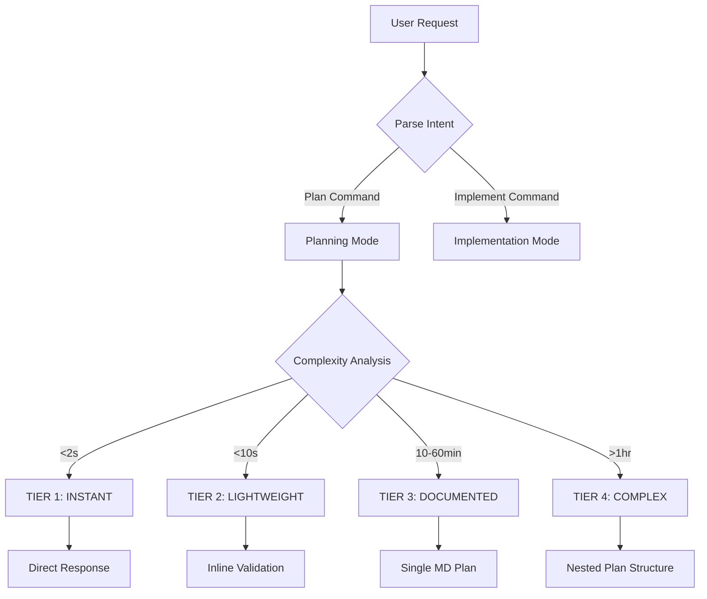

# 🎯 Orchestrator Panel Documentation Refactor Guide

**Version:** 1.0.0 | **Status:** ✅ ACTIVE  
**Author:** Asif Hussain | **Last Updated:** January 2, 2026  
**Copyright © 2026 Asif Hussain. All rights reserved.**

---

## 📋 Purpose

This document provides comprehensive specifications for generating the CORTEX Orchestrators documentation site with:
- **Level 1 Detail Pages** - Individual orchestrator deep-dives
- **Level 2 Granular Views** - Phase-by-phase breakdowns with interactive diagrams
- **Master Orchestrator Architecture** - Puppeteer pattern coordinating all orchestrators
- **Interactive Visualizations** - D3.js and Mermaid diagrams for architecture understanding

**Target Audience:** CORTEX development team generating docs/ site content

---

## 🔗 Linked Documents

| Document | Purpose | Location |
|----------|---------|----------|
| **Glassmorphism Design Standard** | UI/UX patterns and CSS classes | `cortex-brain/documents/standards/glassmorphism-design-standard.md` |
| **Level 1 Specs** | Detailed page specifications | `cortex-brain/documents/planning/active/cortex-documentation/artifacts/level1-specs/` |
| **Site Map** | Complete documentation hierarchy | `cortex-brain/documents/planning/active/cortex-documentation/artifacts/docs-sitemapd.md` |
| **V5 Holistic Refactor Plan** | System-wide architecture transformation | `cortex-brain/documents/planning/active/cortex-v5-holistic-refactor/00-MASTER-PLAN-V5.md` |

---

## 🏗️ Architecture Overview

### Master Orchestrator Concept

**Core Principle:** One orchestrator to rule them all - the Master Orchestrator acts as a puppeteer, coordinating specialized orchestrators based on user intent.

```
┌─────────────────────────────────────────────────────────────┐
│                    CORTEX Entry Point                        │
│              (.github/prompts/CORTEX.prompt.md)             │
└─────────────────────┬───────────────────────────────────────┘
                      │
                      ▼
┌─────────────────────────────────────────────────────────────┐
│              🎭 MASTER ORCHESTRATOR                          │
│         (MasterOrchestratorCoordinator)                      │
│                                                               │
│  Responsibilities:                                            │
│  • Intent classification (LLMIntentClassifier)               │
│  • Orchestrator selection and routing                        │
│  • State management and persistence                          │
│  • Progress tracking and reporting                           │
│  • Error handling and recovery                               │
│  • Multi-orchestrator coordination                           │
└─────────────────────┬───────────────────────────────────────┘
                      │
        ┌─────────────┼─────────────┬──────────────┐
        │             │             │              │
        ▼             ▼             ▼              ▼
   ┌────────┐   ┌─────────┐   ┌────────┐    ┌─────────┐
   │Planning│   │Execution│   │ System │    │Analysis │
   └────────┘   └─────────┘   └────────┘    └─────────┘
        │             │             │              │
   ┌────┴───┐   ┌────┴───┐   ┌────┴───┐    ┌────┴───┐
   │4 Orch. │   │2 Orch. │   │4 Orch. │    │3 Orch. │
   └────────┘   └────────┘   └────────┘    └────────┘
```

**Key Innovation:** The Master Orchestrator doesn't execute work directly - it coordinates, routes, and monitors specialized orchestrators that handle specific domains.

---

## 📊 Current State Analysis

### Existing Orchestrator Multi-Panel (docs/index.html)

**Location:** Lines 573-700 in `docs/index.html`

**Current Structure:**
```html
<section class="key-features-section" id="orchestrators-panel">
    <div class="main-panel-wrapper animation-t3">
        <div class="panel-header-centered">
            <h2 class="panel-title-main">🎯 ORCHESTRATORS</h2>
            <p class="panel-subtitle-main">...</p>
        </div>
        
        <div class="category-panels-grid">
            <!-- 5 Category Subpanels (2x3 grid) -->
            <!-- Planning, Execution, System, Analysis, Debug -->
        </div>
    </div>
</section>
```

**Current Categories (5):**

| Category | Icon | Orchestrators | Status |
|----------|------|---------------|--------|
| **Planning** (🧠) | 4 orchestrators | Planning System, ADO Orchestrator, ADO Operations, ADO Planning | ✅ Linked |
| **Execution** (⚙️) | 2 orchestrators | TDD Orchestrator, Execution Orchestrator | ✅ Linked |
| **System** (🔧) | 4 orchestrators | Cleanup, Sanitization, System Integrity, Git Checkpoint | ✅ Linked |
| **Analysis** (📊) | 3 orchestrators | Refinement, CORTEX Lens, Architectural Review | ✅ Linked |
| **Debug** (🐛) | 2 orchestrators | Debug Orchestrator, Rollback Orchestrator | ✅ Linked |

**Total:** 15 orchestrators linked from index.html

---

## 🎯 Compliance Issues

From Site Map audit (January 2, 2026):

**Critical Violations (19 files - 100%):**
- 🔴 ALL 19 files use breadcrumb navigation + logo-header (Level 0 pattern on Level 1 pages)
- 🔴 10 files have embedded `<style>` tags in `<head>` (violates zero inline styles rule)
- ❌ 1 file missing (ado-planning.html linked but doesn't exist)
- 🔗 5 files orphaned (exist but not linked in navigation)
- ⛔ **0% COMPLIANCE** - Complete pattern mismatch with design standard

**Priority Fixes:**
1. Replace breadcrumb + logo-header with Level 1 glass header (ALL 19 files)
2. Extract inline styles to main.css (10 files)
3. Create missing ado-planning.html
4. Link or remove 5 orphaned files

---

## 🎭 Master Orchestrator Detailed Architecture

### Component Breakdown

#### 1. Intent Classification Layer

**File:** `src/cortex_agents/llm_intent_classifier.py`

**Purpose:** Intelligent routing based on natural language understanding

**Capabilities:**
- Analyzes user intent using LLM (GPT-4/Claude)
- Maps requests to orchestrator capabilities
- Confidence scoring (HIGH/MEDIUM/LOW)
- Fallback to keyword matching

**Example Flow:**
```python
# User: "I need to plan a new authentication feature"

classifier = LLMIntentClassifier()
result = classifier.classify(user_request)

# Result:
{
    "orchestrator": "planning_orchestrator",
    "confidence": 0.95,  # HIGH
    "reasoning": "User explicitly mentions 'plan' + 'feature'",
    "parameters": {
        "feature_name": "authentication",
        "complexity": "TIER_3_DOCUMENTED"
    }
}
```

#### 2. Master Orchestrator Coordinator

**File:** `src/orchestrators/master_orchestrator.py` (NEW - to be created)

**Responsibilities:**

**A. Orchestrator Registry Management**
```python
class MasterOrchestrator:
    def __init__(self):
        self.registry = {
            "planning": PlanningOrchestrator,
            "tdd": TDDOrchestrator,
            "cleanup": CleanupOrchestrator,
            "ado": ADOOrchestrator,
            # ... all orchestrators
        }
        
    def route_to_orchestrator(self, intent: Intent) -> OrchestratorResult:
        """
        Route intent to appropriate orchestrator.
        
        Flow:
        1. Load orchestrator class from registry
        2. Instantiate with config + manifest
        3. Execute with user parameters
        4. Monitor progress and state
        5. Handle errors and recovery
        6. Return formatted result
        """
        orchestrator_class = self.registry[intent.orchestrator]
        orchestrator = orchestrator_class(config=intent.config)
        
        # Execute with progress tracking
        with self.progress_monitor(orchestrator):
            result = orchestrator.execute(intent.parameters)
        
        return result
```

**B. State Persistence (SQLite)**
```python
# Database: cortex-brain/database/orchestration_state.db

Tables:
- orchestrator_executions (id, orchestrator, start_time, status, result)
- phase_tracking (execution_id, phase_number, status, duration)
- artifact_registry (execution_id, artifact_path, artifact_type)
- error_log (execution_id, phase_id, error_type, stack_trace)
```

**C. Progress Monitoring**
```python
class ProgressMonitor:
    """
    Real-time progress tracking across all orchestrators.
    
    Features:
    - Phase completion tracking
    - Token usage monitoring
    - Time estimation
    - Visual progress bars (maintenance-style)
    """
    
    def render_progress(self, orchestrator: BaseOrchestrator):
        """
        Render progress in response format:
        
        ## 🛡️🧠 CORTEX [Orchestrator] Execution
        
        **Overall Progress:** ████████░░ 80% 🔄 IN PROGRESS
        
        | Phase | Progress | Duration | Status |
        |-------|----------|----------|--------|
        | Phase 1 | ██████████ | 2m 15s | ✅ Complete |
        | Phase 2 | ████████░░ | 1m 30s | 🔄 In Progress |
        | Phase 3 | ░░░░░░░░░░ | -- | ⏸️ Not Started |
        """
```

#### 3. Orchestrator Base Class (Enhanced)

**File:** `src/orchestrators/base/base_orchestrator.py`

**Current Features:**
- Standardized initialization
- Workspace detection
- Brain tier integration
- Template management
- Error handling

**New Features (v4.1):**
```python
class BaseOrchestrator(ABC):
    """Enhanced base with Master Orchestrator integration."""
    
    def __init__(self, config: Dict[str, Any]):
        # ... existing initialization ...
        
        # NEW: Master orchestrator registration
        self.master = None  # Set by MasterOrchestrator
        self.execution_id = str(uuid.uuid4())
        
        # NEW: Progress callback
        self.on_phase_complete = None
        self.on_task_complete = None
        
    def report_progress(self, phase: int, progress: float):
        """Report progress to master orchestrator."""
        if self.master:
            self.master.update_progress(
                execution_id=self.execution_id,
                phase=phase,
                progress=progress
            )
    
    def checkpoint(self, phase: int, data: Dict):
        """Save checkpoint to database."""
        if self.master:
            self.master.save_checkpoint(
                execution_id=self.execution_id,
                phase=phase,
                data=data
            )
```

---

## 📚 Complete Orchestrator Catalog

### Category 1: Planning (🧠)

#### 1.1 Planning System
**File:** `src/orchestrators/planning_orchestrator.py`  
**Manifest:** `cortex-brain/manifests/orchestrators/planning-system-4.0-manifest.yaml`  
**Type:** 🛡️ AUTONOMOUS  
**Status:** ✅ ACTIVE (v4.0.1)

**Purpose:** Tiered planning system with intelligent routing, visual progress tracking, and token-optimized hierarchical structure

**Key Features:**
- 4-tier routing (INSTANT → LIGHTWEIGHT → DOCUMENTED → COMPLEX)
- Pre-planning discovery (checks active/temp/completed folders)
- Visual progress tracker (real-time during execution)
- Hierarchical plan structure (master + sub-plans)
- Token optimization (95% reduction)

**Phases:**
1. **Phase -1:** Knowledge Library Consultation
2. **Phase 0:** Discovery (check existing plans)
3. **Phase 1:** Feature Analysis & Complexity Assessment
4. **Phase 2:** Requirements Gathering (DoR compliance)
5. **Phase 3:** Architecture Design
6. **Phase 4:** Task Breakdown & Acceptance Criteria
7. **Phase 5:** Test Strategy (TDD integration)
8. **Phase 6:** Implementation Plan
9. **Phase 7:** Risk Assessment
10. **Phase 8:** REFACTOR Plan (SKULL enforcement)

**Level 2 Visualization:** Flowchart showing tier routing logic + phase progression

---

#### 1.2 ADO Orchestrator
**File:** `src/orchestrators/ado/ado_orchestrator.py`  
**Manifest:** `cortex-brain/manifests/orchestrators/ado-planning-manifest.yaml`  
**Type:** 🛡️ AUTONOMOUS  
**Status:** ✅ ACTIVE (v2.0)

**Purpose:** Azure DevOps work item generation with DoR/DoD compliance

**Key Features:**
- Story/Feature/Bug generation
- Acceptance criteria auto-generation
- Effort estimation (Story Points)
- Sprint planning integration
- ADO API integration

**Phases:**
1. **Phase 1:** Work Item Type Selection
2. **Phase 2:** Requirements Analysis
3. **Phase 3:** Acceptance Criteria Generation
4. **Phase 4:** Effort Estimation
5. **Phase 5:** Dependencies Mapping
6. **Phase 6:** ADO Payload Generation
7. **Phase 7:** Validation & Review

**Level 2 Visualization:** Sequence diagram showing ADO API interaction

---

#### 1.3 ADO Operations
**File:** `src/orchestrators/ado/ado_operations.py`  
**Manifest:** `cortex-brain/manifests/orchestrators/ado-operations-manifest.yaml`  
**Type:** 🛡️ AUTONOMOUS  
**Status:** ✅ ACTIVE

**Purpose:** CRUD operations for ADO work items

**Key Features:**
- Create/Update/Delete work items
- Query work items by filter
- Link parent/child relationships
- Attach files and comments
- Bulk operations

---

#### 1.4 ADO Planning
**File:** NOT CREATED (❌ MISSING)  
**Manifest:** TBD  
**Type:** 🛡️ AUTONOMOUS  
**Status:** ⏸️ PLANNED

**Purpose:** Sprint planning and backlog management

**Planned Features:**
- Sprint capacity planning
- Backlog prioritization
- Velocity tracking
- Burndown chart generation

---

### Category 2: Execution (⚙️)

#### 2.1 TDD Orchestrator
**File:** `src/orchestrators/tdd/tdd_orchestrator.py`  
**Manifest:** `cortex-brain/manifests/orchestrators/tdd-orchestrator-v4-manifest.yaml`  
**Type:** 📋 GUIDED  
**Status:** ✅ ACTIVE (v4.0)

**Purpose:** Test-Driven Development workflow automation

**Key Features:**
- RED→GREEN→REFACTOR cycle enforcement
- Pytest integration
- Test generation from specs
- Coverage tracking
- Mutation testing

**Phases:**
1. **RED:** Write failing test
2. **GREEN:** Minimal implementation to pass
3. **REFACTOR:** Improve code quality
4. **VALIDATE:** Run full test suite
5. **COVERAGE:** Measure code coverage
6. **REPORT:** Generate test report

**Level 2 Visualization:** Flowchart showing TDD cycle with decision points

---

#### 2.2 Execution Orchestrator
**File:** `src/orchestrators/execution_orchestrator.py`  
**Manifest:** TBD  
**Type:** 📋 GUIDED  
**Status:** ✅ ACTIVE

**Purpose:** General execution coordination

**Key Features:**
- Multi-phase execution
- Checkpoint management
- Rollback support
- Error recovery

---

### Category 3: System (🔧)

#### 3.1 Cleanup Orchestrator
**File:** `src/orchestrators/system/cleanup_orchestrator.py`  
**Manifest:** `cortex-brain/manifests/orchestrators/aggressive-cleanup-rules.yaml`  
**Type:** 🛡️ AUTONOMOUS  
**Status:** ✅ ACTIVE

**Purpose:** Automated cache and temporary file cleanup

**Key Features:**
- Cache cleanup (pytest, mypy, Python)
- Bloat detection and removal
- Duplicate file detection
- Safe deletion with rollback

**Cleanup Types:**
- `cache`: Clear all caches
- `bloat`: Remove large unused files
- `temp`: Remove temporary files
- `duplicates`: Remove duplicate files
- `full`: All of the above

**Level 2 Visualization:** DFD showing cleanup workflow and decision tree

---

#### 3.2 Sanitization Orchestrator
**File:** `src/orchestrators/sanitization/sanitization_orchestrator.py`  
**Manifest:** `cortex-brain/manifests/orchestrators/code-sanitization-manifest.yaml`  
**Type:** 📋 GUIDED  
**Status:** ✅ ACTIVE

**Purpose:** Code anonymization and genericization

**Phases:**
1. **Phase 1:** Scan for sensitive data
2. **Phase 2:** Replace identifiers
3. **Phase 3:** Sanitize comments
4. **Phase 4:** Update documentation
5. **Phase 5:** Validation

---

#### 3.3 System Integrity
**File:** `src/orchestrators/system/system_integrity.py`  
**Manifest:** TBD  
**Type:** 📋 GUIDED  
**Status:** ✅ ACTIVE

**Purpose:** System health validation

**Key Features:**
- Brain tier validation
- File integrity checks
- Dependency validation
- Configuration verification

---

#### 3.4 Git Checkpoint
**File:** `src/orchestrators/git_checkpoint_orchestrator.py`  
**Manifest:** TBD  
**Type:** 📋 GUIDED  
**Status:** ✅ ACTIVE

**Purpose:** Automated git commit and branch management

**Key Features:**
- Auto-commit on phase complete
- Checkpoint tagging
- Branch creation
- Rollback support

---

### Category 4: Analysis (📊)

#### 4.1 Refinement Orchestrator
**File:** `src/orchestrators/refinement_orchestrator.py`  
**Manifest:** `cortex-brain/manifests/orchestrators/refinement-orchestrator-manifest.yaml`  
**Type:** 📋 GUIDED  
**Status:** ✅ ACTIVE

**Purpose:** Code quality improvement workflow

**Phases:**
1. **Phase 1:** Static Analysis
2. **Phase 2:** Code Smell Detection
3. **Phase 3:** Refactoring Recommendations
4. **Phase 4:** Test Coverage Analysis
5. **Phase 5:** Performance Profiling
6. **Phase 6:** Security Audit
7. **Phase 7:** Documentation Review

**Level 2 Visualization:** Mind map showing quality dimensions

---

#### 4.2 CORTEX Lens
**File:** `src/orchestrators/cortex_lens_orchestrator.py`  
**Manifest:** `cortex-brain/manifests/orchestrators/cortex-lens-v3-manifest.yaml`  
**Type:** 📋 GUIDED  
**Status:** ✅ ACTIVE (v3.0)

**Purpose:** AST-based code analysis and visualization

**Key Features:**
- Abstract Syntax Tree parsing
- Dependency graph generation
- Complexity metrics
- Interactive dashboards

**Level 2 Visualization:** D3.js interactive dependency graph

---

#### 4.3 Architectural Review
**File:** `src/orchestrators/architectural_review_orchestrator.py`  
**Manifest:** TBD  
**Type:** 📋 GUIDED  
**Status:** ✅ ACTIVE

**Purpose:** Architecture assessment and recommendations

**Key Features:**
- SOLID principles validation
- Design pattern detection
- Architecture smell detection
- Improvement recommendations

---

### Category 5: Debug (🐛)

#### 5.1 Debug Orchestrator
**File:** `src/orchestrators/debug_orchestrator.py`  
**Manifest:** `cortex-brain/manifests/orchestrators/debug-orchestrator-manifest.yaml`  
**Type:** 📋 GUIDED  
**Status:** ✅ ACTIVE

**Purpose:** Intelligent debugging workflow

**Phases:**
1. **Phase 1:** Error Analysis
2. **Phase 2:** Root Cause Identification
3. **Phase 3:** Fix Recommendation
4. **Phase 4:** Test Case Generation
5. **Phase 5:** Validation

**Level 2 Visualization:** Sequence diagram showing debug workflow

---

#### 5.2 Rollback Orchestrator
**File:** `src/orchestrators/rollback_orchestrator.py`  
**Manifest:** TBD  
**Type:** 📋 GUIDED  
**Status:** ✅ ACTIVE

**Purpose:** Undo operations and restore previous states

**Key Features:**
- Phase-level rollback
- Git-based restoration
- Database snapshot restoration
- File system rollback

---

## 📄 Level 1 Page Template

### Standard Structure (All Orchestrators)

**File Pattern:** `docs/orchestrators/{orchestrator-name}.html`

**Required Sections:**

#### 1. Glass Header (Level 1 Pattern)
```html
<header class="glass-header">
    <div class="header-content">
        <nav class="header-nav">
            <a href="../index.html" class="nav-link">
                <i class="fas fa-home"></i> Home
            </a>
        </nav>
    </div>
</header>
```

**⛔ NO LOGO on Level 1 pages** - Only home link navigation

---

#### 2. Hero Section
```html
<section class="hero-section">
    <div class="glass-card-display">
        <div class="hero-icon-wrapper">
            <i class="fas fa-brain"></i> <!-- Orchestrator-specific icon -->
        </div>
        <h1 class="hero-title">{Orchestrator Name}</h1>
        <p class="hero-subtitle">{One-line description}</p>
    </div>
</section>
```

---

#### 3. Key Metrics (4-Column Grid)
```html
<section class="metrics-section">
    <div class="metrics-grid metrics-grid-4">
        <div class="metric-card glass-card-display animation-t1">
            <div class="metric-icon">⚡</div>
            <div class="metric-value">2-5 min</div>
            <div class="metric-label">Execution Time</div>
        </div>
        <!-- 3 more metrics -->
    </div>
</section>
```

**Common Metrics:**
- Execution Time
- Success Rate
- Automation Level
- Integration Points

---

#### 4. Overview Card
```html
<article class="glass-card-display">
    <h2>Overview</h2>
    <p>{Detailed description of orchestrator purpose and capabilities}</p>
    
    <h3>Key Capabilities</h3>
    <ul class="feature-list">
        <li><i class="fas fa-check-circle"></i> Capability 1</li>
        <li><i class="fas fa-check-circle"></i> Capability 2</li>
        <!-- More capabilities -->
    </ul>
</article>
```

---

#### 5. Architecture Diagram (Mermaid)
```html
<article class="glass-card-display">
    <h2>Architecture</h2>
    <div class="mermaid-container">
        <div class="mermaid">
        graph TD
            A[User Request] --> B[Master Orchestrator]
            B --> C[{Orchestrator Name}]
            C --> D[Phase 1]
            C --> E[Phase 2]
            D --> F[Output]
            E --> F
        </div>
    </div>
</article>
```

---

#### 6. Phase Breakdown (Interactive Cards)
```html
<article class="glass-card-display">
    <h2>Execution Phases</h2>
    
    <div class="phase-cards-grid">
        <div class="phase-card glass-card-clickable animation-t1" 
             onclick="window.location.href='{orchestrator-name}-phase-1.html'">
            <div class="phase-number">1</div>
            <h3 class="phase-title">Phase Name</h3>
            <p class="phase-description">Brief description</p>
            <div class="phase-duration">⏱️ 30s</div>
        </div>
        <!-- More phase cards -->
    </div>
</article>
```

**⚠️ Clickable Cards:** Use `.glass-card-clickable` + `.animation-t1` for interactive elements

---

#### 7. Integration Points
```html
<article class="glass-card-display">
    <h2>Integrations</h2>
    
    <div class="integration-grid">
        <div class="integration-card">
            <i class="fas fa-database"></i>
            <span>Brain Tiers</span>
        </div>
        <div class="integration-card">
            <i class="fas fa-file-code"></i>
            <span>Templates</span>
        </div>
        <!-- More integrations -->
    </div>
</article>
```

---

#### 8. Usage Examples
```html
<article class="glass-card-display">
    <h2>Usage</h2>
    
    <div class="code-example">
        <div class="code-header">
            <span class="code-language">Command</span>
        </div>
        <pre><code>/CORTEX Plan user authentication</code></pre>
    </div>
    
    <div class="expected-output">
        <h4>Expected Output:</h4>
        <p>Creates planning structure in cortex-brain/documents/planning/active/...</p>
    </div>
</article>
```

---

#### 9. Configuration
```html
<article class="glass-card-display">
    <h2>Configuration</h2>
    
    <div class="config-table">
        <table>
            <thead>
                <tr>
                    <th>Parameter</th>
                    <th>Type</th>
                    <th>Default</th>
                    <th>Description</th>
                </tr>
            </thead>
            <tbody>
                <tr>
                    <td><code>execution_mode</code></td>
                    <td>enum</td>
                    <td>autonomous</td>
                    <td>Execution mode (autonomous/supervised)</td>
                </tr>
                <!-- More config -->
            </tbody>
        </table>
    </div>
</article>
```

---

#### 10. Related Orchestrators (Clickable Cards)
```html
<article class="glass-card-display">
    <h2>Related Orchestrators</h2>
    
    <div class="related-grid">
        <a href="tdd-orchestrator.html" class="related-card glass-card-clickable animation-t1">
            <div class="related-icon">✅</div>
            <div class="related-title">TDD Orchestrator</div>
            <div class="related-description">Test-driven development workflow</div>
        </a>
        <!-- More related orchestrators -->
    </div>
</article>
```

---

## 📑 Level 2 Page Template (Granular Phase View)

### Purpose
Deep-dive into individual phases with:
- Step-by-step execution flow
- Input/output specifications
- Interactive diagrams
- Code examples
- Troubleshooting guides

---

### File Pattern
`docs/orchestrators/{orchestrator-name}-phase-{N}.html`

Example: `docs/orchestrators/planning-system-phase-1.html`

---

### Required Sections

#### 1. Glass Header (Same as Level 1)
```html
<header class="glass-header">
    <div class="header-content">
        <nav class="header-nav">
            <a href="../index.html" class="nav-link">
                <i class="fas fa-home"></i> Home
            </a>
            <a href="planning-system.html" class="nav-link">
                <i class="fas fa-arrow-left"></i> Planning System
            </a>
        </nav>
    </div>
</header>
```

**Breadcrumb:** Home → Parent Orchestrator → Current Phase

---

#### 2. Phase Hero
```html
<section class="hero-section">
    <div class="glass-card-display">
        <div class="phase-badge">Phase 1</div>
        <h1 class="hero-title">Feature Analysis & Complexity Assessment</h1>
        <p class="hero-subtitle">Planning System</p>
    </div>
</section>
```

---

#### 3. Phase Metrics
```html
<div class="metrics-grid metrics-grid-4">
    <div class="metric-card glass-card-display">
        <div class="metric-icon">⏱️</div>
        <div class="metric-value">30-45s</div>
        <div class="metric-label">Duration</div>
    </div>
    <div class="metric-card glass-card-display">
        <div class="metric-icon">🔄</div>
        <div class="metric-value">Automatic</div>
        <div class="metric-label">Mode</div>
    </div>
    <div class="metric-card glass-card-display">
        <div class="metric-icon">📊</div>
        <div class="metric-value">5 tasks</div>
        <div class="metric-label">Task Count</div>
    </div>
    <div class="metric-card glass-card-display">
        <div class="metric-icon">✅</div>
        <div class="metric-value">100%</div>
        <div class="metric-label">Success Rate</div>
    </div>
</div>
```

---

#### 4. Phase Overview
```html
<article class="glass-card-display">
    <h2>Phase Overview</h2>
    <p>{Detailed description of what this phase does}</p>
    
    <h3>Inputs</h3>
    <ul>
        <li><strong>user_request:</strong> Feature description from user</li>
        <li><strong>target_files:</strong> Optional list of files to analyze</li>
    </ul>
    
    <h3>Outputs</h3>
    <ul>
        <li><strong>complexity_tier:</strong> TIER_1 to TIER_4</li>
        <li><strong>feature_analysis:</strong> JSON with feature breakdown</li>
        <li><strong>estimated_duration:</strong> Time estimate in hours</li>
    </ul>
</article>
```

---

#### 5. Execution Flow (Mermaid Flowchart)
```html
<article class="glass-card-display">
    <h2>Execution Flow</h2>
    
    <div class="mermaid-container">
        <div class="mermaid">
        flowchart TD
            A[Start Phase 1] --> B{Parse User Request}
            B -->|Success| C[Analyze Complexity]
            B -->|Failure| Z[Error: Invalid Request]
            C --> D{Complexity Tier?}
            D -->|TIER_1| E[Quick Response Path]
            D -->|TIER_2| F[Inline Plan Path]
            D -->|TIER_3/4| G[Full Planning Path]
            E --> H[Complete Phase 1]
            F --> H
            G --> H
            H --> I[Save Analysis]
            I --> J[Proceed to Phase 2]
            Z --> K[Abort Execution]
        </div>
    </div>
</article>
```

---

#### 6. Task Breakdown (Expandable Cards)
```html
<article class="glass-card-display">
    <h2>Tasks</h2>
    
    <div class="task-list">
        <div class="task-card glass-card-display animation-t1">
            <div class="task-header" onclick="toggleTask(1)">
                <div class="task-number">1</div>
                <h3 class="task-title">Parse User Request</h3>
                <i class="fas fa-chevron-down task-toggle"></i>
            </div>
            <div class="task-content" id="task-1" style="display: none;">
                <p><strong>Purpose:</strong> Extract feature name, scope, and initial requirements</p>
                
                <h4>Steps:</h4>
                <ol>
                    <li>Remove meta-directives (e.g., "Follow instructions in...")</li>
                    <li>Identify core intent (plan vs implement)</li>
                    <li>Extract feature name</li>
                    <li>Identify target files (if any)</li>
                    <li>Classify complexity signals</li>
                </ol>
                
                <h4>Code Example:</h4>
                <pre><code class="language-python">
def parse_request(user_request: str) -> ParsedRequest:
    # Remove meta-directives
    cleaned = remove_meta_directives(user_request)
    
    # Extract feature name
    feature_name = extract_feature_name(cleaned)
    
    # Identify complexity signals
    signals = identify_complexity_signals(cleaned)
    
    return ParsedRequest(
        feature_name=feature_name,
        signals=signals
    )
                </code></pre>
            </div>
        </div>
        <!-- More task cards -->
    </div>
</article>

<script>
function toggleTask(taskId) {
    const content = document.getElementById(`task-${taskId}`);
    const toggle = content.previousElementSibling.querySelector('.task-toggle');
    
    if (content.style.display === 'none') {
        content.style.display = 'block';
        toggle.classList.add('rotated');
    } else {
        content.style.display = 'none';
        toggle.classList.remove('rotated');
    }
}
</script>
```

---

#### 7. Data Flow Diagram (D3.js)
```html
<article class="glass-card-display">
    <h2>Data Flow</h2>
    
    <div id="data-flow-diagram" class="d3-diagram"></div>
    
    <script src="../assets/js/d3.min.js"></script>
    <script>
    // D3.js visualization of data flow
    const width = 800;
    const height = 400;
    
    const svg = d3.select("#data-flow-diagram")
        .append("svg")
        .attr("width", width)
        .attr("height", height);
    
    // Nodes
    const nodes = [
        {id: "input", label: "User Request", x: 100, y: 200},
        {id: "parser", label: "Parser", x: 300, y: 200},
        {id: "analyzer", label: "Complexity Analyzer", x: 500, y: 200},
        {id: "output", label: "Analysis Result", x: 700, y: 200}
    ];
    
    // Links
    const links = [
        {source: "input", target: "parser"},
        {source: "parser", target: "analyzer"},
        {source: "analyzer", target: "output"}
    ];
    
    // Render nodes and links
    // ... D3.js rendering code ...
    </script>
</article>
```

---

#### 8. Decision Logic (Mermaid Decision Tree)
```html
<article class="glass-card-display">
    <h2>Decision Logic</h2>
    
    <div class="mermaid-container">
        <div class="mermaid">
        graph TD
            A[Analyze Request] --> B{Contains 'plan' keyword?}
            B -->|Yes| C{Contains target files?}
            B -->|No| D{Contains 'implement'?}
            C -->|Yes| E[TIER_3: File-specific plan]
            C -->|No| F{Estimated complexity?}
            F -->|Low| G[TIER_2: Inline plan]
            F -->|High| H[TIER_4: Complex nested plan]
            D -->|Yes| I[Skip planning, direct implementation]
            D -->|No| J[Default to TIER_3]
        </div>
    </div>
</article>
```

---

#### 9. Troubleshooting
```html
<article class="glass-card-display">
    <h2>Troubleshooting</h2>
    
    <div class="troubleshooting-list">
        <div class="trouble-item">
            <div class="trouble-header">
                <i class="fas fa-exclamation-triangle"></i>
                <h3>Error: Invalid feature name</h3>
            </div>
            <div class="trouble-content">
                <p><strong>Cause:</strong> Feature name contains special characters or is too long</p>
                <p><strong>Solution:</strong> Sanitize feature name using kebab-case, max 50 chars</p>
                <pre><code>sanitized_name = sanitize_feature_name(feature_name)</code></pre>
            </div>
        </div>
        <!-- More troubleshooting items -->
    </div>
</article>
```

---

#### 10. Phase Navigation
```html
<article class="glass-card-display">
    <h2>Phase Navigation</h2>
    
    <div class="phase-nav-grid">
        <a href="planning-system-phase-0.html" class="phase-nav-card glass-card-clickable animation-t1">
            <i class="fas fa-arrow-left"></i>
            <span>Previous: Phase 0 - Discovery</span>
        </a>
        <a href="planning-system.html" class="phase-nav-card glass-card-clickable animation-t1">
            <i class="fas fa-th"></i>
            <span>All Phases</span>
        </a>
        <a href="planning-system-phase-2.html" class="phase-nav-card glass-card-clickable animation-t1">
            <i class="fas fa-arrow-right"></i>
            <span>Next: Phase 2 - Requirements</span>
        </a>
    </div>
</article>
```

---


## 📊 Diagram Specifications

### Mermaid Diagrams

#### 1. Flowchart (Process Flow)
**Use Case:** Show sequential steps, decision points, and branching logic

**Example: Planning System Tier Routing**


---

## 🔄 Updating docs/index.html Multi-Panel

### Current Structure Analysis

**Location:** Lines 573-700 in `docs/index.html`

**Current Implementation:**
- Static HTML with hardcoded orchestrator links
- 5 categories in 2x3 grid layout
- 15 total orchestrators linked

**Issues:**
- Not maintainable (requires manual HTML editing)
- No status indicators (active/planned)
- No version information
- Missing orchestrator metadata

---

### Proposed Dynamic Implementation

#### Step 1: Create Data File

**File:** `docs/assets/data/orchestrators.json`

Store all orchestrator metadata in structured JSON format with categories, orchestrators, status, versions, and phase counts.

#### Step 2: JavaScript Generator

**File:** `docs/assets/js/orchestrators-panel.js`

Dynamic panel generator that:
- Fetches JSON data
- Generates HTML structure
- Applies glassmorphism classes
- Handles status indicators
- Maintains accessibility

#### Step 3: Update HTML

Replace static content with dynamic container and loading placeholder.

#### Step 4: Add Status CSS

Add visual indicators for planned/active status with proper hover states.

---


## 🎯 Implementation Strategy

### Phase 1: Master Orchestrator Foundation (Week 1)

**Goal:** Build core coordination layer

**Tasks:**
1. Create `src/orchestrators/master_orchestrator.py`
2. Implement orchestrator registry
3. Add state database (SQLite)
4. Build progress monitoring system
5. Test with 2-3 existing orchestrators

**Deliverables:**
- Working master orchestrator
- Database schema
- Unit tests (>80% coverage)
- Integration tests

---

### Phase 2: Fix Existing Pages (Week 2)

**Goal:** Bring all 19 orchestrator pages to 100% compliance

**Tasks:**
1. Replace breadcrumb navigation with glass header (ALL files)
2. Extract inline styles to main.css (10 files)
3. Create missing ado-planning.html
4. Link or archive 5 orphaned files
5. Validate against glassmorphism standard

**Deliverables:**
- 19 compliant Level 1 pages
- 0% → 100% compliance rate
- Validation report

---

### Phase 3: Level 2 Pages (Weeks 3-4)

**Goal:** Create granular phase views for top 5 orchestrators

**Priority Orchestrators:**
1. Planning System (10 phases)
2. TDD Orchestrator (6 phases)
3. Refinement Orchestrator (7 phases)
4. ADO Orchestrator (7 phases)
5. Debug Orchestrator (5 phases)

**Per Orchestrator:**
- Create Level 2 pages for each phase
- Add interactive diagrams (Mermaid + D3.js)
- Include code examples
- Add troubleshooting guides

**Deliverables:**
- 35 Level 2 pages (5 orchestrators × 7 avg phases)
- Interactive visualizations
- Navigation between phases

---

### Phase 4: Dynamic Panel System (Week 5)

**Goal:** Make index.html orchestrators panel data-driven

**Tasks:**
1. Create orchestrators.json data file
2. Build JavaScript panel generator
3. Update index.html to use dynamic system
4. Add status indicators and tooltips
5. Test responsiveness

**Deliverables:**
- JSON data file
- Panel generator script
- Updated index.html
- Documentation

---

### Phase 5: Documentation & Testing (Week 6)

**Goal:** Complete documentation and comprehensive testing

**Tasks:**
1. Write developer guide for adding new orchestrators
2. Create design system documentation
3. Build automated compliance checker
4. Perform accessibility audit
5. Cross-browser testing

**Deliverables:**
- Developer guide
- Compliance checker script
- Accessibility report
- Browser compatibility matrix

---

## 📚 Quick Reference

### File Locations

| File Type | Location | Example |
|-----------|----------|---------|
| **Level 1 Pages** | `docs/orchestrators/{name}.html` | `planning-system.html` |
| **Level 2 Pages** | `docs/orchestrators/{name}-phase-{N}.html` | `planning-system-phase-1.html` |
| **Orchestrator Data** | `docs/assets/data/orchestrators.json` | Central metadata |
| **JavaScript** | `docs/assets/js/orchestrators-panel.js` | Panel generator |
| **Diagrams** | `docs/assets/js/{name}-diagram.js` | D3.js visualizations |
| **Python Orchestrators** | `src/orchestrators/{category}/{name}.py` | Implementation |
| **Manifests** | `cortex-brain/manifests/orchestrators/{name}.yaml` | Configuration |

---

### CSS Classes Reference

| Class | Purpose | Use When |
|-------|---------|----------|
| `.glass-header` | Level 1 navigation header | All Level 1/2 pages |
| `.glass-card-display` | Non-interactive cards | Information display |
| `.glass-card-clickable` | Interactive cards/links | Navigational elements |
| `.animation-t1` | Subtle hover effects | Level 1/2 pages (required) |
| `.category-panels-grid` | Multi-panel grid | Orchestrators panel |
| `.category-subpanel` | Individual category panel | Within multi-panel |
| `.category-tag` | Clickable orchestrator link | Within subpanels |
| `.phase-card` | Phase navigation card | Level 1 phase sections |
| `.mermaid-container` | Diagram wrapper | All Mermaid diagrams |

---

### Mermaid Diagram Types

| Type | Syntax | Best For |
|------|--------|----------|
| **Flowchart** | `flowchart TD` | Process flows, decision logic |
| **Sequence** | `sequenceDiagram` | Component interactions |
| **Mindmap** | `mindmap` | Conceptual hierarchies |
| **State** | `stateDiagram-v2` | Status transitions |
| **Gantt** | `gantt` | Timeline visualizations |

---

### D3.js Visualizations

| Type | Best For | Example |
|------|----------|---------|
| **Force Graph** | Dependencies, relationships | Orchestrator dependencies |
| **Tree** | Hierarchies, phases | Planning phase breakdown |
| **Sankey** | Flow diagrams | Data flow between components |
| **Network** | Connections, integrations | Brain tier connections |

---

## ✅ Compliance Checklist

Use this checklist when creating new orchestrator pages:

### Level 1 Pages

- [ ] Glass header with home link only (NO logo)
- [ ] Hero section with orchestrator icon
- [ ] 4-column metrics grid
- [ ] Overview card with capabilities
- [ ] Architecture diagram (Mermaid)
- [ ] Phase breakdown (clickable cards)
- [ ] Integration points
- [ ] Usage examples
- [ ] Configuration table
- [ ] Related orchestrators
- [ ] Zero inline styles
- [ ] T1 animations only
- [ ] Mobile responsive (375px/768px/1440px)
- [ ] Proper spacing (min 24px between cards)

### Level 2 Pages

- [ ] Glass header with breadcrumb (Home → Parent → Phase)
- [ ] Phase hero with badge
- [ ] Phase metrics (4-column)
- [ ] Phase overview with inputs/outputs
- [ ] Execution flow diagram (Mermaid)
- [ ] Task breakdown (expandable cards)
- [ ] Data flow diagram (D3.js or Mermaid)
- [ ] Decision logic diagram
- [ ] Troubleshooting section
- [ ] Phase navigation (prev/all/next)
- [ ] Zero inline styles
- [ ] T1 animations only

---

## 🔗 Related Documents

| Document | Purpose |
|----------|---------|
| [Glassmorphism Design Standard](../../../../standards/glassmorphism-design-standard.md) | UI/UX patterns |
| [Level 1 Specs](./level1-specs/) | Page specifications |
| [Site Map](./docs-sitemapd.md) | Complete hierarchy |
| [V5 Holistic Refactor](../../cortex-v5-holistic-refactor/00-MASTER-PLAN-V5.md) | Architecture plan |
| [CORTEX Entry Point](../../../../../.github/prompts/CORTEX.prompt.md) | Intent routing |

---

## 📝 Notes for CORTEX Development

### When Adding New Orchestrators

1. **Create Python Implementation:** `src/orchestrators/{category}/{name}.py`
2. **Create Manifest:** `cortex-brain/manifests/orchestrators/{name}-manifest.yaml`
3. **Register in Master:** Add to `MasterOrchestrator` registry
4. **Update JSON:** Add entry to `docs/assets/data/orchestrators.json`
5. **Create Level 1 Page:** Follow template in this document
6. **Create Level 2 Pages:** One per phase
7. **Add Diagrams:** Mermaid + D3.js visualizations
8. **Update CORTEX.prompt.md:** Add intent routing entry
9. **Test Integration:** Verify master orchestrator routing
10. **Validate Compliance:** Run compliance checker

### Design Principles

1. **Master Orchestrator = Puppeteer** - Coordinates but doesn't execute
2. **Specialized Orchestrators = Performers** - Handle specific domains
3. **State Persistence = Single Source of Truth** - SQLite database
4. **Progress Tracking = User Visibility** - Real-time updates
5. **Error Recovery = Resilience** - Graceful degradation

### Anti-Patterns to Avoid

❌ **DON'T:**
- Hardcode orchestrator logic in master
- Use inline styles in HTML
- Create Level 2 pages beyond phases
- Skip compliance validation
- Mix breadcrumb with glass header
- Use T3 animations on Level 1/2 pages

✅ **DO:**
- Keep master orchestrator generic
- Use CSS classes for all styling
- Stop at Level 2 (no Level 3)
- Validate against design standard
- Use glass header consistently
- Use T1 animations only

---

**Document Version:** 1.0.0  
**Last Updated:** January 2, 2026  
**Status:** ✅ ACTIVE - Ready for implementation  
**Next Review:** After Phase 1 completion

