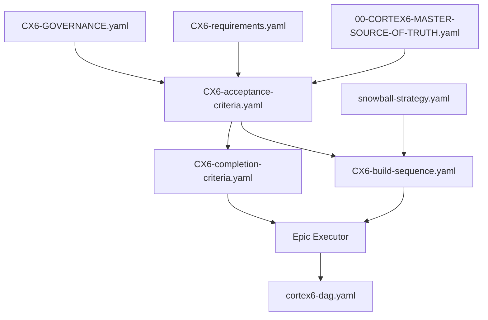

# CORTEX 6.0 Acceptance Criteria - Canonical Location

**Status:** ✅ AU## 🛡️ CORTEX 6 FILE LOCATION GOVERNANCE (MANDATORY)

⚠️ **SCOPE:** These rules apply **ONLY** to CORTEX 6.0 planning/acceptance files. They do NOT affect:
- Global CORTEX architecture (`src/`, `cortex-brain/`, etc.)
- User repository operations
- Other planning initiatives (future CORTEX versions)
- General CORTEX operations and orchestrators

**SKULL RULE ENFORCEMENT**: All CORTEX 6.0 planning/acceptance files MUST be created in canonical location.

### ✅ REQUIRED Location for ALL CORTEX 6 Files
```
cortex-brain/documents/planning/active/cortex6/acceptance-criteria/
```

### 🚫 FORBIDDEN Actions (CORTEX 6 Planning ONLY)
- ❌ Creating `CX6-*` files outside canonical location
- ❌ Creating `remediation-plan*.yaml` anywhere else (for CORTEX 6 plan)
- ❌ Creating `cortex-ac*.yaml` files (renamed to CX6-acceptance-criteria.yaml)
- ❌ Creating CORTEX 6 acceptance criteria in `.asif/`, `cortex6-fixes/`, or root
- ❌ Creating standalone TODO files (use tier1/cortex6-dag.yaml instead)  
**Version:** 14.0.0

---

## 📁 File Structure

```
cortex-brain/documents/planning/active/cortex6/acceptance-criteria/
├── CX6-acceptance-criteria.yaml                      # Source of Truth (390+ AC)
├── CX6-requirements.yaml                             # Active requirements/remediation
├── snowball-strategy.yaml                            # Prioritization framework
├── plan-viewer-dashboard-requirements.yaml           # Plan Viewer Dashboard specs
├── README.md                                         # This file
└── archive/                                          # Historical artifacts
    ├── remediation-plan-{YYYY-MM-DD}.yaml           # Archived remediations
    └── search-findings-{YYYYMMDD}.yaml              # Archived findings
```

---

## 🎯 Document Roles & Relationships

### **Primary Documents**

| File | Role | Size | Content |
|------|------|------|---------|
| **CX6-acceptance-criteria.yaml** | 📋 Validation Criteria | 4,319 lines | 390+ AC with test harness specs |
| **CX6-build-sequence.yaml** | 🔨 Build Order | ~650 lines | 12-phase execution sequence |
| **CX6-completion-criteria.yaml** | ✅ Definition of Done | ~550 lines | 20 automated gates + checklist |
| **CX6-GOVERNANCE.yaml** | 🛡️ Governance Rules | 573 lines | Machine-readable enforcement |
| **snowball-strategy.yaml** | 📈 Execution Strategy | 637 lines | Momentum-based framework |
| **CX6-requirements.yaml** | 🔧 Active Remediation | 338 lines | 23 issues to fix |
| **plan-viewer-dashboard-requirements.yaml** | 🎨 Dashboard Spec | 365 lines | UI/UX requirements |

### **Supporting Documents**

| File | Role | Location |
|------|------|----------|
| **00-CORTEX6-MASTER-SOURCE-OF-TRUTH.yaml** | 🎯 Epic Definition | `../` (parent folder) |
| **cortex6-dag.yaml** | 📊 TODO DAG | `cortex-brain/tier1/` |

---

## 🔗 Document Relationships



**Flow:**
1. **Master Source** defines WHY (business value) and WHAT (features)
2. **Acceptance Criteria** defines HOW to validate (390+ AC)
3. **Build Sequence** defines WHEN to build (12 phases with dependencies)
4. **Completion Criteria** defines DONE (20 gates + checklist)
5. **Epic Executor** uses all above to execute autonomously

---

## 🎯 Single Source of Truth

**ALL acceptance criteria for CORTEX 6.0 are in:**
```
CX6-acceptance-criteria.yaml
```

This consolidates:
- ✅ All feature requirements (feat01-feat09)
- ✅ Governance framework (4-category + 61 SKULL rules)
- ✅ Orchestrator specifications (10+ orchestrators)
- ✅ TDD requirements (RED→GREEN→REFACTOR)
- ✅ Knowledge base validation
- ✅ Audit logging & compliance
- ✅ Performance SLAs
- ✅ Security requirements
- ✅ MCP integration criteria
- ✅ Version-agnostic design criteria
- ✅ Unified test suite criteria
- ✅ Plan Viewer Dashboard criteria (AC-PLAN-DASH-*)
- ✅ Master Orchestrator Knowledge System (AC-MASTER-*)

---

## 📊 Key Metrics (v15.0.0)

| Metric | Value |
|--------|-------|
| **Total Criteria** | 390+ |
| **P0_CRITICAL** | 78+ |
| **Build Phases** | 12 |
| **Completion Gates** | 20 (automated) |
| **Validation Gates** | 12 |
| **Blocking Gates** | 16 |
| **Plan Dashboard Criteria** | 7 |
| **Knowledge System Criteria** | 10 |
| **Estimated Duration** | 9-12 weeks |

---

## 🔗 Referenced By

| File | Purpose |
|------|---------|
| `.github/prompts/cortex-gap-fix.prompt.md` | Gap detection & remediation |
| `.github/prompts/CORTEX.prompt.md` | Master entry point |
| `00-CORTEX6-MASTER-SOURCE-OF-TRUTH.yaml` | Master specification |

---

## �️ CORTEX 6 FILE LOCATION GOVERNANCE (MANDATORY)

⚠️ **SKULL RULE ENFORCEMENT**: All CORTEX 6.0 planning/acceptance files MUST be created in canonical location.

### ✅ REQUIRED Location for ALL CORTEX 6 Files
```
cortex-brain/documents/planning/active/cortex6/acceptance-criteria/
```

### 🚫 FORBIDDEN Actions
- ❌ Creating `CX6-*` files outside canonical location
- ❌ Creating `remediation-plan*.yaml` anywhere else (for CORTEX 6 plan)
- ❌ Creating `cortex-ac*.yaml` files (renamed to CX6-acceptance-criteria.yaml)
- ❌ Creating CORTEX 6 acceptance criteria in `.asif/`, `cortex6-fixes/`, or root
- ❌ Creating standalone TODO files (use tier1/cortex6-dag.yaml instead)

**Last Updated:** 2026-01-09

### ✅ ALLOWED Locations (Organized by Type)
```
cortex-brain/documents/planning/active/cortex6/
├── acceptance-criteria/           # AC, Requirements, Strategy (ONLY LOCATION)
│   ├── CX6-acceptance-criteria.yaml
│   ├── CX6-requirements.yaml
│   ├── CX6-build-sequence.yaml           # NEW: Build order & dependencies
│   ├── CX6-completion-criteria.yaml      # NEW: Definition of Done
│   ├── CX6-GOVERNANCE.yaml
│   ├── snowball-strategy.yaml
│   ├── plan-viewer-dashboard-requirements.yaml
│   └── archive/
└── 00-CORTEX6-MASTER-SOURCE-OF-TRUTH.yaml  # Epic-level business requirements
```

**Note:** TODO tracking is managed via DAG in `cortex-brain/tier1/cortex6-dag.yaml` (not in acceptance-criteria/)

### 🔒 Enforcement Mechanism
- **Pre-commit validation**: Reject commits with files in wrong location
- **GitHub Copilot instruction**: `.github/copilot-instructions.md` enforces this
- **SKULL Rule**: `PLAN_FILE_ORGANIZATION` in `brain-protection-rules.yaml`

---

## �🔄 Lifecycle Management

### Requirements/Remediation Plans
- **Active:** `CX6-requirements.yaml` (singular, no timestamp)
- **Archive:** `archive/remediation-plan-{YYYY-MM-DD}.yaml`
- **Rule:** Archive before regenerate (preserve history)

### Search Findings
- **Location:** `search-findings-{timestamp}.yaml`
- **Consumed by:** `cortex-gap-fix.prompt.md`

---

## ⚠️ Deprecated Locations

The following locations are **NO LONGER USED** for acceptance criteria:

- ❌ `.asif/AI-Learning/cortex6/acceptance/` - DEPRECATED
- ❌ `.asif/AI-Learning/cortex6/cortex-ac.yaml` - DEPRECATED
- ❌ `cortex-brain/config/acceptance-criteria.yaml` - DELETED (was v5.0)
- ❌ Any `00-*-TRACKER.yaml` files in cortex6-fixes - DELETED
- ❌ `cortex-ac.yaml` - RENAMED to `CX6-acceptance-criteria.yaml`
- ❌ `remediation-plan.yaml` - RENAMED to `CX6-requirements.yaml`

---

## 🚀 Usage

### Run Search (Gap Detection)
```
/CORTEX gap-fix
```

### Run Align (Remediation Planning)
```
/CORTEX align
```

### Epic Review
```
/CORTEX epic review
```

---

**Copyright © 2025-2026 Asif Hussain. All rights reserved.**
