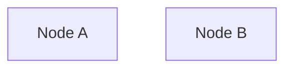

# 🎨 Mermaid Diagram Glassmorphism Standard

**Date:** 2026-01-04  
**Status:** ✅ APPROVED  
**Applies To:** All Level 1 & Level 2 HTML views  
**Reference:** Screenshot from architecture/index.html (approved design)

---

## 📊 Visual Specification

**Approved Screenshot:** architecture/index.html SKULL Rules flowchart

**Key Characteristics:**
- Soft glassmorphism backgrounds with rgba() transparency
- Subtle cyan borders with glow effect
- Modern Inter/Segoe UI font stack (15px)
- Translucent connection lines
- No harsh solid colors
- Blends seamlessly with page background

---

## 🎨 Mermaid Configuration (STANDARD)

```javascript
// Use in <script type="module"> tag in HTML <head>
import mermaid from 'https://cdn.jsdelivr.net/npm/mermaid@10/dist/mermaid.esm.min.mjs';

mermaid.initialize({ 
    startOnLoad: true,
    theme: 'base',
    themeVariables: {
        // Glassmorphism-aligned colors
        primaryColor: 'rgba(26, 31, 58, 0.85)',
        primaryTextColor: '#e2e8f0',
        primaryBorderColor: 'rgba(0, 212, 255, 0.6)',
        
        secondaryColor: 'rgba(26, 31, 58, 0.75)',
        secondaryTextColor: '#cbd5e0',
        secondaryBorderColor: 'rgba(123, 97, 255, 0.5)',
        
        tertiaryColor: 'rgba(26, 31, 58, 0.65)',
        tertiaryTextColor: '#a0aec0',
        tertiaryBorderColor: 'rgba(16, 185, 129, 0.5)',
        
        // Node-specific colors (glassmorphism panels)
        noteBkgColor: 'rgba(26, 31, 58, 0.9)',
        noteTextColor: '#e2e8f0',
        noteBorderColor: 'rgba(0, 212, 255, 0.4)',
        
        // Lines and connections
        lineColor: 'rgba(0, 212, 255, 0.5)',
        
        // Background
        background: 'transparent',
        mainBkg: 'rgba(26, 31, 58, 0.8)',
        secondBkg: 'rgba(15, 23, 42, 0.7)',
        
        // Text
        textColor: '#e2e8f0',
        
        // Font
        fontSize: '15px',
        fontFamily: "'Inter', 'Segoe UI', system-ui, -apple-system, sans-serif'"
    }
});
```

---

## 🎨 Mermaid Container CSS (STANDARD)

**DO NOT use inline styles.** Use CSS classes only.

```css
/* Mermaid Container - glassmorphism.css */
.mermaid-container {
    background: rgba(15, 23, 42, 0.6);
    backdrop-filter: blur(16px) saturate(180%);
    -webkit-backdrop-filter: blur(16px) saturate(180%);
    border: 1px solid rgba(0, 212, 255, 0.2);
    border-radius: 12px;
    padding: 2rem;
    margin: 1.5rem 0;
    overflow-x: auto;
    box-shadow: 0 8px 32px rgba(0, 0, 0, 0.3),
                inset 0 1px 0 rgba(255, 255, 255, 0.05);
}

.mermaid-container:hover {
    border-color: rgba(0, 212, 255, 0.4);
    box-shadow: 0 8px 32px rgba(0, 0, 0, 0.3),
                0 0 20px rgba(0, 212, 255, 0.15),
                inset 0 1px 0 rgba(255, 255, 255, 0.05);
}

.mermaid-container .mermaid {
    display: flex;
    justify-content: center;
    align-items: center;
}

/* Mermaid SVG text enhancement */
.mermaid-container svg {
    filter: drop-shadow(0 2px 4px rgba(0, 0, 0, 0.3));
}
```

---

## 🚫 FORBIDDEN Patterns

**❌ DO NOT use inline style commands in mermaid diagrams:**

```mermaid
graph TD
    A[Node A]
    B[Node B]
    
    style A fill:#00d4ff,stroke:#33ddff,stroke-width:2px,color:#000  ❌ WRONG
    style B fill:#7b61ff,stroke:#9f87ff,stroke-width:3px,color:#fff  ❌ WRONG
```

**✅ CORRECT: Let theme variables apply automatically:**



---

## 📝 HTML Usage Pattern

```html
<!DOCTYPE html>
<html lang="en">
<head>
    <meta charset="UTF-8">
    <title>Page Title</title>
    
    <!-- Glassmorphism CSS (intentional-classes.css) -->
    <link rel="stylesheet" href="../assets/css/intentional-classes.css">
    
    <!-- Mermaid.js -->
    <script type="module">
        import mermaid from 'https://cdn.jsdelivr.net/npm/mermaid@10/dist/mermaid.esm.min.mjs';
        mermaid.initialize({ 
            startOnLoad: true,
            theme: 'base',
            themeVariables: {
                // Copy configuration from above
            }
        });
    </script>
</head>
<body>
    <!-- Mermaid diagram usage -->
    <div class="mermaid-container">
        <pre class="mermaid">
graph TD
    INPUT[User Request] --> SKULL{SKULL Rules}
    
    SKULL -->|TDD Check| TDD[RED→GREEN→REFACTOR]
    SKULL -->|Discovery| SEARCH[Search Workspace]
    SKULL -->|Planning| PLAN[Create Plan Only]
    SKULL -->|Git| ISOLATE[Isolate Commits]
    
    TDD --> VALIDATE{Passes?}
    SEARCH --> VALIDATE
    PLAN --> VALIDATE
    ISOLATE --> VALIDATE
    
    VALIDATE -->|Yes| EXECUTE[Execute Task]
    VALIDATE -->|No| BLOCK[Block Execution]
    
    EXECUTE --> REFACTOR[Cleanup Phase]
    REFACTOR --> COMPLETE[Task Complete]
        </pre>
    </div>
</body>
</html>
```

---

## 🎨 Color Palette Reference

| Element | Color | Opacity | Purpose |
|---------|-------|---------|---------|
| **Primary Background** | `rgba(26, 31, 58, 0.85)` | 85% | Main node background |
| **Primary Border** | `rgba(0, 212, 255, 0.6)` | 60% | Cyan glow border |
| **Secondary Background** | `rgba(26, 31, 58, 0.75)` | 75% | Secondary nodes |
| **Secondary Border** | `rgba(123, 97, 255, 0.5)` | 50% | Purple accent |
| **Tertiary Background** | `rgba(26, 31, 58, 0.65)` | 65% | Tertiary nodes |
| **Tertiary Border** | `rgba(16, 185, 129, 0.5)` | 50% | Green accent |
| **Connection Lines** | `rgba(0, 212, 255, 0.5)` | 50% | Translucent cyan |
| **Text Color** | `#e2e8f0` | 100% | Light gray |
| **Container Background** | `rgba(15, 23, 42, 0.6)` | 60% | Glass panel |
| **Container Border** | `rgba(0, 212, 255, 0.2)` | 20% | Subtle cyan |

---

## ✅ Compliance Checklist

Before deploying mermaid diagrams, validate:

- [ ] Using `theme: 'base'` (not 'dark' or 'default')
- [ ] All colors use `rgba()` format with opacity
- [ ] Font size is `15px` (not 14px or smaller)
- [ ] Font family includes Inter, Segoe UI, system-ui fallbacks
- [ ] No inline `style` commands in diagram definitions
- [ ] `.mermaid-container` class applied (no inline styles)
- [ ] `backdrop-filter: blur(16px)` present
- [ ] Hover effect includes cyan glow
- [ ] SVG drop-shadow applied for depth
- [ ] Container responsive with `overflow-x: auto`

---

## 📋 Migration Checklist (Per Page)

When updating existing mermaid diagrams:

1. **Update `<head>` mermaid config:**
   - Change `theme: 'dark'` → `theme: 'base'`
   - Add all glassmorphism color variables
   - Update font to 15px Inter stack

2. **Remove inline diagram styles:**
   - Delete all `style NodeName fill:#...` commands
   - Let theme variables apply automatically

3. **Update container markup:**
   - Ensure `<div class="mermaid-container">` wrapper exists
   - Remove any inline `style=""` attributes
   - Validate CSS class in intentional-classes.css

4. **Test in browser:**
   - Hard refresh (Ctrl+Shift+R)
   - Verify soft glassmorphism appearance
   - Check hover glow effect
   - Validate responsive behavior

---

## 🔗 Related Standards

- **Glassmorphism CSS:** `docs/assets/css/intentional-classes.css`
- **HTML Plan:** `00-html-view-standardization.md` (Phase 16b)
- **Snowball Strategy:** `SNOWBALL-STRATEGY.md`
- **Design Standard:** `cortex-brain/documents/standards/glassmorphism-design-standard.md`

---

**Approved By:** User (2026-01-04)  
**Implementation Status:** ✅ Applied to architecture/index.html  
**Next:** Apply to all Level 1 feature pages (Phase 16b)
