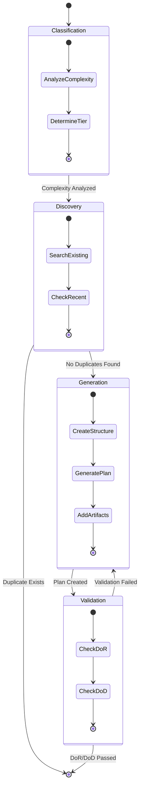
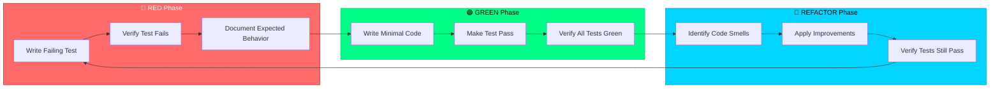
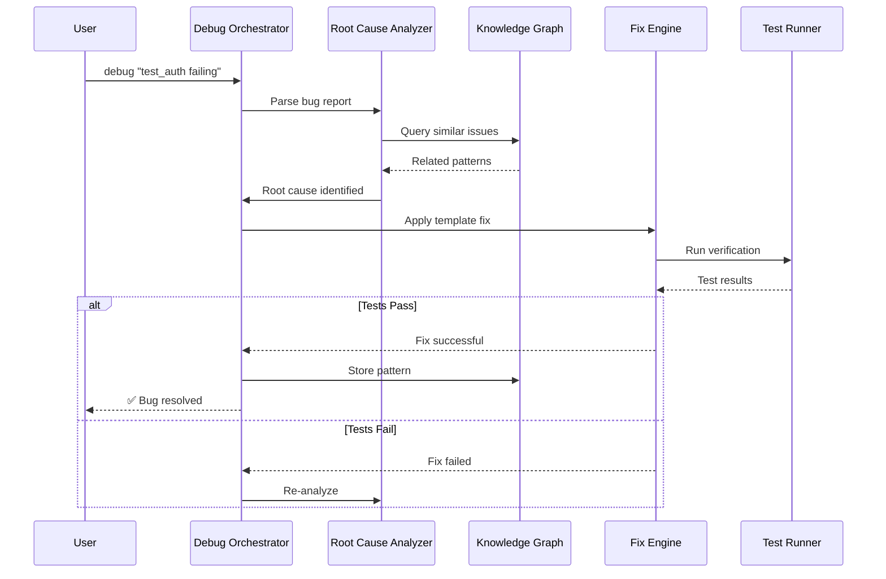
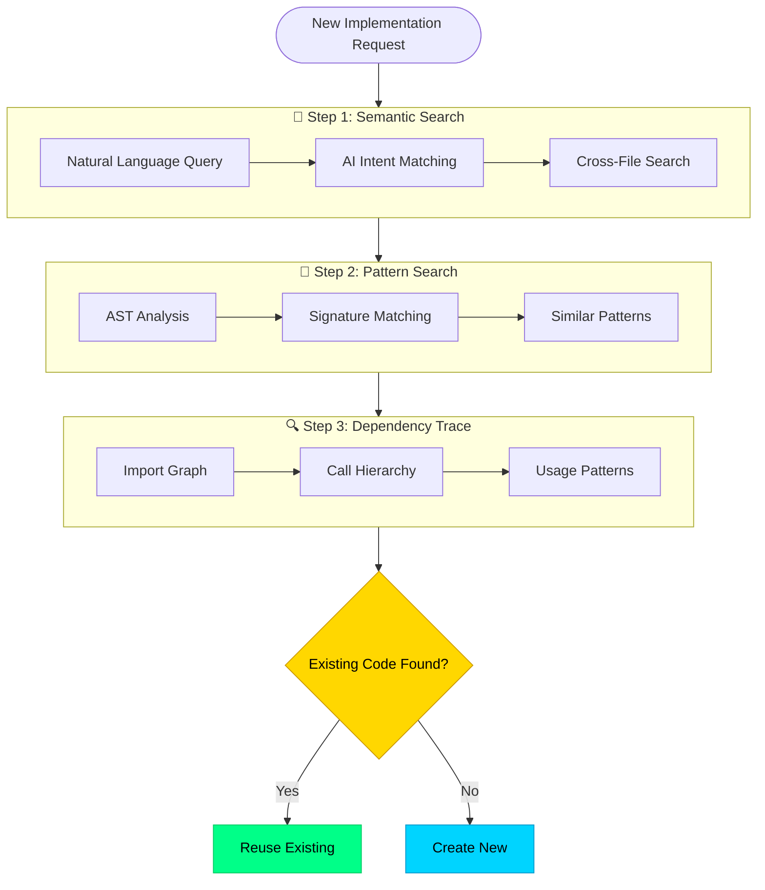
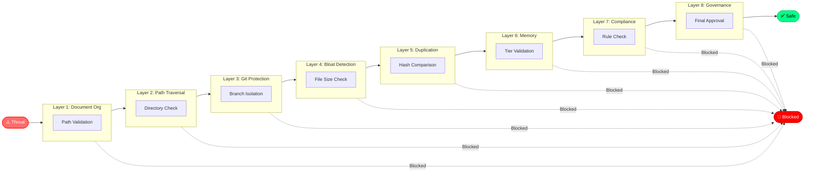
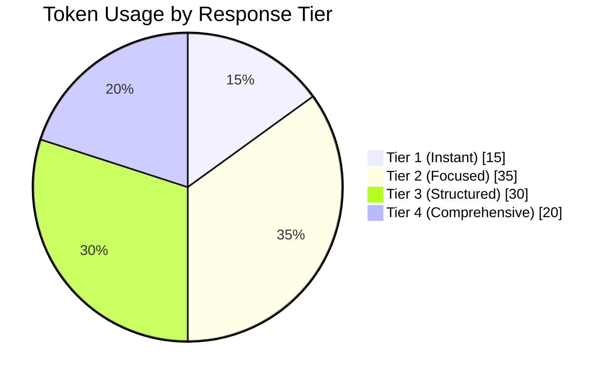
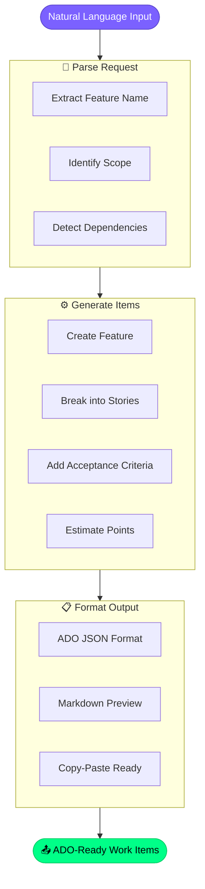

# 📊 Mermaid Diagram Templates

**Purpose:** Pre-built MMD diagrams for Level 2 documentation

---

## 1. Planning System - 4-Phase State Diagram



---

## 2. TDD Orchestrator - RED-GREEN-REFACTOR Cycle



---

## 3. Debug Orchestrator - Sequence Diagram



---

## 4. Holistic Discovery - 3-Step Flowchart



---

## 5. SKULL Protection - 8-Layer Defense Graph



---

## 6. Token Optimization - Tier Distribution Pie



---

## 7. Sanitization Pipeline - Flowchart

```mermaid
flowchart LR
    subgraph PHASE1["🔍 Phase 1: Analysis"]
        A1[Scan Codebase]
        A2[Detect Patterns]
        A3[Build Inventory]
    end
    
    subgraph PHASE2["🗺️ Phase 2: Mapping"]
        M1[Create Mappings]
        M2[Generate Keys]
        M3[Store Reversible]
    end
    
    subgraph PHASE3["🔄 Phase 3: Transform"]
        T1[Apply Replacements]
        T2[Update References]
        T3[Preserve Structure]
    end
    
    subgraph PHASE4["✅ Phase 4: Validate"]
        V1[Build Check]
        V2[Test Suite]
        V3[Manual Review]
    end
    
    subgraph PHASE5["📦 Phase 5: Package"]
        P1[Create Archive]
        P2[Generate Report]
        P3[Store Mapping Key]
    end
    
    PHASE1 --> PHASE2 --> PHASE3 --> PHASE4 --> PHASE5
    
    style PHASE1 fill:rgba(0,212,255,0.3),stroke:#00d4ff
    style PHASE2 fill:rgba(123,97,255,0.3),stroke:#7b61ff
    style PHASE3 fill:rgba(0,255,136,0.3),stroke:#00ff88
    style PHASE4 fill:rgba(255,215,0,0.3),stroke:#ffd700
    style PHASE5 fill:rgba(0,212,255,0.3),stroke:#00d4ff
```

---

## 8. ADO Operations - Work Item Flow



---

## Glassmorphism MMD Styling

Add to page CSS:

```css
/* Mermaid glassmorphism theme */
.mermaid {
    background: transparent !important;
}

.mermaid .node rect,
.mermaid .node circle,
.mermaid .node polygon {
    fill: var(--glass-bg) !important;
    stroke: var(--glass-border) !important;
    stroke-width: 2px;
}

.mermaid .edgePath path {
    stroke: var(--accent-primary) !important;
    stroke-width: 2px;
}

.mermaid .label {
    color: var(--text-primary) !important;
}

.mermaid .cluster rect {
    fill: rgba(26, 31, 58, 0.4) !important;
    stroke: var(--glass-border) !important;
    rx: 16px;
    ry: 16px;
}
```
