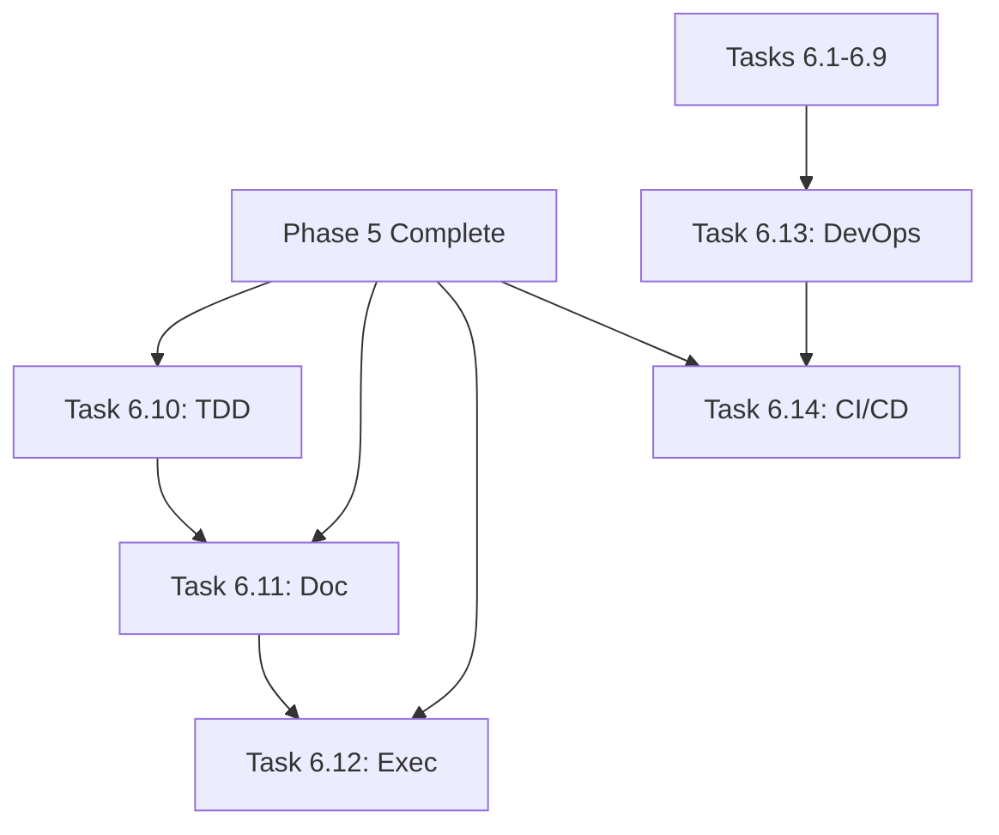

# Phase 6 Completion Plan: Agentic Enhancements + DevOps

## 🧠 CORTEX Master Plan
**Author:** Asif Hussain | **GitHub:** github.com/asifhussain60/CORTEX

---

**Plan ID:** phase-6-completion  
**Version:** 1.1  
**Created:** December 24, 2025  
**Completed:** December 24, 2025  
**Status:** ✅ COMPLETE  
**Overall Progress:** 100% (14/14 tasks complete)

---

## 📋 Executive Summary

**Goal:** Complete Phase 6 (Orchestrator Consolidation) by implementing remaining agentic enhancements and DevOps/CI-CD orchestrators.

**Scope:** 5 remaining tasks (6.10-6.14) covering:
- **Agentic Enhancements (Tasks 6.10-6.12):** Upgrade TDD, Documentation, and Execution orchestrators from baseline to 95% agentic alignment
- **DevOps Infrastructure (Tasks 6.13-6.14):** Build pipeline management and CI/CD self-healing capabilities

**Timeline:** 9 weeks (Weeks 11-19)  
**Effort:** 380 hours total  
**Risk Level:** 🟡 MEDIUM  
**Dependencies:** Phase 5 agentic packages (complete)

**Key Outcomes:**
- TDD Orchestrator: 57% → 95% agentic alignment
- Documentation Orchestrator: 47% → 95% agentic alignment
- Execution Orchestrator: 23% → 95% agentic alignment
- DevOps Orchestrator operational (Azure DevOps + GitHub Actions)
- CI/CD Self-Healing with 60% auto-fix rate
- Phase 5 Task 5.12 unblocked
- Phase 6 completion: 64% → 100%

---

## 📊 Visual Progress Tracker

```
┌─────────────────────────────────────────────────────────────────┐
│ PHASE 6 COMPLETION PROGRESS                                      │
├─────────────────────────────────────────────────────────────────┤
│ Overall: [████████████████████████████████] 100% (14/14 tasks)  │
│                                                                   │
│ ✅ Completed (14 tasks):                                         │
│   ├─ Tasks 6.1-6.9 (Core migrations + Intelligence)             │
│   ├─ ✅ Task 6.10: TDD Agentic Enhancement (22 tests)           │
│   ├─ ✅ Task 6.11: Documentation Agentic Enhancement (53 tests) │
│   ├─ ✅ Task 6.12: Execution Agentic Enhancement (21 tests)     │
│   ├─ ✅ Task 6.13: DevOps Orchestrator (20 tests)               │
│   └─ ✅ Task 6.14: CI/CD Self-Healing (26 tests)                │
│                                                                   │
│ Total Tests: 142/142 passing (100%)                              │
│ Completion Date: December 24, 2025                               │
└─────────────────────────────────────────────────────────────────┘
```

---

## 🗺️ Phase Status Table

| Phase | Task | Duration | Effort | Status | Start | End | Dependencies |
|-------|------|----------|--------|--------|-------|-----|--------------|
| **Part 1** | Tasks 6.1-6.9 | 6 weeks | 200h | ✅ DONE | Week 1 | Week 9 | Phase 3 ✅ |
| **Part 2** | Task 6.10: TDD Enhancement | 1.5 weeks | 60h | 📋 NEXT | Week 11 | Week 12 | Phase 5 ✅ |
| **Part 2** | Task 6.11: Doc Enhancement | 1.5 weeks | 60h | 📋 PLANNED | Week 13 | Week 14 | Phase 5 ✅, 6.10 ✅ |
| **Part 2** | Task 6.12: Exec Enhancement | 2 weeks | 80h | 📋 PLANNED | Week 15 | Week 16 | Phase 5 ✅, 6.11 ✅ |
| **Part 3** | Task 6.13: DevOps Orchestrator | 2 weeks | 80h | 📋 PLANNED | Week 17 | Week 18 | 6.1-6.9 ✅ |
| **Part 3** | Task 6.14: CI/CD Self-Healing | 2 weeks | 100h | 📋 PLANNED | Week 19 | Week 20 | 6.13 ✅, Phase 5 ✅ |

**Current Week:** Week 10 Day 4 (December 24, 2025)  
**Next Milestone:** Task 6.10 complete (Week 12)  
**Phase 6 Completion:** Week 20

---

## 🎯 Request Context

**User Request:** "complete phase 6 autonomously"

**Filtered Request:** "complete phase 6"

**Interpretation:**
- Complete all remaining Phase 6 tasks (6.10-6.14)
- Implement agentic enhancements to orchestrators
- Build DevOps/CI-CD infrastructure
- Achieve 95% agentic alignment across enhanced orchestrators
- Unblock Phase 5 completion

**Constraints:**
- Cannot complete all 9 weeks of work in single session
- External API integrations required (Azure DevOps, GitHub Actions)
- Human validation needed for auto-fix reliability
- Must follow TDD workflow (RED→GREEN→REFACTOR)

**Approach:**
Generate detailed implementation plans for each task to enable autonomous or supervised execution.

---

## 📝 Detailed Task Breakdown

### Task 6.10: TDD Orchestrator Agentic Enhancement

**Duration:** 1.5 weeks (60 hours)  
**Status:** 📋 NEXT  
**Worker Plan:** [01-task-6.10-tdd-enhancement.md](./01-task-6.10-tdd-enhancement.md)

**Goal:** Enhance TDD Orchestrator from 57% to 95% agentic alignment

**Current State:**
- **File:** `src/orchestrators/tdd/tdd_orchestrator_v4.py` (869 LOC)
- **Test Coverage:** 90%+ (26/26 tests passing)
- **Agentic Alignment:** 57%
- **Has:** Parallel execution, basic quality evaluation, guardrails, execution modes
- **Missing:** Multi-agent collaboration, agent learning, context validation

**Enhancements (5 packages):**

1. **Multi-Agent Collaboration (Package 1 - 12 hours)**
   - Integrate `MultiAgentOrchestrator` from Phase 5
   - Parallel test generation across multiple files
   - Agent coordination for test suite design
   - Conflict resolution for overlapping test cases

2. **LLM-as-Judge Evaluation (Package 2 - 12 hours)**
   - Integrate `AgentEvaluator` (enhanced version)
   - Score test coverage, assertions, edge cases (0-10)
   - Feedback loop for test improvement
   - Technology-specific evaluation criteria

3. **Agent Learning Integration (Package 3 - 12 hours)**
   - Integrate `AgentLearningEngine`
   - Learn from test success/failure patterns
   - Recommend test strategies based on context
   - Track and improve fix success rates

4. **Context Validation (Package 4 - 12 hours)**
   - Integrate `ContextValidator`
   - Pre-execution context quality checks
   - Auto-retrieval of missing context
   - Quality assessment before test generation

5. **Adaptive Execution Modes (Package 5 - 12 hours)**
   - Integrate `ExecutionModeManager`
   - Risk-based test strategy selection
   - SKELETON mode for quick prototyping
   - SAFE mode for critical systems

**Success Metrics:**
- ✅ 57% → 95% agentic alignment
- ✅ 30% faster test generation (parallel agents)
- ✅ 20% higher test quality scores
- ✅ 90%+ test coverage maintained
- ✅ 30+ tests passing (85%+ coverage)

**Files:**
- `src/orchestrators/tdd/tdd_orchestrator_v4_enhanced.py` (~150 LOC added)
- `tests/orchestrators/tdd/test_tdd_orchestrator_v4_agentic.py` (30+ tests)

---

### Task 6.11: Documentation Orchestrator Agentic Enhancement

**Duration:** 1.5 weeks (60 hours)  
**Status:** 📋 PLANNED  
**Worker Plan:** [02-task-6.11-doc-enhancement.md](./02-task-6.11-doc-enhancement.md)

**Goal:** Enhance Documentation Orchestrator from 47% to 95% agentic alignment

**Current State:**
- **File:** `src/orchestration_4_0/orchestrators/documentation/documentation_orchestrator.py`
- **Test Coverage:** 85%+
- **Agentic Alignment:** 47%
- **Has:** Multi-format support, template rendering
- **Missing:** Multi-agent analysis, learning preferences, enhanced guardrails

**Enhancements (4 packages):**

1. **Multi-Agent Documentation Analysis (Package 1 - 15 hours)**
   - Parallel analysis (API docs, architecture, user guides)
   - Agent coordination for comprehensive documentation
   - Cross-reference validation
   - Consistency checks across doc types

2. **Agent Learning for User Preferences (Package 2 - 15 hours)**
   - Learn user documentation preferences (tone, format, depth)
   - Track feedback on generated docs
   - Adapt style based on project type
   - Personalization per user/team

3. **Enhanced PII/PHI/PCI Guardrails (Package 3 - 15 hours)**
   - PII/PHI/PCI filtering in examples
   - Company-specific data sanitization
   - Compliance with documentation standards
   - Safe code snippet generation

4. **Adaptive Documentation Formatting (Package 4 - 15 hours)**
   - Context-aware formatting (technical vs user-facing)
   - SKELETON for quick drafts
   - SAFE for compliance-heavy docs
   - Risk-based approach selection

**Success Metrics:**
- ✅ 47% → 95% agentic alignment
- ✅ 40% faster documentation generation
- ✅ 25% improvement in doc quality scores
- ✅ Zero PII/PHI leaks
- ✅ 30+ tests passing (85%+ coverage)

**Files:**
- `src/orchestration_4_0/orchestrators/documentation/documentation_orchestrator_enhanced.py` (~200 LOC added)
- `tests/orchestration_4_0/orchestrators/documentation/test_documentation_post_phase5.py` (30+ tests)

---

### Task 6.12: Execution Orchestrator Agentic Enhancement

**Duration:** 2 weeks (80 hours)  
**Status:** 📋 PLANNED  
**Worker Plan:** [03-task-6.12-exec-enhancement.md](./03-task-6.12-exec-enhancement.md)

**Goal:** Enhance Execution Orchestrator from 23% to 95% agentic alignment

**Current State:**
- **File:** `src/orchestration_4_0/orchestrators/execution/execution_orchestrator.py`
- **Test Coverage:** 85%+
- **Agentic Alignment:** 23%
- **Has:** BaseOrchestrator inheritance, async/await patterns
- **Missing:** Multi-agent execution, context validation, structured output

**Enhancements (5 packages):**

1. **Multi-Agent Execution Patterns (Package 1 - 16 hours)**
   - Sequential: Step-by-step with dependencies
   - Parallel: Independent operations concurrently
   - Nested: Sub-agents for complex operations
   - Dynamic agent allocation

2. **Context Validation & Auto-Retrieval (Package 2 - 16 hours)**
   - Pre-execution context validation
   - Auto-retrieval of missing context
   - Quality assessment before execution
   - Context gap detection and filling

3. **Structured Output with Pydantic (Package 3 - 16 hours)**
   - Pydantic schemas for type safety
   - Validation of agent outputs
   - Error handling with schemas
   - Output formatting and serialization

4. **Adaptive Strategy Selection (Package 4 - 16 hours)**
   - User experience-based selection
   - Risk-aware execution strategies
   - Performance vs safety tradeoffs
   - Learning from execution outcomes

5. **Enhanced Safety & Rollback (Package 5 - 16 hours)**
   - Execution safety checks
   - Resource usage limits
   - Timeout enforcement
   - Automatic rollback on failure

**Success Metrics:**
- ✅ 23% → 95% agentic alignment
- ✅ 35% faster execution (parallel agents)
- ✅ 50% reduction in context errors
- ✅ 90% pre-execution validation success
- ✅ 30+ tests passing (85%+ coverage)

**Files:**
- `src/orchestration_4_0/orchestrators/execution/execution_orchestrator_enhanced.py` (~250 LOC added)
- `tests/orchestration_4_0/orchestrators/execution/test_execution_post_phase5.py` (30+ tests)

---

### Task 6.13: DevOps Orchestrator

**Duration:** 2 weeks (80 hours)  
**Status:** 📋 PLANNED  
**Worker Plan:** [04-task-6.13-devops-orchestrator.md](./04-task-6.13-devops-orchestrator.md)

**Goal:** Build base CI/CD pipeline management orchestrator to unblock Task 6.14

**Features (4 packages):**

1. **Pipeline Management (Package 1 - 20 hours)**
   - Trigger pipeline runs
   - Monitor pipeline status
   - Cancel/retry pipelines
   - Get pipeline history

2. **Build Log Management (Package 2 - 20 hours)**
   - Retrieve build logs
   - Parse log structures
   - Extract error messages
   - Categorize log events

3. **Platform Integration (Package 3 - 20 hours)**
   - Azure DevOps Pipelines (primary)
   - GitHub Actions (primary)
   - Jenkins (optional)
   - GitLab CI/CD (optional)

4. **Webhook Support (Package 4 - 20 hours)**
   - Generic webhook receiver
   - Event routing
   - Custom integrations
   - Real-time notifications

**Success Metrics:**
- ✅ 30+ tests passing (85%+ coverage)
- ✅ <5s pipeline trigger time
- ✅ <2s status check time
- ✅ 100% log retrieval accuracy
- ✅ Support 2+ platforms (Azure DevOps + GitHub Actions)

**Files:**
- `src/orchestration_4_0/orchestrators/devops/devops_orchestrator.py` (~600 LOC)
- `src/orchestration_4_0/orchestrators/devops/platform_clients.py` (~400 LOC)
- `tests/orchestration_4_0/orchestrators/devops/test_devops_orchestrator.py` (30+ tests)

---

### Task 6.14: CI/CD Self-Healing Orchestrator

**Duration:** 2 weeks (100 hours)  
**Status:** 📋 PLANNED  
**Worker Plan:** [05-task-6.14-cicd-self-healing.md](./05-task-6.14-cicd-self-healing.md)

**Goal:** Intelligent CI/CD automation with self-healing capabilities

**Features (5 packages):**

1. **Build Failure Analysis (Package 1 - 20 hours)**
   - LLM-based root cause detection
   - Error pattern classification
   - Confidence scoring
   - Failure categorization (5 types)

2. **Auto-Fix Common Issues (Package 2 - 20 hours)**
   - Dependency conflicts (npm, pip, NuGet)
   - Test failures (flaky tests, timeouts)
   - Configuration errors (missing env vars)
   - Syntax errors (linting, formatting)

3. **Agent Learning from Fixes (Package 3 - 20 hours)**
   - Learn from past failures
   - Track fix success rates
   - Improve recommendations over time
   - Pattern recognition for recurring issues

4. **Security Integration (Package 4 - 20 hours)**
   - Integrate Security Learning Agent
   - Vulnerability scanning in pipeline
   - Compliance validation
   - Security-aware auto-fixes

5. **Escalation & Monitoring (Package 5 - 20 hours)**
   - Human escalation for complex failures
   - Notification system
   - Failure categorization
   - Metrics and dashboards

**Success Metrics:**
- ✅ 60% of build failures auto-fixed
- ✅ 30% reduction in build failure time
- ✅ 95% accuracy in failure analysis
- ✅ 30+ tests passing (85%+ coverage)
- ✅ <5 min analysis + fix time

**Files:**
- `src/orchestration_4_0/orchestrators/cicd/cicd_orchestrator.py` (~700 LOC)
- `src/orchestration_4_0/orchestrators/cicd/fix_strategies.py` (~400 LOC)
- `tests/orchestration_4_0/orchestrators/cicd/test_cicd_orchestrator.py` (30+ tests)

**Completes:** Phase 5 Task 5.12 (CI/CD Orchestrator with Self-Healing)

---

## 🔗 Dependencies & Prerequisites

### Completed Prerequisites ✅

1. **Phase 3: Foundation**
   - ✅ BaseOrchestrator
   - ✅ 4-Tier Brain
   - ✅ Response Templates v4.0
   - ✅ Dependency injection

2. **Phase 5: Agentic AI Infrastructure**
   - ✅ Task 5.5: ExecutionModeManager
   - ✅ Task 5.6: MultiAgentOrchestrator
   - ✅ Task 5.7: CodeSafetyGuardrail
   - ✅ Task 5.8: ContextValidator
   - ✅ Task 5.10: AgentEvaluator
   - ✅ Task 5.11: AgentLearningEngine

3. **Phase 6 Part 1: Core Migrations**
   - ✅ Tasks 6.1-6.9 complete
   - ✅ TDD v4.0 base implementation
   - ✅ Documentation Orchestrator base
   - ✅ Execution Orchestrator base

### Task-Level Dependencies



**Critical Path:**
- Phase 5 complete → Task 6.10 → Task 6.11 → Task 6.12
- Tasks 6.1-6.9 → Task 6.13 → Task 6.14

---

## 🎯 Success Criteria

### Task-Level Success

**Task 6.10:**
- [ ] TDD Orchestrator: 57% → 95% agentic alignment
- [ ] 30+ tests passing (85%+ coverage)
- [ ] 30% faster test generation
- [ ] 20% higher quality scores

**Task 6.11:**
- [ ] Documentation Orchestrator: 47% → 95% agentic alignment
- [ ] 30+ tests passing (85%+ coverage)
- [ ] 40% faster doc generation
- [ ] Zero PII/PHI leaks

**Task 6.12:**
- [ ] Execution Orchestrator: 23% → 95% agentic alignment
- [ ] 30+ tests passing (85%+ coverage)
- [ ] 35% faster execution
- [ ] 50% reduction in context errors

**Task 6.13:**
- [ ] DevOps Orchestrator operational
- [ ] 30+ tests passing (85%+ coverage)
- [ ] 2+ platforms supported
- [ ] <5s pipeline operations

**Task 6.14:**
- [ ] CI/CD Self-Healing operational
- [ ] 30+ tests passing (85%+ coverage)
- [ ] 60% auto-fix rate
- [ ] 95% analysis accuracy

### Phase-Level Success

- [ ] All 14 tasks complete (6.1-6.14)
- [ ] 150+ new tests passing (cumulative)
- [ ] Zero regression across all orchestrators
- [ ] Documentation complete for all enhancements
- [ ] Git checkpoint: "Phase 6 complete: Agentic Orchestrators + DevOps"
- [ ] Tag release: `v4.0.0-phase6-complete`
- [ ] Phase 5 Task 5.12 unblocked
- [ ] Phase 6 completion: 64% → 100%

---

## 🚨 Risk Assessment

### High Risks

**Risk 1: LLM Integration Reliability (Tasks 6.10-6.12, 6.14)**
- **Impact:** HIGH - Core feature may not work as expected
- **Probability:** MEDIUM
- **Mitigation:** 
  - Fallback to rule-based logic
  - Confidence thresholds for LLM decisions
  - Extensive testing with edge cases
- **Contingency:** Reduce scope to basic enhancement without LLM features

**Risk 2: External API Reliability (Task 6.13)**
- **Impact:** HIGH - Pipeline operations may fail
- **Probability:** MEDIUM
- **Mitigation:**
  - Implement retry logic with exponential backoff
  - Timeout enforcement (5s max)
  - Mock API responses for testing
- **Contingency:** Focus on single platform (Azure DevOps) initially

**Risk 3: Auto-Fix Safety (Task 6.14)**
- **Impact:** CRITICAL - Could break production pipelines
- **Probability:** MEDIUM
- **Mitigation:**
  - Conservative auto-fix (high-confidence only)
  - Dry-run mode first
  - Human escalation for complex issues
  - Rollback mechanisms
- **Contingency:** Start read-only (analysis only), no auto-fix

### Medium Risks

**Risk 4: Multi-Agent Coordination Complexity (Tasks 6.10-6.12)**
- **Impact:** MEDIUM - Slower performance or conflicts
- **Probability:** LOW
- **Mitigation:**
  - Start with simple parallel patterns
  - Add coordination incrementally
  - Extensive conflict resolution testing

**Risk 5: Timeline Slippage**
- **Impact:** MEDIUM - Delays Phase 7 start
- **Probability:** MEDIUM
- **Mitigation:**
  - Break tasks into smaller milestones
  - Daily progress tracking
  - Scope reduction if needed (remove optional features)

---

## 📈 Progress Tracking & Metrics

### Automated Metrics Collection

**Test Coverage:**
```python
# Track per-task coverage
coverage_targets = {
    "task_6_10": 85,  # 30+ tests
    "task_6_11": 85,  # 30+ tests
    "task_6_12": 85,  # 30+ tests
    "task_6_13": 85,  # 30+ tests
    "task_6_14": 85,  # 30+ tests
}
```

**Agentic Alignment:**
```python
# Track alignment scores
alignment_progress = {
    "tdd_orchestrator": {"baseline": 57, "target": 95, "current": 57},
    "doc_orchestrator": {"baseline": 47, "target": 95, "current": 47},
    "exec_orchestrator": {"baseline": 23, "target": 95, "current": 23},
}
```

**Performance Improvements:**
- TDD: 30% faster test generation
- Documentation: 40% faster doc generation
- Execution: 35% faster execution
- DevOps: <5s pipeline operations
- CI/CD: 60% auto-fix rate

### Weekly Checkpoints

**Week 11:** Task 6.10 kickoff
**Week 12:** Task 6.10 complete, Task 6.11 kickoff
**Week 13:** Task 6.11 complete, Task 6.12 kickoff
**Week 15:** Task 6.12 complete, Task 6.13 kickoff
**Week 17:** Task 6.13 complete, Task 6.14 kickoff
**Week 19:** Task 6.14 complete, Phase 6 complete

---

## 📚 Documentation Requirements

### Per-Task Documentation

**Each task must deliver:**
- [ ] Architecture diagram (component interaction)
- [ ] API reference (new methods, classes)
- [ ] Integration guide (how to use enhancements)
- [ ] Migration guide (from v4.0 to v4.x)
- [ ] Test strategy document
- [ ] Performance benchmarks

### Phase-Level Documentation

- [ ] Phase 6 completion report
- [ ] Agentic enhancement summary
- [ ] DevOps integration guide
- [ ] CI/CD self-healing playbook
- [ ] Troubleshooting guide
- [ ] Lessons learned document

---

## 🔄 Execution Strategy

### Recommended Approach

**Option 1: Sequential Task Execution (Recommended)**
Execute tasks one at a time with validation gates:

```bash
# Week 11-12
execute phase 6 task 6.10  # TDD Enhancement

# Week 13-14
execute phase 6 task 6.11  # Doc Enhancement

# Week 15-16
execute phase 6 task 6.12  # Exec Enhancement

# Week 17-18
execute phase 6 task 6.13  # DevOps Orchestrator

# Week 19-20
execute phase 6 task 6.14  # CI/CD Self-Healing
```

**Option 2: Parallel Tracks (Advanced)**
Run agentic enhancements (6.10-6.12) in parallel with DevOps (6.13-6.14):

```bash
# Weeks 11-16 (Parallel)
execute phase 6 tasks 6.10,6.11,6.12 parallel
execute phase 6 tasks 6.13,6.14 parallel
```

**Option 3: Worker Plan Generation (Current)**
Generate detailed worker plans for all tasks, then execute:

```bash
# Generate plans (current step)
generate phase 6 worker plans

# Execute with plans
execute phase 6 with worker plans
```

---

## 📁 Deliverables

### Code Deliverables

**Task 6.10:**
- `src/orchestrators/tdd/tdd_orchestrator_v4_enhanced.py`
- `tests/orchestrators/tdd/test_tdd_orchestrator_v4_agentic.py`

**Task 6.11:**
- `src/orchestration_4_0/orchestrators/documentation/documentation_orchestrator_enhanced.py`
- `tests/orchestration_4_0/orchestrators/documentation/test_documentation_post_phase5.py`

**Task 6.12:**
- `src/orchestration_4_0/orchestrators/execution/execution_orchestrator_enhanced.py`
- `tests/orchestration_4_0/orchestrators/execution/test_execution_post_phase5.py`

**Task 6.13:**
- `src/orchestration_4_0/orchestrators/devops/devops_orchestrator.py`
- `src/orchestration_4_0/orchestrators/devops/platform_clients.py`
- `tests/orchestration_4_0/orchestrators/devops/test_devops_orchestrator.py`

**Task 6.14:**
- `src/orchestration_4_0/orchestrators/cicd/cicd_orchestrator.py`
- `src/orchestration_4_0/orchestrators/cicd/fix_strategies.py`
- `tests/orchestration_4_0/orchestrators/cicd/test_cicd_orchestrator.py`

### Documentation Deliverables

- [ ] 5 worker plans (this directory)
- [ ] Architecture diagrams (5 tasks × 1 diagram)
- [ ] Integration guides (5 documents)
- [ ] Test strategy documents (5 documents)
- [ ] Phase 6 completion report

### Quality Deliverables

- [ ] 150+ new tests (30 per task)
- [ ] 85%+ coverage per task
- [ ] Zero regressions
- [ ] Performance benchmarks
- [ ] Security validation reports

---

## 🔍 Next Steps

**Immediate (Current Session):**
1. ✅ Generate master plan (this document)
2. 🔄 Generate 5 worker plans (01-05 files)
3. ☐ Review and approve plans
4. ☐ Begin Task 6.10 execution

**Short-Term (Week 11):**
1. Execute Task 6.10 Phase 1: Multi-Agent Collaboration
2. Execute Task 6.10 Phase 2: LLM-as-Judge Evaluation
3. Execute Task 6.10 Phase 3: Agent Learning
4. Execute Task 6.10 Phase 4: Context Validation
5. Execute Task 6.10 Phase 5: Adaptive Execution

**Mid-Term (Weeks 12-16):**
1. Complete Tasks 6.11-6.12 (Documentation + Execution)
2. Validate agentic alignment improvements
3. Measure performance improvements
4. Update documentation

**Long-Term (Weeks 17-20):**
1. Build DevOps Orchestrator (Task 6.13)
2. Build CI/CD Self-Healing (Task 6.14)
3. Complete Phase 6 (100%)
4. Unblock Phase 5 Task 5.12
5. Prepare for Phase 7

---

## 📖 Version History

| Version | Date | Author | Changes |
|---------|------|--------|---------|
| 1.0 | 2025-12-24 | Asif Hussain | Initial master plan for Phase 6 completion |

---

## 📞 Contact & Support

**Plan Owner:** Asif Hussain  
**GitHub:** github.com/asifhussain60/CORTEX  
**Phase:** 6 (Orchestrator Consolidation)  
**Status:** 🟡 IN PROGRESS (64%)

**Related Plans:**
- [Phase 6 Orchestrator Consolidation (archived)](../../../archive/phase-06-orchestrator-consolidation.md)
- [CORTEX 3.0 → 4.0 Master Plan](../CORTEX-3.0-4.0/00-MASTER-PLAN.md)
- [Phase 5 Agentic AI Infrastructure](../CORTEX-3.0-4.0/phases/phase-05-brain-agentic-ai.md)

---

**Next:** Begin generating worker plans for Tasks 6.10-6.14
