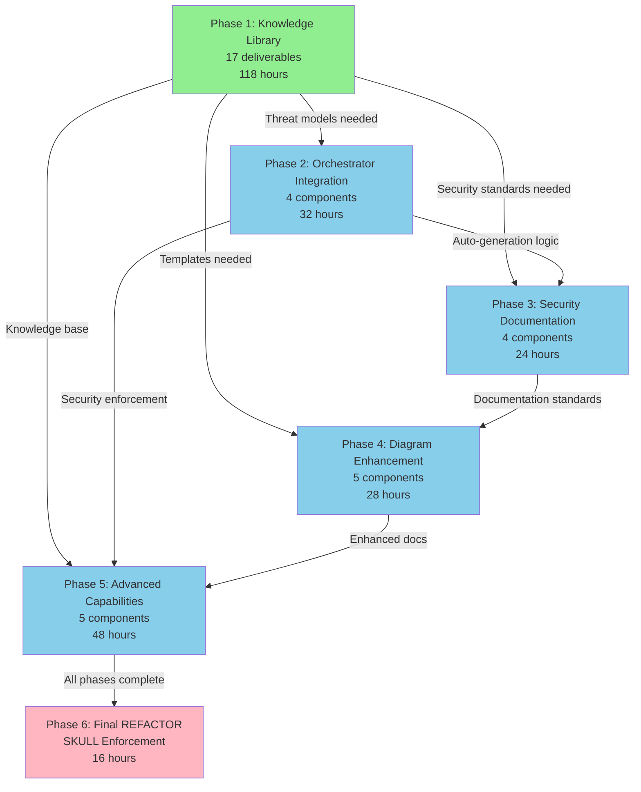

# 🛡️ Security Enhancement Master Plan

**Plan ID:** security-enhancement  
**Created:** December 30, 2025  
**Author:** Asif Hussain  
**Status:** 🟡 In Progress - Phase 1 Planning  
**Priority:** High  

---

## 📋 Executive Summary

This plan addresses critical gaps in CORTEX's security knowledge library and capabilities. The initiative will establish comprehensive security documentation, frameworks, and operational procedures to enable robust security analysis, compliance validation, and threat protection across all CORTEX operations.

---

## 🎯 Objectives

1. **Build Comprehensive Security Knowledge Library** (Phase 1) - Create foundational security documents and frameworks
2. **Embed Security in Development Workflows** (Phase 2) - Automatic threat modeling and security injection in all coding plans
3. **Automate Security Documentation** (Phase 3) - Generate dedicated security artifacts for every plan
4. **Enhance Documentation Quality** (Phase 4) - Add high-value Mermaid diagrams to all documentation
5. **Implement Advanced Security Operations** (Phase 5) - Security scanning, monitoring, training, and incident response
6. **Final REFACTOR - Whole-File Cleanup** (Phase 6) - MANDATORY SKULL rule enforcement for production-ready code

---

## 📊 Overall Progress Summary

| Phase | Status | Deliverables | Progress | Effort |
|-------|--------|-------------|----------|--------|
| **Phase 1** | 🟡 In Progress | 17 (13 pending) | 23.5% | 118h total |
| **Phase 2** | 🔵 Defined | 4 major components | 0% | 32h |
| **Phase 3** | 🔵 Defined | 4 major components | 0% | 24h |
| **Phase 4** | 🔵 Defined | 5 major components | 0% | 28h |
| **Phase 5** | 🔵 Defined | 5 major components | 0% | 48h |
| **Phase 6** | 🔵 MANDATORY | Final REFACTOR (SKULL) | 0% | 16h |
| **TOTAL** | 🟡 Planning | 41+ deliverables | 4.4% | 266h |

### 📊 Visual Progress Tracking (MANDATORY)

**Per Planning System 4.0 Manifest:**

All plan responses MUST include visual progress bars using the `autonomous_execution_progress` template from `cortex-brain/response-templates-v4.yaml`.

**Required Display Moments:**
- **Beginning:** Show complete phase table with all phases
- **Phase Completion:** Show overall progress bar and next phase only
- **Overall Completion:** Show complete phase table with final metrics

**Required Format:**
```markdown
| # | Phase | Status | Progress | TDD Status | Tasks | Time |
|---|-------|--------|----------|------------|-------|------|
| **Overall** | **{status_emoji}** | **[████████░░░░░░░░░░] 40%** | **Phase 2/5** | - | 4/17 | 45m |
| 1 | ✅ **Phase 1** | Complete | [██████████] 100% | R✅ G✅ F✅ | 4/4 | 30m |
| 2 | ⏳ **Phase 2** | In Progress | [████░░░░░░] 40% | R✅ G⏸️ F⏸️ | 0/4 | 15m |
| 3 | ⏸️ **Phase 3** | Pending | [░░░░░░░░░░] 0% | R⏸️ G⏸️ F⏸️ | 0/4 | 0m |
```

**Template Reference:** `autonomous_execution_progress` (line 863 in response-templates-v4.yaml)

**Helper Methods Available:**
- `generate_progress_bar(percentage, width=20, filled='█', empty='░')`
- `generate_tdd_status(red_done, green_done, refactor_done)`
- `format_elapsed_time(seconds)`
- `render_autonomous_progress(...)` - Full convenience method

---

## 📊 Current State Analysis

### Critical Gaps Identified

| Security Domain | Current State | Impact |
|----------------|---------------|--------|
| **OWASP Top 10** | Only referenced in scanner agent | ❌ No guidance documentation |
| **Threat Modeling** | No template or methodology | ❌ Cannot perform structured threat analysis |
| **Compliance Checklists** | No GDPR, HIPAA, PCI-DSS, SOC2 | ❌ Cannot validate compliance |
| **Penetration Testing** | No methodology or templates | ❌ Cannot perform structured pentests |
| **Incident Response** | No playbook or plan template | ❌ No incident handling capability |
| **Vulnerability Assessment** | No assessment framework | ❌ No systematic vuln analysis |
| **Risk Assessment** | No risk matrix or methodology | ❌ Cannot quantify risks |
| **Data Protection** | No classification or policies | ❌ No data security guidance |
| **Access Control** | No RBAC/ABAC patterns | ❌ No access control guidance |
| **Audit Logging** | No logging standards | ❌ No audit trail requirements |
| **Security Training** | No awareness materials | ❌ Cannot educate users |
| **Threat Intelligence** | No threat feeds/indicators | ❌ No threat awareness |

---

## 🗺️ Phase Breakdown

### Phase 1: Knowledge Library Enhancement 📚 [IN PROGRESS]

**Objective:** Create comprehensive security documentation and frameworks

**Deliverables:**

#### 1.1 Threat & Vulnerability Management
- [x] **API Security Foundations** (`knowledge-library/security/api-security-foundations.md`) ✅ **INTEGRATED**
  - OWASP Top 10 API Security Risks (comprehensive coverage)
  - API security best practices and authentication/authorization
  - Rate limiting, CORS, SSL/TLS configuration
  - Business Communication Compromise (BCC) prevention
  - PCI compliance for API developers
  - **Status:** Migrated from `docs/knowledge/security/api-security.md`

- [ ] **OWASP Top 10 Guide** (`knowledge-library/security/owasp-top-10-guide.md`)
  - Detailed explanation of each vulnerability category
  - Detection patterns and code examples
  - Remediation strategies and secure coding practices
  - Integration with CORTEX scanner agent
  - **Note:** Partially covered by API Security Foundations; expand to web application vulnerabilities

- [ ] **Threat Modeling Framework** (`knowledge-library/security/threat-modeling-framework.md`)
  - STRIDE methodology guide
  - Threat modeling templates (STRIDE, PASTA, DREAD)
  - Attack tree construction
  - Data flow diagram templates
  - Threat scenario library

- [ ] **Vulnerability Assessment Framework** (`knowledge-library/security/vulnerability-assessment-framework.md`)
  - Assessment methodology (discovery, analysis, classification)
  - Vulnerability scoring (CVSS v3.1 guide)
  - Remediation prioritization matrix
  - Assessment report templates

- [ ] **Penetration Testing Methodology** (`knowledge-library/security/penetration-testing-methodology.md`)
  - Testing phases (reconnaissance, scanning, exploitation, reporting)
  - Testing frameworks (PTES, OWASP Testing Guide)
  - Tool selection guide
  - Pentest report templates
  - Legal and ethical considerations
  - **Note:** Partially covered by API Security Foundations (API pentesting)

#### 1.2 Compliance & Governance
- [ ] **GDPR Compliance Checklist** (`knowledge-library/compliance/gdpr-compliance-checklist.md`)
  - Article-by-article requirements
  - Data subject rights implementation
  - Data protection impact assessment (DPIA) template
  - Consent management patterns
  - Breach notification procedures

- [ ] **HIPAA Compliance Checklist** (`knowledge-library/compliance/hipaa-compliance-checklist.md`)
  - Security Rule requirements
  - Privacy Rule requirements
  - PHI handling procedures
  - Risk assessment template
  - Business associate agreement template

- [ ] **PCI-DSS Compliance Checklist** (`knowledge-library/compliance/pci-dss-compliance-checklist.md`)
  - 12 requirements breakdown
  - Cardholder data environment (CDE) scoping
  - Network segmentation patterns
  - Encryption requirements
  - SAQ (Self-Assessment Questionnaire) guidance

- [ ] **SOC2 Compliance Checklist** (`knowledge-library/compliance/soc2-compliance-checklist.md`)
  - Trust Services Criteria (Security, Availability, Processing Integrity, Confidentiality, Privacy)
  - Control documentation templates
  - Evidence collection guide
  - Audit preparation checklist

#### 1.3 Risk & Data Protection
- [ ] **Risk Assessment Methodology** (`knowledge-library/security/risk-assessment-methodology.md`)
  - Risk identification techniques
  - Risk analysis frameworks (qualitative/quantitative)
  - Risk matrix templates (likelihood × impact)
  - Risk treatment strategies (accept, mitigate, transfer, avoid)
  - Risk register template

- [x] **Database Security Guide** (`knowledge-library/security/database-security-guide.md`) ✅ **INTEGRATED**
  - SQL Server authentication modes (Windows/Mixed mode)
  - Transparent Data Encryption (TDE) implementation
  - Always Encrypted for application security
  - Dynamic Data Masking (DDM) for sensitive data
  - Row-level security (RLS) implementation
  - Server-level and database-level security roles
  - **Status:** Migrated from `docs/knowledge/security/sql-server-security.md`

- [ ] **Data Protection Framework** (`knowledge-library/security/data-protection-framework.md`)
  - Data classification scheme (Public, Internal, Confidential, Restricted)
  - Data lifecycle management (creation → destruction)
  - Encryption standards (at-rest, in-transit, in-use)
  - Data retention policies
  - Secure deletion procedures
  - **Note:** Partially covered by Database Security Guide; expand to all data types

- [ ] **Access Control Patterns** (`knowledge-library/security/access-control-patterns.md`)
  - RBAC (Role-Based Access Control) implementation guide
  - ABAC (Attribute-Based Access Control) patterns
  - Principle of least privilege
  - Segregation of duties
  - Access review procedures
  - **Note:** Partially covered by Database Security Guide; expand to application/system access

#### 1.4 Operations & Response
- [x] **Security Awareness Training** (`knowledge-library/security/security-awareness-training.md`) ✅ **INTEGRATED**
  - Phishing and social engineering detection
  - Password management and MFA best practices
  - Digital hygiene (browser security, software updates, backups)
  - Public Wi-Fi risks and VPN usage
  - Business Communication Compromise (BCC) prevention
  - Voice cloning and deepfake awareness
  - Credential stuffing and password reuse dangers
  - **Status:** Migrated from `docs/knowledge/security/security-best-practices.md`

- [ ] **Incident Response Playbook** (`knowledge-library/security/incident-response-playbook.md`)
  - Incident classification taxonomy
  - Response phases (preparation, detection, containment, eradication, recovery, lessons learned)
  - Incident handler checklists
  - Communication templates
  - Post-incident review template
  - **Note:** Partially covered by Security Awareness Training (phishing incidents)

- [ ] **Audit Logging Standards** (`knowledge-library/security/audit-logging-standards.md`)
  - What to log (authentication, authorization, data access, changes)
  - Log format standards (JSON, syslog)
  - Retention requirements
  - Log protection (integrity, confidentiality)
  - SIEM integration patterns
  - **Note:** Partially covered by API Security Foundations (API monitoring)

- [x] **AI Security Operations** (`knowledge-library/security/ai-security-operations.md`) ✅ **INTEGRATED - BONUS**
  - Prompt engineering for cybersecurity tasks
  - RTCF framework (Role-Task-Context-Format)
  - Phishing triage with LLMs
  - Log analysis and anomaly detection using AI
  - CVE analysis and governance mapping
  - Security awareness content generation
  - **Status:** Migrated from `docs/knowledge/security/prompt-engineering-cyber-security.md`
  - **Note:** Not originally in Phase 1 scope; valuable addition for modern AI-driven security operations

- [ ] **Threat Intelligence Framework** (`knowledge-library/security/threat-intelligence-framework.md`)
  - Threat feed integration guide
  - Indicators of Compromise (IoC) format
  - Threat actor profiles
  - Attack pattern library (MITRE ATT&CK mapping)
  - Threat intelligence sharing (STIX/TAXII)

**Success Criteria:**
- ✅ 17 comprehensive security documents (16 planned + 1 bonus AI operations guide)
- ✅ All documents follow CORTEX knowledge library structure
- ✅ Cross-references established between related documents
- ✅ Integration points identified with existing CORTEX agents
- ✅ 4 documents already integrated from existing security knowledge base

**Progress Update:**
- ✅ **4 documents integrated** (API Security, Database Security, Security Training, AI Operations)
- ⏳ **12 documents remaining** to create from scratch
- 📊 **~24% complete** (4/17 deliverables)

**Timeline:** Phase 1 ongoing; Phases 2-5 defined below

---

### Phase 2: Orchestrator Security Integration 🔐 [DEFINED]

**Objective:** Embed threat modeling and security considerations automatically into all coding-related workflows

**Status:** 🟡 Ready to Implement (pending Phase 1 completion)

**Deliverables:**

#### 2.1 Planning System Security Injection
- [ ] **Planning Orchestrator Enhancement** (`src/orchestrators/planning_orchestrator_v4.py`)
  - Automatic threat modeling injection for all coding plans
  - Security requirements section generation
  - OWASP/STRIDE threat analysis integration
  - Security checklist generation based on plan type
  - **Integration Point:** `planning-system-4.0-manifest.yaml`

#### 2.2 ADO Integration Security Injection
- [ ] **ADO Orchestrator Enhancement** (`manifests/orchestrators/ado-planning-manifest.yaml`)
  - Automatic security story generation for features
  - Threat modeling work items creation
  - Security acceptance criteria injection
  - Compliance tagging (GDPR/HIPAA/PCI-DSS/SOC2)
  - Security sprint planning support

#### 2.3 Maintenance System Enforcement
- [ ] **Maintenance Orchestrator Integration** (`.github/prompts/cortex-maintenance.prompt.md`)
  - **Phase 2a: Security Injection Verification**
    - Verify planning orchestrator includes security analysis
    - Verify ADO orchestrator includes security stories
    - Check for threat modeling in active plans
  - **Phase 11a: Security Compliance Audit** (new)
    - Audit all plans for security documentation
    - Verify security folder structure compliance
    - Check threat models exist for code plans
    - Report missing security artifacts

#### 2.4 TDD Orchestrator Security Integration
- [ ] **TDD Security Testing** (`manifests/orchestrators/tdd-orchestrator-v4-manifest.yaml`)
  - Security test generation in RED phase
  - Input validation test templates
  - Authentication/authorization test patterns
  - SQL injection prevention tests
  - XSS/CSRF protection tests

**Success Criteria:**
- ✅ Every coding plan automatically includes threat modeling section
- ✅ ADO work items automatically include security stories
- ✅ Maintenance system verifies security compliance
- ✅ No code plan can proceed without security documentation
- ✅ TDD includes security-specific test patterns

**Estimated Effort:** 32 hours
- Planning orchestrator: 8 hours
- ADO orchestrator: 8 hours
- Maintenance integration: 8 hours
- TDD integration: 8 hours

---

### Phase 3: Security Documentation Automation 📝 [DEFINED]

**Objective:** Automatically generate dedicated security documentation for every plan

**Status:** 🟡 Ready to Implement (depends on Phase 2)

**Deliverables:**

#### 3.1 Security Folder Structure Template
- [ ] **Plan Security Template** (`cortex-brain/templates/plan-security-template.md`)
  - Threat model template (STRIDE/DREAD analysis)
  - Attack surface analysis template
  - Security requirements checklist
  - Compliance mapping (GDPR/HIPAA/PCI-DSS/SOC2)
  - Mitigation strategies template
  - Security testing plan template

#### 3.2 Automated Security Document Generation
- [ ] **Planning System Auto-generation**
  - Create `planning/active/{PLAN_NAME}/security/` folder automatically
  - Generate `threat-model.md` for all coding plans
  - Generate `security-requirements.md` with checklist
  - Generate `attack-surface-analysis.md`
  - Generate `compliance-mapping.md` if applicable
  - Generate `mitigation-strategies.md`

#### 3.3 Security Document Standards
- [ ] **Security Documentation Guide** (`cortex-brain/knowledge-library/security/security-documentation-standards.md`)
  - Threat modeling standards (STRIDE, PASTA, DREAD)
  - Security requirement specification formats
  - Attack tree construction guidelines
  - Risk scoring methodology (CVSS, OWASP Risk Rating)
  - Compliance documentation requirements

#### 3.4 Integration with Existing Plans
- [ ] **Retrofit Active Plans**
  - Scan `planning/active/` for plans without security folders
  - Generate security documentation for existing plans
  - Update plan tracking with security status
  - Create security audit report

**Success Criteria:**
- ✅ Every plan has dedicated `security/` subfolder
- ✅ Threat models auto-generated for coding plans
- ✅ Security documentation follows consistent format
- ✅ Existing plans retrofitted with security docs
- ✅ Security folder structure enforced by maintenance system

**Estimated Effort:** 24 hours
- Template creation: 6 hours
- Auto-generation logic: 10 hours
- Documentation standards: 4 hours
- Retrofit existing plans: 4 hours

---

### Phase 4: Documentation Enhancement with Diagrams 📊 [DEFINED]

**Objective:** Enhance learning library documentation with high-value Mermaid diagrams

**Status:** 🟡 Ready to Implement (depends on Phase 1)

**Deliverables:**

#### 4.1 Refactor Phase Enhancement
- [ ] **TDD Orchestrator REFACTOR Extension** (`manifests/orchestrators/tdd-orchestrator-v4-manifest.yaml`)
  - Add documentation phase after REFACTOR
  - **New Phase: DOCUMENT**
    - Generate architecture diagrams (class, sequence, component)
    - Generate flow diagrams (data flow, process flow)
    - Generate deployment diagrams
    - Generate security diagrams (threat model, attack trees)
    - Generate state diagrams where applicable

#### 4.2 Mermaid Diagram Templates
- [ ] **Diagram Template Library** (`cortex-brain/templates/mermaid-diagrams/`)
  - `architecture-diagram-template.mmd` (C4 model patterns)
  - `sequence-diagram-template.mmd` (interaction flows)
  - `threat-model-diagram-template.mmd` (STRIDE/attack trees)
  - `data-flow-diagram-template.mmd` (DFD patterns)
  - `state-machine-template.mmd` (state transitions)
  - `deployment-diagram-template.mmd` (infrastructure)
  - `entity-relationship-template.mmd` (database models)

#### 4.3 Automated Diagram Generation
- [ ] **Code-to-Diagram Intelligence**
  - Analyze code structure and generate appropriate diagrams
  - Class diagrams from OOP code
  - Sequence diagrams from method interactions
  - State diagrams from state machines
  - Data flow diagrams from API/service architectures

#### 4.4 Learning Library Integration
- [ ] **Knowledge Library Diagram Standards** (`cortex-brain/knowledge-library/standards/diagram-guidelines.md`)
  - When to use each diagram type
  - Mermaid syntax best practices
  - Diagram complexity guidelines
  - Accessibility considerations
  - Version control for diagrams

#### 4.5 Retroactive Documentation
- [ ] **Enhance Existing Security Documents**
  - Add diagrams to `api-security-foundations.md` (API gateway flow, OAuth flow)
  - Add diagrams to `database-security-guide.md` (TDE architecture, RBAC hierarchy)
  - Add diagrams to `security-awareness-training.md` (phishing flow, MFA process)
  - Add threat model diagrams to all security guides

**Success Criteria:**
- ✅ TDD orchestrator includes DOCUMENT phase after REFACTOR
- ✅ All new code documentation includes relevant Mermaid diagrams
- ✅ Diagram templates available for common patterns
- ✅ Existing security documents enhanced with diagrams
- ✅ Diagram quality standards documented

**Estimated Effort:** 28 hours
- TDD orchestrator extension: 6 hours
- Mermaid templates: 8 hours
- Auto-generation logic: 8 hours
- Standards documentation: 2 hours
- Retroactive enhancement: 4 hours

---

### Phase 5: Advanced Security Capabilities 🛡️ [DEFINED]

**Objective:** Implement advanced security features and automation

**Status:** 🟡 Ready to Implement (depends on Phases 2-4)

**Deliverables:**

#### 5.1 Automated Security Scanning
- [ ] **Security Scanner Agent** (`src/cortex_agents/security_scanner_agent.py`)
  - Integrate with existing scanner agent
  - OWASP Top 10 automated detection
  - Dependency vulnerability scanning (CVE integration)
  - Secret detection in code and configs
  - License compliance checking
  - Security misconfiguration detection

#### 5.2 Continuous Security Monitoring
- [ ] **Security Metrics Dashboard** (`cortex-lens/security-dashboard.py`)
  - Active threat model count per plan
  - Security test coverage metrics
  - Vulnerability remediation tracking
  - Compliance status indicators (GDPR/HIPAA/PCI-DSS/SOC2)
  - Security debt visualization

#### 5.3 Security Training & Certification
- [ ] **Interactive Security Training** (`cortex-brain/training/security/`)
  - OWASP Top 10 training modules
  - Secure coding challenges
  - Threat modeling exercises
  - Compliance certification paths
  - Security quiz system with progress tracking

#### 5.4 Security Operations Integration
- [ ] **Incident Response Automation**
  - Automated incident detection from logs
  - Incident response playbook execution
  - Security alert routing
  - Post-incident report generation
  - Integration with AI Security Operations (P1-D13A)

#### 5.5 Supply Chain Security
- [ ] **Dependency Security Management**
  - SBOM (Software Bill of Materials) generation
  - Dependency license tracking
  - Known vulnerability alerts
  - Supply chain attack prevention
  - Secure dependency update recommendations

**Success Criteria:**
- ✅ Security scanner integrated with CORTEX workflows
- ✅ Real-time security metrics available in CORTEX Lens
- ✅ Interactive training modules operational
- ✅ Incident response automation functional
- ✅ Supply chain security monitoring active

**Estimated Effort:** 48 hours
- Security scanner: 12 hours
- Metrics dashboard: 10 hours
- Training modules: 12 hours
- Incident response: 8 hours
- Supply chain security: 6 hours

---

## 🔄 Phase 6: Final REFACTOR - Whole-File Cleanup (MANDATORY)

**SKULL Rule Enforcement:** `REFACTOR_CODE_CLEANUP_ENFORCEMENT`

### Overview

Per CORTEX Planning System 4.0 manifest (line 639-677), ALL plans MUST include a mandatory final REFACTOR phase that reviews ENTIRE files (not just new code) for cleanliness and production readiness.

### Scope

**All modified files** across ALL previous phases must undergo whole-file review.

### Phase Requirements

#### 6.1 Whole-File Structure Review
- [ ] Review ENTIRE file structure (not just modified sections)
- [ ] Fix broken HTML tags, syntax errors, structural issues
- [ ] Validate file integrity and completeness
- [ ] Ensure consistent formatting throughout file

#### 6.2 Duplicate & Redundancy Elimination
- [ ] Remove ALL duplicate code blocks
- [ ] Eliminate redundant functions/classes
- [ ] Consolidate similar logic patterns
- [ ] Remove copy-paste code sections

#### 6.3 Complexity Reduction
- [ ] Refactor ALL functions with cyclomatic complexity >30 down to ≤30
- [ ] Break down large functions into smaller, focused ones
- [ ] Simplify nested conditional logic
- [ ] Extract complex expressions into named variables

#### 6.4 SOLID Principles Enforcement
- [ ] **S** - Single Responsibility: One class, one purpose
- [ ] **O** - Open/Closed: Open for extension, closed for modification
- [ ] **L** - Liskov Substitution: Subtypes must be substitutable
- [ ] **I** - Interface Segregation: Many specific interfaces > one general
- [ ] **D** - Dependency Inversion: Depend on abstractions, not concretions

#### 6.5 Dead Code Removal
- [ ] Remove ALL unused imports
- [ ] Delete dead/orphaned code
- [ ] Remove commented-out code blocks
- [ ] Eliminate unreachable code paths
- [ ] Remove unused variables and parameters

#### 6.6 Final Validation
- [ ] Run all tests to ensure no regressions
- [ ] Verify 100% test pass rate
- [ ] Confirm code is production-ready
- [ ] Validate maintainability standards

### Validation Criteria

| Check | Required Status |
|-------|----------------|
| **Structural Issues** | ✅ Zero broken tags/syntax |
| **Duplicate Code** | ✅ Zero duplicate blocks |
| **Function Complexity** | ✅ All functions ≤30 complexity |
| **SOLID Principles** | ✅ All principles enforced |
| **Dead Code** | ✅ Zero unused imports/code |
| **Test Pass Rate** | ✅ 100% passing |
| **Production Ready** | ✅ Maintainable & clean |

### Distinction from TDD REFACTOR

| Aspect | TDD REFACTOR | Final REFACTOR (Phase 6) |
|--------|--------------|-------------------------|
| **Scope** | Just-written code only | ENTIRE file |
| **Level** | Micro-level (per-feature) | Macro-level (whole-file) |
| **Purpose** | Clean new implementation | Overall file health |
| **Timing** | After each GREEN phase | End of ALL phases |
| **Coverage** | Modified sections | Every line in file |

### Implementation Method

**Source:** `src/orchestrators/planning/planning_orchestrator.py::_enforce_final_refactor_phase()`

**Integration Points:**
- Called after TDD phases are added to plan
- Applied during `execute()` method
- Enforced by maintenance system verification

**Test Coverage:** `tests/orchestrators/planning/test_final_refactor_enforcement.py`

**Success Criteria:** All modified files are left in clean, optimized, production-ready state with zero technical debt

**Estimated Effort:** 16 hours (across all files)

---

## 🗺️ Implementation Roadmap

### Phase Dependencies



### Critical Path

1. **Phase 1 (Foundation)** → Must complete first
   - Threat modeling framework (P1-D02) → Required for Phase 2
   - Security documentation standards (P1-D13A enhancement) → Required for Phase 3
   - Diagram guidelines → Required for Phase 4

2. **Phase 2 (Orchestrator Integration)** → Can start after Phase 1 core docs complete
   - Planning orchestrator enhancement → Depends on threat modeling framework
   - Maintenance system enforcement → Depends on security standards

3. **Phase 3 (Documentation Automation)** → Depends on Phase 2
   - Auto-generation → Depends on orchestrator integration
   - Template creation → Can run parallel with Phase 2

4. **Phase 4 (Diagram Enhancement)** → Can run parallel with Phase 2-3
   - Mermaid templates → Independent task
   - TDD DOCUMENT phase → Integration with orchestrators

5. **Phase 5 (Advanced Capabilities)** → Final phase
   - Depends on all previous phases for foundation

6. **Phase 6 (Final REFACTOR)** → MANDATORY final phase
   - Depends on ALL previous phases completing
   - Enforced by SKULL rule
   - Cannot be skipped

### Suggested Implementation Order

**Sprint 1-3: Phase 1 High-Priority Docs (6-8 weeks)**
- Week 1-2: OWASP Top 10 Guide, Threat Modeling Framework
- Week 3-4: GDPR, HIPAA, PCI-DSS, SOC2 Compliance Checklists
- Week 5-6: Risk Assessment, Incident Response Playbook
- Week 7-8: Remaining Phase 1 deliverables

**Sprint 4-5: Phase 2 Orchestrator Integration (4 weeks)**
- Week 9-10: Planning & ADO orchestrator enhancements
- Week 11-12: Maintenance system enforcement, TDD security testing

**Sprint 6: Phase 3 Security Documentation (2 weeks)**
- Week 13-14: Templates, auto-generation, standards, retrofit

**Sprint 6-7: Phase 4 Diagrams (2 weeks, parallel with Phase 3)**
- Week 13-14: Mermaid templates, TDD DOCUMENT phase, retroactive enhancement

**Sprint 8-10: Phase 5 Advanced Capabilities (6 weeks)**
- Week 15-16: Security scanner, metrics dashboard
- Week 17-18: Training modules, incident response automation
- Week 19-20: Supply chain security, final integration

**Total Timeline:** 20 weeks (~5 months)

---

## 📁 Folder Structure

```
cortex-brain/
├── knowledge-library/
│   ├── security/
│   │   ├── ✅ api-security-foundations.md (INTEGRATED)
│   │   ├── ✅ database-security-guide.md (INTEGRATED)
│   │   ├── ✅ security-awareness-training.md (INTEGRATED)
│   │   ├── ✅ ai-security-operations.md (INTEGRATED - BONUS)
│   │   ├── owasp-top-10-guide.md (TO CREATE - Phase 1)
│   │   ├── threat-modeling-framework.md (TO CREATE - Phase 1)
│   │   ├── vulnerability-assessment-framework.md (TO CREATE - Phase 1)
│   │   ├── penetration-testing-methodology.md (TO CREATE - Phase 1)
│   │   ├── risk-assessment-methodology.md (TO CREATE - Phase 1)
│   │   ├── data-protection-framework.md (TO CREATE - Phase 1)
│   │   ├── access-control-patterns.md (TO CREATE - Phase 1)
│   │   ├── incident-response-playbook.md (TO CREATE - Phase 1)
│   │   ├── audit-logging-standards.md (TO CREATE - Phase 1)
│   │   ├── threat-intelligence-framework.md (TO CREATE - Phase 1)
│   │   └── security-documentation-standards.md (TO CREATE - Phase 3)
│   ├── compliance/
│   │   ├── gdpr-compliance-checklist.md (TO CREATE - Phase 1)
│   │   ├── hipaa-compliance-checklist.md (TO CREATE - Phase 1)
│   │   ├── pci-dss-compliance-checklist.md (TO CREATE - Phase 1)
│   │   └── soc2-compliance-checklist.md (TO CREATE - Phase 1)
│   └── standards/
│       └── diagram-guidelines.md (TO CREATE - Phase 4)
├── templates/
│   ├── plan-security-template.md (TO CREATE - Phase 3)
│   └── mermaid-diagrams/ (TO CREATE - Phase 4)
│       ├── architecture-diagram-template.mmd
│       ├── sequence-diagram-template.mmd
│       ├── threat-model-diagram-template.mmd
│       ├── data-flow-diagram-template.mmd
│       ├── state-machine-template.mmd
│       ├── deployment-diagram-template.mmd
│       └── entity-relationship-template.mmd
├── training/
│   └── security/ (TO CREATE - Phase 5)
└── documents/
    └── planning/
        └── active/
            └── security-enhancement/
                ├── 00-master-plan.md (this file)
                ├── context/
                ├── reports/
                ├── artifacts/
                └── tracking/
```

---

## 🔗 Dependencies & Integration Points

### Phase Dependencies

| Phase | Depends On | Enables |
|-------|-----------|---------|
| Phase 1 | None (foundation) | All other phases |
| Phase 2 | Phase 1 (threat modeling, security standards) | Phase 3, Phase 5 |
| Phase 3 | Phase 2 (orchestrator hooks) | Phase 4 |
| Phase 4 | Phase 1 (documentation standards) | Phase 5 (enhanced docs) |
| Phase 5 | Phases 1-4 (complete foundation) | Phase 6 (production security operations) |
| Phase 6 | ALL previous phases (entire codebase) | Production deployment |

### CORTEX Component Integration

**Phase 1 (Knowledge Library):**
- Scanner Agent → OWASP Top 10 integration
- Compliance Operations → Checklist integration
- All Orchestrators → Security standards reference

**Phase 2 (Orchestrators):**
- Planning Orchestrator (`src/orchestrators/planning_orchestrator_v4.py`)
- ADO Planning (`manifests/orchestrators/ado-planning-manifest.yaml`)
- TDD Orchestrator (`manifests/orchestrators/tdd-orchestrator-v4-manifest.yaml`)
- Maintenance System (`.github/prompts/cortex-maintenance.prompt.md`)

**Phase 3 (Documentation):**
- Planning System → Auto-generate security folders
- Template Engine → Security document templates
- Maintenance System → Verify security compliance

**Phase 4 (Diagrams):**
- TDD Orchestrator → New DOCUMENT phase
- All Documentation → Mermaid diagram generation
- Learning Library → Enhanced visualization

**Phase 5 (Advanced):**
- Security Scanner Agent → Vulnerability detection
- CORTEX Lens → Security metrics dashboard
- Incident Response → AI Security Operations integration
- Supply Chain → Dependency tracking

**Phase 6 (Final REFACTOR):**
- ALL modified files → Whole-file cleanup
- Maintenance System → SKULL rule enforcement
- Test Suite → Regression prevention
- Production Deployment → Quality gate

### External Dependencies

- **Mermaid.js** - Diagram rendering
- **CVE Database** - Vulnerability data (Phase 5)
- **SBOM Tools** - Supply chain security (Phase 5)
- **OWASP Resources** - Security standards (Phase 1)

---

## 📊 Progress Tracking

### Overall Status

| Phase | Deliverables | Completed | Progress | Status |
|-------|--------------|-----------|----------|--------|
| **Phase 1** | 17 | 4 | 23.5% | 🟡 In Progress |
| **Phase 2** | 4 | 0 | 0% | 🔵 Defined |
| **Phase 3** | 4 | 0 | 0% | 🔵 Defined |
| **Phase 4** | 5 | 0 | 0% | 🔵 Defined |
| **Phase 5** | 5 | 0 | 0% | 🔵 Defined |
| **Phase 6** | 6 subsections | 0 | 0% | 🔵 MANDATORY (SKULL) |
| **TOTAL** | 41+ | 4 | 4.4% | 🟡 Planning |

### Detailed Tracking

See `tracking/progress-tracker.json` for detailed deliverable tracking with:
- Individual deliverable status
- Dependencies mapping
- Effort estimates per deliverable
- Completion timestamps
- Blocking issues

### ⚠️ Visual Progress Requirements

**MANDATORY:** All phase completion responses MUST use `autonomous_execution_progress` template

**Template Location:** `cortex-brain/response-templates-v4.yaml` (line 863)

**Display After:**
- ✅ Each document created in Phase 1
- ✅ Each component completed in Phases 2-5
- ✅ Each subsection completed in Phase 6
- ✅ Overall plan completion

---

## 🎯 Next Steps

### Immediate Actions (This Week)
1. 🔵 **Await user authorization** to begin Phase 1 implementation
2. 🔵 **Prioritize high-value documents** (OWASP Top 10, Threat Modeling, GDPR/HIPAA checklists)
3. 🔵 **Update progress tracker JSON** with Phase 2-6 deliverables
4. ⚠️ **REMINDER:** Use `autonomous_execution_progress` template for ALL phase completion responses
5. ⚠️ **REMINDER:** Include visual progress bars after EVERY phase (see line 863, response-templates-v4.yaml)
6. ⚠️ **REMINDER:** Phase 6 REFACTOR is MANDATORY per SKULL rule (line 639-677, planning-system-4.0-manifest.yaml)

### Short-Term (Weeks 1-4)
1. 📝 Create high-priority Phase 1 documents (OWASP, Threat Modeling, Compliance)
2. 🧪 Validate documents with security expert review
3. 📊 **Display visual progress tracker** after each document completion using template helpers:
   - `generate_progress_bar(percentage, width=20, filled='█', empty='░')`
   - `generate_tdd_status(red_done, green_done, refactor_done)`
   - `render_autonomous_progress(...)` - Full convenience method
4. 🔄 Begin Phase 2 planning if Phase 1 core docs complete
5. 📊 Update progress tracking with visual bars in all responses

### Medium-term (Weeks 5-14)
1. ⏳ **Complete Phase 1** - All 13 remaining knowledge library documents
2. ⏳ **Implement Phase 2** - Security injection in orchestrators (with maintenance enforcement)
3. ⏳ **Implement Phase 3** - Automated security documentation
4. ⏳ **Implement Phase 4** - Mermaid diagram integration (parallel with Phase 3)

### Long-term (Weeks 15-21)
1. ⏳ **Implement Phase 5** - Advanced security capabilities (scanning, metrics, training, incident response, supply chain)
2. ⏳ **System-wide Integration** - Full security operation testing
3. ⏳ **Training & Certification** - Security education rollout
4. ✅ **Phase 6: Final REFACTOR** - MANDATORY SKULL enforcement (whole-file cleanup, production readiness)

---

## 💡 Additional Enhancements Considered

### Governance & Compliance
- **Automated Compliance Reporting** - Generate compliance reports for GDPR/HIPAA/PCI-DSS/SOC2
- **Policy Management System** - Version control for security policies
- **Audit Trail System** - Track all security-related changes

### Security Operations
- **Security Playbook Library** - Pre-defined response playbooks for common incidents
- **Threat Intelligence Integration** - Real-time threat feed integration
- **Security Champions Program** - Train internal security advocates

### Developer Experience
- **IDE Integration** - Security hints in VS Code extension
- **Pre-commit Security Hooks** - Git hooks for security checks
- **Security Linting** - Real-time security issue highlighting

### Metrics & Reporting
- **Security Scorecard** - Overall security posture scoring
- **Vulnerability Heatmap** - Visual representation of security risks
- **Compliance Dashboard** - Real-time compliance status

### Automation & AI
- **AI-Powered Threat Detection** - ML-based anomaly detection
- **Automated Security Code Review** - AI code security analysis
- **Smart Threat Modeling** - AI-assisted threat model generation

**These enhancements can be added as Phase 6+ based on priority and resource availability.**

---

## 📝 Notes & Considerations

### Implementation Notes
- This is a **PLANNING document** - NO implementation will occur until explicitly authorized
- All phases defined but awaiting implementation approval
- Each phase can be executed independently after dependencies are met
- Phases 2-4 can partially run in parallel after Phase 1 core docs complete
- Phase 5 requires all previous phases for full functionality

### Risk Mitigation
- **Scope Creep** - Each phase has clearly defined deliverables and success criteria
- **Resource Availability** - Estimated efforts provided for planning purposes
- **Technical Complexity** - Phases build incrementally to manage complexity
- **Integration Challenges** - Clear integration points identified for each component

### Success Metrics
- **Phase 1:** All 17 security documents published and accessible
- **Phase 2:** 100% of coding plans include threat modeling
- **Phase 3:** 100% of plans have dedicated security folders
- **Phase 4:** 80%+ of documentation includes relevant diagrams
- **Phase 5:** Security metrics dashboard operational with real-time data
- **Phase 6:** All modified files pass SKULL validation (zero technical debt)

### Maintenance & Evolution
- Security documents require quarterly reviews for updates
- Compliance checklists must track regulatory changes
- Threat models should be updated with emerging threats
- Security training materials need annual refresh
- Automated security checks require tuning and updates
- Phase 6 REFACTOR criteria apply to all future modifications

---

## 🎯 Authorization Status

**Current Status:** 🟡 AWAITING IMPLEMENTATION AUTHORIZATION

**What's Complete:**
- ✅ Phase 1-6 fully defined with deliverables
- ✅ Dependencies mapped
- ✅ Implementation roadmap created (21-week timeline)
- ✅ 4 existing documents integrated
- ✅ Effort estimates provided (266 hours total: 250h phases 1-5 + 16h Phase 6 REFACTOR)
- ✅ Visual progress tracking requirements documented
- ✅ Response template reminders included
- ✅ SKULL rule enforcement (Phase 6) mandatory

**What's Needed:**
- 🔵 User authorization to begin Phase 1 implementation
- 🔵 Resource allocation confirmation
- 🔵 Timeline approval (21 weeks)
- 🔵 Priority confirmation (can adjust order as needed)

**Ready to Begin:** High-priority Phase 1 documents (OWASP Top 10, Threat Modeling, Compliance Checklists)

---

## 📝 Notes & Considerations

### Implementation Notes
- This is a **PLANNING document** - NO implementation will occur until explicitly authorized
- All phases defined but awaiting implementation approval
- Each phase can be executed independently after dependencies are met
- Phases 2-4 can partially run in parallel after Phase 1 core docs complete
- Phase 5 requires all previous phases for full functionality
- **Phase 6 is MANDATORY** - Cannot be skipped per SKULL rule

### Risk Mitigation
- **Scope Creep** - Each phase has clearly defined deliverables and success criteria
- **Resource Availability** - Estimated efforts provided for planning purposes
- **Technical Complexity** - Phases build incrementally to manage complexity
- **Integration Challenges** - Clear integration points identified for each component
- **Code Quality Drift** - Phase 6 REFACTOR prevents technical debt accumulation

### Visual Progress Tracking (MANDATORY)
- All responses MUST include progress bars after phase completion
- Use `autonomous_execution_progress` template (response-templates-v4.yaml:863)
- Helper methods: `generate_progress_bar()`, `generate_tdd_status()`, `render_autonomous_progress()`
- Display moments: Beginning (full table), Phase completion (progress + next), Overall completion (full table)

---

**Last Updated:** December 30, 2025  
**Planning System:** 4.0.1 (Token-Optimized Structure)  
**SKULL Enforcement:** REFACTOR_CODE_CLEANUP_ENFORCEMENT (Phase 6 Mandatory)  
**Next Review:** After Phase 2 definition received
