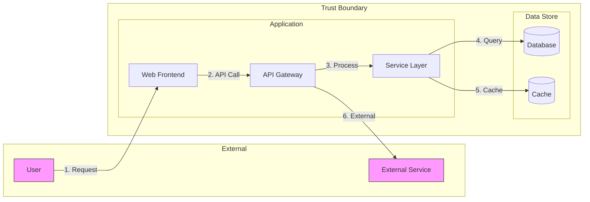
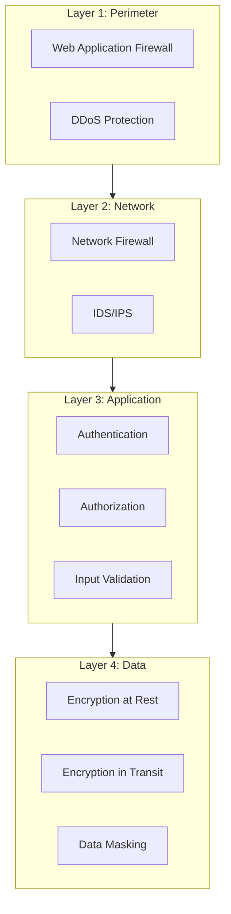
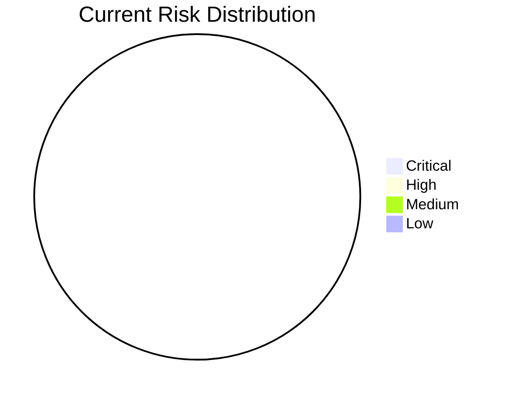

# 🔐 Security Documentation: test-feature-v2

**Plan:** test-feature-v2  
**Created:** 2025-12-30  
**Author:** CORTEX Planning System 4.0  
**Status:** 📋 Template Generated - Awaiting Analysis  
**Last Updated:** 2025-12-30  

---

## 📋 Table of Contents

1. [Executive Summary](#1-executive-summary)
2. [Threat Model](#2-threat-model)
3. [Security Requirements](#3-security-requirements)
4. [Compliance Mapping](#4-compliance-mapping)
5. [Mitigation Strategies](#5-mitigation-strategies)
6. [Security Testing Plan](#6-security-testing-plan)
7. [Risk Register](#7-risk-register)
8. [Security Review Checklist](#8-security-review-checklist)

---

## 1. Executive Summary

### 1.1 Feature Security Overview

| Aspect | Details |
|--------|---------|
| **Feature Name** | test-feature-v2 |
| **Security Relevance** | {HIGH/MEDIUM/LOW} - {Justification} |
| **Data Sensitivity** | {PUBLIC/INTERNAL/CONFIDENTIAL/RESTRICTED} |
| **Compliance Impact** | {GDPR/HIPAA/PCI-DSS/SOC2/NONE} |
| **Risk Level** | {CRITICAL/HIGH/MEDIUM/LOW} |

### 1.2 Security Domains Affected

- [ ] **Authentication** - User identity verification
- [ ] **Authorization** - Access control and permissions
- [ ] **Data Protection** - Encryption, storage, transmission
- [ ] **Input Validation** - User input handling
- [ ] **API Security** - Endpoint protection
- [ ] **Network Security** - Communication channels
- [ ] **Logging & Monitoring** - Audit trails
- [ ] **Session Management** - User session handling
- [ ] **Error Handling** - Exception management
- [ ] **Configuration** - Security settings

---

## 2. Threat Model

### 2.1 STRIDE Analysis

**Reference:** `cortex-brain/knowledge-library/security/threat-modeling-framework.md`

#### Spoofing (Identity)

| Threat | Asset | Likelihood | Impact | Risk Score | Status |
|--------|-------|------------|--------|------------|--------|
| {Threat description} | {Asset} | {1-5} | {1-5} | {L×I} | ⏳ Analyzing |

**Mitigations:**
- [ ] {Mitigation 1}
- [ ] {Mitigation 2}

#### Tampering (Data Integrity)

| Threat | Asset | Likelihood | Impact | Risk Score | Status |
|--------|-------|------------|--------|------------|--------|
| {Threat description} | {Asset} | {1-5} | {1-5} | {L×I} | ⏳ Analyzing |

**Mitigations:**
- [ ] {Mitigation 1}
- [ ] {Mitigation 2}

#### Repudiation (Non-repudiation)

| Threat | Asset | Likelihood | Impact | Risk Score | Status |
|--------|-------|------------|--------|------------|--------|
| {Threat description} | {Asset} | {1-5} | {1-5} | {L×I} | ⏳ Analyzing |

**Mitigations:**
- [ ] {Mitigation 1}
- [ ] {Mitigation 2}

#### Information Disclosure (Confidentiality)

| Threat | Asset | Likelihood | Impact | Risk Score | Status |
|--------|-------|------------|--------|------------|--------|
| {Threat description} | {Asset} | {1-5} | {1-5} | {L×I} | ⏳ Analyzing |

**Mitigations:**
- [ ] {Mitigation 1}
- [ ] {Mitigation 2}

#### Denial of Service (Availability)

| Threat | Asset | Likelihood | Impact | Risk Score | Status |
|--------|-------|------------|--------|------------|--------|
| {Threat description} | {Asset} | {1-5} | {1-5} | {L×I} | ⏳ Analyzing |

**Mitigations:**
- [ ] {Mitigation 1}
- [ ] {Mitigation 2}

#### Elevation of Privilege (Authorization)

| Threat | Asset | Likelihood | Impact | Risk Score | Status |
|--------|-------|------------|--------|------------|--------|
| {Threat description} | {Asset} | {1-5} | {1-5} | {L×I} | ⏳ Analyzing |

**Mitigations:**
- [ ] {Mitigation 1}
- [ ] {Mitigation 2}

### 2.2 Attack Surface Analysis

#### Entry Points

| Entry Point | Type | Trust Level | Data Processed |
|-------------|------|-------------|----------------|
| {Entry point name} | {UI/API/File/Database} | {Anonymous/Authenticated/Admin} | {Description} |

#### Assets

| Asset | Classification | Owner | Protection Level |
|-------|---------------|-------|------------------|
| {Asset name} | {Data/Process/Service} | {Owner} | {Level} |

### 2.3 Data Flow Diagram (DFD)

---

## 3. Security Requirements

### 3.1 Functional Security Requirements

**Reference:** `cortex-brain/knowledge-library/security/access-control-patterns.md`

| ID | Requirement | Priority | OWASP Category | Status |
|----|-------------|----------|----------------|--------|
| SEC-001 | {Requirement description} | {P1/P2/P3} | {A01-A10} | ⏳ Pending |
| SEC-002 | {Requirement description} | {P1/P2/P3} | {A01-A10} | ⏳ Pending |

### 3.2 Non-Functional Security Requirements

| ID | Requirement | Metric | Target | Status |
|----|-------------|--------|--------|--------|
| NFSEC-001 | Authentication response time | Latency | < 500ms | ⏳ Pending |
| NFSEC-002 | Password hashing algorithm | Standard | bcrypt/Argon2 | ⏳ Pending |
| NFSEC-003 | Session timeout | Duration | 15-60 minutes | ⏳ Pending |
| NFSEC-004 | TLS version | Minimum | TLS 1.2+ | ⏳ Pending |

### 3.3 OWASP Top 10 Mapping

**Reference:** `cortex-brain/knowledge-library/security/owasp-top-10-guide.md`

| OWASP ID | Category | Relevant | Requirement | Status |
|----------|----------|----------|-------------|--------|
| A01:2021 | Broken Access Control | ⏳ Check | | |
| A02:2021 | Cryptographic Failures | ⏳ Check | | |
| A03:2021 | Injection | ⏳ Check | | |
| A04:2021 | Insecure Design | ⏳ Check | | |
| A05:2021 | Security Misconfiguration | ⏳ Check | | |
| A06:2021 | Vulnerable Components | ⏳ Check | | |
| A07:2021 | Authentication Failures | ⏳ Check | | |
| A08:2021 | Software/Data Integrity | ⏳ Check | | |
| A09:2021 | Logging Failures | ⏳ Check | | |
| A10:2021 | SSRF | ⏳ Check | | |

---

## 4. Compliance Mapping

### 4.1 Regulatory Requirements

**Reference:** `cortex-brain/knowledge-library/compliance/`

#### GDPR Compliance (if applicable)

| Article | Requirement | Implementation | Status |
|---------|-------------|----------------|--------|
| Art. 5 | Data minimization | {Implementation} | ⏳ Pending |
| Art. 6 | Lawful basis | {Implementation} | ⏳ Pending |
| Art. 7 | Consent | {Implementation} | ⏳ Pending |
| Art. 17 | Right to erasure | {Implementation} | ⏳ Pending |
| Art. 32 | Security measures | {Implementation} | ⏳ Pending |

#### HIPAA Compliance (if applicable)

| Rule | Requirement | Implementation | Status |
|------|-------------|----------------|--------|
| § 164.312(a) | Access Control | {Implementation} | ⏳ Pending |
| § 164.312(b) | Audit Controls | {Implementation} | ⏳ Pending |
| § 164.312(c) | Integrity | {Implementation} | ⏳ Pending |
| § 164.312(d) | Authentication | {Implementation} | ⏳ Pending |
| § 164.312(e) | Transmission Security | {Implementation} | ⏳ Pending |

#### PCI-DSS Compliance (if applicable)

| Requirement | Description | Implementation | Status |
|-------------|-------------|----------------|--------|
| Req 1 | Firewall configuration | {Implementation} | ⏳ Pending |
| Req 3 | Protect stored data | {Implementation} | ⏳ Pending |
| Req 4 | Encrypt transmission | {Implementation} | ⏳ Pending |
| Req 6 | Secure systems/apps | {Implementation} | ⏳ Pending |
| Req 8 | Identify/authenticate | {Implementation} | ⏳ Pending |

### 4.2 Industry Standards

| Standard | Requirement | Applicable | Implementation |
|----------|-------------|------------|----------------|
| ISO 27001 | ISMS | ⏳ Check | |
| NIST CSF | Security Framework | ⏳ Check | |
| CIS Controls | Security Controls | ⏳ Check | |
| SOC 2 Type II | Trust Services | ⏳ Check | |

---

## 5. Mitigation Strategies

### 5.1 Security Controls Matrix

**Reference:** `cortex-brain/knowledge-library/security/api-security-foundations.md`

| Threat | Control Type | Control Description | Implementation | Owner | Status |
|--------|-------------|---------------------|----------------|-------|--------|
| {Threat} | Preventive | {Description} | {How to implement} | {Team/Person} | ⏳ Pending |
| {Threat} | Detective | {Description} | {How to implement} | {Team/Person} | ⏳ Pending |
| {Threat} | Corrective | {Description} | {How to implement} | {Team/Person} | ⏳ Pending |

### 5.2 Defense in Depth Layers

### 5.3 Mitigation Implementation Plan

| ID | Mitigation | Phase | Effort | Priority | Dependencies |
|----|-----------|-------|--------|----------|--------------|
| MIT-001 | {Mitigation} | {Phase #} | {Hours} | {P1/P2/P3} | {Dependency} |
| MIT-002 | {Mitigation} | {Phase #} | {Hours} | {P1/P2/P3} | {Dependency} |

---

## 6. Security Testing Plan

### 6.1 Test Categories

**Reference:** `cortex-brain/knowledge-library/security/penetration-testing-methodology.md`

| Category | Test Type | Coverage | Tools | Status |
|----------|----------|----------|-------|--------|
| **SAST** | Static Analysis | Code Review | SonarQube, CodeQL | ⏳ Pending |
| **DAST** | Dynamic Analysis | Runtime | OWASP ZAP, Burp | ⏳ Pending |
| **SCA** | Dependency Scan | Components | Snyk, Dependabot | ⏳ Pending |
| **Secrets** | Secret Detection | Credentials | GitLeaks, TruffleHog | ⏳ Pending |
| **Penetration** | Manual Testing | Exploitation | Manual/Custom | ⏳ Pending |

### 6.2 Security Test Cases

| ID | Test Case | Type | Expected Result | Priority |
|----|-----------|------|-----------------|----------|
| ST-001 | SQL injection in {endpoint} | DAST | No SQL errors, blocked | P1 |
| ST-002 | XSS in {input field} | DAST | Sanitized output | P1 |
| ST-003 | Authentication bypass | Penetration | Access denied | P1 |
| ST-004 | Session hijacking | Penetration | Invalid session | P2 |
| ST-005 | CSRF attack | DAST | Request rejected | P2 |

### 6.3 Security Acceptance Criteria

- [ ] All P1 vulnerabilities resolved
- [ ] OWASP Top 10 coverage complete
- [ ] Static analysis with zero critical findings
- [ ] Dynamic analysis with zero high/critical findings
- [ ] Dependency scan with no known critical CVEs
- [ ] Penetration test passed
- [ ] Security code review completed

---

## 7. Risk Register

### 7.1 Risk Assessment Matrix

**Reference:** `cortex-brain/knowledge-library/security/risk-assessment-methodology.md`

| Risk ID | Description | Likelihood | Impact | Risk Level | Owner | Mitigation | Status |
|---------|-------------|------------|--------|------------|-------|------------|--------|
| RISK-001 | {Risk description} | {1-5} | {1-5} | {Score} | {Owner} | {Mitigation ref} | ⏳ Open |
| RISK-002 | {Risk description} | {1-5} | {1-5} | {Score} | {Owner} | {Mitigation ref} | ⏳ Open |

### 7.2 Risk Scoring Guide

| Score | Likelihood | Impact |
|-------|------------|--------|
| 1 | Rare | Minimal |
| 2 | Unlikely | Minor |
| 3 | Possible | Moderate |
| 4 | Likely | Major |
| 5 | Almost Certain | Severe |

**Risk Level Calculation:** `Likelihood × Impact`

| Risk Level | Score Range | Action Required |
|------------|-------------|-----------------|
| 🟢 Low | 1-6 | Monitor |
| 🟡 Medium | 7-12 | Plan mitigation |
| 🟠 High | 13-19 | Prioritize mitigation |
| 🔴 Critical | 20-25 | Immediate action |

### 7.3 Risk Trend

---

## 8. Security Review Checklist

### 8.1 Pre-Implementation Review

- [ ] Threat model completed and reviewed
- [ ] Security requirements documented
- [ ] Compliance requirements identified
- [ ] Security architecture approved
- [ ] Risk assessment completed

### 8.2 Implementation Review

- [ ] Secure coding guidelines followed
- [ ] Input validation implemented
- [ ] Output encoding implemented
- [ ] Authentication mechanism reviewed
- [ ] Authorization controls implemented
- [ ] Cryptographic controls reviewed
- [ ] Error handling reviewed
- [ ] Logging implemented per standards

### 8.3 Pre-Deployment Review

- [ ] Security testing completed
- [ ] All P1/P2 vulnerabilities resolved
- [ ] Penetration test passed
- [ ] Code review completed
- [ ] Security documentation updated
- [ ] Incident response plan updated
- [ ] Monitoring/alerting configured

### 8.4 Post-Deployment Review

- [ ] Production security validation
- [ ] Security monitoring active
- [ ] Audit logging operational
- [ ] Backup/recovery tested
- [ ] Security metrics collected

---

## 📎 References

### CORTEX Security Knowledge Library

- [Threat Modeling Framework](../../../knowledge-library/security/threat-modeling-framework.md)
- [OWASP Top 10 Guide](../../../knowledge-library/security/owasp-top-10-guide.md)
- [API Security Foundations](../../../knowledge-library/security/api-security-foundations.md)
- [Access Control Patterns](../../../knowledge-library/security/access-control-patterns.md)
- [Data Protection Framework](../../../knowledge-library/security/data-protection-framework.md)
- [Incident Response Playbook](../../../knowledge-library/security/incident-response-playbook.md)
- [Audit Logging Standards](../../../knowledge-library/security/audit-logging-standards.md)
- [Penetration Testing Methodology](../../../knowledge-library/security/penetration-testing-methodology.md)
- [Risk Assessment Methodology](../../../knowledge-library/security/risk-assessment-methodology.md)

### Compliance Checklists

- [GDPR Compliance Checklist](../../../knowledge-library/compliance/gdpr-compliance-checklist.md)
- [HIPAA Compliance Checklist](../../../knowledge-library/compliance/hipaa-compliance-checklist.md)
- [PCI-DSS Compliance Checklist](../../../knowledge-library/compliance/pci-dss-compliance-checklist.md)
- [SOC2 Compliance Checklist](../../../knowledge-library/compliance/soc2-compliance-checklist.md)

---

## 📝 Document History

| Version | Date | Author | Changes |
|---------|------|--------|---------|
| 1.0 | 2025-12-30 | CORTEX Planning System 4.0 | Initial security documentation template |

---

**⚠️ IMPORTANT:** This security documentation MUST be reviewed and updated by a qualified security professional before implementation. Auto-generated content requires manual verification and completion based on the specific feature requirements.
