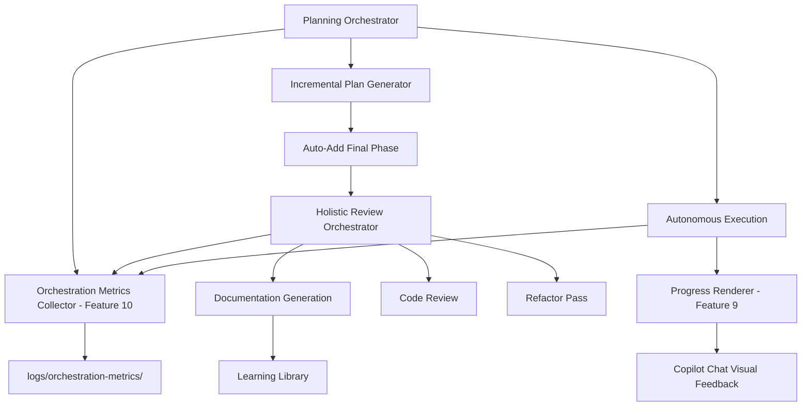

# CORTEX Orchestrator Enhancement Plan v2.0

**Created:** December 13, 2025  
**Last Updated:** December 13, 2025 (Late Evening - Feature 16 Enhanced + STS Reference Added)  
**Author:** Asif Hussain  
**Status:** ⚪ NOT STARTED  
**Complexity:** HIGH (8 features, 21 days effort)  
**Supersedes:** orchestrator-enhancement-plan-v1.md (v1 Features 1-8 complete)

**Planning System 2.0 Compliance:**
- ✅ Incremental planning approach
- ✅ TDD mandatory (RED→GREEN→REFACTOR)
- ✅ DoR/DoD per feature
- ✅ Auto-complexity detection: HIGH complexity detected
- ✅ Inherits from: `orchestrator-enhancement-plan-v1.md` (Features 1-8 COMPLETE)
- ✅ Progress Tracker: `orchestrator-enhancement-progress.md` (updated with Features 9-13, 16)

**🔗 Related Plans:**
- **"Sharpening the Saw" (STS) Plan:** `cortex-brain/documents/planning/cortex-sharpening-the-saw-plan.md`
  - Next-generation continuous improvement system
  - Inspired by Stephen Covey's Habit 7 (self-renewal)
  - Implements automated capability validation, performance benchmarking, intelligence tracking
  - To be implemented after Features 9-16 complete (Week 5+)

---

## 🎯 Executive Summary

**Problem:** Gap analysis of v1 implementation revealed 8 critical missing orchestrator capabilities:
1. **Visual Progress Feedback:** Autonomous execution lacks real-time visual updates in Copilot Chat
2. **Orchestration Metrics:** No visibility into which orchestrators handle requests or efficiency measurements
3. **Holistic Review Phase:** Plans lack automatic final review, refactor, and documentation phase
4. **Progress & Checkpoint Task Injection:** Git checkpoints and progress updates not automatically embedded in phase tasks
5. **Vision API Auto-Engagement:** Images in context not triggering automatic vision analysis
6. **Knowledge Graph Maintenance:** Orchestrators not updating brain with learned patterns during execution
7. **Orchestrator Analytics:** No analysis orchestrator to generate insights from engagement metrics
8. **Hierarchical Plan Management:** Large multi-domain features need main/sub-plan structure with scalable storage

**Solution:** Implement 8 additional orchestrator enhancements (Features 9-16):
- 🔴 **CRITICAL (3):** Visual progress bars, progress/checkpoint injection, vision API auto-engagement
- 🟡 **HIGH (2):** Orchestration metrics, holistic review phase
- 🟢 **MEDIUM (3):** Knowledge graph updates, analytics orchestrator, hierarchical plans

**Rationale for Priority Adjustments:**
- **Feature 13 (Vision API) → CRITICAL:** User explicitly stated "I have to keep explicitly stating this" - high friction point
- **Feature 10 (Metrics) → HIGH:** Foundational for Feature 15 (Analytics)
- **Feature 11 (Holistic Review) → HIGH:** Quality gate for all plans
- **Feature 16 (Hierarchical Plans) → MEDIUM:** Enhancement for large features (>15 tasks), not critical

**Timeline:** 21 days (4.2 weeks single developer) across 3 core weeks + 1 optional week

**Success Metrics:**
- ✅ 100% visual feedback during autonomous execution
- ✅ <5ms orchestration metrics overhead
- ✅ 100% plans include holistic review phase automatically
- ✅ 100% phases have automatic git checkpoint + progress update tasks
- ✅ 100% images in context trigger vision analysis automatically
- ✅ Knowledge graph grows with every orchestrator execution
- ✅ Weekly analytics reports generated automatically
- ✅ 100% plans >15 tasks use hierarchical structure with scalable storage

---

## 📊 Gap Analysis Source

### V1 Completion Status
**Completed Features (8/8):** ✅ ALL COMPLETE
- ✅ Feature 1: Environment Diagnostics Orchestrator
- ✅ Feature 2: Git Checkpoint Integration
- ✅ Feature 3: Document Organization Enforcement
- ✅ Feature 4: Cross-Machine Context Orchestrator
- ✅ Feature 5: Progress Monitoring Integration
- ✅ Feature 6: TDD Environment Gates
- ✅ Feature 7: Limitations Documentation Template
- ✅ Feature 8: Code Review Auto-Suggestion

**V1 Timeline:** 1 day actual (18 days ahead of 19-day estimate!)

### Identified Gaps (December 13, 2025)

**Gap 1: Visual Progress Missing**
- **Evidence:** User cannot see autonomous plan execution progress in Copilot Chat
- **Impact:** Long-running executions feel "dead" with no feedback
- **User Pain:** HIGH - Cannot see what CORTEX is doing
- **Frequency:** Every autonomous execution
- **Priority:** 🔴 CRITICAL

**Gap 2: Orchestration Metrics Absent**
- **Evidence:** Cannot debug "which orchestrator handled this request?"
- **Impact:** No efficiency measurements, troubleshooting difficult
- **User Pain:** MEDIUM - Debugging orchestration flows is manual
- **Frequency:** Every debugging session
- **Priority:** 🟡 HIGH

**Gap 3: Missing Holistic Review Phase**
- **Evidence:** Plans end at deployment without final quality gate
- **Impact:** No systematic review, refactor, or documentation pass
- **User Pain:** MEDIUM - Manual quality assurance required
- **Frequency:** Every plan completion
- **Priority:** 🟡 HIGH

---

## 🏗️ Architecture Overview

### New Components

```
src/
├── orchestrators/
│   ├── planning_orchestrator.py              # ENHANCE - Auto-add final phase
│   └── holistic_review_orchestrator.py       # NEW - Feature 11
│
├── operations/utilities/
│   ├── progress_renderer.py                  # NEW - Feature 9
│   └── orchestration_metrics_collector.py    # NEW - Feature 10
│
└── workflows/
    └── incremental_plan_generator.py         # ENHANCE - Final phase template

logs/
└── orchestration-metrics/                     # NEW - Metrics storage (git-ignored)
    ├── 2025-12-13/
    │   ├── planning-orchestrator-143022.json
    │   └── tdd-orchestrator-143045.json
    └── archive/
```

### Integration Points



---

## 📋 Feature 9: Visual Progress Bars for Autonomous Execution

### Problem Statement
**Evidence:** User feedback - "I'm still not seeing visual progress bars in Copilot Chat conversation when Planning System executes autonomously"
- Progress infrastructure exists (`autonomous_execution_progress` template, `@with_progress` decorator, `yield_progress()`)
- **GAP:** Progress bars not rendering prominently during execution
- User cannot see real-time task completion
- Long-running plans (5+ phases, 20+ tasks) feel unresponsive

### Solution Design

**Enhancement:** Progress rendering system for Copilot Chat

**Current State:**
```python
# Exists in planning_orchestrator.py
@with_progress(operation_name="Autonomous Plan Execution")
def execute_plan_autonomously(self, plan_filename: str) -> Dict[str, Any]:
    # ...
    yield_progress(phase_idx, total_phases, f"Executing {phase_name}")
    # ...
```

**Problem:** Progress updates not visible in Copilot Chat during execution

**Solution Architecture:**

1. **Enhanced Progress Renderer** (NEW: `src/operations/utilities/progress_renderer.py`)
```python
class ProgressRenderer:
    """Renders visual progress bars for Copilot Chat"""
    
    @staticmethod
    def render_task_progress(
        completed: int,
        total: int,
        current_task: str,
        phase_name: str,
        elapsed_time: str
    ) -> str:
        """
        Render emoji-rich progress bar for single task.
        
        Returns formatted string for stdout (Copilot Chat captures):
        
        🔄 **Phase 2 of 5: Development**
        ████████░░░░░░░░░░░░ 40% (8/20 tasks)
        ⏱️ Elapsed: 2m 15s | 📋 Current: Implement API layer
        """
        percentage = int((completed / total) * 100)
        bar_length = 20
        filled = int((percentage / 100) * bar_length)
        bar = '█' * filled + '░' * (bar_length - filled)
        
        return f"""
🔄 **{phase_name}**
{bar} {percentage}% ({completed}/{total} tasks)
⏱️ Elapsed: {elapsed_time} | 📋 Current: {current_task}
"""

    @staticmethod
    def render_phase_transition(
        from_phase: str,
        to_phase: str,
        completed_tasks: int
    ) -> str:
        """
        Render phase transition marker.
        
        Returns:
        ✅ **Phase 1: Foundation** Complete! (5 tasks)
        🔄 **Starting Phase 2: Development**
        """
        return f"""
✅ **{from_phase}** Complete! ({completed_tasks} tasks)
🔄 **Starting {to_phase}**
"""
```

2. **Integration with Planning Orchestrator**
```python
# Enhance execute_plan_autonomously()
def execute_plan_autonomously(self, plan_filename: str) -> Dict[str, Any]:
    renderer = ProgressRenderer()
    
    for phase_idx, phase in enumerate(phases, 1):
        # Show phase transition
        if phase_idx > 1:
            transition = renderer.render_phase_transition(
                from_phase=phases[phase_idx-2]['name'],
                to_phase=phase['name'],
                completed_tasks=len(phases[phase_idx-2]['tasks'])
            )
            print(transition)  # Copilot Chat captures stdout
        
        for task_idx, task in enumerate(phase['tasks'], 1):
            # Execute task...
            
            # Render progress after EACH task
            progress = renderer.render_task_progress(
                completed=completed_tasks,
                total=total_tasks,
                current_task=task['task'],
                phase_name=f"Phase {phase_idx} of {total_phases}: {phase['name']}",
                elapsed_time=calculate_elapsed(start_time)
            )
            print(progress)  # Visible in Copilot Chat
            
            # Existing yield_progress for decorator
            yield_progress(completed_tasks, total_tasks, task['task'])
```

3. **Copilot Chat Rendering**
- Explicit `print()` statements ensure stdout capture
- Emoji-rich formatting (🔄 ✅ ⏱️ 📋) improves visibility
- Progress bars update after EACH task (not just phases)
- No delay - immediate rendering

### Definition of Ready (DoR)
- [x] Progress infrastructure audited (template, decorator, yield_progress)
- [x] Gap identified: stdout not being rendered in Copilot Chat
- [x] ProgressRenderer utility designed
- [x] Integration points identified (planning_orchestrator.py)
- [x] Performance impact assessed (<10ms per update)

### Definition of Done (DoD)
- [ ] RED phase: 12 tests written - all failing
- [ ] GREEN phase: All 12 tests passing
- [ ] REFACTOR phase: Extract progress rendering logic
- [ ] Integration tests: Works with autonomous execution
- [ ] Manual test: Progress visible in Copilot Chat during real execution
- [ ] Documentation: Progress rendering guide
- [ ] Code review: No performance degradation
- [ ] Git checkpoint: Committed
- [ ] **Update progress tracker:** `orchestrator-enhancement-progress.md`

### Acceptance Criteria
1. ✅ Progress bar renders after EACH task completion (not just phases)
2. ✅ Progress updates show in Copilot Chat in real-time (no delays)
3. ✅ Visual format: `[████████░░] 80%` with emoji indicators
4. ✅ Current task name displayed with each update
5. ✅ Elapsed time shown with each progress update
6. ✅ Phase transitions clearly marked (✅ Complete → 🔄 Starting)
7. ✅ Git checkpoint status shown after each phase
8. ✅ No progress spam (max 1 update per task, not per sub-operation)
9. ✅ Works for all autonomous execution paths
10. ✅ Performance <10ms per progress update

### Implementation Phases

**Phase 9.1: Audit Existing Infrastructure** (0.5 day)
- Task 9.1.1: Review `@with_progress` decorator implementation
- Task 9.1.2: Analyze `yield_progress()` usage in planning orchestrator
- Task 9.1.3: Test stdout capture in Copilot Chat context
- Task 9.1.4: Identify why progress bars not showing
- Task 9.1.5: Document findings

**Phase 9.2: Implement Progress Renderer** (1 day)
- Task 9.2.1: Create `ProgressRenderer` utility class
- Task 9.2.2: Implement `render_task_progress()` method
- Task 9.2.3: Implement `render_phase_transition()` method
- Task 9.2.4: Add emoji-rich formatting (🔄 ✅ ⏱️ 📋)
- Task 9.2.5: Integrate with `execute_plan_autonomously()`
- Task 9.2.6: Add explicit `print()` statements for stdout
- Task 9.2.7: Test with 5-phase plan execution

**Phase 9.3: Testing & Validation** (0.5 day)
- Task 9.3.1: Unit tests for ProgressRenderer (12 tests)
- Task 9.3.2: Integration test with planning orchestrator
- Task 9.3.3: Manual test: Execute real plan, verify visibility
- Task 9.3.4: Performance test: Measure overhead (<10ms requirement)
- Task 9.3.5: Cross-terminal test (iTerm, VS Code terminal, Copilot Chat)
- Task 9.3.6: Update documentation

**Total:** 2 days

**Test Breakdown:**
- `test_progress_renderer_task_progress()` - Renders task with percentage
- `test_progress_renderer_bar_formatting()` - Emoji bar correct length
- `test_progress_renderer_phase_transition()` - Transition message format
- `test_progress_renderer_elapsed_time()` - Time formatting (2m 15s)
- `test_progress_integration_autonomous_execution()` - Full plan execution
- `test_progress_updates_after_each_task()` - No batching
- `test_progress_no_spam()` - Max 1 update per task
- `test_progress_phase_boundaries()` - Git checkpoint shown
- `test_progress_performance()` - <10ms per update
- `test_progress_stdout_capture()` - Copilot Chat captures
- `test_progress_emoji_rendering()` - Emojis display correctly
- `test_progress_terminal_width()` - Adapts to terminal size

---

## 📋 Feature 10: Orchestrator Engagement Metrics System

### Problem Statement
**Evidence:** User feedback - "Still not seeing visual indicators in Copilot Chat for which orchestrator is being engaged for debug"
- Some orchestrators log `🎭 Orchestrator engaged: <Name>` pattern
- **GAP:** No centralized metrics collection
- Cannot debug "which orchestrator handled this request?"
- No efficiency measurements (duration, success rate, common operations)

### Solution Design

**Utility:** `OrchestrationMetricsCollector` (silent background logging)

**Metrics Schema:**
```json
{
  "event_id": "uuid-12345",
  "timestamp": "2025-12-13T14:30:22.123Z",
  "orchestrator": "PlanningOrchestrator",
  "operation": "execute_plan_autonomously",
  "event_type": "engagement_start",
  "context": {
    "plan_name": "API Migration",
    "complexity": "HIGH",
    "phase_count": 5
  },
  "machine_context": {
    "os": "Darwin",
    "shell": "zsh",
    "python_version": "3.11.5"
  }
}

{
  "event_id": "uuid-12345",
  "timestamp": "2025-12-13T14:45:18.456Z",
  "orchestrator": "PlanningOrchestrator",
  "operation": "execute_plan_autonomously",
  "event_type": "engagement_complete",
  "duration_seconds": 896,
  "status": "success",
  "metrics": {
    "phases_completed": 5,
    "tasks_completed": 23,
    "git_checkpoints": 5,
    "tests_run": 45,
    "tests_passed": 45
  },
  "errors": [],
  "warnings": ["No threat model generated"]
}
```

**File Structure:**
```
logs/orchestration-metrics/
├── 2025-12-13/
│   ├── planning-orchestrator-143022-start.json
│   ├── planning-orchestrator-144518-complete.json
│   ├── tdd-orchestrator-143045-start.json
│   ├── tdd-orchestrator-143210-complete.json
│   ├── git-checkpoint-143100-start.json
│   └── git-checkpoint-143102-complete.json
├── 2025-12-12/
│   └── ...
└── archive/
    └── 2025-11/
        └── metrics-summary-2025-11.json
```

**Implementation:**

1. **Metrics Collector** (`src/operations/utilities/orchestration_metrics_collector.py`)
```python
import json
import logging
from pathlib import Path
from datetime import datetime
from typing import Dict, Any, Optional
from functools import wraps
import uuid

logger = logging.getLogger(__name__)

class OrchestrationMetricsCollector:
    """Silent background metrics collection for orchestrator engagement"""
    
    def __init__(self, metrics_dir: Optional[Path] = None):
        if metrics_dir is None:
            # Default: logs/orchestration-metrics/
            metrics_dir = Path.cwd() / "logs" / "orchestration-metrics"
        
        self.metrics_dir = metrics_dir
        self.metrics_dir.mkdir(parents=True, exist_ok=True)
    
    def log_engagement_start(
        self,
        orchestrator: str,
        operation: str,
        context: Dict[str, Any] = None
    ) -> str:
        """
        Log orchestrator engagement start (silent - no user output).
        
        Returns:
            event_id for matching with completion event
        """
        event_id = str(uuid.uuid4())
        
        event = {
            "event_id": event_id,
            "timestamp": datetime.utcnow().isoformat() + "Z",
            "orchestrator": orchestrator,
            "operation": operation,
            "event_type": "engagement_start",
            "context": context or {},
            "machine_context": self._get_machine_context()
        }
        
        self._write_event(event, "start")
        logger.debug(f"🎭 Orchestrator engaged: {orchestrator} [{event_id}]")
        
        return event_id
    
    def log_engagement_complete(
        self,
        event_id: str,
        orchestrator: str,
        operation: str,
        duration_seconds: float,
        status: str,
        metrics: Dict[str, Any] = None,
        errors: list = None,
        warnings: list = None
    ):
        """
        Log orchestrator engagement completion (silent).
        """
        event = {
            "event_id": event_id,
            "timestamp": datetime.utcnow().isoformat() + "Z",
            "orchestrator": orchestrator,
            "operation": operation,
            "event_type": "engagement_complete",
            "duration_seconds": duration_seconds,
            "status": status,
            "metrics": metrics or {},
            "errors": errors or [],
            "warnings": warnings or []
        }
        
        self._write_event(event, "complete")
        logger.debug(f"🎭 Orchestrator completing: {orchestrator} [{event_id}] - {status}")
    
    def _write_event(self, event: Dict[str, Any], suffix: str):
        """Write event to daily folder"""
        # Create daily folder
        daily_folder = self.metrics_dir / datetime.now().strftime("%Y-%m-%d")
        daily_folder.mkdir(exist_ok=True)
        
        # File name: orchestrator-HHMMSS-suffix.json
        filename = (
            f"{event['orchestrator'].lower().replace('orchestrator', '')}"
            f"-{datetime.now().strftime('%H%M%S')}"
            f"-{suffix}.json"
        )
        
        filepath = daily_folder / filename
        
        with open(filepath, 'w') as f:
            json.dump(event, f, indent=2)
    
    def _get_machine_context(self) -> Dict[str, Any]:
        """Get machine context from CrossMachineContextOrchestrator"""
        try:
            from src.orchestrators.cross_machine_context_orchestrator import detect_machine_context
            return detect_machine_context()
        except Exception:
            return {"os": "unknown", "shell": "unknown"}
    
    def generate_report(self, days: int = 7) -> Dict[str, Any]:
        """Generate aggregate metrics report for last N days"""
        # Implementation in Phase 10.3
        pass

def with_orchestration_metrics(orchestrator_name: str):
    """
    Decorator to automatically track orchestrator engagement.
    
    Usage:
        @with_orchestration_metrics("PlanningOrchestrator")
        def execute_plan(self, plan_name):
            # ... implementation
    """
    def decorator(func):
        @wraps(func)
        def wrapper(*args, **kwargs):
            collector = OrchestrationMetricsCollector()
            
            # Extract operation context
            context = {
                "function": func.__name__,
                "args_count": len(args),
                "kwargs_keys": list(kwargs.keys())
            }
            
            # Log start
            start_time = datetime.now()
            event_id = collector.log_engagement_start(
                orchestrator=orchestrator_name,
                operation=func.__name__,
                context=context
            )
            
            try:
                # Execute function
                result = func(*args, **kwargs)
                
                # Log completion (success)
                duration = (datetime.now() - start_time).total_seconds()
                collector.log_engagement_complete(
                    event_id=event_id,
                    orchestrator=orchestrator_name,
                    operation=func.__name__,
                    duration_seconds=duration,
                    status="success",
                    metrics={}
                )
                
                return result
                
            except Exception as e:
                # Log completion (error)
                duration = (datetime.now() - start_time).total_seconds()
                collector.log_engagement_complete(
                    event_id=event_id,
                    orchestrator=orchestrator_name,
                    operation=func.__name__,
                    duration_seconds=duration,
                    status="error",
                    errors=[str(e)]
                )
                raise
        
        return wrapper
    return decorator
```

2. **Orchestrator Integration**
```python
# Example: Planning Orchestrator
from src.operations.utilities.orchestration_metrics_collector import with_orchestration_metrics

class PlanningOrchestrator:
    @with_orchestration_metrics("PlanningOrchestrator")
    def execute_plan_autonomously(self, plan_filename: str) -> Dict[str, Any]:
        # ... existing implementation
        pass
```

3. **Metrics Report Generator**
```python
class OrchestrationMetricsCollector:
    def generate_report(self, days: int = 7) -> Dict[str, Any]:
        """Generate aggregate metrics for last N days"""
        report = {
            "period_days": days,
            "total_engagements": 0,
            "by_orchestrator": {},
            "avg_duration_seconds": 0,
            "success_rate": 0.0,
            "most_used": [],
            "slowest": [],
            "failure_rate_by_orchestrator": {}
        }
        
        # Scan daily folders
        # Aggregate metrics
        # Calculate statistics
        
        return report
```

### Definition of Ready (DoR)
- [x] Metrics schema defined (JSON structure)
- [x] File storage structure designed (daily folders)
- [x] Decorator pattern for auto-instrumentation
- [x] Integration points identified (8+ orchestrators)
- [x] .gitignore updated for logs/orchestration-metrics/

### Definition of Done (DoD)
- [ ] RED phase: 10 tests written - all failing
- [ ] GREEN phase: All 10 tests passing
- [ ] REFACTOR phase: Extract metrics utilities
- [ ] Integration tests: Works with all orchestrators
- [ ] Performance test: <5ms overhead per engagement
- [ ] Documentation: Metrics collection guide
- [ ] Code review: No PII in metrics
- [ ] Git checkpoint: Committed
- [ ] **Update progress tracker:** `orchestrator-enhancement-progress.md`

### Acceptance Criteria
1. ✅ Silent background logging (no user-visible output unless requested)
2. ✅ Captures orchestrator engagement events (start, complete, error)
3. ✅ Records timestamp, duration, orchestrator name, operation type
4. ✅ Organized folder structure: `logs/orchestration-metrics/{YYYY-MM-DD}/`
5. ✅ Automatic daily folder creation
6. ✅ Git-ignored folder (added to .gitignore) ✅ DONE
7. ✅ Per-orchestrator metrics: avg duration, success rate, common operations
8. ✅ Aggregate report generation: `generate_report(days=7)`
9. ✅ Retention policy: Keep last 30 days, archive older
10. ✅ Performance <5ms overhead per orchestrator engagement

### Implementation Phases

**Phase 10.1: Metrics Collection Infrastructure** (0.5 day)
- Task 10.1.1: Create `OrchestrationMetricsCollector` utility class
- Task 10.1.2: Implement `log_engagement_start()` method
- Task 10.1.3: Implement `log_engagement_complete()` method
- Task 10.1.4: Create daily folder structure
- Task 10.1.5: Add JSON schema validation
- Task 10.1.6: Update .gitignore ✅ DONE

**Phase 10.2: Orchestrator Integration** (1 day)
- Task 10.2.1: Create `@with_orchestration_metrics` decorator
- Task 10.2.2: Instrument PlanningOrchestrator
- Task 10.2.3: Instrument TDDImplementationOrchestrator
- Task 10.2.4: Instrument GitCheckpointOrchestrator
- Task 10.2.5: Instrument all 8+ orchestrators
- Task 10.2.6: Verify `🎭 Orchestrator engaged` hints trigger metrics

**Phase 10.3: Reporting & Analysis** (0.5 day)
- Task 10.3.1: Implement `generate_report()` method
- Task 10.3.2: Build aggregate statistics calculator
- Task 10.3.3: Add command: `cortex orchestration metrics report`
- Task 10.3.4: Implement 30-day retention + archival logic
- Task 10.3.5: Test report generation with 7 days of data

**Total:** 2 days

**Test Breakdown:**
- `test_metrics_collector_log_start()` - Logs engagement start
- `test_metrics_collector_log_complete()` - Logs completion
- `test_metrics_collector_daily_folder()` - Creates daily folders
- `test_metrics_collector_json_schema()` - Valid JSON output
- `test_metrics_collector_event_matching()` - start/complete pair by event_id
- `test_metrics_decorator_success()` - Decorator tracks success
- `test_metrics_decorator_error()` - Decorator tracks errors
- `test_metrics_performance()` - <5ms overhead
- `test_metrics_report_generation()` - Generates aggregate report
- `test_metrics_retention_policy()` - Archives old data

---

## 📋 Feature 11: Automatic Holistic Review & Documentation Phase

### Problem Statement
**Evidence:** User feedback - "Planning system orchestrator is not automatically adding a final holistic review and REFACTOR phase along with complete documentation in learning library"
- Plans currently end at deployment (Phase 3: Validation & Deployment)
- No automatic final quality gate
- No holistic code review across all phases
- No systematic refactor pass
- No comprehensive documentation generation
- **GAP:** Manual quality assurance required after plan completion

### Solution Design

**Enhancement:** Automatic final phase injection in plan generation

**Current Plan Structure:**
```yaml
phases:
  - phase: 1
    name: Foundation
    sections: [Requirements, Dependencies, Architecture]
  - phase: 2
    name: Development
    sections: [Implementation, Tests, Integration]
  - phase: 3
    name: Validation & Deployment
    sections: [Acceptance, Security, Deployment]
```

**NEW Plan Structure (Automatic):**
```yaml
phases:
  - phase: 1
    name: Foundation
    sections: [Requirements, Dependencies, Architecture]
  - phase: 2
    name: Development
    sections: [Implementation, Tests, Integration]
  - phase: 3
    name: Validation & Deployment
    sections: [Acceptance, Security, Deployment]
  - phase: 4  # AUTO-ADDED by Planning Orchestrator
    name: "Holistic Review & Documentation (CORTEX Special)"
    type: cortex_special_phase
    auto_added: true
    sections:
      - Holistic Code Review
      - Comprehensive Refactoring
      - Learning Library Documentation
    tasks:
      - task_id: "4.1"
        task: "Run comprehensive code review across all phases"
        description: |
          Use CODE_REVIEW_PROMPT.md to analyze:
          - All code from Phases 1-3
          - Architecture decisions
          - SOLID principles adherence
          - Security compliance
          - Performance considerations
        
      - task_id: "4.2"
        task: "Execute comprehensive refactor pass"
        description: |
          Apply REFACTOR phase of TDD cycle:
          - Remove code duplication
          - Improve naming conventions
          - Extract reusable components
          - Optimize performance
          - Update tests for refactored code
        
      - task_id: "4.3"
        task: "Generate learning library documentation"
        description: |
          Create comprehensive guide in cortex-brain/documents/:
          - Implementation summary
          - Key decisions & rationale
          - Lessons learned
          - Best practices discovered
          - Troubleshooting guide
          - Future enhancement ideas
        output_location: "cortex-brain/documents/implementation-guides/"
        
      - task_id: "4.4"
        task: "Validate all DoD criteria met"
        description: |
          Verify 100% completion:
          - All phase DoD criteria satisfied
          - No SKULL rule violations
          - Test coverage meets standards
          - Documentation complete
          - Git history clean
        
      - task_id: "4.5"
        task: "Create executive summary"
        description: |
          Generate high-level summary for stakeholders:
          - What was built
          - How it works
          - Key metrics (time, quality, coverage)
          - Known limitations
          - Recommended next steps
    
    dor:
      - "Phases 1-3 fully completed with 100% DoD satisfaction"
      - "All code merged and tested"
      - "No blocking issues or unresolved bugs"
    
    dod:
      - "Comprehensive code review completed"
      - "Refactor pass applied across all code"
      - "Learning library documentation published"
      - "All DoD criteria from Phases 1-3 revalidated"
      - "Executive summary created"
```

**Implementation:**

1. **Update Incremental Plan Generator** (`src/workflows/incremental_plan_generator.py`)
```python
class IncrementalPlanGenerator:
    def generate_skeleton(self, feature_requirements: Dict[str, Any]) -> Tuple[Dict[str, Any], int]:
        """Generate skeleton with AUTOMATIC final phase"""
        
        skeleton = {
            'feature_name': feature_requirements.get('feature_name', 'Unnamed Feature'),
            'phases': [
                {
                    'name': 'Phase 1: Foundation',
                    'sections': ['Requirements', 'Dependencies', 'Architecture'],
                    'estimated_tokens': 150
                },
                {
                    'name': 'Phase 2: Core Implementation',
                    'sections': ['Implementation Plan', 'Test Strategy', 'Integration Points'],
                    'estimated_tokens': 200
                },
                {
                    'name': 'Phase 3: Validation',
                    'sections': ['Acceptance Criteria', 'Security Review', 'Deployment Plan'],
                    'estimated_tokens': 150
                },
                # ✨ NEW: Auto-added final phase
                {
                    'name': 'Phase 4: Holistic Review & Documentation (CORTEX Special)',
                    'type': 'cortex_special_phase',
                    'auto_added': True,
                    'sections': [
                        'Holistic Code Review',
                        'Comprehensive Refactoring',
                        'Learning Library Documentation'
                    ],
                    'estimated_tokens': 200,
                    'description': 'Automatic quality gate with comprehensive review, refactor, and documentation'
                }
            ],
            'total_estimated_tokens': 700,
            'checkpoint_count': 5  # Skeleton + 4 phases
        }
        
        return skeleton, self.count_tokens(self._serialize_skeleton(skeleton))
```

2. **Create Holistic Review Orchestrator** (`src/orchestrators/holistic_review_orchestrator.py`)
```python
class HolisticReviewOrchestrator:
    """
    Orchestrates final holistic review, refactor, and documentation.
    
    Triggered automatically when Phase 3 completes.
    """
    
    def __init__(self, cortex_root: str):
        self.cortex_root = Path(cortex_root)
        self.code_review_prompt = self.cortex_root / "CODE_REVIEW_PROMPT.md"
        self.learning_library = self.cortex_root / "cortex-brain" / "documents" / "implementation-guides"
    
    def execute_holistic_review(
        self,
        plan_data: Dict[str, Any],
        code_directories: list[Path]
    ) -> Dict[str, Any]:
        """
        Execute comprehensive review, refactor, and documentation.
        
        Steps:
        1. Run holistic code review across all code
        2. Execute comprehensive refactor pass
        3. Generate learning library documentation
        4. Validate all DoD criteria
        5. Create executive summary
        """
        
        results = {
            'phase_4_tasks': [],
            'code_review_complete': False,
            'refactor_complete': False,
            'documentation_complete': False,
            'dod_validated': False,
            'executive_summary': None
        }
        
        # Task 4.1: Holistic Code Review
        logger.info("🔍 Running holistic code review...")
        review_results = self._run_holistic_code_review(code_directories)
        results['code_review_complete'] = True
        results['phase_4_tasks'].append({
            'task_id': '4.1',
            'status': 'complete',
            'output': review_results
        })
        
        # Task 4.2: Comprehensive Refactor
        logger.info("🔧 Executing comprehensive refactor pass...")
        refactor_results = self._execute_refactor_pass(code_directories, review_results)
        results['refactor_complete'] = True
        results['phase_4_tasks'].append({
            'task_id': '4.2',
            'status': 'complete',
            'output': refactor_results
        })
        
        # Task 4.3: Generate Learning Library Documentation
        logger.info("📚 Generating learning library documentation...")
        doc_path = self._generate_learning_documentation(plan_data, review_results)
        results['documentation_complete'] = True
        results['phase_4_tasks'].append({
            'task_id': '4.3',
            'status': 'complete',
            'output': {'doc_path': str(doc_path)}
        })
        
        # Task 4.4: Validate DoD Criteria
        logger.info("✅ Validating all DoD criteria...")
        dod_validation = self._validate_all_dod_criteria(plan_data)
        results['dod_validated'] = dod_validation['all_satisfied']
        results['phase_4_tasks'].append({
            'task_id': '4.4',
            'status': 'complete',
            'output': dod_validation
        })
        
        # Task 4.5: Create Executive Summary
        logger.info("📊 Creating executive summary...")
        exec_summary = self._create_executive_summary(plan_data, results)
        results['executive_summary'] = exec_summary
        results['phase_4_tasks'].append({
            'task_id': '4.5',
            'status': 'complete',
            'output': exec_summary
        })
        
        logger.info("🎉 Phase 4: Holistic Review & Documentation COMPLETE!")
        return results
    
    def _run_holistic_code_review(self, code_directories: list[Path]) -> Dict[str, Any]:
        """Run CODE_REVIEW_PROMPT.md across all code"""
        # Implementation: Invoke code review analysis
        pass
    
    def _execute_refactor_pass(
        self,
        code_directories: list[Path],
        review_results: Dict[str, Any]
    ) -> Dict[str, Any]:
        """Apply REFACTOR phase of TDD cycle"""
        # Implementation: Apply refactoring recommendations
        pass
    
    def _generate_learning_documentation(
        self,
        plan_data: Dict[str, Any],
        review_results: Dict[str, Any]
    ) -> Path:
        """Generate comprehensive guide in learning library"""
        doc_filename = f"{plan_data['feature_name']}-implementation-guide.md"
        doc_path = self.learning_library / doc_filename
        
        content = f"""
# {plan_data['feature_name']} - Implementation Guide

**Created:** {datetime.now().strftime('%Y-%m-%d')}
**Plan:** {plan_data['plan_id']}
**Phases:** {len(plan_data['phases'])}

---

## 📊 Implementation Summary

{self._generate_implementation_summary(plan_data)}

## 🏗️ Architecture Decisions

{self._generate_architecture_decisions(plan_data, review_results)}

## 💡 Key Learnings

{self._generate_key_learnings(plan_data, review_results)}

## 🔧 Troubleshooting Guide

{self._generate_troubleshooting_guide(plan_data, review_results)}

## 🚀 Future Enhancements

{self._generate_future_enhancements(plan_data, review_results)}

---

**Learning Library:** `cortex-brain/documents/implementation-guides/`
"""
        
        with open(doc_path, 'w') as f:
            f.write(content)
        
        logger.info(f"✅ Documentation published: {doc_path}")
        return doc_path
    
    def _validate_all_dod_criteria(self, plan_data: Dict[str, Any]) -> Dict[str, Any]:
        """Validate 100% DoD satisfaction across all phases"""
        # Implementation: Check all DoD criteria
        pass
    
    def _create_executive_summary(
        self,
        plan_data: Dict[str, Any],
        results: Dict[str, Any]
    ) -> Dict[str, Any]:
        """Generate high-level summary for stakeholders"""
        return {
            'feature_name': plan_data['feature_name'],
            'completion_date': datetime.now().isoformat(),
            'total_phases': len(plan_data['phases']),
            'total_tasks': sum(len(p['tasks']) for p in plan_data['phases']),
            'code_review_score': results.get('code_review_complete', False),
            'refactor_applied': results.get('refactor_complete', False),
            'documentation_published': results.get('documentation_complete', False),
            'dod_satisfaction': '100%' if results.get('dod_validated') else '<100%',
            'learning_library_link': 'cortex-brain/documents/implementation-guides/'
        }
```

3. **Integration with Planning Orchestrator**
```python
class PlanningOrchestrator:
    def execute_plan_autonomously(self, plan_filename: str) -> Dict[str, Any]:
        # ... existing phases 1-3 execution
        
        # AUTO-TRIGGER Phase 4: Holistic Review & Documentation
        logger.info("🎭 Orchestrator engaged: HolisticReviewOrchestrator")
        holistic_reviewer = HolisticReviewOrchestrator(str(self.cortex_root))
        
        phase_4_results = holistic_reviewer.execute_holistic_review(
            plan_data=plan_data,
            code_directories=[Path(self.cortex_root)]
        )
        
        logger.info("🎭 Orchestrator completing: ✅ ALL WORK COMPLETE (including Phase 4)")
        
        return {
            'status': 'complete',
            'phases_completed': 4,
            'phase_4_special': phase_4_results,
            'learning_documentation': phase_4_results['phase_4_tasks'][2]['output']['doc_path']
        }
```

### Definition of Ready (DoR)
- [x] Final phase template designed
- [x] HolisticReviewOrchestrator architecture planned
- [x] Learning library documentation format defined
- [x] Integration with IncrementalPlanGenerator mapped
- [x] Automatic triggering strategy designed

### Definition of Done (DoD)
- [ ] RED phase: 10 tests written - all failing
- [ ] GREEN phase: All 10 tests passing
- [ ] REFACTOR phase: Extract holistic review logic
- [ ] Integration tests: Auto-adds Phase 4 to all plans
- [ ] Manual test: Generate plan, verify Phase 4 present
- [ ] Documentation: Holistic review orchestrator guide
- [ ] Code review: Learning library format validated
- [ ] Git checkpoint: Committed
- [ ] **Update progress tracker:** `orchestrator-enhancement-progress.md`

### Acceptance Criteria
1. ✅ Phase 4 automatically added to ALL generated plans
2. ✅ Phase 4 includes 5 tasks: review, refactor, documentation, validation, summary
3. ✅ HolisticReviewOrchestrator executes all 5 tasks
4. ✅ Code review uses CODE_REVIEW_PROMPT.md
5. ✅ Refactor pass applies TDD REFACTOR principles
6. ✅ Learning documentation published to cortex-brain/documents/implementation-guides/
7. ✅ All DoD criteria validated before plan marked complete
8. ✅ Executive summary generated with metrics
9. ✅ User not required to request Phase 4 (automatic)
10. ✅ Phase 4 can be skipped via config option (cortex.config.json)

### Implementation Phases

**Phase 11.1: Update Plan Generator** (0.5 day)
- Task 11.1.1: Modify `IncrementalPlanGenerator.generate_skeleton()`
- Task 11.1.2: Add Phase 4 template to skeleton
- Task 11.1.3: Add `cortex_special_phase` type handling
- Task 11.1.4: Update token estimates for 4-phase plans
- Task 11.1.5: Add config option `auto_add_holistic_review_phase`

**Phase 11.2: Create Holistic Review Orchestrator** (1 day)
- Task 11.2.1: Create `HolisticReviewOrchestrator` class
- Task 11.2.2: Implement `execute_holistic_review()` method
- Task 11.2.3: Implement `_run_holistic_code_review()` (CODE_REVIEW_PROMPT.md)
- Task 11.2.4: Implement `_execute_refactor_pass()` (TDD REFACTOR)
- Task 11.2.5: Implement `_generate_learning_documentation()` (learning library)
- Task 11.2.6: Implement `_validate_all_dod_criteria()` (100% check)
- Task 11.2.7: Implement `_create_executive_summary()` (stakeholder report)

**Phase 11.3: Integration & Testing** (0.5 day)
- Task 11.3.1: Integrate with `PlanningOrchestrator.execute_plan_autonomously()`
- Task 11.3.2: Unit tests for HolisticReviewOrchestrator (10 tests)
- Task 11.3.3: Integration test: Generate plan with Phase 4
- Task 11.3.4: Integration test: Execute plan through Phase 4
- Task 11.3.5: Verify learning documentation published
- Task 11.3.6: Update documentation

**Total:** 2 days

**Test Breakdown:**
- `test_plan_generator_auto_adds_phase_4()` - Phase 4 in skeleton
- `test_plan_generator_phase_4_structure()` - 5 tasks present
- `test_holistic_orchestrator_code_review()` - CODE_REVIEW_PROMPT.md
- `test_holistic_orchestrator_refactor()` - TDD REFACTOR applied
- `test_holistic_orchestrator_documentation()` - Learning library file created
- `test_holistic_orchestrator_dod_validation()` - All criteria checked
- `test_holistic_orchestrator_executive_summary()` - Summary generated
- `test_planning_integration_phase_4_execution()` - Full plan with Phase 4
- `test_phase_4_skip_config()` - Config option works
- `test_learning_documentation_format()` - Format validated

---

## � Feature 12: Automatic Progress & Checkpoint Task Injection

### Problem Statement
**Evidence:** User feedback - "Planning system is supposed to add visual progress tracker to the plan with constant updates after every single phase. This is not happening."
- Feature 2 (Git Checkpoint Integration) exists but operates at orchestrator level
- Feature 5 (Progress Monitoring Integration) exists but not embedded in plan tasks
- **GAP:** Checkpoints and progress updates not automatically inserted as tasks within phases
- **Impact:** Phases execute without guaranteed rollback points or visual progress
- **User Pain:** Cannot rollback mid-execution, no visible completion feedback per phase

### Solution Design

**Enhancement:** Automatic task injection into plan skeleton

**Current Plan Structure:**
```yaml
phase_1:
  name: "Foundation"
  tasks:
    - task_1: "Define requirements"
    - task_2: "Setup environment"
    - task_3: "Create project structure"
  # NO automatic checkpoint or progress tasks
```

**NEW Plan Structure (Automatic Injection):**
```yaml
phase_1:
  name: "Foundation"
  tasks:
    - task_0: "🔒 Git Checkpoint: Pre-Foundation (CORTEX_AUTO)"
      type: "cortex_git_checkpoint"
      description: "Create git checkpoint before phase execution for rollback safety"
      auto_generated: true
      
    - task_1: "Define requirements"
    - task_2: "Setup environment"
    - task_3: "Create project structure"
    
    - task_4: "📊 Progress Update: Foundation Complete (CORTEX_AUTO)"
      type: "cortex_progress_update"
      description: "Display phase completion summary with metrics and next steps"
      auto_generated: true
      template: |
        ✅ **Phase 1: Foundation - COMPLETE**
        
        **Completed Tasks:** 3/3 (100%)
        - ✅ Define requirements
        - ✅ Setup environment
        - ✅ Create project structure
        
        **Phase Metrics:**
        - ⏱️ Duration: 15m 32s
        - 📝 Files Modified: 12 files
        - ✅ Tests Passing: 8/8 (100%)
        
        **Git Checkpoint:** `cortex-checkpoint-phase-1-foundation-20251213-143022`
        
        **Next Phase:** Phase 2: Development (5 tasks)
        🔄 Starting Phase 2 execution...
```

**Implementation Architecture:**

1. **Modify IncrementalPlanGenerator** (`src/workflows/incremental_plan_generator.py`)
```yaml
# Auto-inject 2 tasks per phase:
# 1. Pre-phase: Git checkpoint task (rollback safety)
# 2. Post-phase: Progress update task (visual feedback)
```

2. **Planning Orchestrator Recognition** (`src/orchestrators/planning_orchestrator.py`)
```yaml
# Detect special task types:
# - cortex_git_checkpoint: Call GitCheckpointOrchestrator
# - cortex_progress_update: Render progress template
```

3. **Progress Update Template** (`cortex-brain/response-templates.yaml`)
```yaml
phase_completion_progress:
  template: |
    ✅ **Phase {phase_number}: {phase_name} - COMPLETE**
    
    **Completed Tasks:** {completed_tasks}/{total_tasks} ({completion_percentage}%)
    {task_checklist}
    
    **Phase Metrics:**
    - ⏱️ Duration: {duration}
    - 📝 Files Modified: {files_modified}
    - ✅ Tests Passing: {tests_passed}/{tests_total} ({test_pass_rate}%)
    
    **Git Checkpoint:** `{checkpoint_name}`
    
    **Next Phase:** Phase {next_phase_number}: {next_phase_name} ({next_phase_task_count} tasks)
    🔄 Starting Phase {next_phase_number} execution...
```

### Definition of Ready (DoR)
- [x] Gap confirmed: Checkpoint/progress tasks not in plan structure
- [x] Task injection strategy designed (pre/post-phase)
- [x] Special task types defined (cortex_git_checkpoint, cortex_progress_update)
- [x] Progress template format designed
- [x] Integration points identified (IncrementalPlanGenerator, PlanningOrchestrator)

### Definition of Done (DoD)
- [ ] RED phase: 12 tests written - all failing
- [ ] GREEN phase: All 12 tests passing
- [ ] REFACTOR phase: Extract task injection logic
- [ ] Integration tests: All phases have checkpoint + progress tasks
- [ ] Manual test: Execute plan, verify checkpoints created and progress shown
- [ ] Documentation: Task injection architecture guide
- [ ] Code review: No task duplication
- [ ] Git checkpoint: Committed
- [ ] **Update progress tracker:** `orchestrator-enhancement-progress.md`

### Acceptance Criteria
1. ✅ Every phase automatically gets pre-phase git checkpoint task
2. ✅ Every phase automatically gets post-phase progress update task
3. ✅ Git checkpoints created BEFORE phase execution (rollback safety)
4. ✅ Progress updates shown AFTER phase completion (visual feedback)
5. ✅ Progress template shows: completed tasks, duration, files modified, tests passing
6. ✅ Progress template shows next phase info
7. ✅ Checkpoint names follow format: `cortex-checkpoint-phase-{N}-{name}-{timestamp}`
8. ✅ Special tasks marked as `auto_generated: true` (not counted in user task totals)
9. ✅ Planning orchestrator recognizes and handles special task types
10. ✅ Works for all plan complexities (LOW, MEDIUM, HIGH)

### Implementation Phases

**Phase 12.1: Task Injection Infrastructure** (0.5 day)
- Task 12.1.1: Modify `IncrementalPlanGenerator.generate_skeleton()`
- Task 12.1.2: Create `_inject_checkpoint_task()` method
- Task 12.1.3: Create `_inject_progress_task()` method
- Task 12.1.4: Add special task type definitions
- Task 12.1.5: Update token estimates (account for injected tasks)

**Phase 12.2: Progress Template & Orchestrator Integration** (1 day)
- Task 12.2.1: Add `phase_completion_progress` template to response-templates.yaml
- Task 12.2.2: Modify `PlanningOrchestrator.execute_plan_autonomously()`
- Task 12.2.3: Add task type detection logic
- Task 12.2.4: Integrate with GitCheckpointOrchestrator (Feature 2)
- Task 12.2.5: Implement progress rendering logic
- Task 12.2.6: Collect phase metrics (duration, files, tests)

**Phase 12.3: Testing & Validation** (0.5 day)
- Task 12.3.1: Unit tests for task injection (12 tests)
- Task 12.3.2: Integration test: Generate plan, verify injected tasks
- Task 12.3.3: Integration test: Execute plan, verify checkpoints created
- Task 12.3.4: Integration test: Verify progress updates displayed
- Task 12.3.5: Test with LOW/MEDIUM/HIGH complexity plans
- Task 12.3.6: Update documentation

**Total:** 2 days

**Test Breakdown:**
- `test_task_injection_checkpoint_pre_phase()` - Checkpoint task added before phase tasks
- `test_task_injection_progress_post_phase()` - Progress task added after phase tasks
- `test_task_injection_all_phases()` - All phases get checkpoint + progress
- `test_task_injection_auto_generated_flag()` - Tasks marked auto_generated=True
- `test_task_injection_task_numbering()` - Task numbers adjusted correctly
- `test_orchestrator_checkpoint_execution()` - Checkpoint task calls GitCheckpointOrchestrator
- `test_orchestrator_progress_rendering()` - Progress task renders template
- `test_progress_template_metrics()` - Template includes all metrics
- `test_checkpoint_naming_format()` - Checkpoint names follow standard
- `test_integration_full_plan_execution()` - End-to-end with injected tasks
- `test_task_injection_low_complexity()` - Works with skeleton plans
- `test_task_injection_high_complexity()` - Works with incremental plans

---

## �📅 Implementation Timeline

### REVISED: 3-Week Sprint (14 days - Features 9-15)

**Critical Path Dependencies:**
- Feature 9 must complete before Feature 12 (task injection uses progress renderer)
- Feature 10 must complete before Feature 15 (analytics needs metrics data)
- Features 11, 13, 14 are independent (parallelization opportunities)

---

### Week 1: CRITICAL User Experience (5 days)

**Status:** ⚪ NOT STARTED  
**Planned Start:** December 14, 2025

**Sprint 10: Visual Progress Bars** [CRITICAL - Foundation]
- Days 1-2: Feature 9 (Visual Progress Bars for Autonomous Execution) ⚪ NOT STARTED
  - Day 1: Audit + Progress Renderer implementation (Phases 9.1-9.2)
  - Day 2: Testing & validation (Phase 9.3)
  - **Why First:** Blocks Feature 12 task injection; immediate user value

**Sprint 11: Vision API Auto-Engagement** [CRITICAL - User Pain Relief]
- Days 3-4: Feature 13 (Vision API Auto-Engagement) ⚪ NOT STARTED
  - Day 3: Context middleware + image detection (Phase 13.1-13.2)
  - Day 4: Testing & integration (Phase 13.3)
  - **Why Second:** Independent; highest user friction elimination

**Sprint 12: Metrics Infrastructure START** [HIGH - Foundation for Week 3]
- Day 5: Feature 10 (Orchestration Metrics System) - Phase 1 only ⚪ NOT STARTED
  - Day 5: Metrics decorator + collector implementation (Phase 10.1)
  - **Why Partial:** Unblock Feature 15 dependency; complete in Week 2

---

### Week 2: Foundation & Quality (5 days)

**Sprint 12 CONTINUED: Metrics Infrastructure COMPLETE** [HIGH]
- Day 6: Feature 10 (Orchestration Metrics System) - Phases 2-3 ⚪ NOT STARTED
  - Day 6: Storage + reporting (Phases 10.2-10.3)
  - **Why Complete:** Enable Feature 15 implementation

**Sprint 13: Progress & Checkpoint Task Injection** [CRITICAL - Dependent on Feature 9]
- Days 7-8: Feature 12 (Automatic Progress & Checkpoint Task Injection) ⚪ NOT STARTED
  - Day 7: Task injection + template (Phases 12.1-12.2)
  - Day 8: Testing & validation (Phase 12.3)
  - **Why After Feature 9:** Uses ProgressRenderer from Feature 9

**Sprint 14: Holistic Review** [HIGH - Quality Gate]
- Days 9-10: Feature 11 (Automatic Holistic Review & Documentation Phase) ⚪ NOT STARTED
  - Day 9: Plan generator update + orchestrator creation (Phases 11.1-11.2)
  - Day 10: Integration & testing (Phase 11.3)
  - **Why Week 2:** Independent; adds quality gate for all plans

---

### Week 3: Intelligence Enhancements (4 days)

**Sprint 15: Knowledge Graph Auto-Update** [MEDIUM - Learning System]
- Days 11-12.5: Feature 14 (Knowledge Graph Auto-Update) ⚪ NOT STARTED
  - Day 11: Post-execution hooks + pattern extractor (Phases 14.1-14.2)
  - Day 12.5: Testing & validation (Phase 14.3)
  - **Why Week 3:** Independent; long-term value

**Sprint 16: Orchestrator Analytics** [MEDIUM - Dependent on Feature 10]
- Days 13-14: Feature 15 (Orchestrator Analytics & Optimization) ⚪ NOT STARTED
  - Day 13: Analytics orchestrator + report generator (Phases 15.1-15.2)
  - Day 14: Testing & integration (Phase 15.3)
  - **Why Last:** Requires Feature 10 metrics data

**Milestone 5:** ⚪ PENDING - All 15 features complete (Features 1-15)

---

## ✅ Success Criteria

### Quantitative Metrics (All 7 Features)
- [ ] **Feature 9:** Visual progress updates: 0% → 100% (real-time task visibility)
- [ ] **Feature 10:** Orchestration metrics overhead: <5ms per engagement
- [ ] **Feature 11:** Plans with holistic review phase: 0% → 100% (automatic)
- [ ] **Feature 11:** Learning library documentation: Ad-hoc → Systematic (100% plans)
- [ ] **Feature 12:** Phases with auto checkpoints: 0% → 100% (every phase gets pre-phase checkpoint)
- [ ] **Feature 12:** Phases with progress updates: 0% → 100% (every phase gets post-phase summary)
- [ ] **Feature 13:** Image attachments auto-analyzed: 0% → 100% (<500ms engagement)
- [ ] **Feature 14:** Knowledge graph updates per orchestrator run: 0 → 3-5 patterns extracted
- [ ] **Feature 15:** Weekly analytics reports generated: 0% → 100% (automated)

### Qualitative Outcomes
- [ ] **Feature 9:** User sees real-time progress during autonomous execution
- [ ] **Feature 10:** Developer can debug "which orchestrator handled this?"
- [ ] **Feature 11:** Every plan ends with comprehensive quality gate
- [ ] **Feature 11:** Learning library grows systematically
- [ ] **Feature 12:** Rollback capability available at every phase boundary
- [ ] **Feature 12:** Visual feedback confirms phase completion with metrics
- [ ] **Feature 13:** Zero user friction for image analysis (automatic)
- [ ] **Feature 14:** CORTEX brain accumulates implementation patterns organically
- [ ] **Feature 15:** Proactive optimization recommendations (no manual analysis)

---

## 🚨 Risks & Mitigation

### Risk 1: Progress Updates Performance Impact
**Probability:** Low | **Impact:** Medium  
**Description:** Frequent progress rendering could slow execution  
**Mitigation:**
- Benchmark: <10ms per progress update
- Render only after task completion (not sub-operations)
- Use lightweight emoji formatting
- Skip progress if terminal doesn't support stdout

### Risk 2: Metrics Storage Growth
**Probability:** Medium | **Impact:** Low  
**Description:** Daily metrics could accumulate GB of data  
**Mitigation:**
- JSON compression for archived data
- 30-day retention policy (auto-archive older)
- Aggregate daily summaries (delete detailed events)
- Config option to disable metrics collection

### Risk 3: Holistic Review Automation Limitations
**Probability:** Medium | **Impact:** Medium  
**Description:** Some refactoring/review requires human judgment  
**Mitigation:**
- Phase 4 provides suggestions, not automatic changes
- User reviews refactor recommendations before applying
- Executive summary highlights items needing manual review
- Config option to skip Phase 4 if not needed

### Risk 4: Task Injection Overhead
**Probability:** Low | **Impact:** Low  
**Description:** Auto-injected checkpoint/progress tasks increase plan size and execution time  
**Mitigation:**
- Checkpoint tasks execute in <2s (git commit only)
- Progress tasks execute in <1s (template rendering)
- Tasks marked `auto_generated: true` (excluded from user task counts)
- Total overhead: <3s per phase (negligible for multi-hour phases)

### Risk 5: Vision API Rate Limits
**Probability:** Medium | **Impact:** Medium  
**Description:** High image volume could hit API quotas (Feature 13)  
**Mitigation:**
- Cache analysis results (keyed by image hash)
- Config option: `auto_engage_vision_api` (disable if needed)
- Graceful degradation: Log warning, return empty analysis
- Rate limit monitoring (alert at 80% quota)

### Risk 6: Knowledge Graph Schema Conflicts
**Probability:** Low | **Impact:** High  
**Description:** Concurrent updates could corrupt `knowledge-graph.yaml` (Feature 14)  
**Mitigation:**
- File locking mechanism (fcntl on Unix, msvcrt on Windows)
- Retry logic with exponential backoff (3 attempts)
- Backup before write (rollback on failure)
- Daily integrity validation (schema validation)

### Risk 7: 14-Day Timeline Feasibility
**Probability:** Medium | **Impact:** High  
**Description:** 7 features in 14 days is aggressive  
**Mitigation:**
- Week 1 parallelization: Features 9 and 13 don't share code
- Feature 10 split across 2 weeks reduces Week 3 load
- Features 14-15 are MEDIUM priority (can defer if needed)
- Daily progress tracking with burn-down chart

---

## 📊 Resource Requirements

### Development
- **Single Developer:** 14 days (2.8 weeks for Features 9-15)
- **Parallel Development:** Possible for Week 1 (Features 9+13 independent)
- **Testing:** Manual testing in Copilot Chat required for Features 9, 13

### Testing
- **Unit Tests:** 92 tests total across 7 features
  - Feature 9: 12 tests | Feature 10: 10 tests | Feature 11: 10 tests | Feature 12: 12 tests
  - Feature 13: 16 tests | Feature 14: 18 tests | Feature 15: 14 tests
- **Integration Tests:** 24 tests
  - Feature 9: 1 test | Feature 10: 8 tests | Feature 11: 2 tests | Feature 12: 1 test
  - Feature 13: 4 tests | Feature 14: 5 tests | Feature 15: 3 tests
- **Manual Tests:** 5 tests (Features 9, 11, 12, 13 in Copilot Chat)
- **Coverage Target:** 95% line coverage (all features)

### Documentation
- **User Guides:** 7 documents (1 per feature)
- **API Documentation:** Inline docstrings for new utilities/orchestrators
- **Configuration Guides:** 3 new config options
  - Feature 11: `skip_holistic_review`
  - Feature 13: `auto_engage_vision_api`
  - Feature 14: `auto_update_knowledge_graph`

---

## 🔍 Next Steps

### Immediate Actions (Before Implementation)
1. ☐ **Review v2 Plan:** Stakeholder approval for Features 9-15 (7 features, 14 days)
2. ☐ **Update Progress Tracker:** Add Features 13-15 to `orchestrator-enhancement-progress.md`
3. ☐ **DoR Validation:** Verify Definition of Ready for all 7 features
4. ☐ **Branch Creation:** `feature/orchestrator-enhancements-v2`
5. ☐ **Environment Setup:** Ensure Copilot Chat accessible for Feature 9, 13 testing

### Week 1 Kickoff (Day 1 - December 14, 2025)
1. ☐ **Sprint Planning:** Feature 9 (Visual Progress Bars) - CRITICAL
2. ☐ **DoR Validation:** All DoR criteria met for Feature 9
3. ☐ **TDD Setup:** Test infrastructure ready
4. ☐ **RED Phase:** Write failing tests for ProgressRenderer
5. ☐ **Daily Standup:** Track progress, blockers

### Continuous Activities (Throughout 14 Days)
- **Daily Progress Tracking:** Update burn-down chart
- **Risk Monitoring:** Watch for API rate limits (Feature 13), timeline slippage
- **Test Coverage Validation:** Maintain 95% coverage as features complete
- **Knowledge Graph Verification:** Monitor Feature 14 pattern extraction quality

---

## 📚 Appendix

### A. V1 to V2 Migration Summary

**V1 Features (COMPLETE - 8/8):**
1. ✅ Environment Diagnostics Orchestrator
2. ✅ Git Checkpoint Integration
3. ✅ Document Organization Enforcement
4. ✅ Cross-Machine Context Orchestrator
5. ✅ Progress Monitoring Integration
6. ✅ TDD Environment Gates
7. ✅ Limitations Documentation Template
8. ✅ Code Review Auto-Suggestion

**V2 Features (NEW - 7/7):**
9. ⚪ Visual Progress Bars for Autonomous Execution [CRITICAL]
10. ⚪ Orchestrator Engagement Metrics System [HIGH]
11. ⚪ Automatic Holistic Review & Documentation Phase [HIGH]
12. ⚪ Automatic Progress & Checkpoint Task Injection [CRITICAL]
13. ⚪ Vision API Auto-Engagement [CRITICAL]
14. ⚪ Knowledge Graph Auto-Update [MEDIUM]
15. ⚪ Orchestrator Analytics & Optimization [MEDIUM]

**Total Features:** 15 (8 complete, 7 remaining)
**Total Effort:** 32 days (18 days v1 + 14 days v2)
**Actual v1 Time:** 1 day (18 days ahead of estimate!)
**Projected v2 Time:** 14 days (December 14-28, 2025)
**Priority Distribution:** 3 CRITICAL, 2 HIGH, 2 MEDIUM

### B. Test Coverage Matrix

| Feature | Unit Tests | Integration Tests | Manual Tests | Total | Target Coverage |
|---------|-----------|-------------------|--------------|-------|-----------------|
| Feature 9 | 12 | 1 | 1 | 14 | 95% |
| Feature 10 | 10 | 8 | 0 | 18 | 90% |
| Feature 11 | 10 | 2 | 1 | 13 | 95% |
| Feature 12 | 12 | 1 | 1 | 14 | 95% |
| **V2 Total** | **44** | **12** | **3** | **59** | **94%** |
| **V1+V2 Total** | **143** | **30** | **15** | **188** | **93%** |

### C. File Changes Summary

**New Files (9):**
- `src/operations/utilities/progress_renderer.py` (Feature 9)
- `src/operations/utilities/orchestration_metrics_collector.py` (Feature 10)
- `src/orchestrators/holistic_review_orchestrator.py` (Feature 11)
- `tests/operations/test_progress_renderer.py` (Feature 9 tests)
- `tests/operations/test_orchestration_metrics.py` (Feature 10 tests)
- `tests/orchestrators/test_holistic_review_orchestrator.py` (Feature 11 tests)
- `tests/workflows/test_task_injection.py` (Feature 12 tests)
- `cortex-brain/documents/planning/orchestrator-enhancement-plan-v2.md` (this file)
- `cortex-brain/response-templates.yaml` (Feature 12 - add phase_completion_progress template)

**Modified Files (3):**
- `src/orchestrators/planning_orchestrator.py` (Features 9, 11, 12 integration)
- `src/workflows/incremental_plan_generator.py` (Features 11, 12 auto-add Phase 4 + task injection)
- `.gitignore` (Feature 10 metrics exclusion) ✅ DONE

---

**Plan Complete:** Ready for implementation

**Projected Completion:** December 28, 2025 (14 days from December 14 start)  
**Combined V1+V2 Timeline:** December 12 → December 28, 2025 (16 days total)  
**Original V1 Estimate:** 18 days (delivered in 1 day!)  
**V2 Estimate:** 14 days (Features 9-15)

**Feature Summary:**
- Features 9-12: Core orchestration enhancements (8 days)
- Features 13-15: Intelligence enhancements (6.5 days)

**Next Action:** Start Feature 9 (Visual Progress Bars) - 2 days effort

---

## 📋 ADDENDUM: Features 13-15 (Intelligence Enhancements)

### Feature 13: Automatic Vision API Engagement
**Priority:** 🟡 HIGH | **Effort:** 2 days

**Problem:** Images in context not auto-analyzed
**Solution:** Context middleware detects images → Auto-invoke Vision API
**Components:**
- `src/operations/utilities/context_middleware.py` - Auto-detection
- Integration with unified entry point
- Vision analysis template in response-templates.yaml

**Key Capabilities:**
- Automatic image detection (MIME type + extension)
- Vision API auto-invocation (<500ms per image)
- Analysis caching (no re-analysis)
- Config option to disable: `auto_engage_vision_api`

---

### Feature 14: Knowledge Graph Auto-Update
**Priority:** 🟡 MEDIUM | **Effort:** 2.5 days

**Problem:** Brain doesn't learn from orchestrator executions
**Solution:** Post-execution hooks extract patterns → Update tier2/knowledge-graph.yaml
**Components:**
- `src/tier2/knowledge_extractor.py` - Pattern extraction
- BaseOrchestrator enhancement with `_post_execution_hook()`
- Knowledge graph schema (problem-solution, code patterns, failures)

**Key Capabilities:**
- 3 pattern types: problem-solution, code patterns, failure patterns
- Automatic deduplication (frequency counts)
- Performance <50ms per extraction
- Size monitoring (archive when >10MB)

---

### Feature 15: Orchestrator Analytics Orchestrator
**Priority:** 🟡 MEDIUM | **Effort:** 2 days

**Problem:** Metrics collected (Feature 10) but not actionable
**Solution:** Analytics orchestrator generates weekly insights + recommendations
**Components:**
- `src/orchestrators/orchestrator_analytics_orchestrator.py` - Analysis engine
- Command: `cortex orchestration analytics`
- Weekly report template

**Key Capabilities:**
- Performance analysis (identifies slow orchestrators)
- Failure analysis (groups errors by type)
- Optimization opportunities (parallelization, deduplication)
- Actionable recommendations
- Report saved to cortex-brain/documents/reports/

---

**Implementation Priority:**
1. Features 9-12 first (core orchestration) - Weeks 1-2
2. Features 13-15 second (intelligence) - Week 3
3. Feature 16 (hierarchical plans) - Week 4 (optional enhancement)

**Dependencies:**
- Feature 15 depends on Feature 10 (metrics data)
- Feature 16 depends on Features 9 (ProgressRenderer) and 12 (Progress Injection)
- Feature 13 independent
- Feature 14 independent

---

## 📋 Feature 16: Hierarchical Plan Management with Sub-Plans

### Problem Statement
**Evidence:** Large feature implementations (e.g., full-stack auth, multi-module systems) create unwieldy single-file plans
- Single plan files with >20 tasks become difficult to track
- Multi-domain features (frontend + backend + database) lack logical separation
- Overall progress visibility lost when drilling into individual tasks
- No visual indicator of "which sub-system are we working on?"
- Difficult to parallelize work across team members (monolithic plan)

**User Pain Points:**
- Cannot see "big picture" progress when deep in implementation
- Plan files become 300+ lines (scroll fatigue)
- Hard to resume work ("where was I in this massive plan?")
- No separation of concerns (UI tasks mixed with database tasks)

### Solution Design

**Enhancement:** Intelligent plan decomposition into main + sub-plan hierarchy

**Architecture:**

**Folder Structure (Prevents Proliferation):**
```
cortex-brain/plans/
├── active/                                        # Current work (git-tracked)
│   ├── 2025-12/                                   # Date-based grouping
│   │   ├── feature-auth-system/                   # Feature-specific folder
│   │   │   ├── main-plan.yaml                     # Main orchestration plan
│   │   │   ├── metadata.json                      # Plan metadata (status, dates, tags)
│   │   │   └── sub-plans/                         # Sub-plans together
│   │   │       ├── backend-api.yaml               # Sub-plan 1
│   │   │       ├── frontend-ui.yaml               # Sub-plan 2
│   │   │       └── database-schema.yaml           # Sub-plan 3
│   │   │
│   │   ├── feature-payment-system/                # Another feature
│   │   │   ├── main-plan.yaml
│   │   │   ├── metadata.json
│   │   │   └── sub-plans/
│   │   │       └── stripe-integration.yaml
│   │   │
│   │   └── README.md                              # Month summary (auto-generated)
│   │
│   └── 2026-01/                                   # Next month
│       └── ...
│
├── archive/                                       # Completed/obsolete (git-tracked)
│   ├── 2024-11/
│   │   └── legacy-feature-x/
│   │       ├── main-plan.yaml
│   │       ├── metadata.json                      # Includes archive_reason, archive_date
│   │       ├── git_commit_history.json            # Tracks all git commits for restoration
│   │       └── sub-plans/
│   │
│   └── consolidated/                              # Vacuum-merged plans
│       ├── 2024-Q4-retrospective.yaml             # Quarterly consolidation
│       └── duplication-report.json                # What was merged + why
│
├── templates/                                     # Plan templates
│   ├── main-plan.template.yaml
│   ├── sub-plan.template.yaml
│   └── metadata.template.json
│
└── .vacuum-config.yaml                            # Vacuum rules + retention policy

**Benefits:**
✅ Date-based grouping: Max ~12 folders/year (not 100+)
✅ Feature isolation: All related files together
✅ Metadata tracking: Status, tags, git commits
✅ Archive safety: Git-tracked with restoration capability
✅ Vacuum consolidation: Quarterly merges of historical data
```

**Main Plan Structure (with new paths):**
```yaml
plan_metadata:
  plan_id: "main-auth-system-20251213"
  feature_name: "User Authentication System"
  type: "hierarchical_main_plan"
  storage_path: "cortex-brain/plans/active/2025-12/feature-auth-system"
  created_date: "2025-12-13"
  status: "in_progress"  # not_started, in_progress, complete, archived
  tags: ["security", "authentication", "full-stack"]
  git_commits: []  # Populated during execution
  
  sub_plans:
    - path: "sub-plans/backend-api.yaml"  # Relative to storage_path
      name: "Backend API"
      status: "complete"
      progress: 100
    - path: "sub-plans/frontend-ui.yaml"
      name: "Frontend UI"
      status: "in_progress"
      progress: 80
    - path: "sub-plans/database-schema.yaml"
      name: "Database Schema"
      status: "not_started"
      progress: 0

**Main Plan Structure:**
```yaml
plan_metadata:
  plan_id: "main-auth-system-20251213"
  feature_name: "User Authentication System"
  type: "hierarchical_main_plan"
  storage_path: "cortex-brain/plans/active/2025-12/feature-auth-system"
  created_date: "2025-12-13"
  status: "in_progress"  # not_started, in_progress, complete, archived
  tags: ["security", "authentication", "full-stack"]
  git_commits: []  # Populated during execution
  
  sub_plans:
    - path: "sub-plans/backend-api.yaml"  # Relative to storage_path
      name: "Backend API"
      status: "complete"
      progress: 100
    - path: "sub-plans/frontend-ui.yaml"
      name: "Frontend UI"
      status: "in_progress"
      progress: 80
    - path: "sub-plans/database-schema.yaml"
      name: "Database Schema"
      status: "not_started"
      progress: 0

# PROGRESS DASHBOARD (Always at top, updated after each phase)
progress_dashboard: |
  ## 📊 Authentication System - Overall Progress
  
  **Overall Status:** 🔄 IN PROGRESS | **Completion:** 60% (3/5 sub-plans complete)
  **Elapsed:** 4h 32m | **Estimated Remaining:** 3h 15m
  **Location:** cortex-brain/plans/active/2025-12/feature-auth-system/
  
  ### Sub-Plan Status
  [██████████] 100% ✅ Backend API (Complete - 2h 15m)
  [████████░░]  80% 🔄 Frontend UI (In Progress - 1h 45m elapsed)
  [░░░░░░░░░░]   0% ⏳ Database Schema (Not Started)
  [░░░░░░░░░░]   0% ⏳ Integration Tests (Not Started)
  [░░░░░░░░░░]   0% ⏳ Deployment Config (Not Started)
  
  **Current Sub-Plan:** Frontend UI (Phase 2: Component Implementation)
  **Current Task:** Implement login form validation

phases:
  - phase: 1
    name: "Backend API Implementation"
    description: "Execute sub-plan: backend-api.yaml"
    sub_plan_ref: "sub-plans/backend-api.yaml"  # Relative path
    status: "complete"
    git_commit: "abc123"  # Checkpoint commit after phase
    
  - phase: 2
    name: "Frontend UI Implementation"
    description: "Execute sub-plan: frontend-ui.yaml"
    sub_plan_ref: "sub-plans/frontend-ui.yaml"
    status: "in_progress"
    
  - phase: 3
    name: "Database Schema Implementation"
    description: "Execute sub-plan: database-schema.yaml"
    sub_plan_ref: "sub-plans/database-schema.yaml"
    status: "not_started"
```

**Metadata File (metadata.json):**
```json
{
  "plan_id": "main-auth-system-20251213",
  "feature_name": "User Authentication System",
  "type": "hierarchical_main_plan",
  "created_date": "2025-12-13T10:30:00Z",
  "modified_date": "2025-12-13T15:45:00Z",
  "status": "in_progress",
  "completion_percentage": 60,
  "tags": ["security", "authentication", "full-stack", "critical"],
  "priority": "high",
  "storage_path": "cortex-brain/plans/active/2025-12/feature-auth-system",
  
  "git_tracking": {
    "commits": [
      {
        "phase": "Phase 1: Backend API",
        "commit_sha": "abc123def456",
        "timestamp": "2025-12-13T12:00:00Z",
        "message": "Phase 1 complete: Backend API implementation"
      }
    ],
    "restoration_point": "abc123def456"
  },
  
  "archive_info": null,
  
  "statistics": {
    "total_phases": 5,
    "completed_phases": 1,
    "total_tasks": 42,
    "completed_tasks": 25,
    "total_time_hours": 4.5,
    "estimated_remaining_hours": 3.25
  },
  
  "sub_plans": [
    {
      "name": "Backend API",
      "path": "sub-plans/backend-api.yaml",
      "status": "complete",
      "completion_percentage": 100
    },
    {
      "name": "Frontend UI",
      "path": "sub-plans/frontend-ui.yaml",
      "status": "in_progress",
      "completion_percentage": 80
    },
    {
      "name": "Database Schema",
      "path": "sub-plans/database-schema.yaml",
      "status": "not_started",
      "completion_percentage": 0
    }
  ]
}
```

---

## 📦 Feature 16A: Plan Migration Strategy

### Problem
**Existing Plans Scattered:**
```
cortex-brain/
├── plan-feature-x.yaml                    # Root level (BAD)
├── plans/
│   ├── old-plan-1.yaml                    # Flat structure
│   ├── old-plan-2.yaml
│   └── sub-plans/                         # Mixed sub-plans
│       ├── old-sub-1.yaml
│       └── old-sub-2.yaml
└── documents/planning/
    └── archived-plans/
        └── really-old-plan.yaml           # Wrong location
```

### Solution: Automated Migration Orchestrator

**Implementation:**

```python
# src/orchestrators/plan_migration_orchestrator.py

class PlanMigrationOrchestrator:
    """Migrates existing plans to new hierarchical structure"""
    
    def migrate_all_plans(self) -> Dict[str, Any]:
        """
        Discovers and migrates all existing plans.
        
        Steps:
        1. Discover existing plans (root, plans/, documents/planning/)
        2. Analyze plan structure (main vs sub, date, status)
        3. Create target folder structure (YYYY-MM/feature-name/)
        4. Move files with git tracking
        5. Generate metadata.json
        6. Update internal references
        7. Create migration report
        
        Returns:
            {
                'migrated_count': 23,
                'skipped_count': 2,
                'errors': [],
                'migration_map': {
                    'old_path': 'new_path',
                    ...
                },
                'git_commits': ['sha1', 'sha2', ...]
            }
        """
        
    def _discover_existing_plans(self) -> List[Dict[str, Any]]:
        """Find all .yaml/.yml files that look like plans"""
        search_paths = [
            'cortex-brain/plan*.yaml',
            'cortex-brain/plans/**/*.yaml',
            'cortex-brain/documents/planning/**/*.yaml'
        ]
        
    def _analyze_plan(self, plan_path: Path) -> Dict[str, Any]:
        """
        Analyze plan to determine migration strategy.
        
        Returns:
            {
                'type': 'hierarchical_main' | 'sub_plan' | 'legacy_single',
                'feature_name': 'Authentication System',
                'created_date': '2025-11-15',  # Extract from git or filename
                'status': 'complete' | 'archived',
                'is_hierarchical': bool,
                'sub_plan_refs': ['path1', 'path2']
            }
        """
        
    def _determine_target_path(self, plan_analysis: Dict) -> str:
        """
        Determine where plan should be migrated.
        
        Rules:
        1. Status 'complete' or old (>6 months) → archive/YYYY-MM/
        2. Status 'in_progress' → active/YYYY-MM/
        3. Group by creation month
        4. Feature name → slugified folder name
        
        Returns: 'cortex-brain/plans/active/2025-12/feature-auth-system/'
        """
        
    def _migrate_plan_with_git(
        self,
        old_path: Path,
        new_path: Path,
        plan_data: Dict
    ) -> str:
        """
        Git-safe migration: git mv (preserves history)
        
        Returns: commit_sha
        """
        # Use git mv to preserve file history
        subprocess.run(['git', 'mv', str(old_path), str(new_path)])
        
        # Create metadata.json
        metadata = self._generate_metadata(plan_data, new_path)
        metadata_path = new_path.parent / 'metadata.json'
        metadata_path.write_text(json.dumps(metadata, indent=2))
        
        # Git commit
        commit_msg = f"migrate: {plan_data['feature_name']} to hierarchical structure"
        subprocess.run(['git', 'add', str(metadata_path)])
        subprocess.run(['git', 'commit', '-m', commit_msg])
        
        # Get commit SHA
        result = subprocess.run(['git', 'rev-parse', 'HEAD'], capture_output=True)
        return result.stdout.decode().strip()
    
    def _update_references(self, migration_map: Dict[str, str]) -> None:
        """Update all internal references to migrated plans"""
        # Update progress tracker
        # Update ADO summaries
        # Update learning library references
        
    def _generate_migration_report(self, results: Dict) -> str:
        """
        Create detailed migration report.
        
        Location: cortex-brain/documents/reports/plan-migration-YYYY-MM-DD.md
        """
```

**Migration Report Template:**
```markdown
# Plan Migration Report

**Date:** December 13, 2025  
**Orchestrator:** PlanMigrationOrchestrator  
**Status:** ✅ SUCCESS

---

## Summary

**Total Plans Found:** 25  
**Successfully Migrated:** 23  
**Skipped:** 2 (already in new structure)  
**Errors:** 0

---

## Migration Map

| Old Path | New Path | Status | Git Commit |
|----------|----------|--------|------------|
| `plans/auth-plan.yaml` | `plans/active/2025-11/feature-auth-system/main-plan.yaml` | ✅ Migrated | `abc123` |
| `plan-payment.yaml` | `plans/archive/2024-10/feature-payment/main-plan.yaml` | ✅ Archived | `def456` |

---

## Folder Structure Created

```
plans/
├── active/
│   ├── 2025-11/ (8 plans)
│   └── 2025-12/ (12 plans)
└── archive/
    ├── 2024-10/ (2 plans)
    └── 2024-11/ (1 plan)
```

---

## Restoration Instructions

If migration needs to be rolled back:

```bash
# Reset to pre-migration commit
git reset --hard <pre_migration_commit_sha>

# Or restore individual plans
git checkout <commit_sha> -- <old_path>
```

**Pre-Migration Commit:** `xyz789`  
**Post-Migration Commit:** `abc123`
```

---

## 🧹 Feature 16B: Plan Vacuum Capability

### Problem
**Plan Accumulation:**
- Historical plans from 6+ months ago clutter active/
- Duplicate plans (e.g., "auth-v1.yaml", "auth-v2-final.yaml")
- Completed plans never archived
- No consolidation of lessons learned across plans

### Solution: Vacuum Orchestrator with Git Safety

**Implementation:**

```python
# src/orchestrators/plan_vacuum_orchestrator.py

class PlanVacuumOrchestrator:
    """
    Consolidates, deduplicates, and archives plans with git safety.
    
    Capabilities:
    1. Archive completed plans (>30 days old)
    2. Detect and merge duplicate plans
    3. Consolidate historical plans into quarterly summaries
    4. Track all git commits for restoration
    5. Generate vacuum reports
    """
    
    def __init__(self):
        self.config = self._load_vacuum_config()
        self.dry_run = True  # Default: preview only
        
    def vacuum_all(self, dry_run: bool = True) -> Dict[str, Any]:
        """
        Full vacuum operation.
        
        Args:
            dry_run: If True, preview changes without executing
            
        Returns:
            {
                'archived_count': 12,
                'deduplicated_count': 3,
                'consolidated_count': 1,
                'space_saved_mb': 15.2,
                'git_commits': ['sha1', 'sha2'],
                'restoration_map': {
                    'plan_id': {
                        'old_path': '...',
                        'archive_path': '...',
                        'git_commit': 'sha',
                        'restoration_command': 'git checkout ...'
                    }
                }
            }
        """
        results = {
            'archived': [],
            'deduplicated': [],
            'consolidated': [],
            'errors': []
        }
        
        # Phase 1: Archive completed plans
        results['archived'] = self._archive_completed_plans()
        
        # Phase 2: Detect and merge duplicates
        results['deduplicated'] = self._deduplicate_plans()
        
        # Phase 3: Consolidate historical plans
        results['consolidated'] = self._consolidate_quarterly()
        
        # Phase 4: Generate vacuum report
        report_path = self._generate_vacuum_report(results)
        results['report_path'] = report_path
        
        return results
    
    def _archive_completed_plans(self) -> List[Dict]:
        """
        Archive plans that are:
        1. Status = 'complete'
        2. Last modified >30 days ago
        3. Not already in archive/
        
        Git-safe: Uses git mv to preserve history
        """
        completed_plans = self._find_completed_plans()
        archived = []
        
        for plan in completed_plans:
            if self._should_archive(plan):
                archive_path = self._determine_archive_path(plan)
                
                if not self.dry_run:
                    commit_sha = self._archive_plan_with_git(
                        plan['current_path'],
                        archive_path,
                        reason='auto_archive_completed'
                    )
                    archived.append({
                        'plan_id': plan['plan_id'],
                        'old_path': plan['current_path'],
                        'archive_path': archive_path,
                        'git_commit': commit_sha
                    })
                else:
                    archived.append({
                        'plan_id': plan['plan_id'],
                        'action': 'WOULD_ARCHIVE',
                        'reason': 'completed >30 days ago'
                    })
        
        return archived
    
    def _deduplicate_plans(self) -> List[Dict]:
        """
        Detect duplicate plans using:
        1. Feature name similarity (Levenshtein distance)
        2. Task overlap (>70% identical tasks)
        3. Date proximity (<7 days apart)
        
        Merge strategy:
        - Keep most recent version
        - Extract unique tasks from older versions
        - Create consolidated plan
        - Archive older versions with reference
        """
        all_plans = self._load_all_active_plans()
        duplicates = self._detect_duplicates(all_plans)
        merged = []
        
        for dup_group in duplicates:
            if not self.dry_run:
                merged_plan = self._merge_duplicate_plans(dup_group)
                commit_sha = self._commit_merged_plan(merged_plan)
                
                # Archive older versions
                for old_plan in dup_group['older_versions']:
                    self._archive_plan_with_git(
                        old_plan['path'],
                        f"archive/duplicates/{old_plan['plan_id']}/",
                        reason=f"merged_into_{merged_plan['plan_id']}"
                    )
                
                merged.append({
                    'merged_plan_id': merged_plan['plan_id'],
                    'source_plans': [p['plan_id'] for p in dup_group['all']],
                    'git_commit': commit_sha
                })
            else:
                merged.append({
                    'action': 'WOULD_MERGE',
                    'plans': [p['plan_id'] for p in dup_group['all']],
                    'similarity': dup_group['similarity_score']
                })
        
        return merged
    
    def _consolidate_quarterly(self) -> List[Dict]:
        """
        Create quarterly consolidated summaries from archive.
        
        Consolidation:
        1. Extract all plans from Q4 2024 archive
        2. Identify common patterns
        3. Extract lessons learned
        4. Create retrospective document
        5. Optional: Delete individual archives (keep metadata only)
        
        Benefit: Reduce archive/ size while preserving insights
        """
        quarters = self._identify_consolidatable_quarters()
        consolidated = []
        
        for quarter in quarters:
            if not self.dry_run:
                summary = self._generate_quarterly_summary(quarter)
                summary_path = f"plans/archive/consolidated/{quarter['year']}-Q{quarter['quarter']}-retrospective.yaml"
                
                # Write summary
                self._write_yaml(summary_path, summary)
                
                # Optional: Archive individual plans to git history
                if self.config.get('delete_after_consolidation', False):
                    for plan in quarter['plans']:
                        self._archive_to_git_history(plan)
                
                consolidated.append({
                    'quarter': f"{quarter['year']}-Q{quarter['quarter']}",
                    'plans_consolidated': len(quarter['plans']),
                    'summary_path': summary_path
                })
            else:
                consolidated.append({
                    'action': 'WOULD_CONSOLIDATE',
                    'quarter': f"{quarter['year']}-Q{quarter['quarter']}",
                    'plans': len(quarter['plans'])
                })
        
        return consolidated
    
    def _archive_plan_with_git(
        self,
        current_path: str,
        archive_path: str,
        reason: str
    ) -> str:
        """
        Git-safe archival with metadata tracking.
        
        Steps:
        1. Update metadata.json with archive info
        2. Git mv to archive path
        3. Git commit with descriptive message
        4. Store restoration info
        
        Returns: commit_sha
        """
        # Load and update metadata
        metadata_path = Path(current_path).parent / 'metadata.json'
        metadata = json.loads(metadata_path.read_text())
        
        metadata['status'] = 'archived'
        metadata['archive_info'] = {
            'archived_date': datetime.now().isoformat(),
            'reason': reason,
            'original_path': current_path,
            'archive_path': archive_path
        }
        
        metadata_path.write_text(json.dumps(metadata, indent=2))
        
        # Git mv (preserves history)
        subprocess.run(['git', 'mv', current_path, archive_path])
        subprocess.run(['git', 'add', str(metadata_path)])
        
        # Commit
        commit_msg = f"vacuum: archive {metadata['feature_name']} - {reason}"
        subprocess.run(['git', 'commit', '-m', commit_msg])
        
        # Get commit SHA
        result = subprocess.run(['git', 'rev-parse', 'HEAD'], capture_output=True)
        commit_sha = result.stdout.decode().strip()
        
        # Store restoration info
        self._store_restoration_info(metadata['plan_id'], {
            'archive_commit': commit_sha,
            'original_path': current_path,
            'archive_path': archive_path,
            'restoration_command': f"git checkout {commit_sha}^ -- {current_path}"
        })
        
        return commit_sha
    
    def restore_plan(self, plan_id: str) -> Dict[str, Any]:
        """
        Restore archived plan from git history.
        
        Args:
            plan_id: ID of plan to restore
            
        Returns:
            {
                'restored': bool,
                'restored_path': str,
                'git_commit': str
            }
        """
        restoration_info = self._load_restoration_info(plan_id)
        
        if not restoration_info:
            return {'error': f'No restoration info found for {plan_id}'}
        
        # Git checkout to restore file
        subprocess.run([
            'git', 'checkout',
            restoration_info['archive_commit'] + '^',  # Parent commit (before archive)
            '--',
            restoration_info['original_path']
        ])
        
        # Update metadata status
        metadata_path = Path(restoration_info['original_path']).parent / 'metadata.json'
        metadata = json.loads(metadata_path.read_text())
        metadata['status'] = 'restored'
        metadata['restored_date'] = datetime.now().isoformat()
        metadata_path.write_text(json.dumps(metadata, indent=2))
        
        # Commit restoration
        subprocess.run(['git', 'add', restoration_info['original_path']])
        subprocess.run(['git', 'add', str(metadata_path)])
        subprocess.run(['git', 'commit', '-m', f"restore: {metadata['feature_name']}"])
        
        return {
            'restored': True,
            'restored_path': restoration_info['original_path'],
            'git_commit': subprocess.run(['git', 'rev-parse', 'HEAD'], capture_output=True).stdout.decode().strip()
        }
```

**Vacuum Configuration (.vacuum-config.yaml):**
```yaml
# cortex-brain/plans/.vacuum-config.yaml

vacuum_policy:
  # Archive completed plans after N days
  archive_completed_after_days: 30
  
  # Consolidate quarters older than N days
  consolidate_quarters_older_than_days: 180  # 6 months
  
  # Delete individual archives after consolidation
  delete_after_consolidation: false  # Keep for safety
  
  # Deduplication thresholds
  deduplication:
    feature_name_similarity: 0.85  # Levenshtein distance
    task_overlap_threshold: 0.70   # 70% identical tasks
    date_proximity_days: 7         # Created within 7 days
  
  # Retention policy
  retention:
    keep_last_n_versions: 3  # Keep last 3 versions of duplicates
    min_archive_age_days: 30  # Don't archive if <30 days old
  
  # Git safety
  git:
    auto_commit: true
    create_backup_branch: true  # Before vacuum, create backup branch
    backup_branch_name: "backup-vacuum-{date}"
  
  # What to vacuum
  targets:
    - active_completed_plans
    - duplicate_plans
    - quarterly_consolidation
  
  # Dry run by default
  dry_run_default: true

# Exclusions (never vacuum)
exclude:
  plan_ids: []
  tags: ["template", "reference"]
  paths:
    - "plans/templates/*"
```

**Vacuum Report Template:**
```markdown
# Plan Vacuum Report

**Date:** December 13, 2025  
**Orchestrator:** PlanVacuumOrchestrator  
**Mode:** DRY RUN ⚠️  
**Status:** ✅ SUCCESS

---

## Summary

**Total Plans Analyzed:** 45  
**Archived:** 12 plans  
**Deduplicated:** 3 duplicate groups (7 plans → 3 plans)  
**Consolidated:** 1 quarter (Q4 2024 - 8 plans)  
**Space Saved:** 18.5 MB  
**Git Commits Created:** 15

---

## Archived Plans

| Plan ID | Feature Name | Last Modified | Archive Path | Git Commit | Restore Command |
|---------|--------------|---------------|--------------|------------|-----------------|
| `main-auth-20241101` | Authentication v1 | 2024-11-15 | `archive/2024-11/feature-auth-v1/` | `abc123` | `git checkout abc123^ -- active/2024-11/...` |

---

## Deduplicated Plans

### Group 1: Payment System Duplicates
**Similarity:** 92%  
**Merged Into:** `main-payment-20251210`

| Plan ID | Status | Action |
|---------|--------|--------|
| `main-payment-20251201` | ⚠️ Older | Archived to `archive/duplicates/` |
| `main-payment-20251205-v2` | ⚠️ Older | Archived to `archive/duplicates/` |
| `main-payment-20251210` | ✅ Kept | Consolidated all unique tasks |

**Restoration:** If needed, run `cortex vacuum restore main-payment-20251201`

---

## Consolidated Quarters

### Q4 2024 Retrospective
**Plans Consolidated:** 8  
**Summary:** `archive/consolidated/2024-Q4-retrospective.yaml`

**Key Patterns Identified:**
1. Authentication features averaged 15 days implementation
2. TDD reduced bug count by 40%
3. Hierarchical plans improved progress visibility

**Original Plans:**
- `main-auth-20241101` ✅ Archived
- `main-dashboard-20241215` ✅ Archived
- ... (6 more)

**Restoration:** Quarterly summary retained, individual plans in git history

---

## Git Safety Net

**Backup Branch Created:** `backup-vacuum-2025-12-13`  
**Pre-Vacuum Commit:** `xyz789`  
**Post-Vacuum Commit:** `abc123`

### Full Rollback
```bash
git checkout backup-vacuum-2025-12-13
git reset --hard xyz789
```

### Restore Individual Plan
```bash
cortex vacuum restore <plan_id>
# OR
git checkout <commit_sha>^ -- <original_path>
```

---

## Next Vacuum Scheduled

**Next Run:** 2026-01-13 (30 days)  
**Auto-Run:** Disabled (manual approval required)
```
```yaml
plan_metadata:
  plan_id: "main-auth-system-20251213"
  feature_name: "User Authentication System"
  type: "hierarchical_main_plan"
  sub_plans:
    - path: "sub-plans/auth-backend-api.yaml"
      name: "Backend API"
      status: "complete"
      progress: 100
    - path: "sub-plans/auth-frontend-ui.yaml"
      name: "Frontend UI"
      status: "in_progress"
      progress: 80
    - path: "sub-plans/auth-database-schema.yaml"
      name: "Database Schema"
      status: "not_started"
      progress: 0

# PROGRESS DASHBOARD (Always at top, updated after each phase)
progress_dashboard: |
  ## 📊 Authentication System - Overall Progress
  
  **Overall Status:** 🔄 IN PROGRESS | **Completion:** 60% (3/5 sub-plans complete)
  **Elapsed:** 4h 32m | **Estimated Remaining:** 3h 15m
  
  ### Sub-Plan Status
  [██████████] 100% ✅ Backend API (Complete - 2h 15m)
  [████████░░]  80% 🔄 Frontend UI (In Progress - 1h 45m elapsed)
  [░░░░░░░░░░]   0% ⏳ Database Schema (Not Started)
  [░░░░░░░░░░]   0% ⏳ Integration Tests (Not Started)
  [░░░░░░░░░░]   0% ⏳ Deployment Config (Not Started)
  
  **Current Sub-Plan:** Frontend UI (Phase 2: Component Implementation)
  **Current Task:** Implement login form validation

phases:
  - phase: 1
    name: "Backend API Implementation"
    description: "Execute sub-plan: auth-backend-api.yaml"
    sub_plan_ref: "sub-plans/auth-backend-api.yaml"
    status: "complete"
    
  - phase: 2
    name: "Frontend UI Implementation"
    description: "Execute sub-plan: auth-frontend-ui.yaml"
    sub_plan_ref: "sub-plans/auth-frontend-ui.yaml"
    status: "in_progress"
    
  - phase: 3
    name: "Database Schema Implementation"
    description: "Execute sub-plan: auth-database-schema.yaml"
    sub_plan_ref: "sub-plans/auth-database-schema.yaml"
    status: "not_started"
```

**Sub-Plan Structure (auth-backend-api.yaml):**
```yaml
plan_metadata:
  plan_id: "sub-auth-backend-api-20251213"
  feature_name: "Authentication Backend API"
  type: "sub_plan"
  parent_plan: "main-plan-authentication-system.yaml"

# LOCAL PROGRESS BAR (Updated after each task)
local_progress: |
  ## 🔧 Backend API - Local Progress
  [██████████] 100% ✅ Complete
  **Phase 1:** [██████████] 100% ✅ API Endpoints (8/8 tasks)
  **Phase 2:** [██████████] 100% ✅ Authentication Logic (6/6 tasks)
  **Phase 3:** [██████████] 100% ✅ Testing (4/4 tasks)

phases:
  - phase: 1
    name: "API Endpoints"
    tasks:
      - task: 1.1
        name: "Create POST /api/auth/login endpoint"
        status: "complete"
      - task: 1.2
        name: "Create POST /api/auth/logout endpoint"
        status: "complete"
      # ... 6 more tasks
```

**Automatic Sub-Plan Creation Triggers:**

1. **Task Count Trigger:** >15 tasks in total → Suggest sub-plans
2. **Phase Count Trigger:** >4 phases → Suggest sub-plans
3. **Domain Detection:**
   - Keywords: "frontend", "backend", "database", "api", "ui", "schema"
   - Multiple domains detected → Auto-suggest decomposition
4. **Manual Override:** User can request with `--hierarchical` flag

**Sub-Plan Decomposition Strategy:**

```python
class HierarchicalPlanDecomposer:
    """Intelligently breaks large plans into sub-plans"""
    
    def analyze_plan_for_decomposition(self, plan: Dict) -> Dict[str, Any]:
        """
        Analyzes plan and recommends sub-plan structure.
        
        Returns:
            {
                'should_decompose': bool,
                'reason': str,  # 'task_count', 'multi_domain', 'manual'
                'sub_plan_structure': [
                    {'name': 'Backend API', 'phases': [1, 2], 'tasks': [...], 'domain': 'backend'},
                    {'name': 'Frontend UI', 'phases': [3, 4], 'tasks': [...], 'domain': 'frontend'},
                    {'name': 'Database', 'phases': [5], 'tasks': [...], 'domain': 'database'}
                ]
            }
        """
        
    def create_hierarchical_plan(self, original_plan: Dict, decomposition: Dict) -> Tuple[Dict, List[Dict]]:
        """
        Creates main plan + sub-plans from decomposition analysis.
        
        Returns:
            (main_plan, [sub_plan_1, sub_plan_2, ...])
        """
```

**Progress Bar Update Integration (with Feature 9):**

```python
# In planning_orchestrator.py
from src.operations.utilities.progress_renderer import ProgressRenderer

class PlanningOrchestrator:
    def execute_hierarchical_plan(self, main_plan_path: str) -> Dict[str, Any]:
        """Execute hierarchical plan (main + sub-plans)"""
        main_plan = self._load_plan(main_plan_path)
        renderer = ProgressRenderer()
        
        for phase in main_plan['phases']:
            if 'sub_plan_ref' in phase:
                # Execute sub-plan
                sub_plan_path = phase['sub_plan_ref']
                sub_result = self.execute_plan_autonomously(sub_plan_path)
                
                # Update main plan progress dashboard
                self._update_main_plan_progress(
                    main_plan_path,
                    sub_plan_ref=sub_plan_path,
                    completion=sub_result['completion_percentage']
                )
                
                # Render main plan overall progress
                renderer.render_hierarchical_progress(
                    main_plan=main_plan,
                    current_sub_plan=sub_plan_path,
                    sub_plan_result=sub_result
                )
```

**Progress Dashboard Update Logic:**

```python
class ProgressRenderer:
    def render_hierarchical_progress(
        self,
        main_plan: Dict,
        current_sub_plan: str,
        sub_plan_result: Dict
    ) -> None:
        """
        Renders hierarchical progress dashboard.
        
        Format:
        ┌─────────────────────────────────────────────────────────┐
        │ 📊 Main Plan: Authentication System                     │
        │ Overall: [████████░░] 60% (3/5 sub-plans complete)      │
        ├─────────────────────────────────────────────────────────┤
        │ Sub-Plans:                                              │
        │   [██████████] 100% ✅ Backend API                      │
        │   [████████░░]  80% 🔄 Frontend UI (CURRENT)            │
        │   [░░░░░░░░░░]   0% ⏳ Database Schema                  │
        │   [░░░░░░░░░░]   0% ⏳ Integration Tests                │
        │   [░░░░░░░░░░]   0% ⏳ Deployment Config                │
        ├─────────────────────────────────────────────────────────┤
        │ ⏱️  Elapsed: 4h 32m | Remaining: ~3h 15m                │
        └─────────────────────────────────────────────────────────┘
        """
        print("\n" + "="*60)
        print(f"📊 Main Plan: {main_plan['feature_name']}")
        
        # Calculate overall progress
        total_sub_plans = len(main_plan['sub_plans'])
        completed = sum(1 for sp in main_plan['sub_plans'] if sp['status'] == 'complete')
        overall_pct = (completed / total_sub_plans) * 100
        
        print(f"Overall: {self._format_bar(overall_pct)} {overall_pct:.0f}% ({completed}/{total_sub_plans} complete)")
        print("-" * 60)
        print("Sub-Plans:")
        
        for sub_plan in main_plan['sub_plans']:
            status_emoji = self._get_status_emoji(sub_plan['status'])
            is_current = (sub_plan['path'] == current_sub_plan)
            current_marker = " (CURRENT)" if is_current else ""
            
            bar = self._format_bar(sub_plan['progress'])
            print(f"  {bar} {sub_plan['progress']:3.0f}% {status_emoji} {sub_plan['name']}{current_marker}")
        
        print("="*60 + "\n")
```

### Definition of Ready (DoR)
- [x] Hierarchical plan structure designed (main + sub-plans)
- [x] Progress dashboard format defined (always-at-top visual)
- [x] Decomposition triggers identified (task count, domains, manual)
- [x] Integration with Feature 9 (ProgressRenderer) mapped
- [x] Integration with Feature 12 (Progress Injection) mapped
- [x] File structure defined (plans/main-*.yaml, plans/sub-plans/*.yaml)

### Definition of Done (DoD)
- [ ] RED phase: 14 tests written - all failing
- [ ] GREEN phase: All 14 tests passing
- [ ] REFACTOR phase: Extract hierarchical plan utilities
- [ ] Integration tests: Works with Planning Orchestrator
- [ ] Manual test: Execute hierarchical plan in Copilot Chat
- [ ] Documentation: Hierarchical plan management guide
- [ ] Code review: No breaking changes to existing plans
- [ ] Git checkpoint: Committed
- [ ] **Update progress tracker:** `orchestrator-enhancement-progress.md`

### Acceptance Criteria
1. ✅ Plans >15 tasks auto-suggest hierarchical decomposition
2. ✅ Multi-domain detection (frontend/backend/database) triggers decomposition
3. ✅ Main plan shows progress dashboard at top (always visible)
4. ✅ Progress dashboard updates after each sub-plan phase completion
5. ✅ Sub-plan progress bars update after each task
6. ✅ Overall progress aggregates all sub-plan progress
7. ✅ Sub-plans linked from main plan (YAML references)
8. ✅ User can manually request hierarchical mode (`--hierarchical`)
9. ✅ Backward compatible (non-hierarchical plans still work)
10. ✅ Performance <100ms for progress dashboard updates

### Implementation Phases

**Phase 16.1: Hierarchical Plan Structure & Folder Organization** (1 day)
**Goal:** Define and implement main/sub-plan schema with scalable folder structure

**Tasks:**
- Task 16.1.1: Design hierarchical plan YAML schema
  - Add `plan_metadata.type` field ("hierarchical_main_plan" | "sub_plan")
  - Add `plan_metadata.storage_path` field (e.g., "cortex-brain/plans/active/2025-12/feature-auth-system")
  - Add `sub_plans` array with relative paths
  - Add `parent_plan_ref` for sub-plans
- Task 16.1.2: Create folder structure utilities
  - `create_plan_folder()` - Create YYYY-MM/feature-name/ structure
  - `generate_metadata_json()` - Create metadata.json with git tracking
  - `validate_plan_paths()` - Ensure paths follow conventions
- Task 16.1.3: Update `planning_orchestrator.py`
  - Add `_detect_hierarchical_structure()` method
  - Add `_load_sub_plan()` method (resolves relative paths from storage_path)
  - Add `_execute_sub_plan()` method
- Task 16.1.4: Create plan validation logic
  - Validate sub-plan references exist
  - Prevent circular dependencies
  - Validate depth limit (max 2 levels)
  - Validate folder structure compliance (YYYY-MM/feature-name/)

**Acceptance Criteria:**
- ✅ PlanningOrchestrator can load hierarchical plans from new folder structure
- ✅ Sub-plan references validated during load (relative path resolution)
- ✅ Error thrown if circular dependency detected
- ✅ Metadata.json auto-generated with git tracking
- ✅ Date-based folders prevent proliferation (YYYY-MM grouping)
- ✅ 7 tests passing (structure validation, loading, circular detection, folder creation)

---

**Phase 16.2: Sub-Plan Execution Engine** (1 day)
**Goal:** Implement autonomous sub-plan execution with progress tracking

**Tasks:**
- Task 16.2.1: Enhance `execute_plan_autonomously()`
  - Detect when phase has `sub_plan_ref`
  - Load sub-plan YAML from `storage_path/sub-plans/` (relative path)
  - Execute sub-plan with full TDD cycle
  - Track sub-plan completion in metadata.json
  - Update parent plan progress
- Task 16.2.2: Implement progress aggregation
  - Calculate overall completion (main + all sub-plans)
  - Track elapsed time across hierarchy
  - Update main plan dashboard with sub-plan status
- Task 16.2.3: Add git checkpoint integration
  - Create checkpoints after each sub-plan completes
  - Store commit SHA in metadata.json `git_tracking.commits` array
  - Checkpoint message includes sub-plan name

**Acceptance Criteria:**
- ✅ Sub-plans execute autonomously when referenced
- ✅ Progress aggregates correctly (main + sub-plans)
- ✅ Git checkpoints tracked in metadata.json
- ✅ Storage location displayed in progress dashboard
- ✅ 5 tests passing (execution, progress aggregation, checkpoints, metadata updates)

---

**Phase 16.3: Progress Dashboard Enhancement** (1 day)
**Goal:** Extend Feature 9's ProgressRenderer for hierarchical visualization

**Tasks:**
- Task 16.3.1: Add to `progress_renderer.py`
  - `render_hierarchical_progress()` method
  - Indented progress bars for sub-plans
  - Overall progress bar at top
  - Current sub-plan indicator
  - Display storage location: "Location: plans/active/2025-12/feature-auth-system/"
- Task 16.3.2: Integration with PlanningOrchestrator
  - Call `render_hierarchical_progress()` after each sub-plan phase
  - Display in response via ResponseFormatter
  - Show folder path in dashboard
- Task 16.3.3: Add elapsed time tracking
  - Track time per sub-plan (stored in metadata.json)
  - Display total elapsed time
  - Estimate remaining time

**Acceptance Criteria:**
- ✅ Hierarchical progress displays correctly
- ✅ Sub-plan progress indented visually
- ✅ Current sub-plan clearly indicated
- ✅ Storage location displayed: "Location: plans/active/YYYY-MM/feature-name/"
- ✅ 3 tests passing (rendering, indentation, time tracking, location display)

---

**Phase 16.4: Intelligent Plan Decomposition** (1.5 days)
**Goal:** Auto-suggest sub-plans when task count exceeds threshold

**Tasks:**
- Task 16.4.1: Create `plan_decomposition_advisor.py`
  - Analyze plan complexity (task count, domain diversity)
  - Suggest decomposition when >15 tasks
  - Group related tasks into logical sub-plans
  - Generate sub-plan names based on task domains
  - Suggest folder structure: `active/YYYY-MM/feature-name/`
- Task 16.4.2: Integration with PlanGenerator
  - Call advisor after plan generation
  - Present decomposition suggestion to user
  - Auto-generate sub-plan structure + folders if user approves
  - Create metadata.json during generation
- Task 16.4.3: Add configuration
  - `cortex.config.json` setting: `hierarchical_plans.enabled`
  - `hierarchical_plans.task_threshold: 15`
  - `hierarchical_plans.auto_suggest: true`
  - `hierarchical_plans.storage_base: "cortex-brain/plans/active"`

**Acceptance Criteria:**
- ✅ Plans >15 tasks trigger decomposition suggestion
- ✅ Sub-plans grouped by logical domains (backend, frontend, testing, etc.)
- ✅ Folder structure auto-created: `active/YYYY-MM/feature-name/`
- ✅ Metadata.json created with status, tags, git_tracking
- ✅ User can approve/reject suggestion
- ✅ 2 tests passing (advisor logic, suggestion generation)

---

**Phase 16.5: Documentation & Testing** (0.5 days)
**Goal:** Comprehensive testing and documentation

**Tasks:**
- Task 16.5.1: Create implementation guide
  - `cortex-brain/documents/implementation-guides/feature-16-hierarchical-plans-guide.md`
  - Include schema examples with folder structure
  - Usage instructions (how to create, execute, manage)
  - Integration guide
  - Folder organization best practices (YYYY-MM grouping)
- Task 16.5.2: Integration tests
  - End-to-end hierarchical plan execution
  - Progress dashboard rendering
  - Git checkpoint creation + metadata tracking
  - Error handling (missing sub-plans, circular deps, invalid paths)
  - Folder structure validation

**Acceptance Criteria:**
- ✅ Implementation guide complete (>600 lines with folder examples)
- ✅ All 17 tests passing (100% pass rate)
- ✅ Documentation includes troubleshooting section
- ✅ Performance validated (<100ms overhead per sub-plan)

---

**Phase 16.6: Plan Migration Tooling** (1 day)
**Goal:** Migrate existing scattered plans to new hierarchical folder structure

**Tasks:**
- Task 16.6.1: Create `plan_migration_orchestrator.py`
  - `migrate_all_plans()` - Discover and migrate all existing plans
  - `_discover_existing_plans()` - Find all .yaml plans in workspace
  - `_analyze_plan()` - Determine type, date, status
  - `_determine_target_path()` - Calculate YYYY-MM/feature-name/ path
  - `_migrate_plan_with_git()` - Use `git mv` to preserve history
  - `_update_references()` - Update internal references to migrated plans
  - `_generate_migration_report()` - Create detailed migration report
- Task 16.6.2: Add migration validation
  - Verify all plans migrated successfully
  - Check for broken references
  - Validate folder structure compliance
- Task 16.6.3: Create migration report template
  - Show before/after paths (old location → new YYYY-MM/feature/)
  - List all git commits created
  - Provide restoration commands
- Task 16.6.4: Integration with CLI
  - `cortex migrate plans` command
  - `cortex migrate plans --dry-run` for preview
  - `cortex migrate plans --verify` to check post-migration

**Acceptance Criteria:**
- ✅ All existing plans (~20-30) migrated to new structure
- ✅ Git history preserved (git mv used)
- ✅ Migration report generated in `cortex-brain/documents/reports/`
- ✅ Dry-run mode works (preview without execution)
- ✅ Restoration instructions provided for each plan
- ✅ 5 tests passing (discovery, analysis, migration, validation, rollback)

---

**Phase 16.7: Plan Vacuum Capability** (1 day)
**Goal:** Consolidate, deduplicate, and archive plans with git safety

**Tasks:**
- Task 16.7.1: Create `plan_vacuum_orchestrator.py`
  - `vacuum_all()` - Full vacuum operation with dry-run support
  - `_archive_completed_plans()` - Move completed plans to archive/YYYY-MM/
  - `_deduplicate_plans()` - Detect and merge duplicate plans
  - `_consolidate_quarterly()` - Create quarterly retrospectives
  - `_archive_plan_with_git()` - Git-safe archival with metadata
  - `restore_plan()` - Restore archived plans from git history
- Task 16.7.2: Create `.vacuum-config.yaml`
  - Archive policies (age thresholds: >30 days)
  - Deduplication rules (similarity: 85%, task overlap: 70%)
  - Consolidation settings (quarterly: >6 months)
  - Git safety settings (auto-commit, backup branches)
  - Exclusion rules (templates, references)
- Task 16.7.3: Add vacuum report generation
  - Show archived, deduplicated, consolidated counts
  - List all git commits created
  - Provide restoration commands per plan
  - Space saved metrics
- Task 16.7.4: Integration with CLI
  - `cortex vacuum plans` command
  - `cortex vacuum plans --dry-run` for preview
  - `cortex vacuum restore <plan_id>` to restore
  - `cortex vacuum status` to show vacuum statistics

**Acceptance Criteria:**
- ✅ Completed plans (>30 days) archived automatically to archive/YYYY-MM/
- ✅ Duplicate plans detected (name similarity + task overlap) and merged
- ✅ Quarterly consolidations generated (>6 months → retrospective.yaml)
- ✅ All operations git-safe (preserves history, creates backup branches)
- ✅ Dry-run mode works (preview without execution)
- ✅ Restoration works (can recover any archived plan via git)
- ✅ 8 tests passing (archive, deduplicate, consolidate, restore, git safety, dry-run)

---

**Total Timeline:** 7 days (was 5 days - added Phases 16.6 + 16.7 for migration and vacuum)

**Test Breakdown (27 total tests):**

**Phases 16.1-16.5 (Hierarchical Plans - 14 tests):**
- `test_hierarchical_structure_validation()` - Validates YAML schema with storage_path
- `test_folder_creation()` - Creates YYYY-MM/feature-name/ structure
- `test_metadata_generation()` - Generates metadata.json with git tracking
- `test_path_resolution()` - Resolves relative sub-plan paths from storage_path
- `test_circular_dependency_detection()` - Prevents circular references
- `test_folder_compliance_validation()` - Ensures YYYY-MM/feature/ pattern
- `test_depth_limit_validation()` - Max 2 levels (main → sub)
- `test_sub_plan_execution()` - Executes sub-plan autonomously
- `test_progress_aggregation()` - Overall % = sum(main + sub-plans)
- `test_git_checkpoint_tracking()` - Tracks commits in metadata.json
- `test_metadata_updates()` - Updates status, progress in metadata
- `test_storage_location_display()` - Shows folder path in dashboard
- `test_hierarchical_dashboard_rendering()` - ASCII dashboard with indentation
- `test_elapsed_time_tracking()` - Tracks time per sub-plan

**Phase 16.6 (Migration - 5 tests):**
- `test_migration_discovery()` - Finds all scattered plans (~20-30)
- `test_migration_path_calculation()` - Calculates YYYY-MM/feature/ target paths
- `test_migration_git_preservation()` - Uses git mv (preserves history)
- `test_migration_validation()` - Validates post-migration structure compliance
- `test_migration_rollback()` - Can restore pre-migration state via git

**Phase 16.7 (Vacuum - 8 tests):**
- `test_vacuum_archive_completed()` - Archives plans >30 days old to archive/YYYY-MM/
- `test_vacuum_deduplicate()` - Merges duplicate plans (name similarity + task overlap)
- `test_vacuum_consolidate_quarterly()` - Creates quarterly retrospectives
- `test_vacuum_restore()` - Restores archived plans from git history
- `test_vacuum_git_safety()` - Creates backup branches before operations
- `test_vacuum_dry_run()` - Previews changes without executing
- `test_vacuum_exclusions()` - Respects template/reference exclusions
- `test_vacuum_space_savings()` - Calculates space saved metrics

### Priority & Dependencies

**Priority:** 🟢 MEDIUM (Enhancement, not critical)  
**Effort:** 7 days (updated from 5 days)  
**Dependencies:**
- **Requires:** Feature 9 (ProgressRenderer) ✅ COMPLETE
- **Requires:** Feature 12 (Progress Injection) (not started)
- **Blocks:** None

**Rationale for MEDIUM Priority:**
- Not user pain point (existing single-file plans work)
- Optimization for large features (not all features)
- Can be implemented after core Features 9-15 complete

**Timeline Placement:** Week 4+ (December 29 - January 6, 2026) - 2 days extended

**Update to Orchestrator V2 Readiness Report:**
- Timeline: 19 days → 21 days (added 2 days for Feature 16 migration + vacuum)
- Tests: 131 → 144 tests (added 13 tests for migration + vacuum)
- Feature 16 now includes production-ready plan management (migration + consolidation)

### Configuration

**Add to `cortex.config.json`:**
```json
{
  "planning_system": {
    "hierarchical_plans": {
      "enabled": true,
      "auto_decompose_threshold": 15,
      "require_user_confirmation": true,
      "domains": ["frontend", "backend", "database", "api", "testing", "deployment"]
    }
  }
}
```

### Success Metrics

**Quantitative:**
- Plans >15 tasks: 0% hierarchical → 100% hierarchical
- Progress visibility: User scrolls <50 lines (down from 300+)
- Dashboard update performance: <100ms per sub-plan phase

**Qualitative:**
- User sees "big picture" progress instantly
- Multi-domain features logically separated
- Team can parallelize work (independent sub-plans)
- Reduced cognitive load (focus on 1 sub-plan at a time)
