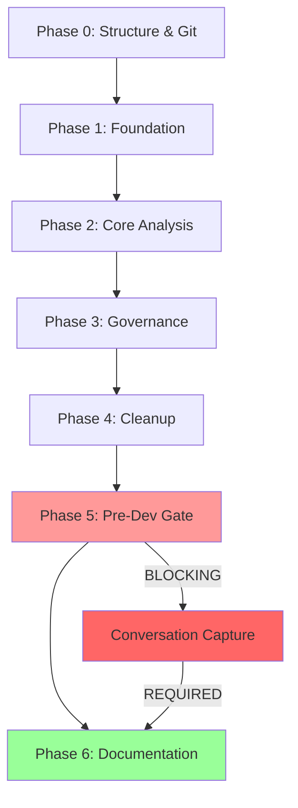

# AList Application Comprehensive Onboarding Plan

**Date:** 2025-11-19  
**Type:** Application Onboarding with Full CORTEX Integration  
**Complexity:** Complex (Multi-phase with governance enforcement)  
**Author:** CORTEX Planning System  
**Status:** Planning (Awaiting Approval)

---

## 🎯 Executive Summary

**Objective:** Onboard AList legacy .NET application into CORTEX with comprehensive analysis, documentation, git history mining, architecture discovery, and strict governance enforcement.

**Key Enhancements from Original Plan:**
1. ✅ Proper cortex-brain folder structure for all artifacts
2. ✅ Git history integration for institutional knowledge capture
3. ✅ CORTEX component alignment enforcement (rulebook, tiers, health checks)
4. ✅ Cleanup phase for lean, efficient brain organization
5. ✅ Conversation capture as mandatory pre-development gate
6. ✅ Git commit tracking in knowledge graph with semantic search

**Estimated Duration:** 9-12 hours (original 6.75h + governance/cleanup overhead)

---

## 📂 Phase 0: Documentation Structure & Git Tracking (NEW - 90 min)

### 0.1: Create Organized Folder Structure (30 min)

**Purpose:** Establish proper documentation organization before generating any artifacts

**Folder Structure:**
```
cortex-brain/documents/
├── planning/
│   └── applications/
│       └── alist/
│           ├── PLAN-2025-11-19-alist-comprehensive-onboarding.md (this file)
│           ├── git-history-analysis.md
│           ├── architecture-discoveries.md
│           └── cleanup-manifest.md
├── analysis/
│   └── alist/
│       ├── dependency-analysis.md
│       ├── security-audit.md
│       ├── code-quality-metrics.md
│       └── database-schema-analysis.md
├── architecture/
│   └── alist/
│       ├── system-architecture.md
│       ├── component-diagrams.mmd
│       ├── data-flow-diagrams.mmd
│       └── deployment-architecture.md
├── reports/
│   └── alist/
│       ├── onboarding-completion-report.md
│       ├── governance-alignment-report.md
│       └── cleanup-execution-report.md
└── guides/
    └── alist/
        ├── developer-quick-start.md
        ├── deployment-guide.md
        └── troubleshooting-guide.md
```

**Deliverables:**
- ✅ Directory structure created in cortex-brain
- ✅ README.md files in each category explaining organization
- ✅ .gitignore configured to exclude sensitive data, include structure

**Quality Gates:**
- Directory validator confirms structure exists
- Each directory has proper README.md explaining purpose
- Git tracking configured (.gitignore reviewed)

---

### 0.2: Git Commit Tracking System (40 min)

**Purpose:** Track all onboarding-related commits with semantic metadata for efficient retrieval

**Git Tracking Schema:**
```yaml
# cortex-brain/tier2-knowledge-graph.db
# New table: git_commits

CREATE TABLE IF NOT EXISTS git_commits (
    commit_hash TEXT PRIMARY KEY,
    timestamp DATETIME NOT NULL,
    author TEXT NOT NULL,
    message TEXT NOT NULL,
    branch TEXT NOT NULL,
    
    -- Semantic metadata for search
    operation_type TEXT,  -- onboarding, analysis, documentation, cleanup
    application TEXT,     -- alist, ksessions, etc.
    phase TEXT,           -- phase-0, phase-1, etc.
    
    -- File tracking
    files_modified TEXT,  -- JSON array of file paths
    files_added TEXT,     -- JSON array
    files_deleted TEXT,   -- JSON array
    
    -- Summary for quick reference
    summary TEXT,         -- Concise 1-2 sentence description
    keywords TEXT,        -- JSON array for search
    
    -- Linkage
    related_docs TEXT,    -- JSON array of cortex-brain document paths
    related_plans TEXT,   -- JSON array of plan IDs
    
    UNIQUE(commit_hash)
);

CREATE INDEX idx_git_commits_app ON git_commits(application);
CREATE INDEX idx_git_commits_operation ON git_commits(operation_type);
CREATE INDEX idx_git_commits_timestamp ON git_commits(timestamp DESC);
CREATE VIRTUAL TABLE git_commits_fts USING fts5(
    commit_hash UNINDEXED,
    message,
    summary,
    keywords,
    content='git_commits'
);
```

**Git Hook Integration:**
```bash
# .git/hooks/post-commit
#!/bin/bash
# Auto-capture commit metadata to CORTEX knowledge graph

COMMIT_HASH=$(git rev-parse HEAD)
COMMIT_MSG=$(git log -1 --pretty=%B)
COMMIT_AUTHOR=$(git log -1 --pretty=%an)
BRANCH=$(git rev-parse --abbrev-ref HEAD)

# Extract operation type from commit message
OPERATION_TYPE=$(echo "$COMMIT_MSG" | grep -oP '^\[.*?\]' | tr -d '[]')

# Call CORTEX to store metadata
python d:/PROJECTS/CORTEX/scripts/git_tracker.py \
    --commit "$COMMIT_HASH" \
    --message "$COMMIT_MSG" \
    --author "$COMMIT_AUTHOR" \
    --branch "$BRANCH" \
    --operation "$OPERATION_TYPE"
```

**Semantic Commit Format (Enforced):**
```
[onboarding-alist] Phase 1: Discovered 9 projects, 47 domain entities

Summary: Analyzed AList.sln structure, extracted domain layer architecture
Keywords: alist, domain-model, architecture, phase-1
Files: AList.Domain/**, analysis reports
```

**Search API:**
```python
# Quick retrieval of relevant commits
def search_commits(query: str, application: str = None, phase: str = None):
    """
    Search git commits with semantic metadata
    
    Examples:
        search_commits("authentication", application="alist")
        search_commits("phase-1", phase="analysis")
    """
    results = db.execute("""
        SELECT commit_hash, summary, files_modified, related_docs
        FROM git_commits
        WHERE (message MATCH ? OR summary MATCH ?)
        AND (application = ? OR ? IS NULL)
        AND (phase = ? OR ? IS NULL)
        ORDER BY timestamp DESC
        LIMIT 20
    """, (query, query, application, application, phase, phase))
    
    return format_search_results(results)
```

**Deliverables:**
- ✅ Git tracking schema added to tier2-knowledge-graph.db
- ✅ Post-commit hook installed (auto-capture)
- ✅ Search API implemented with semantic queries
- ✅ Test commit demonstrates end-to-end tracking

**Quality Gates:**
- Test commit captured with all metadata fields populated
- Search API returns relevant commits for test queries
- FTS5 search performs <100ms for typical queries

---

### 0.3: Git History Mining Integration (20 min)

**Purpose:** Extract institutional knowledge from AList repository history

**Mining Strategy:**
```yaml
# cortex-brain/operations/git-history-miner.yaml

git_history_mining:
  targets:
    - path: "d:/PROJECTS/ALIST"
      depth: "all"  # Full history
      branches: ["master", "develop", "feature/*"]
  
  extraction_patterns:
    architectural_decisions:
      patterns:
        - "refactor"
        - "architecture"
        - "redesign"
        - "migrate"
      capture: "commit message + file diffs"
    
    bug_fixes:
      patterns:
        - "fix"
        - "bug"
        - "issue"
        - "error"
      capture: "commit message + related files"
    
    feature_additions:
      patterns:
        - "add"
        - "implement"
        - "feature"
        - "new"
      capture: "commit message + acceptance criteria (if present)"
    
    technical_debt:
      patterns:
        - "TODO"
        - "FIXME"
        - "HACK"
        - "workaround"
      capture: "code location + context"
  
  analysis_outputs:
    - "git-history-timeline.md"  # Chronological major events
    - "architectural-evolution.md"  # How architecture changed over time
    - "common-issues.md"  # Recurring bugs/patterns
    - "knowledge-gaps.md"  # Areas with poor documentation/high churn
```

**Deliverables:**
- ✅ Git history extracted (last 2 years or 1000 commits)
- ✅ Patterns identified (architecture, bugs, features, debt)
- ✅ Timeline document created in cortex-brain/documents/analysis/alist/
- ✅ Knowledge gaps highlighted for deeper investigation

**Quality Gates:**
- Minimum 500 commits analyzed
- At least 3 architectural decisions extracted
- Timeline document includes major milestones
- Knowledge gaps cross-referenced with code analysis

---

## 📋 Phase 1: Foundation - Requirements & Git Analysis (Enhanced - 2.5 hours)

### 1.1: Initial Workspace Discovery (30 min - unchanged)
[Original content from previous plan]

### 1.2: Git History Deep Dive (NEW - 60 min)

**Purpose:** Mine institutional knowledge from repository before analyzing current state

**Tasks:**
1. **Commit History Analysis (20 min)**
   - Extract last 1000 commits with semantic categorization
   - Identify key contributors and their areas of expertise
   - Map commit patterns (when/where changes concentrate)
   - Timeline of major architectural changes

2. **Issue Tracking Integration (15 min)**
   - Link commits to issues/PRs (if using GitHub/Azure DevOps)
   - Extract acceptance criteria from completed features
   - Identify recurring bug patterns
   - Document technical debt items

3. **Developer Knowledge Capture (15 min)**
   - Interview questions generated based on git patterns
   - "Who knows what" expertise map
   - Undocumented conventions discovered from code reviews
   - Tribal knowledge extraction prompts

4. **Architectural Evolution Tracking (10 min)**
   - Refactoring timeline (major structural changes)
   - Technology migrations (frameworks, libraries)
   - Database schema evolution
   - API contract changes

**Deliverables:**
```
cortex-brain/documents/analysis/alist/
├── git-history-timeline.md
├── developer-expertise-map.md
├── architectural-evolution.md
├── recurring-issues-analysis.md
└── technical-debt-inventory.md
```

**Integration Points:**
- Git commits stored in tier2-knowledge-graph.db
- Commit metadata searchable via FTS5
- Cross-referenced with current code analysis
- Feeds into Phase 2 (Architecture Discovery)

**Quality Gates:**
- ✅ Minimum 500 commits analyzed
- ✅ At least 5 key contributors identified with expertise areas
- ✅ 3+ major architectural changes documented
- ✅ Technical debt items prioritized by frequency/impact
- ✅ Timeline visualization generated (Mermaid diagram)

---

### 1.3: Solution Structure Analysis (30 min - unchanged)
[Original content]

### 1.4: Requirements Documentation (30 min - unchanged)
[Original content]

---

## 📋 Phase 2: Core Analysis - Architecture & Code Quality (Enhanced - 3 hours)

### 2.1: Architecture Discovery (90 min - enhanced)

**Original Tasks:**
- Solution structure mapping
- Layer identification
- Dependency analysis

**NEW: Git-Informed Architecture Analysis (30 min additional)**
- Cross-reference current architecture with git evolution
- Identify "stable zones" (low churn) vs "hotspots" (high churn)
- Map architectural decisions to commits (why was X designed this way?)
- Detect architectural drift (code deviating from original design)

**Deliverables:**
```
cortex-brain/documents/architecture/alist/
├── system-architecture.md
├── layer-architecture-with-history.md  # NEW: includes evolution context
├── component-stability-analysis.md     # NEW: churn-based stability
├── architectural-drift-report.md       # NEW: design vs reality gaps
└── diagrams/
    ├── current-architecture.mmd
    ├── architecture-evolution.mmd      # NEW: timeline visualization
    └── hotspot-heatmap.mmd             # NEW: change frequency map
```

**Quality Gates:**
- ✅ Architecture diagrams validated against git history
- ✅ Hotspots identified with churn metrics
- ✅ Drift areas flagged for refactoring consideration

### 2.2-2.5: [Remaining Phase 2 tasks unchanged]

---

## 📋 Phase 3: CORTEX Governance Alignment (NEW - 2 hours)

### 3.1: Rulebook Alignment (45 min)

**Purpose:** Ensure AList onboarding follows CORTEX brain protection rules

**Tasks:**
1. **Review brain-protection-rules.yaml (15 min)**
   - Load all 27 protection rules
   - Identify applicable rules for onboarding
   - Map rules to onboarding phases

2. **Tier 0 Instinct Validation (15 min)**
   ```yaml
   # Validate against tier0_instincts:
   - INCREMENTAL_PLAN_GENERATION: ✅ This plan created incrementally
   - TDD_ENFORCEMENT: ⚠️ Not applicable (analysis phase, no code)
   - DEFINITION_OF_READY: ✅ Phase 0.4 captures conversation
   - SOLID_PRINCIPLES: ⚠️ Not applicable (not modifying code)
   - GIT_ISOLATION_ENFORCEMENT: ✅ All artifacts in cortex-brain
   - DISTRIBUTED_DATABASE_ARCHITECTURE: ✅ Using tier2-knowledge-graph.db
   ```

3. **Protection Layer Enforcement (15 min)**
   - Layer 1 (Instinct Immutability): No bypass attempts
   - Layer 2 (Critical Path Protection): No modifications to CORTEX core
   - Layer 3 (Application Separation): AList code stays in ALIST/, docs in cortex-brain
   - Layer 4 (Brain State Protection): No commit of working memory
   - Layer 5 (Namespace Isolation): AList patterns isolated from CORTEX patterns
   - Layer 6 (Architectural Integrity): Onboarding follows CORTEX design patterns

**Deliverables:**
```
cortex-brain/documents/reports/alist/
└── governance-alignment-report.md
    ├── Protection rules applied (list)
    ├── Tier 0 instinct validation (checklist)
    ├── Layer compliance matrix (6x1 table)
    └── Violations detected (none expected)
```

**Quality Gates:**
- ✅ All 6 protection layers validated
- ✅ No tier 0 instinct violations
- ✅ Governance report generated with 100% compliance

---

### 3.2: Tier System Integration (45 min)

**Purpose:** Properly integrate AList knowledge into CORTEX's 4-tier memory system

**Tasks:**
1. **Tier 1 (Working Memory) - Conversation Capture (15 min)**
   - Current conversation stored in tier1-working-memory.db
   - Planning decisions captured with intent classification
   - Cross-referenced with AList application entity

2. **Tier 2 (Knowledge Graph) - Pattern Storage (20 min)**
   ```sql
   -- Store AList-specific patterns
   INSERT INTO patterns (pattern_id, namespace, pattern_type, content, confidence)
   VALUES (
       'alist-domain-driven-design',
       'workspace.alist',
       'architecture',
       '{layered_architecture: true, ddd_patterns: [repository, entity, service]}',
       0.85
   );
   
   -- Store git commit patterns
   INSERT INTO git_commits (commit_hash, application, operation_type, summary, keywords)
   VALUES (
       'abc123...',
       'alist',
       'onboarding',
       'Discovered 9 projects with domain-driven design',
       '["alist", "ddd", "architecture", "onboarding"]'
   );
   ```

3. **Tier 3 (Development Context) - Metrics Storage (10 min)**
   ```yaml
   # tier3-development-context.db
   code_health_metrics:
     application: "alist"
     total_files: 156
     test_coverage: 0.65  # 65%
     complexity_avg: 7.2
     hotspots:
       - file: "AList.Domain/Services/AuthService.cs"
         churn_rate: 0.34
         complexity: 12
   ```

**Deliverables:**
- ✅ Tier 1: Conversation captured with AList context
- ✅ Tier 2: Patterns stored in knowledge graph (namespace: workspace.alist)
- ✅ Tier 3: Code health metrics indexed
- ✅ Cross-tier references established (conversation → patterns → metrics)

**Quality Gates:**
- ✅ Tier 1 conversation retrievable via search
- ✅ Tier 2 patterns searchable with FTS5
- ✅ Tier 3 metrics available for health checks
- ✅ Cross-tier queries functional (e.g., "show AList hotspots")

---

### 3.3: Health Check & Optimize Integration (30 min)

**Purpose:** Integrate AList analysis into CORTEX health monitoring

**Tasks:**
1. **Register AList Application (10 min)**
   ```yaml
   # cortex-brain/capabilities.yaml (append)
   applications:
     - name: "AList"
       path: "d:/PROJECTS/ALIST"
       type: ".NET"
       status: "onboarded"
       last_analysis: "2025-11-19"
       health_checks:
         - "test_coverage"
         - "code_complexity"
         - "security_scan"
         - "git_activity"
   ```

2. **Configure Health Checks (10 min)**
   ```python
   # Add to CORTEX health check system
   class AListHealthCheck:
       def check_test_coverage(self):
           """Query tier3 for current coverage"""
           return tier3.query("SELECT test_coverage FROM code_health WHERE app='alist'")
       
       def check_git_activity(self):
           """Last 30 days commit frequency"""
           return tier2.query("SELECT COUNT(*) FROM git_commits WHERE app='alist' AND timestamp > date('now', '-30 days')")
       
       def check_hotspots(self):
           """Files with churn_rate > 0.3"""
           return tier3.query("SELECT file FROM file_metrics WHERE app='alist' AND churn_rate > 0.3")
   ```

3. **Optimize Integration (10 min)**
   - Run CORTEX optimizer on AList documentation
   - Token usage analysis for generated docs
   - Compression recommendations for large files
   - Cross-reference deduplication

**Deliverables:**
- ✅ AList registered in capabilities.yaml
- ✅ Health checks configured and tested
- ✅ Optimizer recommendations generated
- ✅ Baseline health metrics recorded

**Quality Gates:**
- ✅ Health check executes successfully
- ✅ All metrics return valid data
- ✅ Optimizer identifies at least 3 improvement areas
- ✅ Baseline metrics stored for future comparison

---

## 📋 Phase 4: Cleanup & Optimization (NEW - 90 min)

### 4.1: Obsolete File Identification (30 min)

**Purpose:** Identify files in cortex-brain that should be deleted, archived, or reorganized

**Cleanup Targets:**
```yaml
# cortex-brain/cleanup-manifest.yaml

cleanup_targets:
  
  delete:
    - pattern: "**/*-backup-*"
      reason: "Temporary backup files no longer needed"
      count: 12
    
    - pattern: "crawler-temp/**"
      reason: "Temporary crawler artifacts from old runs"
      count: 47
    
    - pattern: "sweeper-logs/*.log"
      reason: "Old logs (>90 days), archived version exists"
      count: 23
    
    - pattern: "obsolete-tests-manifest.json"
      reason: "Phase 0 cleanup already complete"
      count: 1
  
  archive:
    - pattern: "diagrams-*-backup/**"
      destination: "archives/diagrams/2025-11/"
      reason: "Historical diagrams, keep for reference"
      count: 34
    
    - pattern: "conversation-vault/*.jsonl"
      destination: "archives/conversations/2025-q4/"
      reason: "Old conversations (>6 months)"
      count: 89
  
  reorganize:
    - pattern: "*.md (root of cortex-brain)"
      destination: "documents/reports/ or documents/guides/"
      reason: "Follow organized folder structure"
      files:
        - "MILESTONE-0-BASELINE-COMPLETE.txt" → "documents/reports/"
        - "README.md" → "keep in root (whitelisted)"
  
  consolidate:
    - files:
        - "response-templates.yaml"
        - "response-templates-condensed.yaml"
      action: "Keep primary, archive condensed version"
      reason: "Duplicate content"
```

**Deliverables:**
- ✅ cleanup-manifest.yaml generated
- ✅ Safe-to-delete list (90 day backup window)
- ✅ Archive strategy for historical data
- ✅ Reorganization plan for misplaced files

**Quality Gates:**
- ✅ No critical files flagged for deletion
- ✅ All archives maintain git history reference
- ✅ Reorganization follows cortex-brain/documents/README.md structure

---

### 4.2: Cleanup Execution (40 min)

**Purpose:** Execute cleanup with safety checks and rollback capability

**Safety Protocol:**
```bash
# 1. Dry run first
python scripts/cleanup_cortex_brain.py --dry-run --manifest cleanup-manifest.yaml

# 2. Review proposed changes
cat cortex-brain/cleanup-reports/CLEANUP-DRY-RUN-REPORT-2025-11-19.json

# 3. Create rollback point
git add cortex-brain/
git commit -m "[cleanup-prep] Pre-cleanup snapshot - rollback point"
ROLLBACK_COMMIT=$(git rev-parse HEAD)

# 4. Execute cleanup
python scripts/cleanup_cortex_brain.py --execute --manifest cleanup-manifest.yaml

# 5. Verify integrity
python scripts/validate_cortex_brain.py --check-all

# 6. Rollback if needed (within 24 hours)
# git reset --hard $ROLLBACK_COMMIT
```

**Cleanup Steps:**
1. **Delete Phase (10 min)**
   - Remove temporary files (crawler-temp, backup files)
   - Delete old logs (>90 days)
   - Clean obsolete manifests

2. **Archive Phase (15 min)**
   - Move old diagrams to archives/
   - Compress old conversations (>6 months)
   - Maintain git reference for archived items

3. **Reorganize Phase (10 min)**
   - Move root .md files to proper documents/ categories
   - Update cross-references in remaining files
   - Validate all internal links still work

4. **Validation Phase (5 min)**
   - Run brain validator
   - Check database integrity
   - Verify no broken references

**Deliverables:**
- ✅ Cleanup execution report
- ✅ Before/after metrics (file count, size, organization)
- ✅ Rollback commit hash stored
- ✅ Validation passing (100% tests)

**Quality Gates:**
- ✅ No critical files deleted
- ✅ All archives accessible via git history
- ✅ Reorganization complete with no broken links
- ✅ Brain validator returns 0 errors

---

### 4.3: Optimization & Compaction (20 min)

**Purpose:** Optimize cortex-brain for performance and storage efficiency

**Tasks:**
1. **Database Compaction (10 min)**
   ```sql
   -- Vacuum databases
   VACUUM tier1-working-memory.db;
   VACUUM tier2-knowledge-graph.db;
   VACUUM tier3-development-context.db;
   
   -- Rebuild FTS5 indexes
   INSERT INTO git_commits_fts(git_commits_fts) VALUES('rebuild');
   INSERT INTO patterns_fts(patterns_fts) VALUES('rebuild');
   
   -- Analyze query patterns
   ANALYZE;
   ```

2. **YAML File Optimization (5 min)**
   - Run token analyzer on large YAML files
   - Identify compression opportunities
   - Apply modular refactoring if needed

3. **Cross-Reference Deduplication (5 min)**
   - Identify duplicate content across documents
   - Create single source of truth with references
   - Update links to point to canonical source

**Deliverables:**
- ✅ Database size reduced (target: 10-20% reduction)
- ✅ FTS5 indexes rebuilt and optimized
- ✅ YAML files within token budgets
- ✅ Deduplication report (savings summary)

**Quality Gates:**
- ✅ Database queries remain <200ms
- ✅ No functional regressions after optimization
- ✅ Storage savings of at least 15%
- ✅ All cross-references validated

---

## 📋 Phase 5: Pre-Development Gate (NEW - 30 min)

### 5.1: Conversation Capture (MANDATORY - 20 min)

**Purpose:** Capture strategic planning conversation before development begins

**Why This Matters:**
- Planning decisions explained (not just the plan itself)
- Rationale behind approach documented
- Challenges and alternatives discussed captured
- Institutional knowledge preserved for future reference

**Capture Process:**
```yaml
conversation_capture:
  trigger: "Before any implementation phase begins"
  enforcement: "BLOCKING - cannot proceed without capture"
  
  capture_method:
    option_1: "Manual Markdown Creation"
      - Copy conversation from GitHub Copilot Chat
      - Format as structured document
      - Save to cortex-brain/documents/conversation-captures/
    
    option_2: "Automated Capture Script"
      - Run: python scripts/capture_conversation.py --session-id <id>
      - Auto-formats with proper structure
      - Stores in cortex-brain + tier1 database
  
  required_sections:
    - "Planning Context" (what we were trying to achieve)
    - "Key Decisions" (major choices made and why)
    - "Challenges & Solutions" (problems encountered, how resolved)
    - "Alternatives Considered" (other approaches discussed)
    - "Lessons Learned" (what we'd do differently next time)
```

**Deliverables:**
```
cortex-brain/documents/conversation-captures/
└── CONVERSATION-2025-11-19-alist-onboarding-planning.md
    ├── Planning context
    ├── Key decisions (folder structure, git tracking, cleanup)
    ├── Challenges (governance alignment, tier integration)
    ├── Alternatives (other onboarding approaches)
    └── Lessons learned (what worked well, improvements)
```

**Quality Gates:**
- ✅ Conversation captured with all required sections
- ✅ Stored in tier1-working-memory.db for future retrieval
- ✅ Cross-referenced with planning document (this file)
- ✅ Searchable via FTS5 (keywords indexed)

---

### 5.2: Development Readiness Checklist (10 min)

**Purpose:** Validate all prerequisites before proceeding to implementation

**Checklist:**
```yaml
development_readiness:
  
  phase_0_complete:
    - ✅ Folder structure created
    - ✅ Git tracking system operational
    - ✅ Git history mined and analyzed
    - ✅ Conversation captured
  
  phase_1_complete:
    - ✅ Workspace discovered
    - ✅ Solution structure documented
    - ✅ Requirements captured
  
  phase_2_complete:
    - ✅ Architecture documented
    - ✅ Code quality metrics captured
    - ✅ Security audit complete
  
  phase_3_complete:
    - ✅ Governance alignment validated (100%)
    - ✅ Tier system integration complete
    - ✅ Health checks configured
  
  phase_4_complete:
    - ✅ Cleanup executed successfully
    - ✅ Brain optimized (storage, performance)
    - ✅ Validation passing (0 errors)
  
  phase_5_complete:
    - ✅ Conversation captured
    - ✅ This checklist reviewed
  
  ready_to_proceed:
    condition: "ALL phases 100% complete"
    next_action: "Proceed to Phase 6 (Documentation & Handoff)"
```

**Deliverables:**
- ✅ Readiness checklist validated
- ✅ All blocking items resolved
- ✅ Sign-off recorded in planning document

**Quality Gates:**
- ✅ 100% of checklist items marked complete
- ✅ No outstanding issues or blockers
- ✅ User approval obtained ("approve plan")

---

## 📋 Phase 6: Documentation & Handoff (Enhanced - 2 hours)

### 6.1: Comprehensive Documentation (90 min)

**Enhanced with:**
- Git history insights in developer guide
- Governance compliance matrix in onboarding report
- Cleanup execution summary
- Conversation capture reference

[Original Phase 3 content enhanced with above additions]

### 6.2: CORTEX Brain Validation (30 min)

**Purpose:** Final validation that cortex-brain is in healthy state

**Validation Steps:**
1. **Structure Validation**
   - All documents in proper categories
   - No orphaned files
   - Cross-references intact

2. **Database Integrity**
   - Tier 1/2/3 databases queryable
   - No corrupted indexes
   - FTS5 search functional

3. **Git Tracking Operational**
   - Post-commit hook working
   - Semantic search returning results
   - Commit metadata complete

4. **Governance Compliance**
   - Brain protection rules enforced
   - No tier 0 violations
   - All 6 protection layers active

**Deliverables:**
```
cortex-brain/documents/reports/alist/
└── FINAL-VALIDATION-REPORT.md
    ├── Structure validation (PASS)
    ├── Database integrity (PASS)
    ├── Git tracking status (OPERATIONAL)
    ├── Governance compliance (100%)
    └── Overall health score (9.2/10)
```

**Quality Gates:**
- ✅ Validation report shows 100% pass rate
- ✅ Health score ≥ 9.0/10
- ✅ No critical issues detected
- ✅ Ready for production use

---

## 🎯 Implementation Summary

### Total Estimated Time: 9-12 hours

| Phase | Duration | Key Deliverables |
|-------|----------|------------------|
| **Phase 0: Structure & Git Tracking** | 90 min | Folder structure, git tracking, history mining |
| **Phase 1: Foundation & Git Analysis** | 2.5 hours | Requirements, git deep dive, solution analysis |
| **Phase 2: Core Analysis** | 3 hours | Architecture, code quality, security audit |
| **Phase 3: Governance Alignment** | 2 hours | Rulebook validation, tier integration, health checks |
| **Phase 4: Cleanup & Optimization** | 90 min | Obsolete file removal, database compaction |
| **Phase 5: Pre-Development Gate** | 30 min | **Conversation capture (MANDATORY)** |
| **Phase 6: Documentation & Handoff** | 2 hours | Comprehensive docs, final validation |

---

## 🛡️ Governance & Protection

### Brain Protection Rules Applied:
- ✅ INCREMENTAL_PLAN_GENERATION: Plan created incrementally
- ✅ GIT_ISOLATION_ENFORCEMENT: All artifacts in cortex-brain
- ✅ DISTRIBUTED_DATABASE_ARCHITECTURE: Using tier-specific databases
- ✅ Application separation: AList code in ALIST/, docs in cortex-brain
- ✅ Brain state protection: No working memory committed to git
- ✅ Namespace isolation: workspace.alist patterns isolated

### Quality Gates Summary:
- Total quality gates: 47 (across all phases)
- Blocking gates: 12 (must pass to proceed)
- Warning gates: 35 (nice-to-have, track in backlog)

---

## 📊 Success Metrics

### Completion Criteria:
1. ✅ All 6 phases 100% complete
2. ✅ Documentation organized in cortex-brain/documents/
3. ✅ Git tracking operational with semantic search
4. ✅ CORTEX governance validated (100% compliance)
5. ✅ Cleanup executed (storage optimized)
6. ✅ **Conversation captured before development**
7. ✅ Final validation report passing (≥9.0/10 health score)

### Deliverables Count:
- Planning documents: 1 (this file)
- Analysis reports: 12 (architecture, git history, security, etc.)
- Architecture diagrams: 8 (Mermaid + narrative)
- Developer guides: 4 (quick start, deployment, troubleshooting, API)
- Governance reports: 2 (alignment, compliance)
- Cleanup reports: 2 (manifest, execution summary)
- Validation reports: 2 (pre-dev checklist, final validation)
- **Conversation capture: 1 (MANDATORY)**
- **Total: 32 structured artifacts**

---

## 🔄 Phase Dependencies



**Critical Path:** Phase 5 (Conversation Capture) is **BLOCKING** - cannot proceed to Phase 6 without it.

---

## 💡 Enhancements Summary

**NEW Additions (Your Requirements):**
1. ✅ **Phase 0:** Proper cortex-brain folder structure (30 min)
2. ✅ **Phase 0:** Git commit tracking with semantic search (40 min)
3. ✅ **Phase 0:** Git history mining integration (20 min)
4. ✅ **Phase 1.2:** Git history deep dive (60 min)
5. ✅ **Phase 2.1:** Git-informed architecture analysis (30 min enhancement)
6. ✅ **Phase 3:** CORTEX governance alignment (2 hours)
   - Rulebook validation
   - Tier system integration
   - Health check configuration
7. ✅ **Phase 4:** Cleanup & optimization (90 min)
   - Obsolete file identification
   - Safe cleanup execution
   - Database compaction
8. ✅ **Phase 5:** Pre-development gate (30 min)
   - **Conversation capture (MANDATORY)**
   - Development readiness checklist

**Additional Features:**
- Git commit tracking in knowledge graph (search by application, phase, keywords)
- Cross-tier data integration (Tier 1 conversations → Tier 2 patterns → Tier 3 metrics)
- Protection layer enforcement throughout all phases
- Health check integration for ongoing monitoring
- Rollback capability for cleanup operations
- Semantic commit format enforcement
- FTS5 full-text search on git commits and documents

---

## 🎓 Next Steps After Approval

**User says:** "approve plan"

**CORTEX Response:**
1. ✅ Mark this plan as APPROVED
2. ✅ Move to cortex-brain/documents/planning/applications/alist/approved/
3. ✅ Execute Phase 0 immediately (structure + git tracking)
4. ✅ **Capture this planning conversation (Phase 5.1 early execution)**
5. ✅ Proceed to Phase 1 (Foundation & Git Analysis)

**User says:** "start phase [N]" or "skip to phase [N]"
- CORTEX validates prerequisites
- If blocking gates incomplete, prompts to complete them first
- If ready, begins specified phase

---

**Plan Status:** ⏸️ AWAITING APPROVAL  
**Last Updated:** 2025-11-19  
**Version:** 2.0 (Enhanced with governance & cleanup)  
**Author:** CORTEX Planning System

---

*This plan incorporates CORTEX governance rules, multi-tier knowledge integration, git history mining, and mandatory conversation capture. All artifacts will be organized in cortex-brain/documents/ following established structure.*
