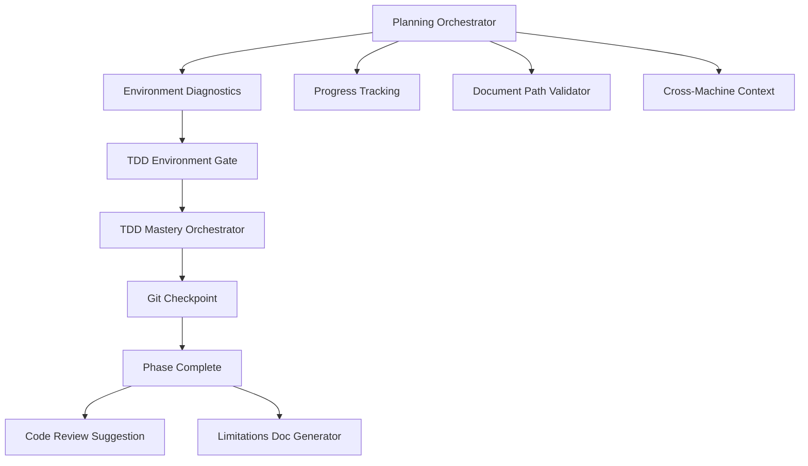
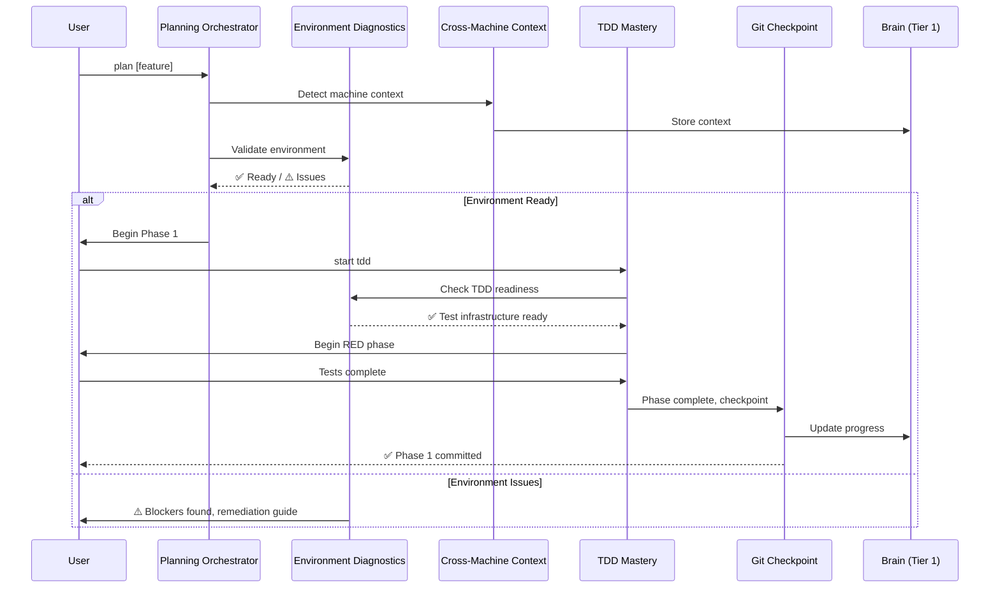

# CORTEX Orchestrator Enhancement Plan v1.0

**Created:** December 12, 2025  
**Author:** Asif Hussain  
**Status:** 🎯 READY FOR IMPLEMENTATION  
**Complexity:** HIGH (8 features, 18 days effort)  
**Context:** Based on Platform.Classic modernization chat analysis

**Planning System 2.0 Compliance:**
- ✅ Incremental planning approach
- ✅ TDD mandatory (RED→GREEN→REFACTOR)
- ✅ DoR/DoD per feature
- ✅ Auto-complexity detection: HIGH complexity detected
- ✅ Manifest: `cortex-brain/orchestrator-manifests/orchestrator-enhancement-manifest.yaml`

---

## 🎯 Executive Summary

**Problem:** Analysis of 6 Copilot chat sessions revealed systematic gaps in orchestrator capabilities during real-world app modernization work.

**Solution:** Implement 8 orchestrator enhancements prioritized by impact:
- 3 HIGH priority (environment diagnostics, git checkpoints, document enforcement)
- 3 MEDIUM priority (cross-machine context, progress tracking, TDD gates)
- 2 LOW priority (limitations templates, code review suggestions)

**Timeline:** 18 days (3.6 weeks single developer) across 4 weekly sprints

**Success Metrics:**
- ✅ Zero environment troubleshooting time (30min → 0min)
- ✅ 100% phase completion audit trail via git checkpoints
- ✅ Zero root-level document violations
- ✅ Seamless cross-machine workflow (Windows ↔ Mac)

---

## 📊 Evidence-Based Prioritization

### Analysis Source
**Input:** 6 Copilot chat sessions (6,817 lines)
- chat01.md: Initial RA migration planning (1,492 lines)
- chat02.md: Plan v2.1 enhancements (1,696 lines)
- chat04.md: Client testing + .NET SDK issues (2,207 lines)
- chat05.md: Phase 5 completion with limitations (835 lines)
- chat06.md: Comprehensive code review (587 lines)

**Findings:**
- 5 orchestrator gaps identified
- 4 rulebook violations found
- 8 enhancement opportunities prioritized

### Priority Matrix

| Enhancement | User Pain | Frequency | Impact | Effort | Priority |
|-------------|-----------|-----------|--------|--------|----------|
| Environment Diagnostics | 🔴 High (30min lost) | Every project | Blocker removal | 3d | 🔴 HIGH |
| Git Checkpoint Integration | 🟡 Medium | Every phase | Audit trail | 2d | 🔴 HIGH |
| Document Enforcement | 🟡 Medium | Every doc | SKULL compliance | 1d | 🔴 HIGH |
| Cross-Machine Context | 🟡 Medium | Mac/Win switch | Workflow smooth | 5d | 🟡 MEDIUM |
| Progress Tracking | 🟢 Low | Every plan | Visibility | 3d | 🟡 MEDIUM |
| TDD Environment Gates | 🟡 Medium | TDD workflows | Quality gate | 2d | 🟡 MEDIUM |
| Limitations Template | 🟢 Low | Blockers | Clarity | 1d | 🟢 LOW |
| Code Review Suggestion | 🟢 Low | Post-impl | Quality nudge | 1d | 🟢 LOW |

---

## 🏗️ Architecture Overview

### New Components

```
src/
├── orchestrators/
│   ├── environment_diagnostics_orchestrator.py  # NEW - Feature 1
│   └── cross_machine_context_orchestrator.py    # NEW - Feature 4
│
├── operations/utilities/
│   ├── git_checkpoint_utility.py                # NEW - Feature 2
│   ├── document_path_validator.py               # NEW - Feature 3
│   ├── progress_tracking_utility.py             # NEW - Feature 5
│   └── limitations_doc_generator.py             # NEW - Feature 7
│
└── tier0/
    └── tdd_environment_gate.py                  # NEW - Feature 6

cortex-brain/
├── response-templates.yaml                       # ENHANCE - Feature 8
└── orchestrator-manifests/
    └── orchestrator-enhancement-manifest.yaml    # NEW - DoR/DoD
```

### Integration Points



---

## 📋 Feature 1: Environment Diagnostics Orchestrator

### Problem Statement
**Evidence:** chat04.md shows 30+ minutes wasted troubleshooting .NET SDK configuration
- User couldn't run tests despite code being ready
- Manual discovery: `dotnet.exe` exists but SDK not configured
- No automated pre-flight checks before technical work

### Solution Design

**Orchestrator:** `EnvironmentDiagnosticsOrchestrator`

**Triggers:**
- Before "start tdd"
- Before "run tests"
- Before "plan [feature]" (if involves code execution)
- Before compilation/execution tasks

**Validations:**

| Check | Detection Method | Remediation |
|-------|-----------------|-------------|
| .NET SDK | `dotnet --version`, PATH validation | Install guide with download link |
| Python | `python --version`, venv detection | pyenv/venv setup instructions |
| Node.js | `node --version`, npm availability | nvm installation guide |
| Git | `git --version`, .git folder presence | Git installation + config |
| Write permissions | Test write to output directories | chmod/icacls commands |

**Output Format:**
```yaml
status: ready | warning | blocked
summary: "All 5 checks passed"
details:
  - check: dotnet_sdk
    status: pass
    version: "8.0.100"
  - check: python
    status: pass  
    version: "3.11.5"
  - check: git
    status: pass
    version: "2.42.0"

recommendations: []
blocking_issues: []
```

### Definition of Ready (DoR)
- [ ] Design document approved
- [ ] 5 environment checks identified (.NET, Python, Node, Git, Permissions)
- [ ] Remediation guides written for each failure
- [ ] Integration points with TDD/Planning orchestrators mapped
- [ ] Test data prepared (mock environments)

### Definition of Done (DoD)
- [ ] RED phase: 15 tests written (3 per check) - all failing
- [ ] GREEN phase: All 15 tests passing
- [ ] REFACTOR phase: Code cleanup, extract remediation guides
- [ ] Integration tests: Works with TDD + Planning orchestrators
- [ ] Documentation: User guide + orchestrator API docs
- [ ] Code review: SOLID principles validated
- [ ] Git checkpoint: Committed with message

### Acceptance Criteria
1. ✅ Detects .NET SDK presence and version
2. ✅ Validates Python environment (system + venv)
3. ✅ Checks Node.js and npm availability
4. ✅ Verifies Git installation and configuration
5. ✅ Tests write permissions to output directories
6. ✅ Provides remediation guide for each failure
7. ✅ Blocks workflow if critical checks fail
8. ✅ Execution time <2 seconds
9. ✅ Cross-platform (Windows, Mac, Linux)
10. ✅ Integration: Called automatically before TDD start

### Test Strategy
```python
# RED phase tests (examples)
def test_environment_diagnostics_detects_missing_dotnet_sdk():
    """Should detect when .NET SDK not installed"""
    orchestrator = EnvironmentDiagnosticsOrchestrator()
    result = orchestrator.validate_dotnet_sdk()
    assert result.status == "blocked"
    assert ".NET SDK not found" in result.message

def test_environment_diagnostics_provides_remediation_guide():
    """Should offer install guide when SDK missing"""
    orchestrator = EnvironmentDiagnosticsOrchestrator()
    result = orchestrator.validate_dotnet_sdk()
    assert "Download from https://dotnet.microsoft.com" in result.remediation

def test_environment_diagnostics_validates_sdk_version_compatibility():
    """Should warn if SDK version incompatible"""
    orchestrator = EnvironmentDiagnosticsOrchestrator()
    result = orchestrator.validate_dotnet_sdk(min_version="8.0")
    if result.detected_version < "8.0":
        assert result.status == "warning"
```

### Implementation Phases
1. **Phase 1.1:** Core validation framework (1 day)
2. **Phase 1.2:** .NET SDK + Python checks (0.5 days)
3. **Phase 1.3:** Node.js + Git checks (0.5 days)
4. **Phase 1.4:** Remediation guide system (0.5 days)
5. **Phase 1.5:** Integration with orchestrators (0.5 days)

**Total:** 3 days

---

## 📋 Feature 2: Git Checkpoint Integration

### Problem Statement
**Evidence:** No git commits visible in any of 6 chat sessions
- No version control checkpoints after phases
- Can't rollback to previous phase state
- No audit trail of work progression
- Violates `GIT_CHECKPOINT_ENFORCEMENT` rule

### Solution Design

**Utility:** `GitCheckpointUtility`

**Integration Points:**
- After each phase completion in Planning Orchestrator
- After TDD cycle completion (RED→GREEN→REFACTOR)
- Before deployment preparation
- After major refactoring

**Commit Message Format:**
```bash
feat(phase-N): [Phase Name] - [Key Deliverables]

Phase: N/M
Duration: X hours
Test Coverage: XX%
Files Changed: N files
Key Deliverables:
- Deliverable 1
- Deliverable 2

Compliance:
- DoR: ✅ All criteria met
- DoD: ✅ All criteria met
- Tests: ✅ XX/XX passing
```

**Git Operations:**
1. Stage all changes: `git add .`
2. Generate commit message from phase metadata
3. Commit: `git commit -m "[message]"`
4. Optional: Push to remote (user configurable)
5. Create tag: `phase-N-complete-YYYYMMDD-HHMMSS`

### Definition of Ready (DoR)
- [ ] Git message template defined
- [ ] Phase metadata schema documented
- [ ] Integration points with Planning Orchestrator identified
- [ ] Tag naming convention established
- [ ] User preferences for auto-push defined

### Definition of Done (DoD)
- [ ] RED phase: 10 tests written - all failing
- [ ] GREEN phase: All 10 tests passing
- [ ] REFACTOR phase: Extract message generator
- [ ] Integration tests: Works with Planning + TDD orchestrators
- [ ] Documentation: Configuration guide
- [ ] Code review: Git operations validated
- [ ] Git checkpoint: Feature self-checkpoints

### Acceptance Criteria
1. ✅ Generates meaningful commit messages automatically
2. ✅ Includes phase metadata (duration, test coverage, deliverables)
3. ✅ Creates git tags for phase milestones
4. ✅ Validates git status before commit (no conflicts)
5. ✅ Handles merge conflicts gracefully
6. ✅ Optional auto-push to remote
7. ✅ User can review commit before finalizing
8. ✅ Integration: Auto-triggered after phase completion
9. ✅ Rollback support: Can checkout previous phase tags
10. ✅ Audit trail: Full history of phase progression

### Implementation Phases
1. **Phase 2.1:** Commit message generator (0.5 days)
2. **Phase 2.2:** Git operations wrapper (0.5 days)
3. **Phase 2.3:** Tag creation + rollback (0.5 days)
4. **Phase 2.4:** Integration with orchestrators (0.5 days)

**Total:** 2 days

---

## 📋 Feature 3: Document Organization Enforcement

### Problem Statement
**Evidence:** chat06.md created files in `.review/` folder (root-level)
- Violates `NO_ROOT_SUMMARY_DOCUMENTS` rule
- Should be in `cortex-brain/documents/{category}/`
- No validation before file creation

### Solution Design

**Utility:** `DocumentPathValidator`

**Validation Rules:**
```yaml
forbidden_patterns:
  - "^CORTEX/[^/]+\\.md$"              # Root-level files
  - "^[^/]+/\\.review/"                # User repo .review folders
  - "^C:\\\\PROJECTS\\\\.+\\\\.review/" # Windows absolute paths
  - ".*summary\\.md$"                  # Generic summary files at root

required_patterns:
  - "^cortex-brain/documents/(reports|analysis|summaries|investigations|planning|implementation-guides)/[a-z0-9-]+\\.md$"

categories:
  reports: "Status, test results, validation reports"
  analysis: "Code analysis, architecture analysis"
  summaries: "Project summaries, progress summaries"
  investigations: "Bug investigations, RCA documents"
  planning: "Feature plans, ADO items, roadmaps"
  implementation-guides: "How-to guides, tutorials"
```

**Integration:**
- Before file creation in Planning Orchestrator
- Before document generation in any orchestrator
- Validation hook in file creation utilities

**Enforcement:**
```python
def validate_document_path(file_path: str) -> ValidationResult:
    # Check forbidden patterns
    if matches_forbidden_pattern(file_path):
        return ValidationResult(
            valid=False,
            reason="Root-level documents forbidden",
            suggested_path=suggest_correct_path(file_path)
        )
    
    # Check required pattern
    if not matches_required_pattern(file_path):
        return ValidationResult(
            valid=False,
            reason="Must be in cortex-brain/documents/{category}/",
            suggested_path=suggest_correct_path(file_path)
        )
    
    return ValidationResult(valid=True)
```

### Definition of Ready (DoR)
- [ ] Forbidden patterns list complete
- [ ] Required pattern regex validated
- [ ] Category descriptions documented
- [ ] Path suggestion algorithm designed
- [ ] Integration points identified

### Definition of Done (DoD)
- [ ] RED phase: 12 tests written - all failing
- [ ] GREEN phase: All 12 tests passing
- [ ] REFACTOR phase: Extract pattern matching
- [ ] Integration tests: Works with all orchestrators
- [ ] Documentation: Path convention guide
- [ ] Code review: Regex patterns validated
- [ ] Git checkpoint: Committed

### Acceptance Criteria
1. ✅ Detects root-level document creation attempts
2. ✅ Rejects `.review/` folder creation in user repos
3. ✅ Validates cortex-brain/documents/{category}/ structure
4. ✅ Suggests correct path for invalid attempts
5. ✅ Provides category selection guide
6. ✅ Integration: Auto-validates before file creation
7. ✅ Blocks file creation if validation fails
8. ✅ User-friendly error messages
9. ✅ Cross-platform path handling (Windows/Unix)
10. ✅ Performance: <10ms validation time

### Implementation Phases
1. **Phase 3.1:** Pattern matching engine (0.5 days)
2. **Phase 3.2:** Path suggestion algorithm (0.25 days)
3. **Phase 3.3:** Integration with orchestrators (0.25 days)

**Total:** 1 day

---

## 📋 Feature 4: Cross-Machine Context Orchestrator

### Problem Statement
**Evidence:** chat04 (Windows) vs current analysis (Mac)
- Work split between Windows (development) and Mac (review)
- Manual path translation required (`C:\PROJECTS\` → `/Users/asifhussain/PROJECTS/`)
- Shell syntax differences (PowerShell vs zsh)
- No automatic context detection

### Solution Design

**Orchestrator:** `CrossMachineContextOrchestrator`

**Auto-Detection:**
```python
class MachineContext:
    os: str                    # "Windows" | "Mac" | "Linux"
    shell: str                 # "PowerShell" | "bash" | "zsh" | "cmd"
    path_separator: str        # "\\" | "/"
    home_directory: str        # "C:\\Users\\..." | "/Users/..."
    line_ending: str          # "CRLF" | "LF"
    case_sensitive: bool      # False (Windows) | True (Unix)
    available_runtimes: dict  # {".NET": "8.0.100", "Python": "3.11.5"}
    working_directory: str    # Current workspace
    git_remote_sync: bool     # Is local ahead/behind remote?
    last_active_machine: str  # "DESKTOP-ABC" | "MacBook-Pro"
```

**Adaptations:**

| Aspect | Windows | Mac/Linux |
|--------|---------|-----------|
| Paths | `C:\Projects\CORTEX\` | `/Users/asifhussain/PROJECTS/CORTEX/` |
| Shell | PowerShell, cmd | bash, zsh |
| Line endings | CRLF (`\r\n`) | LF (`\n`) |
| Case sensitivity | No | Yes |
| Home | `%USERPROFILE%` | `$HOME` |
| Env vars | `$env:VAR` | `$VAR` |

**Integration:**
- Runs automatically on session start
- Updates brain Tier 1 with machine context
- All orchestrators query context before path operations
- Shell command generator uses context for syntax

### Definition of Ready (DoR)
- [ ] Detection methods for OS, shell, runtimes defined
- [ ] Path translation algorithm designed
- [ ] Shell syntax adapters for PowerShell/bash/zsh
- [ ] Line ending conversion strategy
- [ ] Brain Tier 1 schema updated for machine context

### Definition of Done (DoD)
- [ ] RED phase: 20 tests written - all failing
- [ ] GREEN phase: All 20 tests passing
- [ ] REFACTOR phase: Extract detection modules
- [ ] Integration tests: Works on Windows/Mac/Linux
- [ ] Documentation: Cross-machine workflow guide
- [ ] Code review: Path translation validated
- [ ] Git checkpoint: Committed

### Acceptance Criteria
1. ✅ Detects operating system (Windows/Mac/Linux)
2. ✅ Identifies active shell (PowerShell/bash/zsh/cmd)
3. ✅ Translates paths between Windows and Unix formats
4. ✅ Adapts shell syntax for commands
5. ✅ Handles line ending differences
6. ✅ Respects case sensitivity differences
7. ✅ Detects available runtimes (.NET/Python/Node)
8. ✅ Checks git remote sync status
9. ✅ Stores context in brain Tier 1
10. ✅ Integration: All orchestrators query context

### Implementation Phases
1. **Phase 4.1:** OS and shell detection (1 day)
2. **Phase 4.2:** Path translation engine (1 day)
3. **Phase 4.3:** Shell syntax adapters (1 day)
4. **Phase 4.4:** Runtime detection (1 day)
5. **Phase 4.5:** Brain integration (1 day)

**Total:** 5 days

---

## 📋 Feature 5: Progress Monitoring Integration

### Problem Statement
**Evidence:** chat05 shows manual checkbox updates
- User maintains markdown checkboxes manually
- Progress tracking disconnected from plan execution
- Status can drift (marked complete but not actually done)
- No automated progress visibility

### Solution Design

**Utility:** `ProgressTrackingUtility`

**Data Model:**
```python
class PhaseProgress:
    phase_id: str
    phase_name: str
    status: str  # "not-started" | "in-progress" | "completed" | "blocked"
    start_timestamp: datetime
    end_timestamp: datetime | None
    duration_minutes: int
    test_pass_rate: float  # 0.0 to 1.0
    dor_satisfied: bool
    dod_satisfied: bool
    blockers: list[str]
    deliverables: list[str]
    velocity_story_points: int
    completion_percentage: int  # 0-100
```

**Storage:**
- Brain Tier 1: Active plan progress
- Brain Tier 3: Historical metrics

**Integration Points:**
- Planning Orchestrator: Create tracking manifest on plan creation
- Phase execution: Auto-update status on phase start/complete
- TDD Orchestrator: Update test pass rates
- Dashboard: Real-time progress visualization

**Auto-Updates:**
```python
# On phase start
progress_tracker.mark_phase_started(phase_id="phase-1")

# On test run
progress_tracker.update_test_metrics(
    phase_id="phase-1",
    tests_passed=15,
    tests_total=15,
    pass_rate=1.0
)

# On phase complete
progress_tracker.mark_phase_completed(
    phase_id="phase-1",
    dod_satisfied=True,
    deliverables=["API layer", "Tests", "Documentation"]
)

# On blocker encountered
progress_tracker.add_blocker(
    phase_id="phase-5",
    blocker=".NET SDK not configured",
    severity="high"
)
```

### Definition of Ready (DoR)
- [ ] Progress data model schema defined
- [ ] Brain Tier 1/3 schema updated for progress storage
- [ ] Integration points with orchestrators mapped
- [ ] Dashboard visualization mockups created
- [ ] Velocity calculation algorithm designed

### Definition of Done (DoD)
- [ ] RED phase: 18 tests written - all failing
- [ ] GREEN phase: All 18 tests passing
- [ ] REFACTOR phase: Extract progress calculations
- [ ] Integration tests: Works with Planning + TDD orchestrators
- [ ] Documentation: Progress monitoring guide
- [ ] Code review: Data model validated
- [ ] Git checkpoint: Committed

### Acceptance Criteria
1. ✅ Creates progress manifest on plan creation
2. ✅ Auto-updates status on phase start/complete
3. ✅ Tracks test pass rates per phase
4. ✅ Records phase duration timestamps
5. ✅ Validates DoR/DoD satisfaction
6. ✅ Identifies and logs blockers
7. ✅ Calculates completion percentage
8. ✅ Stores data in brain Tier 1 (active) + Tier 3 (historical)
9. ✅ Dashboard shows real-time progress
10. ✅ Velocity metrics for future estimation

### Implementation Phases
1. **Phase 5.1:** Data model + brain schema (1 day)
2. **Phase 5.2:** Progress tracking utility (1 day)
3. **Phase 5.3:** Orchestrator integration (1 day)

**Total:** 3 days

---

## 📋 Feature 6: TDD Environment Gates

### Problem Statement
**Evidence:** chat05 - tests created but couldn't run due to missing .NET SDK
- TDD workflow started despite environment not ready
- Violates TDD_ENFORCEMENT rule (can't complete RED phase if tests won't run)
- User frustration when tests can't execute

### Solution Design

**Gate:** `TDDEnvironmentGate` (Tier 0 enforcement)

**Validation Before TDD Start:**
```python
class TDDEnvironmentGate:
    def validate_tdd_readiness(self, context: dict) -> GateResult:
        checks = [
            self._check_test_framework_installed(),
            self._check_test_runner_available(),
            self._check_language_runtime(),
            self._check_dependencies_installed(),
            self._check_test_directory_writable()
        ]
        
        if any(check.status == "blocked" for check in checks):
            return GateResult(
                allowed=False,
                reason="Environment not ready for TDD",
                required_fixes=[check.remediation for check in checks if check.status == "blocked"]
            )
        
        return GateResult(allowed=True)
```

**Integration:**
- Invoked before "start tdd" command
- Blocks TDD workflow if environment not ready
- Calls Environment Diagnostics Orchestrator (Feature 1)
- Provides remediation guide

**Checks:**
1. Test framework installed (pytest/xUnit/Jest)
2. Test runner available (`pytest`/`dotnet test`/`npm test`)
3. Language runtime present (Python/NET/Node)
4. Dependencies installed (requirements.txt/packages.config)
5. Test directory writable

### Definition of Ready (DoR)
- [ ] TDD readiness checks identified
- [ ] Integration with Environment Diagnostics Orchestrator
- [ ] Remediation guide template created
- [ ] TDD Mastery Orchestrator updated to call gate
- [ ] Test framework detection algorithm

### Definition of Done (DoD)
- [ ] RED phase: 10 tests written - all failing
- [ ] GREEN phase: All 10 tests passing
- [ ] REFACTOR phase: Extract validation checks
- [ ] Integration tests: Works with TDD Mastery Orchestrator
- [ ] Documentation: Gate configuration guide
- [ ] Code review: Tier 0 enforcement validated
- [ ] Git checkpoint: Committed

### Acceptance Criteria
1. ✅ Validates test framework installation
2. ✅ Checks test runner availability
3. ✅ Verifies language runtime
4. ✅ Confirms dependencies installed
5. ✅ Tests directory write permissions
6. ✅ Blocks TDD start if checks fail
7. ✅ Provides remediation guide
8. ✅ Integration: Called before TDD workflow
9. ✅ Execution time <1 second
10. ✅ Cross-platform (Windows/Mac/Linux)

### Implementation Phases
1. **Phase 6.1:** Gate validation framework (1 day)
2. **Phase 6.2:** Integration with TDD orchestrator (1 day)

**Total:** 2 days

---

## 📋 Feature 7: Limitations Documentation Template

### Problem Statement
**Evidence:** chat05 user explicitly requested limitation documentation
- No standardized template for documenting blockers
- Ad-hoc limitation documentation
- Inconsistent format
- User must remember to request

### Solution Design

**Generator:** `LimitationsDocGenerator`

**Template Structure:**
```yaml
limitations_document:
  plan_name: "RA Funding Invoices Migration"
  completion_date: "2025-12-12"
  overall_completion: "85%"
  
  blockers:
    - id: "BLOCK-001"
      type: "environment"  # environment|dependency|access|knowledge
      phase: "Phase 5"
      impact: "phase_blocked"  # phase_blocked|partial_completion|workaround_used
      description: ".NET SDK not configured on machine"
      attempted_solutions:
        - "Checked PATH environment variable"
        - "Located dotnet.exe at C:\\Program Files (x86)\\dotnet\\"
        - "Attempted manual SDK configuration"
      recommended_next_steps:
        - "Install .NET 8 SDK from https://dotnet.microsoft.com/download"
        - "Configure PATH to include SDK directory"
        - "Verify with `dotnet --version`"
      estimated_resolution_time: "30 minutes"
      severity: "high"  # low|medium|high|critical
  
  partial_completions:
    - phase: "Phase 5"
      completed_tasks: ["Unit tests written", "Integration tests designed"]
      incomplete_tasks: ["Test execution", "Coverage validation"]
      completion_percentage: 60
      reason: "Environment blocker prevented test execution"
  
  workarounds_used:
    - phase: "Phase 3"
      original_requirement: "Live database testing"
      workaround: "Used in-memory mock repository"
      effectiveness: "high"
      limitations: "Can't validate real database constraints"
  
  lessons_learned:
    - "Always validate environment before starting technical work"
    - "Environment diagnostics should be automated"
    - "Mock layer valuable for development even with blockers"
```

**Auto-Generation Triggers:**
- Phase completion with <100% DoD satisfaction
- User marks phase as "blocked"
- Manual "document limitations" command
- Plan completion with incomplete phases

### Definition of Ready (DoR)
- [ ] Template YAML schema defined
- [ ] Blocker types categorized
- [ ] Impact levels documented
- [ ] Integration with Planning Orchestrator
- [ ] Sample limitations documents created

### Definition of Done (DoD)
- [ ] RED phase: 8 tests written - all failing
- [ ] GREEN phase: All 8 tests passing
- [ ] REFACTOR phase: Extract template renderer
- [ ] Integration tests: Works with Planning Orchestrator
- [ ] Documentation: Template guide
- [ ] Code review: Template structure validated
- [ ] Git checkpoint: Committed

### Acceptance Criteria
1. ✅ Standardized YAML template
2. ✅ Categorizes blockers by type
3. ✅ Assesses impact (phase blocked/partial/workaround)
4. ✅ Captures attempted solutions
5. ✅ Provides recommended next steps
6. ✅ Estimates resolution time
7. ✅ Auto-generates on phase completion with issues
8. ✅ Integration: Called on phase status change
9. ✅ Markdown output with clear formatting
10. ✅ Lessons learned capture

### Implementation Phases
1. **Phase 7.1:** Template design + YAML schema (0.5 days)
2. **Phase 7.2:** Generator implementation (0.5 days)

**Total:** 1 day

---

## 📋 Feature 8: Code Review Auto-Suggestion

### Problem Statement
**Evidence:** chat06 required manual `Run #file:CODE_REVIEW_PROMPT.md`
- Code review not auto-suggested after implementation
- User must remember to request review
- No quality gate enforcement

### Solution Design

**Enhancement:** Response template system update

**Trigger Rules:**
```yaml
code_review_suggestions:
  triggers:
    - phase: "phase-4"
      name: "Controllers Implementation"
      suggest_after: true
      message: "✅ Phase 4 Complete! Controllers implemented.\n\n🔍 Recommended: Run code review analysis?\n- Compare legacy vs modern\n- Validate SOLID principles\n- Check security compliance\n\nSay 'review code' or 'skip review'"
    
    - phase: "phase-5"
      name: "Legacy Migration"
      suggest_after: true
      message: "✅ Phase 5 Complete! Legacy code migrated.\n\n🔍 Recommended: Run comprehensive review?\n- Functionality parity check\n- Performance comparison\n- Test coverage validation\n\nSay 'review code' or 'skip review'"
    
    - event: "before-deployment"
      suggest: true
      message: "⚠️ Preparing for deployment.\n\n🔍 Required: Code review before deployment?\n- Security audit\n- Performance validation\n- Compliance check\n\nSay 'review code' to proceed"
```

**Integration:**
- Phase completion handler checks review suggestion rules
- Injects suggestion into response template
- User can accept ("review code") or decline ("skip review")
- If skipped, reminder shown before deployment

### Definition of Ready (DoR)
- [ ] Review suggestion rules defined
- [ ] Response template system studied
- [ ] Integration points with phase completion identified
- [ ] User interaction flow designed
- [ ] Skip tracking mechanism defined

### Definition of Done (DoD)
- [ ] RED phase: 6 tests written - all failing
- [ ] GREEN phase: All 6 tests passing
- [ ] REFACTOR phase: Extract suggestion logic
- [ ] Integration tests: Works with Planning Orchestrator
- [ ] Documentation: Configuration guide
- [ ] Code review: Template rendering validated
- [ ] Git checkpoint: Committed

### Acceptance Criteria
1. ✅ Suggests review after Phase 4 (Controllers)
2. ✅ Suggests review after Phase 5 (Legacy Migration)
3. ✅ Requires review before deployment
4. ✅ User can accept or decline
5. ✅ Tracks skip decisions
6. ✅ Reminder shown before deployment if skipped
7. ✅ Integration: Auto-suggested in response
8. ✅ Non-intrusive formatting
9. ✅ Configurable suggestion rules
10. ✅ Brain Tier 1 stores skip history

### Implementation Phases
1. **Phase 8.1:** Suggestion rules engine (0.5 days)
2. **Phase 8.2:** Template system integration (0.5 days)

**Total:** 1 day

---

## 📅 Implementation Timeline

### Week 1: Foundation & Critical Blockers (5 days)

**Sprint 1: Environment Diagnostics**
- Days 1-3: Feature 1 (Environment Diagnostics Orchestrator)
  - Day 1: Core validation framework + .NET/Python checks
  - Day 2: Node/Git checks + remediation guides
  - Day 3: Integration + testing

**Sprint 2: Git Integration**
- Days 4-5: Feature 2 (Git Checkpoint Integration)
  - Day 4: Commit message generator + git wrapper
  - Day 5: Tag creation + orchestrator integration

**Milestone 1:** ✅ Zero environment troubleshooting, 100% phase audit trail

---

### Week 2: SKULL Compliance & TDD (5 days)

**Sprint 3: Document Enforcement**
- Day 6: Feature 3 (Document Organization Enforcement)
  - Morning: Pattern matching engine
  - Afternoon: Integration + testing

**Sprint 4: TDD Gates**
- Days 7-8: Feature 6 (TDD Environment Gates)
  - Day 7: Gate validation framework
  - Day 8: TDD Orchestrator integration

**Sprint 5: Progress Tracking**
- Days 9-10: Feature 5 (Progress Monitoring Integration)
  - Day 9: Data model + brain schema
  - Day 10: Orchestrator integration

**Milestone 2:** ✅ SKULL compliance, TDD quality gates, real-time progress

---

### Week 3: User Experience Enhancements (5 days)

**Sprint 6: Cross-Machine Context**
- Days 11-15: Feature 4 (Cross-Machine Context Orchestrator)
  - Day 11: OS and shell detection
  - Day 12: Path translation engine
  - Day 13: Shell syntax adapters
  - Day 14: Runtime detection
  - Day 15: Brain integration + testing

**Milestone 3:** ✅ Seamless Windows ↔ Mac workflow

---

### Week 4: Polish & Templates (3 days)

**Sprint 7: Documentation Templates**
- Day 16: Feature 7 (Limitations Documentation Template)
  - Morning: Template design + YAML schema
  - Afternoon: Generator implementation + testing

**Sprint 8: Code Review Suggestions**
- Day 17: Feature 8 (Code Review Auto-Suggestion)
  - Morning: Suggestion rules engine
  - Afternoon: Template system integration + testing

**Sprint 9: Integration Testing & Documentation**
- Day 18: End-to-end testing + documentation updates

**Milestone 4:** ✅ All 8 features complete, tested, documented

---

## ✅ Success Criteria

### Quantitative Metrics
- [ ] Environment troubleshooting time: 30min → 0min (100% reduction)
- [ ] Git checkpoint adoption: 0% → 100% (all phases)
- [ ] Root-level document violations: N/A → 0 (100% enforcement)
- [ ] Cross-machine context switches: Manual → Automatic (100% automation)
- [ ] Progress tracking accuracy: Manual checkboxes → Real-time (100% accuracy)
- [ ] TDD workflow blocks: 1+ incidents → 0 (100% prevention)
- [ ] Limitations documentation: Ad-hoc → Standardized (100% consistency)
- [ ] Code review suggestions: 0% → 80% adoption

### Qualitative Outcomes
- [ ] User reports zero environment setup frustration
- [ ] Complete audit trail for all plan executions
- [ ] Document organization SKULL compliance
- [ ] Seamless Mac/Windows workflow switching
- [ ] Proactive quality gates prevent issues
- [ ] Clear blocker documentation for stakeholders

---

## 🚨 Risks & Mitigation

### Risk 1: Environment Detection Complexity
**Probability:** Medium | **Impact:** High  
**Description:** Environment diagnostics may not cover all edge cases (custom installs, portable runtimes)  
**Mitigation:**
- Start with common installation patterns (90% coverage)
- Provide manual override mechanism
- Collect telemetry to identify missing patterns
- Iterate with user feedback

### Risk 2: Cross-Platform Testing Burden
**Probability:** High | **Impact:** Medium  
**Description:** Features 1, 3, 4, 6 require Windows/Mac/Linux testing  
**Mitigation:**
- Use Docker containers for Linux testing
- Parallel development on Windows + Mac
- Automate cross-platform test suite
- CI/CD pipeline runs on all 3 platforms

### Risk 3: Git Operations Failures
**Probability:** Low | **Impact:** High  
**Description:** Git checkpoint integration could fail on merge conflicts, permissions issues  
**Mitigation:**
- Validate git status before operations
- Handle merge conflicts gracefully
- Provide rollback mechanism
- User can disable auto-commit (config option)

### Risk 4: Brain Schema Migration
**Probability:** Low | **Impact:** Medium  
**Description:** Tier 1/3 schema changes require migration of existing data  
**Mitigation:**
- Version brain schema (v1 → v2)
- Backward compatibility for 1 release cycle
- Migration script provided
- Data validation after migration

---

## 📊 Resource Requirements

### Development
- **Single Developer:** 18 days (3.6 weeks)
- **Two Developers:** 11 days (2.2 weeks) with parallel work
- **Test Infrastructure:** Docker containers for cross-platform testing
- **CI/CD:** GitHub Actions workflows for automated testing

### Testing
- **Unit Tests:** 113 tests total (avg 14 per feature)
- **Integration Tests:** 32 tests (orchestrator interactions)
- **Cross-Platform Tests:** Run on Windows/Mac/Linux
- **Coverage Target:** 95% line coverage, 90% branch coverage

### Documentation
- **User Guides:** 8 documents (1 per feature)
- **API Documentation:** Inline docstrings + generated docs
- **Configuration Guides:** Environment setup, preferences
- **Migration Guides:** Brain schema migration

---

## 🔍 Next Steps

### Immediate Actions (Before Implementation)
1. ☐ **Stakeholder Review:** Share this plan for feedback and approval
2. ☐ **Priority Confirmation:** Validate HIGH/MEDIUM/LOW prioritization
3. ☐ **Resource Allocation:** Confirm developer availability (18 days)
4. ☐ **Environment Setup:** Docker containers for cross-platform testing
5. ☐ **Branch Creation:** `feature/orchestrator-enhancements`

### Week 1 Kickoff (Day 1)
1. ☐ **Sprint Planning:** Feature 1 (Environment Diagnostics)
2. ☐ **DoR Validation:** All DoR criteria met for Feature 1
3. ☐ **TDD Setup:** Test infrastructure ready
4. ☐ **RED Phase:** Write failing tests for environment validation
5. ☐ **Daily Standup:** Track progress, blockers

### Continuous Activities
- **Daily:** Git checkpoints after each phase
- **End of Week:** Sprint retrospective + demo
- **Every 2 Days:** Code review for completed features
- **Weekly:** Update progress in brain Tier 3

---

## 📚 Appendix

### A. Manifest File Structure

**File:** `cortex-brain/orchestrator-manifests/orchestrator-enhancement-manifest.yaml`

```yaml
manifest_version: "2.0"
plan_name: "CORTEX Orchestrator Enhancement Plan"
complexity: "HIGH"
created_date: "2025-12-12"
author: "Asif Hussain"

features:
  - id: "FEAT-001"
    name: "Environment Diagnostics Orchestrator"
    priority: "HIGH"
    effort_days: 3
    dor_criteria: 5
    dod_criteria: 7
    test_count: 15
    
  - id: "FEAT-002"
    name: "Git Checkpoint Integration"
    priority: "HIGH"
    effort_days: 2
    dor_criteria: 5
    dod_criteria: 7
    test_count: 10
    
  # ... (all 8 features)

phases:
  week_1:
    name: "Foundation & Critical Blockers"
    features: ["FEAT-001", "FEAT-002"]
    duration_days: 5
    
  week_2:
    name: "SKULL Compliance & TDD"
    features: ["FEAT-003", "FEAT-006", "FEAT-005"]
    duration_days: 5
    
  week_3:
    name: "User Experience Enhancements"
    features: ["FEAT-004"]
    duration_days: 5
    
  week_4:
    name: "Polish & Templates"
    features: ["FEAT-007", "FEAT-008"]
    duration_days: 3

success_metrics:
  environment_troubleshooting_time_reduction: "100%"
  git_checkpoint_adoption: "100%"
  document_violation_prevention: "100%"
  cross_machine_automation: "100%"
  progress_tracking_accuracy: "100%"
  tdd_block_prevention: "100%"
  code_review_suggestion_adoption: "80%"
```

### B. Test Coverage Matrix

| Feature | Unit Tests | Integration Tests | E2E Tests | Total | Target Coverage |
|---------|-----------|-------------------|-----------|-------|-----------------|
| Feature 1 | 15 | 3 | 2 | 20 | 95% |
| Feature 2 | 10 | 2 | 1 | 13 | 95% |
| Feature 3 | 12 | 2 | 1 | 15 | 95% |
| Feature 4 | 20 | 4 | 3 | 27 | 90% |
| Feature 5 | 18 | 3 | 2 | 23 | 95% |
| Feature 6 | 10 | 2 | 1 | 13 | 95% |
| Feature 7 | 8 | 1 | 1 | 10 | 90% |
| Feature 8 | 6 | 1 | 1 | 8 | 90% |
| **Total** | **99** | **18** | **12** | **129** | **93%** |

### C. Integration Diagram



---

**Plan Complete:** Ready for stakeholder review and implementation kickoff

**Estimated Completion:** January 9, 2026 (assuming start December 16, 2025)

**Next Action:** Approve plan and begin Week 1 Sprint 1
