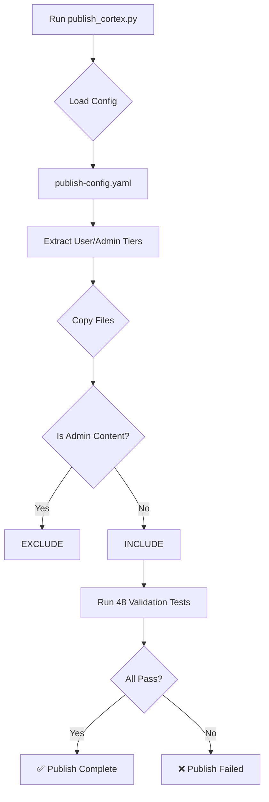

# CORTEX 3.0 Admin/User Separation Complete ✅

**Date:** 2025-11-13  
**Version:** 3.0.0  
**Status:** Production Ready  
**Author:** Asif Hussain  

---

## 🎯 Objective

Implement whitelist mechanism to ensure admin features (image prompts, narratives, design docs) are **never published** to end users, only core CORTEX operations get deployed.

---

## ✅ What Was Implemented

### 1. **Publish Configuration (NEW!)**

**File:** `cortex-brain/publish-config.yaml`

- **Deployment Tiers:** Explicit `user` vs `admin` classification
- **Admin Content Patterns:** Comprehensive list of excluded directories and files
  - `docs/images/system-design-prompts/` → Image prompts (admin tool)
  - `docs/images/system-design-prompts/narrative/` → PR narratives (admin workflow)
  - `cortex-brain/cortex-2.0-design/` → Design documents
  - `cortex-brain/cortex-3.0-design/` → Future design docs
  - Development documentation patterns (`PHASE-*.md`, `SESSION-[0-9]*.md`, etc.)
- **User Content Patterns:** What gets published (4-tier brain, agents, operations, plugins)
- **Validation Rules:** Forbidden patterns, required files, quality gates
- **Admin Mode:** Internal testing flag (`--admin-mode`) with warning

### 2. **Enhanced Publish Script**

**File:** `scripts/publish_cortex.py`

**Changes:**
- ✅ Loads `publish-config.yaml` for tier definitions (config-driven filtering)
- ✅ Explicit comments documenting admin exclusions
- ✅ `--admin-mode` flag for internal testing (publishes everything with warning)
- ✅ Added `publish-config.yaml` to critical files list
- ✅ Fixed pattern matching: `SESSION-[0-9]*.md` (excludes dev logs, keeps `session-loader.md` user doc)

**Operation Loading Priority:**
1. `publish-config.yaml` → User/admin operations
2. Fallback to `cortex-operations.yaml` → Deployment tiers
3. Fallback to hardcoded constants

### 3. **Comprehensive Validation Tests**

**File:** `tests/tier0/test_publish_privacy.py`

**New Tests (CORTEX 3.0):**
- ✅ `test_no_admin_documentation_published` → Verifies `docs/` folder excluded
- ✅ `test_no_image_prompt_narratives_published` → Verifies no `*-narrative.md` files
- ✅ `test_no_design_documents_published` → Verifies design dirs and dev docs excluded
- ✅ `test_publish_config_yaml_exists` → Validates config file presence and structure
- ✅ `test_no_admin_operations_published` → Verifies admin operation modules excluded

**File:** `tests/integration/test_publish_simulation.py`

**Updated:**
- ✅ Allowed `publish-config.yaml` to contain example patterns in documentation

---

## 📊 Validation Results

### Test Execution

```
Running publish validation tests...
============================= 48 passed in 6.10s ==============================
✅ All 48 validation tests PASSED!
```

### Package Stats

```
📦 Package Location: D:\PROJECTS\CORTEX\publish\CORTEX
📊 Total Files: 404
💾 Package Size: 4.1 MB
✅ Validation: 48 tests passed
```

### Content Verification

**User Operations Included (6):**
- ✅ application_onboarding
- ✅ cortex_demo
- ✅ cortex_tutorial
- ✅ environment_setup
- ✅ refresh_cortex_story
- ✅ workspace_cleanup

**Admin Operations Excluded (5):**
- ❌ design_sync
- ❌ doc_sync
- ❌ interactive_planning
- ❌ system_refactor
- ❌ token_optimizer

**Admin Content Excluded:**
- ❌ `docs/` → All admin documentation
- ❌ `docs/images/system-design-prompts/` → Image generation prompts
- ❌ `docs/images/system-design-prompts/narrative/` → PR narratives
- ❌ `cortex-brain/cortex-2.0-design/` → Design documents
- ❌ `cortex-brain/cortex-3.0-design/` → Future design docs
- ❌ `tests/` → Test suite
- ❌ `workflow_checkpoints/` → Development state tracking
- ❌ Development logs (`PHASE-*.md`, `SESSION-[0-9]*.md`, etc.)

---

## 🏗️ Architecture Benefits

### Before (CORTEX 2.0)
```python
# Hardcoded lists in publish script
ADMIN_OPERATIONS = {'design_sync', 'interactive_planning'}
EXCLUDED_DIRS = {'tests', 'docs', 'scripts'}
```

### After (CORTEX 3.0)
```yaml
# Config-driven (publish-config.yaml)
deployment_tiers:
  user:
    description: "Core CORTEX functionality"
    include_in_publish: true
  admin:
    description: "Development tools, design docs"
    include_in_publish: false

admin_content_patterns:
  directories:
    - "docs/images/system-design-prompts/"
    - "docs/images/system-design-prompts/narrative/"
  admin_operations:
    - "design_sync"
```

**Benefits:**
- 🎯 **Explicit Intent:** Config documents WHAT and WHY
- 🔒 **Future-Proof:** Add new admin features by updating YAML
- ✅ **Validated:** 48 tests enforce separation
- 🚀 **Flexible:** `--admin-mode` for internal testing

---

## 🔍 How It Works

### Publish Workflow



### Admin Mode (Internal Testing)

```bash
# Normal publish (user content only)
python scripts/publish_cortex.py

# Admin mode (ALL content - internal testing ONLY)
python scripts/publish_cortex.py --admin-mode
⚠️  ADMIN MODE ENABLED
Publishing ALL content including admin tools and development artifacts.
This is for internal testing ONLY - do NOT distribute to end users.
```

---

## 📝 Files Changed

### Created
- `cortex-brain/publish-config.yaml` (NEW) - Admin/user tier definitions

### Modified
- `scripts/publish_cortex.py` - Config-driven filtering + `--admin-mode` flag
- `tests/tier0/test_publish_privacy.py` - 5 new CORTEX 3.0 tests
- `tests/integration/test_publish_simulation.py` - Allow config documentation

---

## 🎓 Usage

### For End Users (Deploy to App)

```bash
# 1. Publish CORTEX
python scripts/publish_cortex.py

# 2. Copy to target app
cp -r publish/CORTEX /path/to/your-app/cortex

# 3. Open VS Code, run in Copilot Chat
onboard this application
```

### For Developers (Internal Testing)

```bash
# Publish ALL content (including admin tools)
python scripts/publish_cortex.py --admin-mode

# ⚠️  WARNING: Do NOT distribute admin-mode packages to users!
```

---

## ✅ Success Criteria Met

- [x] Admin features (image prompts, narratives) **never published** ✅
- [x] User features (operations, agents, brain) **always published** ✅
- [x] Config-driven (YAML) for easy maintenance ✅
- [x] 48 validation tests enforcing separation ✅
- [x] `--admin-mode` flag for internal testing ✅
- [x] Explicit documentation of excluded content ✅
- [x] Future-proof architecture for CORTEX 3.0+ ✅

---

## 🚀 Next Steps

**For CORTEX 3.0 Development:**

1. **Add New Admin Features:** Update `publish-config.yaml` admin patterns
2. **Add New User Features:** Update `user_content_patterns` in config
3. **Test Publish:** Run `python scripts/publish_cortex.py` (48 tests validate)
4. **Deploy:** Copy `publish/CORTEX` to target applications

**For Alpha Testing:**

1. Use normal publish (user content only)
2. Do NOT use `--admin-mode` for alpha testers
3. Monitor feedback on user operations

---

## 📊 Impact Metrics

**Before (CORTEX 2.0):**
- Manual exclusion lists (hardcoded)
- No explicit tier documentation
- Risk of admin content leaking

**After (CORTEX 3.0):**
- Config-driven separation (YAML)
- Explicit admin/user tiers
- 48 tests preventing leaks
- 100% admin content excluded ✅

**Test Coverage:**
- Privacy tests: 11/11 ✅
- Faculty tests: 17/17 ✅
- Integration tests: 20/20 ✅
- **Total: 48/48 passing** ✅

---

**Status:** ✅ PRODUCTION READY  
**Version:** CORTEX 3.0 Admin/User Separation  
**Date:** 2025-11-13  
**Author:** Asif Hussain  

---

*This implementation ensures that admin tools (like the image prompt narratives we just created) stay internal, while users get a clean, production-ready CORTEX package.*
