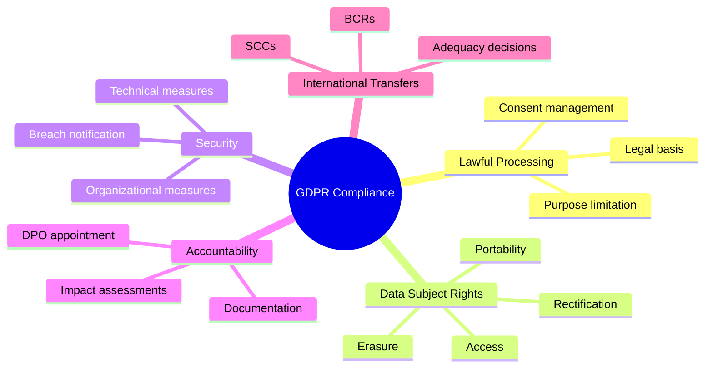
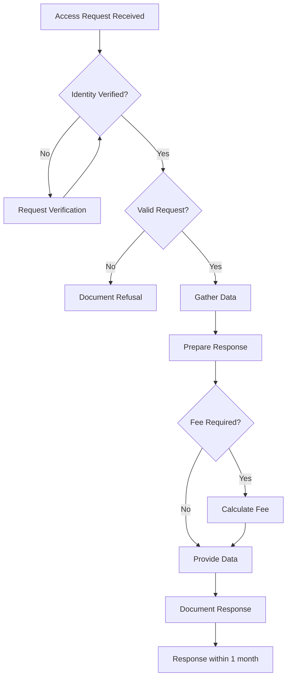
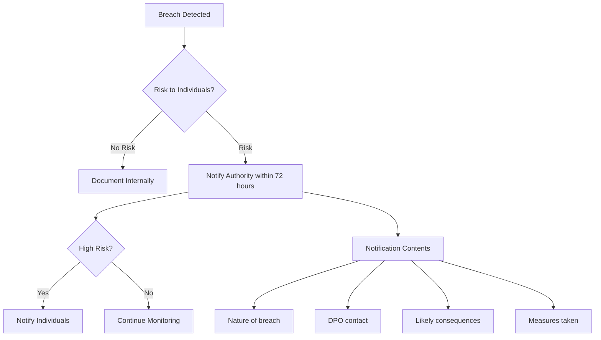
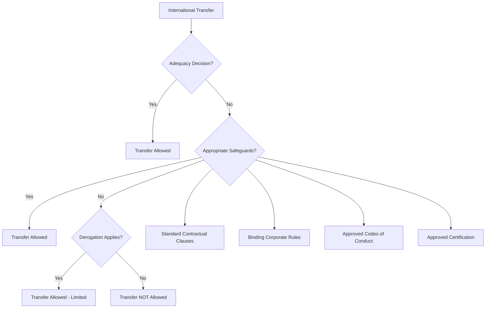

# 🇪🇺 GDPR Compliance Checklist

**Author:** Asif Hussain  
**Version:** 1.0.0  
**Last Updated:** December 30, 2025  
**Status:** ✅ Active  
**Category:** Compliance Knowledge Library  
**Regulation:** General Data Protection Regulation (EU) 2016/679  

---

## 📋 Executive Summary

This checklist provides comprehensive guidance for achieving and maintaining compliance with the EU General Data Protection Regulation (GDPR). It covers all key requirements, including lawful basis for processing, data subject rights, security measures, and breach notification procedures.

**Applicability:** Organizations processing personal data of EU residents, regardless of organization location.

**Penalties:** Up to €20 million or 4% of annual global turnover (whichever is higher).

**Related Documents:**
- `hipaa-compliance-checklist.md` - US healthcare data protection
- `pci-dss-compliance-checklist.md` - Payment card data security
- `data-protection-framework.md` - Data protection best practices

---

## 🎯 GDPR Compliance Framework



---

## 📊 GDPR Compliance Status Dashboard

Use this dashboard template to track compliance status:

| Category | Articles | Status | Progress |
|----------|----------|--------|----------|
| **Lawful Processing** | Art. 5-11 | ⬜ | 0% |
| **Data Subject Rights** | Art. 12-23 | ⬜ | 0% |
| **Controller/Processor** | Art. 24-31 | ⬜ | 0% |
| **Security & Breach** | Art. 32-34 | ⬜ | 0% |
| **Impact Assessments** | Art. 35-36 | ⬜ | 0% |
| **DPO & Records** | Art. 37-43 | ⬜ | 0% |
| **International Transfers** | Art. 44-49 | ⬜ | 0% |

---

## ✅ Section 1: Principles of Processing (Articles 5-11)

### Article 5: Processing Principles

#### 5.1 Lawfulness, Fairness, and Transparency
- [ ] Processing has a valid legal basis (Article 6)
- [ ] Data subjects are informed about processing (privacy notice)
- [ ] Processing is fair and not deceptive
- [ ] Special category data has additional legal basis (Article 9)

**Evidence Required:**
- [ ] Privacy notices for all processing activities
- [ ] Legal basis documented for each processing activity
- [ ] Records of consent where applicable

#### 5.2 Purpose Limitation
- [ ] Personal data collected for specified, explicit purposes
- [ ] Further processing compatible with original purpose
- [ ] Purpose limitation documented in privacy notices

#### 5.3 Data Minimization
- [ ] Only necessary data collected
- [ ] Regular review of data collection practices
- [ ] Data fields justified for each processing purpose

#### 5.4 Accuracy
- [ ] Data accuracy maintained
- [ ] Processes to update/correct data
- [ ] Retention of outdated data controlled

#### 5.5 Storage Limitation
- [ ] Retention periods defined for all data categories
- [ ] Automated deletion processes implemented
- [ ] Archiving policies documented

#### 5.6 Integrity and Confidentiality
- [ ] Appropriate security measures in place
- [ ] Protection against unauthorized processing
- [ ] Protection against accidental loss/destruction

#### 5.7 Accountability
- [ ] Able to demonstrate compliance
- [ ] Documentation maintained
- [ ] Regular compliance reviews conducted

### Article 6: Lawful Basis for Processing

| Legal Basis | When to Use | Documentation Required |
|-------------|-------------|------------------------|
| **Consent** | Data subject freely gives consent | Consent records, withdrawal mechanism |
| **Contract** | Processing necessary for contract | Contract documentation |
| **Legal Obligation** | Required by law | Legal requirement documentation |
| **Vital Interests** | Life-threatening situations | Assessment documentation |
| **Public Task** | Official authority/public interest | Authority documentation |
| **Legitimate Interests** | Business interest balanced against rights | LIA documentation |

#### Consent Requirements (where applicable)
- [ ] Consent is freely given
- [ ] Consent is specific and informed
- [ ] Consent is unambiguous (clear affirmative action)
- [ ] Consent is as easy to withdraw as to give
- [ ] Consent records maintained with timestamp
- [ ] Separate consents for different purposes
- [ ] No pre-ticked boxes
- [ ] Children's consent (age verification, parental consent)

#### Legitimate Interest Assessment (LIA) Template

```markdown
## Legitimate Interest Assessment

**Processing Activity:** [Description]  
**Date:** [Date]  
**Assessor:** [Name]  

### Step 1: Purpose Test
**What is the legitimate interest?**
[Description of the interest]

**Is it legitimate?**
- [ ] Legal
- [ ] Ethical
- [ ] Not harmful

### Step 2: Necessity Test
**Is processing necessary for the purpose?**
- [ ] No less intrusive alternative exists
- [ ] Processing is proportionate

### Step 3: Balancing Test
**Data subject impact:**
- Nature of data: [Sensitive/Non-sensitive]
- Data subjects: [Categories]
- Expectations: [Would they expect this?]
- Potential harm: [Risk assessment]

**Safeguards to reduce impact:**
- [ ] [Safeguard 1]
- [ ] [Safeguard 2]

### Conclusion
**Can we rely on legitimate interests?**
- [ ] Yes - interests do not override rights
- [ ] No - alternative basis needed
```

### Articles 9-10: Special Categories & Criminal Data

#### Special Category Data (Article 9)
- [ ] Explicit consent obtained, OR
- [ ] Legal obligation in employment/social security, OR
- [ ] Vital interests (unconscious person), OR
- [ ] Legitimate activities (nonprofit), OR
- [ ] Data made public by subject, OR
- [ ] Legal claims establishment, OR
- [ ] Substantial public interest, OR
- [ ] Health/social care purposes, OR
- [ ] Public health purposes, OR
- [ ] Research/statistics purposes

**Special Categories:**
- Racial or ethnic origin
- Political opinions
- Religious or philosophical beliefs
- Trade union membership
- Genetic data
- Biometric data (for identification)
- Health data
- Sex life or sexual orientation

#### Criminal Data (Article 10)
- [ ] Processing only under official authority control, OR
- [ ] Authorized by law with appropriate safeguards

---

## ✅ Section 2: Data Subject Rights (Articles 12-23)

### Article 12: Transparent Communication

- [ ] Privacy information provided in clear, plain language
- [ ] Information easily accessible
- [ ] Requests responded to within 1 month
- [ ] Complex requests: extension up to 2 months (with notification)
- [ ] Requests free of charge (unless manifestly unfounded/excessive)
- [ ] Identity verification procedures for requests
- [ ] Refusal reasons documented and communicated

### Article 13-14: Right to Information

#### Information to Provide (Collection from Data Subject)
- [ ] Controller identity and contact details
- [ ] DPO contact details (if applicable)
- [ ] Purposes and legal basis
- [ ] Legitimate interests (if applicable)
- [ ] Recipients/categories of recipients
- [ ] International transfer details
- [ ] Retention period or criteria
- [ ] Data subject rights explanation
- [ ] Right to withdraw consent
- [ ] Right to lodge complaint with supervisory authority
- [ ] Whether provision is statutory/contractual requirement
- [ ] Automated decision-making information (if applicable)

#### Additional Information (Indirect Collection)
- [ ] Categories of personal data
- [ ] Source of data

### Article 15: Right of Access



#### Access Request Response Must Include:
- [ ] Purposes of processing
- [ ] Categories of data
- [ ] Recipients/categories
- [ ] Retention period/criteria
- [ ] Rights information
- [ ] Source of data
- [ ] Automated decision-making details
- [ ] International transfer safeguards
- [ ] Copy of personal data

### Article 16: Right to Rectification

- [ ] Process to correct inaccurate data
- [ ] Process to complete incomplete data
- [ ] Third-party notification procedures
- [ ] Response within 1 month

### Article 17: Right to Erasure ("Right to be Forgotten")

#### Erasure Required When:
- [ ] Data no longer necessary for purpose
- [ ] Consent withdrawn (and no other basis)
- [ ] Data subject objects (and no overriding legitimate grounds)
- [ ] Data unlawfully processed
- [ ] Legal obligation requires erasure
- [ ] Data collected from child for online services

#### Exceptions (Erasure NOT Required):
- [ ] Freedom of expression
- [ ] Legal obligation compliance
- [ ] Public health purposes
- [ ] Archiving/research/statistics
- [ ] Legal claims establishment

### Article 18: Right to Restriction

- [ ] Restriction mechanism implemented
- [ ] Data marked as restricted
- [ ] Processing limited to storage only (while restricted)
- [ ] Third-party notification of restriction

### Article 19: Notification Obligation

- [ ] Notify recipients of rectification/erasure/restriction
- [ ] Inform data subject of recipients (on request)

### Article 20: Right to Data Portability

- [ ] Export mechanism in machine-readable format (JSON, CSV, XML)
- [ ] Direct transfer to other controller (where technically feasible)
- [ ] Applies to: consent-based or contract-based processing
- [ ] Applies to: automated processing only

### Article 21: Right to Object

- [ ] Object mechanism for legitimate interests processing
- [ ] Object mechanism for public task processing
- [ ] Absolute right to object to direct marketing
- [ ] Research objection (unless public interest)

### Article 22: Automated Decision-Making

- [ ] Right not to be subject to solely automated decisions
- [ ] Human intervention mechanism
- [ ] Profiling safeguards implemented
- [ ] Explicit consent for automated decisions (if necessary)
- [ ] Transparency about logic involved

---

## ✅ Section 3: Controller & Processor Obligations (Articles 24-31)

### Article 24: Controller Responsibilities

- [ ] Implement appropriate technical measures
- [ ] Implement appropriate organizational measures
- [ ] Demonstrate compliance capability
- [ ] Review and update measures regularly
- [ ] Data protection policies implemented

### Article 25: Data Protection by Design and Default

#### By Design
- [ ] Privacy considered at design stage
- [ ] Pseudonymization implemented where appropriate
- [ ] Data minimization in design
- [ ] Safeguards integrated into processing

#### By Default
- [ ] Only necessary data processed by default
- [ ] Limited storage period by default
- [ ] Limited accessibility by default
- [ ] Privacy settings at maximum by default

### Article 26: Joint Controllers

- [ ] Joint controller arrangement documented
- [ ] Responsibilities allocated between controllers
- [ ] Contact point designated for data subjects
- [ ] Arrangement available to data subjects

### Article 28: Processors

#### Processor Requirements
- [ ] Written contract in place
- [ ] Processing only on controller instructions
- [ ] Confidentiality obligations
- [ ] Security measures implemented
- [ ] Sub-processor approval mechanism
- [ ] Assistance with data subject rights
- [ ] Assistance with compliance obligations
- [ ] Data deletion/return at end of services
- [ ] Audit rights granted to controller

#### Processor Contract Must Include:
- [ ] Subject matter and duration
- [ ] Nature and purpose of processing
- [ ] Type of personal data
- [ ] Categories of data subjects
- [ ] Controller obligations and rights

### Article 30: Records of Processing Activities

#### Controller Records Must Include:
- [ ] Controller name and contact details
- [ ] DPO contact details
- [ ] Purposes of processing
- [ ] Categories of data subjects
- [ ] Categories of personal data
- [ ] Categories of recipients
- [ ] International transfers and safeguards
- [ ] Retention periods
- [ ] Security measures description

#### Processor Records Must Include:
- [ ] Processor name and contact details
- [ ] Controller(s) name and contact details
- [ ] Categories of processing
- [ ] International transfers and safeguards
- [ ] Security measures description

---

## ✅ Section 4: Security & Breach Notification (Articles 32-34)

### Article 32: Security of Processing

#### Technical Measures
- [ ] Pseudonymization implemented
- [ ] Encryption implemented (at rest and in transit)
- [ ] Access controls implemented
- [ ] Network security measures
- [ ] Endpoint protection
- [ ] Secure development practices
- [ ] Vulnerability management

#### Organizational Measures
- [ ] Security policies documented
- [ ] Staff training on security
- [ ] Incident response procedures
- [ ] Business continuity plans
- [ ] Regular security testing
- [ ] Vendor risk management

#### Security Assessment
- [ ] Risk assessment conducted
- [ ] Cost of implementation considered
- [ ] State of the art considered
- [ ] Nature, scope, context of processing considered
- [ ] Risk to individuals considered

### Article 33: Breach Notification to Authority



#### Notification to Authority Must Include:
- [ ] Nature of breach (categories, approximate numbers)
- [ ] DPO or other contact point
- [ ] Likely consequences
- [ ] Measures taken or proposed

#### Breach Documentation:
- [ ] Facts of breach
- [ ] Effects of breach
- [ ] Remedial action taken
- [ ] Timeline of events

### Article 34: Breach Notification to Individuals

#### High Risk Notification Required When:
- Likely to result in high risk to rights and freedoms
- Unless:
  - [ ] Technical protection measures applied (encryption)
  - [ ] Subsequent measures eliminate high risk
  - [ ] Disproportionate effort (public communication instead)

#### Individual Notification Must Include:
- [ ] Clear, plain language description
- [ ] DPO or other contact point
- [ ] Likely consequences
- [ ] Measures taken or proposed
- [ ] Advice on self-protection

---

## ✅ Section 5: Impact Assessments (Articles 35-36)

### Article 35: Data Protection Impact Assessment (DPIA)

#### DPIA Required When:
- [ ] Systematic and extensive profiling with significant effects
- [ ] Large-scale special category data processing
- [ ] Large-scale public area monitoring
- [ ] New technologies with high risk
- [ ] Automated decision-making with legal effects
- [ ] Large-scale processing likely to cause damage

#### DPIA Template

```markdown
## Data Protection Impact Assessment

**Project/Processing:** [Name]  
**Date:** [Date]  
**Assessor:** [Name]  
**DPO Review:** [Name/Date]  

### 1. Processing Description
**Purpose:** [Why processing is needed]
**Data Categories:** [What data is processed]
**Data Subjects:** [Whose data]
**Retention:** [How long kept]
**Recipients:** [Who receives data]

### 2. Necessity and Proportionality
- [ ] Processing necessary for purpose
- [ ] Purpose cannot be achieved by less intrusive means
- [ ] Data minimized to what is necessary

### 3. Risk Assessment
| Risk | Likelihood | Severity | Risk Level |
|------|------------|----------|------------|
| [Risk 1] | [L/M/H] | [L/M/H] | [L/M/H/C] |
| [Risk 2] | [L/M/H] | [L/M/H] | [L/M/H/C] |

### 4. Mitigation Measures
| Risk | Measure | Residual Risk |
|------|---------|---------------|
| [Risk 1] | [Control] | [L/M/H] |

### 5. Consultation
- [ ] Data subjects consulted (where appropriate)
- [ ] DPO consulted
- [ ] Supervisory authority consulted (if high residual risk)

### 6. Sign-off
| Role | Name | Date |
|------|------|------|
| Project Owner | [Name] | [Date] |
| DPO | [Name] | [Date] |
| Legal | [Name] | [Date] |
```

### Article 36: Prior Consultation

- [ ] Consult supervisory authority before processing with high residual risk
- [ ] Provide: DPIA, measures, safeguards, DPO contact, other info requested

---

## ✅ Section 6: DPO & Certification (Articles 37-43)

### Article 37: Data Protection Officer Appointment

#### DPO Required When:
- [ ] Public authority or body
- [ ] Core activities require regular, systematic monitoring at large scale
- [ ] Core activities involve large-scale special category data processing

#### DPO Requirements:
- [ ] Expert knowledge of data protection law
- [ ] Accessible to data subjects
- [ ] Reports to highest management level
- [ ] No conflict of interest
- [ ] Contact details published
- [ ] Contact details provided to supervisory authority

### Articles 38-39: DPO Position and Tasks

#### DPO Tasks:
- [ ] Inform and advise on GDPR obligations
- [ ] Monitor compliance
- [ ] Advise on DPIAs
- [ ] Cooperate with supervisory authority
- [ ] Act as contact point for supervisory authority

#### DPO Independence:
- [ ] No instructions regarding task exercise
- [ ] No dismissal/penalty for task performance
- [ ] Adequate resources provided
- [ ] Access to personal data and processing operations

### Article 30: Records Maintenance

- [ ] Records of processing activities maintained
- [ ] Records available to supervisory authority on request
- [ ] Electronic format recommended

---

## ✅ Section 7: International Transfers (Articles 44-49)

### Transfer Mechanisms



### Article 45: Adequacy Decisions

Countries with adequacy decisions (as of 2025):
- [ ] Andorra, Argentina, Canada (commercial), Faroe Islands
- [ ] Guernsey, Israel, Isle of Man, Japan, Jersey
- [ ] New Zealand, Republic of Korea, Switzerland
- [ ] United Kingdom, Uruguay
- [ ] US (Data Privacy Framework participants)

### Article 46: Appropriate Safeguards

#### Standard Contractual Clauses (SCCs)
- [ ] EU Commission approved SCCs in place
- [ ] Transfer Impact Assessment completed
- [ ] Supplementary measures implemented (if needed)
- [ ] SCCs not modified

#### Binding Corporate Rules (BCRs)
- [ ] Approved by supervisory authority
- [ ] Legally binding on all group members
- [ ] Data subject enforceable rights
- [ ] BCR audit program

### Article 49: Derogations

When no adequacy or safeguards (use sparingly):
- [ ] Explicit consent (informed of risks)
- [ ] Contract necessity
- [ ] Public interest (legal basis)
- [ ] Legal claims
- [ ] Vital interests
- [ ] Public register

---

## 📝 Implementation Templates

### Privacy Notice Template

```markdown
# Privacy Notice

**Last Updated:** [Date]  
**Controller:** [Organization Name]  
**Contact:** [Email/Address]  
**DPO:** [Name/Contact]  

## What Information We Collect
[Categories of personal data]

## How We Use Your Information
| Purpose | Legal Basis | Data Categories |
|---------|-------------|-----------------|
| [Purpose 1] | [Basis] | [Data] |

## Who We Share With
[Recipients and reasons]

## International Transfers
[Transfer details and safeguards]

## How Long We Keep Data
[Retention periods by category]

## Your Rights
- Access your data
- Correct inaccurate data
- Delete your data
- Restrict processing
- Data portability
- Object to processing
- Withdraw consent

## How to Exercise Rights
[Contact details and process]

## Complaints
[Supervisory authority contact]

## Updates to This Notice
[How changes communicated]
```

### Data Subject Request Response Template

```markdown
## Response to Data Subject Request

**Request Type:** [Access/Erasure/Rectification/etc.]  
**Request Date:** [Date]  
**Response Due:** [Date + 1 month]  
**Request ID:** [Reference]  

### Identity Verification
- [ ] Identity verified on [Date]
- Method: [How verified]

### Request Scope
[What data/processing is subject of request]

### Response
[Detailed response to request]

### Data Provided (if access request)
[Data categories included/excluded with reasons]

### Actions Taken (if other request type)
[Description of actions completed]

### Third Party Notifications
- [ ] Notified [Recipient] on [Date]

### Next Steps (if any)
[Any follow-up required]

**Response Date:** [Date]  
**Handled By:** [Name]  
```

---

## 📊 Compliance Audit Checklist

### Annual GDPR Audit

| Area | Status | Last Review | Next Review |
|------|--------|-------------|-------------|
| Privacy Notices | ⬜ | [Date] | [Date] |
| Consent Mechanisms | ⬜ | [Date] | [Date] |
| Data Subject Rights Processes | ⬜ | [Date] | [Date] |
| Security Measures | ⬜ | [Date] | [Date] |
| Breach Response Procedures | ⬜ | [Date] | [Date] |
| Processor Contracts | ⬜ | [Date] | [Date] |
| Records of Processing | ⬜ | [Date] | [Date] |
| DPIAs | ⬜ | [Date] | [Date] |
| International Transfers | ⬜ | [Date] | [Date] |
| Staff Training | ⬜ | [Date] | [Date] |

---

## 📚 References

### Official Resources
- [GDPR Full Text](https://eur-lex.europa.eu/eli/reg/2016/679/oj)
- [EDPB Guidelines](https://edpb.europa.eu/our-work-tools/general-guidance/gdpr-guidelines-recommendations-best-practices_en)
- [ICO GDPR Guidance](https://ico.org.uk/for-organisations/guide-to-data-protection/guide-to-the-general-data-protection-regulation-gdpr/)
- [CNIL GDPR Resources](https://www.cnil.fr/en/gdpr-developers-guide)

### CORTEX Related Documents
- `hipaa-compliance-checklist.md` - Healthcare data compliance
- `pci-dss-compliance-checklist.md` - Payment card compliance
- `soc2-compliance-checklist.md` - Service organization controls
- `data-protection-framework.md` - General data protection

---

**Document Classification:** Compliance Reference  
**Review Cycle:** Annually and upon regulatory updates  
**Related Plans:** Security Enhancement Plan (Phase 1)
