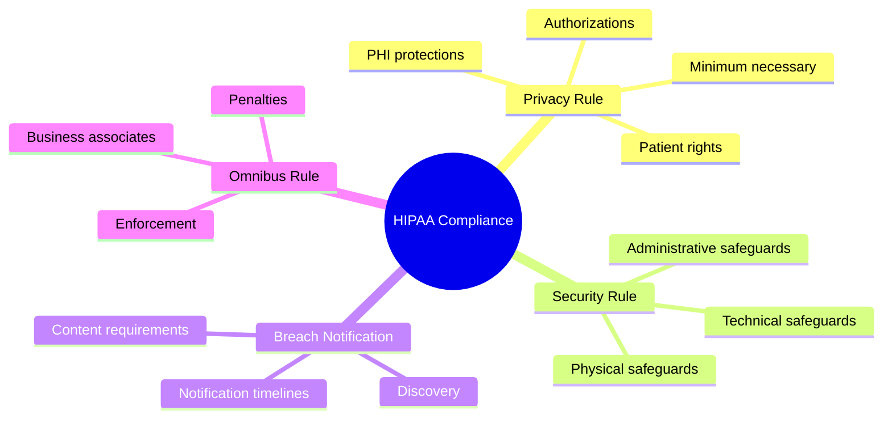
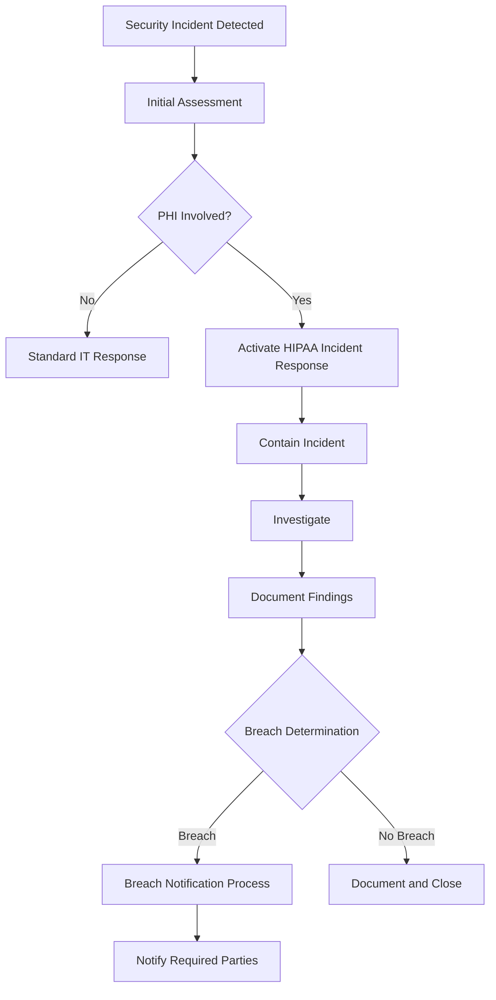
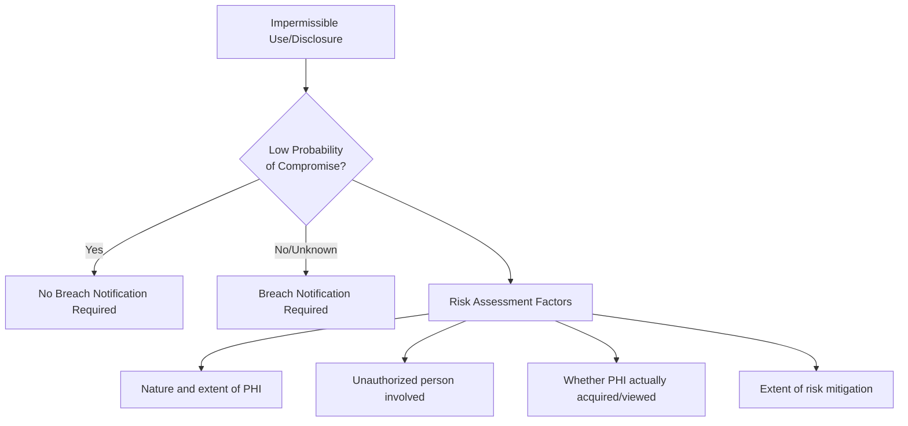

# 🏥 HIPAA Compliance Checklist

**Author:** Asif Hussain  
**Version:** 1.0.0  
**Last Updated:** December 30, 2025  
**Status:** ✅ Active  
**Category:** Compliance Knowledge Library  
**Regulation:** Health Insurance Portability and Accountability Act (1996)  

---

## 📋 Executive Summary

This checklist provides comprehensive guidance for achieving and maintaining compliance with the Health Insurance Portability and Accountability Act (HIPAA). It covers the Privacy Rule, Security Rule, Breach Notification Rule, and Omnibus Rule requirements for protecting Protected Health Information (PHI).

**Applicability:** 
- Covered Entities: Healthcare providers, health plans, healthcare clearinghouses
- Business Associates: Organizations handling PHI on behalf of covered entities

**Penalties:** 
- Tier 1 (Unknown): $100 - $50,000 per violation
- Tier 2 (Reasonable Cause): $1,000 - $50,000 per violation
- Tier 3 (Willful Neglect - Corrected): $10,000 - $50,000 per violation
- Tier 4 (Willful Neglect - Not Corrected): $50,000 per violation
- Maximum: $1.5 million per violation category per year
- Criminal penalties: Up to $250,000 and 10 years imprisonment

**Related Documents:**
- `gdpr-compliance-checklist.md` - EU data protection
- `data-protection-framework.md` - General data protection
- `database-security-guide.md` - Database security controls

---

## 🎯 HIPAA Compliance Framework



---

## 📊 HIPAA Compliance Status Dashboard

| Category | Rule | Status | Progress |
|----------|------|--------|----------|
| **Privacy Rule** | 45 CFR Part 164 Subpart E | ⬜ | 0% |
| **Security Rule - Administrative** | 45 CFR § 164.308 | ⬜ | 0% |
| **Security Rule - Physical** | 45 CFR § 164.310 | ⬜ | 0% |
| **Security Rule - Technical** | 45 CFR § 164.312 | ⬜ | 0% |
| **Breach Notification** | 45 CFR Part 164 Subpart D | ⬜ | 0% |
| **Business Associates** | 45 CFR § 164.502(e) | ⬜ | 0% |

---

## 🔒 Protected Health Information (PHI)

### What is PHI?

PHI is individually identifiable health information that is:
- Created or received by a covered entity
- Relates to past, present, or future health condition
- Relates to healthcare provision
- Relates to payment for healthcare

### 18 HIPAA Identifiers

| # | Identifier | Examples |
|---|------------|----------|
| 1 | Names | Full name, maiden name |
| 2 | Geographic data | Address, ZIP code (smaller than state) |
| 3 | Dates | Birth date, admission date, death date |
| 4 | Phone numbers | Home, mobile, work |
| 5 | Fax numbers | All fax numbers |
| 6 | Email addresses | Personal and work email |
| 7 | Social Security numbers | SSN |
| 8 | Medical record numbers | MRN |
| 9 | Health plan beneficiary numbers | Insurance ID |
| 10 | Account numbers | Financial accounts |
| 11 | Certificate/license numbers | Driver's license |
| 12 | Vehicle identifiers | VIN, license plate |
| 13 | Device identifiers | Serial numbers |
| 14 | Web URLs | Personal websites |
| 15 | IP addresses | All IP addresses |
| 16 | Biometric identifiers | Fingerprints, voice prints |
| 17 | Full-face photographs | Photos showing face |
| 18 | Other unique identifiers | Any other unique number |

### De-identification Methods

#### Safe Harbor Method
Remove all 18 identifiers and have no actual knowledge of re-identification possibility.

#### Expert Determination
Statistical/scientific expert determines very small risk of re-identification.

---

## ✅ Section 1: Privacy Rule (45 CFR Part 164 Subpart E)

### 1.1 Notice of Privacy Practices (NPP)

- [ ] NPP developed and maintained
- [ ] NPP provided at first service delivery
- [ ] NPP posted in facility (physical)
- [ ] NPP available on website
- [ ] Good faith effort to obtain acknowledgment
- [ ] NPP includes all required elements

#### NPP Required Elements:
- [ ] How PHI may be used and disclosed
- [ ] Patient rights regarding PHI
- [ ] Covered entity's duties to protect PHI
- [ ] Complaint procedures
- [ ] Contact information for questions
- [ ] Effective date

### 1.2 Patient Rights

#### Right of Access (45 CFR § 164.524)
- [ ] Access request procedures documented
- [ ] 30-day response timeline (one 30-day extension allowed)
- [ ] Reasonable cost-based fees only
- [ ] Designated record set accessible
- [ ] Electronic format available if requested
- [ ] Denial rights and appeal process documented

#### Right to Amend (45 CFR § 164.526)
- [ ] Amendment request procedures documented
- [ ] 60-day response timeline (one 30-day extension allowed)
- [ ] Denial reasons documented
- [ ] Amendments appended to record

#### Right to Accounting of Disclosures (45 CFR § 164.528)
- [ ] Accounting request procedures documented
- [ ] 60-day response timeline
- [ ] 6-year lookback period
- [ ] Disclosures tracked

#### Right to Request Restrictions (45 CFR § 164.522)
- [ ] Restriction request process documented
- [ ] Out-of-pocket payment restrictions honored
- [ ] Termination procedures documented

#### Right to Confidential Communications (45 CFR § 164.522)
- [ ] Alternative communication method requests honored
- [ ] Reasonable accommodations made

### 1.3 Minimum Necessary Standard

- [ ] Minimum necessary policies documented
- [ ] Role-based access implemented
- [ ] Routine disclosures standardized
- [ ] Non-routine disclosure review process
- [ ] Reasonable reliance on requestor representations

### 1.4 Uses and Disclosures

#### Permitted Uses (No Authorization Required)
- [ ] To the individual
- [ ] Treatment, Payment, Healthcare Operations (TPO)
- [ ] With opportunity to agree/object
- [ ] Incident to permitted use
- [ ] Public interest and benefit activities
- [ ] Limited data set with data use agreement

#### Authorization Requirements
- [ ] Authorization form meets all requirements
- [ ] Core elements included
- [ ] Required statements included
- [ ] Compound authorizations prohibited
- [ ] Marketing and sale of PHI authorizations compliant

#### Authorization Core Elements:
- [ ] Description of PHI
- [ ] Persons authorized to disclose
- [ ] Persons authorized to receive
- [ ] Purpose of disclosure
- [ ] Expiration date/event
- [ ] Signature and date
- [ ] Right to revoke (statement)
- [ ] Ability to revoke (statement)
- [ ] Potential for re-disclosure (statement)
- [ ] Treatment conditioning (if applicable)

### 1.5 Business Associates

- [ ] All business associates identified
- [ ] Business Associate Agreements (BAAs) in place
- [ ] BAAs contain required elements
- [ ] BA compliance monitoring process

---

## ✅ Section 2: Security Rule - Administrative Safeguards (§ 164.308)

### 2.1 Security Management Process (§ 164.308(a)(1))

#### Risk Analysis (Required)
- [ ] Risk analysis conducted
- [ ] All ePHI identified
- [ ] Threats and vulnerabilities identified
- [ ] Current security measures assessed
- [ ] Impact and likelihood determined
- [ ] Risk level assigned to each threat

```markdown
## Risk Analysis Template

**Date:** [Date]  
**Assessor:** [Name]  
**Scope:** [Systems/Data in scope]  

### ePHI Inventory
| System | Data Type | Location | Classification |
|--------|-----------|----------|----------------|
| [System] | [PHI type] | [Location] | [High/Med/Low] |

### Threat Assessment
| Threat | Vulnerability | Likelihood | Impact | Risk Level |
|--------|--------------|------------|--------|------------|
| [Threat] | [Vuln] | [1-3] | [1-3] | [H/M/L] |

### Current Controls
| Control | Effectiveness | Gaps |
|---------|--------------|------|
| [Control] | [H/M/L] | [Gap description] |

### Risk Treatment Plan
| Risk | Treatment | Timeline | Owner |
|------|-----------|----------|-------|
| [Risk] | [Mitigate/Accept/Transfer] | [Date] | [Name] |
```

#### Risk Management (Required)
- [ ] Risk management plan developed
- [ ] Security measures implemented
- [ ] Risk reduced to reasonable level
- [ ] Ongoing risk management process

#### Sanction Policy (Required)
- [ ] Sanction policy documented
- [ ] Sanctions applied consistently
- [ ] Workforce aware of policy

#### Information System Activity Review (Required)
- [ ] Audit logs reviewed regularly
- [ ] Review procedures documented
- [ ] Anomalies investigated

### 2.2 Assigned Security Responsibility (§ 164.308(a)(2))

- [ ] Security Official designated
- [ ] Responsibilities documented
- [ ] Authority to implement security
- [ ] Contact information available

### 2.3 Workforce Security (§ 164.308(a)(3))

#### Authorization and/or Supervision (Addressable)
- [ ] Access authorization procedures
- [ ] Supervision of workforce members
- [ ] Clearance procedures documented

#### Workforce Clearance Procedure (Addressable)
- [ ] Background check procedures
- [ ] Access level determination process
- [ ] Clearance criteria documented

#### Termination Procedures (Addressable)
- [ ] Access termination within 24 hours
- [ ] Return of access devices
- [ ] Account deactivation process
- [ ] Exit interview includes security

### 2.4 Information Access Management (§ 164.308(a)(4))

#### Access Authorization (Addressable)
- [ ] Access request and approval process
- [ ] Role-based access defined
- [ ] Minimum necessary enforced
- [ ] Access approvals documented

#### Access Establishment and Modification (Addressable)
- [ ] User provisioning procedures
- [ ] Access modification procedures
- [ ] Periodic access reviews
- [ ] Privileged access controls

### 2.5 Security Awareness and Training (§ 164.308(a)(5))

#### Security Reminders (Addressable)
- [ ] Regular security reminders distributed
- [ ] Updates on emerging threats
- [ ] Security newsletter or bulletins

#### Protection from Malicious Software (Addressable)
- [ ] Anti-malware training provided
- [ ] Safe email practices training
- [ ] Phishing awareness training

#### Log-in Monitoring (Addressable)
- [ ] Failed login attempt monitoring
- [ ] Login anomaly detection
- [ ] User notification of suspicious activity

#### Password Management (Addressable)
- [ ] Password policy training
- [ ] Password creation guidance
- [ ] Password management tools guidance

### 2.6 Security Incident Procedures (§ 164.308(a)(6))

#### Response and Reporting (Required)
- [ ] Incident response plan documented
- [ ] Incident response team identified
- [ ] Reporting procedures established
- [ ] Mitigation procedures documented
- [ ] Documentation requirements defined



### 2.7 Contingency Plan (§ 164.308(a)(7))

#### Data Backup Plan (Required)
- [ ] ePHI backup procedures documented
- [ ] Backup frequency defined
- [ ] Backup media secured
- [ ] Backup verification testing

#### Disaster Recovery Plan (Required)
- [ ] Recovery procedures documented
- [ ] Recovery time objectives (RTO)
- [ ] Recovery point objectives (RPO)
- [ ] System restoration priorities

#### Emergency Mode Operation Plan (Required)
- [ ] Emergency operations procedures
- [ ] Critical functions identified
- [ ] Manual procedures if needed
- [ ] Alternate processing sites

#### Testing and Revision Procedures (Addressable)
- [ ] Annual contingency plan testing
- [ ] Test results documented
- [ ] Plan revisions based on tests

#### Applications and Data Criticality Analysis (Addressable)
- [ ] Critical systems identified
- [ ] Data classification completed
- [ ] Recovery priorities established

### 2.8 Evaluation (§ 164.308(a)(8))

- [ ] Periodic technical and non-technical evaluation
- [ ] Environmental/operational change evaluation
- [ ] Evaluation results documented
- [ ] Remediation plans developed

### 2.9 Business Associate Contracts (§ 164.308(b)(1))

- [ ] All BAs identified and documented
- [ ] BAAs executed before PHI access
- [ ] BAAs contain required provisions
- [ ] BA compliance monitored
- [ ] Subcontractor requirements included

---

## ✅ Section 3: Security Rule - Physical Safeguards (§ 164.310)

### 3.1 Facility Access Controls (§ 164.310(a)(1))

#### Contingency Operations (Addressable)
- [ ] Emergency facility access procedures
- [ ] Procedures for accessing PHI during emergencies

#### Facility Security Plan (Addressable)
- [ ] Physical security plan documented
- [ ] Access points identified and controlled
- [ ] Security personnel/systems in place

#### Access Control and Validation Procedures (Addressable)
- [ ] Visitor management procedures
- [ ] Access validation procedures
- [ ] Role-based physical access

#### Maintenance Records (Addressable)
- [ ] Physical modifications documented
- [ ] Security system maintenance logged
- [ ] Access control changes recorded

### 3.2 Workstation Use (§ 164.310(b))

- [ ] Workstation use policies documented
- [ ] Proper workstation functions defined
- [ ] Physical attributes addressed
- [ ] Environmental controls specified

### 3.3 Workstation Security (§ 164.310(c))

- [ ] Physical access to workstations restricted
- [ ] Screen privacy controls
- [ ] Automatic lock-out configured
- [ ] Clean desk policy enforced

### 3.4 Device and Media Controls (§ 164.310(d)(1))

#### Disposal (Required)
- [ ] Media disposal procedures documented
- [ ] Secure destruction methods used
- [ ] Disposal documented and verified
- [ ] Third-party disposal contracts

#### Media Re-use (Required)
- [ ] Media sanitization before re-use
- [ ] Sanitization methods documented
- [ ] Verification of sanitization

#### Accountability (Addressable)
- [ ] Hardware and media inventory
- [ ] Movement tracking procedures
- [ ] Responsible party assignment

#### Data Backup and Storage (Addressable)
- [ ] Backup media protection
- [ ] Off-site storage security
- [ ] Transportation security

---

## ✅ Section 4: Security Rule - Technical Safeguards (§ 164.312)

### 4.1 Access Control (§ 164.312(a)(1))

#### Unique User Identification (Required)
- [ ] Unique user IDs assigned
- [ ] No shared accounts
- [ ] User ID tracked to individual

#### Emergency Access Procedure (Required)
- [ ] Emergency access procedures documented
- [ ] Break-glass procedures established
- [ ] Emergency access logged and reviewed

#### Automatic Logoff (Addressable)
- [ ] Automatic session termination configured
- [ ] Timeout periods appropriate to risk
- [ ] Re-authentication required

#### Encryption and Decryption (Addressable)
- [ ] ePHI encrypted at rest
- [ ] Encryption key management
- [ ] NIST-approved algorithms used

### 4.2 Audit Controls (§ 164.312(b))

- [ ] Hardware audit capability
- [ ] Software audit capability
- [ ] Procedural audit mechanisms
- [ ] Audit log review procedures
- [ ] Log retention period defined

#### Audit Log Contents Should Include:
- [ ] User identification
- [ ] Type of event
- [ ] Date and time
- [ ] Success/failure indication
- [ ] Data/resource accessed

### 4.3 Integrity (§ 164.312(c)(1))

#### Mechanism to Authenticate ePHI (Addressable)
- [ ] ePHI integrity verification implemented
- [ ] Hash functions or digital signatures
- [ ] Error detection mechanisms

### 4.4 Person or Entity Authentication (§ 164.312(d))

- [ ] Authentication mechanisms implemented
- [ ] Multi-factor authentication (risk-based)
- [ ] Strong password requirements
- [ ] Biometric authentication (if applicable)

### 4.5 Transmission Security (§ 164.312(e)(1))

#### Integrity Controls (Addressable)
- [ ] Data integrity during transmission
- [ ] Error checking mechanisms
- [ ] Message authentication codes

#### Encryption (Addressable)
- [ ] ePHI encrypted in transit
- [ ] TLS 1.2+ for web traffic
- [ ] Secure email for ePHI
- [ ] VPN for remote access

---

## ✅ Section 5: Breach Notification Rule (45 CFR Part 164 Subpart D)

### 5.1 Breach Definition

A breach is the acquisition, access, use, or disclosure of PHI in a manner not permitted that compromises the security or privacy of the PHI.

#### Breach Presumption
Impermissible use or disclosure is presumed a breach unless:



#### Exceptions (Not a Breach)
- [ ] Unintentional acquisition by workforce (good faith, within scope)
- [ ] Inadvertent disclosure within organization
- [ ] Good faith belief that unauthorized person cannot retain PHI

### 5.2 Breach Risk Assessment

```markdown
## Breach Risk Assessment

**Incident ID:** [ID]  
**Date Discovered:** [Date]  
**Assessment Date:** [Date]  
**Assessor:** [Name]  

### Factor 1: Nature and Extent of PHI Involved
- PHI types involved: [List identifiers and clinical info]
- Sensitivity level: [High/Medium/Low]
- Quantity of records: [Number]
- Score: [1-3]

### Factor 2: Unauthorized Person
- Identity known: [Yes/No]
- Obligations to protect PHI: [Yes/No/Unknown]
- Recipient entity type: [Healthcare/Other]
- Score: [1-3]

### Factor 3: PHI Acquisition/Viewing
- Evidence of actual access: [Yes/No/Unknown]
- Evidence of copying: [Yes/No/Unknown]
- Technical controls preventing access: [Describe]
- Score: [1-3]

### Factor 4: Risk Mitigation
- Assurances obtained: [Yes/No]
- PHI destroyed: [Yes/No/Unknown]
- Other mitigation: [Describe]
- Score: [1-3]

### Overall Assessment
**Total Score:** [4-12]
**Risk Level:** [Low/Medium/High]
**Breach Determination:** [Breach/Not a Breach]
**Justification:** [Explanation]
```

### 5.3 Notification Requirements

#### Individual Notice (§ 164.404)
- [ ] Written notification (first-class mail or email if authorized)
- [ ] Within 60 calendar days of discovery
- [ ] Substitute notice if contact info insufficient

#### Individual Notice Content:
- [ ] Description of breach (what happened)
- [ ] Types of PHI involved
- [ ] Steps individuals should take
- [ ] What entity is doing to investigate and mitigate
- [ ] Contact procedures (toll-free number, email, postal address)

#### Media Notice (§ 164.406)
- [ ] Required if >500 residents of a State affected
- [ ] Within 60 calendar days
- [ ] Prominent media outlets in the State

#### HHS Notice (§ 164.408)
- [ ] Breaches affecting 500+ individuals: within 60 days
- [ ] Breaches affecting <500 individuals: within 60 days of calendar year end
- [ ] Online submission through HHS portal

### 5.4 Business Associate Notification

- [ ] BA notifies covered entity of breach
- [ ] Notification without unreasonable delay
- [ ] Maximum 60 days from discovery
- [ ] BAA may specify shorter timeframe

---

## ✅ Section 6: Business Associate Requirements

### 6.1 Business Associate Agreement (BAA) Required Elements

```markdown
## Business Associate Agreement Checklist

**Covered Entity:** [Name]  
**Business Associate:** [Name]  
**Effective Date:** [Date]  

### Required Provisions
- [ ] Permitted uses and disclosures specified
- [ ] BA will not use/disclose beyond permitted
- [ ] Appropriate safeguards to prevent impermissible use
- [ ] Report impermissible uses/disclosures
- [ ] BA to ensure subcontractor compliance (if applicable)
- [ ] Make PHI available for access requests
- [ ] Make PHI available for amendments
- [ ] Provide information for accounting of disclosures
- [ ] Make practices available for HHS compliance
- [ ] Return or destroy PHI at termination
- [ ] BA directly liable for HIPAA violations

### Additional Recommended Provisions
- [ ] Insurance requirements
- [ ] Audit rights
- [ ] Indemnification
- [ ] Breach notification timeline (shorter than 60 days)
- [ ] Security requirements specification
- [ ] Subcontractor approval requirements
```

### 6.2 Business Associate Direct Liability

Business Associates are directly liable for:
- [ ] Impermissible uses and disclosures
- [ ] Failure to provide breach notification
- [ ] Failure to provide PHI access/copies
- [ ] Failure to comply with HHS
- [ ] Failure to provide accounting of disclosures
- [ ] Failure to comply with Security Rule

---

## 📝 Implementation Templates

### HIPAA Policy Document Template

```markdown
# [Policy Name] Policy

**Policy Number:** HIPAA-[XXX]  
**Version:** [X.X]  
**Effective Date:** [Date]  
**Last Review:** [Date]  
**Next Review:** [Date]  
**Owner:** [Security Official]  
**Approved By:** [Name/Title]  

## 1. Purpose
[Why this policy exists]

## 2. Scope
[Who and what this policy applies to]

## 3. Definitions
[Key terms used in the policy]

## 4. Policy Statement
[The actual policy requirements]

## 5. Procedures
[How to comply with the policy]

## 6. Responsibilities
| Role | Responsibilities |
|------|-----------------|
| [Role] | [Duties] |

## 7. Enforcement
[Consequences of non-compliance]

## 8. Related Policies
- [Related Policy 1]
- [Related Policy 2]

## 9. Revision History
| Version | Date | Changes | Author |
|---------|------|---------|--------|
| [X.X] | [Date] | [Description] | [Name] |
```

### Training Documentation Template

```markdown
## HIPAA Training Record

**Employee:** [Name]  
**Department:** [Department]  
**Job Title:** [Title]  
**Training Date:** [Date]  
**Trainer:** [Name/System]  

### Training Completed
| Module | Date | Score | Pass/Fail |
|--------|------|-------|-----------|
| HIPAA Privacy Basics | [Date] | [%] | [P/F] |
| HIPAA Security Basics | [Date] | [%] | [P/F] |
| Role-Specific Training | [Date] | [%] | [P/F] |
| Phishing Awareness | [Date] | [%] | [P/F] |

### Acknowledgment
I acknowledge that I have completed the required HIPAA training and understand my responsibilities for protecting PHI.

**Signature:** ________________  
**Date:** ________________  

### Next Training Due: [Date]
```

---

## 📊 Compliance Audit Checklist

### Annual HIPAA Audit Schedule

| Quarter | Focus Area | Audit Type |
|---------|-----------|------------|
| Q1 | Administrative Safeguards | Internal |
| Q2 | Technical Safeguards | Internal + External |
| Q3 | Physical Safeguards | Walkthrough |
| Q4 | Privacy Rule Compliance | Internal |

### Audit Finding Template

```markdown
## Audit Finding

**Finding ID:** [HIPAA-YYYY-XXX]  
**Date Identified:** [Date]  
**Regulation Reference:** [45 CFR § XXX.XXX]  
**Severity:** [Critical/High/Medium/Low]  

### Description
[What was found]

### Evidence
[Supporting documentation]

### Risk/Impact
[Potential consequences]

### Recommendation
[How to remediate]

### Management Response
**Owner:** [Name]  
**Target Date:** [Date]  
**Action Plan:** [Description]  

### Resolution
**Completion Date:** [Date]  
**Verification:** [How verified]  
```

---

## 📚 References

### Official Resources
- [HHS HIPAA Home](https://www.hhs.gov/hipaa/index.html)
- [HIPAA Security Rule Text](https://www.hhs.gov/hipaa/for-professionals/security/index.html)
- [HIPAA Privacy Rule Text](https://www.hhs.gov/hipaa/for-professionals/privacy/index.html)
- [HHS Breach Portal](https://ocrportal.hhs.gov/ocr/breach/breach_report.jsf)
- [NIST SP 800-66 (HIPAA Implementation Guide)](https://csrc.nist.gov/publications/detail/sp/800-66/rev-1/final)

### CORTEX Related Documents
- `gdpr-compliance-checklist.md` - EU data protection
- `pci-dss-compliance-checklist.md` - Payment card security
- `soc2-compliance-checklist.md` - Service organization controls
- `database-security-guide.md` - Database security controls
- `incident-response-playbook.md` - Incident handling

---

**Document Classification:** Compliance Reference  
**Review Cycle:** Annually and upon regulatory updates  
**Related Plans:** Security Enhancement Plan (Phase 1)
