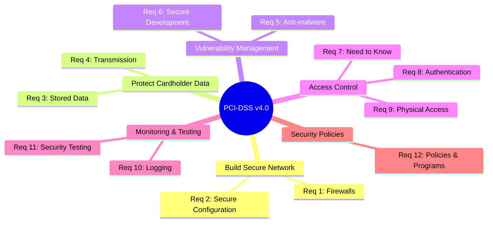
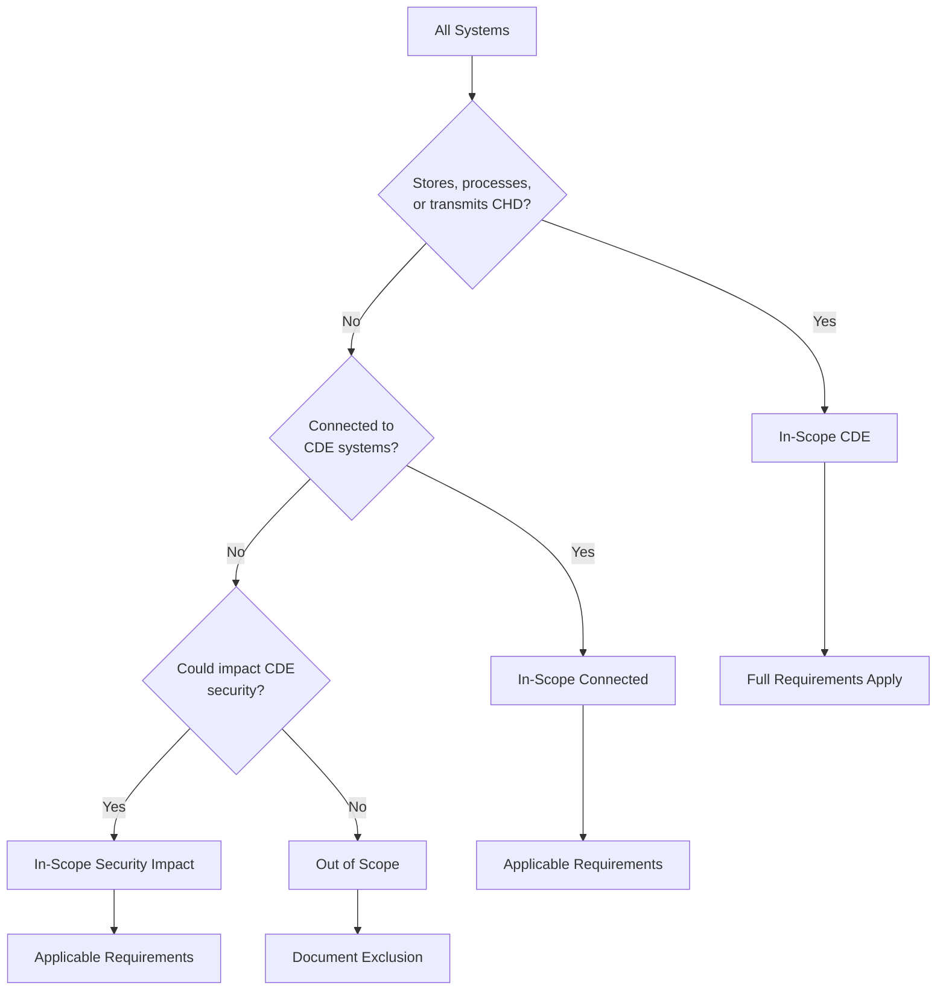
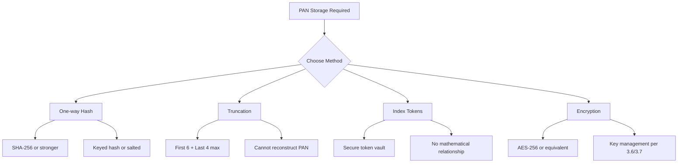
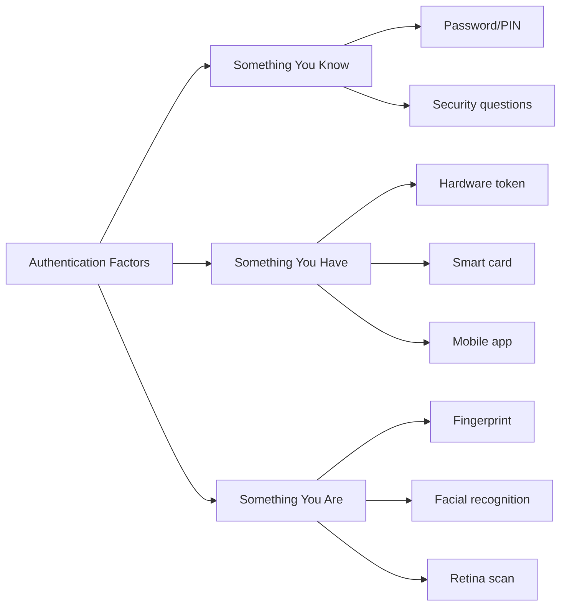
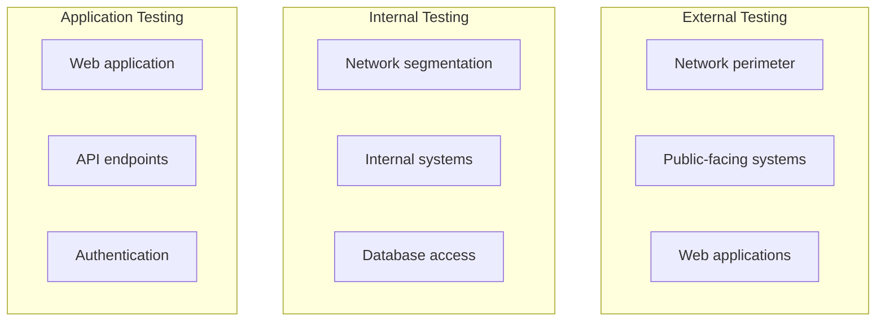

# 💳 PCI-DSS Compliance Checklist

**Author:** Asif Hussain  
**Version:** 1.0.0  
**Last Updated:** December 30, 2025  
**Status:** ✅ Active  
**Category:** Compliance Knowledge Library  
**Standard:** Payment Card Industry Data Security Standard v4.0  

---

## 📋 Executive Summary

This checklist provides comprehensive guidance for achieving and maintaining compliance with the Payment Card Industry Data Security Standard (PCI-DSS). It covers all 12 requirements for protecting cardholder data, including network security, access controls, monitoring, and security policies.

**Applicability:** Any organization that stores, processes, or transmits cardholder data (CHD) or sensitive authentication data (SAD).

**Validation Levels:**
| Level | Criteria | Validation Requirements |
|-------|----------|------------------------|
| 1 | >6M transactions/year | Annual ROC by QSA, quarterly ASV scan |
| 2 | 1-6M transactions/year | Annual SAQ, quarterly ASV scan |
| 3 | 20K-1M e-commerce transactions/year | Annual SAQ, quarterly ASV scan |
| 4 | <20K e-commerce or <1M other transactions/year | Annual SAQ, quarterly ASV scan recommended |

**Penalties:** Fines from $5,000 to $100,000 per month, increased transaction fees, card brand restrictions, or prohibition from accepting cards.

**Related Documents:**
- `gdpr-compliance-checklist.md` - EU data protection
- `api-security-foundations.md` - API security for payment processing
- `database-security-guide.md` - Database encryption and security

---

## 🎯 PCI-DSS Compliance Framework



---

## 📊 PCI-DSS Compliance Status Dashboard

| Requirement | Description | Status | Progress |
|-------------|-------------|--------|----------|
| **Req 1** | Network Security Controls | ⬜ | 0% |
| **Req 2** | Secure Configurations | ⬜ | 0% |
| **Req 3** | Protect Stored Account Data | ⬜ | 0% |
| **Req 4** | Protect Data in Transit | ⬜ | 0% |
| **Req 5** | Anti-Malware Protection | ⬜ | 0% |
| **Req 6** | Secure Systems & Software | ⬜ | 0% |
| **Req 7** | Restrict Access by Need to Know | ⬜ | 0% |
| **Req 8** | Identify Users & Authenticate | ⬜ | 0% |
| **Req 9** | Restrict Physical Access | ⬜ | 0% |
| **Req 10** | Log & Monitor Access | ⬜ | 0% |
| **Req 11** | Test Security Regularly | ⬜ | 0% |
| **Req 12** | Security Policies | ⬜ | 0% |

---

## 🔒 Cardholder Data Environment (CDE)

### Cardholder Data Elements

| Data Element | Storage Permitted | Protection Required | Render Unreadable |
|--------------|------------------|---------------------|-------------------|
| **PAN (Primary Account Number)** | Yes | Yes | Yes |
| Cardholder Name | Yes | Yes | No |
| Service Code | Yes | Yes | No |
| Expiration Date | Yes | Yes | No |
| **Full Track Data** | ❌ No | N/A | N/A |
| **CVV/CVC** | ❌ No | N/A | N/A |
| **PIN/PIN Block** | ❌ No | N/A | N/A |

### CDE Scoping



---

## ✅ Requirement 1: Network Security Controls

### 1.1 Network Security Controls Defined and Understood

- [ ] 1.1.1 Roles and responsibilities for Req 1 documented and assigned
- [ ] 1.1.2 Network security control policies and procedures documented, current, and in use

### 1.2 Network Security Controls Configured and Maintained

- [ ] 1.2.1 Configuration standards defined for network security controls
- [ ] 1.2.2 Changes to network connections reviewed and approved
- [ ] 1.2.3 Accurate network diagram maintained
- [ ] 1.2.4 Accurate data flow diagram maintained
- [ ] 1.2.5 All services, protocols, and ports allowed are identified and approved
- [ ] 1.2.6 Security features documented for insecure services/protocols
- [ ] 1.2.7 Network security controls reviewed at least every 6 months
- [ ] 1.2.8 Configuration files secured from unauthorized access

### 1.3 Network Access to CDE Restricted

- [ ] 1.3.1 Inbound traffic restricted to only necessary traffic
- [ ] 1.3.2 Outbound traffic restricted to only necessary traffic
- [ ] 1.3.3 Network security controls between wireless and CDE

### 1.4 Network Connections Between Trusted/Untrusted Networks

- [ ] 1.4.1 Network security controls between trusted and untrusted networks
- [ ] 1.4.2 Inbound traffic restricted to system components in DMZ
- [ ] 1.4.3 Anti-spoofing measures detect/block forged source IPs
- [ ] 1.4.4 Cardholder data cannot flow directly to/from untrusted network
- [ ] 1.4.5 Internal IP addresses not disclosed to untrusted networks

### 1.5 Risks to CDE from Computing Devices Mitigated

- [ ] 1.5.1 Security controls for computing devices connecting to networks outside CDE

---

## ✅ Requirement 2: Secure Configurations

### 2.1 Processes and Mechanisms Documented

- [ ] 2.1.1 Roles and responsibilities for Req 2 documented and assigned
- [ ] 2.1.2 Secure configuration policies and procedures documented, current, and in use

### 2.2 System Components Configured Securely

- [ ] 2.2.1 Configuration standards developed for all system components
- [ ] 2.2.2 Vendor default accounts managed (changed, disabled, or removed)
- [ ] 2.2.3 Primary functions separated (one function per server) or justified
- [ ] 2.2.4 Only necessary services, protocols, daemons enabled
- [ ] 2.2.5 Insecure services/protocols secured if used
- [ ] 2.2.6 System security parameters configured to prevent misuse
- [ ] 2.2.7 Non-console administrative access encrypted

### 2.3 Wireless Environments Secured

- [ ] 2.3.1 Wireless vendor defaults changed (passwords, encryption keys, SNMP)
- [ ] 2.3.2 Wireless encryption keys changed when personnel with knowledge leave

---

## ✅ Requirement 3: Protect Stored Account Data

### 3.1 Processes and Mechanisms Documented

- [ ] 3.1.1 Roles and responsibilities for Req 3 documented and assigned
- [ ] 3.1.2 Data protection policies and procedures documented, current, and in use

### 3.2 Storage of Account Data Minimized

- [ ] 3.2.1 Data retention and disposal policies implemented
- [ ] 3.2.2 SAD not stored after authorization

### 3.3 SAD Not Stored After Authorization

- [ ] 3.3.1 Full track data not retained after authorization
- [ ] 3.3.2 CVV/CVC not retained after authorization
- [ ] 3.3.3 PIN/PIN block not retained after authorization

### 3.4 Access to Displays of PAN Restricted

- [ ] 3.4.1 PAN masked when displayed (first 6 and last 4 digits maximum)
- [ ] 3.4.2 Technical controls prevent copying PAN when using remote access

### 3.5 PAN Protected Wherever Stored

- [ ] 3.5.1 PAN rendered unreadable using one of:
  - [ ] One-way hashes (SHA-256 minimum)
  - [ ] Truncation (max 1st 6, last 4)
  - [ ] Index tokens and pads
  - [ ] Strong cryptography with associated key management

#### PAN Protection Methods



### 3.6 Cryptographic Keys Protected

- [ ] 3.6.1 Key management procedures documented and implemented
- [ ] 3.6.1.1 Key generation uses strong algorithms
- [ ] 3.6.1.2 Secure key distribution
- [ ] 3.6.1.3 Secure key storage
- [ ] 3.6.1.4 Cryptoperiod defined for each key type

### 3.7 Cryptographic Architecture Documented

- [ ] 3.7.1 Key management policies and procedures documented
- [ ] 3.7.2 Secret/private keys used to encrypt/decrypt stored PAN stored securely
- [ ] 3.7.3 Secret/private keys stored in fewest possible locations

---

## ✅ Requirement 4: Protect Data in Transit

### 4.1 Processes and Mechanisms Documented

- [ ] 4.1.1 Roles and responsibilities for Req 4 documented and assigned
- [ ] 4.1.2 Transmission security policies and procedures documented, current, and in use

### 4.2 PAN Protected During Transmission

- [ ] 4.2.1 Strong cryptography used during PAN transmission over open, public networks
- [ ] 4.2.1.1 Inventory of trusted keys and certificates
- [ ] 4.2.1.2 Only trusted certificates accepted
- [ ] 4.2.2 Wireless transmission of PAN uses strong cryptography

### Secure Transmission Requirements

| Network Type | Encryption Required | Examples |
|--------------|-------------------|----------|
| Public/Open Network | Yes (TLS 1.2+) | Internet, WiFi, cellular |
| Internal Network | Risk-based | Corporate LAN |
| Wireless | Yes (WPA3/WPA2) | WiFi networks |

---

## ✅ Requirement 5: Anti-Malware Protection

### 5.1 Processes and Mechanisms Documented

- [ ] 5.1.1 Roles and responsibilities for Req 5 documented and assigned
- [ ] 5.1.2 Anti-malware policies and procedures documented, current, and in use

### 5.2 Malware Prevented or Detected and Addressed

- [ ] 5.2.1 Anti-malware solution deployed on all systems commonly affected
- [ ] 5.2.2 Anti-malware solution detects all known types of malware
- [ ] 5.2.3 Periodic scans and active/real-time scans performed
- [ ] 5.2.3.1 Frequency of periodic scans defined in risk analysis

### 5.3 Anti-Malware Mechanisms Active and Maintained

- [ ] 5.3.1 Anti-malware solution kept current (automatic updates)
- [ ] 5.3.2 Anti-malware solution performs automatic scans OR periodic scans
- [ ] 5.3.2.1 Periodic scan frequency defined if used
- [ ] 5.3.3 Anti-malware solution generates audit logs
- [ ] 5.3.4 Anti-malware mechanisms actively running (cannot be disabled by users)
- [ ] 5.3.5 Anti-malware mechanisms cannot be altered by users unless documented

### 5.4 Anti-Phishing Mechanisms

- [ ] 5.4.1 Processes and automated mechanisms to detect and protect against phishing

---

## ✅ Requirement 6: Secure Systems and Software

### 6.1 Processes and Mechanisms Documented

- [ ] 6.1.1 Roles and responsibilities for Req 6 documented and assigned
- [ ] 6.1.2 Secure development policies and procedures documented, current, and in use

### 6.2 Bespoke and Custom Software Developed Securely

- [ ] 6.2.1 Bespoke/custom software developed securely
- [ ] 6.2.2 Software development personnel trained on secure coding
- [ ] 6.2.3 Bespoke/custom software reviewed before release
- [ ] 6.2.3.1 Manual code review OR automated code analysis tools
- [ ] 6.2.4 Common software attacks addressed in development

#### Common Software Attacks to Address

| Attack Type | OWASP Reference | Prevention |
|-------------|-----------------|------------|
| Injection (SQL, OS, LDAP) | A03:2021 | Parameterized queries |
| XSS (Reflected, Stored, DOM) | A03:2021 | Output encoding, CSP |
| Broken Authentication | A07:2021 | Secure session management |
| Insecure Direct Object Ref | A01:2021 | Access control checks |
| CSRF | A01:2021 | Anti-CSRF tokens |
| Security Misconfiguration | A05:2021 | Hardening standards |

### 6.3 Security Vulnerabilities Identified and Addressed

- [ ] 6.3.1 Security vulnerabilities identified and managed (CVE tracking)
- [ ] 6.3.2 System components inventory maintained
- [ ] 6.3.3 Critical and high vulnerabilities patched within 30 days

### 6.4 Public-Facing Web Applications Protected

- [ ] 6.4.1 Public-facing web apps protected against attacks (WAF or code review)
- [ ] 6.4.2 Automated technical solution for web apps detects/prevents web-based attacks
- [ ] 6.4.3 Payment page scripts managed (integrity, authorization, inventory)

### 6.5 Changes Managed Securely

- [ ] 6.5.1 Change control procedures established
- [ ] 6.5.2 Significant changes documented and approved
- [ ] 6.5.3 Pre-production and production environments separated
- [ ] 6.5.4 Duties separated between development and production
- [ ] 6.5.5 Live PANs not used in testing (or protected if used)
- [ ] 6.5.6 Test data and accounts removed before production

---

## ✅ Requirement 7: Restrict Access by Business Need

### 7.1 Processes and Mechanisms Documented

- [ ] 7.1.1 Roles and responsibilities for Req 7 documented and assigned
- [ ] 7.1.2 Access control policies and procedures documented, current, and in use

### 7.2 Access to System Components and Data Appropriately Defined

- [ ] 7.2.1 Access control model defined and includes all system components
- [ ] 7.2.2 Access assigned based on job classification and function
- [ ] 7.2.3 Required privileges approved by authorized personnel
- [ ] 7.2.4 Access reviews conducted periodically
- [ ] 7.2.5 Access granted using least privileges
- [ ] 7.2.5.1 All access reviewed at least every 6 months
- [ ] 7.2.6 User access to query repositories restricted

### 7.3 Access to System Components and Data Managed

- [ ] 7.3.1 Access control system implemented
- [ ] 7.3.2 Access control system configured to enforce least privilege
- [ ] 7.3.3 Access control system set to deny all by default

---

## ✅ Requirement 8: Identify Users and Authenticate Access

### 8.1 Processes and Mechanisms Documented

- [ ] 8.1.1 Roles and responsibilities for Req 8 documented and assigned
- [ ] 8.1.2 Authentication policies and procedures documented, current, and in use

### 8.2 User Identification and Accounts Managed

- [ ] 8.2.1 All users assigned unique ID
- [ ] 8.2.2 Group/shared IDs only used when necessary and managed
- [ ] 8.2.3 Additional requirements for service providers
- [ ] 8.2.4 Addition, deletion, modification of user IDs controlled
- [ ] 8.2.5 Access for terminated users immediately revoked
- [ ] 8.2.6 Inactive user accounts removed/disabled within 90 days
- [ ] 8.2.7 Third-party remote access accounts managed
- [ ] 8.2.8 Inactive sessions time out within 15 minutes

### 8.3 Strong Authentication for Users and Administrators

- [ ] 8.3.1 All user access authenticated using at least one factor
- [ ] 8.3.2 Strong cryptography for authentication credentials
- [ ] 8.3.3 User identity verified before authentication factor modification
- [ ] 8.3.4 Invalid authentication attempts limited
- [ ] 8.3.5 Account lockout duration at least 30 minutes OR until admin enables
- [ ] 8.3.6 Passwords meet complexity requirements:
  - [ ] Minimum 12 characters (or 8 if system doesn't support 12)
  - [ ] Contain numeric and alphabetic characters
- [ ] 8.3.7 Passwords changed at least every 90 days OR dynamic analysis used
- [ ] 8.3.8 Password history of at least last 4 passwords
- [ ] 8.3.9 Password policy communicated and enforced
- [ ] 8.3.10 MFA for non-console administrative access
- [ ] 8.3.10.1 MFA for all access into CDE
- [ ] 8.3.11 Physical/logical tokens cannot be used for logical/physical access

### 8.4 Multi-Factor Authentication (MFA)

- [ ] 8.4.1 MFA implemented for all non-console access to CDE
- [ ] 8.4.2 MFA implemented for all remote network access
- [ ] 8.4.3 MFA implemented for all remote access by third parties

#### MFA Requirements



### 8.5 MFA Systems Configured Properly

- [ ] 8.5.1 MFA systems configured to prevent replay attacks

### 8.6 Application and System Accounts Managed

- [ ] 8.6.1 Interactive logins for application/system accounts managed
- [ ] 8.6.2 Passwords for application/system accounts protected
- [ ] 8.6.3 Passwords for application/system accounts changed periodically

---

## ✅ Requirement 9: Restrict Physical Access

### 9.1 Processes and Mechanisms Documented

- [ ] 9.1.1 Roles and responsibilities for Req 9 documented and assigned
- [ ] 9.1.2 Physical security policies and procedures documented, current, and in use

### 9.2 Physical Access Controls for CDE

- [ ] 9.2.1 Appropriate facility entry controls
- [ ] 9.2.1.1 Individual physical access to sensitive areas monitored
- [ ] 9.2.2 Procedures to distinguish onsite personnel from visitors
- [ ] 9.2.3 Visitor access procedures implemented
- [ ] 9.2.4 Visitor log maintained

### 9.3 Physical Access for Personnel and Visitors Authorized

- [ ] 9.3.1 Procedures for authorizing and managing physical access
- [ ] 9.3.1.1 Physical access to sensitive areas restricted
- [ ] 9.3.2 Access revocation procedures for terminated personnel
- [ ] 9.3.3 Physical access devices secured (keys, badges)
- [ ] 9.3.4 Access reviewed at least every 12 months

### 9.4 Media Physically Secured

- [ ] 9.4.1 All media with cardholder data physically secured
- [ ] 9.4.2 Media classified (public, confidential, etc.)
- [ ] 9.4.3 Media sent outside facility secured and tracked
- [ ] 9.4.4 Management approval for media sent outside facility
- [ ] 9.4.5 Inventory logs of media maintained
- [ ] 9.4.5.1 Media inventories conducted at least annually
- [ ] 9.4.6 Hard-copy materials cross-cut shredded when no longer needed
- [ ] 9.4.7 Electronic media rendered unrecoverable when no longer needed

### 9.5 POI Devices Protected

- [ ] 9.5.1 POI devices (card readers, terminals) protected from tampering
- [ ] 9.5.1.1 POI device inventory maintained
- [ ] 9.5.1.2 POI device surfaces inspected periodically
- [ ] 9.5.1.3 Training for personnel on POI tampering detection

---

## ✅ Requirement 10: Log and Monitor Access

### 10.1 Processes and Mechanisms Documented

- [ ] 10.1.1 Roles and responsibilities for Req 10 documented and assigned
- [ ] 10.1.2 Logging policies and procedures documented, current, and in use

### 10.2 Audit Logs Implemented

- [ ] 10.2.1 Audit logs enabled on all system components
- [ ] 10.2.1.1 Individual user access to CHD logged
- [ ] 10.2.1.2 Actions by privileged users logged
- [ ] 10.2.1.3 Access to audit logs logged
- [ ] 10.2.1.4 Invalid logical access attempts logged
- [ ] 10.2.1.5 Changes to authentication credentials logged
- [ ] 10.2.1.6 Initialization/stopping of audit logs logged
- [ ] 10.2.1.7 Creation/deletion of system-level objects logged
- [ ] 10.2.2 Audit log details captured

#### Required Log Details

| Field | Description | Required |
|-------|-------------|----------|
| User identification | Who performed action | ✅ |
| Type of event | What happened | ✅ |
| Date and time | When it occurred | ✅ |
| Success or failure | Outcome | ✅ |
| Origination of event | Where it originated | ✅ |
| Identity/name of affected data/component | What was affected | ✅ |

### 10.3 Audit Logs Protected

- [ ] 10.3.1 Read access to audit logs limited to those with job need
- [ ] 10.3.2 Audit log files protected from unauthorized modifications
- [ ] 10.3.3 Audit log files backed up to central server or media
- [ ] 10.3.4 File integrity monitoring on audit logs

### 10.4 Audit Logs Reviewed

- [ ] 10.4.1 Audit log reviews performed daily
- [ ] 10.4.1.1 Automated mechanisms to perform reviews
- [ ] 10.4.2 All other system component logs reviewed periodically
- [ ] 10.4.2.1 Periodic log review frequency defined
- [ ] 10.4.3 Anomalies identified during review addressed

### 10.5 Audit Log History Retained

- [ ] 10.5.1 Audit log history retained for at least 12 months

### 10.6 Time Synchronization

- [ ] 10.6.1 Time-synchronization technology deployed
- [ ] 10.6.2 Systems synchronized to correct and consistent time
- [ ] 10.6.3 Time synchronization settings and data protected

### 10.7 Failures of Critical Security Control Systems Detected

- [ ] 10.7.1 Failures of critical security controls detected and alerted
- [ ] 10.7.2 Failures responded to promptly
- [ ] 10.7.3 Failures documented and addressed

---

## ✅ Requirement 11: Test Security Regularly

### 11.1 Processes and Mechanisms Documented

- [ ] 11.1.1 Roles and responsibilities for Req 11 documented and assigned
- [ ] 11.1.2 Security testing policies and procedures documented, current, and in use

### 11.2 Wireless Access Points Identified and Monitored

- [ ] 11.2.1 Authorized and unauthorized wireless access points identified quarterly
- [ ] 11.2.2 Inventory of authorized wireless access points maintained

### 11.3 External and Internal Vulnerabilities Identified

- [ ] 11.3.1 Internal vulnerability scans performed quarterly
- [ ] 11.3.1.1 High-risk and critical vulnerabilities resolved
- [ ] 11.3.1.2 Rescans performed until resolved
- [ ] 11.3.1.3 Scanning tool kept up to date
- [ ] 11.3.2 External vulnerability scans performed quarterly by ASV
- [ ] 11.3.2.1 Rescans performed until passing

### 11.4 Penetration Testing Performed

- [ ] 11.4.1 Penetration testing methodology defined
- [ ] 11.4.2 Internal penetration testing performed annually
- [ ] 11.4.3 External penetration testing performed annually
- [ ] 11.4.4 Exploitable vulnerabilities corrected and retested
- [ ] 11.4.5 Network segmentation controls tested annually
- [ ] 11.4.6 Service provider testing methodology documented
- [ ] 11.4.7 Multi-tenant service providers support customer testing

#### Penetration Testing Scope



### 11.5 Network Intrusions and File Changes Detected

- [ ] 11.5.1 Intrusion-detection/prevention techniques implemented
- [ ] 11.5.1.1 Alert personnel of suspected compromises
- [ ] 11.5.2 Change-detection mechanism deployed
- [ ] 11.5.2.1 File comparison performed weekly or upon change

### 11.6 Unauthorized Changes on Payment Pages Detected

- [ ] 11.6.1 Change and tamper-detection mechanism deployed for payment pages

---

## ✅ Requirement 12: Support Security with Policies and Programs

### 12.1 Information Security Policy Established

- [ ] 12.1.1 Information security policy established and disseminated
- [ ] 12.1.2 Information security policy reviewed annually
- [ ] 12.1.3 Security roles and responsibilities defined
- [ ] 12.1.4 Responsibility for information security formally assigned

### 12.2 Acceptable Use Policies

- [ ] 12.2.1 Acceptable use policies documented and implemented

### 12.3 Risks to CDE Identified and Managed

- [ ] 12.3.1 Risk assessment performed annually
- [ ] 12.3.2 Targeted risk analyses performed for flexible requirements
- [ ] 12.3.3 Cryptographic cipher suites reviewed annually
- [ ] 12.3.4 Hardware/software technologies reviewed annually

### 12.4 PCI DSS Compliance Managed

- [ ] 12.4.1 Executive management responsibility established
- [ ] 12.4.2 Reviews performed at least quarterly

### 12.5 PCI DSS Scope Documented

- [ ] 12.5.1 Inventory of system components in scope
- [ ] 12.5.2 Scope documented and validated
- [ ] 12.5.2.1 Scope documented at least annually
- [ ] 12.5.3 Significant organizational changes reviewed for scope impact

### 12.6 Security Awareness Training

- [ ] 12.6.1 Formal security awareness program implemented
- [ ] 12.6.2 Security awareness program reviewed annually
- [ ] 12.6.3 Personnel receive training upon hire and annually
- [ ] 12.6.3.1 Training includes awareness of threats
- [ ] 12.6.3.2 Personnel acknowledge security policy

### 12.7 Personnel Screened

- [ ] 12.7.1 Personnel with CDE access screened before hire

### 12.8 Third-Party Service Providers Managed

- [ ] 12.8.1 List of all TPSPs maintained
- [ ] 12.8.2 Written agreements with TPSPs maintained
- [ ] 12.8.3 TPSPs engaged with documented due diligence
- [ ] 12.8.4 TPSPs monitored annually
- [ ] 12.8.5 Information maintained about TPSP PCI DSS requirements

### 12.9 Service Providers Support Customer Compliance

- [ ] 12.9.1 Service providers provide written acknowledgment of responsibilities
- [ ] 12.9.2 Service providers support customer compliance requests

### 12.10 Incident Response

- [ ] 12.10.1 Incident response plan implemented
- [ ] 12.10.2 Incident response plan reviewed annually
- [ ] 12.10.3 Specific personnel designated for 24/7 incident response
- [ ] 12.10.4 Staff trained on incident response responsibilities
- [ ] 12.10.4.1 Incident response training frequency defined
- [ ] 12.10.5 Alerts from security monitoring systems included in response
- [ ] 12.10.6 Incident response plan modified based on lessons learned
- [ ] 12.10.7 Incident response procedures documented for service providers

---

## 📝 Implementation Templates

### Self-Assessment Questionnaire (SAQ) Selection Guide

| SAQ Type | Applicable To | Requirements |
|----------|--------------|--------------|
| **SAQ A** | E-commerce, all cardholder data functions outsourced | Minimal |
| **SAQ A-EP** | E-commerce, website partially outsourced | More extensive |
| **SAQ B** | Imprint machines or standalone dial-out terminals | Limited |
| **SAQ B-IP** | Standalone IP-connected terminals | Limited |
| **SAQ C** | Payment app systems connected to Internet | Moderate |
| **SAQ C-VT** | Web-based virtual terminals | Moderate |
| **SAQ D** | All other merchants | Full |
| **SAQ D-SP** | Service providers | Full |

### Compliance Documentation Checklist

```markdown
## PCI DSS Documentation Checklist

**Organization:** [Name]  
**Assessment Period:** [Dates]  
**SAQ Type:** [Type]  

### Required Documentation
- [ ] Network diagram
- [ ] Data flow diagram
- [ ] System component inventory
- [ ] Cardholder data flow documentation
- [ ] Security policies and procedures
- [ ] Risk assessment documentation
- [ ] Incident response plan
- [ ] ASV scan reports (quarterly)
- [ ] Penetration test reports (annual)
- [ ] Training records
- [ ] Third-party agreements (BAAs, contracts)

### Optional Documentation
- [ ] Vulnerability scan reports (internal)
- [ ] Change control records
- [ ] Access review records
- [ ] Audit log samples
```

---

## 📚 References

### Official Resources
- [PCI SSC Document Library](https://www.pcisecuritystandards.org/document_library)
- [PCI DSS v4.0 Quick Reference Guide](https://www.pcisecuritystandards.org/pdfs/PCI_DSS-QRG-v4_0.pdf)
- [PCI DSS Prioritized Approach](https://www.pcisecuritystandards.org/documents/Prioritized-Approach-for-PCI-DSS-v4-0.pdf)
- [ASV Program Guide](https://www.pcisecuritystandards.org/assessors_and_solutions/approved_scanning_vendors)

### CORTEX Related Documents
- `gdpr-compliance-checklist.md` - EU data protection
- `hipaa-compliance-checklist.md` - Healthcare data
- `soc2-compliance-checklist.md` - Service organization controls
- `api-security-foundations.md` - API security for payments

---

**Document Classification:** Compliance Reference  
**Review Cycle:** Annually and upon PCI DSS version updates  
**Related Plans:** Security Enhancement Plan (Phase 1)
