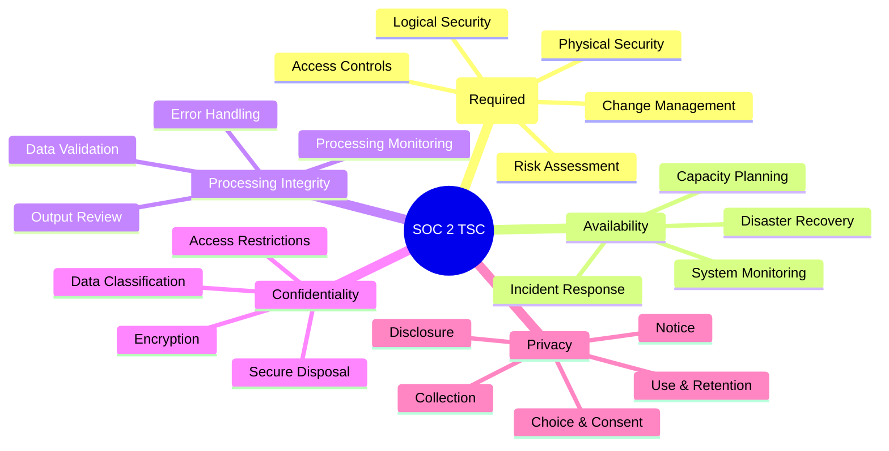

# 🔐 SOC 2 Compliance Checklist

**Author:** Asif Hussain  
**Version:** 1.0.0  
**Last Updated:** December 30, 2025  
**Status:** ✅ Active  
**Category:** Compliance Knowledge Library  
**Framework:** AICPA SOC 2 Type I & Type II  

---

## 📋 Executive Summary

This checklist provides comprehensive guidance for achieving and maintaining SOC 2 compliance. SOC 2 (Service Organization Control 2) is an auditing framework developed by the American Institute of CPAs (AICPA) for service organizations to demonstrate security controls for customer data.

**Applicability:** SaaS providers, cloud service providers, data centers, managed IT services, and any organization storing or processing customer data.

**Report Types:**
| Type | Focus | Duration | Best For |
|------|-------|----------|----------|
| **Type I** | Design of controls at a point in time | Single date snapshot | Initial compliance, quick assessment |
| **Type II** | Operating effectiveness over time | 6-12 month period | Ongoing compliance, enterprise customers |

**Related Documents:**
- `gdpr-compliance-checklist.md` - EU data protection
- `hipaa-compliance-checklist.md` - Healthcare data protection
- `pci-dss-compliance-checklist.md` - Payment card security

---

## 🎯 SOC 2 Trust Services Criteria

SOC 2 is built on five Trust Services Criteria (TSC). Security is mandatory; others are selected based on business needs.

---

## 🔴 CC1: Security - Control Environment

### CC1.1 COSO Principle 1: Integrity and Ethical Values

**Requirement:** The entity demonstrates commitment to integrity and ethical values.

| Control | Implementation | Evidence |
|---------|---------------|----------|
| ☐ Code of Conduct | Document defining expected behavior | Signed acknowledgments |
| ☐ Ethics Training | Annual ethics and security training | Training records |
| ☐ Whistleblower Policy | Mechanism for reporting violations | Policy document, hotline records |
| ☐ Background Checks | Pre-employment screening process | Screening policies, records |
| ☐ Disciplinary Actions | Documented consequences for violations | HR policies, action records |

### CC1.2 COSO Principle 2: Board Oversight

**Requirement:** The board of directors demonstrates independence and exercises oversight.

| Control | Implementation | Evidence |
|---------|---------------|----------|
| ☐ Security Committee | Board or committee oversight of security | Meeting minutes |
| ☐ Regular Reporting | Security metrics reported to leadership | Dashboard reports |
| ☐ Risk Oversight | Board review of security risks | Risk reports, approvals |
| ☐ Independent Review | External audit or assessment | Audit reports |

### CC1.3 COSO Principle 3: Management Responsibility

**Requirement:** Management establishes structures, reporting lines, and responsibilities.

| Control | Implementation | Evidence |
|---------|---------------|----------|
| ☐ Organizational Chart | Defined security roles and responsibilities | Org chart, job descriptions |
| ☐ CISO/Security Leader | Designated security executive | Appointment records |
| ☐ Security Team | Dedicated security personnel | Team roster |
| ☐ Reporting Structure | Clear escalation paths | Process documentation |

### CC1.4 COSO Principle 4: Competence Commitment

**Requirement:** The entity demonstrates commitment to attract, develop, and retain competent individuals.

| Control | Implementation | Evidence |
|---------|---------------|----------|
| ☐ Security Qualifications | Required skills for security roles | Job postings, certifications |
| ☐ Training Programs | Ongoing security education | Training plans, records |
| ☐ Performance Evaluation | Security responsibilities in reviews | Review templates |
| ☐ Succession Planning | Plans for key security positions | Succession documentation |

### CC1.5 COSO Principle 5: Accountability

**Requirement:** The entity holds individuals accountable for their internal control responsibilities.

| Control | Implementation | Evidence |
|---------|---------------|----------|
| ☐ Performance Metrics | Security KPIs for individuals | Metrics dashboards |
| ☐ Accountability Documentation | Clear ownership assignments | RACI matrices |
| ☐ Consequence Management | Process for addressing failures | HR policies |

---

## 🟠 CC2: Communication and Information

### CC2.1 Information Quality

**Requirement:** The entity obtains or generates relevant, quality information.

| Control | Implementation | Evidence |
|---------|---------------|----------|
| ☐ Information Sources | Identified sources for security intelligence | Source inventory |
| ☐ Data Quality Controls | Validation of security data accuracy | QA procedures |
| ☐ Timely Processing | Current security information maintained | Update schedules |

### CC2.2 Internal Communication

**Requirement:** The entity internally communicates information necessary for internal control.

| Control | Implementation | Evidence |
|---------|---------------|----------|
| ☐ Security Policies | Documented and distributed policies | Policy portal, acknowledgments |
| ☐ Security Awareness | Regular security communications | Newsletters, alerts |
| ☐ Incident Communication | Process for reporting security events | Reporting procedures |
| ☐ Policy Updates | Process for communicating changes | Change notifications |

### CC2.3 External Communication

**Requirement:** The entity communicates with external parties regarding internal control matters.

| Control | Implementation | Evidence |
|---------|---------------|----------|
| ☐ Customer Commitments | SLAs and security commitments documented | Contracts, SLAs |
| ☐ Vendor Requirements | Security requirements for third parties | Vendor agreements |
| ☐ Regulatory Communication | Process for regulatory reporting | Compliance records |
| ☐ Breach Notification | Customer notification procedures | Notification templates |

---

## 🟡 CC3: Risk Assessment

### CC3.1 Risk Objectives

**Requirement:** The entity specifies objectives with sufficient clarity.

| Control | Implementation | Evidence |
|---------|---------------|----------|
| ☐ Security Objectives | Documented security goals | Security strategy |
| ☐ Risk Tolerance | Defined acceptable risk levels | Risk appetite statement |
| ☐ Compliance Objectives | Identified regulatory requirements | Compliance matrix |

### CC3.2 Risk Identification

**Requirement:** The entity identifies and analyzes risks to achievement of objectives.

| Control | Implementation | Evidence |
|---------|---------------|----------|
| ☐ Risk Assessment Process | Formal risk identification methodology | Risk assessment procedure |
| ☐ Annual Risk Assessment | Yearly comprehensive assessment | Assessment reports |
| ☐ Threat Intelligence | External threat monitoring | Threat reports |
| ☐ Vulnerability Management | Regular vulnerability scanning | Scan reports |
| ☐ Risk Register | Documented and maintained risk inventory | Risk register |

### CC3.3 Fraud Consideration

**Requirement:** The entity considers potential for fraud in assessing risks.

| Control | Implementation | Evidence |
|---------|---------------|----------|
| ☐ Fraud Risk Assessment | Evaluate fraud-related risks | Fraud risk analysis |
| ☐ Segregation of Duties | Controls to prevent unauthorized access | Access matrices |
| ☐ Fraud Detection | Monitoring for fraudulent activity | Detection logs |

### CC3.4 Change Assessment

**Requirement:** The entity identifies and assesses changes that could impact internal control.

| Control | Implementation | Evidence |
|---------|---------------|----------|
| ☐ Change Management Process | Formal change control procedure | Change procedures |
| ☐ Risk Impact Assessment | Security review of changes | Change assessments |
| ☐ Environmental Monitoring | Track changes in threat landscape | Monitoring reports |

---

## 🟢 CC4: Monitoring Activities

### CC4.1 Ongoing Monitoring

**Requirement:** The entity selects, develops, and performs ongoing evaluations.

| Control | Implementation | Evidence |
|---------|---------------|----------|
| ☐ Continuous Monitoring | Real-time security monitoring | SIEM dashboards |
| ☐ Security Metrics | KPIs and metrics tracking | Metrics reports |
| ☐ Control Testing | Regular testing of security controls | Test results |
| ☐ Log Review | Regular review of security logs | Review records |

### CC4.2 Deficiency Evaluation

**Requirement:** The entity evaluates and communicates internal control deficiencies.

| Control | Implementation | Evidence |
|---------|---------------|----------|
| ☐ Deficiency Identification | Process for identifying control gaps | Gap analysis |
| ☐ Severity Classification | Categorize deficiency severity | Classification criteria |
| ☐ Remediation Tracking | Track remediation of deficiencies | Remediation tracker |
| ☐ Management Reporting | Report deficiencies to leadership | Status reports |

---

## 🔵 CC5: Control Activities

### CC5.1 Control Selection and Development

**Requirement:** The entity selects and develops control activities.

| Control | Implementation | Evidence |
|---------|---------------|----------|
| ☐ Control Framework | Documented control framework | Control catalog |
| ☐ Technology Controls | Automated security controls | System configurations |
| ☐ Policy Controls | Administrative security controls | Policies and procedures |
| ☐ Control Mapping | Controls mapped to requirements | Control matrix |

### CC5.2 Technology General Controls

**Requirement:** The entity deploys control activities through policies and technology.

| Control | Implementation | Evidence |
|---------|---------------|----------|
| ☐ Access Management | Logical access control system | IAM configuration |
| ☐ Change Management | Technology change control process | Change tickets |
| ☐ Operations Security | System operation procedures | Runbooks |
| ☐ IT Infrastructure Security | Secure infrastructure configurations | Hardening standards |

### CC5.3 Policy Deployment

**Requirement:** The entity deploys policies that establish what is expected.

| Control | Implementation | Evidence |
|---------|---------------|----------|
| ☐ Security Policy | Comprehensive security policy | Policy document |
| ☐ Acceptable Use Policy | Employee technology usage rules | AUP document |
| ☐ Data Classification Policy | Data handling requirements | Classification policy |
| ☐ Incident Response Policy | Security incident procedures | IR policy |

---

## 🔷 CC6: Logical and Physical Access Controls

### CC6.1 Logical Access Security

**Requirement:** The entity implements logical access security over protected information and assets.

| Control | Implementation | Evidence |
|---------|---------------|----------|
| ☐ Access Control Policy | Documented access control requirements | Policy document |
| ☐ Identity Management | Centralized identity management | IAM system |
| ☐ Authentication | Strong authentication mechanisms | MFA configuration |
| ☐ Authorization | Role-based access control | RBAC configuration |
| ☐ Password Policy | Strong password requirements | Policy, system settings |

### CC6.2 Access Provisioning

**Requirement:** The entity authorizes, establishes, and modifies access to protected assets.

| Control | Implementation | Evidence |
|---------|---------------|----------|
| ☐ Access Request Process | Formal access request workflow | Request forms, tickets |
| ☐ Approval Workflow | Manager/owner approval required | Approval records |
| ☐ Onboarding Process | New user access provisioning | Onboarding checklist |
| ☐ Role-Based Access | Access based on job function | Role definitions |

### CC6.3 Access Removal

**Requirement:** The entity removes access to protected assets when no longer needed.

| Control | Implementation | Evidence |
|---------|---------------|----------|
| ☐ Offboarding Process | Termination access removal | Offboarding checklist |
| ☐ Timely Revocation | Access removed within defined timeframe | Termination tickets |
| ☐ Access Reviews | Periodic access recertification | Review records |
| ☐ Orphaned Account Detection | Process to identify unused accounts | Account reports |

### CC6.4 Access Review

**Requirement:** The entity reviews access rights to protected assets.

| Control | Implementation | Evidence |
|---------|---------------|----------|
| ☐ Quarterly Access Reviews | Regular access recertification | Review records |
| ☐ Privileged Access Review | Enhanced review of admin access | PAM reports |
| ☐ Vendor Access Review | Review third-party access | Vendor access reports |
| ☐ Service Account Review | Review non-human accounts | Service account inventory |

### CC6.5 Physical Access Security

**Requirement:** The entity restricts physical access to facilities and protected assets.

| Control | Implementation | Evidence |
|---------|---------------|----------|
| ☐ Physical Security Policy | Facility access requirements | Policy document |
| ☐ Badge Access System | Electronic access control | Access logs |
| ☐ Visitor Management | Guest registration and escort | Visitor logs |
| ☐ Data Center Security | Enhanced DC access controls | DC access records |
| ☐ Surveillance | Video monitoring of facilities | CCTV footage retention |

### CC6.6 Transmission Protection

**Requirement:** The entity protects information during transmission.

| Control | Implementation | Evidence |
|---------|---------------|----------|
| ☐ Encryption in Transit | TLS/HTTPS for all transmissions | Certificate inventory |
| ☐ VPN Requirements | Secure remote access | VPN configuration |
| ☐ Email Security | Email encryption for sensitive data | Email gateway settings |
| ☐ API Security | Secure API communications | API security config |

### CC6.7 Data Disposal

**Requirement:** The entity disposes of protected information to prevent recovery.

| Control | Implementation | Evidence |
|---------|---------------|----------|
| ☐ Data Retention Policy | Defined retention periods | Policy document |
| ☐ Secure Deletion | Data sanitization procedures | Deletion procedures |
| ☐ Media Destruction | Physical media destruction | Destruction certificates |
| ☐ Cloud Data Deletion | Cloud resource cleanup | Deletion logs |

---

## 🔶 CC7: System Operations

### CC7.1 Vulnerability Management

**Requirement:** The entity detects and responds to vulnerabilities.

| Control | Implementation | Evidence |
|---------|---------------|----------|
| ☐ Vulnerability Scanning | Regular automated scanning | Scan reports |
| ☐ Penetration Testing | Annual penetration tests | Pentest reports |
| ☐ Patch Management | Timely patching process | Patch records |
| ☐ Vulnerability Remediation | Track and fix vulnerabilities | Remediation reports |

### CC7.2 Anomaly Detection

**Requirement:** The entity monitors system components for anomalies.

| Control | Implementation | Evidence |
|---------|---------------|----------|
| ☐ Security Monitoring | Real-time security monitoring | SIEM dashboards |
| ☐ Alerting | Automated security alerts | Alert configuration |
| ☐ Log Aggregation | Centralized log collection | Log infrastructure |
| ☐ Threat Detection | Behavioral analysis | Detection rules |

### CC7.3 Security Event Analysis

**Requirement:** The entity evaluates security events to determine if they are incidents.

| Control | Implementation | Evidence |
|---------|---------------|----------|
| ☐ Event Classification | Security event categorization | Classification criteria |
| ☐ Investigation Process | Security event investigation | Investigation procedures |
| ☐ Escalation Procedures | Defined escalation paths | Escalation matrix |
| ☐ Incident Declaration | Criteria for declaring incidents | Incident criteria |

### CC7.4 Incident Response

**Requirement:** The entity responds to identified security incidents.

| Control | Implementation | Evidence |
|---------|---------------|----------|
| ☐ Incident Response Plan | Documented IR procedures | IR plan document |
| ☐ IR Team | Designated response team | Team roster |
| ☐ Containment Procedures | Process to contain incidents | Containment playbooks |
| ☐ Communication Plan | Internal/external communication | Communication templates |

### CC7.5 Incident Recovery

**Requirement:** The entity recovers from identified security incidents.

| Control | Implementation | Evidence |
|---------|---------------|----------|
| ☐ Recovery Procedures | Documented recovery processes | Recovery playbooks |
| ☐ Root Cause Analysis | Post-incident investigation | RCA reports |
| ☐ Lessons Learned | Process improvement from incidents | Lessons learned docs |
| ☐ Incident Documentation | Complete incident records | Incident tickets |

---

## 🔸 CC8: Change Management

### CC8.1 Change Authorization

**Requirement:** The entity authorizes, designs, develops, configures, documents, tests, approves, and implements changes.

| Control | Implementation | Evidence |
|---------|---------------|----------|
| ☐ Change Management Policy | Documented change requirements | Policy document |
| ☐ Change Request Process | Formal change request workflow | Change tickets |
| ☐ Impact Assessment | Security impact evaluation | Assessment records |
| ☐ Testing Requirements | Pre-production testing | Test results |
| ☐ Approval Workflow | Required change approvals | Approval records |
| ☐ Documentation | Change documentation requirements | Change records |
| ☐ Rollback Procedures | Ability to reverse changes | Rollback plans |

---

## 🔹 CC9: Risk Mitigation

### CC9.1 Risk Mitigation Selection

**Requirement:** The entity identifies, selects, and develops risk mitigation activities.

| Control | Implementation | Evidence |
|---------|---------------|----------|
| ☐ Mitigation Strategies | Documented risk treatments | Risk treatment plans |
| ☐ Control Implementation | Deploy selected controls | Control evidence |
| ☐ Residual Risk Acceptance | Formal acceptance of remaining risk | Risk acceptance forms |

### CC9.2 Vendor Risk Management

**Requirement:** The entity assesses and manages risks associated with vendors and business partners.

| Control | Implementation | Evidence |
|---------|---------------|----------|
| ☐ Vendor Assessment | Security assessment of vendors | Assessment questionnaires |
| ☐ Vendor Contracts | Security requirements in contracts | Contract clauses |
| ☐ Vendor Monitoring | Ongoing vendor security monitoring | Monitoring reports |
| ☐ Subcontractor Requirements | Requirements for subprocessors | Contract provisions |

---

## 🟣 Availability Criteria (Optional)

### A1.1 System Performance Monitoring

**Requirement:** The entity maintains, monitors, and evaluates current processing capacity.

| Control | Implementation | Evidence |
|---------|---------------|----------|
| ☐ Capacity Planning | Resource capacity monitoring | Capacity reports |
| ☐ Performance Monitoring | System performance tracking | Performance dashboards |
| ☐ Availability Metrics | Uptime tracking and reporting | Availability reports |
| ☐ Scalability Planning | Plans for capacity increases | Scalability documentation |

### A1.2 Disaster Recovery

**Requirement:** The entity authorizes, designs, develops, implements, operates, maintains, and monitors environmental protections and recovery mechanisms.

| Control | Implementation | Evidence |
|---------|---------------|----------|
| ☐ DR Plan | Documented disaster recovery plan | DR plan document |
| ☐ Backup Procedures | Data backup processes | Backup configurations |
| ☐ Recovery Testing | Regular DR testing | Test results |
| ☐ RTO/RPO Definitions | Defined recovery objectives | SLA documentation |
| ☐ Geographic Redundancy | Multi-region infrastructure | Architecture diagrams |

### A1.3 Recovery Testing

**Requirement:** The entity tests recovery plan procedures.

| Control | Implementation | Evidence |
|---------|---------------|----------|
| ☐ Annual DR Tests | Yearly recovery exercises | Test reports |
| ☐ Backup Restoration Tests | Regular restore testing | Restore logs |
| ☐ Failover Testing | Test redundancy mechanisms | Failover records |
| ☐ Test Documentation | Document test results and improvements | Test documentation |

---

## 🟤 Processing Integrity Criteria (Optional)

### PI1.1 Data Completeness and Accuracy

**Requirement:** The entity maintains data processing integrity through validation and quality controls.

| Control | Implementation | Evidence |
|---------|---------------|----------|
| ☐ Input Validation | Data validation controls | Validation rules |
| ☐ Processing Validation | Integrity checks during processing | Processing logs |
| ☐ Output Verification | Output accuracy verification | Verification records |
| ☐ Error Handling | Exception handling procedures | Error logs |

### PI1.2 Processing Accuracy

**Requirement:** The entity implements accurate and timely processing.

| Control | Implementation | Evidence |
|---------|---------------|----------|
| ☐ Processing Procedures | Documented processing steps | Process documentation |
| ☐ Reconciliation | Data reconciliation processes | Reconciliation reports |
| ☐ Quality Controls | Processing quality checks | QA records |

---

## ⚫ Confidentiality Criteria (Optional)

### C1.1 Confidential Information Identification

**Requirement:** The entity identifies and maintains confidential information.

| Control | Implementation | Evidence |
|---------|---------------|----------|
| ☐ Data Classification | Classification scheme for data | Classification policy |
| ☐ Data Inventory | Inventory of confidential data | Data inventory |
| ☐ Labeling | Confidential data marking | Labeling procedures |

### C1.2 Confidential Information Protection

**Requirement:** The entity protects confidential information from unauthorized access.

| Control | Implementation | Evidence |
|---------|---------------|----------|
| ☐ Access Controls | Restricted access to confidential data | Access configurations |
| ☐ Encryption | Encryption of confidential data | Encryption inventory |
| ☐ DLP Controls | Data loss prevention | DLP configuration |
| ☐ Secure Transfer | Protected data transmission | Transfer logs |

### C1.3 Confidential Information Disposal

**Requirement:** The entity disposes of confidential information.

| Control | Implementation | Evidence |
|---------|---------------|----------|
| ☐ Retention Schedule | Defined retention periods | Retention policy |
| ☐ Secure Disposal | Data destruction procedures | Disposal records |
| ☐ Disposal Verification | Confirmation of destruction | Certificates |

---

## ⚪ Privacy Criteria (Optional)

### P1-P8 Privacy Management

**Requirement:** The entity maintains privacy practices for personal information.

| Control | Implementation | Evidence |
|---------|---------------|----------|
| ☐ Privacy Notice | Published privacy notice | Notice document |
| ☐ Consent Management | Consent collection and tracking | Consent records |
| ☐ Data Collection Limits | Minimum necessary collection | Collection procedures |
| ☐ Use Limitations | Purpose-limited use of PI | Use policies |
| ☐ Data Subject Rights | Process for privacy requests | Request procedures |
| ☐ Disclosure Management | Third-party data sharing controls | Sharing agreements |
| ☐ Data Quality | PI accuracy maintenance | Quality procedures |
| ☐ Retention Management | PI retention and disposal | Retention schedules |

---

## 📊 SOC 2 Audit Preparation Checklist

### Pre-Audit Preparation (3-6 months before)

| Week | Activity | Owner | Status |
|------|----------|-------|--------|
| 1-4 | ☐ Select audit firm and agree on scope | Security Lead | ⏸️ |
| 1-4 | ☐ Determine TSC criteria (Security + optional) | Security Lead | ⏸️ |
| 1-4 | ☐ Define audit period (Type II: 6-12 months) | Security Lead | ⏸️ |
| 5-8 | ☐ Conduct internal readiness assessment | Security Team | ⏸️ |
| 5-8 | ☐ Identify and remediate control gaps | Security Team | ⏸️ |
| 9-12 | ☐ Prepare evidence repository | Security Team | ⏸️ |
| 9-12 | ☐ Train staff on audit process | Security Lead | ⏸️ |
| 13-16 | ☐ Conduct mock audit walkthrough | Security Team | ⏸️ |
| 13-16 | ☐ Address identified deficiencies | Security Team | ⏸️ |

### Evidence Collection Requirements

| Control Area | Evidence Examples |
|-------------|------------------|
| **Policies** | Dated policy documents, revision history, approval records |
| **Access Controls** | User provisioning tickets, access reviews, IAM screenshots |
| **Change Management** | Change tickets, approval workflows, deployment records |
| **Monitoring** | SIEM dashboards, alert configurations, log samples |
| **Incident Response** | IR plan, incident tickets, post-mortem reports |
| **Training** | Training records, completion certificates, course materials |
| **Risk Assessment** | Risk register, assessment reports, treatment plans |
| **Vendor Management** | Vendor assessments, contracts, monitoring reports |

### Common Audit Findings and Remediation

| Finding | Impact | Remediation |
|---------|--------|-------------|
| Incomplete access reviews | High | Implement quarterly reviews with documented evidence |
| Missing security awareness training | Medium | Deploy annual training with completion tracking |
| Inadequate change management | High | Formalize change process with approval workflows |
| Insufficient logging | High | Implement centralized logging with retention |
| Undocumented incident response | Medium | Create and test IR procedures |
| No vendor risk assessments | Medium | Implement vendor security assessment program |
| Weak password policies | High | Enforce strong passwords and MFA |
| Missing data retention policy | Medium | Define and enforce retention schedules |

---

## 🔄 Continuous Compliance Maintenance

### Ongoing Activities

| Frequency | Activity | Owner |
|-----------|----------|-------|
| Daily | Security monitoring and alerting | SOC Team |
| Weekly | Security metrics review | Security Lead |
| Monthly | Access reviews for high-risk systems | Security Team |
| Quarterly | Full access recertification | Security Team |
| Quarterly | Vulnerability assessment | Security Team |
| Semi-annually | Penetration testing | External/Internal |
| Annually | Risk assessment | Security Lead |
| Annually | Policy review and updates | Security Lead |
| Annually | Security awareness training | HR/Security |
| Annually | DR/BC testing | IT Operations |
| Annually | SOC 2 audit | External Auditor |

### SOC 2 Report Distribution

| Recipient | Report Type | Additional Requirements |
|-----------|-------------|------------------------|
| Customers | Full report or SOC 2+ | NDA typically required |
| Prospects | Bridge letter or summary | Sales-approved messaging |
| Internal | Full report | Management review |
| Regulators | Full report | Upon request |

---

## 📚 Resources

### AICPA Resources
- [SOC 2 Reporting Framework](https://www.aicpa.org/interestareas/frc/assuranceadvisoryservices/sorhome)
- [Trust Services Criteria](https://www.aicpa.org/interestareas/frc/assuranceadvisoryservices/trustservices)
- [SOC for Service Organizations](https://www.aicpa.org/interestareas/frc/assuranceadvisoryservices/socforserviceorganizations)

### Related Documents
- `gdpr-compliance-checklist.md` - EU data protection requirements
- `hipaa-compliance-checklist.md` - Healthcare data protection
- `pci-dss-compliance-checklist.md` - Payment card security
- `risk-assessment-methodology.md` - Risk analysis framework
- `incident-response-playbook.md` - Incident handling procedures
- `access-control-patterns.md` - Access control implementation
- `audit-logging-standards.md` - Logging requirements

---

## 📝 Document History

| Version | Date | Author | Changes |
|---------|------|--------|---------|
| 1.0.0 | 2025-12-30 | Asif Hussain | Initial comprehensive SOC 2 checklist |

---

*This checklist is part of the CORTEX Security Knowledge Library and should be reviewed annually or when SOC 2 requirements change.*
