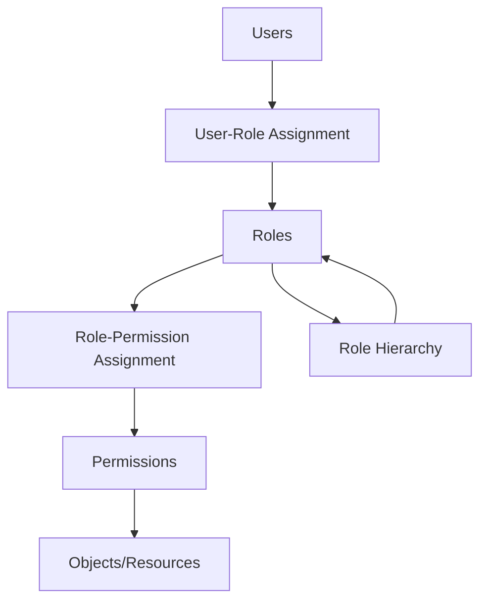
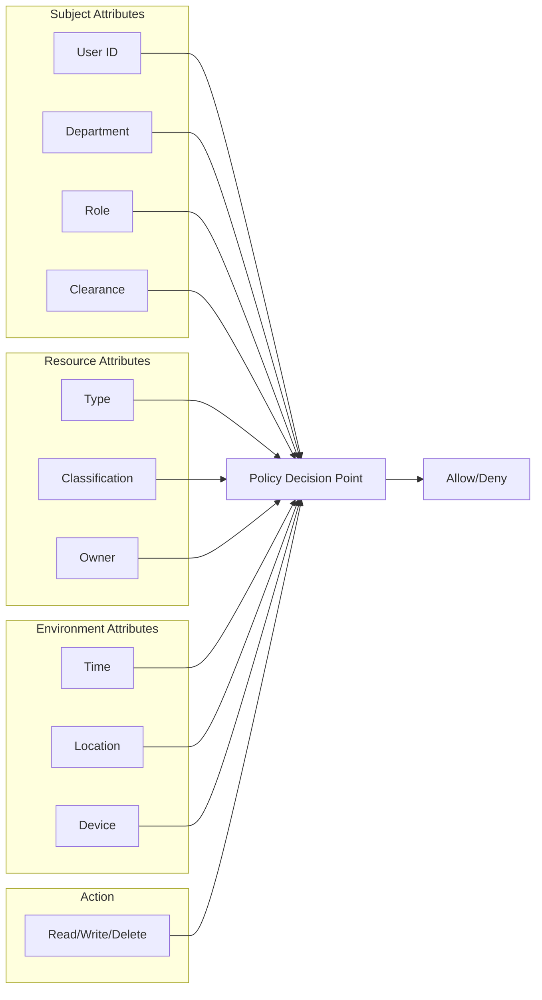
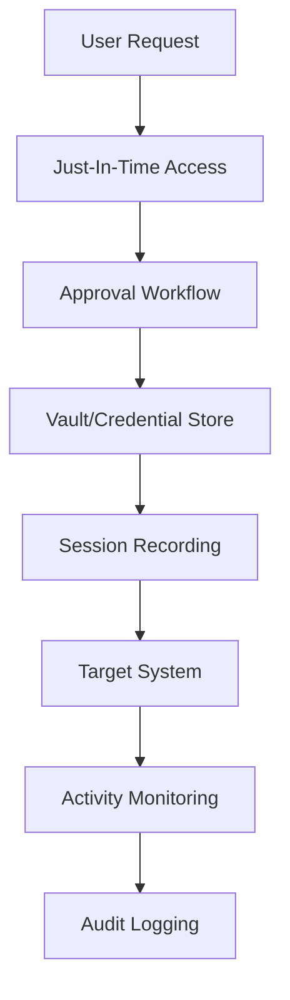

# 🔑 Access Control Patterns

**Author:** Asif Hussain  
**Version:** 1.0.0  
**Last Updated:** December 30, 2025  
**Status:** ✅ Active  
**Category:** Security Knowledge Library  

---

## 📋 Executive Summary

This document provides comprehensive patterns and implementation guidance for access control systems including RBAC, ABAC, and hybrid approaches. It covers authentication, authorization, session management, and privileged access management.

**Related Documents:**
- `data-protection-framework.md` - Data access controls
- `database-security-guide.md` - Database access
- `api-security-foundations.md` - API authorization

---

## 🎯 Access Control Models

### Model Comparison

| Model | Description | Best For | Complexity |
|-------|-------------|----------|------------|
| **RBAC** | Role-Based Access Control | Stable org structures | Medium |
| **ABAC** | Attribute-Based Access Control | Dynamic, fine-grained | High |
| **MAC** | Mandatory Access Control | Military, government | Very High |
| **DAC** | Discretionary Access Control | File systems | Low |
| **PBAC** | Policy-Based Access Control | Enterprise policy | High |
| **ReBAC** | Relationship-Based Access Control | Social platforms | Medium |

---

## 👥 RBAC (Role-Based Access Control)

### RBAC Model



### Role Design Principles

**Separation of Duties:**
| Conflicting Roles | Reason |
|------------------|--------|
| Requester / Approver | Prevent self-approval |
| Developer / Deployer | Prevent unauthorized deployments |
| Admin / Auditor | Independent oversight |
| Creator / Reviewer | Quality control |

**Least Privilege:**
```
✅ Grant minimum permissions needed
✅ Start with no access, add as needed
✅ Regular access reviews
❌ Avoid broad admin roles
❌ No standing privileged access
```

### Role Hierarchy Example

```yaml
roles:
  super_admin:
    inherits: [admin]
    permissions: [system.manage, users.delete]
    
  admin:
    inherits: [manager]
    permissions: [users.create, settings.manage]
    
  manager:
    inherits: [user]
    permissions: [reports.view, team.manage]
    
  user:
    permissions: [profile.view, profile.edit, data.read]
    
  guest:
    permissions: [public.view]
```

### RBAC Implementation

**Database Schema:**
```sql
-- Users table
CREATE TABLE users (
    id UUID PRIMARY KEY,
    username VARCHAR(255) UNIQUE NOT NULL,
    email VARCHAR(255) UNIQUE NOT NULL,
    created_at TIMESTAMP DEFAULT NOW()
);

-- Roles table
CREATE TABLE roles (
    id UUID PRIMARY KEY,
    name VARCHAR(100) UNIQUE NOT NULL,
    description TEXT,
    parent_role_id UUID REFERENCES roles(id)
);

-- Permissions table
CREATE TABLE permissions (
    id UUID PRIMARY KEY,
    name VARCHAR(100) UNIQUE NOT NULL,
    resource VARCHAR(100) NOT NULL,
    action VARCHAR(50) NOT NULL
);

-- User-Role mapping
CREATE TABLE user_roles (
    user_id UUID REFERENCES users(id),
    role_id UUID REFERENCES roles(id),
    granted_by UUID REFERENCES users(id),
    granted_at TIMESTAMP DEFAULT NOW(),
    expires_at TIMESTAMP,
    PRIMARY KEY (user_id, role_id)
);

-- Role-Permission mapping
CREATE TABLE role_permissions (
    role_id UUID REFERENCES roles(id),
    permission_id UUID REFERENCES permissions(id),
    PRIMARY KEY (role_id, permission_id)
);
```

**Authorization Check:**
```python
def check_permission(user_id: str, resource: str, action: str) -> bool:
    """Check if user has permission for resource action."""
    query = """
        SELECT 1 FROM users u
        JOIN user_roles ur ON u.id = ur.user_id
        JOIN roles r ON ur.role_id = r.id
        JOIN role_permissions rp ON r.id = rp.role_id
        JOIN permissions p ON rp.permission_id = p.id
        WHERE u.id = %s 
          AND p.resource = %s 
          AND p.action = %s
          AND (ur.expires_at IS NULL OR ur.expires_at > NOW())
        LIMIT 1
    """
    result = db.execute(query, (user_id, resource, action))
    return result is not None
```

---

## 📊 ABAC (Attribute-Based Access Control)

### ABAC Components



### ABAC Policy Example

```yaml
# XACML-style policy
policy:
  name: "Confidential Document Access"
  target:
    resource:
      type: "document"
      classification: "confidential"
  
  rules:
    - id: "rule-1"
      effect: "permit"
      description: "Allow managers to read confidential docs in their department"
      condition:
        all:
          - subject.role: "manager"
          - subject.department: "${resource.department}"
          - action: "read"
          - environment.time:
              between: ["09:00", "18:00"]
    
    - id: "rule-2"
      effect: "permit"
      description: "Allow document owners full access"
      condition:
        subject.id: "${resource.owner_id}"
    
    - id: "rule-3"
      effect: "deny"
      description: "Default deny"
```

### ABAC Implementation

```python
from dataclasses import dataclass
from typing import Any, Dict
from enum import Enum

class Effect(Enum):
    PERMIT = "permit"
    DENY = "deny"

@dataclass
class AccessRequest:
    subject: Dict[str, Any]  # User attributes
    resource: Dict[str, Any]  # Resource attributes
    action: str              # Requested action
    environment: Dict[str, Any]  # Context

class ABACEngine:
    def __init__(self, policies: list):
        self.policies = policies
    
    def evaluate(self, request: AccessRequest) -> bool:
        for policy in self.policies:
            if self._matches_target(policy, request):
                for rule in policy['rules']:
                    if self._evaluate_rule(rule, request):
                        return rule['effect'] == Effect.PERMIT.value
        return False  # Default deny
    
    def _evaluate_rule(self, rule: dict, request: AccessRequest) -> bool:
        condition = rule.get('condition', {})
        return self._evaluate_condition(condition, request)
    
    def _evaluate_condition(self, condition: dict, request: AccessRequest) -> bool:
        # Implementation of condition evaluation
        # Supports: all, any, not, comparison operators
        pass
```

---

## 🔐 Authentication

### Authentication Methods

| Method | Security Level | Use Case |
|--------|---------------|----------|
| Password | Low-Medium | Basic auth (with MFA) |
| MFA/2FA | Medium-High | Standard user access |
| SSO | Medium | Enterprise access |
| Certificate | High | Service-to-service |
| Biometric | High | Physical/device access |
| Passwordless | High | Modern authentication |

### MFA Implementation

**MFA Factors:**
| Factor | Type | Examples |
|--------|------|----------|
| Knowledge | Something you know | Password, PIN, security questions |
| Possession | Something you have | Phone, hardware token, smart card |
| Inherence | Something you are | Fingerprint, face, voice |
| Location | Somewhere you are | GPS, IP geolocation |
| Behavior | Something you do | Typing pattern, mouse movement |

**MFA Requirements by Risk:**
| Risk Level | MFA Requirement |
|------------|-----------------|
| Low | Optional (password acceptable) |
| Medium | Required (any 2 factors) |
| High | Required (phishing-resistant) |
| Critical | Hardware token + biometric |

### Password Policy

```yaml
password_policy:
  minimum_length: 12
  require_uppercase: true
  require_lowercase: true
  require_numbers: true
  require_special: true
  
  prohibited:
    - common_passwords: true
    - username_in_password: true
    - previous_passwords: 12
  
  expiration:
    days: 90  # Or never with MFA
    warning_days: 14
    
  lockout:
    max_attempts: 5
    lockout_duration_minutes: 30
    
  complexity_check:
    dictionary_check: true
    entropy_minimum: 50
```

---

## 🎫 Session Management

### Session Security

| Control | Implementation |
|---------|---------------|
| Session ID | Cryptographically random, 128+ bits |
| Storage | Server-side, encrypted |
| Transmission | HTTPS only, Secure cookie flag |
| Timeout | Idle: 15-30 min, Absolute: 8-24 hours |
| Regeneration | On authentication, privilege change |
| Invalidation | On logout, password change |

### JWT Best Practices

```python
import jwt
from datetime import datetime, timedelta

def create_access_token(user_id: str, roles: list) -> str:
    payload = {
        'sub': user_id,
        'roles': roles,
        'iat': datetime.utcnow(),
        'exp': datetime.utcnow() + timedelta(minutes=15),
        'jti': generate_unique_id()  # Prevent replay
    }
    return jwt.encode(payload, SECRET_KEY, algorithm='RS256')

def create_refresh_token(user_id: str) -> str:
    payload = {
        'sub': user_id,
        'iat': datetime.utcnow(),
        'exp': datetime.utcnow() + timedelta(days=7),
        'jti': generate_unique_id(),
        'type': 'refresh'
    }
    return jwt.encode(payload, REFRESH_SECRET, algorithm='RS256')
```

**JWT Security Checklist:**
- [ ] Use RS256 or ES256 (asymmetric)
- [ ] Short expiration (15 min access, 7 days refresh)
- [ ] Include `jti` for revocation
- [ ] Validate all claims
- [ ] Store refresh tokens securely
- [ ] Implement token rotation

---

## 👑 Privileged Access Management (PAM)

### PAM Controls



### PAM Requirements

| Control | Description |
|---------|-------------|
| **Credential Vaulting** | Store privileged credentials in secure vault |
| **Just-In-Time** | Grant access only when needed |
| **Session Recording** | Record all privileged sessions |
| **Approval Workflow** | Require approval for access |
| **Time-Limited** | Auto-expire access after duration |
| **Break-Glass** | Emergency access with extra logging |

### Privileged Account Types

| Account Type | Controls |
|--------------|----------|
| Domain Admin | Dedicated workstations, MFA, JIT |
| Database Admin | Vaulted credentials, session recording |
| Cloud Admin | Federated, MFA, time-limited |
| Application Admin | Role-based, least privilege |
| Service Accounts | Managed, rotated, monitored |

---

## 🔍 Access Reviews

### Review Schedule

| Access Type | Frequency | Reviewer |
|-------------|-----------|----------|
| Privileged | Monthly | Security + Manager |
| Sensitive Data | Quarterly | Data Owner |
| Standard | Semi-annually | Manager |
| Service Accounts | Quarterly | System Owner |
| Third-Party | Quarterly | Vendor Manager |

### Access Review Checklist

```markdown
## Access Review: [System/Application]
**Review Period:** [Date Range]  
**Reviewer:** [Name]  

### Users Reviewed
| User | Role | Last Activity | Decision | Justification |
|------|------|--------------|----------|---------------|
| [User] | [Role] | [Date] | Keep/Remove | [Reason] |

### Findings
- [ ] Orphaned accounts identified
- [ ] Excessive privileges found
- [ ] Inactive accounts flagged
- [ ] Separation of duties violations

### Actions
| Action | Owner | Due Date | Status |
|--------|-------|----------|--------|
| [Action] | [Name] | [Date] | [Status] |
```

---

## 📋 Compliance Mapping

| Control | GDPR | HIPAA | PCI-DSS | SOC2 |
|---------|------|-------|---------|------|
| Access Control | Art. 32 | §164.312 | Req 7-8 | CC6.1-6.3 |
| Authentication | Art. 32 | §164.312 | Req 8 | CC6.1 |
| Session Mgmt | Art. 32 | §164.312 | Req 8 | CC6.1 |
| PAM | Art. 32 | §164.312 | Req 7-8 | CC6.1-6.3 |
| Access Reviews | Art. 32 | §164.308 | Req 7 | CC6.2 |

---

## 📚 Resources

### Standards
- [NIST SP 800-162](https://csrc.nist.gov/publications/detail/sp/800-162/final) - ABAC Guide
- [NIST SP 800-63](https://pages.nist.gov/800-63-3/) - Digital Identity Guidelines

### Related Documents
- `data-protection-framework.md` - Data access
- `audit-logging-standards.md` - Access logging
- `api-security-foundations.md` - API authorization

---

## 📝 Document History

| Version | Date | Author | Changes |
|---------|------|--------|---------|
| 1.0.0 | 2025-12-30 | Asif Hussain | Initial patterns document |

---

*This document is part of the CORTEX Security Knowledge Library and should be reviewed annually.*
