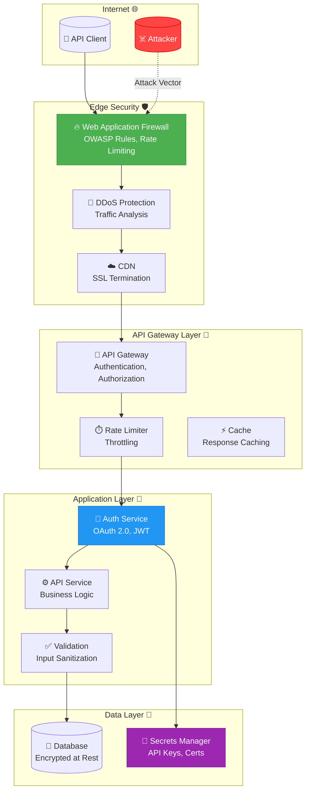
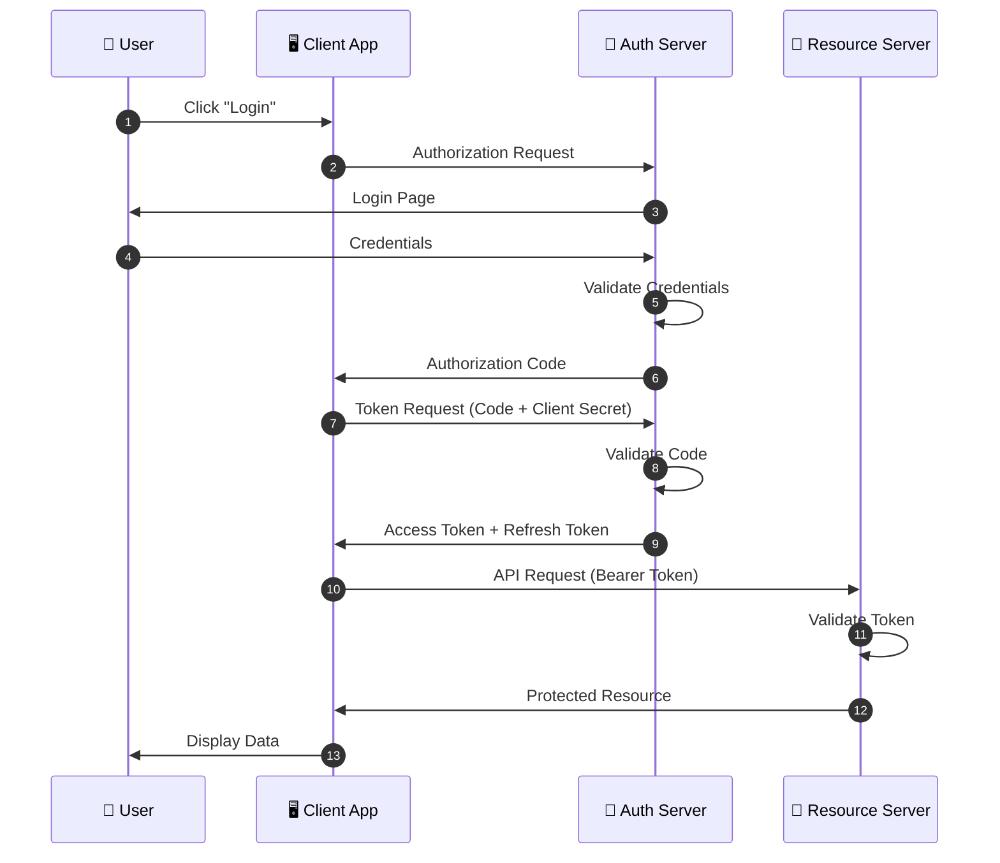
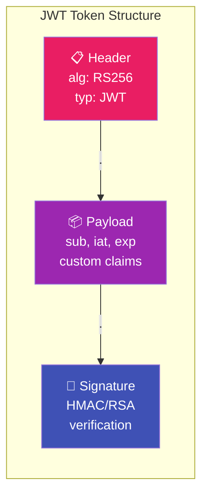
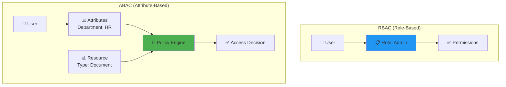
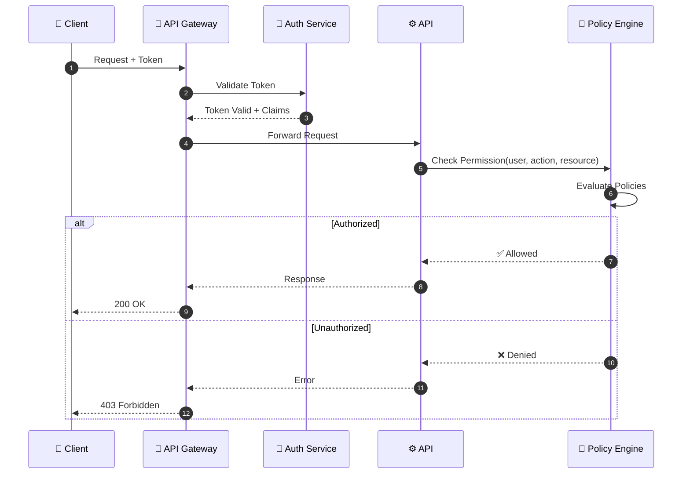
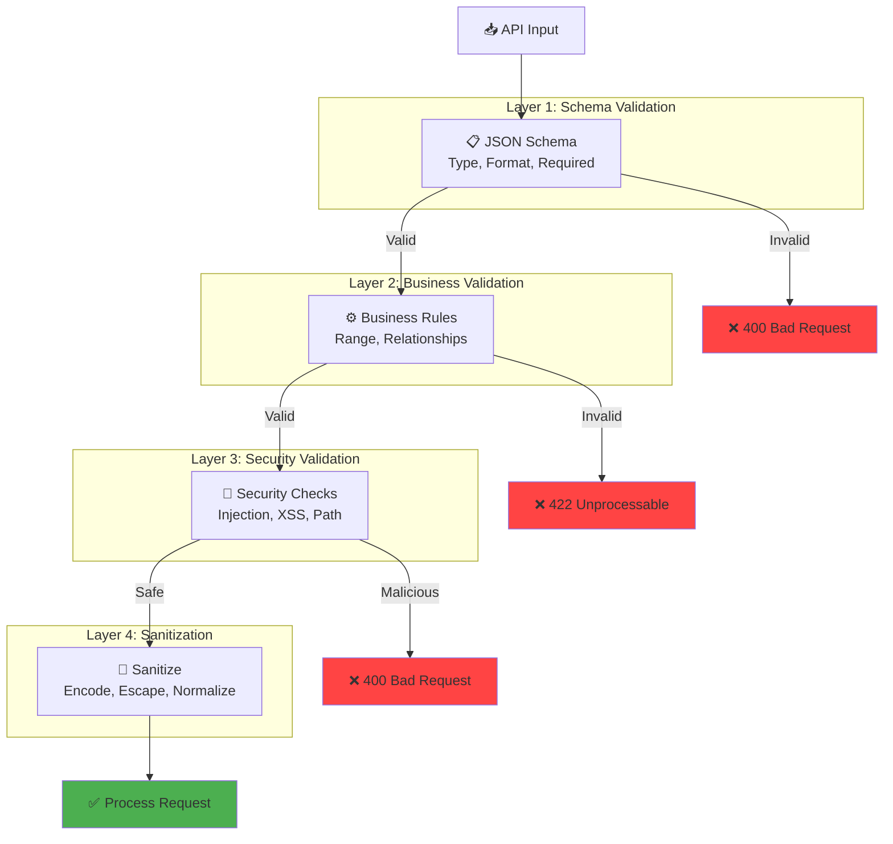
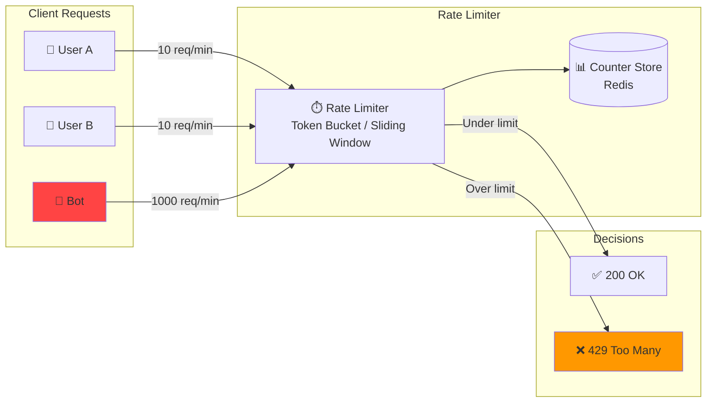
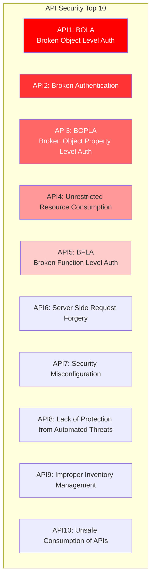
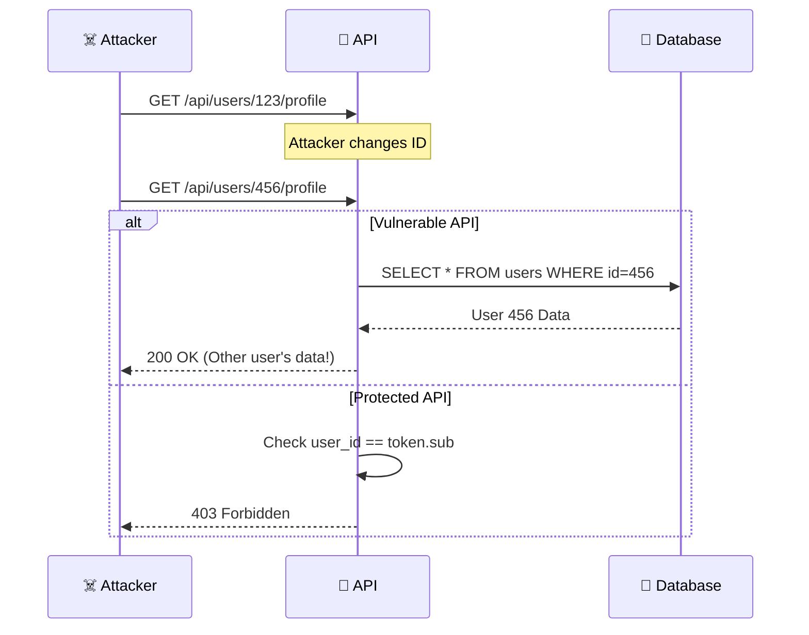
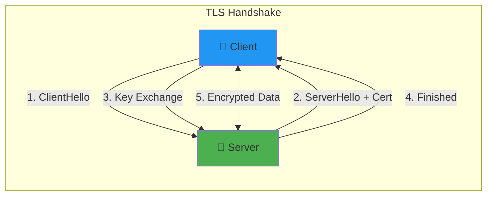

# 🔐 API Security Foundations

**Author:** Asif Hussain  
**Version:** 1.0.0  
**Last Updated:** December 30, 2025  
**Status:** ✅ Active  
**Category:** Security Knowledge Library  

---

## 📋 Executive Summary

This document provides comprehensive guidance on securing APIs, covering authentication, authorization, input validation, rate limiting, and common attack prevention. It incorporates the OWASP API Security Top 10 and provides practical implementation patterns.

**Related Documents:**
- `owasp-top-10-guide.md` - Web application vulnerabilities
- `threat-modeling-framework.md` - Threat analysis methodology
- `access-control-patterns.md` - Authorization patterns

---

## 🏗️ API Security Architecture

### Security Layers Overview



---

## 🔐 Authentication

### OAuth 2.0 Flow



### Token Types

| Token Type | Lifetime | Storage | Use Case |
|------------|----------|---------|----------|
| **Access Token** | 15-60 min | Memory | API authorization |
| **Refresh Token** | 7-30 days | Secure storage | Token renewal |
| **ID Token** | 15-60 min | Memory | User identity |
| **API Key** | Long-lived | Server config | Service-to-service |

### JWT Structure



### JWT Security Best Practices

```python
# ✅ Good: Strong algorithm, short expiry
jwt.encode(
    payload={
        "sub": user_id,
        "iat": datetime.utcnow(),
        "exp": datetime.utcnow() + timedelta(minutes=15),
        "iss": "https://api.example.com",
        "aud": "https://app.example.com"
    },
    key=private_key,
    algorithm="RS256"  # Asymmetric signing
)

# ❌ Bad: Weak algorithm, no expiry
jwt.encode({"user": user_id}, "weak_secret", algorithm="HS256")
```

---

## 🔓 Authorization

### RBAC vs ABAC



### Authorization Flow



---

## ✅ Input Validation

### Validation Layers



### Common Injection Prevention

| Attack | Prevention | Example |
|--------|------------|---------|
| **SQL Injection** | Parameterized queries | `cursor.execute("SELECT * FROM users WHERE id = ?", (user_id,))` |
| **NoSQL Injection** | Type validation | Reject `$where`, `$regex` in input |
| **XSS** | Output encoding | `html.escape(user_input)` |
| **Command Injection** | Avoid shell execution | Use subprocess with list args |
| **Path Traversal** | Normalize paths | `os.path.normpath(input)`, reject `..` |

### Validation Example

```python
from pydantic import BaseModel, Field, validator
import re

class UserCreateRequest(BaseModel):
    """Validated user creation request."""
    
    email: str = Field(..., max_length=254)
    username: str = Field(..., min_length=3, max_length=32)
    password: str = Field(..., min_length=12)
    
    @validator('email')
    def validate_email(cls, v):
        if not re.match(r'^[a-zA-Z0-9_.+-]+@[a-zA-Z0-9-]+\.[a-zA-Z0-9-.]+$', v):
            raise ValueError('Invalid email format')
        return v.lower()
    
    @validator('username')
    def validate_username(cls, v):
        if not re.match(r'^[a-zA-Z0-9_]+$', v):
            raise ValueError('Username must be alphanumeric')
        return v
    
    @validator('password')
    def validate_password(cls, v):
        if not re.search(r'[A-Z]', v):
            raise ValueError('Password must contain uppercase')
        if not re.search(r'[a-z]', v):
            raise ValueError('Password must contain lowercase')
        if not re.search(r'[0-9]', v):
            raise ValueError('Password must contain digit')
        if not re.search(r'[!@#$%^&*(),.?":{}|<>]', v):
            raise ValueError('Password must contain special char')
        return v
```

---

## ⏱️ Rate Limiting

### Rate Limiting Architecture



### Rate Limit Headers

```http
HTTP/1.1 200 OK
X-RateLimit-Limit: 100
X-RateLimit-Remaining: 95
X-RateLimit-Reset: 1640000000
Retry-After: 60
```

### Implementation Strategies

| Strategy | Description | Use Case |
|----------|-------------|----------|
| **Token Bucket** | Tokens replenish at fixed rate | Burst-tolerant limits |
| **Sliding Window** | Count requests in rolling window | Precise rate control |
| **Fixed Window** | Count in fixed time buckets | Simple implementation |
| **Leaky Bucket** | Constant output rate | Queue smoothing |

---

## 🔴 OWASP API Security Top 10 (2023)

### Threat Overview



### API1: Broken Object Level Authorization (BOLA)

**Threat:** Attacker manipulates object IDs to access unauthorized resources.



**Prevention:**

```python
# ✅ Correct: Verify ownership
@app.get("/api/users/{user_id}/profile")
async def get_profile(user_id: int, current_user: User = Depends(get_current_user)):
    if user_id != current_user.id and not current_user.is_admin:
        raise HTTPException(status_code=403, detail="Access denied")
    return await get_user_profile(user_id)

# ❌ Vulnerable: No ownership check
@app.get("/api/users/{user_id}/profile")
async def get_profile(user_id: int):
    return await get_user_profile(user_id)  # Anyone can access any profile!
```

---

## 🔒 Transport Security

### TLS Configuration



### Recommended TLS Settings

| Setting | Recommendation |
|---------|----------------|
| **Protocol** | TLS 1.2+ (prefer 1.3) |
| **Ciphers** | ECDHE+AESGCM, ECDHE+CHACHA20 |
| **Key Exchange** | ECDHE (X25519, P-256) |
| **HSTS** | Enabled, min 1 year |
| **Certificate** | Let's Encrypt or commercial CA |

---

## 📊 API Security Checklist

### Authentication ✅

- [ ] Use OAuth 2.0 / OpenID Connect
- [ ] Implement MFA for sensitive operations
- [ ] Use short-lived access tokens (15-60 min)
- [ ] Secure refresh token storage
- [ ] Invalidate tokens on logout

### Authorization ✅

- [ ] Implement RBAC or ABAC
- [ ] Check authorization at every endpoint
- [ ] Verify object ownership (prevent BOLA)
- [ ] Use principle of least privilege

### Input Validation ✅

- [ ] Validate all input against schemas
- [ ] Use parameterized queries
- [ ] Sanitize output to prevent XSS
- [ ] Reject unexpected fields

### Rate Limiting ✅

- [ ] Implement per-user rate limits
- [ ] Protect authentication endpoints
- [ ] Use exponential backoff for retries
- [ ] Return proper 429 responses

### Logging & Monitoring ✅

- [ ] Log all authentication events
- [ ] Log authorization failures
- [ ] Monitor for anomalies
- [ ] Alert on suspicious patterns

---

## 🔗 Integration with CORTEX

### Security Injection in Plans

When CORTEX Planning System detects API-related features, it automatically includes:

1. **Threat Model** - STRIDE analysis for API endpoints
2. **Security Tests** - Authentication/authorization test generation
3. **Security Documentation** - API security requirements

### Knowledge References

```yaml
# In planning_orchestrator.py
security_knowledge:
  api_security: "cortex-brain/knowledge-library/security/api-security-foundations.md"
  threat_modeling: "cortex-brain/knowledge-library/security/threat-modeling-framework.md"
  access_control: "cortex-brain/knowledge-library/security/access-control-patterns.md"
```

---

## 📚 References

- [OWASP API Security Top 10](https://owasp.org/API-Security/)
- [OAuth 2.0 RFC 6749](https://tools.ietf.org/html/rfc6749)
- [JWT RFC 7519](https://tools.ietf.org/html/rfc7519)
- [NIST API Security Guidelines](https://csrc.nist.gov/)

---

**Maintained by:** CORTEX Development Team  
**Last Updated:** December 30, 2025
