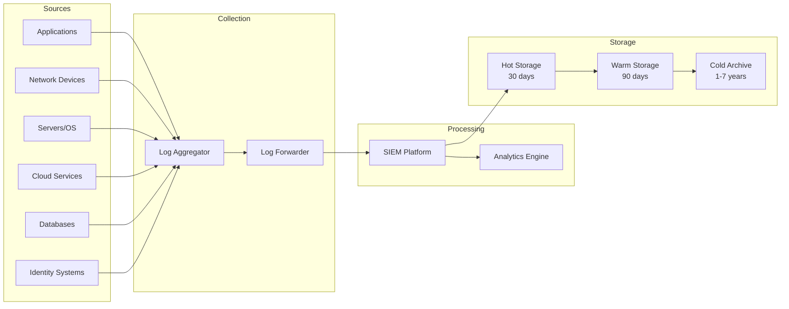
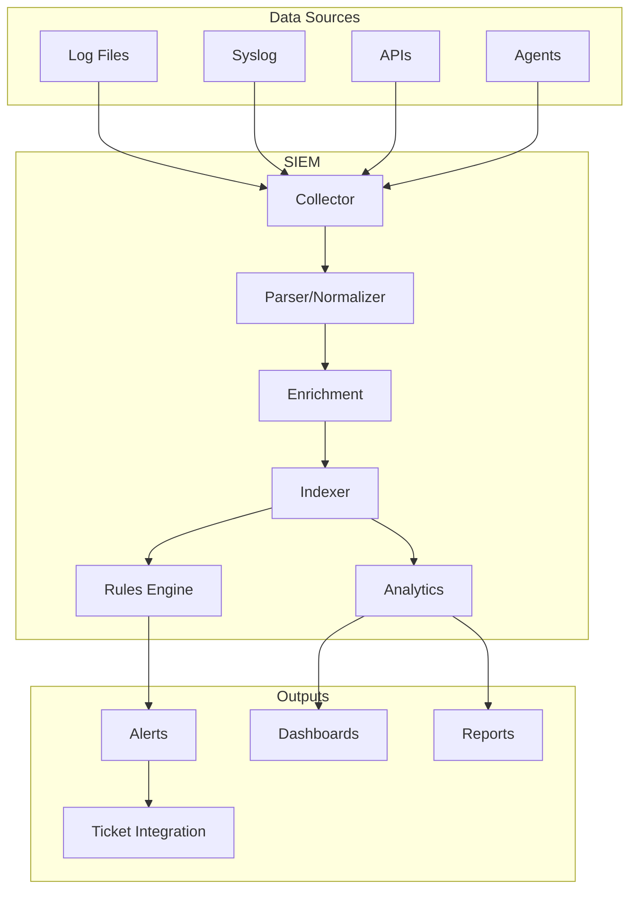

# 📝 Audit Logging Standards

**Author:** Asif Hussain  
**Version:** 1.0.0  
**Last Updated:** December 30, 2025  
**Status:** ✅ Active  
**Category:** Security Knowledge Library  

---

## 📋 Executive Summary

This document establishes comprehensive standards for security audit logging including what to log, log formats, retention requirements, SIEM integration, and compliance mapping. Proper audit logging is essential for incident detection, forensic investigation, and regulatory compliance.

**Related Documents:**
- `incident-response-playbook.md` - Log analysis during incidents
- `access-control-patterns.md` - Access logging requirements
- `data-protection-framework.md` - Data access logging

---

## 🎯 Logging Framework

### Logging Architecture



---

## 📋 What to Log

### Mandatory Events

| Category | Events | Priority |
|----------|--------|----------|
| **Authentication** | Login success/failure, logout, MFA events | Critical |
| **Authorization** | Access granted/denied, privilege changes | Critical |
| **Account Management** | Create, modify, delete, enable, disable | High |
| **Data Access** | Read, write, delete of sensitive data | High |
| **Configuration** | System/app config changes | High |
| **Security Events** | Alerts, violations, anomalies | Critical |
| **Administrative** | Admin actions, elevated commands | Critical |
| **Network** | Connections, firewall events, VPN | Medium |
| **Application** | Errors, transactions, business events | Medium |

### Event Details to Capture

**Minimum Required Fields:**
```json
{
  "timestamp": "2025-12-30T14:30:00.000Z",
  "event_type": "authentication.login.success",
  "severity": "info",
  "source": {
    "application": "web-portal",
    "hostname": "app-server-01",
    "ip": "10.1.1.50"
  },
  "actor": {
    "user_id": "u-12345",
    "username": "john.doe",
    "ip": "192.168.1.100",
    "user_agent": "Mozilla/5.0..."
  },
  "action": "login",
  "outcome": "success",
  "resource": {
    "type": "session",
    "id": "sess-abc123"
  },
  "details": {
    "auth_method": "mfa",
    "mfa_type": "totp"
  }
}
```

### Event-Specific Logging

**Authentication Events:**
| Event | Log Fields |
|-------|-----------|
| Login Success | User, timestamp, IP, method, session ID |
| Login Failure | User (if known), timestamp, IP, failure reason |
| Logout | User, session ID, duration |
| MFA Challenge | User, method, result |
| Password Change | User, success/failure, changed_by |
| Account Lockout | User, attempt count, lockout duration |

**Data Access Events:**
| Event | Log Fields |
|-------|-----------|
| Read | User, resource, fields accessed, query |
| Create | User, resource, data summary (no PII) |
| Update | User, resource, fields changed (before/after hash) |
| Delete | User, resource, reason |
| Export | User, data type, record count, destination |

---

## 📐 Log Format Standards

### Structured Logging (JSON)

```json
{
  "@timestamp": "2025-12-30T14:30:00.000Z",
  "@version": "1",
  "log_level": "INFO",
  "logger": "security.audit",
  "message": "User authentication successful",
  "event": {
    "category": "authentication",
    "type": "login",
    "outcome": "success"
  },
  "user": {
    "id": "u-12345",
    "name": "john.doe",
    "email": "john.doe@example.com",
    "roles": ["user", "analyst"]
  },
  "source": {
    "ip": "192.168.1.100",
    "geo": {
      "country": "US",
      "city": "New York"
    }
  },
  "host": {
    "name": "app-server-01",
    "ip": "10.1.1.50"
  },
  "service": {
    "name": "web-portal",
    "version": "2.1.0"
  },
  "trace_id": "abc123def456"
}
```

### Common Event Format (CEF)

```
CEF:0|Vendor|Product|Version|SignatureID|Name|Severity|Extension
CEF:0|CORTEX|SecurityApp|1.0|AUTH001|User Login Success|3|src=192.168.1.100 suser=john.doe outcome=success
```

### Syslog Format

```
<134>1 2025-12-30T14:30:00.000Z app-server-01 web-portal 12345 AUTH001 [auth user="john.doe" src="192.168.1.100"] User login successful
```

---

## ⏰ Log Retention

### Retention Requirements

| Log Type | Hot | Warm | Cold | Total |
|----------|-----|------|------|-------|
| Security/Audit | 30 days | 90 days | 7 years | 7+ years |
| Authentication | 30 days | 90 days | 3 years | 3+ years |
| Application | 30 days | 60 days | 1 year | 1+ year |
| Network | 30 days | 60 days | 1 year | 1+ year |
| Debug | 7 days | - | - | 7 days |

### Regulatory Requirements

| Regulation | Minimum Retention |
|------------|------------------|
| PCI-DSS | 1 year (3 months readily available) |
| HIPAA | 6 years |
| SOX | 7 years |
| GDPR | As long as necessary (document justification) |
| SOC2 | 1 year |

---

## 🔐 Log Protection

### Security Controls

| Control | Implementation |
|---------|---------------|
| **Integrity** | Write-once storage, checksums, signing |
| **Confidentiality** | Encryption at rest and in transit |
| **Availability** | Redundant storage, backup |
| **Access Control** | Least privilege, separate admin |
| **Non-repudiation** | Timestamping, chain of custody |

### Log Integrity

```python
import hashlib
import json

def create_log_entry_with_hash(log_entry: dict, previous_hash: str) -> dict:
    """Create tamper-evident log entry with chain hash."""
    log_entry['previous_hash'] = previous_hash
    
    # Create entry hash
    entry_string = json.dumps(log_entry, sort_keys=True)
    entry_hash = hashlib.sha256(entry_string.encode()).hexdigest()
    
    log_entry['entry_hash'] = entry_hash
    return log_entry
```

### Sensitive Data Handling

**DO NOT LOG:**
- Passwords or credentials
- Full credit card numbers
- Social Security Numbers
- API keys or secrets
- Session tokens
- Encryption keys

**Masking Examples:**
```python
def mask_sensitive_data(data: str, data_type: str) -> str:
    if data_type == "credit_card":
        return f"****-****-****-{data[-4:]}"
    elif data_type == "ssn":
        return f"***-**-{data[-4:]}"
    elif data_type == "email":
        name, domain = data.split("@")
        return f"{name[:2]}***@{domain}"
    return "***REDACTED***"
```

---

## 🔍 SIEM Integration

### SIEM Architecture



### Detection Rules

**Rule Categories:**
| Category | Examples |
|----------|----------|
| **Authentication** | Brute force, impossible travel, credential stuffing |
| **Authorization** | Privilege escalation, unauthorized access |
| **Data** | Large data export, unusual access patterns |
| **Malware** | Known IOCs, suspicious processes |
| **Network** | C2 communication, data exfiltration |

**Example Detection Rules:**
```yaml
# Brute Force Detection
- name: "Brute Force Login Attempt"
  condition: |
    event.type == "authentication.login.failure" AND
    count(event.user.ip) > 10 within 5 minutes
  severity: high
  response:
    - alert: security_team
    - action: block_ip

# Impossible Travel
- name: "Impossible Travel Detection"
  condition: |
    event.type == "authentication.login.success" AND
    geo_distance(previous_login.location, current_login.location) / 
    time_diff(previous_login.time, current_login.time) > 500 mph
  severity: high
  response:
    - alert: security_team
    - action: require_mfa

# Privilege Escalation
- name: "Privilege Escalation"
  condition: |
    event.type == "authorization.role.change" AND
    event.new_role IN ["admin", "super_admin"] AND
    event.actor != "system"
  severity: critical
  response:
    - alert: security_team
    - alert: management
```

---

## 📊 Monitoring & Alerting

### Alert Severity

| Severity | Response Time | Examples |
|----------|---------------|----------|
| Critical | Immediate | Active attack, data breach indicators |
| High | < 1 hour | Brute force, privilege abuse |
| Medium | < 4 hours | Policy violations, anomalies |
| Low | < 24 hours | Failed logins, minor violations |
| Info | Review | Metrics, trends |

### Key Metrics

| Metric | Description | Alert Threshold |
|--------|-------------|-----------------|
| Auth Failures/min | Failed login rate | > 100/min |
| Unique Source IPs | Attack surface | Unusual increase |
| Data Export Volume | Exfiltration risk | > baseline + 2σ |
| Admin Actions | Privileged activity | Outside hours |
| Error Rate | Application health | > 5% |

---

## 📋 Compliance Mapping

| Requirement | PCI-DSS | HIPAA | SOC2 | GDPR |
|-------------|---------|-------|------|------|
| Access Logging | 10.2.1-10.2.7 | §164.312 | CC7.2 | Art. 30 |
| Log Protection | 10.5 | §164.312 | CC7.2 | Art. 32 |
| Log Review | 10.6 | §164.308 | CC7.2 | Art. 32 |
| Retention | 10.7 | §164.530 | CC7.2 | Art. 5 |
| Time Sync | 10.4 | §164.312 | CC7.2 | - |

---

## 🛠️ Implementation Checklist

### Initial Setup
- [ ] Define logging requirements per system
- [ ] Configure log sources
- [ ] Establish log forwarding
- [ ] Set up SIEM/aggregation
- [ ] Create retention policies
- [ ] Implement log protection

### Ongoing Operations
- [ ] Daily: Review critical alerts
- [ ] Weekly: Review security dashboards
- [ ] Monthly: Audit log access
- [ ] Quarterly: Review detection rules
- [ ] Annually: Full logging audit

---

## 📚 Resources

### Standards
- [NIST SP 800-92](https://csrc.nist.gov/publications/detail/sp/800-92/final) - Log Management Guide
- [CIS Controls](https://www.cisecurity.org/controls) - Control 8: Audit Log Management

### Related Documents
- `incident-response-playbook.md` - Using logs for IR
- `soc2-compliance-checklist.md` - SOC2 logging requirements

---

## 📝 Document History

| Version | Date | Author | Changes |
|---------|------|--------|---------|
| 1.0.0 | 2025-12-30 | Asif Hussain | Initial standards document |

---

*This document is part of the CORTEX Security Knowledge Library and should be reviewed annually.*
