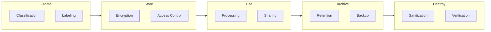

# 🔐 Data Protection Framework

**Author:** Asif Hussain  
**Version:** 1.0.0  
**Last Updated:** December 30, 2025  
**Status:** ✅ Active  
**Category:** Security Knowledge Library  

---

## 📋 Executive Summary

This framework establishes comprehensive guidelines for protecting data throughout its lifecycle—from creation to destruction. It covers data classification, encryption standards, access controls, retention policies, and secure disposal procedures.

**Related Documents:**
- `gdpr-compliance-checklist.md` - GDPR data requirements
- `database-security-guide.md` - Database protection
- `access-control-patterns.md` - Access management

---

## 🎯 Data Protection Lifecycle



---

## 📊 Data Classification

### Classification Levels

| Level | Description | Examples | Controls |
|-------|-------------|----------|----------|
| **Public** | No impact if disclosed | Marketing materials, public docs | Basic |
| **Internal** | Internal use only | Policies, procedures, org charts | Standard |
| **Confidential** | Significant impact | Financial data, contracts, HR data | Enhanced |
| **Restricted** | Severe impact | PII, PHI, PCI, credentials, secrets | Maximum |

### Classification Matrix

| Data Type | Classification | Encryption | Access | Retention |
|-----------|---------------|------------|--------|-----------|
| Customer PII | Restricted | Required | Need-to-know | Per regulation |
| Financial Records | Confidential | Required | Finance + Audit | 7 years |
| Employee HR Data | Restricted | Required | HR only | Employment + 7yr |
| Source Code | Confidential | In transit | Dev team | Indefinite |
| Marketing Content | Public | Optional | All employees | As needed |
| System Logs | Internal | At rest | IT/Security | 1 year |

### Data Labeling

**Label Format:**
```
[CLASSIFICATION] - [DATA OWNER] - [HANDLING INSTRUCTIONS]
```

**Examples:**
- `RESTRICTED - HR - Do Not Forward`
- `CONFIDENTIAL - Finance - Internal Use Only`
- `PUBLIC - Marketing - Approved for Distribution`

---

## 🔒 Encryption Standards

### Encryption Requirements

| Classification | At Rest | In Transit | Key Management |
|---------------|---------|------------|----------------|
| Public | Optional | Recommended | Standard |
| Internal | Recommended | Required | Standard |
| Confidential | Required | Required | Enhanced |
| Restricted | Required | Required | HSM/Strict |

### Algorithm Standards

| Use Case | Algorithm | Key Size | Notes |
|----------|-----------|----------|-------|
| Symmetric (data) | AES-256-GCM | 256-bit | Preferred for data at rest |
| Asymmetric (keys) | RSA | 2048+ bit | Key exchange |
| Asymmetric (modern) | ECDSA | P-256+ | Digital signatures |
| Hashing | SHA-256/512 | N/A | Integrity verification |
| Password | Argon2id | N/A | Password storage |
| TLS | TLS 1.3 | N/A | Data in transit |

### Deprecated/Prohibited

| ❌ Do NOT Use | Reason |
|---------------|--------|
| DES, 3DES | Weak, deprecated |
| MD5, SHA-1 | Collision vulnerabilities |
| RC4 | Known weaknesses |
| TLS 1.0, 1.1 | Deprecated, vulnerable |
| SSL | Obsolete |

### Key Management

**Key Lifecycle:**


**Key Management Requirements:**
| Requirement | Standard |
|-------------|----------|
| Generation | Cryptographically secure RNG |
| Storage | HSM or approved key vault |
| Rotation | Annual minimum (90 days for high-risk) |
| Access | Separation of duties |
| Backup | Encrypted, separate location |
| Destruction | Secure deletion with verification |

---

## 🗄️ Data Storage Security

### Storage Requirements

| Storage Type | Requirements |
|--------------|--------------|
| Databases | Encryption at rest, TDE, column-level for PII |
| File Systems | Encrypted volumes, access controls |
| Cloud Storage | Encryption, access policies, versioning |
| Backups | Encrypted, tested recovery, offsite |
| Archives | Encrypted, documented retention |

### Database Encryption

```sql
-- Example: SQL Server TDE
USE master;
CREATE MASTER KEY ENCRYPTION BY PASSWORD = 'StrongPassword123!';
CREATE CERTIFICATE TDECert WITH SUBJECT = 'TDE Certificate';

USE [TargetDatabase];
CREATE DATABASE ENCRYPTION KEY
WITH ALGORITHM = AES_256
ENCRYPTION BY SERVER CERTIFICATE TDECert;

ALTER DATABASE [TargetDatabase]
SET ENCRYPTION ON;
```

### Cloud Storage Security

| Control | AWS | Azure | GCP |
|---------|-----|-------|-----|
| Encryption | S3 SSE-S3/KMS | Storage Encryption | Cloud KMS |
| Access | IAM Policies | RBAC | IAM |
| Audit | CloudTrail | Monitor Logs | Audit Logs |
| Versioning | S3 Versioning | Blob Versioning | Object Versioning |

---

## 📤 Data Sharing & Transfer

### Sharing Requirements

| Classification | Internal | External | Third Party |
|---------------|----------|----------|-------------|
| Public | ✅ Allowed | ✅ Allowed | ✅ Allowed |
| Internal | ✅ Allowed | ⚠️ Approval | ⚠️ Approval + NDA |
| Confidential | ⚠️ Need-to-know | ⚠️ Approval + encryption | ⚠️ Contract + DPA |
| Restricted | ⚠️ Strict need | ❌ Generally prohibited | ❌ Prohibited |

### Transfer Security

| Method | Requirements |
|--------|--------------|
| Email | TLS required, encryption for confidential+ |
| File Transfer | SFTP, HTTPS only |
| API | TLS 1.3, API keys, OAuth |
| Physical Media | Encrypted, tracked, secure courier |
| Cloud Sync | Approved services only, encryption |

### Third-Party Requirements

**Data Processing Agreement (DPA) Requirements:**
- [ ] Purpose limitation defined
- [ ] Security requirements specified
- [ ] Subprocessor restrictions
- [ ] Breach notification obligations
- [ ] Audit rights included
- [ ] Data return/destruction terms

---

## 📅 Data Retention

### Retention Schedule

| Data Type | Retention Period | Legal Basis |
|-----------|-----------------|-------------|
| Financial Records | 7 years | Tax regulations |
| Employee Records | Employment + 7 years | Labor laws |
| Customer Data | Service + 3 years | Business/Legal |
| Healthcare (PHI) | 6 years | HIPAA |
| Payment Card | Transaction + 1 year | PCI-DSS |
| Audit Logs | 1-7 years | Compliance |
| Backups | 30-90 days active | Business continuity |

### Retention Policy Implementation

```markdown
# Data Retention Policy

## Automated Retention
- [ ] Configure retention policies in storage systems
- [ ] Set automatic expiration for temporary data
- [ ] Implement legal hold procedures

## Manual Review
- [ ] Quarterly review of retention compliance
- [ ] Annual policy review
- [ ] Exception documentation

## Hold Procedures
- [ ] Legal hold process documented
- [ ] Hold notification procedures
- [ ] Hold release and resumption
```

---

## 🗑️ Data Disposal

### Disposal Requirements

| Media Type | Method | Standard |
|------------|--------|----------|
| HDDs | Degaussing + physical destruction | DoD 5220.22-M |
| SSDs | Crypto-erase + physical destruction | NIST SP 800-88 |
| Tapes | Degaussing + shredding | NIST SP 800-88 |
| Paper | Cross-cut shredding | DIN 66399 |
| Cloud | Crypto-shredding, verified deletion | Provider process |
| Memory | Secure wipe on decommission | Power cycle + wipe |

### Disposal Verification

**Certificate of Destruction:**
```markdown
## Certificate of Data Destruction

**Date:** [Date]  
**Certificate #:** [COD-YYYY-NNN]  

### Assets Destroyed
| Asset ID | Description | Serial # | Method |
|----------|-------------|----------|--------|
| [ID] | [Description] | [Serial] | [Method] |

### Verification
- [ ] Data sanitization completed
- [ ] Physical destruction completed (if applicable)
- [ ] Witness verification obtained

**Performed By:** [Name/Company]  
**Witnessed By:** [Name]  
**Signature:** _____________  
```

---

## 🛡️ Data Loss Prevention (DLP)

### DLP Controls

| Control | Purpose | Implementation |
|---------|---------|----------------|
| Content Inspection | Detect sensitive data | Pattern matching, ML |
| Endpoint DLP | Control data on devices | Agent-based |
| Network DLP | Monitor data in transit | Gateway inspection |
| Cloud DLP | Protect cloud data | API integration |
| Email DLP | Scan outbound email | Mail gateway |

### DLP Rules

| Rule | Data Pattern | Action |
|------|-------------|--------|
| Credit Card | `\d{4}[-\s]?\d{4}[-\s]?\d{4}[-\s]?\d{4}` | Block + Alert |
| SSN | `\d{3}-\d{2}-\d{4}` | Block + Alert |
| API Keys | `[A-Za-z0-9]{32,}` | Alert |
| Passwords | `password\s*[:=]` | Alert |

---

## 📋 Compliance Mapping

| Control | GDPR | HIPAA | PCI-DSS | SOC2 |
|---------|------|-------|---------|------|
| Classification | Art. 5 | §164.312 | Req 9 | CC6.1 |
| Encryption | Art. 32 | §164.312 | Req 3-4 | CC6.1 |
| Access Control | Art. 25 | §164.312 | Req 7 | CC6.1-6.3 |
| Retention | Art. 5 | §164.530 | Req 3 | CC6.5 |
| Disposal | Art. 17 | §164.310 | Req 9 | CC6.5 |
| DLP | Art. 32 | §164.312 | Req 7 | CC6.7 |

---

## 📚 Resources

### Standards
- [NIST SP 800-88](https://csrc.nist.gov/publications/detail/sp/800-88/rev-1/final) - Media Sanitization
- [ISO 27001](https://www.iso.org/standard/27001) - Information Security

### Related Documents
- `gdpr-compliance-checklist.md` - GDPR requirements
- `database-security-guide.md` - Database protection
- `access-control-patterns.md` - Access management
- `audit-logging-standards.md` - Logging for data access

---

## 📝 Document History

| Version | Date | Author | Changes |
|---------|------|--------|---------|
| 1.0.0 | 2025-12-30 | Asif Hussain | Initial framework |

---

*This framework is part of the CORTEX Security Knowledge Library and should be reviewed annually.*
